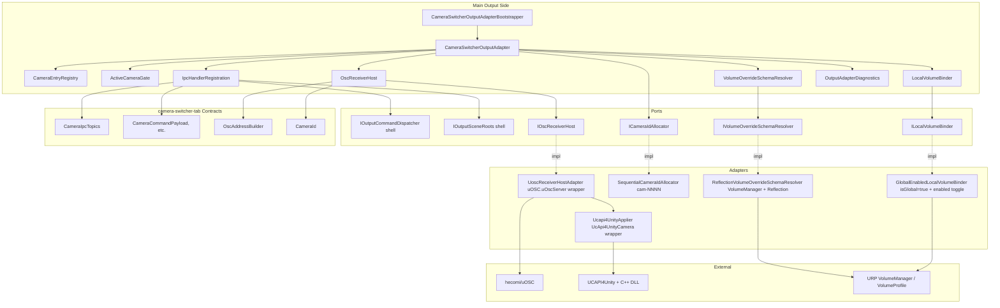
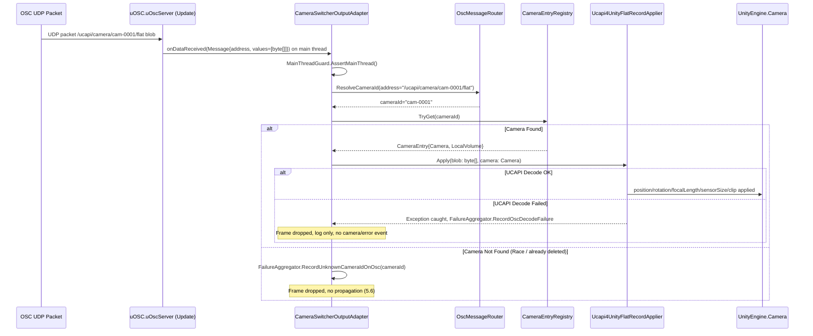
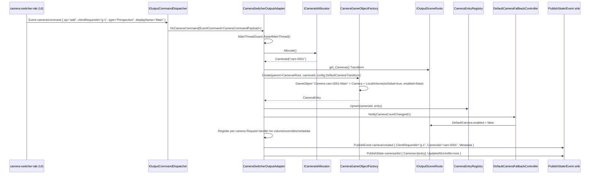
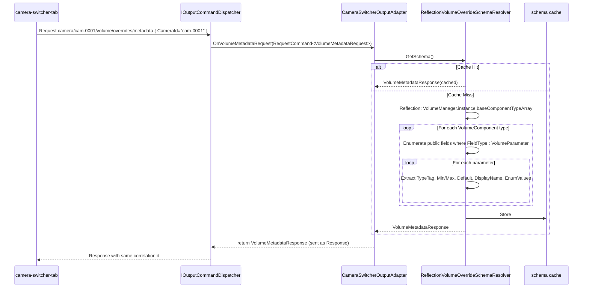
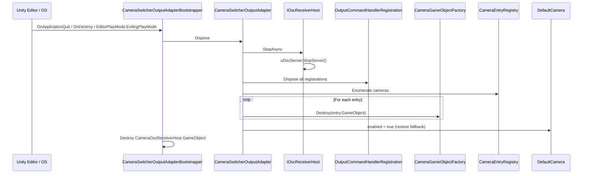
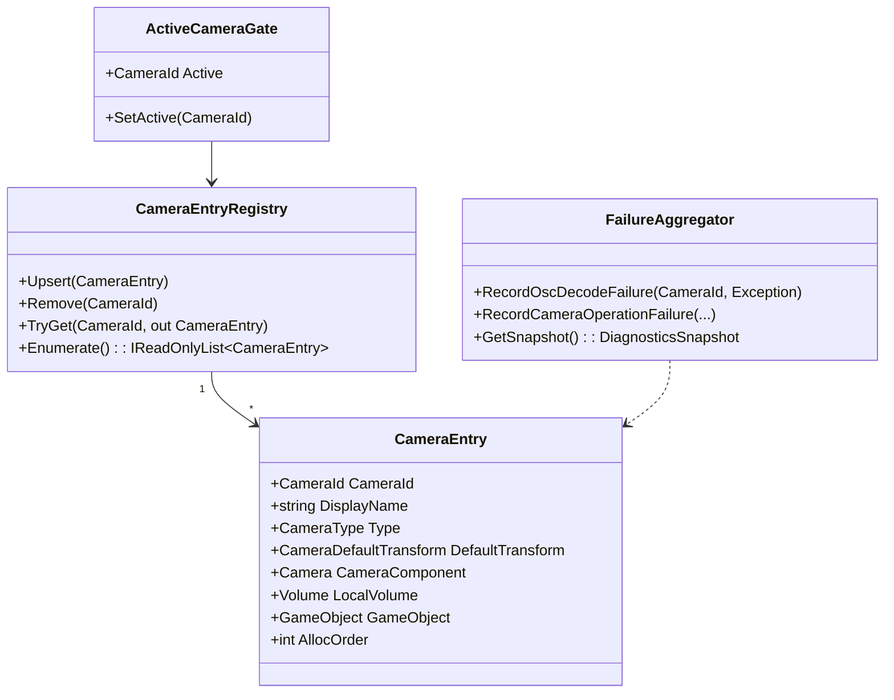
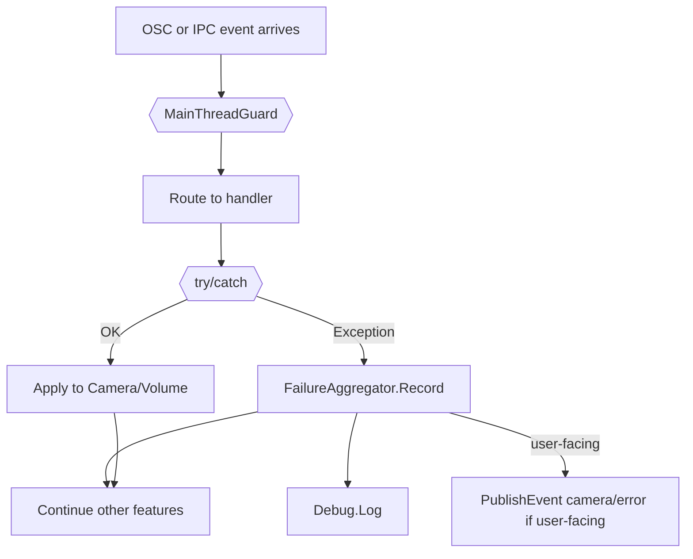

# Technical Design — camera-switcher-output-adapter

## Overview

**Purpose**: 本 spec は VTuberSystemBase の **camera-switcher-output-adapter（カメラ・Local Volume メイン出力側アダプタ）** を定義する。`camera-switcher-tab`（spec #6）の UI 側から流れる **OSC（UCAPI Flat Record）** と **IPC（WebSocket/JSON, core-ipc-foundation）** を、メイン出力シーン（`output-renderer-shell` の `CamerasRoot` / `VolumeRoot`）に存在する `UnityEngine.Camera` と URP `Volume` に反映する責務を持つ。OSC ライン（60 Hz の transform ストリーム）と IPC ライン（CRUD・Volume 編集・metadata Request）を独立に処理し、双方の障害が他方に波及しない設計（CSW-15）を採る。本フェーズは **差し替え可能な最小機能**（CSW-2）として実装し、将来の高機能スイッチャー差し替えに対して契約境界（OSC アドレス、IPC topic、cameraId 採番ルール）を維持する。

**Users**: 配信運用者（メイン出力カメラの実体を管理）、`camera-switcher-tab` 開発者（UI 側の対向としての本 spec 契約に依存）、利用者プロジェクト（`output-renderer-shell` のシーンに本 spec の Composition Root を組み込む）。

**Impact**: 現在 `output-renderer-shell` は `IOutputSceneRoots.DefaultCamera` を 1 台だけ提供し、`IOutputCommandDispatcher` の登録口だけを開いている。本 spec が `IOutputCommandDispatcher.RegisterStateHandler` / `RegisterEventHandler` / `RegisterRequestHandler` を介して `camera/command` / `camera/{id}/metadata/{key}` / `camera/{id}/volume/*` / `camera/{id}/volume/overrides/metadata` / `camera/preview/command` / `camera/preset/*` のハンドラを登録し、本 spec が所有する `uOSC.uOscServer` で `/ucapi/camera/{cameraId}/flat` を受信することで、UI から発信されるすべての操作がメイン出力に反映される。`DefaultCamera` は本 spec が 1 台目を追加した時点で `enabled=false` のフォールバックに退避する。

### Goals

- OSC `/ucapi/camera/{cameraId}/flat`（60 Hz 目安）を `uOSC.uOscServer` で受信し、`UCAPI4Unity.UcApi4UnityCamera.ApplyToCamera` で対応 cameraId の `Camera` に position / rotation / focalLength / sensorSize / clip / lensShift を適用する（Requirement 1, 2、CSW-6, CSW-8, CSW-9）。
- `IOutputCommandDispatcher` 経由で `camera/command`（add / delete / active-set, event）の処理、cameraId のメイン出力側採番（CSW-5、`cam-{NNNN}` 連番）、`Camera` GameObject の生成・破棄・enable 切替（CSO-7, CSO-9）、`camera/created` / `camera/error` の echo を提供する（Requirement 3）。
- `camera/{id}/metadata/{key}` を `Camera` プロパティ（displayName / type / defaultTransform）に反映し、`cameras/list` を再 publish する（Requirement 4, 5）。
- 各 Camera に紐づく **Local Volume**（`isGlobal=true` + `enabled` 切替方式、CSO-10）を所有し、`camera/{id}/volume/override/{type}/{param}` などの state を Reflection で `VolumeParameter<T>` に適用、`camera/{id}/volume/command override-add/remove` で `VolumeProfile.AddComponent<T>` / `Remove<T>` を実行、active-set 時に対応 Local Volume の `enabled` を 1 台のみ true に切替（Requirement 6, CSW-12）。
- `camera/{id}/volume/overrides/metadata` Request を Reflection で URP の `VolumeManager.instance.baseComponentTypeArray` から `VolumeMetadataResponse` を構築・キャッシュして返答（Requirement 7、CSO-11）。
- メインスレッド契約厳守（OSC 受信は uOSC の Update から、IPC 受信は core-ipc-foundation の D-3 から、いずれもメインスレッド配信、Requirement 10）。
- PlayMode 限定常駐（D-9、Requirement 11）、配信適合性（OR-1 / 5.6、Requirement 12）、本 spec 単独での検証可能性（Requirement 13）。
- 差し替え前提 API（CSW-2）：`ICameraIdAllocator` / `IOscReceiverHost` / `ILocalVolumeBinder` / `IVolumeOverrideSchemaResolver` を port として抽象化し、将来の高機能スイッチャー（PVW/PGM、トランジション）への差し替えに対して shell 側 API + 本 spec 契約を維持。

### Non-Goals

- UI 側のタブ機能（プレビュー UI、SceneViewStyleCameraController、UCAPI シリアライズ、OSC 送信、Local Volume 編集 UI、プリセット CRUD と永続化、`camera/preset/*` 永続化）は `camera-switcher-tab`（spec #6）の責務。
- `uOSC` パッケージ本体・`UCAPI4Unity` パッケージ本体・UCAPI C++ DLL の実装そのものは採用パッケージとしてそのまま使用。
- `core-ipc-foundation` のトランスポート / シリアライゼーション / メインスレッド配信実装（D-3 / D-5）は spec #1 の責務。
- `output-renderer-shell` のシーン骨格 / `OutputSceneBootstrapper` / `IOutputSceneRoots` 実装本体 / `DefaultCamera` 生成本体は spec #2 の責務。
- `IDisplayRoutingService` の本実装（`output-renderer-shell` の `BuiltInDisplayRoutingService` または Wave 3e の RDS 実装）は範囲外。本 spec は `Camera.targetDisplay` を直接書き換えない。
- 他タブ系 spec とその出力アダプタ（`character-selection-tab` / `rac-main-output-adapter` / `stage-lighting-volume-tab` / `stage-lighting-volume-output-adapter`）。
- トランジション・ディゾルブ・PVW/PGM のマルチカメラ・外部ハードウェアスイッチャー連携・タイムライン録画リプレイ（docs/requirements.md §5.3.4、本フェーズの非目標）。
- OSC のセキュリティ / 認証 / 暗号化（localhost 限定運用、上流方針継承）。
- プレビュー RenderTexture の本格実装（CSO-13、本フェーズではプレースホルダで凌ぐ）。

## Boundary Commitments

### This Spec Owns

- **OSC 受信パイプライン**: `uOSC.uOscServer` を所有する独立 GameObject `CameraOscReceiverHost` の生成と起動・停止・再起動、`/ucapi/camera/{cameraId}/flat` メッセージのアドレス分解と cameraId 抽出、blob を `UcApi4UnityCamera.ApplyToCamera` に渡す適用処理、CRC 失敗 / DLL 不在 / 未知 cameraId 等の例外捕捉と破棄（Requirement 1, 2）。
- **IPC ハンドラ登録**: `IOutputCommandDispatcher` 経由で `camera/command` / `camera/{id}/metadata/{key}` / `camera/{id}/volume/command` / `camera/{id}/volume/enabled` / `camera/{id}/volume/override/{type}/enabled` / `camera/{id}/volume/override/{type}/{param}` / `camera/{id}/volume/overrides/metadata` / `camera/preview/command` / `camera/preset/*` の購読と処理（Requirement 3, 5, 6, 7, 9）。
- **cameraId 採番**: `ICameraIdAllocator` 抽象（`cam-{NNNN}` 連番、削除しても再利用しない既定実装、CSO-6）。
- **Camera GameObject ライフサイクル**: `CamerasRoot` 配下に Camera を生成・破棄、`usePhysicalProperties=true` / デフォルト transform / 物理プロパティ初期値の設定、`DefaultCamera` のフォールバック切替（1 台目追加で false、全カメラ削除で true）（CSO-7, CSO-8）。
- **active-set 切替**: 対応 cameraId の `Camera.enabled=true`、他は `enabled=false`、`cameras/active` を権威 echo として publish（CSO-9, Requirement 3.6, 3.8, 4.6）。
- **Local Volume 連動**: 各 Camera GameObject の子に `Volume`（`isGlobal=true`、空 `VolumeProfile`）を持ち、active-set 時に対応 Camera の Volume.enabled のみ true（CSO-10, CSW-12, Requirement 6.7）。`VolumeProfile.AddComponent<T>` / `Remove<T>` / Reflection で `VolumeParameter<T>.value` 設定（Requirement 6.2〜6.5）。
- **Volume Override スキーマ Reflection**: `VolumeMetadataRequest` 応答で URP の `VolumeManager` から `VolumeComponent` 派生型を列挙し、`VolumeOverrideSchema` / `VolumeParamSchema` を構築、初回キャッシュ（CSO-11, Requirement 7）。
- **IPC 送信**: `cameras/list` / `cameras/active` / `camera/created` / `camera/error` / `camera/{id}/preview/handle` の発行（Requirement 4, 8）。
- **メインスレッド契約**: `MainThreadGuard.AssertMainThread()` を OSC / IPC 受信ハンドラ入口で実行、内部状態は単一スレッド前提（Requirement 10）。
- **ライフサイクル**: PlayMode 開始/停止に同期した起動・停止、ハンドル/購読の確実な解放（Requirement 11）、Edit モードでは起動しない（D-9）。
- **OSC 起動失敗のフェイルセーフ**: ポート占有等で起動失敗してもメイン出力描画を継続、IPC 経路は機能、UI 側に `camera/error { Reason: "OscStartupFailed" }` を通知（CSO-14, Requirement 12.4）。
- **配信適合性**: メイン出力サーフェスに UI / 警告 / デバッグオーバーレイを描画しない（OR-1 / 5.6、Requirement 12.1）。
- **本 spec 単独検証**: UI 側不在 / OSC 送信側不在のテストハーネス（同プロセス内 `uOscClient` で Flat Record 注入、Fake `IOutputCommandDispatcher` で IPC envelope 注入）。

### Out of Boundary

- UI 側のタブ機能（`camera-switcher-tab` 責務、CSW スコープ）。
- `uOSC` / `UCAPI4Unity` / UCAPI C++ DLL の実装本体。
- `core-ipc-foundation` のトランスポート / メインスレッド配信実装（spec #1）。
- `output-renderer-shell` のシーン骨格・`IOutputSceneRoots` 実装・`DefaultCamera` 生成（spec #2）。
- `IDisplayRoutingService` の実装（Wave 3e）と `Camera.targetDisplay` の直接操作。
- 他タブ系 spec とそのアダプタ。
- トランジション・PVW/PGM・外部スイッチャー連携・タイムライン録画リプレイ。
- プレビュー RenderTexture 本格実装（CSO-13、Wave 3 後段）。
- カメラ・Local Volume 設定の永続化（UI 側の `camera-switcher-tab` プリセット責務、CSW-13 / CSW-14）。

### Allowed Dependencies

- **`output-renderer-shell` の Abstractions asmdef**: `IOutputCommandDispatcher` / `IOutputSceneRoots` / `OutputSceneRootNames` / `StateCommand<T>` / `EventCommand<T>` / `RequestCommand<T>` / `OutputCommandHandlerRegistration`。
- **`core-ipc-foundation` の Abstractions asmdef**: `MessageEnvelope` / `MessageKind` / `IpcResult` / `IsExternalInit` / 必要に応じて `ICoreIpcBus`（送信用、shell 側で公開された API があればそれ経由が望ましい、未確定なら `IOutputCommandDispatcher` の応答シンク経路を活用）。
- **`camera-switcher-tab` の Contracts asmdef**: `VTuberSystemBase.CameraSwitcherTab.Contracts`（topic 定数 / DTO / `CameraId` / `OscAddressBuilder`）。Wave 3a で切り出し済み。
- **採用パッケージ**:
  - `com.hidano.uosc` v1.0.0+ — `uOscServer` MonoBehaviour、`Message` struct（PackageCache 確認済み）。
  - `com.hidano.ucapi4unity` 0.1.0-preview.1+ — `UcApi4UnityCamera.ApplyToCamera(byte[], Camera)`（PackageCache 確認済み）。
- **Unity 標準**: `UnityEngine.Camera`、`UnityEngine.Rendering.Volume` / `VolumeProfile` / `VolumeComponent` / `VolumeParameter<T>` / `VolumeManager`、`UnityEngine.GameObject`、`UnityEngine.Transform`、`UnityEngine.Application`。
- **.NET 標準**: `System.Reflection`（VolumeParameter スキーマ抽出）、`System.Text.Json`（envelope payload は shell 側で復号済み前提だが、JsonElement の値変換用）。

**Dependency Constraint**（禁止される依存）:
- `core-ipc-foundation` の **具体実装 asmdef** への直接参照（必ず `IOutputCommandDispatcher` 経由、または shell 側で公開される送信 API 経由）。
- `camera-switcher-tab` の Runtime / Domain / Editor / Tests asmdef への直接参照（**Contracts asmdef のみ参照可**）。
- 他タブ spec（`character-selection-tab` / `stage-lighting-volume-tab`）の asmdef、および他タブ出力アダプタ（`rac-main-output-adapter` / `stage-lighting-volume-output-adapter`）への参照（Wave 3c の各 spec は完全独立）。
- `UnityEditor.*` の Runtime コードからの参照（必要なら `#if UNITY_EDITOR` + 独立 Editor asmdef）。
- メイン出力サーフェスへの描画 API（`OnGUI` / `IMGUI` / `UIDocument` / `PanelSettings` 経由の Display 2+ への描画）（OR-1 / 5.6 構造禁止）。

### Revalidation Triggers

以下の変更は本 spec の実装と上下流（`camera-switcher-tab` の OSC 送信側 / `output-renderer-shell` のシーン骨格 / 利用者プロジェクトの Composition Root 配置）に再確認を強制する：

- **OSC アドレスプレフィクスの変更**（既定 `/ucapi/camera` → 他）：camera-switcher-tab 側の `OscAddressBuilder` と本 spec のアドレス分解の同期更新が必須。
- **OSC 受信ポート最終確定**（`docs/integration-plan.md` §7.2）：本 spec の既定値 `127.0.0.1:9000` の差し替え + camera-switcher-tab 側送信ポート設定の同期。
- **UCAPI Flat Record フォーマットバージョンの切替**（128 byte → 拡張版）：`UcApi4UnityCamera.ApplyToCamera` の API 互換性 / DLL 互換性の確認。
- **`camera/command` event payload スキーマの破壊的変更**（操作種別の enum 変更、必須フィールド追加）：本 spec のハンドラと UI 側送信の同期改修。
- **Local Volume の Reflection スキーマ生成（CSO-11）の変更**（URP API の `VolumeManager` / `VolumeParameter` 構造変更）：`VolumeOverrideSchemaResolver` の adapter 再実装。
- **`IOutputCommandDispatcher` の topic prefix サブスクライブ機能**（`camera/+/metadata/+` 相当）の有無確定：cameraId ごとに dynamic 登録 / 解除する実装か、prefix 1 つで済む実装かが切り替わる。
- **cameraId 採番ルールの変更**（`cam-{NNNN}` → 他）：CSW-5 と本 spec の `ICameraIdAllocator` 既定実装の同期。
- **active-set / Local Volume 連動の自動 vs 手動契約**（CSW-12 / Requirement 6.6, 6.7）の見直し：本 spec の連動ロジックと UI 側の `camera/{id}/volume/enabled` 送信ポリシーの同期。
- **プレビュー本格実装**（CSO-13 のプレースホルダ → 補助 Camera 立てる構造）：本 spec が新規 Camera を追加するため `MainOutputNoOverlayTests` の対象拡張。

## Architecture

### Existing Architecture Analysis

本 spec は Wave 3c のメイン出力アダプタ層として以下の既存アーキテクチャの上に乗る：

- **`core-ipc-foundation`（Wave 1, 完成）**：WebSocket/JSON、Unity メインスレッド配信、メイン出力サーバ、PublishState coalesce / PublishEvent FIFO、Request タイムアウト 5s、1 MB 上限、PlayMode 限定（D-9）を提供。
- **`output-renderer-shell`（Wave 1, 完成）**：`IOutputSceneRoots`（`Stage` / `Characters` / `Lights` / `Cameras` / `Volumes` Transform、`DefaultCamera`、`GlobalVolumeProfile`）、`IOutputCommandDispatcher`（topic/kind 別ハンドラ登録、例外捕捉、kind 二重検証）、`IDisplayRoutingService`、`IOutputDiagnostics` を提供。
- **`camera-switcher-tab` Contracts asmdef（Wave 3a, 完成）**：`CameraIpcTopics`（topic 定数 + Safe ヘルパ）、`OscAddressBuilder`（`/ucapi/camera/{cameraId}/flat` 組立、cameraId 文字種制約）、`CameraId` 値型、`CameraType` enum、`Payloads/*` DTO。本 spec はこれをそのまま参照する。
- **`uOSC` v1.0.0**（PackageCache 確認）：`uOscServer` MonoBehaviour（`port` 設定、`autoStart`、`onDataReceived`、`onServerStarted` / `onServerStopped`、`StartServer()` / `StopServer()`）、`Message` struct（`address` string、`values` object[]、blob は `byte[]` 要素）。`onDataReceived` は `MonoBehaviour.Update` で発火（メインスレッド配信）。
- **`UCAPI4Unity` 0.1.0-preview.1**（PackageCache 確認）：`UcApi4UnityCamera.ApplyToCamera(byte[], Camera)` で OSC blob を Camera に直接適用。`UcApi4UnityCamera.SerializeFromCamera(Camera)` で逆方向（UI 側でのみ使用）。CRC 検証は内部の `UcApiCore.DeserializeToRecord` が UCAPI C++ DLL 経由で行う。

本 spec はこれら既存資産の **上に乗るアダプタ** として、shell の `IOutputCommandDispatcher` と `IOutputSceneRoots`、Contracts の topic 定数 / DTO、採用パッケージの API のみを使って完結する。

### Architecture Pattern & Boundary Map

**選定パターン**: **Hexagonal（Ports & Adapters）**。中核ドメイン `CameraSwitcherOutputAdapter` がメイン出力側のカメラ・Volume 状態機械を保持し、port（`IOscReceiverHost` / `ICameraIdAllocator` / `ILocalVolumeBinder` / `IVolumeOverrideSchemaResolver` / shell が提供する `IOutputCommandDispatcher` / `IOutputSceneRoots`）を介して外界と相互作用する。Adapter 層は採用パッケージ（uOSC, UCAPI4Unity, URP `VolumeManager`）への薄いブリッジ。



**Architecture Integration**:

- **Selected pattern**: Hexagonal + State Machine。`CameraSwitcherOutputAdapter` が単一責務のドメイン層として全状態を保持、ports が外界との境界、adapters が採用パッケージへのブリッジ。
- **Domain/feature boundaries**: Adapter（状態機械・ビジネスルール）／Ports（I/O 抽象）／Adapters（具体実装）／IpcHandlers（shell `IOutputCommandDispatcher` への登録登録解除）／OscReceiver（uOSC 統合）の 5 区分。
- **Existing patterns preserved**:
  - `output-renderer-shell` の `IOutputCommandDispatcher` ハンドラ登録パターン、`OutputCommandHandlerRegistration.Dispose` によるライフサイクル制御。
  - `core-ipc-foundation` の D-3（メインスレッド）/ D-7（state coalesce）/ D-10（state/event 区別）/ D-9（PlayMode 限定）。
  - `output-renderer-shell` の OR-1（メイン出力に UI 描画禁止）/ OR-2（state last-write-wins）。
  - `camera-switcher-tab` の CSW-1〜CSW-16 すべて（特に CSW-5 cameraId 採番権限、CSW-6 OSC アドレス階層、CSW-9 60Hz 同期、CSW-12 active-set 連動 Volume）。
- **New components rationale**:
  - `CameraSwitcherOutputAdapter`: 状態機械の単一ソース、IPC ハンドラ / OSC ハンドラの調停。
  - `CameraEntryRegistry`: cameraId → CameraEntry（GameObject 参照、Camera コンポーネント、Local Volume）の内部インデックス。
  - `ActiveCameraGate`: active-set 切替の状態機械（Camera.enabled + Local Volume.enabled の連動切替）。
  - `LocalVolumeBinder`: Volume Override の追加削除と param 適用、Reflection 抽象。
  - `VolumeOverrideSchemaResolver`: Reflection スキーマ抽出（初回キャッシュ）。
  - `OscReceiverHost`: uOSC ライフサイクルと受信ハンドラ。
  - `IpcHandlerRegistration`: shell `IOutputCommandDispatcher` への登録ライフサイクル管理。
- **Steering compliance**: `.kiro/steering/` 未整備。`CLAUDE.md` の Spec-Driven Development、`docs/requirements.md` §5.3.3 第 4 項（適用）/ §5.3.5（Volume 連動）/ §6.1（メイン出力フレーム非干渉）/ §6.2（メイン出力に UI 描画禁止）に整合。

### Dependency Direction

```
camera-switcher-tab.Contracts (topics, payloads, CameraId)
    ↑
Abstractions (本 spec の port 抽象)
    ↑
Domain (CameraSwitcherOutputAdapter, Registry, ActiveCameraGate, FailureAggregator)
    ↑
Adapters (Ucapi4UnityApplier, UoscReceiverHostAdapter, Sequential allocator, GlobalEnabledLocalVolumeBinder, ReflectionSchemaResolver)
    ↑
Runtime / Composition Root (CameraSwitcherOutputAdapterBootstrapper MonoBehaviour)
```

- Contracts と Abstractions は何にも依存しない純 C# 抽象（Engine 参照は避けるが、`UnityEngine.Camera` 参照が必要な箇所は Domain / Adapter に閉じ込める）。
- Domain は Abstractions と camera-switcher-tab.Contracts のみに依存。
- Adapters は Domain + Abstractions + 採用パッケージ + Unity Engine + URP を参照。
- Composition Root は Domain + Adapters + shell の Abstractions（`IOutputCommandDispatcher` / `IOutputSceneRoots`）を全て参照する MonoBehaviour。

### Technology Stack

| Layer | Choice / Version | Role in Feature | Notes |
|-------|------------------|-----------------|-------|
| OSC Receiver | `com.hidano.uosc` v1.0.0 | UDP 受信、`uOscServer` MonoBehaviour | `onDataReceived` がメインスレッド配信（PackageCache 確認済み） |
| UCAPI Decoder | `com.hidano.ucapi4unity` 0.1.0-preview.1 | UCAPI Flat Record → Camera 適用 | `UcApi4UnityCamera.ApplyToCamera(byte[], Camera)` |
| IPC Dispatcher | `output-renderer-shell` の `IOutputCommandDispatcher` | shell 側で実装済み、本 spec はハンドラ登録のみ | spec #2 の責務、抽象 GUID 経由参照 |
| Scene Roots | `output-renderer-shell` の `IOutputSceneRoots` | `CamerasRoot` / `Volumes` Transform、`DefaultCamera` 参照 | spec #2 の責務、抽象 GUID 経由参照 |
| URP Volume | `com.unity.render-pipelines.universal` 17.x（Unity 6.3 同梱） | `Volume` / `VolumeProfile` / `VolumeManager` / `VolumeComponent` / `VolumeParameter<T>` | Reflection で `VolumeManager.instance.baseComponentTypeArray` 列挙 |
| IPC Contracts | `camera-switcher-tab` の Contracts asmdef | topic 定数 / Payload DTO / CameraId / OscAddressBuilder | Wave 3a 完成済み |
| Reflection Helper | .NET 標準 `System.Reflection` | VolumeParameter 派生型 / Min/Max 属性 / 既定値の抽出 | 初回キャッシュで 1 回限り |
| Assembly Boundaries | asmdef 5 分割 | Abstractions / Domain / Runtime / Editor / Tests.Runtime | 参照方向: Abstractions ← Domain ← Runtime ← Tests |
| Logging | `Debug.Log` / shell `IDiagnosticsLogger` 相当（実装時 shell 側 API 確認） | 診断ログ | メイン出力サーフェス非描画（OR-1） |

> 詳細な API 調査・代替案却下理由は実装時に research.md として補強する余地を残すが、本フェーズでは PackageCache 確認結果と上流 spec の design.md 参照で十分とする。

## File Structure Plan

### Directory Structure

```
Packages/com.hidano.vtuber-system-base.camera-switcher-output-adapter/
├── package.json
├── README.md                                      # 利用者向け概要 + 既定ポート（127.0.0.1:9000、仮置き）
├── Runtime/
│   ├── Abstractions/                              # 純 C# 抽象（asmdef #1）
│   │   ├── VTuberSystemBase.CameraSwitcherOutputAdapter.Abstractions.asmdef
│   │   ├── ICameraIdAllocator.cs                  # cameraId 採番 port
│   │   ├── IOscReceiverHost.cs                    # OSC 受信ライフサイクル + データ配信 port
│   │   ├── ILocalVolumeBinder.cs                  # Local Volume 操作 port（add/remove/enabled/param）
│   │   ├── IVolumeOverrideSchemaResolver.cs       # Reflection スキーマ抽出 port
│   │   ├── ICameraSwitcherOutputAdapterClock.cs   # 時刻 port（diagnostics 用、future）
│   │   ├── CameraEntry.cs                         # readonly struct: cameraId + Camera + LocalVolume + Metadata
│   │   ├── OscReceivedMessage.cs                  # readonly struct: cameraId + Blob (ReadOnlyMemory<byte>)
│   │   ├── OscReceiverHostStatus.cs               # enum: Stopped / Starting / Running / Failed
│   │   ├── CameraSwitcherOutputAdapterConfig.cs   # ScriptableObject: OSC host/port、デフォルト transform
│   │   └── Results/
│   │       ├── OscReceiverStartResult.cs          # Ok / Failure
│   │       └── VolumeBindResult.cs                # Ok / Error
│   ├── Domain/                                    # ドメイン状態機械（asmdef #2、Unity 非依存目標）
│   │   ├── VTuberSystemBase.CameraSwitcherOutputAdapter.Domain.asmdef
│   │   ├── CameraSwitcherOutputAdapter.cs         # 状態機械、IPC ハンドラ実装、OSC ハンドラ実装
│   │   ├── CameraEntryRegistry.cs                 # cameraId → CameraEntry のインデックス + 採番順管理
│   │   ├── ActiveCameraGate.cs                    # active-set 状態機械、Camera.enabled + Volume.enabled 連動
│   │   ├── CamerasListPublisher.cs                # cameras/list / cameras/active state 発行ロジック
│   │   ├── DefaultCameraFallbackController.cs     # DefaultCamera の enabled 切替（1 台目で false、全削除で true）
│   │   ├── FailureAggregator.cs                   # OSC / IPC / Reflection / VolumeBind 失敗の集約と camera/error 通知
│   │   ├── OscMessageRouter.cs                    # OSC アドレス分解と CameraEntry 解決
│   │   └── Results/
│   │       └── CameraOperationResult.cs
│   ├── Adapters/                                  # 採用パッケージのブリッジ（Runtime asmdef 内、Unity 依存）
│   │   ├── Ucapi/
│   │   │   ├── Ucapi4UnityFlatRecordApplier.cs    # UcApi4UnityCamera.ApplyToCamera を呼ぶ薄いラップ + 例外捕捉
│   │   │   └── FlatRecordAddressDecoder.cs        # /ucapi/camera/{cameraId}/flat → cameraId 抽出
│   │   ├── Osc/
│   │   │   ├── UoscReceiverHostAdapter.cs         # IOscReceiverHost 実装、uOscServer 所有
│   │   │   └── CameraOscReceiverHost.cs           # MonoBehaviour、uOscServer attach 先 GameObject
│   │   ├── Volume/
│   │   │   ├── GlobalEnabledLocalVolumeBinder.cs  # ILocalVolumeBinder 実装（isGlobal=true + enabled 切替方式、CSO-10）
│   │   │   ├── ReflectionVolumeOverrideSchemaResolver.cs  # VolumeManager Reflection でスキーマ抽出
│   │   │   ├── VolumeParameterValueWriter.cs      # JsonElement → VolumeParameter<T>.value の Reflection 設定
│   │   │   └── VolumeComponentTypeResolver.cs     # 型名 → Type 解決（VolumeManager.baseComponentTypeArray から）
│   │   ├── Allocator/
│   │   │   └── SequentialCameraIdAllocator.cs     # cam-{NNNN} 連番、削除しても再利用しない（CSO-6）
│   │   └── Time/
│   │       └── UnityClock.cs                      # ICameraSwitcherOutputAdapterClock 実装
│   ├── Runtime/                                   # MonoBehaviour 層 + Composition Root（asmdef #3、Unity 依存）
│   │   ├── VTuberSystemBase.CameraSwitcherOutputAdapter.Runtime.asmdef
│   │   ├── CameraSwitcherOutputAdapterBootstrapper.cs  # MonoBehaviour、Composition Root
│   │   ├── IpcHandlerRegistration.cs              # IOutputCommandDispatcher への登録/解除ライフサイクル
│   │   ├── CameraGameObjectFactory.cs             # CamerasRoot 配下に Camera GameObject + Local Volume を生成
│   │   ├── MainThreadGuard.cs                     # AssertMainThread 実装
│   │   └── Diagnostics/
│   │       └── CameraSwitcherOutputAdapterDiagnostics.cs  # 診断スナップショット API
├── Editor/
│   ├── VTuberSystemBase.CameraSwitcherOutputAdapter.Editor.asmdef
│   └── CameraSwitcherOutputAdapterConfigEditor.cs # ScriptableObject Inspector（任意）
├── Samples~/
│   └── MockedOscSenderSample/
│       ├── MockedOscSender.unity                  # 手動検証用シーン（uOscClient + 本 spec 起動）
│       ├── MockedOscSenderTest.cs                 # uOscClient で /ucapi/camera/cam-0001/flat に Flat Record を送信
│       └── README.md                              # 手順
└── Tests/
    ├── Runtime/
    │   ├── VTuberSystemBase.CameraSwitcherOutputAdapter.Tests.Runtime.asmdef
    │   ├── CameraSwitcherOutputAdapterStateTests.cs    # add → cameraId 採番 → camera/created echo
    │   ├── ActiveCameraGateTests.cs                    # active-set → Camera.enabled / Volume.enabled 切替
    │   ├── OscMessageRouterTests.cs                    # アドレス分解 → cameraId 抽出
    │   ├── Ucapi4UnityFlatRecordApplierTests.cs        # 例外捕捉、未知 cameraId 破棄
    │   ├── ReflectionVolumeOverrideSchemaResolverTests.cs  # URP Volume 派生型の Reflection 抽出
    │   ├── GlobalEnabledLocalVolumeBinderTests.cs      # AddComponent / Remove / param 設定
    │   ├── SequentialCameraIdAllocatorTests.cs         # cam-0001 / cam-0002 / 連番枯渇前の動作
    │   ├── PlayModeLifecycleTests.cs                   # 5 回繰返しでリーク無し
    │   ├── OscLoopbackIntegrationTests.cs              # uOscClient → 本 spec → Camera 適用 1000 件 / 60Hz
    │   ├── IpcHandlerIntegrationTests.cs               # Fake IOutputCommandDispatcher 経由の全ハンドラ網羅
    │   ├── FailsafeTests.cs                            # OSC 起動失敗 + IPC 経路継続、IPC 例外 + 他処理継続
    │   └── Fakes/
    │       ├── FakeOutputCommandDispatcher.cs          # IOutputCommandDispatcher のテストダブル
    │       ├── FakeOutputSceneRoots.cs                 # IOutputSceneRoots のテストダブル
    │       ├── FakeCameraIdAllocator.cs                # 固定値 / 任意採番ダブル
    │       ├── FakeOscReceiverHost.cs                  # 受信メッセージ手動注入
    │       ├── FakeLocalVolumeBinder.cs
    │       └── FakeVolumeOverrideSchemaResolver.cs
    └── Editor/
        └── VTuberSystemBase.CameraSwitcherOutputAdapter.Tests.Editor.asmdef
```

### Modified Files

- `Packages/com.hidano.vtuber-system-base.camera-switcher-tab/Runtime/Contracts/`：**変更しない**。Wave 3a で切り出された Contracts asmdef をそのまま参照する。
- `Packages/com.hidano.vtuber-system-base.output-renderer-shell/`：**変更しない**。`IOutputCommandDispatcher` / `IOutputSceneRoots` の公開 API のみ利用する（Wave 3e で `IDisplayRoutingService` の RDS 実装が追加される可能性はあるが本 spec とは独立）。

**Dependency direction**（asmdef 参照関係）:
- `Abstractions` asmdef: 純 C# 抽象（一部 `UnityEngine.Camera` 等を参照する port は engine 参照あり）、本 spec 外への参照なし。
- `Domain` asmdef: `Abstractions` + `camera-switcher-tab.Contracts` + `output-renderer-shell.Abstractions` + `core-ipc-foundation.Abstractions` を参照。
- `Runtime` asmdef: `Abstractions` + `Domain` + `output-renderer-shell.Abstractions` + `core-ipc-foundation.Abstractions` + `camera-switcher-tab.Contracts` + `com.hidano.uosc` + `com.hidano.ucapi4unity` + Unity Engine + URP を参照。
- `Editor` asmdef: `Abstractions` + `Domain` + `Runtime` を `#if UNITY_EDITOR` 経由で参照（任意）。
- `Tests.Runtime` asmdef: `Abstractions` + `Domain` + `Runtime` + `output-renderer-shell.Abstractions` + Unity Test Framework + `com.hidano.uosc`（ループバック送信用）+ `com.hidano.ucapi4unity`（テスト用ダミー Flat Record 生成）を参照。

> File Structure Plan の各パスは Components and Interfaces セクションの各コンポーネントと 1:1 で対応する。

## System Flows

### Flow 1: 起動 → IPC ハンドラ登録 → OSC サーバ起動 → 初期 cameras/list publish

```mermaid
sequenceDiagram
    participant Bootstrap as OutputSceneBootstrapper
    participant CompRoot as CameraSwitcherOutputAdapterBootstrapper
    participant Adapter as CameraSwitcherOutputAdapter
    participant Dispatcher as IOutputCommandDispatcher
    participant Roots as IOutputSceneRoots
    participant OscHost as IOscReceiverHost (uOSC)
    participant IpcSink as PublishState/Event sink

    Bootstrap-->>CompRoot: OutputSceneInitPhase.Completed
    CompRoot->>Adapter: Initialize(dispatcher, roots, allocator, oscHost, schemaResolver, volumeBinder, config, diagnosticsLogger)
    Adapter->>Dispatcher: RegisterEventHandler<CameraCommandPayload>(camera/command)
    Adapter->>Dispatcher: RegisterRequestHandler<VolumeMetadataRequest, VolumeMetadataResponse>(per-camera registered later)
    Adapter->>Dispatcher: RegisterEventHandler<PreviewCommandPayload>(camera/preview/command)
    Adapter->>Dispatcher: RegisterEventHandler<*>(camera/preset/command, observation only)
    Adapter->>OscHost: StartAsync(host=127.0.0.1, port=9000)
    alt OSC Start OK
        OscHost-->>Adapter: OscReceiverStartResult.Ok
    else OSC Start Failed
        OscHost-->>Adapter: OscReceiverStartResult.Failure(detail)
        Adapter->>IpcSink: PublishEvent camera/error { Reason="OscStartupFailed", Detail }
        Note over Adapter: IPC handlers stay registered; OSC reception disabled
    end
    Adapter->>IpcSink: PublishState cameras/list { Cameras=[], UpdatedAtUnixMs=now }
    Adapter->>IpcSink: PublishState cameras/active { ActiveCameraId=null }
```

**Key decisions**:
- `OutputSceneBootstrapper` 完了後に Composition Root が起動（CSO-14）。
- IPC ハンドラ登録 → OSC 起動 → 初期 publish の順序を厳守（Requirement 11.1）。
- OSC 起動失敗時もメイン出力描画と IPC 経路は継続（CSO-14、CSW-15）。

### Flow 2: OSC 受信 → cameraId 抽出 → CameraEntry 解決 → UcApi4UnityCamera.ApplyToCamera



**Key decisions**:
- メインスレッド配信は uOSC の Update から（CSO-3）。本 spec で再 marshal しない。
- `byte[]` の追加コピーを避けて GC アロケーションを抑える（CSO-4）。
- 未知 cameraId は破棄してログのみ（5.6, Requirement 2.2）。
- UCAPI デコード例外は当該フレームを破棄、ログ、`camera/error` event は出さない（OSC 失敗を毎回 UI に通知すると音量過多、Requirement 2.4 / 12.2）。

### Flow 3: camera/command add → cameraId 採番 → Camera/Volume 生成 → camera/created echo + cameras/list



**Key decisions**:
- メイン出力側で cameraId 採番（CSW-5）。
- `DefaultCamera` を 1 台目追加時に `enabled = false` に切替（CSO-7、フォールバック扱い）。
- `cameras/list` は採番順で固定（Requirement 4.3）。
- per-camera Request ハンドラ登録は cameraId 確定後（topic prefix サブスクライブが shell 側で未対応の場合の代替、R-CSO-3 で再確認）。

### Flow 4: camera/command active-set → Camera.enabled + Local Volume.enabled 連動切替

```mermaid
sequenceDiagram
    participant UI as camera-switcher-tab
    participant Dispatcher as IOutputCommandDispatcher
    participant Adapter as CameraSwitcherOutputAdapter
    participant Active as ActiveCameraGate
    participant Registry as CameraEntryRegistry
    participant Sink as PublishState/Event sink

    UI->>Dispatcher: Event camera/command { op="active-set", cameraId="cam-0002" }
    Dispatcher->>Adapter: OnCameraCommand(EventCommand<CameraCommandPayload>)
    Adapter->>Active: SetActive(CameraId("cam-0002"))
    Active->>Registry: Enumerate
    loop For each entry
        alt entry.CameraId == "cam-0002"
            Active->>entry: Camera.enabled = true; LocalVolume.enabled = true
        else
            Active->>entry: Camera.enabled = false; LocalVolume.enabled = false
        end
    end
    Active-->>Adapter: completed
    Adapter->>Sink: PublishState cameras/active { ActiveCameraId="cam-0002", UpdatedAtUnixMs=now }
    loop For each entry
        Adapter->>Sink: PublishState camera/{id}/volume/enabled { enabled = entry.LocalVolume.enabled }
    end
```

**Key decisions**:
- Camera.enabled と LocalVolume.enabled を 1 ステップで切替（CSO-9 / CSO-10、CSW-12 自動連動）。
- `cameras/active` は出力→UI の権威 echo として publish（Requirement 3.8）。
- 各カメラの Volume.enabled を全カメラ分 publish して UI 側の `camera/{id}/volume/enabled` state を最新化（Requirement 6.7、UI 側が手動 enabled トグルとサーバ自動切替の両立を表示できるようにする）。

### Flow 5: camera/{id}/volume/overrides/metadata Request → Reflection スキーマ → Response



**Key decisions**:
- スキーマは静的（URP のロード後に変わらない）→ 初回 Request で 1 回だけ Reflection、以降キャッシュ（CSO-11、Requirement 7.5）。
- 例外時は空 schema を返して UI 側で縮退表示（Requirement 7.8）。

### Flow 6: PlayMode Stop → 解放シーケンス



**Key decisions**:
- 逆順で解放（OSC 停止 → IPC 解除 → Camera 破棄、Requirement 11.2）。
- DefaultCamera の `enabled = true` への復帰で shell の不変条件を維持（CSO-7）。

## Requirements Traceability

| Requirement | Summary | Components | Interfaces | Flows |
|-------------|---------|------------|------------|-------|
| 1.1 | uOscServer 所有と GameObject 生成 | UoscReceiverHostAdapter, CameraOscReceiverHost | IOscReceiverHost | Flow 1 |
| 1.2 | OSC ポート設定 | CameraSwitcherOutputAdapterConfig, UoscReceiverHostAdapter | — | Flow 1 |
| 1.3 | IPC 登録完了後に OSC 起動 | CameraSwitcherOutputAdapterBootstrapper, CameraSwitcherOutputAdapter | — | Flow 1 |
| 1.4 | OSC 起動失敗時のフェイルセーフ | CameraSwitcherOutputAdapter, FailureAggregator | — | Flow 1 |
| 1.5 | PlayMode 終了時の OSC 解放 | UoscReceiverHostAdapter, CameraSwitcherOutputAdapterBootstrapper | — | Flow 6 |
| 1.6 | PlayMode 繰返しでクリーン再初期化 | PlayModeLifecycleTests, all Disposables | — | Flow 6 |
| 1.7 | Edit モードでは起動しない | CameraSwitcherOutputAdapterBootstrapper | — | — |
| 1.8 | OSC 受信のメインスレッド配信に従属 | UoscReceiverHostAdapter | IOscReceiverHost | Flow 2 |
| 1.9 | 不一致アドレスの破棄 | OscMessageRouter, FlatRecordAddressDecoder | — | Flow 2 |
| 2.1 | OSC アドレスから cameraId 抽出 | OscMessageRouter, FlatRecordAddressDecoder | — | Flow 2 |
| 2.2 | 未知 cameraId 破棄 | CameraSwitcherOutputAdapter, CameraEntryRegistry | — | Flow 2 |
| 2.3 | byte[] を ApplyToCamera に渡す（コピー無し） | Ucapi4UnityFlatRecordApplier | — | Flow 2 |
| 2.4 | UCAPI デコード例外捕捉 | Ucapi4UnityFlatRecordApplier, FailureAggregator | — | Flow 2 |
| 2.5 | last-write-wins | CameraSwitcherOutputAdapter | — | Flow 2 |
| 2.6 | UCAPI CameraNo は使わない | Ucapi4UnityFlatRecordApplier | — | Flow 2 |
| 2.7 | メインスレッド契約 | CameraSwitcherOutputAdapter, MainThreadGuard | — | Flow 2 |
| 2.8 | メイン出力フレーム非干渉 | All Components (GC アロケーション抑制) | — | — |
| 2.9 | 60Hz 1000 件損失なし | UoscReceiverHostAdapter, OscLoopbackIntegrationTests | — | Flow 2 |
| 3.1 | camera/command Event 登録 | IpcHandlerRegistration | IOutputCommandDispatcher | Flow 3 |
| 3.2 | add で cameraId 採番 + GameObject 生成 | CameraSwitcherOutputAdapter, ICameraIdAllocator, CameraGameObjectFactory | ICameraIdAllocator | Flow 3 |
| 3.3 | camera/created echo | CameraSwitcherOutputAdapter, CamerasListPublisher | — | Flow 3 |
| 3.4 | add 失敗時の camera/error | FailureAggregator | — | Flow 3 |
| 3.5 | delete 処理 | CameraSwitcherOutputAdapter, CameraEntryRegistry, CameraGameObjectFactory | — | — |
| 3.6 | active-set で enabled 切替 | ActiveCameraGate | — | Flow 4 |
| 3.7 | active-set 未知 cameraId | FailureAggregator | — | Flow 4 |
| 3.8 | cameras/active 権威 echo | CamerasListPublisher | — | Flow 4 |
| 3.9 | DefaultCamera フォールバック切替 | DefaultCameraFallbackController | — | Flow 3 |
| 3.10 | event FIFO 処理 | IOutputCommandDispatcher (D-7 / D-10 継承) | — | Flow 3 |
| 3.11 | ClientRequestId echo | CameraSwitcherOutputAdapter | — | Flow 3 |
| 4.1 | Camera Registry 内部状態 | CameraEntryRegistry | — | — |
| 4.2 | cameras/list publish | CamerasListPublisher | — | Flow 3 |
| 4.3 | 採番順固定 | CameraEntryRegistry | — | — |
| 4.4 | CameraListEntry 構成 | CameraEntryRegistry | — | — |
| 4.5 | 初期 cameras/list publish | CameraSwitcherOutputAdapter | — | Flow 1 |
| 4.6 | cameras/active 変更時 publish | CamerasListPublisher | — | Flow 4 |
| 5.1 | metadata state 購読 | IpcHandlerRegistration | IOutputCommandDispatcher | — |
| 5.2 | displayName 反映 | CameraSwitcherOutputAdapter | — | — |
| 5.3 | type 反映 | CameraSwitcherOutputAdapter | CameraTypeNames | — |
| 5.4 | defaultTransform 反映 | CameraSwitcherOutputAdapter, CameraGameObjectFactory | — | — |
| 5.5 | 冪等処理 | CameraSwitcherOutputAdapter | — | — |
| 5.6 | 未知 cameraId 破棄 | CameraSwitcherOutputAdapter | — | — |
| 6.1 | LocalVolume 子 GameObject 生成 | CameraGameObjectFactory, GlobalEnabledLocalVolumeBinder | ILocalVolumeBinder | Flow 3 |
| 6.2 | override-add 処理 | GlobalEnabledLocalVolumeBinder | ILocalVolumeBinder | — |
| 6.3 | override-remove 処理 | GlobalEnabledLocalVolumeBinder | — | — |
| 6.4 | override enabled 切替 | GlobalEnabledLocalVolumeBinder | — | — |
| 6.5 | param 値設定（Reflection） | VolumeParameterValueWriter | — | — |
| 6.6 | volume/enabled 直接上書き | GlobalEnabledLocalVolumeBinder | — | — |
| 6.7 | active-set で Volume 連動 | ActiveCameraGate | — | Flow 4 |
| 6.8 | delete 時 Volume 破棄 | CameraGameObjectFactory | — | — |
| 6.9 | 未知 OverrideType / param 破棄 | GlobalEnabledLocalVolumeBinder, FailureAggregator | — | — |
| 6.10 | Reflection 例外捕捉 | VolumeParameterValueWriter, FailureAggregator | — | — |
| 6.11 | Min/Max クランプは URP に委ねる | GlobalEnabledLocalVolumeBinder | — | — |
| 7.1 | Request ハンドラ登録 | IpcHandlerRegistration | IOutputCommandDispatcher | Flow 5 |
| 7.2 | VolumeManager 列挙 | ReflectionVolumeOverrideSchemaResolver | IVolumeOverrideSchemaResolver | Flow 5 |
| 7.3 | DisplayName 抽出 | ReflectionVolumeOverrideSchemaResolver | — | Flow 5 |
| 7.4 | VolumeParameter 派生型抽出 | ReflectionVolumeOverrideSchemaResolver | — | Flow 5 |
| 7.5 | 初回キャッシュ | ReflectionVolumeOverrideSchemaResolver | — | Flow 5 |
| 7.6 | 未知 VolumeParameter 派生型スキップ | ReflectionVolumeOverrideSchemaResolver | — | Flow 5 |
| 7.7 | Request タイムアウト 5s | IOutputCommandDispatcher (shell 側) | — | Flow 5 |
| 7.8 | 例外時に空 schema 返却 | ReflectionVolumeOverrideSchemaResolver | — | Flow 5 |
| 8.1 | cameras/list publish | CamerasListPublisher | — | Flow 3 |
| 8.2 | cameras/active publish | CamerasListPublisher | — | Flow 4 |
| 8.3 | camera/created publish | CameraSwitcherOutputAdapter | — | Flow 3 |
| 8.4 | camera/error publish | FailureAggregator | — | — |
| 8.5 | state 冪等 | All publishers | — | — |
| 8.6 | shell 出力サーバ API 経由 | IpcHandlerRegistration | IOutputCommandDispatcher | — |
| 8.7 | preview/handle プレースホルダ | CameraSwitcherOutputAdapter | — | — |
| 9.1 | preview/command Event 登録 | IpcHandlerRegistration | — | — |
| 9.2 | attach プレースホルダ応答 | CameraSwitcherOutputAdapter | — | — |
| 9.3 | detach 処理 | CameraSwitcherOutputAdapter | — | — |
| 9.4 | プレビュー無し時の主機能継続 | All Components | — | — |
| 9.5 | 将来本格実装の拡張余地 | Boundary Commitments | — | — |
| 10.1〜10.5 | メインスレッド契約 | MainThreadGuard, all handlers | — | — |
| 11.1〜11.7 | PlayMode ライフサイクル | CameraSwitcherOutputAdapterBootstrapper | — | Flow 6 |
| 12.1〜12.7 | 配信適合性 + フェイルセーフ | All Components, FailureAggregator | — | — |
| 13.1〜13.7 | 単独検証構造 | Fakes/, Samples~/, Tests/Runtime/ | — | — |
| 14.1〜14.6 | 観測性 | CameraSwitcherOutputAdapterDiagnostics, FailureAggregator | — | — |

## Components and Interfaces

**Summary Table**:

| Component | Domain/Layer | Intent | Req Coverage | Key Dependencies (P0/P1) | Contracts |
|-----------|--------------|--------|--------------|--------------------------|-----------|
| CameraSwitcherOutputAdapterBootstrapper | Composition Root (Unity) | MonoBehaviour、`OutputSceneBootstrapper` 完了後に Adapter を生成・破棄 | 1.3, 1.5, 1.6, 1.7, 11.1〜11.7 | `IOutputCommandDispatcher` (P0), `IOutputSceneRoots` (P0), 全 Adapter (P0) | Service |
| CameraSwitcherOutputAdapter | Domain | 状態機械、IPC + OSC ハンドラの統合先、cameraId 採番依頼 | 2.1〜2.7, 3.x, 5.x, 6.x | 全 port (P0) | Service, State, Event |
| CameraEntryRegistry | Domain | cameraId → CameraEntry のインデックス、採番順管理 | 4.1, 4.3 | — | State |
| ActiveCameraGate | Domain | active-set 状態機械、Camera.enabled + Volume.enabled 連動 | 3.6, 6.7 | CameraEntryRegistry (P0) | State |
| CamerasListPublisher | Domain | cameras/list / cameras/active の発行 | 4.2, 4.5, 4.6, 8.1, 8.2 | IOutputCommandDispatcher (P0) | State |
| DefaultCameraFallbackController | Domain | 1 台目で DefaultCamera.enabled=false、全削除で復帰 | 3.9 | IOutputSceneRoots (P0) | Service |
| FailureAggregator | Domain | OSC / IPC / VolumeBind / Reflection 失敗の集約と camera/error 通知 | 1.4, 2.2, 2.4, 3.4, 3.7, 6.9, 6.10, 8.4, 14.x | IOutputCommandDispatcher (P0) | State, Event |
| OscMessageRouter | Domain | アドレス分解、cameraId 抽出 | 1.9, 2.1 | FlatRecordAddressDecoder (P0) | Service |
| Ucapi4UnityFlatRecordApplier | Adapter | UcApi4UnityCamera.ApplyToCamera 薄ラップ + 例外捕捉 | 2.3, 2.4, 2.6 | UCAPI4Unity UPM (P0), UnityEngine.Camera (P0) | Service |
| FlatRecordAddressDecoder | Adapter | `/ucapi/camera/{cameraId}/flat` → cameraId 文字列抽出 | 2.1 | OscAddressBuilder.DefaultPrefix (P0) | Service |
| UoscReceiverHostAdapter | Adapter | IOscReceiverHost 実装、uOscServer 所有 | 1.1, 1.5, 1.8 | hecomi/uOSC (P0) | Service, State |
| CameraOscReceiverHost | Adapter (MonoBehaviour) | uOscServer attach 先 GameObject | 1.1 | UnityEngine (P0) | — |
| GlobalEnabledLocalVolumeBinder | Adapter | ILocalVolumeBinder 実装（isGlobal=true + enabled 切替方式） | 6.x | URP Volume API (P0) | Service |
| ReflectionVolumeOverrideSchemaResolver | Adapter | VolumeManager Reflection でスキーマ抽出、初回キャッシュ | 7.x | URP VolumeManager (P0), System.Reflection (P0) | Service |
| VolumeParameterValueWriter | Adapter | JsonElement → VolumeParameter<T>.value Reflection 設定 | 6.5 | URP VolumeParameter (P0) | Service |
| VolumeComponentTypeResolver | Adapter | 型名 → Type 解決 | 6.2, 6.3 | URP VolumeManager (P0) | Service |
| SequentialCameraIdAllocator | Adapter | cam-{NNNN} 連番採番 | 3.2 | — | Service |
| CameraGameObjectFactory | Runtime | CamerasRoot 配下に Camera GameObject + LocalVolume 生成 | 3.2, 5.4, 6.1, 6.8 | UnityEngine, URP, IOutputSceneRoots (P0) | Service |
| IpcHandlerRegistration | Runtime | IOutputCommandDispatcher への登録/解除ライフサイクル | 3.1, 5.1, 7.1, 9.1 | IOutputCommandDispatcher (P0) | Service |
| MainThreadGuard | Runtime | AssertMainThread 実装 | 10.x | UnityEngine (Application.isPlaying) | Service |
| CameraSwitcherOutputAdapterDiagnostics | Runtime | 診断スナップショット API | 14.x | All Components (read-only) | Service |

### Domain

#### CameraSwitcherOutputAdapter

| Field | Detail |
|-------|--------|
| Intent | メイン出力側のメイン状態機械。IPC + OSC ハンドラを所有し、CameraEntryRegistry / ActiveCameraGate / CamerasListPublisher / FailureAggregator を調停 |
| Requirements | 2.1〜2.7, 3.x, 5.x, 6.x の中核 |

**Responsibilities & Constraints**
- 全 port（`IOutputCommandDispatcher` / `IOutputSceneRoots` / `ICameraIdAllocator` / `IOscReceiverHost` / `ILocalVolumeBinder` / `IVolumeOverrideSchemaResolver`）を依存注入で受け取る。
- 内部状態: `CameraEntryRegistry`、`ActiveCameraGate`、`CamerasListPublisher`、`DefaultCameraFallbackController`、`FailureAggregator`、`OscMessageRouter` を composition として保持。
- IPC ハンドラを `IpcHandlerRegistration` 経由で登録し、`OnCameraCommand` / `OnCameraMetadata` / `OnVolumeCommand` / `OnVolumeOverrideEnabled` / `OnVolumeOverrideParam` / `OnVolumeEnabled` / `OnVolumeMetadataRequest` / `OnPreviewCommand` / `OnPresetCommand`（観測のみ）を実装。
- OSC 受信ハンドラ `OnOscMessageReceived(OscReceivedMessage)` を `IOscReceiverHost.MessageReceived` イベントに購読。
- すべてのハンドラ入口で `MainThreadGuard.AssertMainThread()`、例外を捕捉して FailureAggregator へ。

**Dependencies**
- Outbound: `ICameraIdAllocator` / `IOscReceiverHost` / `ILocalVolumeBinder` / `IVolumeOverrideSchemaResolver` / `IOutputCommandDispatcher` / `IOutputSceneRoots`（すべて P0）

**Contracts**: Service [x] / State [x] / Event [x]

##### Service Interface

```csharp
namespace VTuberSystemBase.CameraSwitcherOutputAdapter.Domain;

public interface ICameraSwitcherOutputAdapter : IDisposable
{
    AdapterStatus Status { get; }
    int CameraCount { get; }
    CameraId? ActiveCameraId { get; }

    Task InitializeAsync(CancellationToken ct = default);
    void OnOscMessageReceived(in OscReceivedMessage message);

    // 内部 IPC ハンドラ（IpcHandlerRegistration から呼ばれる）
    void OnCameraCommand(EventCommand<CameraCommandPayload> cmd);
    void OnCameraMetadata(StateCommand<CameraMetadataStatePayload> cmd, CameraId cameraId, string key);
    void OnVolumeCommand(EventCommand<VolumeCommandPayload> cmd, CameraId cameraId);
    void OnVolumeEnabled(StateCommand<VolumeEnabledStatePayload> cmd, CameraId cameraId);
    void OnVolumeOverrideEnabled(StateCommand<VolumeOverrideEnabledStatePayload> cmd, CameraId cameraId, string overrideType);
    void OnVolumeOverrideParam(StateCommand<VolumeOverrideParamStatePayload> cmd, CameraId cameraId, string overrideType, string param);
    VolumeMetadataResponse OnVolumeMetadataRequest(RequestCommand<VolumeMetadataRequest> req, CameraId cameraId);
    void OnPreviewCommand(EventCommand<PreviewCommandPayload> cmd);
    void OnPresetCommandObservation(EventCommand<PresetCommandPayload> cmd);  // log only
}

public enum AdapterStatus
{
    Initializing,
    Ready,
    Disposing,
    Disposed
}
```

- **Preconditions**: `InitializeAsync` 時に全 port が non-null。`IOutputSceneRoots.Cameras` / `DefaultCamera` が解決済み。
- **Postconditions**: IPC ハンドラ登録後、OSC サーバ起動後、初期 `cameras/list` を発行して `Ready` 状態。
- **Invariants**: メインスレッド専有。例外送出禁止（FailureAggregator 経由）。

**Implementation Notes**
- Risks: 過大クラス → `CameraEntryRegistry` / `ActiveCameraGate` / `CamerasListPublisher` 等へ責務分割済み、500 行以下を目安。

#### ActiveCameraGate

| Field | Detail |
|-------|--------|
| Intent | active-set 状態機械、対応 Camera.enabled + Local Volume.enabled を 1 台のみ true |
| Requirements | 3.6, 6.7, CSO-9, CSO-10, CSW-12 |

**Responsibilities & Constraints**
- `SetActive(CameraId? target)` で全 CameraEntry を走査、target == entry.CameraId なら enabled=true、他は false。
- 全カメラ削除（target=null）の場合は `DefaultCameraFallbackController.OnAllCamerasRemoved()` を呼び DefaultCamera を復帰。
- target が未知 cameraId なら `FailureAggregator.RecordUnknownCameraIdOnActiveSet(target)` + `camera/error` 発行、現在のアクティブを変更しない。

**Service Interface**

```csharp
public interface IActiveCameraGate
{
    CameraId? Active { get; }
    void SetActive(CameraId? target);
    void OnCameraRemoved(CameraId removed);  // 削除されたカメラがアクティブだった場合の処理
}
```

#### FailureAggregator

| Field | Detail |
|-------|--------|
| Intent | OSC / IPC / VolumeBind / Reflection 失敗を集計し、必要に応じて `camera/error` event を発行 |
| Requirements | 1.4, 2.2, 2.4, 3.4, 3.7, 6.9, 6.10, 8.4, 14.x |

**Responsibilities & Constraints**
- Kind 別カウンタ：`OscDecodeFailed` / `OscStartupFailed` / `UnknownCameraIdOnOsc` / `UnknownCameraIdOnIpc` / `VolumeBindFailed` / `ReflectionFailed` / `IpcSendFailed`。
- `RecordOscDecodeFailure(cameraId, ex)`: ログのみ（音量過多防止、Requirement 2.4）。
- `RecordCameraOperationFailure(op, cameraId, reason, detail, clientRequestId?)`: `camera/error` event 発行（Requirement 3.4, 3.7）。
- `GetSnapshot()`: 診断スナップショット用、Kind 別件数 + 直近 N=20 件履歴。

### Adapters

#### Ucapi4UnityFlatRecordApplier

| Field | Detail |
|-------|--------|
| Intent | UCAPI4Unity の `UcApi4UnityCamera.ApplyToCamera(byte[], Camera)` を呼ぶ薄ラップ + 例外捕捉 |
| Requirements | 2.3, 2.4, 2.6 |

**Responsibilities & Constraints**
- `Apply(blob: byte[], camera: Camera)` で `UcApi4UnityCamera.ApplyToCamera` を呼ぶ。
- 例外（CRC 失敗 / DLL 不在 / 解析失敗）を try/catch、`FailureAggregator.RecordOscDecodeFailure` を呼ぶ。
- `byte[]` の追加コピーは行わない（CSO-4）。
- UCAPI Flat Record の `CameraNo` は無視（CSO-15）。

#### UoscReceiverHostAdapter

| Field | Detail |
|-------|--------|
| Intent | `uOSC.uOscServer` のライフサイクルを管理し、`MessageReceived` event でメインスレッド配信する `IOscReceiverHost` 実装 |
| Requirements | 1.1, 1.5, 1.8 |

**Responsibilities & Constraints**
- `StartAsync(host, port)`: `CameraOscReceiverHost` GameObject を `new GameObject("CameraOscReceiverHost")` で生成、`uOscServer` を `AddComponent<uOscServer>()`、`port` 設定、`autoStart=false` のまま `StartServer()` を呼ぶ。`onDataReceived` を購読。
- `StopAsync()`: `uOscServer.StopServer()` を呼び、`Destroy(GameObject)`。
- `OnDataReceived(Message msg)`: `msg.address` をパースして cameraId 抽出、`msg.values[0]` が `byte[]` であることを検証、`MessageReceived` event を発火（`OscReceivedMessage{ CameraId, Blob }` を渡す）。

```csharp
public interface IOscReceiverHost : IDisposable
{
    OscReceiverHostStatus Status { get; }
    Task<OscReceiverStartResult> StartAsync(string host, int port, CancellationToken ct = default);
    Task StopAsync();
    event Action<OscReceivedMessage> MessageReceived;
}

public readonly struct OscReceivedMessage
{
    public string CameraId { get; init; }   // cameraId 文字列（OscAddressBuilder と整合）
    public byte[] Blob { get; init; }       // UCAPI Flat Record (138 byte)
}
```

#### GlobalEnabledLocalVolumeBinder

| Field | Detail |
|-------|--------|
| Intent | Camera GameObject 子の `Volume` コンポーネントへの Override 操作と `enabled` 切替 |
| Requirements | 6.1〜6.6, 6.8〜6.11 |

**Responsibilities & Constraints**
- `CreateLocalVolume(parent: GameObject, cameraId)`: 子 GameObject `LocalVolume-{cameraId}` 生成、`Volume` コンポーネントを `isGlobal=true`、`weight=1`、`priority=採番連番`、`enabled=false` で初期化、空 `VolumeProfile` を割り当て。
- `AddOverride(volume: Volume, overrideTypeName: string)`: `VolumeComponentTypeResolver.Resolve(overrideTypeName)` で `Type` を取得、`volume.profile.Add(type, overrides: false)` で追加。
- `RemoveOverride(volume: Volume, overrideTypeName: string)`: 同様に Resolve、`volume.profile.Remove(type)`。
- `SetOverrideEnabled(volume, overrideTypeName, enabled)`: 該当コンポーネントの `active` プロパティ設定。
- `SetOverrideParam(volume, overrideTypeName, paramName, value: JsonElement)`: `VolumeParameterValueWriter` 経由で Reflection 設定。
- `SetVolumeEnabled(volume, enabled)`: `volume.enabled = enabled`。
- 失敗時は例外を捕捉して `FailureAggregator.RecordCameraOperationFailure` を発行。

```csharp
public interface ILocalVolumeBinder
{
    Volume CreateLocalVolume(GameObject parent, CameraId cameraId, int priority);
    VolumeBindResult AddOverride(Volume volume, string overrideTypeName);
    VolumeBindResult RemoveOverride(Volume volume, string overrideTypeName);
    VolumeBindResult SetOverrideEnabled(Volume volume, string overrideTypeName, bool enabled);
    VolumeBindResult SetOverrideParam(Volume volume, string overrideTypeName, string paramName, JsonElement value);
    void SetVolumeEnabled(Volume volume, bool enabled);
    void DestroyLocalVolume(Volume volume);
}
```

#### ReflectionVolumeOverrideSchemaResolver

| Field | Detail |
|-------|--------|
| Intent | URP の `VolumeManager.instance.baseComponentTypeArray` から `VolumeMetadataResponse` を Reflection で構築、初回キャッシュ |
| Requirements | 7.x |

**Responsibilities & Constraints**
- `GetSchema()`: 初回のみ Reflection を実行、以降キャッシュ。
- 各 `VolumeComponent` 派生型について：
  - `Type.Name` を `VolumeOverrideSchema.Type` に。
  - `VolumeComponentMenuAttribute` の displayName を抽出、なければ `Type.Name`。
  - public フィールドのうち `VolumeParameter` 派生型を列挙：
    - 型 → TypeTag マッピング: `FloatParameter` / `MinFloatParameter` / `ClampedFloatParameter` / `NoInterpFloatParameter` → `"float"`、`IntParameter` 系 → `"int"`、`BoolParameter` → `"bool"`、`ColorParameter` → `"color"`、`Enum` 派生 → `"enum"`。
    - `MinAttribute` / `MaxAttribute` / `ClampedFloatParameter.min` / `.max` から Min/Max 抽出。
    - 既定値はフィールド値を取得し `JsonElement.Parse(JsonSerializer.Serialize(value))` で `JsonElement` に変換。
    - `EnumValues`: `Enum.GetNames(enumType)`。
- 未知 `VolumeParameter` 派生型に遭遇したら当該フィールドをスキップしてログ。

```csharp
public interface IVolumeOverrideSchemaResolver
{
    VolumeMetadataResponse GetSchema();
}
```

### Runtime

#### CameraSwitcherOutputAdapterBootstrapper

| Field | Detail |
|-------|--------|
| Intent | MonoBehaviour として PlayMode 開始時に Adapter を生成・初期化、PlayMode 終了で破棄 |
| Requirements | 1.3, 1.5〜1.7, 11.x |

**Responsibilities & Constraints**
- `OutputSceneBootstrapper` の `IOutputSceneRoots` 提供完了を待ってから初期化（イベント購読 / Service Locator 経由）。
- DI: `IOutputCommandDispatcher`、`IOutputSceneRoots`、`CameraSwitcherOutputAdapterConfig` を Inspector または Composition Root 経由で取得。
- 全 Adapter（`UoscReceiverHostAdapter`、`Ucapi4UnityFlatRecordApplier`、`SequentialCameraIdAllocator`、`GlobalEnabledLocalVolumeBinder`、`ReflectionVolumeOverrideSchemaResolver`、`CameraGameObjectFactory`）を `new` し、`CameraSwitcherOutputAdapter` に注入。
- `OnDestroy` / `OnApplicationQuit` で `Adapter.Dispose()` を呼ぶ。
- Edit モードでは `Awake` でも `Application.isPlaying` をチェックして起動しない。

#### IpcHandlerRegistration

| Field | Detail |
|-------|--------|
| Intent | `IOutputCommandDispatcher` への登録 / 解除のライフサイクル管理 |
| Requirements | 3.1, 5.1, 7.1, 9.1 |

**Responsibilities & Constraints**
- `RegisterAll(dispatcher, adapter)`: 全 topic / kind の handler を登録。
  - `RegisterEventHandler<CameraCommandPayload>(CameraIpcTopics.CameraCommand, ...)`
  - `RegisterEventHandler<PreviewCommandPayload>(CameraIpcTopics.PreviewCommand, ...)`
  - `RegisterEventHandler<PresetCommandPayload>(CameraIpcTopics.PresetCommand, ...)`（観測のみ）
  - cameraId 単位の登録（`camera/{id}/metadata/displayName` 等）は cameraId 確定後（`camera/created` 発行後）に動的登録。または shell 側 prefix サブスクライブが利用可能なら 1 回登録（R-CSO-3）。
- `Dispose()`: 全登録の `OutputCommandHandlerRegistration.Dispose()` を呼ぶ。

## Data Models

### Domain Model



### Logical Data Model（IPC / OSC 契約）

本 spec は `camera-switcher-tab` の Contracts asmdef の DTO / topic をそのまま受信・送信する。本 spec 固有の DTO は最小（`CameraEntry`、`OscReceivedMessage`、`VolumeBindResult` 等の内部型のみ）。

**IPC Topic / Direction**:

| Topic | Kind | 本 spec のロール | Payload |
|-------|------|------------------|---------|
| `camera/command` | Event | 受信 | `CameraCommandPayload` |
| `cameras/list` | State | 送信 | `CamerasListPayload` |
| `cameras/active` | State | 送信（権威 echo） | `CamerasActiveStatePayload` |
| `camera/created` | Event | 送信 | `CameraCreatedEventPayload` |
| `camera/error` | Event | 送信 | `CameraErrorEventPayload` |
| `camera/{id}/metadata/{key}` | State | 受信 | `CameraMetadataStatePayload` |
| `camera/{id}/volume/command` | Event | 受信 | `VolumeCommandPayload` |
| `camera/{id}/volume/enabled` | State | 受信 + 送信（連動結果） | `VolumeEnabledStatePayload` |
| `camera/{id}/volume/override/{type}/enabled` | State | 受信 | `VolumeOverrideEnabledStatePayload` |
| `camera/{id}/volume/override/{type}/{param}` | State | 受信 | `VolumeOverrideParamStatePayload` |
| `camera/{id}/volume/overrides` | State | 送信（参考） | `VolumeOverridesStatePayload` |
| `camera/{id}/volume/overrides/metadata` | Request | Response 提供 | `VolumeMetadataRequest` → `VolumeMetadataResponse` |
| `camera/preset/command` | Event | 受信（観測のみ） | `PresetCommandPayload` |
| `camera/preset/list` | State | 受信（観測のみ） | `PresetListStatePayload` |
| `camera/preset/active` | State | 受信（観測のみ） | `PresetActiveStatePayload` |
| `camera/preview/command` | Event | 受信 | `PreviewCommandPayload` |
| `camera/{id}/preview/handle` | State | 送信（プレースホルダ） | `PreviewHandleStatePayload` |

**OSC Topic / Direction**:

| Address | Argument | 本 spec のロール | Payload |
|---------|----------|------------------|---------|
| `/ucapi/camera/{cameraId}/flat` | `b` (blob, 138 byte) | 受信 | UCAPI Flat Record |

**OSC ポート既定値**: `127.0.0.1:9000`（CSO-2、`docs/integration-plan.md` §7.2 オープンイシュー解決待ちの仮置き、UI 側 `camera-switcher-tab` の OSC 送信ポートと整合させる必要あり）。

### Data Contracts & Integration

**Schema Versioning**:
- IPC payload の `schemaVersion` は `core-ipc-foundation` の `MessageEnvelope.protocolVersion` に委ねる。
- 後方互換拡張（CSW-2）：UI 側で新フィールドを optional として追加した場合、本 spec は未知フィールドを無視。enum 値は `Unknown` で扱う（`CameraTypeNames.Parse` の `_ => CameraType.Unknown`）。
- VolumeMetadata のスキーマは URP のロード時点で確定。Reflection 失敗時は空 schema を返す。

**Idempotency**:
- State kind は冪等（OR-2）。
- Event kind の `camera/command add` は `clientRequestId` で UI 側が重複検出可能。本 spec は同一 `clientRequestId` の重複受信は新規 add として処理（採番が進む）→ UI 側の責務で重複抑止。
- `delete` / `active-set` の対象 cameraId が未知/既に適用済みなら no-op + ログ。
- OSC は ステートレス（最新値が単独で意味を持つ）。

## Error Handling

### Error Strategy

- **OSC 受信エラー**（CRC 失敗 / DLL 不在 / 解析失敗）: 当該フレーム破棄、ログのみ、`camera/error` 発行しない（音量過多防止、Requirement 2.4）。
- **OSC 起動失敗**（ポート占有 / ライブラリ不在）: `camera/error { Reason: "OscStartupFailed", Detail }` 発行、IPC 経路は継続（Requirement 1.4 / 12.4、CSW-15）。
- **未知 cameraId on OSC**: 破棄、ログ（5.6, Requirement 2.2）。
- **未知 cameraId on IPC**: `camera/error { Reason: "UnknownCameraId", CameraId }` 発行（Requirement 3.7, 5.6）。
- **`camera/command add` 失敗**: `camera/error { Reason: "ResourceExhausted/InvalidType/...", ClientRequestId }` 発行（Requirement 3.4）。
- **VolumeBind 失敗**（未知 OverrideType / Reflection 例外）: `camera/error { Reason: "VolumeBindFailed", Detail }` 発行、他カメラ・他 Override の処理を継続（Requirement 6.9, 6.10）。
- **VolumeMetadataRequest 例外**: 空 schema 返却 + ログ（Requirement 7.8）。
- **IPC 受信ハンドラ例外**: shell の `IOutputCommandDispatcher` 例外捕捉契約に従属（dispatcher 側で log + 描画継続）。
- **メイン出力描画への非影響**: すべての診断ログは `Debug.Log` + `IDiagnosticsLogger` 経由のみ、メイン出力サーフェスへ直接描画しない（OR-1 / 5.6）。

### Error Categories and Responses

**System Errors**: UCAPI DLL 不在、URP API 変更 → 縮退、ログ、機能停止。
**Network Errors**: OSC 起動失敗 / IPC 切断 → 各経路独立で継続（CSW-15）。
**Business Logic Errors**: 未知 cameraId / 未知 OverrideType / 採番枯渇 → `camera/error` event。
**Reflection Errors**: VolumeParameter 派生型の未対応 → スキップ、ログ。



### Monitoring

- **構造化ログ**: `Debug.Log("[CSO][topic][cameraId] message")` 形式。`IDiagnosticsLogger` が shell から提供される場合はそちらに切替。
- **診断スナップショット**: `CameraSwitcherOutputAdapterDiagnostics.GetSnapshot()` で公開：
  - Adapter 状態（`AdapterStatus`、CameraCount、ActiveCameraId）
  - OSC 状態（`OscReceiverHostStatus`、受信件数、cameraId 別件数、デコード失敗件数）
  - IPC ハンドラ実行件数（topic 別、失敗件数、camera/error 発行件数）
  - DefaultCamera fallback 状態
  - FailureAggregator の Kind 別集計

## Testing Strategy

### Unit Tests（Domain asmdef、Fake Adapter で完結）

- **CameraSwitcherOutputAdapterStateTests**: `add` → cameraId 採番 → CameraEntry 登録 → `camera/created` echo → `cameras/list` publish。
- **ActiveCameraGateTests**: `SetActive(cam-0001)` → cam-0001.enabled=true / 他=false、未知 cameraId → エラーのみ。
- **OscMessageRouterTests**: `/ucapi/camera/cam-0001/flat` → cameraId="cam-0001"、不一致プレフィクスは破棄。
- **Ucapi4UnityFlatRecordApplierTests**: Fake `Camera` で `ApplyToCamera` 呼出を検証、例外捕捉動作。
- **SequentialCameraIdAllocatorTests**: 連番 0001 / 0002 / ... / 削除しても再利用しない。
- **GlobalEnabledLocalVolumeBinderTests**: AddComponent / Remove / 未知 type、param 設定（Reflection モック）。
- **ReflectionVolumeOverrideSchemaResolverTests**: URP の `Bloom` / `Tonemapping` / `ColorAdjustments` 等を Reflection 抽出、初回キャッシュの 2 回目で同 instance。
- **FailureAggregatorTests**: Kind 別カウント、camera/error 発行 / 非発行の振り分け。

### Integration Tests（Runtime asmdef + Unity Test Framework）

- **OscLoopbackIntegrationTests**: 同プロセス内 `uOscClient` で `127.0.0.1:9000` に Flat Record を 1000 件 / 60Hz 送信 → 本 spec の Camera が transform を受信して更新（Requirement 2.9）。
- **IpcHandlerIntegrationTests**: Fake `IOutputCommandDispatcher` で `camera/command add` → `camera/created` echo → `cameras/list` publish のラウンドトリップ、Volume Override 全フロー、Request 応答。
- **VolumeMetadataRequestIntegrationTests**: 本物の URP `VolumeManager` を使ったスキーマ抽出、空 schema フォールバック。
- **PlayModeLifecycleTests**: PlayMode 開始 → 起動 → 5 回繰返し → リソースリーク無し（OSC ポート / GameObject / 購読）。

### Failsafe Tests

- **OscStartupFailedTests**: 既に `127.0.0.1:9000` を別プロセスが占有している状態で起動 → IPC 経路は継続、`camera/error { OscStartupFailed }` 発行。
- **IpcExceptionInHandlerTests**: ハンドラ内で意図的に例外 → shell の例外捕捉に委ね、他処理は継続。
- **MainOutputNoOverlayTests**（shell 側既存テストの拡張）: 本 spec の Camera / Volume / Diagnostics が Display 2+ に UI を描画しないことを構造的に検証。

### Performance Tests（Optional）

- **OscReceiveThroughputBenchmark**: 1 cameraId × 60Hz × 60 秒、損失率計測。
- **CameraApplyAllocationBenchmark**: GC.Allocations を Profiler 経由で計測、フレームあたり 0 アロケーション目標。
- **VolumeMetadataResolverBenchmark**: 初回 Reflection 時間 + キャッシュヒット時間。

## Optional Sections

### Performance & Scalability

- **OSC 受信レート**: 1 cameraId × 60 Hz × 138 byte = 約 8.28 KB/s。8 台同時でも 66 KB/s（localhost UDP で無視できる）。
- **GC アロケーション**: `byte[]` の追加コピーを避ける（CSO-4）、ハンドラ内 `string.Format` を避ける、診断ログは構造化引数で。
- **Reflection コスト**: VolumeMetadata は初回のみ（数十ミリ秒想定）、以降キャッシュ。
- **Camera GameObject 数**: 上限を `CameraSwitcherOutputAdapterConfig.MaxCameras = 32` で防御（運用上は 4〜8 想定）。

### Security Considerations

- 本フェーズは認証・暗号化なし（`core-ipc-foundation` / `camera-switcher-tab` 方針継承）。
- OSC（UDP）は localhost ループバック専用。設定で外部ホスト bind 可能だが、本フェーズでは LAN 対応の要件なし。
- カメラ機密情報なし。

### Migration Strategy

新規実装のため既存マイグレーションなし。バージョン互換：
- IPC topic 名は `camera-switcher-tab.Contracts` の単一ソースに従属。
- OSC アドレスプレフィクスは設定で上書き可能。
- UCAPI Flat Record 拡張は `Ucapi4UnityFlatRecordApplier` の差し替えで吸収（Adapter 層の責務）。
- VolumeMetadata スキーマは URP バージョン更新時に `ReflectionVolumeOverrideSchemaResolver` の adapter 内で互換性を吸収。

## Supporting References

- `D:\Personal\Repositries\VTuberSystemBase\docs\integration-plan.md` — Wave 3c の本 spec、§3.1 結節点 Camera 表、§7.2 オープンイシュー
- `D:\Personal\Repositries\VTuberSystemBase\.kiro\specs\camera-switcher-tab\design.md` — 対向 UI 側の設計（IPC / OSC 契約の単一ソース）
- `D:\Personal\Repositries\VTuberSystemBase\.kiro\specs\camera-switcher-tab\requirements.md` — 上流要件（CSW-1〜CSW-16）
- `D:\Personal\Repositries\VTuberSystemBase\VTuberSystemBase\Packages\com.hidano.vtuber-system-base.camera-switcher-tab\Runtime\Contracts\` — 共有 Contracts asmdef（topic / payload / CameraId / OscAddressBuilder）
- `D:\Personal\Repositries\VTuberSystemBase\.kiro\specs\output-renderer-shell\design.md` — `IOutputCommandDispatcher` / `IOutputSceneRoots` の契約
- `D:\Personal\Repositries\VTuberSystemBase\.kiro\specs\core-ipc-foundation\design.md` — D-3 / D-5 / D-7 / D-9 / D-10
- `D:\Personal\Repositries\VTuberSystemBase\VTuberSystemBase\Library\PackageCache\com.hidano.uosc@f7a52f0c524d\Runtime\uOscServer.cs` — `onDataReceived` のメインスレッド配信実装の根拠
- `D:\Personal\Repositries\VTuberSystemBase\VTuberSystemBase\Library\PackageCache\com.hidano.ucapi4unity@b86a8e7764ec\Runtime\UnityCamera\UcApi4UnityCamera.cs` — `ApplyToCamera(byte[], Camera)` の API
