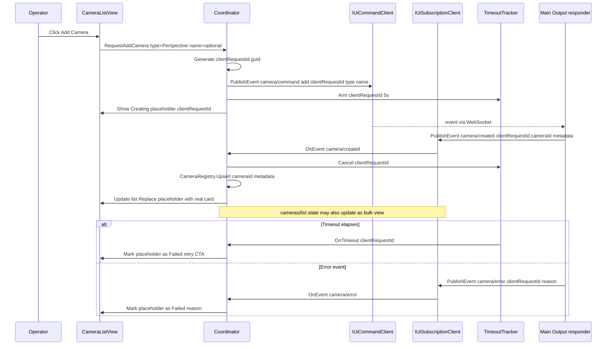
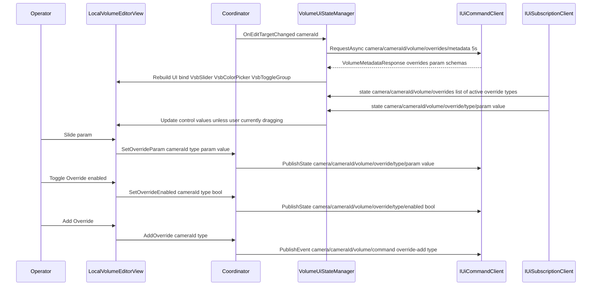
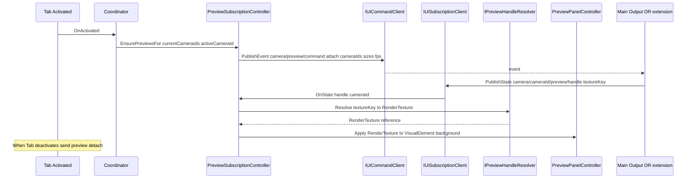
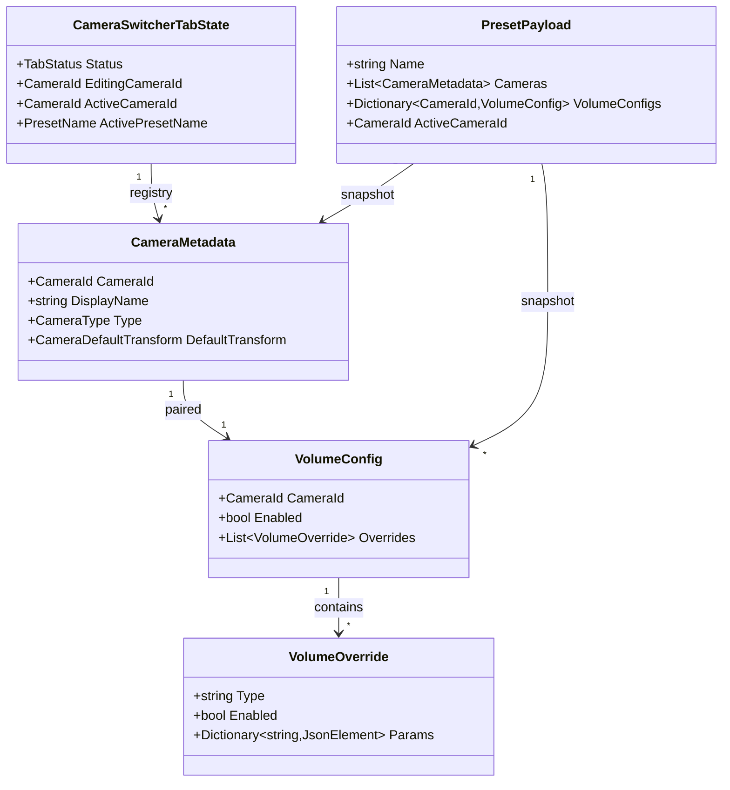
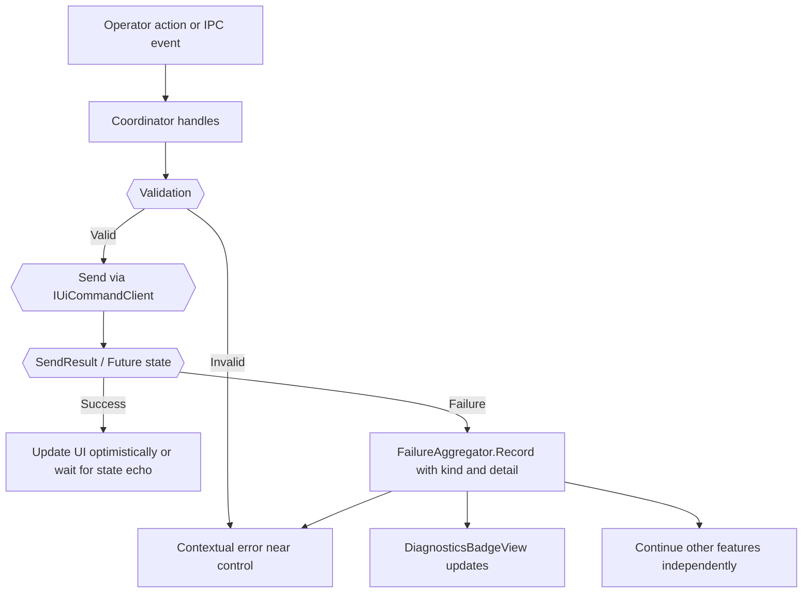

# Technical Design — camera-switcher-tab

## Overview

**Purpose**: 本 spec は、VTuberSystemBase の **カメラ・カメラ Volume 操作タブ（Camera Switcher Tab）** を定義する。`ui-toolkit-shell` の 3 タブのうち 1 枠（`TabId.CameraSwitcher`）を埋め、配信オペレーターが Unity Editor の Scene ビュー相当の操作でカメラを編集し、UCAPI Flat Record にシリアライズしたカメラ状態を OSC でメイン出力側に低遅延伝送し、Local Volume 編集とカメラ切替に連動した Volume 適用までを一連のパイプラインとして提供する。本フェーズは **差し替え前提の最小機能**（CSW-2）として実装し、将来の高機能スイッチャー（PVW/PGM、トランジション、タイムライン連携、外部ハードウェア）への拡張余地を契約で保証する。

**Users**: 配信オペレーター（Display 1 のタブ UI を操作）、タブ spec 開発者（OSC 受信側・Local Volume 適用側の実装者）、利用者プロジェクト（UXML/USS 差し替えでスキンをカスタマイズ）。

**Impact**: 現在 `ui-toolkit-shell` は 3 タブ枠のうち Camera Switcher を **空枠（EmptyTabShell.uxml）** として扱っている。本 spec が当該枠の UIDocument 実体、OSC 送信パイプライン（uOSC ベース）、IPC 契約（`camera/command`・`cameras/list`・`camera/{id}/volume/*`・`cameras/active`・プリセット関連 topic）、UCAPI シリアライザ Adapter、プレビュー RenderTexture 連携を提供することで、カメラ切替と Local Volume 編集の機能を本番配信向けに提供する。

### Goals

- SceneViewStyleCameraController を用いた編集対象カメラのプレビュー UI を、Display 1 側 RenderTexture パネルで提供する（CSW-3, Requirement 2）。
- Unity Camera 状態を UCAPI Flat Record（128 byte + 10 byte header + CRC16-CCITT + MessagePack 対応）にシリアライズし（Requirement 3）、OSC で `127.0.0.1` にリアルタイム送信する（Requirement 4）。メイン出力描画フレーム同期（60 Hz 目安、CSW-9）。
- カメラの生成・削除・アクティブ切替、メタデータ編集、Local Volume Override 動的 UI 編集、カメラ切替と Local Volume の自動連動（CSW-12）、名前付きプリセット永続化（CSW-13, CSW-14）を、`ui-toolkit-shell` の `IUiCommandClient` / `IUiSubscriptionClient` 経由の WebSocket/JSON で提供する。
- OSC 断と WebSocket 断を独立事象として扱うフェイルセーフ（CSW-15, Requirement 12）を実装し、メイン出力描画を決して阻害しない。
- 差し替え前提 API（CSW-2）を維持：`IUcapiOscEmitter` / `IUcapiFlatRecordSerializer` / `IPresetStore` を port として抽象化し、将来の高機能スイッチャーや UCAPI バージョン更新を adapter 差分で吸収。
- スタンドアロンビルドと Unity Editor PlayMode の両対応（Requirement 13）、単体検証可能性（Requirement 15）を確保する。

### Non-Goals

- メイン出力シーンでの Camera GameObject の実生成・破棄・プロパティ適用（`output-renderer-shell` の拡張責務）。
- メイン出力側 OSC 受信・UCAPI Flat Record デシリアライズ・各 Camera への適用（メイン出力側アダプタ層の責務、本 spec は契約のみ定義、Requirement 5）。
- メイン出力側 URP Local Volume コンポーネントへの値適用（メイン出力側責務）。
- トランジション（ディゾルブ、補間）、PVW/PGM マルチカメラ、外部ハードウェアスイッチャー連携、タイムライン録画・リプレイ（docs/requirements.md §5.3.4、本フェーズの非目標）。
- UCAPI C++ DLL 本体・SceneViewStyleCameraController 本体の実装改変（採用パッケージをそのまま使用）。
- `core-ipc-foundation` の WebSocket/JSON 基盤、`ui-toolkit-shell` の UIDocument・タブ切替・共通 UI・非同期ロード、`output-renderer-shell` のシーン骨格・ディスパッチャ（各 spec の責務）。
- 引きカメラ（`stage-lighting-volume-tab` のプレビュー）操作。
- タブ共通 UI 状態の永続化（UI-7 により本 spec でも永続化しない）。

## Boundary Commitments

### This Spec Owns

- **Camera Switcher タブの UIDocument 実体**（`CameraSwitcherTab.uxml` / `CameraSwitcherTab.uss`）と、`ui-toolkit-shell` の UXML/USS 配置規約（UI-3, `vsb-` プレフィクス + BEM 風）への適合（Requirement 1）。
- **編集対象カメラのプレビュー UI**：SceneViewStyleCameraController 連携、RenderTexture パネル表示、マルチプレビュー + 大アクティブプレビューの二層構成（CSW-3, CSW-16, Requirement 2）。
- **UCAPI Flat Record シリアライゼーション Adapter**（`IUcapiFlatRecordSerializer`）と、UCAPI4Unity 公開 API への薄いラップ（Requirement 3）。
- **OSC 送信パイプライン**（`IUcapiOscEmitter`）：uOSC ベース、`/ucapi/camera/{cameraId}/flat` アドレス、Flat Record blob 1 引数、LateUpdate 末尾での 1 フレーム 1 メッセージ送信、cameraId 階層化による多重化（CSW-6, CSW-7, CSW-9, Requirement 4）。
- **IPC 契約 トピック**：
  - カメラ管理: `camera/command`（event, add/delete/active-set）、`cameras/list`（state）、`cameras/active`（state）、`camera/{cameraId}/metadata/{key}`（state）、`camera/created`（event、cameraId 採番結果）、`camera/error`（event、失敗通知）
  - Local Volume: `camera/{cameraId}/volume/command`（event, override-add/remove）、`camera/{cameraId}/volume/enabled`（state）、`camera/{cameraId}/volume/override/{type}/enabled`（state）、`camera/{cameraId}/volume/override/{type}/{param}`（state）、`camera/{cameraId}/volume/overrides`（state）、`camera/{cameraId}/volume/overrides/metadata`（Request）
  - プリセット: `camera/preset/command`（event, create/rename/duplicate/delete/activate）、`camera/preset/list`（state）、`camera/preset/active`（state）
  - プレビュー: `camera/preview/command`（event, attach/detach）、`camera/{cameraId}/preview/handle`（state、RenderTexture ハンドル参照）
- **カメラ編集対象とアクティブカメラの独立管理**（R-CSW-14）：編集中カメラ cameraId と放送中カメラ cameraId を別の内部状態として保持。
- **Local Volume の動的 UI 生成**：Volume metadata Request で取得したスキーマに基づき `ui-toolkit-shell` の共通 UI（`VsbSlider` / `VsbColorPicker` / `VsbToggleGroup`）を動的バインド（CSW-11, Requirement 8）。
- **名前付きプリセットの永続化**：`IPresetStore` adapter、既定実装は JSON + `Application.persistentDataPath`、500 ms デバウンス、破損時バックアップフォールバック（CSW-13, CSW-14, Requirement 11）。
- **OSC 送信クライアントのライフサイクル**：IPC 接続確立後かつ cameraId 確定後に送信開始、PlayMode 停止・タブ破棄で安全停止（Requirement 10）。
- **OSC 断・WebSocket 断の独立フェイルセーフ**：片方が断でも他方で継続可能な構造、診断 API による状態露出、メイン出力描画への非波及（CSW-15, Requirement 12）。
- **観測性・診断可能性**：カメラ数、アクティブ cameraId、編集対象 cameraId、OSC 状態、IPC 状態、永続化時刻、プリセット名を診断 API から公開（Requirement 14）。
- **差し替え前提 API 契約**（CSW-2）：`IUcapiOscEmitter` / `IPresetStore` / プレビュー契約 / `camera/command` トピックを最小 API として切り出し、後方互換拡張で高機能スイッチャーへ差し替え可能な形を維持。

### Out of Boundary

- **メイン出力シーン Camera GameObject の生成・破棄・transform/focalLength 適用**（`output-renderer-shell` の拡張またはメイン出力側アダプタ層の責務）。本 spec は IPC 契約 + OSC 契約のみを定義する。
- **メイン出力側 OSC 受信・UCAPI デシリアライズ・CRC 検証・Camera 適用** 実装（メイン出力側責務、Requirement 5 は **契約の明示** のみ）。
- **URP Local Volume コンポーネントへの値適用・有効/無効切替の実 GameObject 操作**（メイン出力側責務）。
- **UCAPI C++ DLL / UCAPI4Unity UPM / SceneViewStyleCameraController / uOSC** の実装そのもの（採用パッケージ）。
- **`core-ipc-foundation`** の WebSocket/JSON トランスポート、`CoreIpcRuntime` ライフサイクル、D-3 メインスレッド配信実装（spec #1 責務）。
- **`ui-toolkit-shell`** のルート UIDocument、タブ切替、`IUiCommandClient` / `IUiSubscriptionClient` / `IAsyncAssetLoader` 実装、共通 UI ライブラリ（spec #3 責務）。
- **`output-renderer-shell`** のシーン骨格（`CamerasRoot` / `VolumeRoot`）、ディスパッチャ、ディスプレイ振り分け（spec #2 責務）。
- トランジション・ディゾルブ、PVW/PGM、外部ハードウェア連携、タイムライン録画リプレイ、引きカメラ操作、他タブの機能、タブ共通 UI 状態の永続化。
- OSC の具体ポート番号検証（他 OSC 製品との衝突チェック）は設定ファイルで利用者が調整可能な構造を提供するのみ。

### Allowed Dependencies

- **`core-ipc-foundation`（spec #1）の抽象 asmdef**：`IUiCommandClient` / `IUiSubscriptionClient` を通じた間接利用のみ（本 spec は `ui-toolkit-shell` 公開 API 経由でアクセスする）。
- **`ui-toolkit-shell`（spec #3）の公開 API asmdef**：`IUiCommandClient`, `IUiSubscriptionClient`, `IAsyncAssetLoader`, `ITabLifecycleHandle`, `ITabPanelRegistry`, `IConnectionStatus`, `IDiagnosticsLogger`, 共通 UI コンポーネント（`VsbSlider` / `VsbColorPicker` / `VsbToggleGroup` / `VsbNumberedList`）。
- **採用パッケージ**：
  - **SceneViewStyleCameraController**（Hidano-Dev/SceneViewStyleCameraController、Git URL 経由 UPM）
  - **UniversalCamerawork / UCAPI4Unity**（Hidano-Dev/UniversalCamerawork、Native Plugin + UPM）
  - **hecomi/uOSC**（`https://github.com/hecomi/uOSC.git#upm`、MIT、v2.2.0 以降）
- **Unity 標準**：`UnityEngine.UIElements`（UI Toolkit）、`UnityEngine.Camera`、`UnityEngine.RenderTexture`、`UnityEngine.Rendering.Volume`（Local Volume メタデータ Reflection のみ、実操作はしない）、`Application.persistentDataPath`。
- **.NET 標準**：`System.Text.Json`（プリセット JSON シリアライズ）、`System.IO`（ファイル I/O）、`System.Threading.Channels` / `System.Threading.Timer`（デバウンス）。

**Dependency Constraint**（禁止される依存）:
- `core-ipc-foundation` の **具体実装 asmdef** への直接参照（必ず `ui-toolkit-shell` の `IUiCommandClient` / `IUiSubscriptionClient` 経由）。
- `output-renderer-shell` の asmdef への参照（逆依存は発生しない、メイン出力側は本 spec の IPC/OSC 契約にのみ従う）。
- 他タブ spec（`character-selection-tab` / `stage-lighting-volume-tab`）の asmdef への参照。
- `UnityEditor.*` の Runtime コードからの参照（Editor 機能は `#if UNITY_EDITOR` + 独立 Editor asmdef）。

### Revalidation Triggers

以下の変更は `output-renderer-shell` のメイン出力側アダプタ実装 / 将来の高機能スイッチャー差し替え側 / 利用者プロジェクトのスキン・プリセットに再確認を強制する：

- **OSC アドレスプレフィクスの変更**（既定 `/ucapi/camera` → 他）：メイン出力側受信実装の再確認必須。
- **UCAPI Flat Record フォーマットバージョンの切替**（128 byte → 拡張版）：`IUcapiFlatRecordSerializer` の実装差し替え + 受信側の解釈差し替え必須。
- **`camera/command` event payload スキーマの破壊的変更**（操作種別の enum 変更、必須フィールド追加）：将来の高機能スイッチャー差し替え時に互換性検証必須。
- **Local Volume metadata Request の応答スキーマ変更**（Override 種別列挙・param スキーマ）：メイン出力側の Reflection 実装と UI 側の動的 UI 生成の両方に影響。
- **プリセット JSON スキーマバージョンの更新**：保存済みプリセットのマイグレーション必須。
- **cameraId 採番ルールの変更**（メイン出力側採番 → 他）：CSW-5 の破壊的変更、上流・下流すべての再確認必須。
- **プレビュー契約の変更**（`camera/preview/attach` の RenderTexture ハンドル受け渡し方法）：メイン出力側拡張と UI 側貼付けの両方に影響。

## Architecture

### Existing Architecture Analysis

本 spec は Wave 2 タブ spec として以下の既存アーキテクチャの上に乗る：

- **`core-ipc-foundation`（Wave 1）**：WebSocket/JSON（D-5）、Unity メインスレッド配信（D-3）、UI クライアント / メイン出力サーバ（D-4）、PublishState coalesce / PublishEvent FIFO（D-7, D-10）、Request タイムアウト 5s 既定（D-8）、1 MB 上限（D-11）、PlayMode 限定（D-9）、設定ファイル + デフォルト（D-6）を提供。
- **`ui-toolkit-shell`（Wave 2）**：`UiShellBootstrapper` / `TabPanelRegistry.RegisterTab(TabId.CameraSwitcher)` による ITabLifecycleHandle 発行、`IUiCommandClient.PublishState/PublishEvent/RequestAsync`、`IUiSubscriptionClient.Subscribe`、`IAsyncAssetLoader`、`PanelSettings(targetDisplay=0)` 共有、`UiToolkitShellSkinProfile.CameraSwitcherTabVisualTreeAsset/StyleSheets` スロット、USS 命名規約 `vsb-` + BEM 風を提供。
- **`output-renderer-shell`（Wave 2）**：`IOutputSceneRoots` 経由の `CamerasRoot` / `VolumeRoot`、`IOutputCommandDispatcher` による topic/kind 別ハンドラ登録、カリングマスク契約、URP アセット参照を提供。本 spec のカメラ・Volume・OSC 受信・プレビュー RenderTexture 作成は、これら拡張点の上にメイン出力側アダプタ層が実装される前提。

本 spec はこれら既存 spec の **拡張 / 利用者** として振る舞い、上流 spec の公開 API のみに依存する。

### Architecture Pattern & Boundary Map

**選定パターン**: **Hexagonal（Ports & Adapters）+ State Machine**。核ドメイン `CameraSwitcherCoordinator` がタブ全体のメイン状態機械（編集対象 cameraId / アクティブ cameraId / プリセット状態 / 接続状態）を保持し、周囲の port（UCAPI Serializer / OSC Emitter / IPC Client / IPC Subscription / Preset Store / Time Provider）を介して I/O を行う。UI 層（UXML + `VisualElement` バインダ）は Coordinator を観察して view を更新する MVVM 相当の単方向フローを取る。

```mermaid
graph TB
    subgraph Display1UiSide[Display 1 UI Side]
        TabBehaviour[CameraSwitcherTabBehaviour]
        Coordinator[CameraSwitcherCoordinator]
        ViewBinder[CameraSwitcherViewBinder]
        PreviewPanel[PreviewPanelController]
        CameraListView[CameraListView]
        VolumeEditor[LocalVolumeEditorView]
        PresetPanel[PresetPanelView]
        DiagBar[DiagnosticsBadgeView]
        SceneViewCtrl[SceneViewStyleCameraController Wrapper]
    end

    subgraph Ports[Ports]
        PortSerializer[IUcapiFlatRecordSerializer]
        PortOsc[IUcapiOscEmitter]
        PortIpcCmd[IUiCommandClient shell abstract]
        PortIpcSub[IUiSubscriptionClient shell abstract]
        PortPresetStore[IPresetStore]
        PortTime[ITimeProvider]
        PortPreview[IPreviewHandleResolver]
    end

    subgraph Adapters[Adapters]
        AdapterSerializer[Ucapi4UnityFlatRecordSerializer]
        AdapterOsc[UoscFlatRecordEmitter]
        AdapterPreset[FileSystemPresetStore]
        AdapterTime[UnityTimeProvider]
        AdapterPreview[RenderTextureHandleResolver]
    end

    subgraph ExternalPackages[External Packages]
        Ucapi4Unity[UCAPI4Unity UPM]
        Uosc[hecomi uOSC]
        SvscController[SceneViewStyleCameraController]
    end

    subgraph UpstreamSpecs[Upstream Specs]
        UiShell[ui-toolkit-shell]
        CoreIpc[core-ipc-foundation abstract]
        OutputShell[output-renderer-shell extension adapter]
    end

    TabBehaviour --> Coordinator
    TabBehaviour --> ViewBinder
    ViewBinder --> PreviewPanel
    ViewBinder --> CameraListView
    ViewBinder --> VolumeEditor
    ViewBinder --> PresetPanel
    ViewBinder --> DiagBar
    PreviewPanel --> SceneViewCtrl
    SceneViewCtrl --> SvscController
    Coordinator --> PortSerializer
    Coordinator --> PortOsc
    Coordinator --> PortIpcCmd
    Coordinator --> PortIpcSub
    Coordinator --> PortPresetStore
    Coordinator --> PortTime
    Coordinator --> PortPreview
    PortSerializer -.impl.-> AdapterSerializer
    PortOsc -.impl.-> AdapterOsc
    PortPresetStore -.impl.-> AdapterPreset
    PortTime -.impl.-> AdapterTime
    PortPreview -.impl.-> AdapterPreview
    AdapterSerializer --> Ucapi4Unity
    AdapterOsc --> Uosc
    PortIpcCmd --> UiShell
    PortIpcSub --> UiShell
    UiShell --> CoreIpc
    AdapterOsc -. UDP 127.0.0.1 .- OutputShell
    PortIpcCmd -. WebSocket JSON .- OutputShell
```

**Architecture Integration**:

- **Selected pattern**: Hexagonal + State Machine。Coordinator が単一責務として全状態を保持、ports が外界との境界、adapters が採用パッケージとのブリッジ。
- **Domain/feature boundaries**: Coordinator（状態機械・ビジネスルール）／ViewBinder + サブビュー（UXML 対応）／Ports（I/O 抽象）／Adapters（具体実装）の 4 層分離。タブ spec のテストは Coordinator + Fake Adapters で完結（Requirement 15）。
- **Existing patterns preserved**:
  - `ui-toolkit-shell` の `ITabLifecycleHandle.OnActivated/OnDeactivated/OnDisposed` を用いたライフサイクル（タブ非アクティブ時のプレビュー停止、Requirement 2.7）。
  - `IUiCommandClient` / `IUiSubscriptionClient` 経由の IPC（UI-5 遵守、直接トランスポート呼出し禁止）。
  - `output-renderer-shell` の OR-1（メイン出力描画に UI 描画しない）、OR-2（last-write-wins）と整合。
  - `core-ipc-foundation` の D-3（メインスレッド）、D-7（coalesce）、D-10（state/event）、D-9（PlayMode 限定）を継承。
- **New components rationale**:
  - `CameraSwitcherCoordinator`: 状態機械の単一ソース、UI とアダプタの結合点。
  - `IUcapiOscEmitter`: OSC 系統を分離する差し替え可能 port（CSW-2 の中核）。
  - `IUcapiFlatRecordSerializer`: UCAPI バージョン更新を adapter で吸収（Requirement 3.7）。
  - `IPresetStore`: 永続化層の差し替え（テスト時は InMemory、本番は FileSystem、Requirement 15.4）。
  - `IPreviewHandleResolver`: プレビュー RenderTexture ハンドル解決の抽象（メイン出力側が返すハンドルを UI 側で解釈、R-CSW-6）。
- **Steering compliance**: `.kiro/steering/` 未整備。`CLAUDE.md` の「Spec-Driven Development」と `docs/requirements.md` §4.1, §5.3, §6.1 の性能契約に整合。`ui-toolkit-shell` の dependency direction（タブ spec → 共通 UI → シェル → core-ipc-foundation 抽象）を踏襲。

### Dependency Direction

```
Types & Contracts  →  Ports  →  Coordinator (Domain State Machine)  →  ViewBinder + UXML Bindings
                                    ↑
                                 Adapters (UCAPI / uOSC / Preset / Preview) — implement Ports
                                    ↑
                               MonoBehaviour entrypoint (CameraSwitcherTabBehaviour) — Composition Root
```

- Types / Ports レイヤは何にも依存しない純 C# 抽象。
- Coordinator は Types / Ports のみに依存。Unity API・外部パッケージには触れない（テスト可能性）。
- Adapters は Ports 実装 + 採用パッケージ（UCAPI4Unity, uOSC, Unity RenderTexture）に依存。
- ViewBinder は Coordinator を観察し UI Toolkit を駆動。
- MonoBehaviour `CameraSwitcherTabBehaviour` が Composition Root として全体を組み立て。

### Technology Stack

| Layer | Choice / Version | Role in Feature | Notes |
|-------|------------------|-----------------|-------|
| UI Toolkit | Unity 6.3 URP 標準 (`UnityEngine.UIElements`) | タブ UIDocument、プレビューパネル、カメラリスト、Local Volume 編集 UI、プリセット UI | `ui-toolkit-shell` の `UiToolkitShellSkinProfile.CameraSwitcherTabVisualTreeAsset` に登録 |
| Camera Control | [SceneViewStyleCameraController](https://github.com/Hidano-Dev/SceneViewStyleCameraController) | 編集対象カメラのマウス回転・パン・ズーム | 採用パッケージ、UPM Git URL 参照 |
| Camera Serialization | [UCAPI4Unity UPM + UCAPI C++ DLL](https://github.com/Hidano-Dev/UniversalCamerawork) | Unity Camera → Flat Record 128 byte + Header 10 byte + CRC16-CCITT + MessagePack | Native Plugin + UPM 同梱、本 spec は薄い adapter 経由で利用 |
| OSC Transport | [hecomi/uOSC](https://github.com/hecomi/uOSC) v2.2.0+ | OSC over UDP 送信、byte[] blob 1 引数対応、UPM | MIT、`https://github.com/hecomi/uOSC.git#upm`、動的ポート切替、送信バックグラウンド、コールバックメインスレッド |
| IPC Client | `ui-toolkit-shell` 公開 API（`IUiCommandClient` / `IUiSubscriptionClient`） | WebSocket/JSON 経由の UI 操作・state 購読 | 具体 transport は core-ipc-foundation 側、本 spec は shell 抽象のみ利用 |
| Preset Storage | `System.Text.Json` + `Application.persistentDataPath` | プリセット JSON シリアライズ・永続化 | 既定ファイル名 `camera-switcher-presets.json`、500 ms デバウンス |
| Assembly Boundaries | asmdef 分割 | Runtime タブ本体 / ポート抽象 / アダプタ / UXML・USS 資産 / Editor / Tests | 参照方向: タブ Runtime → Ports → 共通 UI（shell）→ shell 抽象 → core-ipc 抽象 |
| Logging | `ui-toolkit-shell` の `IDiagnosticsLogger`（`LogCategory.TabSpec` 利用） | 診断ログ | メイン出力サーフェス（Display 2+）には構造的に描画不能（shell 契約） |

> 詳細な API 調査・代替案却下理由・パッケージ選定根拠は `research.md` 参照。

## File Structure Plan

### Directory Structure

```
Packages/com.hidano.vtuber-system-base.camera-switcher-tab/
├── package.json
├── Runtime/
│   ├── Abstractions/                                  # Ports 層（1 つ目の asmdef、純 C# 抽象）
│   │   ├── VTuberSystemBase.CameraSwitcherTab.Abstractions.asmdef
│   │   ├── IUcapiFlatRecordSerializer.cs              # Unity Camera → Flat Record 変換 port
│   │   ├── IUcapiOscEmitter.cs                        # OSC 送信 port
│   │   ├── IPresetStore.cs                            # プリセット永続化 port
│   │   ├── ITimeProvider.cs                           # 時刻抽象（デバウンス・送信レート）
│   │   ├── IPreviewHandleResolver.cs                  # プレビュー RenderTexture ハンドル解決 port
│   │   ├── Contracts/
│   │   │   ├── CameraIpcTopics.cs                     # トピック定数（topic string の単一ソース）
│   │   │   ├── CameraCommandPayloads.cs               # add/delete/active-set payload DTO
│   │   │   ├── CameraMetadataState.cs                 # メタデータ state DTO
│   │   │   ├── CamerasListState.cs                    # cameras/list payload DTO
│   │   │   ├── CamerasActiveState.cs                  # cameras/active payload DTO
│   │   │   ├── CameraCreatedEvent.cs                  # cameraId 採番結果 event DTO
│   │   │   ├── CameraErrorEvent.cs                    # 失敗通知 event DTO
│   │   │   ├── VolumeCommandPayloads.cs               # override-add/remove payload DTO
│   │   │   ├── VolumeOverrideState.cs                 # Override param state DTO
│   │   │   ├── VolumeMetadataRequest.cs               # Request/Response DTO
│   │   │   ├── PresetCommandPayloads.cs               # create/rename/duplicate/delete/activate payload DTO
│   │   │   ├── PresetListState.cs                     # プリセット一覧 state DTO
│   │   │   ├── PresetActiveState.cs                   # アクティブプリセット名 state DTO
│   │   │   └── PreviewCommandPayloads.cs              # preview attach/detach payload DTO
│   │   ├── UcapiFlatRecord.cs                         # 128 byte blob + 10 byte header を表す readonly struct
│   │   ├── CameraSnapshot.cs                          # Unity Camera 状態のスナップショット（純値）
│   │   ├── CameraId.cs                                # cameraId 値型（string ラッパ、ガード）
│   │   ├── VolumeOverrideSchema.cs                    # Reflection 由来の Override スキーマ DTO
│   │   ├── PresetPayload.cs                           # プリセット 1 件の内部モデル
│   │   └── Results/
│   │       ├── OscEmitResult.cs                       # Ok / Error discriminated union
│   │       └── PresetIoResult.cs                      # Ok / Error
│   ├── Domain/                                        # Coordinator 層（2 つ目の asmdef、Unity 非依存）
│   │   ├── VTuberSystemBase.CameraSwitcherTab.Domain.asmdef
│   │   ├── CameraSwitcherCoordinator.cs               # 状態機械・イベント経路の単一ソース
│   │   ├── CameraRegistry.cs                          # cameraId → メタデータ の内部インデックス
│   │   ├── ActiveCameraTracker.cs                     # アクティブ / 編集対象 cameraId の分離管理
│   │   ├── OscStreamController.cs                     # cameraId 切替に応じた送信対象切替、LateUpdate Tick 受付
│   │   ├── VolumeUiStateManager.cs                    # Override スキーマのキャッシュ、param state の UI 反映
│   │   ├── PresetController.cs                        # CRUD / 切替 / デバウンスフラッシュ制御
│   │   ├── PreviewSubscriptionController.cs           # プレビュー attach/detach の要求と handle 受信
│   │   ├── FailureAggregator.cs                       # OSC / IPC / Volume / Preset 失敗の集約と診断露出
│   │   └── TimeoutTracker.cs                          # カメラ生成要求のタイムアウト監視（Requirement 6.8）
│   ├── Adapters/                                      # 採用パッケージと具体 I/O のブリッジ（Domain asmdef 内に同梱）
│   │   ├── Ucapi/
│   │   │   ├── Ucapi4UnityFlatRecordSerializer.cs     # UCAPI4Unity の API ラッパ（Quaternion → rotation matrix、timecode 付与、NaN/Inf ガード）
│   │   │   └── UnityCameraSnapshotCapture.cs          # Camera コンポーネント → CameraSnapshot 抽出
│   │   ├── Osc/
│   │   │   ├── UoscFlatRecordEmitter.cs               # uOSC の uOscClient を利用した `IUcapiOscEmitter` 実装
│   │   │   ├── OscAddressBuilder.cs                   # `/ucapi/camera/{cameraId}/flat` 組立
│   │   │   └── OscClientLifecycle.cs                  # uOscClient の有効化/無効化・診断フック
│   │   ├── Preset/
│   │   │   └── FileSystemPresetStore.cs               # JSON + Application.persistentDataPath 実装
│   │   ├── Preview/
│   │   │   └── RenderTextureHandleResolver.cs         # メイン出力側が公開するハンドル Service 経由の解決
│   │   └── Time/
│   │       └── UnityTimeProvider.cs                   # `Time.timeAsDouble` / 壁時計を提供
│   ├── Unity/                                         # MonoBehaviour + View 層（3 つ目の asmdef、Unity 依存）
│   │   ├── VTuberSystemBase.CameraSwitcherTab.Runtime.asmdef
│   │   ├── CameraSwitcherTabBehaviour.cs              # Composition Root（MonoBehaviour）、ITabLifecycleHandle 保持
│   │   ├── Views/
│   │   │   ├── CameraSwitcherViewBinder.cs            # Coordinator 状態を UXML へ配信する binder
│   │   │   ├── PreviewPanelController.cs              # マルチプレビュー + アクティブプレビュー UI 駆動
│   │   │   ├── CameraListView.cs                      # カメラ一覧 / 選択 / アクティブ切替ボタン UI
│   │   │   ├── LocalVolumeEditorView.cs               # Override 動的 UI 生成（VsbSlider / VsbColorPicker / VsbToggleGroup）
│   │   │   ├── PresetPanelView.cs                     # プリセット CRUD UI
│   │   │   └── DiagnosticsBadgeView.cs                # OSC/IPC 状態、エラー件数の診断表示
│   │   ├── SceneViewStyle/
│   │   │   ├── SceneViewStyleCameraControllerWrapper.cs  # パッケージの薄いラッパ、プレビュー停止制御
│   │   │   └── EditingCameraTickDriver.cs             # LateUpdate Tick → `IUcapiOscEmitter.FrameTick`
│   │   └── Diagnostics/
│   │       └── CameraSwitcherTabDiagnostics.cs        # 外部から取得可能な診断スナップショット（Requirement 14.9）
│   └── UxmlUss/
│       ├── CameraSwitcherTab.uxml                     # タブ全体 UXML
│       ├── CameraSwitcherTab.uss                      # タブ全体 USS（vsb- BEM 風）
│       ├── PreviewPanel.uxml / .uss                   # プレビューレイアウト
│       ├── CameraCard.uxml / .uss                     # カメラ 1 枚分のカード（サムネイル + 名前 + 操作）
│       ├── VolumeOverrideItem.uxml / .uss             # Override 1 枚分
│       ├── PresetRow.uxml / .uss                      # プリセット 1 行分
│       └── DiagnosticsBadge.uxml / .uss               # 診断バッジ
├── Editor/
│   ├── VTuberSystemBase.CameraSwitcherTab.Editor.asmdef
│   └── CameraSwitcherTabSkinHelper.cs                 # 利用者向け：UiToolkitShellSkinProfile にスロット登録ガイド（任意）
├── Samples~/
│   └── MockedStandaloneSample/
│       ├── MockedCameraSwitcherTab.unity              # Requirement 15.5 用の最小手動検証シーン
│       ├── MockedIpcPeer.cs                           # InMemoryLoopback を使ったメイン出力側モック
│       └── README.md                                  # 手順
└── Tests/
    ├── Runtime/
    │   ├── VTuberSystemBase.CameraSwitcherTab.Tests.Runtime.asmdef
    │   ├── CoordinatorStateMachineTests.cs            # 生成要求 → cameraId 採番 → active-set の状態遷移
    │   ├── OscStreamControllerTests.cs                # cameraId 切替・停止・1 フレーム 1 メッセージ集約
    │   ├── UcapiSerializerTests.cs                    # NaN/Inf ガード、Flat Record 整合性（CRC は UCAPI 側）
    │   ├── VolumeDynamicUiTests.cs                    # Override スキーマ → UI バインド、param 送信トピック
    │   ├── PresetRoundTripTests.cs                    # JSON 書込・読込・破損フォールバック
    │   ├── FailsafeTests.cs                           # OSC 断・IPC 断時の独立継続、UI 非活性化
    │   ├── TimeoutTrackerTests.cs                     # 生成要求タイムアウト、プレースホルダ復旧
    │   ├── PlayModeLifecycleTests.cs                  # PlayMode 繰返しでリソースリークなし
    │   └── Fakes/
    │       ├── FakeIpcClient.cs                       # IUiCommandClient のテストダブル
    │       ├── FakeIpcSubscription.cs                 # IUiSubscriptionClient のテストダブル
    │       ├── FakeOscEmitter.cs                      # 送信内容をバッファに積むフェイク
    │       ├── FakePresetStore.cs                     # InMemory プリセットストア
    │       ├── FakeTimeProvider.cs                    # 時刻制御
    │       └── FakePreviewHandleResolver.cs
    └── Editor/
        └── VTuberSystemBase.CameraSwitcherTab.Tests.Editor.asmdef  # UXML/USS 構文検証等
```

### Modified Files

- `Packages/com.hidano.vtuber-system-base.ui-toolkit-shell/.../DefaultSkinProfile.asset`（同梱例として）— **変更しない**。利用者プロジェクトが別途 `UiToolkitShellSkinProfile` アセットを作成し、`CameraSwitcherTabVisualTreeAsset` / `CameraSwitcherTabStyleSheets` に本 spec の UXML/USS を差し込む運用とする（`ui-toolkit-shell` の Skin 差し替え規約に従う）。

**Dependency direction**（asmdef 参照関係）:
- `Abstractions` asmdef: 純 C# 抽象 + DTO、何にも参照しない。
- `Domain` asmdef: `Abstractions` のみ参照（Adapters も Domain asmdef に同梱だが、Unity 非依存のクラスのみ）。**実際には Adapters は Unity 依存（UnityEngine.Camera 等）を含むため、Domain/ と Adapters/ を分離し、Adapters は Runtime asmdef に含めて `Domain` + `Abstractions` + 外部パッケージを参照する構成に変更する**：
- **修正後の参照関係**:
  ```
  Abstractions asmdef       — 純 C# 抽象、参照なし
  Domain asmdef             — Abstractions のみ参照（Unity 非依存で保つ）
  Runtime asmdef            — Abstractions, Domain, ui-toolkit-shell 抽象, core-ipc-foundation 抽象, UCAPI4Unity, uOSC, SceneViewStyleCameraController を参照
  Editor asmdef             — Abstractions, Domain, Runtime を `#if UNITY_EDITOR` で参照
  Tests.Runtime asmdef      — Abstractions, Domain, Runtime, Unity Test Framework を参照
  Tests.Editor asmdef       — Abstractions, Domain, Unity Test Framework を参照
  ```
- タブ Runtime asmdef は `ui-toolkit-shell` の **公開 API asmdef のみ** を参照し、`core-ipc-foundation` の具体実装 asmdef には依存しない（Requirement 1.7）。
- 上記の逆方向への import は禁止。レビュー違反はエラー扱い。

> File Structure Plan の各パスは Components and Interfaces セクションの各コンポーネントと 1:1 で対応する。

## System Flows

### Flow 1: タブ起動 → IPC 接続待機 → OSC 起動 → 初期状態同期

```mermaid
sequenceDiagram
    participant Shell as UiShellBootstrapper
    participant Tab as CameraSwitcherTabBehaviour
    participant Coord as Coordinator
    participant Sub as IUiSubscriptionClient
    participant Cmd as IUiCommandClient
    participant Conn as IConnectionStatus
    participant Osc as IUcapiOscEmitter
    participant PresetStore as IPresetStore

    Shell->>Tab: Instantiate and Mount UIDocument (preload)
    Tab->>Shell: RegisterTab(TabId.CameraSwitcher) returns ITabLifecycleHandle
    Tab->>Coord: Initialize(ports, tabHandle)
    Coord->>Sub: Subscribe cameras/list, cameras/active, camera/error, camera/created
    Coord->>Sub: Subscribe camera/preset/list, camera/preset/active
    Coord->>Conn: Check IsConnected; register OnStatusChanged
    alt Already Connected
        Coord->>Cmd: RequestAsync cameras/list snapshot (optional, uses state subscribe)
        Coord->>PresetStore: LoadActivePreset
        PresetStore-->>Coord: presetPayload
        Coord->>Cmd: Publish preset restore sequence delete/add/metadata/volume/active-set
        Coord->>Osc: Start host port from config
        Osc-->>Coord: Started or Failed (logged, non-fatal)
    else Not Connected
        Note over Coord: Disable CRUD UI, show waiting banner
        Conn->>Coord: OnStatusChanged Connected
        Coord->>Coord: Proceed with subscribe and preset restore
    end
    Coord->>Tab: Notify Ready; Enable UI interactions
```

**Key decisions**:
- **Gated 初期化**：IPC 未接続時は CRUD UI を非活性化（Requirement 12.7）。OSC 起動は IPC 接続確立後に行う（Requirement 10.1）。
- プリセット復元は **通常の state/event 経路** で送信（CS-10 / SL-8 と同方針、CSW-13）。
- OSC 起動失敗は致命扱いにしない（診断ログ + 診断 API 露出、Requirement 4.9, 10.7, 12.1）。

### Flow 2: 編集対象カメラ操作 → UCAPI シリアライズ → OSC 送信

```mermaid
sequenceDiagram
    participant Op as Operator mouse on preview panel
    participant SV as SceneViewStyleCameraControllerWrapper
    participant Cam as Unity Camera editing target
    participant Tick as EditingCameraTickDriver LateUpdate
    participant Snap as UnityCameraSnapshotCapture
    participant Ser as IUcapiFlatRecordSerializer
    participant Stream as OscStreamController
    participant Osc as IUcapiOscEmitter uOSC
    participant MainOut as Main Output OSC Receiver out of spec

    Op->>SV: Drag rotate pan zoom
    SV->>Cam: Update transform focalLength
    Note over Cam: Transform finalized by end of Update
    Tick->>Tick: LateUpdate fires
    Tick->>Stream: FrameTick currentFrame
    Stream->>Snap: Capture activeEditCameraId snapshot
    Snap->>Cam: Read position rotation focalLength sensorSize clips timecode
    Snap-->>Stream: CameraSnapshot
    Stream->>Ser: Serialize snapshot returns UcapiFlatRecord blob 138 byte
    alt NaN or Inf detected
        Ser-->>Stream: Null; log sanitize
        Note over Stream: Skip this frame for this cameraId
    else Valid
        Ser-->>Stream: Ok flatRecord
        Stream->>Osc: Send cameraId flatRecord
        Osc->>MainOut: UDP packet /ucapi/camera/{cameraId}/flat blob
    end
```

**Key decisions**:
- 送信タイミングは **LateUpdate 末尾** で対象カメラ最終値を確定させる（Topic 6, Requirement 4.4, 4.5）。
- 同フレーム内の複数 transform 変化は Update 段階で集約され、LateUpdate では 1 値になる（CSW-9 の「1 フレーム 1 メッセージ」を自然に実現）。
- NaN/Inf 等の異常値はシリアライザでガードし、該当フレームを skip（Requirement 3.5）。UI は前回値のまま継続（Unity Camera の transform は破壊されない）。
- cameraId 切替時（Requirement 4.12）は `Stream.SetTarget(newCameraId)` を呼び、次 tick から新 cameraId 向けに送信、旧 cameraId 向け送信は停止。

### Flow 3: カメラ追加 → cameraId 採番待ち → カメラリスト反映



**Key decisions**:
- **clientRequestId** は UI 側が GUID で採番し `camera/command` `add` の payload に含める。メイン出力側は `camera/created` event で採番した **cameraId** を同 clientRequestId とともに返す（CSW-5, Requirement 6.4, 6.7）。
- タイムアウト既定値は 5 秒（`core-ipc-foundation` の D-8 Request タイムアウトと同値、ただし本経路は event ベースで TimeoutTracker が独立に管理）。
- Delete / Active-Set もほぼ同フローで、`camera/command` `delete` / `active-set` を送り、`cameras/list` state / `cameras/active` state の反映を待つ。

### Flow 4: Local Volume メタデータ取得 → 動的 UI 生成 → param 変更送信



**Key decisions**:
- 連続値は `PublishState`（coalesce）、追加削除・有効切替の離散操作は `PublishEvent`（FIFO）という区分（CSW-4）。
- **操作中コントロールの echo 抑止**：ユーザがドラッグ中は server echo で UI 値を上書きしない（R-6 / R-CSW-14 対策、Topic 4）。ドラッグ終了後は最新値に同期。
- `camera/{cameraId}/volume/enabled` state はメイン出力側の自動切替結果の **表示** 用で、UI から明示送信しない（CSW-12、Requirement 9.3）。

### Flow 5: プリセット切替 → 差分一括適用

```mermaid
sequenceDiagram
    participant Op as Operator
    participant View as PresetPanelView
    participant Coord as Coordinator
    participant Pc as PresetController
    participant Store as IPresetStore
    participant Cmd as IUiCommandClient

    Op->>View: Click preset Activate name
    View->>Coord: ActivatePreset name
    Coord->>Pc: Resolve target preset payload
    Pc->>Store: Read name
    Store-->>Pc: presetPayload cameras volumes activeCameraId
    Pc->>Pc: Diff current registry vs target; order delete then add then metadata then volume then active-set
    Pc->>Cmd: PublishEvent camera/command delete for old cameras not in target
    Pc->>Cmd: PublishEvent camera/command add for new cameras in target
    Note over Pc: Wait for camera/created events to map new cameraIds
    Pc->>Cmd: PublishState camera/cameraId/metadata/{key} ... for each new camera metadata
    Pc->>Cmd: PublishState camera/cameraId/volume/override/type/param ... for each volume override
    Pc->>Cmd: PublishEvent camera/cameraId/volume/command override-add ... for overrides to add
    Pc->>Cmd: PublishEvent camera/command active-set targetActiveCameraId
    Pc->>Cmd: PublishEvent camera/preset/command activate name
    Note over Coord: camera/preset/active state will echo back confirming activation
```

**Key decisions**:
- 送信順序は **delete → add → metadata → volume → active-set**（Requirement 11.11、R-CSW-9 の暫定確定）。
- 切替中の「中間状態」はメイン出力側の自動連動（CSW-12）で極小化される。配信映像が不自然にならないよう、**active-set を最後に送る** ことで切替中は旧アクティブカメラが映り続ける。
- プリセット内容の変更（永続化対象）は Coordinator が監視し、500 ms デバウンスで `IPresetStore.SaveAsync` を呼ぶ（Requirement 11.3）。

### Flow 6: プレビュー attach → RenderTexture ハンドル受信 → UI 貼付



**Key decisions**:
- RenderTexture ハンドルは同プロセス内 Service Locator 経由で参照渡し（Unity のシングルトン `RenderTextureRegistry` を想定、Topic 3）。
- タブ非アクティブ時は `detach` を送り、メイン出力側でプレビュー RenderTexture の描画頻度を下げる / 解放する（Requirement 2.7, 12.7）。

## Requirements Traceability

| Requirement | Summary | Components | Interfaces | Flows |
|-------------|---------|------------|------------|-------|
| 1.1 | タブ専用 UIDocument 提供 | CameraSwitcherTabBehaviour, UxmlUss/CameraSwitcherTab.uxml | — | Flow 1 |
| 1.2 | USS セレクタ命名規約適用 | UxmlUss/CameraSwitcherTab.uss, 各 Views | — | — |
| 1.3 | プリロード時同期アタッチ | CameraSwitcherTabBehaviour | — | Flow 1 |
| 1.4 | 表示切替のみで UI 提示 | CameraSwitcherTabBehaviour, ITabLifecycleHandle | ITabLifecycleHandle | Flow 1 |
| 1.5 | 非アクティブ時の停止処理 | CameraSwitcherTabBehaviour, OscStreamController, PreviewSubscriptionController | ITabLifecycleHandle | Flow 6 |
| 1.6 | メイン出力描画への非干渉 | すべての Adapter / Views（Display 1 限定） | — | — |
| 1.7 | asmdef 参照方向の維持 | Runtime.asmdef, Domain.asmdef, Abstractions.asmdef | — | — |
| 1.8 | UXML 差し替え時の診断 | UiToolkitShellSkinProfile（shell 側）+ UXML 検証規約 | IDiagnosticsLogger | — |
| 2.1 | SceneViewStyle プレビュー UI | SceneViewStyleCameraControllerWrapper, PreviewPanelController | — | Flow 2 |
| 2.2 | RenderTexture を UI に表示 | PreviewPanelController | IPreviewHandleResolver | Flow 6 |
| 2.3 | Display 1 限定描画 | PreviewPanelController, RenderTextureHandleResolver | — | Flow 6 |
| 2.4 | マウス操作対応 | SceneViewStyleCameraControllerWrapper | — | Flow 2 |
| 2.5 | 操作 → OSC 転送 | EditingCameraTickDriver, OscStreamController | IUcapiOscEmitter | Flow 2 |
| 2.6 | 引きカメラと独立 | SceneViewStyleCameraControllerWrapper（別インスタンス） | — | — |
| 2.7 | 非アクティブ化でプレビュー停止 | PreviewSubscriptionController, OscStreamController | ITabLifecycleHandle | Flow 6 |
| 2.8 | 再アクティブ化で直前状態維持 | CameraSwitcherCoordinator | — | Flow 6 |
| 2.9 | 編集対象切替と OSC 先切替 | ActiveCameraTracker, OscStreamController | — | Flow 2 |
| 2.10 | メイン出力描画との分離 | PreviewPanelController（shell PanelSettings targetDisplay=0） | — | — |
| 2.11 | メイン出力シーン共有方針 | Boundary: メイン出力側アダプタがプレビュー専用カメラ生成（Out of Boundary） | IPreviewHandleResolver | Flow 6 |
| 3.1 | UCAPI Flat Record シリアライズ | Ucapi4UnityFlatRecordSerializer | IUcapiFlatRecordSerializer | Flow 2 |
| 3.2 | CRC16-CCITT 整合性 | Ucapi4UnityFlatRecordSerializer（UCAPI4Unity 委譲） | IUcapiFlatRecordSerializer | Flow 2 |
| 3.3 | MessagePack / raw バイナリ引渡し | Ucapi4UnityFlatRecordSerializer → OscStreamController | UcapiFlatRecord struct | Flow 2 |
| 3.4 | 単位・座標系変換 | Ucapi4UnityFlatRecordSerializer | IUcapiFlatRecordSerializer | — |
| 3.5 | NaN/Inf ガード | Ucapi4UnityFlatRecordSerializer（Sanitize） | — | Flow 2 |
| 3.6 | Unity メインスレッド実行 | EditingCameraTickDriver LateUpdate | — | Flow 2 |
| 3.7 | UCAPI API 変更追従 | Ucapi4UnityFlatRecordSerializer（adapter 分離） | IUcapiFlatRecordSerializer | — |
| 3.8 | Flat Record 拡張対応 | Abstractions.UcapiFlatRecord struct（差し替え可能な型） | IUcapiFlatRecordSerializer | — |
| 4.1 | OSC 送信クライアント初期化 | UoscFlatRecordEmitter, OscClientLifecycle | IUcapiOscEmitter | Flow 1 |
| 4.2 | 設定ファイルからの host/port | OscClientLifecycle + CameraSwitcherTabConfig（shell 設定） | IUcapiOscEmitter | Flow 1 |
| 4.3 | OSC アドレスパターン | OscAddressBuilder | — | Flow 2 |
| 4.4 | フレーム単位送信 | EditingCameraTickDriver, OscStreamController | IUcapiOscEmitter | Flow 2 |
| 4.5 | 頻度上限 60 Hz / 1 フレーム 1 メッセージ | OscStreamController（LateUpdate 内で 1 値確定） | — | Flow 2 |
| 4.6 | WebSocket と別チャネル | Runtime.asmdef が uOSC 直接参照、shell 抽象とは別経路 | — | — |
| 4.7 | UI クライアント / メイン出力サーバ | UoscFlatRecordEmitter（client only） | IUcapiOscEmitter | Flow 1, 2 |
| 4.8 | asmdef 内ライフサイクル管理 | OscClientLifecycle | IUcapiOscEmitter | Flow 1 |
| 4.9 | 初期化失敗時の診断露出 | FailureAggregator, CameraSwitcherTabDiagnostics | — | Flow 1 |
| 4.10 | OSC 断時の他機能継続 | FailureAggregator + Coordinator（チャネル独立） | — | — |
| 4.11 | delete 時の送信停止 | OscStreamController.OnCameraDeleted | — | Flow 3 |
| 4.12 | 編集対象切替で送信先切替 | OscStreamController.SetTarget | — | Flow 2 |
| 4.13 | UDP の到達性非保証許容 | UoscFlatRecordEmitter（UDP 前提） | — | — |
| 5.1 | OSC 契約の明示 | Data Contracts（本 design.md）+ research.md | — | — |
| 5.2 | cameraId 別適用契約 | Data Contracts の OSC アドレスパターン | — | — |
| 5.3 | メインスレッド適用契約 | Boundary Commitments の Adjacent Expectations | — | — |
| 5.4 | 最新値優先契約 | Data Contracts（OSC 配信セマンティクス） | — | — |
| 5.5 | CRC 失敗時破棄契約 | Boundary Commitments, research.md | — | — |
| 5.6 | 未知 cameraId 破棄契約 | Boundary Commitments | — | — |
| 5.7 | 描画フレーム非中断契約 | Boundary Commitments | — | — |
| 5.8 | active-set 時のカメラ切替契約 | Data Contracts の `cameras/active` state セマンティクス | — | Flow 3 |
| 5.9 | 差し替え前提の最小 API | Boundary Commitments の Revalidation Triggers | — | — |
| 5.10 | 拡張時の後方互換 | 本 design.md の契約バージョニング規約 | — | — |
| 6.1 | カメラ一覧 state 購読 | CameraRegistry, IUiSubscriptionClient | `cameras/list` topic | Flow 3 |
| 6.2 | カメラリスト UI 列挙 | CameraListView | — | Flow 3 |
| 6.3 | add event 送信 | Coordinator.RequestAddCamera | `camera/command` topic | Flow 3 |
| 6.4 | cameraId 採番結果受信 | Coordinator.OnCameraCreated, CameraRegistry | `camera/created` event | Flow 3 |
| 6.5 | delete event 送信 | Coordinator.RequestDeleteCamera, OscStreamController.OnCameraDeleted | `camera/command` topic | Flow 3 |
| 6.6 | メタデータ state 送信 | Coordinator.UpdateMetadata | `camera/{id}/metadata/{key}` | — |
| 6.7 | 生成中プレースホルダ | TimeoutTracker + CameraListView | — | Flow 3 |
| 6.8 | タイムアウト処理 | TimeoutTracker | — | Flow 3 |
| 6.9 | 表示順の安定化 | CameraRegistry（cameraId 採番順保持） | — | — |
| 6.10 | 未受信時の UI 非活性 | Coordinator（ConnectionGated state） | — | Flow 1 |
| 6.11 | 初期 transform 既定の委譲 | Coordinator.RequestAddCamera（数値を送らない） | — | Flow 3 |
| 6.12 | 生成失敗 event の表示 | FailureAggregator, CameraListView | `camera/error` event | Flow 3 |
| 7.1 | アクティブ切替 UI | CameraListView | — | — |
| 7.2 | アクティブ state 購読 | ActiveCameraTracker, IUiSubscriptionClient | `cameras/active` state | — |
| 7.3 | active-set event 送信 | Coordinator.ActivateCamera | `camera/command` topic | Flow 3 |
| 7.4 | ハードカット専用 | Coordinator（payload にトランジション無し） | — | — |
| 7.5 | Local Volume 自動連動委譲 | Coordinator（UI 側は active-set のみ送信） | — | Flow 5 |
| 7.6 | 切替進行中表示・直列化 | CameraListView + Coordinator.ActivationInFlight | — | — |
| 7.7 | 切替失敗時の復元 | FailureAggregator, ActiveCameraTracker | `camera/error` event | — |
| 7.8 | 拡張余地の維持 | Data Contracts の payload 拡張性（後方互換フィールド） | — | — |
| 7.9 | 0 台時の非活性化 | CameraListView（empty-state） | — | — |
| 7.10 | PVW/PGM 拡張点維持 | 契約の Revalidation Triggers | — | — |
| 8.1 | Override リスト state 購読 | VolumeUiStateManager, IUiSubscriptionClient | `camera/{id}/volume/overrides` | Flow 4 |
| 8.2 | メタデータ Request + 動的 UI | VolumeUiStateManager, LocalVolumeEditorView | `camera/{id}/volume/overrides/metadata` Request | Flow 4 |
| 8.3 | Override 追加 event 送信 | Coordinator.AddOverride | `camera/{id}/volume/command` | Flow 4 |
| 8.4 | Override 削除 event 送信 | Coordinator.RemoveOverride | `camera/{id}/volume/command` | Flow 4 |
| 8.5 | enabled state 送信 | Coordinator.SetOverrideEnabled | `camera/{id}/volume/override/{type}/enabled` | Flow 4 |
| 8.6 | param state 送信 | Coordinator.SetOverrideParam | `camera/{id}/volume/override/{type}/{param}` | Flow 4 |
| 8.7 | 共通 UI 部品利用 | LocalVolumeEditorView（VsbSlider/ColorPicker/ToggleGroup） | ui-toolkit-shell 共通 UI | Flow 4 |
| 8.8 | UI 側バリデーション | LocalVolumeEditorView（min/max clip） | — | Flow 4 |
| 8.9 | Volume enabled state 送信 | Coordinator.SetVolumeEnabled | `camera/{id}/volume/enabled` | — |
| 8.10 | 操作中 echo 抑止 | LocalVolumeEditorView（drag-suppress） | — | Flow 4 |
| 8.11 | メタデータ失敗時の縮退 | VolumeUiStateManager, FailureAggregator | — | — |
| 8.12 | Volume 自動連動委譲 | Coordinator（active-set のみ送信） | — | — |
| 8.13 | 編集対象切替時の UI 再構成 | VolumeUiStateManager.OnEditTargetChanged | — | Flow 4 |
| 9.1 | active-set のみ送信 | Coordinator（Volume 連動を送信しない） | — | Flow 3, 5 |
| 9.2 | Volume 切替契約の明示 | Data Contracts（メイン出力側期待） | — | — |
| 9.3 | Volume enabled state 反映 | VolumeUiStateManager | `camera/{id}/volume/enabled` | — |
| 9.4 | 手動 vs 自動の優先順位契約 | Data Contracts の Volume 連動セマンティクス | — | — |
| 9.5 | 拡張時の手動制御モード | 契約の後方互換拡張規約 | — | — |
| 9.6 | UI 上のヒント表示 | CameraListView の Tooltip / 凡例 | — | — |
| 10.1 | 接続確立後の OSC 起動 | OscClientLifecycle（Gated Start） | IUcapiOscEmitter | Flow 1 |
| 10.2 | PlayMode 終了時シャットダウン | OscClientLifecycle.OnDisposed（tabHandle 経由） | IUcapiOscEmitter | — |
| 10.3 | アプリ終了時シャットダウン | OscClientLifecycle（`Application.quitting` hook 経由 shell） | — | — |
| 10.4 | PlayMode 繰返しでのクリーン初期化 | OscClientLifecycle（毎回新規 uOscClient） | — | — |
| 10.5 | Edit モード非起動 | OscClientLifecycle（shell の PlayMode 限定契約に従属） | — | — |
| 10.6 | ドメインリロード跨ぎなし | MonoBehaviour の生存サイクル | — | — |
| 10.7 | 初期化例外時の継続 | FailureAggregator（try/catch + ログ） | — | Flow 1 |
| 10.8 | スレッドモデル継承 | UoscFlatRecordEmitter（uOSC の threading を継承） | — | — |
| 11.1 | プリセット対象の限定 | PresetPayload DTO, PresetController | IPresetStore | Flow 5 |
| 11.1a | CRUD UI 操作 | PresetPanelView, PresetController | `camera/preset/command` | — |
| 11.1b | アクティブプリセット表示 | PresetPanelView | `camera/preset/active` state | — |
| 11.1c | 切替時の通常経路送信 | PresetController（差分計算 + 一括送信） | — | Flow 5 |
| 11.1d | 重複名拒否 | PresetController.Validate | — | — |
| 11.2 | 非永続化対象の除外 | PresetPayload DTO（transform ストリーム含まず） | — | — |
| 11.3 | デバウンスフラッシュ | PresetController.DebouncedFlush 500 ms | ITimeProvider | — |
| 11.4 | 終了時強制フラッシュ | PresetController.FlushOnQuit | — | — |
| 11.5 | 起動時復元 | PresetController.RestoreOnStart | — | Flow 1 |
| 11.6 | 初回起動スキップ | PresetController.RestoreOnStart（ファイル不在時） | — | — |
| 11.7 | 破損フォールバック | FileSystemPresetStore（`.bak.{ts}` リネーム） | — | — |
| 11.8 | 部分失敗の継続 | PresetController（項目別 try/catch） | — | Flow 5 |
| 11.9 | 書込失敗時の再試行 | FileSystemPresetStore, FailureAggregator | — | — |
| 11.10 | 保存先の差し替え可能性 | IPresetStore 抽象 | IPresetStore | — |
| 11.11 | 送信順序の確定 | PresetController.ApplyOrder（delete → add → metadata → volume → active-set） | — | Flow 5 |
| 12.1 | OSC 失敗時の継続 | FailureAggregator, OscClientLifecycle | — | Flow 1 |
| 12.2 | Volume メタデータ失敗の局所化 | VolumeUiStateManager（カメラ単位隔離） | — | — |
| 12.3 | カメラエラー event の局所表示 | FailureAggregator, CameraListView | `camera/error` event | Flow 3 |
| 12.4 | Command 送信エラーの吸収 | Coordinator（SendResult ハンドリング） | — | — |
| 12.5 | 範囲外入力の送信抑止 | LocalVolumeEditorView（UI 側バリデーション） | — | Flow 4 |
| 12.6 | メイン出力描画への非描画 | 構造的保証（shell の PanelSettings targetDisplay=0） | — | — |
| 12.7 | WebSocket 断中の UI 非活性 | Coordinator（IConnectionStatus 観察） | — | Flow 1 |
| 12.8 | 接続回復時の再同期 | Coordinator.ResubscribeAndResnapshot | — | — |
| 12.9 | プリセット整合不整合の警告 | PresetController.Validate, FailureAggregator | — | — |
| 12.10 | 診断情報の記録 | FailureAggregator, CameraSwitcherTabDiagnostics | — | — |
| 13.1 | Standalone 時の自動起動 | CameraSwitcherTabBehaviour（shell のタブ登録経由） | — | Flow 1 |
| 13.2 | Editor PlayMode 時の自動起動 | 同上（shell が両対応） | — | Flow 1 |
| 13.3 | PlayMode 終了時クリーンアップ | OscClientLifecycle, PresetController.FlushOnQuit, Subscription の Dispose | — | — |
| 13.4 | 繰返し PlayMode でリークなし | PlayModeLifecycleTests, 全 adapter の Dispose 対称性 | — | — |
| 13.5 | Edit モード非起動 | shell の Edit モード非起動契約に従属 | — | — |
| 13.6 | ドメインリロード跨ぎなし | MonoBehaviour ライフサイクル | — | — |
| 13.7 | 両モードで挙動同一 | 全 adapter の分岐なし実装 | — | — |
| 14.1 | 初期化各段階のログ | Coordinator, 各 Adapter（LogCategory.TabSpec） | IDiagnosticsLogger | — |
| 14.2 | CRUD 操作ログ | Coordinator（全 Publish 呼出しで Log） | IDiagnosticsLogger | — |
| 14.3 | Volume 編集ログ | Coordinator | IDiagnosticsLogger | — |
| 14.4 | OSC 送信ログ | UoscFlatRecordEmitter, CameraSwitcherTabDiagnostics | IDiagnosticsLogger | — |
| 14.5 | エラー event 受信ログ | FailureAggregator | IDiagnosticsLogger | — |
| 14.6 | 永続化 I/O 失敗ログ | FileSystemPresetStore, FailureAggregator | IDiagnosticsLogger | — |
| 14.7 | メイン出力非描画 | shell の `IDiagnosticsLogger` 契約に従属 | — | — |
| 14.8 | ログレベル切替 | shell の LogLevel 設定に従属 | — | — |
| 14.9 | 診断状態公開 API | CameraSwitcherTabDiagnostics | — | — |
| 15.1 | モック応答との連携 | FakeIpcClient, FakeIpcSubscription | — | — |
| 15.2 | 自己ループ送受信テスト | Tests/Runtime（InMemoryLoopback 経由） | — | — |
| 15.3 | OSC 受信ダブル | FakeOscEmitter + Samples/MockedStandaloneSample | — | — |
| 15.4 | ストレージ抽象の差し替え | FakePresetStore | IPresetStore | — |
| 15.5 | PlayMode 手動検証手順 | Samples/MockedStandaloneSample/README.md | — | — |
| 15.6 | テストケース一覧 | Tests/Runtime の各テストファイル | — | — |
| 15.7 | OSC 送信抽象の差し替え | FakeOscEmitter | IUcapiOscEmitter | — |
| 15.8 | 時刻抽象の差し替え | FakeTimeProvider | ITimeProvider | — |

## Components and Interfaces

**Summary Table**:

| Component | Domain/Layer | Intent | Req Coverage | Key Dependencies (P0/P1) | Contracts |
|-----------|--------------|--------|--------------|--------------------------|-----------|
| CameraSwitcherTabBehaviour | Unity Composition Root | MonoBehaviour エントリポイント。shell への RegisterTab、Coordinator の生成、LateUpdate Tick 駆動 | 1.1, 1.3, 1.4, 13.1, 13.2 | ui-toolkit-shell (P0), Coordinator (P0), 全 Adapter (P0) | Service |
| CameraSwitcherCoordinator | Domain | タブ全体の状態機械。全 port を調停し、ViewBinder に状態を配信 | 2.5, 2.9, 6.3, 6.5, 6.11, 7.3, 8.3–8.6, 9.1, 11.1c, 12.4, 12.7, 12.8 | 全 port (P0) | Service, State, Event |
| CameraRegistry | Domain | cameraId → メタデータの内部インデックス、並び順保持 | 6.1, 6.4, 6.9 | — | State |
| ActiveCameraTracker | Domain | アクティブ cameraId と編集対象 cameraId の別管理 | 2.9, 7.2, 7.7 | CameraRegistry (P0) | State |
| OscStreamController | Domain | cameraId 切替・1 フレーム 1 メッセージ・delete 連動停止 | 4.4, 4.5, 4.11, 4.12 | IUcapiOscEmitter (P0), IUcapiFlatRecordSerializer (P0) | Service |
| VolumeUiStateManager | Domain | Override スキーマ取得・UI 反映・操作中 echo 抑止 | 8.1, 8.2, 8.11, 8.13 | IUiCommandClient (P0), IUiSubscriptionClient (P0) | Service, State |
| PresetController | Domain | プリセット CRUD / 切替 / デバウンスフラッシュ / 復元 | 11.1–11.11 | IPresetStore (P0), ITimeProvider (P0), IUiCommandClient (P0) | Service, State |
| PreviewSubscriptionController | Domain | プレビュー attach/detach の要求とハンドル反映 | 2.2, 2.3, 2.7 | IUiCommandClient (P0), IPreviewHandleResolver (P0), IUiSubscriptionClient (P0) | Event |
| FailureAggregator | Domain | OSC/IPC/Volume/Preset 失敗の集約と診断露出 | 4.9, 4.10, 11.9, 12.1–12.3, 12.9, 12.10, 14.5, 14.6 | IDiagnosticsLogger (P0) | State, Event |
| TimeoutTracker | Domain | カメラ生成要求の 5 秒タイムアウト監視 | 6.7, 6.8 | ITimeProvider (P0) | Service, Event |
| Ucapi4UnityFlatRecordSerializer | Adapter | UCAPI4Unity 公開 API ラッパ、単位変換、NaN/Inf ガード | 3.1–3.8 | UCAPI4Unity UPM (P0) | Service |
| UnityCameraSnapshotCapture | Adapter | Camera コンポーネント → `CameraSnapshot` 抽出 | 3.1, 3.4, 3.6 | UnityEngine.Camera (P0) | Service |
| UoscFlatRecordEmitter | Adapter | uOSC 利用の OSC 送信実装 | 4.1, 4.3, 4.4, 4.7, 4.8, 4.13, 10.8 | hecomi/uOSC (P0), OscAddressBuilder (P0) | Service |
| OscClientLifecycle | Adapter | uOscClient のライフサイクル・診断フック | 4.2, 4.9, 10.1–10.7 | UoscFlatRecordEmitter (P0) | Service, State |
| FileSystemPresetStore | Adapter | JSON + persistentDataPath、破損バックアップ | 11.7, 11.9, 11.10 | System.Text.Json (P0), System.IO (P0) | Service |
| RenderTextureHandleResolver | Adapter | メイン出力側公開の RenderTexture Service 経由解決 | 2.2, 2.3 | UnityEngine.RenderTexture (P0) | Service |
| UnityTimeProvider | Adapter | Time.timeAsDouble / DateTime.UtcNow 提供 | — | UnityEngine.Time (P0) | Service |
| CameraSwitcherViewBinder | UI Presentation | Coordinator 状態を各 View に配信 | 1.4, 6.2, 7.1, 8.7 | Coordinator (P0), 各 View (P0) | — |
| PreviewPanelController | UI Presentation | マルチプレビュー + アクティブプレビュー描画駆動 | 2.1, 2.2, 2.3, 2.10, CSW-16 | IPreviewHandleResolver (P0), SceneViewStyleCameraControllerWrapper (P0) | — |
| CameraListView | UI Presentation | カメラ一覧 / 選択 / アクティブ切替ボタン | 6.2, 6.7, 7.1, 7.6, 7.9 | ui-toolkit-shell 共通 UI (P0) | — |
| LocalVolumeEditorView | UI Presentation | Override 動的 UI 生成、操作中 echo 抑止 | 8.2, 8.7, 8.8, 8.10, 8.13 | VolumeUiStateManager (P0), 共通 UI (P0) | — |
| PresetPanelView | UI Presentation | プリセット CRUD UI | 11.1a, 11.1b, 11.1d | PresetController (P0) | — |
| DiagnosticsBadgeView | UI Presentation | OSC/IPC 状態バッジ | 4.9, 9.5 相当, 14.9 | FailureAggregator (P0), IConnectionStatus (P0) | — |
| SceneViewStyleCameraControllerWrapper | UI Presentation | SceneViewStyleCameraController パッケージの薄いラッパ | 2.1, 2.4, 2.6, 2.7 | SceneViewStyleCameraController (P0) | — |
| EditingCameraTickDriver | UI Presentation | `LateUpdate` 末尾で `OscStreamController.FrameTick` を駆動 | 3.6, 4.4, 4.5 | OscStreamController (P0), UnityEngine (P0) | — |
| CameraSwitcherTabDiagnostics | Diagnostics | 外部から取得可能な診断スナップショット | 14.9 | Coordinator, FailureAggregator, OscClientLifecycle (P1 read-only) | Service |

### Domain

#### CameraSwitcherCoordinator

| Field | Detail |
|-------|--------|
| Intent | タブ全体のメイン状態機械。UI 操作 / IPC 受信 / OSC 送信 / プリセット I/O の調停、配信規律の強制、ViewBinder への状態配信 |
| Requirements | 2.5, 2.9, 6.3, 6.5, 6.11, 7.3, 8.3–8.6, 9.1, 11.1c, 12.4, 12.7, 12.8 |

**Responsibilities & Constraints**
- 全 port（`IUiCommandClient` / `IUiSubscriptionClient` / `IUcapiOscEmitter` / `IUcapiFlatRecordSerializer` / `IPresetStore` / `ITimeProvider` / `IPreviewHandleResolver`）を依存注入で受け取る。Unity API には一切触れない（テスト可能性の担保）。
- 内部状態: `TabStatus { Initializing / ConnectionPending / Ready / Suspended / Disposing }`、`CameraRegistry`、`ActiveCameraTracker`、`VolumeUiStateManager`、`PresetController`、`FailureAggregator`、`TimeoutTracker`、`OscStreamController` を composition として保持。
- 外部 UI からの操作は単一 API 経由（`RequestAddCamera` / `RequestDeleteCamera` / `ActivateCamera` / `SelectEditTarget` / `SetOverrideParam` 等）で受け付け、送信は全て `IUiCommandClient` にディスパッチ。
- 受信購読（`cameras/list` / `cameras/active` / `camera/created` / `camera/error` / `camera/{id}/volume/*` / `camera/preset/list` / `camera/preset/active`）を Initialize 時に一括登録。
- `IConnectionStatus.OnStatusChanged` を観察し、`Disconnected → Connected` で再購読 + 再スナップショット取得、`Connected → Disconnected` で CRUD UI を非活性化（Requirement 12.7, 12.8）。

**Dependencies**
- Outbound: `IUiCommandClient` — Command 送信（P0）
- Outbound: `IUiSubscriptionClient` — 受信購読（P0）
- Outbound: `IUcapiOscEmitter`（`OscStreamController` 経由）— OSC 送信（P0）
- Outbound: `IPresetStore`（`PresetController` 経由）— 永続化（P0）
- Outbound: `ITimeProvider` — 時刻（P0）
- Outbound: `IConnectionStatus` — 接続状態（P0）
- Outbound: `IDiagnosticsLogger` — 診断ログ（P1）

**Contracts**: Service [x] / State [x] / Event [x]

##### Service Interface

```csharp
namespace VTuberSystemBase.CameraSwitcherTab.Domain;

public interface ICameraSwitcherCoordinator : IDisposable
{
    TabStatus Status { get; }
    CameraId? EditingCameraId { get; }
    CameraId? ActiveCameraId { get; }

    // UI 起点の操作
    void RequestAddCamera(CameraType type, string? displayName);
    void RequestDeleteCamera(CameraId target);
    void ActivateCamera(CameraId target);
    void SelectEditTarget(CameraId target);
    void UpdateCameraMetadata(CameraId target, string key, string value);

    // Volume 操作
    void AddVolumeOverride(CameraId target, string overrideType);
    void RemoveVolumeOverride(CameraId target, string overrideType);
    void SetVolumeOverrideEnabled(CameraId target, string overrideType, bool enabled);
    void SetVolumeOverrideParam(CameraId target, string overrideType, string param, JsonElement value);
    void SetVolumeEnabled(CameraId target, bool enabled);

    // プリセット操作
    void CreatePreset(string name);
    void RenamePreset(string oldName, string newName);
    void DuplicatePreset(string sourceName, string newName);
    void DeletePreset(string name);
    void ActivatePreset(string name);

    // ライフサイクルコールバック
    void OnTabActivated();
    void OnTabDeactivated();

    // Tick for OSC (called from LateUpdate driver)
    void FrameTick();

    // 状態変化通知（ViewBinder 購読）
    event Action<CoordinatorStateChange> OnStateChanged;
}

public enum TabStatus
{
    Initializing,
    ConnectionPending,
    Ready,
    Suspended,
    Disposing
}

public readonly record struct CameraType(string Value)
{
    public static readonly CameraType Perspective = new("Perspective");
    public static readonly CameraType Orthographic = new("Orthographic");
}

public readonly record struct CoordinatorStateChange(
    CoordinatorChangeKind Kind,
    CameraId? AffectedCameraId,
    string? Topic,
    object? Payload);
```

- **Preconditions**: Initialize 時に全 port が非 null。`IConnectionStatus` は有効なインスタンスを提供。
- **Postconditions**: UI 起点の API 呼び出しは必ず同期的に `IUiCommandClient` へ送信（成否は後続 state/event で確定）。失敗時は `FailureAggregator` に記録、例外は送出しない（Requirement 12.4）。
- **Invariants**: 全メソッドは Unity メインスレッドから呼ばれる前提（`IUiSubscriptionClient` の受信コールバックも shell が main thread 配信を保証）。Coordinator 内部で spawn する非同期処理は `PresetController` のデバウンス Timer のみ、完了時はメインスレッドへ戻す。

**Implementation Notes**
- Integration: `CameraSwitcherTabBehaviour` が Composition Root として生成し、`ITabLifecycleHandle.OnActivated/OnDeactivated/OnDisposed` を `OnTabActivated` / `OnTabDeactivated` / `Dispose` にブリッジ。
- Validation: `CameraId` は空文字/null を禁止（値型のコンストラクタで検証）。`overrideType` / `param` は空文字禁止。プリセット名は空文字禁止 + 既存重複チェック（Requirement 11.1d）。
- Risks: 過大な状態機械クラスになるリスク → `CameraRegistry` / `VolumeUiStateManager` / `PresetController` / `OscStreamController` へ責務分割済み。Coordinator 自体は 500 行以下を目安。

#### OscStreamController

| Field | Detail |
|-------|--------|
| Intent | 編集対象 cameraId の Unity Camera transform を LateUpdate 毎に UCAPI Flat Record にシリアライズし、OSC で送信。delete/cameraId 切替での停止制御 |
| Requirements | 4.4, 4.5, 4.11, 4.12 |

**Responsibilities & Constraints**
- `SetTarget(CameraId?)` で送信対象を切替。null 時は送信しない。
- `FrameTick()` 呼び出しで 1 フレーム 1 回、対象カメラ（Unity Camera 参照）のスナップショットを取得 → シリアライズ → `IUcapiOscEmitter.Send` 呼出し。
- `OnCameraDeleted(CameraId)` で、対象が一致していれば `SetTarget(null)` を呼ぶ（Requirement 4.11）。
- Camera 参照は `IPreviewHandleResolver.ResolveCameraComponent(cameraId)` 経由で取得する（メイン出力側のプレビュー Camera を利用するが、編集用 transform はメイン出力側でプレビュー Camera を駆動する実装に依存）。**注**: SL-1 の方針に合わせ、編集対象カメラは **メイン出力側が所有するプレビュー Camera** であり、SceneViewStyleCameraController もメイン出力側の Camera に取り付ける。UI タブは操作入力を OSC で伝えず、**編集用の操作コマンドは OSC ではなく別 IPC topic** とするかは実装時に要確認。本 spec ではシンプル化のため、編集対象 Camera は **本タブ内で管理するプレビュー専用 Camera**（Display 1 側、`CamerasRoot` 配下に生成するが `targetDisplay=0` + `targetTexture` で UI 描画のみ）という選択肢を採り、Coordinator から `IUcapiFlatRecordSerializer` 経由でスナップショット → OSC 送信する。最終形はメイン出力側アダプタとの合意次第だが、**本 spec の OSC 契約（cameraId + Flat Record）は変わらない**。

**Dependencies**
- Outbound: `IUcapiOscEmitter` — OSC 送信（P0）
- Outbound: `IUcapiFlatRecordSerializer` — Flat Record 変換（P0）
- Inbound: `EditingCameraTickDriver`（LateUpdate）— Tick 駆動（P0）
- Inbound: `CameraSwitcherCoordinator` — SetTarget / OnCameraDeleted（P0）

**Contracts**: Service [x]

##### Service Interface

```csharp
public interface IOscStreamController
{
    void SetTarget(CameraId? target);
    void OnCameraDeleted(CameraId deleted);
    void FrameTick();
}
```

- **Preconditions**: `SetTarget` で cameraId が既知（`CameraRegistry` に存在）。
- **Postconditions**: `FrameTick` は 0 または 1 回の `IUcapiOscEmitter.Send` を発行。シリアライズ失敗（NaN/Inf 等）時は送信せずログ。
- **Invariants**: メインスレッド専有。

**Implementation Notes**
- Risks: 送信が失敗しても例外を上に伝搬しない（`FailureAggregator` に記録のみ）。UI 操作ループが OSC 失敗で止まらない。

#### PresetController

| Field | Detail |
|-------|--------|
| Intent | 名前付きプリセットの CRUD、アクティブ切替時の差分計算と送信、デバウンスフラッシュ、起動時復元、破損フォールバック |
| Requirements | 11.1, 11.1a–d, 11.2–11.11 |

**Responsibilities & Constraints**
- 内部モデル `PresetPayload { CameraList, VolumeConfig, ActiveCameraId }` を保持。
- 変更検出 → 500 ms デバウンスタイマー → `IPresetStore.SaveAsync` 呼出し（Requirement 11.3）。
- 切替時は現状とターゲットの差分を計算し、**delete → add → metadata → volume → active-set** の順で `IUiCommandClient` にディスパッチ（Requirement 11.11, Flow 5）。
- 起動時は `IPresetStore.LoadActivePresetAsync` で復元。ファイル不在時はスキップ（Requirement 11.6）。破損時は `.bak.{ts}` リネームしてフォールバック（Requirement 11.7, `FileSystemPresetStore` が担う）。
- `Application.quitting` 相当のフック（shell 経由、`OnTabDisposed`）で保留中の変更を強制フラッシュ（Requirement 11.4）。

**Dependencies**
- Outbound: `IPresetStore` — 永続化（P0）
- Outbound: `ITimeProvider` — デバウンスタイマー（P0）
- Outbound: `IUiCommandClient` — 切替時の一括送信（P0）
- Outbound: `FailureAggregator` — 部分失敗記録（P0）

**Contracts**: Service [x] / State [x]

##### Service Interface

```csharp
public interface IPresetController
{
    string? ActivePresetName { get; }
    IReadOnlyList<string> PresetNames { get; }

    Task<PresetIoResult> CreatePresetAsync(string name);
    Task<PresetIoResult> RenamePresetAsync(string oldName, string newName);
    Task<PresetIoResult> DuplicatePresetAsync(string source, string newName);
    Task<PresetIoResult> DeletePresetAsync(string name);
    Task<PresetIoResult> ActivatePresetAsync(string name);

    // Coordinator が状態変化を通知すると変更カウント → デバウンスタイマー起動
    void NotifyStateMutation();
    Task FlushPendingAsync();

    // 起動時の復元。ファイル不在時は NoActivePreset を返す
    Task<PresetIoResult> RestoreOnStartAsync();

    event Action<PresetIoResult> OnIoResult;
}
```

**Implementation Notes**
- Validation: `name` 空文字禁止。`Create` / `Rename` 時に既存名との重複チェック（Requirement 11.1d）。
- Risks: 切替中に別の切替要求が飛んだ場合の競合 → 切替は直列化（`SemaphoreSlim` 相当を Coordinator 側で用意）。

#### その他 Domain コンポーネント（簡潔）

- **CameraRegistry**：`Dictionary<CameraId, CameraMetadata>` + 追加順のリストを保持。`Upsert` / `Remove` / `Enumerate`。並び順は cameraId 採番順（Requirement 6.9）。
- **ActiveCameraTracker**：`ActiveCameraId` / `EditingCameraId` の 2 つを分離管理（R-CSW-14）。`OnActiveStateReceived(CamerasActiveState)` でサーバ権威側を反映。
- **VolumeUiStateManager**：`OnEditTargetChanged` でメタデータ Request を発行、結果キャッシュ。`IsUserDragging(overrideType, param)` フラグを保持し、drag 中は state echo を UI に反映しない（Requirement 8.10）。
- **TimeoutTracker**：`Arm(clientRequestId, 5s)` + `Cancel(clientRequestId)` + `OnTimeout` イベント。`ITimeProvider` で時刻制御可能。
- **FailureAggregator**：`Kind { OscFailure, IpcSendFailure, VolumeMetadataFailure, PresetIoFailure, CameraError }` の集計カウンタ + 最新 N 件の履歴保持。`CameraSwitcherTabDiagnostics` から読取。
- **PreviewSubscriptionController**：attach/detach の要求、state 受信、`IPreviewHandleResolver` 経由の RenderTexture 解決、`PreviewPanelController` への通知。

### Adapters

#### Ucapi4UnityFlatRecordSerializer

| Field | Detail |
|-------|--------|
| Intent | UCAPI4Unity UPM の公開 API を薄くラップし、`CameraSnapshot` → `UcapiFlatRecord`（138 byte blob）変換を提供 |
| Requirements | 3.1–3.8 |

**Responsibilities & Constraints**
- `Serialize(CameraSnapshot)` で UCAPI4Unity の `FlatRecordBuilder`（仮名、実際の API は実装時に確定）を呼び、position / rotation（quaternion → matrix 変換）/ focalLength / sensorSize / near・farClipPlane / timecode を詰める。
- CRC16-CCITT 計算は UCAPI4Unity / C++ DLL 側に委譲（本 adapter では実装しない）。
- **Sanitize 層**: NaN / Inf / `focalLength <= 0` / `sensorSize <= 0` 等の異常値をフレーム単位で検出し、`Result.Invalid` を返して OscStreamController が skip する（Requirement 3.5）。
- UCAPI バージョン更新時は本 adapter の差分のみで吸収する（`IUcapiFlatRecordSerializer` 契約維持、Requirement 3.7）。

**Dependencies**
- External: UCAPI4Unity UPM + UCAPI C++ DLL（P0）
- External: UnityEngine.Camera（読取のみ、`UnityCameraSnapshotCapture` 内）

**Contracts**: Service [x]

##### Service Interface

```csharp
namespace VTuberSystemBase.CameraSwitcherTab.Abstractions;

public interface IUcapiFlatRecordSerializer
{
    SerializeResult Serialize(in CameraSnapshot snapshot);
}

public readonly struct CameraSnapshot
{
    public Vector3 Position { get; init; }
    public Quaternion Rotation { get; init; }
    public float FocalLengthMm { get; init; }
    public Vector2 SensorSizeMm { get; init; }
    public float NearClipPlane { get; init; }
    public float FarClipPlane { get; init; }
    public double TimecodeSeconds { get; init; }  // UCAPI timecode に変換
    public float AspectRatio { get; init; }
}

public readonly struct SerializeResult
{
    public bool Success { get; }
    public UcapiFlatRecord? Record { get; }
    public SerializeFailureReason? FailureReason { get; }
}

public enum SerializeFailureReason
{
    NaNOrInf,
    OutOfRangeFocalLength,
    OutOfRangeSensorSize,
    UcapiNativeError
}

// 138 byte (10 byte header + 128 byte record)
public readonly struct UcapiFlatRecord
{
    public ReadOnlyMemory<byte> Blob { get; init; }  // 138 byte
}
```

**Implementation Notes**
- Integration: Coordinator / OscStreamController が直接生成せず、Composition Root で DI。
- Risks: UCAPI4Unity の API シグネチャが現時点で確認できない項目（Rotation matrix 変換、timecode 入力形式）→ 実装時に UCAPI4Unity README / sample で確認し、adapter 内で吸収する。

#### UoscFlatRecordEmitter

| Field | Detail |
|-------|--------|
| Intent | hecomi/uOSC の `uOscClient` を利用した `IUcapiOscEmitter` 実装 |
| Requirements | 4.1, 4.3, 4.4, 4.7, 4.8, 4.13, 10.8 |

**Responsibilities & Constraints**
- `Start(host, port)` で `uOscClient` コンポーネントを有効化（MonoBehaviour を動的に GameObject に attach）。
- `Send(cameraId, flatRecord)` で `uOscClient.Send(address, blobBytes)` を呼ぶ。アドレスは `OscAddressBuilder.BuildFlatAddress(cameraId)`（既定: `/ucapi/camera/{cameraId}/flat`）。
- `Stop()` で `uOscClient` を破棄、UDP ソケットを解放。
- エラーは uOSC のコールバック（`uOscClient.onErrorInSend`）経由で観測し、`FailureAggregator` に通知。

**Dependencies**
- External: hecomi/uOSC v2.2.0+（P0）
- External: UnityEngine（P0）
- Outbound: `OscAddressBuilder`（P0）

**Contracts**: Service [x]

##### Service Interface

```csharp
public interface IUcapiOscEmitter : IDisposable
{
    OscEmitterState State { get; }
    Task<OscEmitResult> StartAsync(string host, int port, CancellationToken ct = default);
    Task StopAsync();
    OscEmitResult Send(CameraId cameraId, in UcapiFlatRecord record);
    event Action<OscEmitFailure> OnSendFailure;
}

public enum OscEmitterState { Stopped, Starting, Running, Failed }

public readonly struct OscEmitResult
{
    public bool Success { get; }
    public OscEmitFailure? Failure { get; }
}

public readonly struct OscEmitFailure
{
    public OscFailureKind Kind { get; }
    public string? Detail { get; }
    public Exception? Inner { get; }
}

public enum OscFailureKind
{
    InitializationFailed,
    PortInUse,
    SocketError,
    UnknownCameraId,
    LibraryNotAvailable
}
```

**Implementation Notes**
- Integration: `OscClientLifecycle` が `IConnectionStatus` と設定ファイルを観察し、`StartAsync` の呼出しタイミングを制御。
- Validation: `host` / `port` の妥当性（ポート 0〜65535、IPv4/ホスト名形式）を Start 前に検証、無効なら `PortInUse` 以外のエラーを返す。
- Risks: uOSC の `uOscClient` が MonoBehaviour 前提のため、動的 GameObject attach + `DontDestroyOnLoad` 扱いを慎重に実施（PlayMode 繰返しでリソース残存しないよう）。

#### FileSystemPresetStore

| Field | Detail |
|-------|--------|
| Intent | JSON + `Application.persistentDataPath` によるプリセット永続化、破損時バックアップ、書込失敗時の再試行 |
| Requirements | 11.7, 11.9, 11.10 |

**Responsibilities & Constraints**
- 既定ファイル名: `camera-switcher-presets.json`（UTF-8、整形あり）。
- ファイル構造: `{ "schemaVersion": 1, "activePresetName": "...", "presets": { "name": PresetPayload, ... } }`。
- `SaveAsync` 呼び出しごとに書込 → 成功後にテンポラリファイルから rename（atomic write パターン）。
- 破損検出（JSON parse エラー）時は `*.bak.{unixMs}` にリネームして初回起動扱い（Requirement 11.7）。
- 書込失敗時は `IOException` を捕捉して `FailureAggregator` に通知、次の変更時に再試行（Requirement 11.9）。

**Dependencies**
- External: `System.Text.Json`（P0）
- External: `System.IO`（P0）
- External: `UnityEngine.Application.persistentDataPath`（P0）

**Contracts**: Service [x]

```csharp
public interface IPresetStore
{
    Task<PresetIoResult<PresetCollection>> LoadAllAsync(CancellationToken ct = default);
    Task<PresetIoResult> SaveAllAsync(PresetCollection collection, CancellationToken ct = default);
}

public readonly struct PresetCollection
{
    public int SchemaVersion { get; init; }
    public string? ActivePresetName { get; init; }
    public IReadOnlyDictionary<string, PresetPayload> Presets { get; init; }
}

public readonly struct PresetPayload
{
    public IReadOnlyList<CameraListEntry> Cameras { get; init; }
    public IReadOnlyDictionary<string, VolumeConfig> VolumeConfigs { get; init; }  // key = cameraId
    public string? ActiveCameraId { get; init; }
}

public readonly struct CameraListEntry
{
    public string CameraId { get; init; }  // プリセット内論理 ID（復元時は new cameraId に差し替わる）
    public string DisplayName { get; init; }
    public string Type { get; init; }  // Perspective / Orthographic
    public CameraDefaultTransform DefaultTransform { get; init; }
}

// ... VolumeConfig, CameraDefaultTransform は Abstractions で定義
```

**Implementation Notes**
- Risks: 複数プロセスからの同時書込（UI プロセスが 1 つのみを前提）は発生しない想定。`FileShare.Read` 程度に留める。

#### RenderTextureHandleResolver

| Field | Detail |
|-------|--------|
| Intent | メイン出力側が公開する RenderTexture Service（仮称 `IMainOutputPreviewRegistry`）経由で、cameraId → RenderTexture 参照を解決 |
| Requirements | 2.2, 2.3 |

**Responsibilities & Constraints**
- 同プロセス内の Service Locator から `IMainOutputPreviewRegistry` を取得（`output-renderer-shell` の拡張アダプタが登録する想定）。
- `ResolveAsync(CameraId, PreviewSize, int fps)` で RenderTexture の参照を返す。
- 見つからない場合は `null` を返し、UI 側はプレースホルダ表示にフォールバック。

**Dependencies**
- External: UnityEngine.RenderTexture（P0）
- External: output-renderer-shell 拡張が公開する Service Locator（P0、未確定だが Adjacent Expectation として記載）

**Contracts**: Service [x]

```csharp
public interface IPreviewHandleResolver
{
    Task<PreviewHandle?> ResolveAsync(CameraId cameraId, PreviewSize size, int fps, CancellationToken ct = default);
    void Release(CameraId cameraId);
}

public readonly struct PreviewSize
{
    public int Width { get; init; }
    public int Height { get; init; }
}

public readonly struct PreviewHandle
{
    public CameraId CameraId { get; init; }
    public UnityEngine.RenderTexture? Texture { get; init; }  // 同プロセス参照
}
```

### UI Presentation

UI Presentation 層のコンポーネントは **Summary 行のみで Full Block を省略**（design-principles §4: presentational components は summary + short Implementation Note で足りる）。以下に短い Implementation Note のみ記載。

- **PreviewPanelController**：マルチプレビューは `VisualElement` の繰り返しで配置、各カード内 `VisualElement.style.backgroundImage = Background.FromRenderTexture(previewHandle.Texture)`。アクティブプレビューは大きなパネルに別途割当。サムネイル更新頻度は設定ファイルで制御。
- **CameraListView**：`VsbNumberedList` を利用しカメラ 1 枚を `CameraCard.uxml` で表現。選択 / 編集対象 / アクティブはそれぞれ USS クラス `vsb-camera-card--selected` / `--editing` / `--active` で区別。0 台時は空状態表示 + CTA（Requirement 7.9）。
- **LocalVolumeEditorView**：`VolumeMetadataResponse` に基づき動的に Override item を生成。各 param は `VsbSlider` / `VsbColorPicker` / `VsbToggleGroup` から選択。ドラッグ中は `IsUserDragging` フラグを立て server echo を無視（Requirement 8.10）。
- **PresetPanelView**：プリセット行を `PresetRow.uxml` で列挙、`Activate` / `Rename` / `Duplicate` / `Delete` / `Create` ボタン。重複名は UI 側で即座に赤字表示（Requirement 11.1d）。
- **DiagnosticsBadgeView**：OSC 状態（Running / Stopped / Failed）、IPC 状態（Connected / Disconnected）、直近エラー件数を右上バッジに表示。
- **SceneViewStyleCameraControllerWrapper**：パッケージの `SceneViewStyleCameraController` を薄くラップし、`Enable()` / `Disable()` を公開。タブ非アクティブ時に `Disable()` でマウスキャプチャを解除（Requirement 2.7）。
- **EditingCameraTickDriver**：MonoBehaviour として Unity シーンに存在。`LateUpdate()` で `OscStreamController.FrameTick()` を呼ぶ。`Application.isPlaying` と `ITabLifecycleHandle.IsActive` の AND が true のときのみ Tick。
- **CameraSwitcherViewBinder**：`CameraSwitcherCoordinator.OnStateChanged` を購読し、`CoordinatorStateChange.Kind` に応じた View へディスパッチ。

## Data Models

### Domain Model



**Invariants**:
- `CameraId` は「メイン出力側が採番した ID」（新規）と「プリセット内論理 ID」（復元時）の 2 種類が存在する。本 spec では両者を同一型で扱い、復元時は「新規 add → cameraId 採番 → 論理 ID を新 cameraId に置換」という変換を `PresetController` が担う。
- `VolumeConfig.Overrides` は Override 種別ごとに高々 1 件（Unity URP の VolumeProfile と同じ制約）。
- `PresetPayload.ActiveCameraId` は `Cameras` のいずれかまたは null。

### Logical Data Model（IPC / OSC 契約）

**IPC Topics（WebSocket/JSON 経路、`core-ipc-foundation` の MessageEnvelope に載る）**:

| Topic | Kind | 発行者 | 購読者 | Payload 概要 |
|-------|------|--------|--------|--------------|
| `camera/command` | Event | UI（本 spec） | メイン出力側 | `{ op: "add"\|"delete"\|"active-set", clientRequestId, cameraId?, type?, displayName? }` |
| `cameras/list` | State | メイン出力側 | UI（本 spec） | `{ cameras: [CameraListEntry], updatedAt }` |
| `cameras/active` | State | メイン出力側 | UI（本 spec） | `{ activeCameraId: string \| null, updatedAt }` |
| `camera/created` | Event | メイン出力側 | UI（本 spec） | `{ clientRequestId, cameraId, metadata, defaultTransform }` |
| `camera/error` | Event | メイン出力側 | UI（本 spec） | `{ clientRequestId?, cameraId?, op, reason, detail? }` |
| `camera/{cameraId}/metadata/{key}` | State | UI ↔ メイン出力側 | UI ↔ メイン出力側 | `{ value: JsonElement }` — key = `displayName` / `type` / `defaultTransform` |
| `camera/{cameraId}/volume/command` | Event | UI | メイン出力側 | `{ op: "override-add"\|"override-remove", overrideType }` |
| `camera/{cameraId}/volume/enabled` | State | UI ↔ メイン出力側 | UI ↔ メイン出力側 | `{ enabled: bool }` |
| `camera/{cameraId}/volume/override/{type}/enabled` | State | UI ↔ メイン出力側 | UI ↔ メイン出力側 | `{ enabled: bool }` |
| `camera/{cameraId}/volume/override/{type}/{param}` | State | UI ↔ メイン出力側 | UI ↔ メイン出力側 | `{ value: JsonElement }` |
| `camera/{cameraId}/volume/overrides` | State | メイン出力側 | UI | `{ overrides: [{ type, enabled }] }` |
| `camera/{cameraId}/volume/overrides/metadata` | Request/Response | UI → メイン出力側 | — | Req: `{ cameraId }`、Res: `{ overrides: [{ type, displayName, params: [{ name, typeTag, min?, max?, default, displayName, unit? }] }] }` |
| `camera/preset/command` | Event | UI | メイン出力側（参考通知） | `{ op: "create"\|"rename"\|"duplicate"\|"delete"\|"activate", name, newName?, sourceName? }` |
| `camera/preset/list` | State | UI 永続化由来で UI 自身が発行 | UI（自己購読） | `{ names: [string] }` — 永続化は本 spec 側、他タブや RDS が状況把握したい場合のため公開 |
| `camera/preset/active` | State | UI 発行（永続化由来） | UI（自己購読） | `{ activeName: string \| null }` |
| `camera/preview/command` | Event | UI | メイン出力側 | `{ op: "attach"\|"detach", cameraIds: [string], size?, fps? }` |
| `camera/{cameraId}/preview/handle` | State | メイン出力側 | UI | `{ textureKey: string, size, fps }` — Service Locator 経由で RenderTexture 解決 |

**OSC Topics（UDP 別チャネル）**:

| Address | Argument Types | 発行者 | 受信者 | Payload |
|---------|----------------|--------|--------|---------|
| `/ucapi/camera/{cameraId}/flat` | `b` (blob, 138 byte) | UI（本 spec） | メイン出力側受信アダプタ | UCAPI Flat Record（10 byte header + 128 byte record + CRC16-CCITT） |

**アドレスプレフィクス** `/ucapi/camera` は設定ファイルで上書き可能。`cameraId` 部分は URL エンコードせず、既定で英数 + `-` + `_` のみ許容（採番側のメイン出力側が保証）。

**ポート既定値**: UI → メイン出力 `127.0.0.1:57300`（`core-ipc-foundation` の `61874` とは別ポート、R-CSW-1）。

### Data Contracts & Integration

**JSON Schema for Envelope Payloads**:

```csharp
// camera/command payload
public readonly struct CameraCommandPayload
{
    public string Op { get; init; }  // "add" | "delete" | "active-set"
    public string ClientRequestId { get; init; }  // GUID
    public string? CameraId { get; init; }
    public string? Type { get; init; }  // CameraType
    public string? DisplayName { get; init; }
}

// cameras/list payload
public readonly struct CamerasListPayload
{
    public IReadOnlyList<CameraListEntry> Cameras { get; init; }
    public long UpdatedAtUnixMs { get; init; }
}

public readonly struct CameraListEntry
{
    public string CameraId { get; init; }
    public string DisplayName { get; init; }
    public string Type { get; init; }
    public CameraDefaultTransform DefaultTransform { get; init; }
}

public readonly struct CameraDefaultTransform
{
    public float[] Position { get; init; }  // [x, y, z]
    public float[] Rotation { get; init; }  // quaternion [x, y, z, w]
    public float FocalLengthMm { get; init; }
}

// camera/created event payload
public readonly struct CameraCreatedEventPayload
{
    public string ClientRequestId { get; init; }
    public string CameraId { get; init; }
    public CameraListEntry Metadata { get; init; }
}

// camera/error event payload
public readonly struct CameraErrorEventPayload
{
    public string? ClientRequestId { get; init; }
    public string? CameraId { get; init; }
    public string Op { get; init; }
    public string Reason { get; init; }  // 例: "ResourceExhausted", "InvalidType", "UnknownCameraId"
    public string? Detail { get; init; }
}

// volume metadata Request/Response
public readonly struct VolumeMetadataRequest { public string CameraId { get; init; } }
public readonly struct VolumeMetadataResponse { public IReadOnlyList<VolumeOverrideSchema> Overrides { get; init; } }

public readonly struct VolumeOverrideSchema
{
    public string Type { get; init; }               // "Bloom" / "Tonemapping" / ...
    public string DisplayName { get; init; }
    public IReadOnlyList<VolumeParamSchema> Params { get; init; }
}

public readonly struct VolumeParamSchema
{
    public string Name { get; init; }
    public string TypeTag { get; init; }  // "float" | "int" | "bool" | "color" | "enum"
    public JsonElement? Min { get; init; }
    public JsonElement? Max { get; init; }
    public JsonElement Default { get; init; }
    public string DisplayName { get; init; }
    public string? Unit { get; init; }
    public IReadOnlyList<string>? EnumValues { get; init; }  // enum 型時のみ
}
```

**Schema Versioning**:
- すべての Payload DTO に `schemaVersion` フィールドは **含めない**（`core-ipc-foundation` の `MessageEnvelope.protocolVersion` に委ねる）。
- プリセット JSON ファイルには `schemaVersion` を含める（起動時マイグレーション判定に使用、Requirement 11.7 の破損扱いと区別）。
- 後方互換拡張（CSW-2）：新フィールドは optional として追加、enum 値は新規追加のみ（削除・リネームは major 扱い）。

**Idempotency**:
- State kind は冪等（最新値優先、D-7 coalesce）。
- Event kind のうち `camera/command` の `add` は clientRequestId で重複検出可能（メイン出力側責務）。`delete` / `active-set` は対象 cameraId が未知/既に適用済みなら no-op（メイン出力側責務）。
- OSC 送信はステートレス（各フレームの最新値が単独で意味を持つ）。

## Error Handling

### Error Strategy

- **UI 側エラー**（入力バリデーション、プリセット重複名）: 送信前に UI コントロール近傍で表示、送信を抑止（Requirement 12.5）。
- **Command 送信エラー**（`SendResult.NotConnected` / `PayloadTooLarge` / `SerializationFailed`）: `FailureAggregator` に記録、影響した操作の UI にエラー表示、他操作は継続（Requirement 12.4）。
- **メイン出力側エラー event 受信**: `camera/error` から操作単位で UI 表示を赤字化、他カメラ・他操作は継続（Requirement 12.3）。
- **OSC 送信失敗**: `IUcapiOscEmitter.OnSendFailure` 経由で `FailureAggregator` に集計、UI 上のバッジで「OSC 送信不可」を表示、WebSocket 経路は継続（Requirement 12.1, CSW-15）。
- **IPC 切断**: `IConnectionStatus.OnStatusChanged` で CRUD UI を非活性化、復旧時に再購読 + cameras/list 再取得 + presets 再同期（Requirement 12.7, 12.8）。
- **プリセット I/O 失敗**: `FileSystemPresetStore` が `IOException` を捕捉、`FailureAggregator` 経由で UI バナー、次の変更時に再試行（Requirement 11.9）。
- **UCAPI シリアライズ失敗（NaN/Inf 等）**: フレーム単位 skip、ログ出力、UI 非影響（Requirement 3.5）。
- **メイン出力描画への非影響**: すべてのエラー経路で `IDiagnosticsLogger` 経由のログ + UI 側診断領域への表示のみ行い、`Debug.LogError` を直接呼んで Unity Console に流す以外の Display 2+ への描画経路は存在しない（構造的保証、shell の PanelSettings targetDisplay=0 により）。

### Error Categories and Responses

**User Errors**: バリデーション違反、重複名 → フィールド単位エラー表示、送信抑止。
**System Errors**: Unity エラー（例: Camera 参照欠如）、UCAPI DLL 不在 → エラーバナー + 機能縮退、UI 継続。
**Business Logic Errors**: メイン出力側からの `camera/error`（リソース不足、不正タイプ、未知 cameraId） → 該当操作のみ失敗表示、他は継続。
**Network Errors**: IPC 切断、OSC 送信失敗 → 診断バッジ表示、片方が生きている機能は継続。
**Persistence Errors**: プリセットファイル書込失敗 → バナー + 再試行、UI 継続。

**Process Flow Visualization**:（エラー経路の複雑度が中程度のため Mermaid を追加）



### Monitoring

- **構造化ログ**: `IDiagnosticsLogger.Log(Level, LogCategory.TabSpec, message, context: { topic, cameraId, op, ... })`。
- **診断スナップショット**: `CameraSwitcherTabDiagnostics.GetSnapshot()` で以下を公開（Requirement 14.9）：
  - 現在のカメラ数、アクティブ cameraId、編集対象 cameraId
  - OSC 状態（`OscEmitterState`）、直近 N 秒の送信件数、直近失敗件数
  - IPC 接続状態
  - アクティブプリセット名、永続化最終保存時刻、保留中変更件数
  - FailureAggregator の kind 別集計
- ログレベル切替は shell の `IDiagnosticsLogger.MinimumLevel` に従う（Requirement 14.8）。
- メイン出力サーフェスへの非描画は shell の `IDiagnosticsLogger` 契約で構造的保証（Requirement 14.7）。

## Testing Strategy

### Unit Tests（Domain asmdef 対象、Fake Adapters を使用）

- **CoordinatorStateMachineTests**: 生成要求 → `camera/command add` 送信、`camera/created` 受信 → CameraRegistry 更新、編集対象切替 → `OscStreamController.SetTarget` 呼出し確認。
- **OscStreamControllerTests**: `SetTarget` → `FrameTick` → `FakeOscEmitter.SentBlobs` 確認、cameraId 切替で旧 ID 送信停止、`OnCameraDeleted` で SetTarget(null)、`FrameTick` が 1 フレーム 1 回のみ送信。
- **UcapiSerializerTests**: NaN/Inf ガード（skip 動作）、focalLength 範囲外 / sensorSize 範囲外の rejection、正常値の通過（実際の 138 byte blob は UCAPI4Unity モックで代替）。
- **PresetRoundTripTests**: Create → NotifyStateMutation → FakeTimeProvider 500 ms 進め → `FakePresetStore.SaveCalls` 確認。`.bak.{ts}` リネーム動作、schemaVersion 不一致時の挙動。
- **VolumeDynamicUiTests**: `VolumeMetadataResponse` スキーマ → UI binding 要求、drag-suppress 下で state echo を反映しないこと。
- **FailsafeTests**: OSC 失敗時に WebSocket 経路が継続すること、WebSocket 切断時に OSC が継続（UDP 特性上送信は続く）すること、`Disconnected → Connected` で再購読が走ること。
- **TimeoutTrackerTests**: `Arm` → `FakeTimeProvider` 5 秒進め → `OnTimeout` 発火、`Cancel` 時の発火抑止。

### Integration Tests（Runtime asmdef + Unity Test Framework）

- **IpcLoopbackIntegrationTests**: `core-ipc-foundation` の `InMemoryLoopbackTransport` を使い、UI → メイン出力側モック → UI の往復を検証（`cameras/list` / `cameras/active` / `camera/created`）。
- **OscLoopbackIntegrationTests**: uOSC の client + server を同プロセス内に立て、`/ucapi/camera/{id}/flat` 送信 → 受信バイト列が 138 byte（header + record）として整合することを確認。
- **VolumeMetadataRequestIntegrationTests**: Request → Response タイムアウト、成功時の UI 再構成。
- **PresetRestoreIntegrationTests**: FileSystemPresetStore で実ファイル書込 → 再起動相当（Coordinator 再生成）→ state/event 経路での一括送信が呼ばれることを確認。

### PlayMode Tests（Samples/MockedStandaloneSample）

- **PlayModeLifecycleTests**: PlayMode 開始 → タブ起動 → OSC 起動 → PlayMode 停止 → ポート解放 / GameObject 消滅 / 購読解除の確認を複数回繰返し。
- **PreviewRenderTests**: SceneViewStyleCameraController でマウスイベント相当を注入 → RenderTexture が更新されること、Display 2+ に描画されないこと。

### Performance / Load Tests（Optional, for baseline）

- **OscSendThroughputBenchmark**: 60 fps 相当で 1 カメラ 10 秒間送信、損失率計測（localhost UDP でロスなしを期待）。
- **MultiPreviewGpuCostBenchmark**: 8 台カメラ × 192×108 サムネイル + 640×360 アクティブ × 15 fps + 60 fps の GPU 負荷測定。
- **PresetDebounceLoadTest**: 1 秒間に 100 回 `NotifyStateMutation` → 500 ms デバウンス後に 1 回 SaveAsync が呼ばれることを確認。

## Optional Sections

### Performance & Scalability

- **OSC 送信レート**: 1 cameraId あたり最大 60 Hz、payload 138 byte、1 秒あたり約 8.28 KB（localhost で無視できる）。
- **マルチプレビュー GPU コスト**: 既定設定（8 台 × 192×108 × 15 fps + 640×360 × 60 fps）は URP 標準環境で実機計測（実装フェーズ）。限界越えの場合はサムネイル fps / 解像度 / 最大台数を設定で縮退。
- **プリセットデバウンス**: 500 ms（CS-9 / SL-9 と同値）。長時間操作しない場合も `Application.quitting` で強制フラッシュ（Requirement 11.4）。
- **IPC トラフィック**: 連続値を OSC に逃がしているため、WebSocket 経路は state coalesce + event FIFO の低頻度前提。1 MB 上限（D-11）への接近は想定しない。

### Security Considerations

- 本フェーズは認証・暗号化なし（`core-ipc-foundation` の方針に従属）。
- OSC（UDP）も同様に認証なし。Localhost ループバック専用（設定変更で外部ホスト送信可能だが、本フェーズでは LAN 対応の要件なし）。
- プリセット JSON ファイルは `Application.persistentDataPath` 配下の OS 既定 ACL。機密情報は含まない（camera metadata と Volume 値のみ）。

### Migration Strategy

本 spec は新規実装のため既存データマイグレーションは不要。ただし以下のバージョン互換性を設計で担保：

- プリセット JSON は `schemaVersion` で管理。将来的なフィールド追加は optional として後方互換、フィールドリネーム/削除時は major 変更としてマイグレーション処理を `FileSystemPresetStore` に追加。
- OSC アドレスプレフィクスは設定ファイルで上書き可能（UCAPI 側規約が将来公開された場合の追従）。
- UCAPI Flat Record のフォーマット拡張（128 byte → 拡張版）は `IUcapiFlatRecordSerializer` の adapter 差し替えで吸収（Requirement 3.8）。
- IPC トピック名の変更は `CameraIpcTopics.cs` 定数の単一ソースを変更するのみで伝搬。

## Supporting References

- `D:\Personal\Repositries\VTuberSystemBase\.kiro\specs\camera-switcher-tab\research.md` — 本 spec の研究ログ、採用パッケージ比較、設計判断の詳細根拠
- `D:\Personal\Repositries\VTuberSystemBase\.kiro\specs\core-ipc-foundation\design.md` — `ICoreIpcBus` / `MessageEnvelope` / D-3, D-5, D-7, D-8, D-9, D-10, D-11 契約
- `D:\Personal\Repositries\VTuberSystemBase\.kiro\specs\ui-toolkit-shell\design.md` — `IUiCommandClient` / `IUiSubscriptionClient` / `ITabLifecycleHandle` / `TabId.CameraSwitcher` / 共通 UI コンポーネント / USS 命名規約
- `D:\Personal\Repositries\VTuberSystemBase\.kiro\specs\output-renderer-shell\design.md` — `IOutputSceneRoots` / `IOutputCommandDispatcher` / `CamerasRoot` / `VolumeRoot` / OR-1 / OR-2
- `D:\Personal\Repositries\VTuberSystemBase\.kiro\specs\camera-switcher-tab\requirements.md` — 本 spec の全 15 要件、CSW-1〜CSW-16 決定
- [UniversalCamerawork (UCAPI)](https://github.com/Hidano-Dev/UniversalCamerawork) — Flat Record 仕様
- [SceneViewStyleCameraController](https://github.com/Hidano-Dev/SceneViewStyleCameraController) — 採用パッケージ
- [hecomi/uOSC](https://github.com/hecomi/uOSC) — OSC ライブラリ
