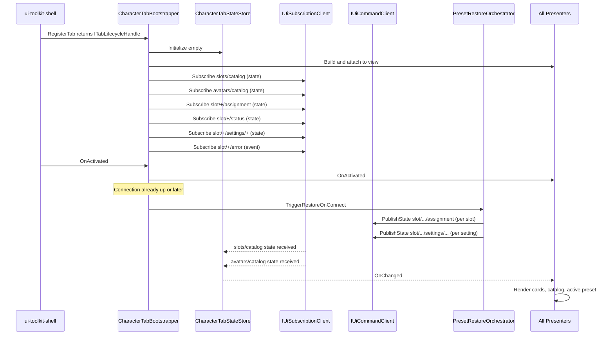
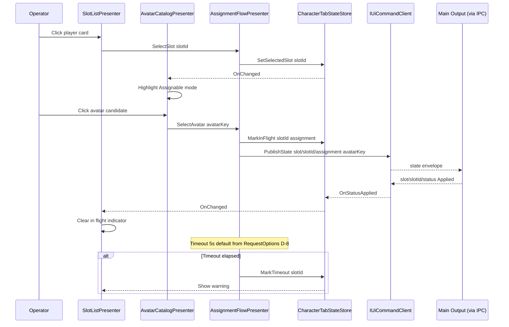
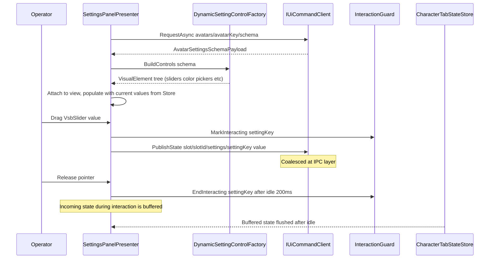
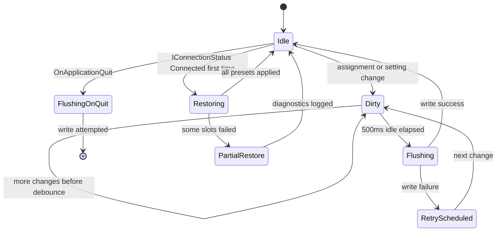
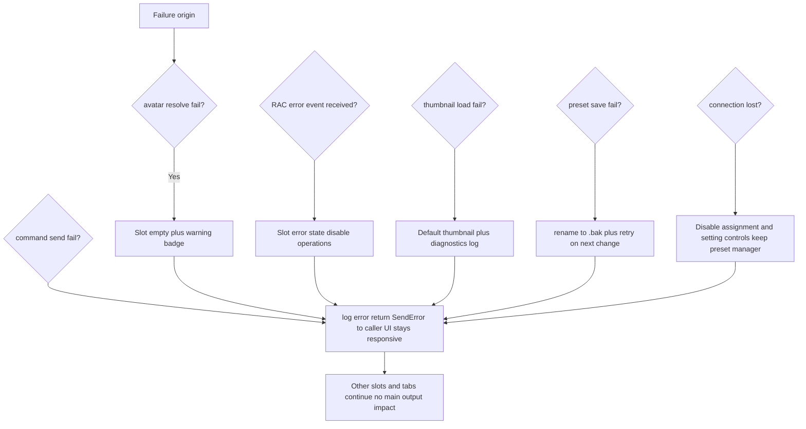

# Technical Design — character-selection-tab

## Overview

**Purpose**: 本 spec は、VTuberSystemBase の Display 1 UI 側において、MoCap アクター（RealtimeAvatarController 以下 RAC の Slot）とアバターの対応付け・個別設定・プリセット管理を行うキャラクター選択タブを提供する。`ui-toolkit-shell` の 3 タブのうち 1 枠として配置され、Slot をゲームのプレイヤーカードに、アバターを選べるキャラクターに見立てた UI を構築する。

**Users**: 配信オペレーター（プレイヤーカードとアバターを選択・設定する）、配信運用者（プリセット切替で配信シーンを 1 操作で切替える）、タブ開発者（本 spec の asmdef 構成をリファレンス実装として参照）。

**Impact**: 本 spec は Wave 2 タブ spec のリファレンスとなる初の実装タブであり、`ui-toolkit-shell` の `IUiCommandClient` / `IUiSubscriptionClient` / `IAsyncAssetLoader` / `ITabLifecycleHandle` Facade と `core-ipc-foundation` の state / event / request 契約を「上流契約の純粋な利用者」として実装する。メイン出力側の RAC アダプタは別 spec の責務であり、本 spec は IPC コントラクトを一方的に公開する。

### Goals

- `ui-toolkit-shell` のタブ枠に本タブの UIDocument を載せ、起動時一括プリロード・表示/非表示切替のみのタブ遷移・メイン出力フリーズ禁止の性能契約を構造的に受け入れる。
- Slot 一覧を IPC state で購読し、プレイヤーカード UI（empty / assigned / error の 3 状態）として可視化する。
- アバター候補一覧を Addressables 経由のストアドサムネイル付きで表示し、Slot ↔ アバター割当操作を 2 ステップで完結させる。
- アバター個別設定 UI を RAC 側設定スキーマから動的生成し、連続値は `PublishState`、離散操作は `PublishEvent` で送信する。
- Slot 割当 + 個別設定をプリセット単位で永続化し、CRUD + アクティブ化 UI を提供、起動時に通常 state 経路で復元する。
- 失敗経路（不可用アバター、RAC エラー、IPC 切断、ロード失敗、永続化失敗）で部分縮退し、メイン出力描画には一切影響を与えない。
- モック注入による本 spec 単独検証を成立させ、RAC 本体・実アバターアセット・メイン出力側の存在に依存せず UI 全経路を実行可能にする。

### Non-Goals

- RAC ランタイム本体の実装・改修（CS-1, CS-2。採用パッケージをそのまま利用）。
- メイン出力側での RAC インスタンス起動・Slot 生成・アバター適用・モーション適用（本 spec は IPC コントラクトを公開するのみ、具体受信は別 spec `rac-main-output-adapter` の責務）。
- アバターアセット本体のデザイン・リグ・テクスチャ（利用者プロジェクトの責務）。
- `core-ipc-foundation` のトランスポート・シリアライゼーション・接続管理（spec #1 の責務）。
- `ui-toolkit-shell` のルート UIDocument・タブ切替機構・Command 送信 API 実装・非同期ロード基盤実装（spec #3 の責務。本 spec は公開 API の利用者）。
- `output-renderer-shell` のシーン初期化・ディスパッチャ（spec #2 の責務）。
- 他タブ（ステージ・ライティング、カメラスイッチャー）の機能。
- MoCap ハードウェア設定 UI。
- タブ共通 UI 状態（アクティブタブ・ウィンドウ配置）の永続化（UI-7 により永続化しない）。

## Boundary Commitments

### This Spec Owns

- 本タブ専用の UIDocument（VisualTreeAsset + StyleSheet）と、`ui-toolkit-shell` の UXML/USS 配置規約（UI-3）への準拠。
- プレイヤーカード（Slot）一覧 UI、Slot 状態の可視化（empty / assigned / error）、表示順安定化。
- アバター候補一覧 UI（Addressables サムネイル付きグリッド）、Slot ↔ アバター割当フロー（2 ステップ）。
- アバター個別設定 UI（RAC メタデータから動的生成）、連続値 `PublishState` / 離散操作 `PublishEvent` 送信。
- 本タブが発行・購読する IPC コントラクト（トピック命名、payload スキーマ、kind 選択）。
- Slot 割当 + 個別設定をプリセット単位で永続化する仕組み（`IPresetStorage` 抽象、JSON 実装、デバウンス、アプリ終了フラッシュ）。
- プリセット CRUD UI（作成・名前変更・複製・削除・アクティブ化）とアクティブ表示。
- 起動時の保存ファイル読込と通常 state 経路での再送（復元）。
- 失敗ハンドリング（不可用アバター → empty + 警告、RAC エラー → エラー状態、IPC 切断 → 非活性化、ロード失敗 → UI 縮退、保存失敗 → 再試行）。
- 観測性 API（Slot 数・割当済み数・エラー数・進行中件数・最終保存時刻・接続状態）。
- スタンドアロン / Editor PlayMode 両対応（D-9 継承、ドメインリロード跨ぎなし）。
- 本 spec 単独検証構造（`IPresetStorage` / `IAvatarThumbnailResolver` / `IClock` の差し替え受入れ）。

### Out of Boundary

- メイン出力側で IPC を受信し RAC を操作する層（別 spec `rac-main-output-adapter` の責務）。
- RAC ランタイム本体、Slot 機構、アバタープロバイダ、モーションパイプラインの実装・改修。
- アバターアセット本体（Addressables Groups に登録されるアセット、`{avatarKey}.thumbnail` の作成）。
- `ui-toolkit-shell` の `IUiCommandClient` / `IUiSubscriptionClient` / `IAsyncAssetLoader` / `ITabLifecycleHandle` / 共通 UI コンポーネントライブラリの実装。
- `core-ipc-foundation` の WebSocket / JSON / 相関 ID / メインスレッド配信の実装。
- `output-renderer-shell` のシーン初期化・ディスプレイ切替・ディスパッチャ登録機構。
- タブ共通 UI 状態（アクティブタブ、ウィンドウ配置）の永続化。
- カメラ切替 / ステージ切替 / Volume 編集（他タブの責務）。

### Allowed Dependencies

- `ui-toolkit-shell` 公開 asmdef（`UiToolkitShell.Runtime`, `UiToolkitShell.CommonUi`）の Facade インタフェース：`IUiCommandClient`, `IUiSubscriptionClient`, `IConnectionStatus`, `IAsyncAssetLoader`, `ITabLifecycleHandle`, `ITabPanelRegistry`, `IDiagnosticsLogger`, `VsbSlider`, `VsbColorPicker`, `VsbNumberedList`, `VsbToggleGroup`。
- `core-ipc-foundation` 抽象 asmdef（`VTuberSystemBase.CoreIpc.Abstractions`）の型：`MessageKind`, `MessageEnvelope<T>`, `ISubscriptionToken`, `IpcResult`（公開されている範囲のみ、具体トランスポートに依存しない）。
- Unity 6.3 URP 標準：`UnityEngine.UIElements`, `UnityEngine.Application`, `UnityEngine.Object`（Sprite, Texture2D）。
- Unity Addressables（`com.unity.addressables` 2.x 系）— 実際の呼び出しは `IAsyncAssetLoader` 経由のみ。
- `System.Text.Json`（.NET Standard 2.1 内蔵）— 永続化 JSON シリアライズ。

**禁止される依存**:
- `output-renderer-shell` 実装 asmdef（ディスパッチャ登録は `rac-main-output-adapter` spec の責務）。
- 他タブ spec の実装 asmdef。
- `core-ipc-foundation` 具体実装 asmdef（WebSocket / JSON Codec クラス）。
- RAC 本体の直接 C# 参照（CS-1）。本タブは IPC payload 経由でのみ RAC に関わる。

### Revalidation Triggers

- **IPC トピック命名・payload スキーマ変更**（`slots/catalog`, `slot/{slotId}/assignment`, `slot/{slotId}/settings/{key}`, `slot/{slotId}/command`, `slot/{slotId}/status`, `avatars/catalog`, `avatars/{avatarKey}/schema`, `slot/{slotId}/error`）：メイン出力側 RAC アダプタ spec に影響、再検証必要。
- **設定メタデータスキーマ変更**（`SettingSchema` の型名・フィールド追加削除）：RAC アダプタ側のメタデータ生成コード再検証必要。
- **プリセット保存ファイルフォーマット変更**（JSON スキーマ、ファイル配置）：既存ユーザーデータの移行対応必要、互換バージョニング検討。
- **`IUiCommandClient` / `IUiSubscriptionClient` 等 `ui-toolkit-shell` 公開 API のシグネチャ変更**：本 spec の呼出しコード再確認必要。
- **タブ ID 列挙変更**（`TabId.Character` が変更される等）：`ITabPanelRegistry.RegisterTab` の呼出し再確認必要。
- **USS セレクタ命名規約変更**（`vsb-*` プレフィクス、BEM 風規約）：本 spec 同梱の USS 再検証必要。

## Architecture

### Architecture Pattern & Boundary Map

**選定パターン**: **MVP（Model-View-Presenter）+ Composition Root**。`CharacterTabBootstrapper` が `ITabLifecycleHandle` を受け取り、本タブの Presenter 群・State Store・永続化・モック差替点をコンポジションする。View は UXML + `VisualElement` Query で宣言し、Presenter が `IUiCommandClient` / `IUiSubscriptionClient` / `IAsyncAssetLoader` を介して IPC / Addressables と連携する。

```mermaid
graph TB
    subgraph UiToolkitShell[ui-toolkit-shell asmdef]
        TabHandle[ITabLifecycleHandle]
        CmdClient[IUiCommandClient]
        SubClient[IUiSubscriptionClient]
        AssetLoader[IAsyncAssetLoader]
        ConnStatus[IConnectionStatus]
        DiagLog[IDiagnosticsLogger]
        CommonUi[Common UI Controls]
    end
    subgraph CharacterTab[character-selection-tab asmdef]
        Bootstrapper[CharacterTabBootstrapper]
        StateStore[CharacterTabStateStore]
        SlotListPresenter[SlotListPresenter]
        AvatarCatalogPresenter[AvatarCatalogPresenter]
        AssignmentFlowPresenter[AssignmentFlowPresenter]
        SettingsPanelPresenter[SettingsPanelPresenter]
        PresetManagerPresenter[PresetManagerPresenter]
        DiagnosticsPresenter[TabDiagnosticsPresenter]
        DynamicControlFactory[DynamicSettingControlFactory]
        ThumbnailResolver[AvatarThumbnailResolver]
        PresetStorage[JsonPresetStorage]
        PresetStoreLogic[PresetStoreLogic]
        RestoreOrchestrator[PresetRestoreOrchestrator]
        View[Character Tab View UXML USS]
    end
    subgraph RacOutputAdapter[rac-main-output-adapter]
        AdapterNote[out of boundary]
    end
    Bootstrapper --> StateStore
    Bootstrapper --> SlotListPresenter
    Bootstrapper --> AvatarCatalogPresenter
    Bootstrapper --> AssignmentFlowPresenter
    Bootstrapper --> SettingsPanelPresenter
    Bootstrapper --> PresetManagerPresenter
    Bootstrapper --> DiagnosticsPresenter
    Bootstrapper --> RestoreOrchestrator
    Bootstrapper --> TabHandle
    SlotListPresenter --> StateStore
    AvatarCatalogPresenter --> StateStore
    AssignmentFlowPresenter --> StateStore
    SettingsPanelPresenter --> StateStore
    PresetManagerPresenter --> PresetStoreLogic
    PresetStoreLogic --> PresetStorage
    PresetStoreLogic --> StateStore
    RestoreOrchestrator --> PresetStoreLogic
    RestoreOrchestrator --> CmdClient
    SlotListPresenter --> SubClient
    AvatarCatalogPresenter --> SubClient
    SettingsPanelPresenter --> SubClient
    SettingsPanelPresenter --> CmdClient
    AssignmentFlowPresenter --> CmdClient
    PresetManagerPresenter --> CmdClient
    AvatarCatalogPresenter --> ThumbnailResolver
    ThumbnailResolver --> AssetLoader
    SettingsPanelPresenter --> DynamicControlFactory
    DynamicControlFactory --> CommonUi
    SlotListPresenter --> View
    AvatarCatalogPresenter --> View
    AssignmentFlowPresenter --> View
    SettingsPanelPresenter --> View
    PresetManagerPresenter --> View
    DiagnosticsPresenter --> View
    Bootstrapper --> ConnStatus
    Bootstrapper --> DiagLog
    CmdClient -. WebSocket JSON .- AdapterNote
    SubClient -. WebSocket JSON .- AdapterNote
```



**Architecture Integration**:

- **Selected pattern**: MVP + Composition Root。`CharacterTabBootstrapper` が `ITabLifecycleHandle.OnActivated` / `OnDeactivated` / `Dispose` に応じて Presenter 群の購読開始・停止・解放を制御する。
- **Domain/feature boundaries**:
  - View 層（UXML / USS / VisualElement Query）= 構造と見た目。
  - Presenter 層（5 つの Presenter + 1 つの Diagnostics Presenter）= UI イベント → Command、IPC state → View 反映、ローカル状態遷移。
  - State Store 層（`CharacterTabStateStore`）= 本タブ内で共有される UI 状態（Slot 一覧スナップショット、アバター候補、アクティブプリセット、進行中操作）を単一メインスレッド所有で保持。
  - 永続化層（`PresetStoreLogic`, `JsonPresetStorage`）= プリセット CRUD、デバウンスフラッシュ、破損フォールバック。
  - 復元層（`PresetRestoreOrchestrator`）= IPC 接続確立イベントを契機に通常 state 経路で送信。
- **Existing patterns preserved**:
  - `ui-toolkit-shell` が公開する Facade のみに依存（UI-5, UI-6 継承）。
  - `core-ipc-foundation` の配信セマンティクス（D-3, D-7, D-10）をそのまま利用。
  - D-9（PlayMode 限定起動）、UI-7（タブ共通 UI 状態は永続化しない）を遵守。
- **New components rationale**:
  - `CharacterTabStateStore`：Presenter 間の共有状態を単一所有し、`OnChanged` イベントで View を同期（UI Toolkit のイベント駆動描画を活用）。
  - `DynamicSettingControlFactory`：設定メタデータから `VsbSlider` / `Toggle` / `VsbColorPicker` / `VsbToggleGroup` 等を型に応じて構築（CS-5）。
  - `AvatarThumbnailResolver`：`{avatarKey}.thumbnail` 規約で Addressables から Sprite を取得、失敗時は同梱フォールバック（CS-13）。
  - `PresetStoreLogic` + `JsonPresetStorage`：CS-8, CS-9, CS-12 の責務を分離。`IPresetStorage` 抽象でテスト時にメモリダブル注入可能。
  - `PresetRestoreOrchestrator`：接続確立イベントを検知し通常 state 経路で送信（CS-10）。
- **Steering compliance**: `.kiro/steering/` は未整備のため、CLAUDE.md の Spec-Driven Development 規律と上流 3 spec の設計契約に整合させる。

### Dependency Direction

```
Abstractions (ui-toolkit-shell facades, core-ipc abstractions)
    ↓
View (UXML / USS / VisualElement query helpers)
    ↓
State (CharacterTabStateStore, domain value objects)
    ↓
Services (AvatarThumbnailResolver, DynamicSettingControlFactory, PresetStoreLogic, JsonPresetStorage, PresetRestoreOrchestrator)
    ↓
Presenters (SlotList / AvatarCatalog / AssignmentFlow / SettingsPanel / PresetManager / TabDiagnostics)
    ↓
Composition Root (CharacterTabBootstrapper)
```

Left to right が許容 import 方向。逆方向は禁止（コードレビューでエラー）。Presenter から Services へは呼び出し可能だが Services から Presenter への参照は禁止。

### Technology Stack

| Layer | Choice / Version | Role in Feature | Notes |
|-------|------------------|-----------------|-------|
| UI Framework | Unity UI Toolkit (`UnityEngine.UIElements`, Unity 6.3 / 6000.3 系) | UXML + USS + VisualElement Query によるタブ UI 構築 | `ui-toolkit-shell` の配置規約に従う、独自 PanelSettings を持たない |
| Common UI Library | `UiToolkitShell.CommonUi`（VsbSlider / VsbColorPicker / VsbNumberedList / VsbToggleGroup） | 設定コントロール動的生成の素材（CS-5） | タブ spec が独自コントロールを加えない |
| IPC Client | `IUiCommandClient` / `IUiSubscriptionClient`（`ui-toolkit-shell` Facade） | state / event / request の送受信 | 具体トランスポートには非依存、メインスレッド配信（D-3）は上流で保証 |
| Async Asset Loading | `IAsyncAssetLoader`（`ui-toolkit-shell` Facade、裏は Unity Addressables 2.x） | アバターサムネイル取得、scope 単位解放 | タブ破棄時に `ReleaseAll("tab:character")` で一括解放 |
| Persistence | `System.Text.Json`（.NET Standard 2.1）+ `System.IO`（`File`, `Directory`） | プリセット JSON の読み書き、デバウンス | 配置既定: `Application.persistentDataPath/character-selection-tab/presets/*.json` |
| Assembly Layout | asmdef 分割 | `VTuberSystemBase.CharacterSelectionTab.Runtime`（本体）+ `.Tests` | 参照先: `UiToolkitShell.Runtime`, `UiToolkitShell.CommonUi`, `VTuberSystemBase.CoreIpc.Abstractions`, `com.unity.addressables`（間接） |
| Logging | `IDiagnosticsLogger`（`ui-toolkit-shell` Facade） | `LogCategory.TabSpec` + 本タブ固有カテゴリ | メイン出力描画経路なし（構造的保証、Requirement 9 第 7 項） |

> 詳細な調査経緯・代替案却下理由・RAC パッケージ可視性調査は `research.md` 参照。

## File Structure Plan

### Directory Structure

```
Packages/jp.hidano.vtuber-system-base.character-selection-tab/
├── package.json
├── Runtime/
│   ├── Bootstrap/
│   │   ├── CharacterTabBootstrapper.cs        # Composition Root、ITabLifecycleHandle 購読、Presenter 構築・解放
│   │   └── CharacterTabConfig.cs              # Inspector 構成（既定保存パス、デバウンス ms 等）
│   ├── State/
│   │   ├── CharacterTabStateStore.cs          # 共有状態（Slot, アバター候補, アクティブプリセット, 進行中操作）
│   │   ├── SlotRuntimeState.cs                # Slot ごとの UI 状態（assignment, settings, status, inFlight）
│   │   ├── AvatarCatalogEntry.cs              # アバター候補エントリ（key, displayName）
│   │   ├── SettingSchema.cs                   # 設定メタデータ DTO（field, type, min/max, default, label, unit, options）
│   │   ├── SettingValue.cs                    # discriminated union 相当の struct（Float/Int/Bool/Color/Enum/Vector3）
│   │   └── TabDiagnosticsSnapshot.cs          # 診断スナップショット struct
│   ├── Topics/
│   │   ├── CharacterTopics.cs                 # topic 文字列定数（slots/catalog, slot/{id}/assignment 等）
│   │   └── CharacterTopicBuilder.cs           # slotId / avatarKey / settingKey を安全に埋め込む
│   ├── Ipc/
│   │   ├── Payloads/
│   │   │   ├── SlotCatalogPayload.cs          # slots/catalog の state payload
│   │   │   ├── SlotAssignmentPayload.cs       # slot/{id}/assignment の state payload
│   │   │   ├── SlotSettingValuePayload.cs     # slot/{id}/settings/{key} の state payload
│   │   │   ├── SlotCommandPayload.cs          # slot/{id}/command の event payload (Reset/Reload/PresetApply)
│   │   │   ├── SlotStatusPayload.cs           # slot/{id}/status の state payload
│   │   │   ├── SlotErrorPayload.cs            # slot/{id}/error の event payload
│   │   │   ├── AvatarCatalogPayload.cs        # avatars/catalog の state payload
│   │   │   └── AvatarSettingsSchemaPayload.cs # avatars/{key}/schema の request response payload
│   │   └── CharacterTabIpcBinder.cs           # Subscribe 集約（topic → StateStore 更新）と PublishState/Event の薄ラッパ
│   ├── Presenters/
│   │   ├── SlotListPresenter.cs               # プレイヤーカード一覧の描画・イベントハンドリング
│   │   ├── AvatarCatalogPresenter.cs          # アバター候補グリッドの描画・サムネイル解決
│   │   ├── AssignmentFlowPresenter.cs         # 割当 2 ステップ UX の制御
│   │   ├── SettingsPanelPresenter.cs          # 個別設定パネルの動的生成・値変更 → PublishState
│   │   ├── PresetManagerPresenter.cs          # プリセット CRUD + Active 表示
│   │   └── TabDiagnosticsPresenter.cs         # 診断パネル（Slot 数、エラー数、保存時刻、接続状態）
│   ├── Services/
│   │   ├── DynamicSettingControlFactory.cs    # SettingSchema → VisualElement（VsbSlider/Toggle 等）のマッピング
│   │   ├── AvatarThumbnailResolver.cs         # {avatarKey}.thumbnail の解決とフォールバック
│   │   ├── IAvatarThumbnailResolver.cs        # テスト差替点
│   │   ├── IPresetStorage.cs                  # テスト差替点
│   │   ├── JsonPresetStorage.cs               # ファイルシステム実装（System.Text.Json）
│   │   ├── PresetStoreLogic.cs                # CRUD + デバウンス + 破損フォールバック
│   │   ├── PresetRestoreOrchestrator.cs       # 接続確立 → 通常 state 経路で再送
│   │   ├── InteractionGuard.cs                # 操作中コントロールの state 逆流抑止（200ms アイドル判定）
│   │   ├── IClock.cs                          # テスト差替点（デバウンス・タイムアウト・InteractionGuard）
│   │   └── SystemClock.cs                     # 既定実装（DateTimeOffset.UtcNow）
│   ├── View/
│   │   ├── CharacterTab.uxml                  # タブ全体 UXML（プレイヤーカード領域 + 候補領域 + 設定領域 + プリセットバー）
│   │   ├── CharacterTab.uss                   # vsb- プレフィクス + BEM 風（vsb-char-tab__*、vsb-player-card__* 等）
│   │   ├── PlayerCard.uxml                    # プレイヤーカード 1 枚の UXML
│   │   ├── AvatarCatalogItem.uxml             # アバター候補 1 枚の UXML
│   │   ├── SettingRow.uxml                    # 動的生成される設定項目の行テンプレ
│   │   ├── PresetBar.uxml                     # プリセット CRUD バー
│   │   ├── DefaultAvatarThumbnail.asset       # サムネイル未解決時フォールバック Sprite
│   │   └── ViewQueryHelpers.cs                # VisualElement Query の定型化
│   ├── Diagnostics/
│   │   └── CharacterTabDiagnostics.cs         # TabDiagnosticsSnapshot の生成（StateStore + PresetStoreLogic 参照）
│   └── VTuberSystemBase.CharacterSelectionTab.Runtime.asmdef
├── Editor/
│   └── VTuberSystemBase.CharacterSelectionTab.Editor.asmdef
├── Tests/
│   ├── Runtime/
│   │   ├── SlotListPresenterTests.cs          # Slot 一覧 state 受信 → UI 反映
│   │   ├── AssignmentFlowPresenterTests.cs    # 割当 state 送信、進行中ロック、タイムアウト
│   │   ├── SettingsPanelPresenterTests.cs     # スキーマ → 動的 UI、値変更 → PublishState、state 逆流競合
│   │   ├── PresetStoreLogicTests.cs           # CRUD、デバウンス、破損フォールバック
│   │   ├── PresetRestoreOrchestratorTests.cs  # 接続確立イベント → 通常 state 経路送信
│   │   ├── AvatarThumbnailResolverTests.cs    # 解決成功、フォールバック
│   │   ├── CharacterTopicBuilderTests.cs      # topic 文字列の安全性
│   │   ├── FakeUiCommandClient.cs             # テストダブル
│   │   ├── FakeUiSubscriptionClient.cs        # テストダブル
│   │   ├── FakeAsyncAssetLoader.cs            # テストダブル
│   │   ├── InMemoryPresetStorage.cs           # テストダブル
│   │   ├── ManualClock.cs                     # テストダブル（IClock）
│   │   └── VTuberSystemBase.CharacterSelectionTab.Tests.Runtime.asmdef
│   └── PlayMode/
│       └── CharacterTabPlayModeSample.unity   # モック UI シェルでの手動検証シーン
└── README.md
```

### Modified Files

- `jp.hidano.vtuber-system-base.ui-toolkit-shell` 側の `UiToolkitShellSkinProfile.CharacterTabVisualTreeAsset` および `CharacterTabStyleSheets` に本 spec が提供する `CharacterTab.uxml` / `CharacterTab.uss` を参照させる運用（本 spec のパッケージ内に完結、`ui-toolkit-shell` 側のコード変更は不要）。

**Dependency direction 強制**:
```
UiToolkitShell.Runtime + UiToolkitShell.CommonUi + VTuberSystemBase.CoreIpc.Abstractions + com.unity.addressables (indirect)
    ↑
CharacterSelectionTab.Runtime
    ↑
CharacterSelectionTab.Tests.Runtime
```
逆方向（CharacterSelectionTab → 他タブ spec、CharacterSelectionTab → core-ipc 具体実装、CharacterSelectionTab → output-renderer-shell）は禁止。asmdef の参照設定で構造的に阻止する。

## System Flows

### Flow 1: タブアクティブ化 → 初期同期



**Key decisions**:
- 購読登録はタブアクティブ化前（`RegisterTab` 直後）に完了させ、アクティブ化時は UI 表示と進行中操作の再開のみ。これにより初期 state 取りこぼしを防止（`ui-toolkit-shell` Req 5.7）。
- 復元は `IConnectionStatus.IsConnected == true` を検知した時点で一度だけ実行する。起動時すでに接続済みなら即時、未接続ならイベント到達を待つ。
- 復元中の state はメイン出力側で coalesce されるため、短時間に複数 Slot の state を送っても最終値は収束する（D-7）。

### Flow 2: Slot ↔ アバター割当フロー（2 ステップ UX）



**Key decisions**:
- 割当は `PublishState`（CS-6）。中間選択は coalesce で吸収、最終値のみメイン出力に反映。
- `SlotStatus.Applied` 受信で in-flight 解除。タイムアウトは 5 秒（D-8 継承）、超過で UI に警告提示し再試行可能状態へ戻す（Requirement 4 第 8 項）。
- `Reset` は event（`slot/{slotId}/command` payload `{ kind: "Reset" }`）で送信し、UI は同じ in-flight 表示を使う。

### Flow 3: 個別設定 UI の動的生成と値変更



**Key decisions**:
- スキーマ取得は Request（5 秒タイムアウト、D-8）。失敗時は設定領域にエラー + 再試行 UI、他領域は継続（Requirement 5 第 9 項）。
- `InteractionGuard` は `PointerDownEvent` で `IsInteracting = true`、`PointerUpEvent` または 200ms 操作なしで false に遷移。`IsInteracting` 中の同 topic state は `Store` がバッファし、false 復帰時に最新値を適用（Requirement 5 第 7 項、research Decision 4）。
- アバター切替時は当該 Slot の設定 UI を一括破棄し、新スキーマで再生成（Requirement 5 第 10 項）。

### Flow 4: プリセット永続化とデバウンス / 復元



**Key decisions**:
- デバウンス 500ms（R-5 仮置き、運用チューニング可）。`Dirty` 中の複数変更は次回書込でまとめてフラッシュ（CS-9）。
- 終了時フラッシュは `Application.quitting` と Editor の `playModeStateChanged == ExitingPlayMode` の両方で発火、冪等（Requirement 8 第 4 項、Requirement 10 第 3 項）。
- 復元は接続確立を契機に 1 回のみ（`Restoring`）。部分失敗時は当該 Slot を empty + 警告にし、他 Slot は継続（Requirement 8 第 11 項、CS-11）。
- 書込失敗は `RetryScheduled` 状態に遷移し、次回変更時に再試行（Requirement 8 第 9 項）。UI クラッシュや描画停止は発生させない。

### Flow 5: 失敗・縮退ハンドリング



**Key decisions**:
- いかなる失敗経路でもメイン出力に描画しない（構造的に `IDiagnosticsLogger` 経路のみ使用、Requirement 9 第 7 項、`ui-toolkit-shell` Requirement 11 第 7 項に継承）。
- 接続断中はプリセット CRUD は続行可能（ローカル操作）、送信系は無効化し、接続回復時に `RestoreOrchestrator` がアクティブプリセットを再送信（Requirement 7 第 7 項、第 8 項）。
- 診断ログのカテゴリは `LogCategory.TabSpec` に加えて本 spec 固有の `context = { topic, slotId, avatarKey, errorCode }` を付与して検索性を確保（Requirement 9）。

## Requirements Traceability

| Requirement | Summary | Components | Interfaces | Flows |
|-------------|---------|------------|------------|-------|
| 1.1 | タブ専用 UIDocument と ui-toolkit-shell 配置規約適合 | CharacterTabBootstrapper, View | UiToolkitShellSkinProfile, ITabLifecycleHandle | Flow 1 |
| 1.2 | USS セレクタ命名規約 vsb- BEM 適用 | View (CharacterTab.uss), DynamicSettingControlFactory | — | — |
| 1.3 | プリロードでアタッチ完了、タブ切替で再 clone しない | CharacterTabBootstrapper | ITabPanelRegistry, UiToolkitShellSkinProfile | Flow 1 |
| 1.4 | アクティブ化時は display 切替のみ | CharacterTabBootstrapper, Presenters | ITabLifecycleHandle | Flow 1 |
| 1.5 | 非アクティブ化時の購読一時停止と状態保持 | CharacterTabBootstrapper, Presenters | ITabLifecycleHandle | Flow 1 |
| 1.6 | メイン出力描画フレーム干渉禁止 | 全コンポーネント（同期 I/O なし、Addressables は ui-toolkit-shell 経由） | IAsyncAssetLoader, IUiCommandClient | — |
| 1.7 | asmdef 独立、公開 API のみ依存 | VTuberSystemBase.CharacterSelectionTab.Runtime.asmdef | — | — |
| 1.8 | UXML 差し替え拡張点利用 | CharacterTabBootstrapper, View | UiToolkitShellSkinProfile | — |
| 2.1 | Slot 一覧 state 購読と UI 反映 | SlotListPresenter, CharacterTabStateStore, CharacterTabIpcBinder | IUiSubscriptionClient | Flow 1 |
| 2.2 | プレイヤーカード可視情報 | SlotListPresenter, View (PlayerCard.uxml) | — | — |
| 2.3 | Slot 更新時の UIDocument 非再生成追従 | SlotListPresenter, CharacterTabStateStore | — | Flow 1 |
| 2.4 | empty 状態の視覚表現 | SlotListPresenter, View | — | — |
| 2.5 | empty Slot からの割当操作エントリ | SlotListPresenter, AssignmentFlowPresenter | — | Flow 2 |
| 2.6 | assigned Slot の変更・設定・reset・reload エントリ | SlotListPresenter, AssignmentFlowPresenter, SettingsPanelPresenter | — | Flow 2, 3 |
| 2.7 | error 状態の警告バッジと操作縮退 | SlotListPresenter, View | — | Flow 5 |
| 2.8 | 表示順安定化 | SlotListPresenter（Slot ID 昇順） | — | — |
| 2.9 | 接続待ちプレースホルダと操作非活性 | SlotListPresenter, TabDiagnosticsPresenter | IConnectionStatus | Flow 5 |
| 3.1 | アバター候補 state or request 取得 | AvatarCatalogPresenter, CharacterTabIpcBinder | IUiSubscriptionClient | Flow 1 |
| 3.2 | 候補一覧グリッド表示 | AvatarCatalogPresenter, View (AvatarCatalogItem.uxml) | — | — |
| 3.3 | 表示名可視化 | AvatarCatalogPresenter, View | — | — |
| 3.4 | ストアドサムネイル表示 | AvatarCatalogPresenter, AvatarThumbnailResolver | IAsyncAssetLoader | — |
| 3.4a | サムネイル未解決時のフォールバック | AvatarThumbnailResolver (DefaultAvatarThumbnail.asset) | IAsyncAssetLoader, IDiagnosticsLogger | Flow 5 |
| 3.5 | 候補選択 → 割当フロー | AssignmentFlowPresenter | — | Flow 2 |
| 3.6 | Addressables key と表示名の分離管理 | AvatarCatalogEntry, CharacterTabStateStore | — | — |
| 3.7 | 候補取得失敗時の再試行 UI | AvatarCatalogPresenter | IDiagnosticsLogger | Flow 5 |
| 3.8 | 重複 key の検出・一意化 | AvatarCatalogPresenter（一意化 + 診断ログ） | IDiagnosticsLogger | — |
| 3.9 | 候補更新の自動反映 | AvatarCatalogPresenter, CharacterTabStateStore | IUiSubscriptionClient | Flow 1 |
| 4.1 | 割当 UI フロー | AssignmentFlowPresenter, SlotListPresenter, AvatarCatalogPresenter | — | Flow 2 |
| 4.2 | 割当 state 送信（Addressables key を payload） | AssignmentFlowPresenter | IUiCommandClient | Flow 2 |
| 4.3 | reset event 送信 | AssignmentFlowPresenter | IUiCommandClient | Flow 2 |
| 4.4 | reload event 送信とローディング表示 | AssignmentFlowPresenter | IUiCommandClient | Flow 2 |
| 4.5 | 進行中表示と重複操作抑止 | AssignmentFlowPresenter, CharacterTabStateStore | — | Flow 2 |
| 4.6 | 反映完了 state 受信時の UI 更新 | AssignmentFlowPresenter, SlotListPresenter | IUiSubscriptionClient | Flow 2 |
| 4.7 | 複数 Slot 並列操作 | CharacterTabStateStore（Slot 単位ロック） | — | Flow 2 |
| 4.8 | タイムアウト処理（5 秒既定） | AssignmentFlowPresenter, IClock | — | Flow 2 |
| 4.9 | 割当失敗イベントでエラー状態遷移 | AssignmentFlowPresenter, SlotListPresenter | IUiSubscriptionClient | Flow 5 |
| 4.10 | coalesce 前提の冪等 UI 状態 | CharacterTabStateStore | — | — |
| 5.1 | 設定メタデータ Request | SettingsPanelPresenter | IUiCommandClient | Flow 3 |
| 5.2 | 動的 UI 生成 | DynamicSettingControlFactory, SettingsPanelPresenter | VsbSlider/VsbColorPicker/VsbToggleGroup | Flow 3 |
| 5.3 | 設定値変更時の PublishState | SettingsPanelPresenter | IUiCommandClient | Flow 3 |
| 5.4 | 高頻度変更は coalesce に任せ UI 流量制御最小化 | SettingsPanelPresenter | IUiCommandClient | Flow 3 |
| 5.5 | ドラッグ中の同期処理禁止 | SettingsPanelPresenter, DynamicSettingControlFactory | — | Flow 3 |
| 5.6 | 範囲・型バリデーション | DynamicSettingControlFactory, SettingsPanelPresenter | — | — |
| 5.7 | state 逆流時の競合解消 | InteractionGuard, CharacterTabStateStore | — | Flow 3 |
| 5.8 | 設定内離散操作の event 送信 | SettingsPanelPresenter | IUiCommandClient | Flow 3 |
| 5.9 | スキーマ取得失敗時のエラー UI | SettingsPanelPresenter | IDiagnosticsLogger | Flow 5 |
| 5.10 | アバター切替時の UI 再生成 | SettingsPanelPresenter, DynamicSettingControlFactory | — | Flow 3 |
| 5.11 | メタデータ不整合の診断ログとスキップ | DynamicSettingControlFactory, SettingsPanelPresenter | IDiagnosticsLogger | — |
| 6.1 | アバター本体ロードはメイン出力側委譲 | AssignmentFlowPresenter | IUiCommandClient | — |
| 6.2 | 補助アセットは IAsyncAssetLoader 経由 | AvatarThumbnailResolver | IAsyncAssetLoader | — |
| 6.3 | ロード中プレースホルダ | AvatarCatalogPresenter, AvatarThumbnailResolver | — | — |
| 6.4 | 完了コールバックメインスレッド配信 | AvatarThumbnailResolver（ui-toolkit-shell 保証継承） | IAsyncAssetLoader | — |
| 6.5 | ロード失敗時の診断ログと UI 縮退 | AvatarThumbnailResolver, AvatarCatalogPresenter | IDiagnosticsLogger | Flow 5 |
| 6.6 | 重複ロード抑止 | AvatarThumbnailResolver（ui-toolkit-shell 保証継承） | IAsyncAssetLoader | — |
| 6.7 | Addressables 未登録時の空表示と操作非活性 | AvatarCatalogPresenter, SlotListPresenter | — | — |
| 6.8 | アバター本体 GameObject 参照を UI 側で保持しない | 全コンポーネント（契約） | — | — |
| 7.1 | 不可用アバターは empty + 警告 | CharacterTabIpcBinder, SlotListPresenter | IDiagnosticsLogger | Flow 5 |
| 7.2 | RAC エラーでエラー状態、他 Slot 継続 | CharacterTabIpcBinder, SlotListPresenter | IUiSubscriptionClient | Flow 5 |
| 7.3 | 非同期ロード失敗は当該要素のみエラー | AvatarThumbnailResolver | — | Flow 5 |
| 7.4 | Command 送信失敗の診断ログ | AssignmentFlowPresenter, SettingsPanelPresenter, PresetManagerPresenter | IDiagnosticsLogger | Flow 5 |
| 7.5 | バリデーションエラーの近傍表示 | DynamicSettingControlFactory, SettingsPanelPresenter | — | Flow 5 |
| 7.6 | メイン出力非描画（構造的保証） | 全コンポーネント（IDiagnosticsLogger 以外の出力経路なし） | — | — |
| 7.7 | IPC 切断中の UI 非活性化 | CharacterTabBootstrapper, SlotListPresenter, SettingsPanelPresenter | IConnectionStatus | Flow 5 |
| 7.8 | 接続回復時の再取得 | CharacterTabIpcBinder, PresetRestoreOrchestrator | IConnectionStatus | Flow 1, 5 |
| 7.9 | 失敗の診断ログ記録 | CharacterTabDiagnostics, 全 Presenter | IDiagnosticsLogger | — |
| 8.1 | Slot 割当 + 個別設定のプリセット単位保存 | PresetStoreLogic, JsonPresetStorage | IPresetStorage | Flow 4 |
| 8.1a | プリセット CRUD UI | PresetManagerPresenter | IUiCommandClient | — |
| 8.1b | アクティブプリセット名の可視化 | PresetManagerPresenter, TabDiagnosticsPresenter | — | — |
| 8.1c | プリセット切替時の通常 state 経路での一括適用 | PresetRestoreOrchestrator, PresetManagerPresenter | IUiCommandClient | Flow 4 |
| 8.1d | 重複名称のバリデーションエラー | PresetStoreLogic, PresetManagerPresenter | — | — |
| 8.2 | 保存対象外の除外 | PresetStoreLogic, JsonPresetStorage | — | — |
| 8.3 | デバウンス即時保存 | PresetStoreLogic, IClock | IPresetStorage | Flow 4 |
| 8.4 | 終了時フラッシュ | CharacterTabBootstrapper, PresetStoreLogic | — | Flow 4 |
| 8.5 | 起動時保存ファイル読込と state 送信 | PresetRestoreOrchestrator, PresetStoreLogic | IUiCommandClient, IConnectionStatus | Flow 4 |
| 8.6 | 初回起動時の復元スキップ | PresetStoreLogic, PresetRestoreOrchestrator | — | Flow 4 |
| 8.7 | 破損時のバックアップリネームとフォールバック | PresetStoreLogic, JsonPresetStorage | IDiagnosticsLogger | Flow 4, 5 |
| 8.8 | 保存済み Addressables key 解決不能時の empty + 警告 | PresetRestoreOrchestrator, SlotListPresenter | — | Flow 5 |
| 8.9 | 書込失敗の再試行 | PresetStoreLogic | IDiagnosticsLogger | Flow 4 |
| 8.10 | 保存配置の差替可能構造 | IPresetStorage, JsonPresetStorage | IPresetStorage | — |
| 8.11 | 復元部分失敗時の継続 | PresetRestoreOrchestrator | IDiagnosticsLogger | Flow 5 |
| 9.1 | 各段階の診断ログ | CharacterTabBootstrapper, 全 Presenter, PresetStoreLogic | IDiagnosticsLogger | — |
| 9.2 | state 送信ログ | AssignmentFlowPresenter, SettingsPanelPresenter | IDiagnosticsLogger | — |
| 9.3 | event 送信ログ | AssignmentFlowPresenter, SettingsPanelPresenter | IDiagnosticsLogger | — |
| 9.4 | RAC エラー受信ログ | CharacterTabIpcBinder | IDiagnosticsLogger | — |
| 9.5 | Addressables 失敗ログ | AvatarThumbnailResolver | IDiagnosticsLogger | — |
| 9.6 | 永続化 I/O ログ | PresetStoreLogic, JsonPresetStorage | IDiagnosticsLogger | — |
| 9.7 | メイン出力非描画 | 全コンポーネント（IDiagnosticsLogger 経路のみ） | — | — |
| 9.8 | ログレベル外部切替 | 利用側 IDiagnosticsLogger | IDiagnosticsLogger | — |
| 9.9 | 診断状態の外部公開 | CharacterTabDiagnostics, TabDiagnosticsPresenter | TabDiagnosticsSnapshot | — |
| 10.1 | スタンドアロン自動初期化 | CharacterTabBootstrapper | ITabLifecycleHandle | Flow 1 |
| 10.2 | Editor PlayMode 自動初期化 | CharacterTabBootstrapper | ITabLifecycleHandle | Flow 1 |
| 10.3 | PlayMode 終了時クリーンアップ | CharacterTabBootstrapper, PresetStoreLogic | — | Flow 4 |
| 10.4 | PlayMode 反復時リーク回避 | CharacterTabBootstrapper | — | — |
| 10.5 | Edit モード非起動 | CharacterTabBootstrapper（ui-toolkit-shell 経由で PlayMode のみ駆動） | — | — |
| 10.6 | ドメインリロード跨ぎなし | CharacterTabBootstrapper（静的状態を持たない） | — | — |
| 10.7 | スタンドアロン / PlayMode の挙動同一 | CharacterTabBootstrapper（同一経路） | — | — |
| 11.1 | テストダブルとの連携 | FakeUiCommandClient, FakeUiSubscriptionClient, FakeAsyncAssetLoader, InMemoryPresetStorage, ManualClock | — | — |
| 11.2 | 自己ループでの送受信テスト | PresenterTests（上流自己ループ継承） | — | — |
| 11.3 | 差替可能なストレージ抽象 | IPresetStorage, InMemoryPresetStorage | IPresetStorage | — |
| 11.4 | PlayMode 手動検証手順 | CharacterTabPlayModeSample.unity + README | — | — |
| 11.5 | 主要挙動のテストケース | SlotListPresenterTests, AssignmentFlowPresenterTests, SettingsPanelPresenterTests, PresetStoreLogicTests, PresetRestoreOrchestratorTests, AvatarThumbnailResolverTests | — | — |
| 11.6 | アセット解決モック | IAvatarThumbnailResolver, FakeAsyncAssetLoader | IAvatarThumbnailResolver, IAsyncAssetLoader | — |
| 11.7 | 時刻抽象 | IClock, ManualClock | IClock | — |

## Components and Interfaces

### Summary

| Component | Domain/Layer | Intent | Req Coverage | Key Dependencies (P0/P1) | Contracts |
|-----------|--------------|--------|--------------|--------------------------|-----------|
| CharacterTabBootstrapper | Composition Root | タブ全体の初期化・解放、`ITabLifecycleHandle` 駆動 | 1.1, 1.4, 1.5, 1.7, 1.8, 7.7, 7.8, 8.4, 10.1〜10.7 | ITabLifecycleHandle (P0), IUiCommandClient (P0), IUiSubscriptionClient (P0), IConnectionStatus (P0), IAsyncAssetLoader (P0), IDiagnosticsLogger (P1), IPresetStorage (P0), IClock (P0) | Service |
| CharacterTabStateStore | State | 本タブ全体の共有状態（Slot, 候補, プリセット, 進行中） | 2.1, 2.3, 2.8, 2.9, 3.9, 4.5, 4.7, 4.10, 5.7 | — | State, Event |
| SlotListPresenter | UI Presenter | プレイヤーカード一覧描画、Slot イベントハンドリング | 2.1〜2.9, 7.1, 7.2 | CharacterTabStateStore (P0), IDiagnosticsLogger (P1) | Service (presentational) |
| AvatarCatalogPresenter | UI Presenter | アバター候補グリッド描画、サムネイル解決 | 3.1〜3.9, 6.3, 6.7 | CharacterTabStateStore (P0), IAvatarThumbnailResolver (P0), IDiagnosticsLogger (P1) | Service (presentational) |
| AssignmentFlowPresenter | UI Presenter | 割当 2 ステップ UX 制御、state/event 送信、タイムアウト | 4.1〜4.10, 7.4, 9.2, 9.3 | CharacterTabStateStore (P0), IUiCommandClient (P0), IClock (P0), IDiagnosticsLogger (P1) | Service |
| SettingsPanelPresenter | UI Presenter | 設定パネル動的生成、値変更送信、操作中 UX | 5.1〜5.11, 7.4, 9.2, 9.3 | CharacterTabStateStore (P0), IUiCommandClient (P0), DynamicSettingControlFactory (P0), InteractionGuard (P0), IDiagnosticsLogger (P1) | Service |
| PresetManagerPresenter | UI Presenter | プリセット CRUD UI、アクティブ表示 | 8.1a, 8.1b, 8.1c, 8.1d | PresetStoreLogic (P0), CharacterTabStateStore (P0), IUiCommandClient (P0), IDiagnosticsLogger (P1) | Service |
| TabDiagnosticsPresenter | UI Presenter | 診断パネルの描画、接続状態・保存時刻の可視化 | 2.9, 8.1b, 9.9 | CharacterTabStateStore (P0), IConnectionStatus (P0), CharacterTabDiagnostics (P1) | Service (presentational) |
| CharacterTabIpcBinder | Integration | Subscribe 集約、topic → StateStore 更新、送信薄ラッパ | 2.1, 3.1, 3.9, 4.6, 4.9, 7.1, 7.2, 7.8, 9.4 | IUiSubscriptionClient (P0), IUiCommandClient (P0), CharacterTabStateStore (P0), IDiagnosticsLogger (P1) | Service, Event |
| DynamicSettingControlFactory | Service | `SettingSchema` → `VisualElement` 型マッピング | 5.2, 5.6, 5.11 | Common UI Controls (P0), IDiagnosticsLogger (P1) | Service |
| AvatarThumbnailResolver | Service | `{avatarKey}.thumbnail` 解決、フォールバック | 3.4, 3.4a, 6.2〜6.6 | IAsyncAssetLoader (P0), IDiagnosticsLogger (P1) | Service |
| PresetStoreLogic | Service | プリセット CRUD、デバウンス、破損フォールバック | 8.1〜8.10 | IPresetStorage (P0), IClock (P0), IDiagnosticsLogger (P1) | Service, State |
| JsonPresetStorage | Service Impl | ファイルシステム + JSON 実装 | 8.7, 8.9, 8.10 | System.IO (P0), System.Text.Json (P0) | Service |
| PresetRestoreOrchestrator | Service | 接続確立時の復元、通常 state 経路再送 | 8.5, 8.6, 8.8, 8.11, 7.8 | IConnectionStatus (P0), IUiCommandClient (P0), PresetStoreLogic (P0), CharacterTabStateStore (P0), IDiagnosticsLogger (P1) | Service, Event |
| InteractionGuard | Service | 操作中フラグ管理、200ms アイドル判定 | 5.7 | IClock (P0) | State |
| CharacterTabDiagnostics | Diagnostics | TabDiagnosticsSnapshot 生成 | 9.9 | CharacterTabStateStore (P1), PresetStoreLogic (P1), IConnectionStatus (P1) | State |

### Composition Root

#### CharacterTabBootstrapper

| Field | Detail |
|-------|--------|
| Intent | タブ全体の Composition Root。`ui-toolkit-shell` から受け取る依存を Presenter 群に配線し、`ITabLifecycleHandle` のアクティブ化・非アクティブ化・解放に応じて購読・進行中操作を制御する。 |
| Requirements | 1.1, 1.4, 1.5, 1.7, 1.8, 7.7, 7.8, 8.4, 10.1〜10.7 |

**Responsibilities & Constraints**
- 初期化順序: `CharacterTabConfig` 検証 → `CharacterTabStateStore` 構築 → `PresetStoreLogic` + `JsonPresetStorage`（`IPresetStorage` 注入） → `DynamicSettingControlFactory` / `AvatarThumbnailResolver` / `InteractionGuard` → 各 Presenter 構築 → `CharacterTabIpcBinder.SubscribeAll()` → `PresetRestoreOrchestrator.Attach(connectionStatus)` → View にアタッチ（UXML はシェルが既にマウント済、本 Bootstrapper は Query で VisualElement を取り出す）。
- `OnActivated`: 進行中のアニメーション・タイマ再開、`TabDiagnosticsPresenter` の監視再開。購読は常時維持（OnDeactivated でも解除しない）。理由: Slot 一覧・アバター候補はバックグラウンドでも最新化しておき、アクティブ化時に即時反映するため。
- `OnDeactivated`: ポインタ入力のないタブでも進行中操作は継続（Slot 割当の完了通知は裏で受信）。UI のレンダリング更新は最小化（StateStore の OnChanged で `display: none` の VisualElement を更新してもコストは極小）。
- `Dispose`: 全 Presenter に Dispose カスケード、`CharacterTabIpcBinder.UnsubscribeAll()`、`AssetLoader.ReleaseAll("tab:character")`、`PresetStoreLogic.FlushPending()`（終了時フラッシュ、Req 8.4）。
- `IsRunning` ガード: 二重 Activate を no-op に。
- Edit モード非常駐: `ui-toolkit-shell` の `UiShellLifecycleDriver` が PlayMode のみ駆動する契約を継承（本 Bootstrapper は UI シェル経由でのみ起動される）。

**Dependencies**
- Inbound: `ui-toolkit-shell`（`ITabPanelRegistry.RegisterTab` で注入）— Criticality: P0
- Outbound: `CharacterTabStateStore`, `CharacterTabIpcBinder`, `PresetStoreLogic`, `PresetRestoreOrchestrator`, 全 Presenter — Criticality: P0
- External: `UnityEngine.Application.quitting`（終了時フラッシュフック） — Criticality: P0

**Contracts**: Service [x] / API [ ] / Event [ ] / Batch [ ] / State [ ]

##### Service Interface

```csharp
public sealed class CharacterTabBootstrapper : IDisposable
{
    public CharacterTabBootstrapper(
        ITabLifecycleHandle tabHandle,
        IUiCommandClient commandClient,
        IUiSubscriptionClient subscriptionClient,
        IConnectionStatus connectionStatus,
        IAsyncAssetLoader assetLoader,
        IDiagnosticsLogger logger,
        IPresetStorage presetStorage,
        IClock clock,
        IAvatarThumbnailResolver? thumbnailResolverOverride = null,
        CharacterTabConfig? configOverride = null);

    public bool IsRunning { get; }

    public TabDiagnosticsSnapshot CaptureDiagnostics();

    public void Dispose();
}

public sealed class CharacterTabConfig
{
    public TimeSpan PresetDebounce { get; init; } = TimeSpan.FromMilliseconds(500);
    public TimeSpan AssignmentTimeout { get; init; } = TimeSpan.FromSeconds(5);
    public TimeSpan SchemaRequestTimeout { get; init; } = TimeSpan.FromSeconds(5);
    public TimeSpan InteractionIdleThreshold { get; init; } = TimeSpan.FromMilliseconds(200);
    public string PresetScopeId { get; init; } = "tab:character";
    public string DefaultThumbnailAddressableKey { get; init; } = "vtuber-system-base/character/default-avatar-thumbnail";
}
```
- Preconditions: 全注入依存は非 null。`tabHandle.TabId == TabId.Character` 相当（ui-toolkit-shell 側で検証済み）。
- Postconditions: コンストラクタ完了後、購読は全て確立し、`IConnectionStatus.IsConnected == true` ならすでに復元が開始されている（または開始予約済み）。
- Invariants: `Dispose` 後は購読とタイマがすべて解放され、Unity Object への参照を保持しない。`Dispose` は冪等。

**Implementation Notes**
- Integration: `ui-toolkit-shell` 側で `UiToolkitShellSkinProfile.CharacterTabVisualTreeAsset` に本 spec の `CharacterTab.uxml` を設定した状態で `TabPanelRegistry` がタブ UIDocument を構築し、本 Bootstrapper は `ITabLifecycleHandle` 経由でアタッチされた `VisualElement rootVisualElement` を Query する。
- Validation: `CharacterTabConfig.PresetDebounce`, `AssignmentTimeout`, `InteractionIdleThreshold` の境界（負値・ゼロ禁止）を起動時に検証し、違反時は `IDiagnosticsLogger.Log(Error, ...)` で失敗を記録し既定値にフォールバック。
- Risks:
  - `ITabLifecycleHandle.Dispose` を呼ばないと購読リーク → `ui-toolkit-shell` のバックストップ（`UiShellBootstrapper.StopShell` で強制 Dispose）に依存しつつ、本 Bootstrapper 自身も `IDisposable` を実装して明示解放。
  - `Application.quitting` が複数回発火するケース → `FlushPending` は冪等。

### State

#### CharacterTabStateStore

| Field | Detail |
|-------|--------|
| Intent | 本タブ内で Presenter が共有する唯一の可変状態（Slot 一覧スナップショット、アバター候補、アクティブプリセット、進行中操作、接続状態スナップショット）を保持し、変更通知でイベント駆動描画を促す。 |
| Requirements | 2.1, 2.3, 2.8, 2.9, 3.9, 4.5, 4.7, 4.10, 5.7 |

**Responsibilities & Constraints**
- スレッド契約: メインスレッド専有。ワーカーからの書込は契約違反（`throw new InvalidOperationException`）。
- 状態更新は `StateStoreMutation` 経由の純粋関数的 API で行い、変更箇所の `OnChanged(StateChangeScope)` で差分イベントを発火。購読者は自 Scope に該当する場合のみ View 更新。
- Slot ごとの `InFlightOperation`（`Assignment`, `Reset`, `Reload`）を Slot ID 単位でロック。同一 Slot への重複操作は `TryBeginInFlight` が false を返す（Req 4.5）。
- 表示順: Slot ID 昇順で固定、state 更新で Slot が増減しても順序揺らぎなし（Req 2.8）。
- 設定値 (`SettingValue`) は `InteractionGuard.IsInteracting` が true のキーに対して **受信バッファ** に退避。false 復帰時に最新バッファ値を確定値へマージして View 更新（Req 5.7）。
- 永続化対象外（接続状態、進行中操作、UI フォーカス）は `IsDirtyForPersistence = false` に維持。

**Dependencies**
- Inbound: 全 Presenter, CharacterTabIpcBinder, PresetStoreLogic, PresetRestoreOrchestrator — Criticality: P0
- Outbound: なし（純 C#）

**Contracts**: Service [x] / API [ ] / Event [x] / Batch [ ] / State [x]

##### Service Interface

```csharp
public interface ICharacterTabStateStore
{
    SlotSnapshot GetSlot(string slotId);
    IReadOnlyList<SlotSnapshot> ListSlots();
    IReadOnlyList<AvatarCatalogEntry> AvatarCatalog { get; }
    string? ActivePresetId { get; }
    ConnectionStatusCode ConnectionStatus { get; }

    void ApplySlotCatalog(SlotCatalogPayload payload);
    void ApplyAvatarCatalog(AvatarCatalogPayload payload);
    void ApplyAssignment(string slotId, string? avatarKey);
    void ApplyStatus(string slotId, SlotStatus status, string? detail);
    void ApplySettingValue(string slotId, string settingKey, SettingValue value, bool isFromRemote);
    void ApplyError(string slotId, SlotErrorPayload error);

    bool TryBeginInFlight(string slotId, InFlightOperationKind kind, out InFlightToken token);
    void EndInFlight(InFlightToken token, InFlightOutcome outcome);

    void SetActivePreset(string presetId);
    void SetConnectionStatus(ConnectionStatusCode status);

    event Action<StateChangeScope> OnChanged;
}

public readonly struct SlotSnapshot
{
    public string SlotId { get; }
    public string? AssignedAvatarKey { get; }
    public SlotStatus Status { get; }
    public string? StatusDetail { get; }
    public IReadOnlyDictionary<string, SettingValue> SettingValues { get; }
    public InFlightOperationKind? InFlight { get; }
}

public enum SlotStatus
{
    Empty,
    Assigning,
    Assigned,
    Error
}

public enum InFlightOperationKind
{
    Assignment,
    Reset,
    Reload,
    PresetApply
}

public readonly struct InFlightToken
{
    public string SlotId { get; }
    public InFlightOperationKind Kind { get; }
    public Guid Id { get; }
}

public enum InFlightOutcome
{
    CompletedOk,
    TimedOut,
    Failed,
    Cancelled
}

[Flags]
public enum StateChangeScope
{
    None         = 0,
    SlotCatalog  = 1 << 0,
    AvatarCatalog= 1 << 1,
    SlotStatus   = 1 << 2,
    Assignment   = 1 << 3,
    SettingValue = 1 << 4,
    InFlight     = 1 << 5,
    Connection   = 1 << 6,
    ActivePreset = 1 << 7
}
```
- Preconditions: 全呼出しがメインスレッド。`slotId` は非空、既存 Slot ID（未知なら `ApplySlotCatalog` 経由で先に登録される必要あり、Req 2.1）。
- Postconditions: 任意の `Apply*` / `Set*` 呼出しは `OnChanged(scope)` を同期的に発火。
- Invariants: Slot 表示順は Slot ID 昇順で固定。進行中操作は 1 Slot あたり 1 件（同種別連続は `TryBeginInFlight` で false）。

##### State Management
- State model: Slot ID → `SlotSnapshot` の不変スナップショット辞書。各 `Apply*` は新しいスナップショットに置き換える。
- Persistence & consistency: 非永続化（UI-7 継承）。保存対象は `PresetStoreLogic` が別途派生スナップショットから抽出する。
- Concurrency strategy: メインスレッド専有、ロック不要。`OnChanged` の購読先での例外は呼び元まで伝搬せず、`IDiagnosticsLogger` 経由でログのみ。

**Implementation Notes**
- Integration: 各 Presenter はコンストラクタで `ICharacterTabStateStore` を注入され、`OnChanged` の該当 Scope のみ反応する。
- Validation: 未知 `slotId` への `ApplyAssignment` / `ApplySettingValue` は diagnostics に警告ログを出し、state 自体は無視（Req 7.9）。
- Risks:
  - Scope フラグの誤発火でパフォーマンス劣化 → Scope は必要最小のみ立て、Presenter 側で `if ((scope & X) != 0)` で早期リターン。
  - 高頻度更新時の `OnChanged` 発火コスト → 設定値変更は `InteractionGuard` と連動して操作中は購読側にも「暫定値」として届き、View は `style.display` 変更と数値テキスト更新に留めレイアウト破壊を起こさない。

### UI Presenters

> 以下 5 つの Presenter は共通の基底 `IDisposable + IStateChangeScopeObserver` を実装する。View（UXML/USS）参照は Presenter が Query で取得し、`StateStore.OnChanged` の該当 Scope で View 更新を行う。

#### SlotListPresenter

| Field | Detail |
|-------|--------|
| Intent | プレイヤーカード一覧の描画と UI イベント（カード選択・reset/reload 操作開始）のハンドリング。 |
| Requirements | 2.1〜2.9, 7.1, 7.2 |

**Responsibilities & Constraints**
- `StateStore.OnChanged(SlotCatalog | SlotStatus | Assignment | InFlight)` を受けて、`PlayerCard.uxml` のインスタンス化（プリロード後の Clone）と既存カードの属性更新を切り分ける。
- カードクリックで `AssignmentFlowPresenter.SelectSlot(slotId)` を呼ぶ。
- 設定ボタンクリックで `SettingsPanelPresenter.OpenFor(slotId)` を呼ぶ。
- reset / reload ボタンクリックで `AssignmentFlowPresenter.RequestOperation(slotId, kind)` を呼ぶ。
- empty / assigned / error の 3 状態を USS クラス `vsb-player-card--empty` / `--assigned` / `--error` で切替。
- 接続待ち状態（`ConnectionStatusCode != Connected` または `SlotCatalog` 未受信）ではプレースホルダカード表示、操作系は非活性（Req 2.9）。

**Contracts**: Service [ ] / API [ ] / Event [ ] / Batch [ ] / State [ ]（Summary 行を拡張する Presentational、Service Interface は不要）

**Implementation Notes**
- Integration: `PlayerCard.uxml` を `VisualTreeAsset` としてプロジェクト内にプリロードし、`CloneTree()` でインスタンス化。Clone はタブプリロード時には実行されないため、初回 Slot 表示時にのみ発生。以降は差分更新。
- Validation: 未知 `slotId` のイベントは無視、`IDiagnosticsLogger` で警告。
- Risks: 高頻度 Slot 更新時の Clone コスト → Slot 数が 3〜8 想定で無視できる。

#### AvatarCatalogPresenter

| Field | Detail |
|-------|--------|
| Intent | アバター候補グリッド描画、サムネイル解決トリガ、候補クリックで割当フローへブリッジ。 |
| Requirements | 3.1〜3.9, 6.3, 6.7 |

**Responsibilities & Constraints**
- `StateStore.OnChanged(AvatarCatalog)` を受けて、`AvatarCatalogItem.uxml` のインスタンス化・差分更新。
- 各アイテムに対して `AvatarThumbnailResolver.LoadThumbnail(avatarKey, callback)` を起動、Completion でサムネイルを適用。
- 候補重複 (`avatarKey` 重複) は Store 側で一意化済みだが、本 Presenter は念のため key をセットで管理し diagnostics に警告ログ（Req 3.8）。
- 候補ゼロ件（Addressables 未登録時、Req 6.7）はメッセージカードを表示し、`AssignmentFlowPresenter` の割当開始を無効化。

**Contracts**: Service [ ] / API [ ] / Event [ ] / Batch [ ] / State [ ]

**Implementation Notes**
- Integration: サムネイル scopeId は `"tab:character"` で固定、タブ破棄時に一括解放。
- Risks: 大量候補時のスクロール性能 → UI Toolkit の仮想化（`ListView`）を採用可能。50 件以下では通常描画で十分。

#### AssignmentFlowPresenter

| Field | Detail |
|-------|--------|
| Intent | Slot ↔ アバターの 2 ステップ割当 UX の制御、state/event 送信、進行中ロックとタイムアウト管理。 |
| Requirements | 4.1〜4.10, 7.4, 9.2, 9.3 |

**Dependencies**
- Inbound: `SlotListPresenter`, `AvatarCatalogPresenter`（UI イベント） — P0
- Outbound: `ICharacterTabStateStore`, `IUiCommandClient`, `IClock`, `IDiagnosticsLogger` — P0/P1

**Contracts**: Service [x] / API [ ] / Event [ ] / Batch [ ] / State [ ]

##### Service Interface

```csharp
public interface IAssignmentFlowPresenter : IDisposable
{
    void SelectSlot(string slotId);
    void ClearSelectedSlot();
    void RequestAssignment(string avatarKey);
    Task<SendResult> RequestOperationAsync(string slotId, AssignmentOperation operation);
}

public enum AssignmentOperation
{
    Reset,
    Reload
}
```
- Preconditions: `SelectSlot` / `RequestAssignment` はメインスレッドから呼ばれる。`slotId` / `avatarKey` は非空で、Store 上に存在する。
- Postconditions:
  - `RequestAssignment` は `StateStore.TryBeginInFlight(Assignment)` を呼び、成功時に `PublishState slot/{slotId}/assignment` を送信、`IClock` でタイムアウトタイマ起動。
  - `RequestOperationAsync` は `PublishEvent slot/{slotId}/command` を送信し、`SendResult` を返却。
- Invariants: 同一 Slot への重複割当は `TryBeginInFlight` で false となり no-op（Req 4.5）。

**Implementation Notes**
- Integration: 割当状態反映は `CharacterTabIpcBinder` 経由の `slot/{slotId}/status` state で行われ、`StateStore.ApplyStatus → OnChanged(SlotStatus)` を受けて Presenter が `EndInFlight(CompletedOk)` を呼ぶ。
- Validation: `avatarKey` が `AvatarCatalog` に存在しない場合は送信前に警告ログ + UI エラーメッセージ（Req 9.2 補足）。
- Risks:
  - タイムアウト到達後にメイン出力側から遅れて応答が返ってきた場合 → `EndInFlight(TimedOut)` 済みだが応答自体は state として取り込み、UI 上は最終状態へ更新（Req 4.10 の last-write-wins と整合）。
  - 失敗イベント受信時 → `StateStore.ApplyError` + `EndInFlight(Failed)`、UI はエラー状態（Req 4.9）。

#### SettingsPanelPresenter

| Field | Detail |
|-------|--------|
| Intent | Slot に紐付く個別設定パネルの動的生成、値変更 → `PublishState` 送信、操作中 UX（InteractionGuard 連動）、state 逆流との競合解消。 |
| Requirements | 5.1〜5.11, 7.4, 9.2, 9.3 |

**Dependencies**
- Outbound: `DynamicSettingControlFactory`, `IUiCommandClient`, `InteractionGuard`, `ICharacterTabStateStore`, `IDiagnosticsLogger` — P0/P1

**Contracts**: Service [x] / API [ ] / Event [ ] / Batch [ ] / State [ ]

##### Service Interface

```csharp
public interface ISettingsPanelPresenter : IDisposable
{
    Task OpenForAsync(string slotId, CancellationToken cancellationToken = default);
    void Close();
}
```
- Preconditions: `slotId` の Slot に有効な `AssignedAvatarKey` が割り当てられていること。未割当 Slot では `OpenForAsync` は no-op + 警告ログ。
- Postconditions:
  - `OpenForAsync` は `IUiCommandClient.RequestAsync(CharacterTopics.AvatarSchema(avatarKey), ...)` でスキーマを取得し、`DynamicSettingControlFactory.BuildControls(schema)` で VisualElement ツリーを構築、View にアタッチ、`SlotSnapshot.SettingValues` から初期値を設定する。
  - 値変更時は `PublishState` を発行、`InteractionGuard.MarkInteracting(settingKey)`。
  - `PointerUp` もしくは `IClock` で 200ms アイドル到達時に `EndInteracting(settingKey)`、バッファされた逆流 state を適用。
- Invariants: アバター切替時は `Close()` → `OpenForAsync(slotId)` で UI を再構築（Req 5.10）。

**Implementation Notes**
- Integration: 離散操作（プリセット適用・スキーマ内ボタン）はメタデータの `kind: "command"` で示され、クリックで `PublishEvent slot/{slotId}/settings/{key}` を送信（Req 5.8）。
- Validation: 値域違反は送信前に抑止し、UI にバリデーションエラー表示（Req 5.6, 7.5）。
- Risks:
  - 未知の `SettingType`（例: `curve`）→ Factory が null を返し、該当項目 UI をスキップ + 診断ログ（Req 5.11）。
  - スキーマ取得失敗 → Panel にエラーメッセージ + 再試行ボタン（Req 5.9）。

#### PresetManagerPresenter

| Field | Detail |
|-------|--------|
| Intent | プリセットの CRUD UI（作成・リネーム・複製・削除・アクティブ化）の制御、アクティブプリセットの可視化。 |
| Requirements | 8.1a, 8.1b, 8.1c, 8.1d |

**Dependencies**
- Outbound: `PresetStoreLogic`, `ICharacterTabStateStore`, `IUiCommandClient`, `PresetRestoreOrchestrator`, `IDiagnosticsLogger` — P0/P1

**Contracts**: Service [x] / API [ ] / Event [ ] / Batch [ ] / State [ ]

##### Service Interface

```csharp
public interface IPresetManagerPresenter : IDisposable
{
    void RenderPresetBar();
    Task<PresetOperationResult> CreatePresetAsync(string newName);
    Task<PresetOperationResult> RenamePresetAsync(string presetId, string newName);
    Task<PresetOperationResult> DuplicatePresetAsync(string presetId, string newName);
    Task<PresetOperationResult> DeletePresetAsync(string presetId);
    Task<PresetOperationResult> ActivatePresetAsync(string presetId);
}

public readonly struct PresetOperationResult
{
    public bool Success { get; }
    public PresetOperationErrorCode? Error { get; }
    public string? Detail { get; }
}

public enum PresetOperationErrorCode
{
    DuplicateName,
    NotFound,
    StorageFailure,
    InvalidName,
    CannotDeleteActive
}
```
- Preconditions: 名前は trim 済み、空文字禁止、重複不可（Req 8.1d）。
- Postconditions:
  - `ActivatePresetAsync` は `PresetStoreLogic.SetActive(presetId)` + `PresetRestoreOrchestrator.ReplayActivePreset()` を呼び、通常 state 経路で一括送信（Req 8.1c）。
  - 成功時に `StateStore.SetActivePreset` で UI を即時更新。
- Invariants: アクティブプリセットの削除は `CannotDeleteActive` で拒否（R-CS-12-1 の整合性維持）。

**Implementation Notes**
- Integration: プリセットバー UXML (`PresetBar.uxml`) のボタン群を Query、`PresetStoreLogic.ListPresets()` で描画。
- Risks: プリセット切替中にメイン出力側で一部 Slot が失敗した場合 → `PresetRestoreOrchestrator` が失敗 Slot を empty + 警告に落とし、他 Slot は継続（R-CS-12-1 の決着方針）。

#### TabDiagnosticsPresenter

Summary-only。Slot 数、割当済み数、エラー数、進行中件数、最終保存時刻、接続状態を `TabDiagnosticsSnapshot` として `CharacterTabDiagnostics` から取得し、タブ下部の診断領域に描画する（Req 9.9, 8.1b, 2.9）。専用 Service Interface は持たず、`ICharacterTabStateStore.OnChanged(Connection)` と `PresetStoreLogic.OnSaved` を購読して 1 秒スロットルで再描画する。

Implementation Notes:
- Integration: `ui-toolkit-shell` の通知バーとは別に、本タブ内診断領域で Slot / アバター文脈の統計を可視化。
- Risks: 再描画頻度過多 → スロットル 1 秒で十分。

### Integration

#### CharacterTabIpcBinder

| Field | Detail |
|-------|--------|
| Intent | `IUiSubscriptionClient` を経由した全トピック購読の一元管理と、`IUiCommandClient` を経由した送信の薄ラッパ。購読コールバックはトピック別に `CharacterTabStateStore` の `Apply*` へ振り分け。 |
| Requirements | 2.1, 3.1, 3.9, 4.6, 4.9, 7.1, 7.2, 7.8, 9.4 |

**Dependencies**
- Inbound: `CharacterTabBootstrapper` — P0
- Outbound: `IUiSubscriptionClient`, `IUiCommandClient`, `ICharacterTabStateStore`, `IDiagnosticsLogger` — P0/P1

**Contracts**: Service [x] / API [ ] / Event [x] / Batch [ ] / State [ ]

##### Service Interface

```csharp
public interface ICharacterTabIpcBinder : IDisposable
{
    void SubscribeAll();
    void UnsubscribeAll();
    SendResult PublishAssignment(string slotId, string? avatarKey);
    SendResult PublishSettingValue(string slotId, string settingKey, SettingValue value);
    SendResult PublishSlotCommand(string slotId, SlotCommandPayload payload);
    Task<RequestResult<AvatarSettingsSchemaPayload>> RequestAvatarSchemaAsync(
        string avatarKey, TimeSpan timeout, CancellationToken cancellationToken);
}
```
- Preconditions: `SubscribeAll` は Bootstrapper 初期化時に 1 回のみ呼ばれる。再呼出しは no-op。
- Postconditions: 6 つの state 購読（`slots/catalog`, `avatars/catalog`, `slot/{slotId}/assignment`, `slot/{slotId}/status`, `slot/{slotId}/settings/{key}`）と 2 つの event 購読（`slot/{slotId}/command` は送信のみ、`slot/{slotId}/error`）が登録される。
- Invariants: 購読登録は `ISubscriptionToken` として保持し、`UnsubscribeAll` / `Dispose` で全解除。

##### Event Contract

- Subscribed:
  - `slots/catalog` (State) → `ApplySlotCatalog`
  - `avatars/catalog` (State) → `ApplyAvatarCatalog`
  - `slot/+/assignment` (State) → `ApplyAssignment`
  - `slot/+/status` (State) → `ApplyStatus` + 該当 InFlight 解除
  - `slot/+/settings/+` (State) → `ApplySettingValue(isFromRemote: true)`
  - `slot/+/error` (Event) → `ApplyError` + 該当 InFlight `Failed` 解除
- Published:
  - `slot/+/assignment` (State, from `AssignmentFlowPresenter`)
  - `slot/+/settings/+` (State, from `SettingsPanelPresenter`)
  - `slot/+/command` (Event, payload で `Reset` / `Reload` / `PresetApply` 区別)
- Ordering / delivery: 上流 `core-ipc-foundation` の state coalesce / event FIFO を継承（D-7, D-10）。

**Implementation Notes**
- Integration: ワイルドカード購読は `ui-toolkit-shell` の `Subscribe<T>(topic, kind, callback)` が単一 topic のみを受けるため、動的に Slot 一覧に応じて購読をスケールさせる。新規 Slot 発見時は `AddDynamicSubscriptions(slotId)` で `slot/{slotId}/assignment`, `status`, `settings/*`, `error` を一括登録。Slot 削除時は対応する `Dispose` を呼ぶ。
- Validation: 受信 payload のデシリアライズ失敗は上流で破棄されるため本層には到達しない（D-11）。万一到達した場合は `IDiagnosticsLogger.Log(Warning, ...)` で診断のみ。
- Risks:
  - Slot 数増大時の購読トークン管理 → 辞書で管理し、`UnsubscribeAll` は O(N) で全解放。
  - `slot/+/settings/+` の設定キー単位購読 → アバタースキーマ取得完了後に判明するため、スキーマ取得時に必要キーの購読を動的追加。

### Topics

#### CharacterTopics / CharacterTopicBuilder

| Field | Detail |
|-------|--------|
| Intent | 本タブが扱うトピック文字列の型安全ビルダと定数。文字列リテラル散在を防ぎ、`slotId` / `avatarKey` / `settingKey` の安全化（ASCII 英数字 + `-_` 以外のエスケープ）を一手に集約。 |
| Requirements | 2.1, 3.1, 4.2, 4.3, 5.3, 8.1c（間接的に全 state / event 送受信） |

**Contracts**: Service [x]

```csharp
public static class CharacterTopics
{
    public const string SlotsCatalog = "slots/catalog";
    public const string AvatarsCatalog = "avatars/catalog";
    public static string SlotAssignment(string slotId) => $"slot/{Safe(slotId)}/assignment";
    public static string SlotStatus(string slotId)    => $"slot/{Safe(slotId)}/status";
    public static string SlotSettingValue(string slotId, string settingKey)
        => $"slot/{Safe(slotId)}/settings/{Safe(settingKey)}";
    public static string SlotSettingsPrefix(string slotId) => $"slot/{Safe(slotId)}/settings/";
    public static string SlotCommand(string slotId)  => $"slot/{Safe(slotId)}/command";
    public static string SlotError(string slotId)    => $"slot/{Safe(slotId)}/error";
    public static string AvatarSchema(string avatarKey) => $"avatars/{Safe(avatarKey)}/schema";
    private static string Safe(string value) => /* ASCII alphanumeric + '-' '_' '.' 以外を percent-encode */;
}
```
- Preconditions: `slotId`, `avatarKey`, `settingKey` は非空。
- Postconditions: 生成された topic は `core-ipc-foundation` の topic バリデーション（空文字禁止、ASCII 文字種）を満たす。
- Invariants: `Safe` は冪等。空文字・null は例外。

### IPC Payloads (Data Contracts)

| Topic | Kind | Direction | Payload Type | Coalesce / Ordering |
|-------|------|-----------|--------------|----------------------|
| `slots/catalog` | State | Main→UI | `SlotCatalogPayload` | coalesce, last-write-wins |
| `avatars/catalog` | State | Main→UI | `AvatarCatalogPayload` | coalesce |
| `slot/{slotId}/assignment` | State | UI→Main（UI が権威）+ 復元時のみ UI 発信 | `SlotAssignmentPayload` | coalesce per topic |
| `slot/{slotId}/status` | State | Main→UI | `SlotStatusPayload` | coalesce per topic |
| `slot/{slotId}/settings/{settingKey}` | State | UI→Main | `SlotSettingValuePayload` | coalesce per topic（key 単位） |
| `slot/{slotId}/command` | Event | UI→Main | `SlotCommandPayload` | FIFO |
| `slot/{slotId}/error` | Event | Main→UI | `SlotErrorPayload` | FIFO |
| `avatars/{avatarKey}/schema` | Request/Response | UI→Main | Request: `AvatarSchemaRequestPayload` / Response: `AvatarSettingsSchemaPayload` | correlationId |

```csharp
public sealed class SlotCatalogPayload
{
    public IReadOnlyList<SlotCatalogEntry> Slots { get; init; } = Array.Empty<SlotCatalogEntry>();
}
public sealed class SlotCatalogEntry
{
    public string SlotId { get; init; } = "";
    public string? DisplayName { get; init; }
    public int OrderHint { get; init; }
}
public sealed class AvatarCatalogPayload
{
    public IReadOnlyList<AvatarCatalogEntry> Avatars { get; init; } = Array.Empty<AvatarCatalogEntry>();
}
public sealed class AvatarCatalogEntry
{
    public string AvatarKey { get; init; } = "";
    public string DisplayName { get; init; } = "";
}
public sealed class SlotAssignmentPayload
{
    public string? AvatarKey { get; init; } // null = empty
}
public sealed class SlotStatusPayload
{
    public string Status { get; init; } = "Empty"; // Empty | Assigning | Assigned | Error
    public string? Detail { get; init; }
}
public sealed class SlotSettingValuePayload
{
    public string SettingKey { get; init; } = "";
    public SettingType Type { get; init; }
    public JsonElement Value { get; init; } // Typed per SettingType
}
public enum SettingType { Float, Int, Bool, Color, Enum, Vector3 }
public sealed class SlotCommandPayload
{
    public string Kind { get; init; } = "Reset"; // Reset | Reload | PresetApply
    public string? Argument { get; init; }
}
public sealed class SlotErrorPayload
{
    public string ErrorCode { get; init; } = "Unknown"; // KeyNotFound | MotionPipelineInit | ApplyFailed | Unknown
    public string? Detail { get; init; }
}
public sealed class AvatarSchemaRequestPayload
{
    public string AvatarKey { get; init; } = "";
}
public sealed class AvatarSettingsSchemaPayload
{
    public string AvatarKey { get; init; } = "";
    public IReadOnlyList<SettingSchemaEntry> Settings { get; init; } = Array.Empty<SettingSchemaEntry>();
}
public sealed class SettingSchemaEntry
{
    public string Key { get; init; } = "";
    public string Label { get; init; } = "";
    public SettingType Type { get; init; }
    public JsonElement? Default { get; init; }
    public JsonElement? Min { get; init; }
    public JsonElement? Max { get; init; }
    public string? Unit { get; init; }
    public IReadOnlyList<string>? Options { get; init; } // Enum 用
    public string? Kind { get; init; } // "command" の場合は離散操作として UI 生成
    public float? Step { get; init; }
}
```

- 全 payload は `[Serializable]` 属性と `init` プロパティで DTO 化。
- `protocolVersion` はエンベロープ側で管理（上流 `core-ipc-foundation` 責務）、ここでは payload レベルの互換性を保つため **未知フィールド追加は前方互換** とする（D-11 の前方互換継承）。

### Services

#### DynamicSettingControlFactory

| Field | Detail |
|-------|--------|
| Intent | `SettingSchemaEntry` から `VisualElement`（VsbSlider / Toggle / VsbColorPicker / VsbToggleGroup / Vector3 コントロール）を構築する純関数的サービス。 |
| Requirements | 5.2, 5.6, 5.11 |

**Contracts**: Service [x]

```csharp
public interface IDynamicSettingControlFactory
{
    SettingControl Build(SettingSchemaEntry entry, SettingValue initialValue);
}

public readonly struct SettingControl
{
    public VisualElement Root { get; }
    public string SettingKey { get; }
    public IEventHandler<SettingValue> ValueChanged { get; }
    public IEventHandler<SettingValue> Committed { get; }
    public IEventHandler<InteractingChangedEventArgs> InteractingChanged { get; }
}
```
- Preconditions: `entry.Key` 非空、`entry.Type` が既知の列挙値。未知型の場合は `null` を返す VisualElement を含むスキップ用 `SettingControl`（呼び元でスキップ判断）。
- Postconditions: `Root` は `vsb-char-tab__setting-row` クラスを持つ行要素、子に `label` と入力コントロールを含む。
- Invariants: 生成した VisualElement は後述の `InteractionGuard` と連動するイベント（PointerDown/PointerUp）を持つ。

**Implementation Notes**
- 型マッピング:
  - `Float` → `VsbSlider(min, max, step)`
  - `Int` → `VsbSlider(min, max, step=1)` + 整数化
  - `Bool` → UI Toolkit `Toggle`
  - `Color` → `VsbColorPicker`
  - `Enum` → `VsbToggleGroup(options)`
  - `Vector3` → 3 連 VsbSlider + ラベル
- `Kind == "command"` の項目はボタン VisualElement を生成し、`Committed` イベントは `SettingValue` ではなく空ペイロードで発火（SettingsPanelPresenter が `PublishEvent` にルーティング）。
- Validation: `min > max` 等の値域矛盾は生成時にログ + コントロール非活性化（Req 5.6, 5.11）。

#### AvatarThumbnailResolver

| Field | Detail |
|-------|--------|
| Intent | `{avatarKey}.thumbnail` の Addressables key 規約で `Sprite` を解決し、UI Toolkit の背景 or `Image` VisualElement に適用可能な形で返す。失敗時は同梱の `DefaultAvatarThumbnail.asset` にフォールバック。 |
| Requirements | 3.4, 3.4a, 6.2〜6.6 |

**Contracts**: Service [x]

```csharp
public interface IAvatarThumbnailResolver : IDisposable
{
    void LoadThumbnail(
        string avatarKey,
        string scopeId,
        Action<AvatarThumbnailResult> onCompleted);
    void Release(string avatarKey, string scopeId);
    void ReleaseAll(string scopeId);
}

public readonly struct AvatarThumbnailResult
{
    public bool Success { get; }
    public Sprite Sprite { get; }          // 成功時はアドレス指定 Sprite、失敗時は Default フォールバック
    public bool IsFallback { get; }
    public LoadError? Error { get; }
}
```
- Preconditions: `avatarKey` 非空、`scopeId` 非空、`onCompleted` 非 null。
- Postconditions:
  - `{avatarKey}.thumbnail` が存在する場合、`IAsyncAssetLoader.LoadAsync<Sprite>(key, scopeId, ...)` の Completion で `Success=true, IsFallback=false` を呼出し元に返す。
  - 存在しない / 型不一致の場合は同梱 Default Sprite を `Success=true, IsFallback=true` で返し、`IDiagnosticsLogger.Log(Warning, AssetLoad, ...)` を記録。
- Invariants: `onCompleted` は Unity メインスレッドで呼ばれる（上流 `IAsyncAssetLoader` の保証を継承）。同一 `(avatarKey, scopeId)` で複数回 `LoadThumbnail` が呼ばれた場合、上流の重複抑止により 1 ハンドルに集約される。

**Implementation Notes**
- Integration: Default Sprite は本 spec パッケージ同梱の `DefaultAvatarThumbnail.asset` を Addressable 登録し、固定 key で保持する（`CharacterTabConfig.DefaultThumbnailAddressableKey`）。
- Risks: Default Sprite の Addressables 未登録 → 致命的なため Bootstrap 時に preload で存在検証し、失敗時は明示的な診断を出す（R-CS-8 と整合）。

#### PresetStoreLogic / IPresetStorage / JsonPresetStorage

| Field | Detail |
|-------|--------|
| Intent | プリセット CRUD + デバウンス書込 + 破損フォールバックを担う論理層と、実際の永続化を担う差替可能なストレージ実装。 |
| Requirements | 8.1〜8.10 |

**Contracts**: Service [x] / State [x]

##### Service Interface

```csharp
public interface IPresetStoreLogic : IDisposable
{
    IReadOnlyList<PresetHeader> ListPresets();
    PresetRecord? GetActivePreset();
    string? ActivePresetId { get; }

    Task<PresetOperationResult> CreateAsync(string name);
    Task<PresetOperationResult> RenameAsync(string presetId, string newName);
    Task<PresetOperationResult> DuplicateAsync(string presetId, string newName);
    Task<PresetOperationResult> DeleteAsync(string presetId);
    Task<PresetOperationResult> SetActiveAsync(string presetId);

    void MarkSlotAssignmentChanged(string slotId, string? avatarKey);
    void MarkSettingValueChanged(string slotId, string settingKey, SettingValue value);

    Task FlushPendingAsync();
    event Action<PresetSavedEvent> OnSaved;
    event Action<PresetLoadEvent> OnLoaded;
}

public sealed class PresetHeader
{
    public string PresetId { get; init; } = "";
    public string Name { get; init; } = "";
    public DateTimeOffset LastModifiedAt { get; init; }
}

public sealed class PresetRecord
{
    public PresetHeader Header { get; init; } = new();
    public IReadOnlyDictionary<string, string?> Assignments { get; init; } = new Dictionary<string, string?>();
    public IReadOnlyDictionary<string, IReadOnlyDictionary<string, SettingValue>> Settings { get; init; }
        = new Dictionary<string, IReadOnlyDictionary<string, SettingValue>>();
}

public interface IPresetStorage
{
    Task<IReadOnlyList<PresetRecord>> LoadAllAsync(CancellationToken cancellationToken);
    Task<string?> LoadActivePresetIdAsync(CancellationToken cancellationToken);
    Task SaveAsync(PresetRecord record, CancellationToken cancellationToken);
    Task DeleteAsync(string presetId, CancellationToken cancellationToken);
    Task SetActiveAsync(string? presetId, CancellationToken cancellationToken);
    Task<StorageHealthReport> CheckHealthAsync(CancellationToken cancellationToken);
}

public sealed class StorageHealthReport
{
    public int LoadedCount { get; init; }
    public int CorruptedCount { get; init; }
    public IReadOnlyList<string> BackedUpFiles { get; init; } = Array.Empty<string>();
}
```
- Preconditions: `name` は trim 済み、空文字禁止、既存と重複しない（Req 8.1d）。
- Postconditions:
  - `MarkSlotAssignmentChanged` / `MarkSettingValueChanged` はアクティブプリセットの可変スナップショットを更新し、500ms デバウンス後に `IPresetStorage.SaveAsync` で永続化、`OnSaved` 発火。
  - `SetActiveAsync` はアクティブプリセット ID を切替え、`IPresetStorage.SetActiveAsync` で `_active.json` を更新する。
- Invariants: 書込中に追加変更が発生しても次回書込でまとめてフラッシュ（デバウンス再起動、Req 8.3）。

##### State Management

- State model: アクティブプリセットの可変スナップショット `Dictionary<slotId, (avatarKey, Dictionary<settingKey, SettingValue>)>`。非アクティブプリセットは `IPresetStorage` 側に閉じる（メモリ節約）。
- Persistence & consistency: 1 プリセット 1 JSON ファイル + `_active.json`。破損時は `{file}.bak.<unixms>` へリネームし、`StorageHealthReport` に記録。
- Concurrency strategy: `IPresetStorage.SaveAsync` はワーカースレッドで実行可、完了ハンドリングはメインスレッドでディスパッチ（`IClock` と協調）。

**JsonPresetStorage Implementation Notes**
- 既定パス: `Application.persistentDataPath/character-selection-tab/presets/*.json` + `_active.json`。
- ファイル名: `{presetId}.json`（`presetId` は GUID）。`name` は JSON 内フィールドで保持。
- Write: `File.WriteAllTextAsync` + 一時ファイル → `File.Move`（アトミック書込）。
- Read: JSON パース失敗なら `.bak.<unixms>` リネーム → `IDiagnosticsLogger.Log(Error, ...)` → 当該プリセットのみ欠落扱い（Req 8.7）。
- Health check: 起動時 `CheckHealthAsync` を呼び、`StorageHealthReport` を `TabDiagnosticsSnapshot` に反映。

**Implementation Notes (PresetStoreLogic)**
- Integration: `CharacterTabBootstrapper` から `IPresetStorage` 実装と `IClock` を注入。テスト時は `InMemoryPresetStorage` + `ManualClock` を使用。
- Validation: 名称の空文字・重複検査、削除時のアクティブ判定。
- Risks:
  - アプリケーション異常終了時の未フラッシュ損失 → `OnApplicationQuit` + `playModeStateChanged == ExitingPlayMode` 両方でフラッシュ、冪等（Req 8.4）。
  - プリセット数肥大 → 1 ファイル 1 プリセットのため劣化は緩やか。R-CS-12-2 として運用ガイダンスで上限目安を提示。

#### PresetRestoreOrchestrator

| Field | Detail |
|-------|--------|
| Intent | IPC 接続確立を契機に、アクティブプリセットを通常 state 経路（`PublishState`）で一括再送し、メイン出力側の Slot / 設定を復元する。 |
| Requirements | 8.5, 8.6, 8.8, 8.11, 7.8 |

**Contracts**: Service [x] / Event [x]

```csharp
public interface IPresetRestoreOrchestrator : IDisposable
{
    Task ReplayActivePresetAsync(CancellationToken cancellationToken);
    event Action<RestoreProgressEvent> OnProgress;
}

public sealed class RestoreProgressEvent
{
    public int TotalSlots { get; init; }
    public int CompletedSlots { get; init; }
    public int FailedSlots { get; init; }
    public IReadOnlyList<string> UnresolvedAvatarKeys { get; init; } = Array.Empty<string>();
}
```
- Preconditions: `IConnectionStatus.IsConnected == true` 時に呼ばれる。アクティブプリセットが存在する。
- Postconditions: 各 Slot について `PublishState slot/{slotId}/assignment`、続いて該当設定値の `PublishState slot/{slotId}/settings/{key}` を順次送信。失敗時は当該 Slot のみ empty + 警告に落とし `OnProgress` で通知（Req 8.11）。
- Invariants: 初回起動（保存ファイルなし）の場合は `ReplayActivePresetAsync` は即時完了（Req 8.6）。

**Implementation Notes**
- Integration: `IConnectionStatus.OnStatusChanged` を購読し、`Connecting → Connected` 遷移で 1 度だけ自動起動（再接続時は再度起動し、アクティブプリセットで上書きして整合を取る）。
- Validation: 保存された `avatarKey` が `AvatarCatalog` に存在しない場合、当該 Slot を empty 送信 + 警告（Req 8.8、CS-11）。
- Risks: 大量 state 送信による瞬間的な輻輳 → `PublishState` の coalesce により最終値のみ反映されるため、中間値を気にしなくて良い。送信順序は Slot 単位で integrity を維持するよう、同 Slot 内は順次送信。

#### InteractionGuard

| Field | Detail |
|-------|--------|
| Intent | オペレーターが設定コントロール操作中かどうかを `settingKey` 単位で追跡し、操作中は同 topic の state 逆流を `StateStore` にバッファリングさせる。 |
| Requirements | 5.7 |

**Contracts**: State [x]

```csharp
public interface IInteractionGuard
{
    bool IsInteracting(string slotId, string settingKey);
    void MarkInteracting(string slotId, string settingKey);
    void EndInteracting(string slotId, string settingKey);
    void Tick(TimeSpan now);
    event Action<InteractingChangedEventArgs> OnChanged;
}

public readonly struct InteractingChangedEventArgs
{
    public string SlotId { get; }
    public string SettingKey { get; }
    public bool IsInteracting { get; }
}
```
- Preconditions: `now` は単調非減少。
- Postconditions: `MarkInteracting` 後 200ms `EndInteracting` も `Tick` 前進もない場合は自動 end（`OnChanged` 発火）。
- Invariants: `IsInteracting(slotId, settingKey)` は `MarkInteracting` ↔ `EndInteracting` / 自動タイムアウト間で true。

**Implementation Notes**
- Integration: `SettingsPanelPresenter` が `PointerDownEvent` / `PointerUpEvent` を各コントロールに結線し、`Tick` は `CharacterTabBootstrapper` がフレームごとに呼ぶ（Unity の `UIElements.IVisualElementScheduledItem` を利用）。
- Risks: モック時刻制御が難しい → `IClock` を介してテストで `ManualClock` から時間を進められる。

### Diagnostics

#### CharacterTabDiagnostics

Summary-only Service. `ICharacterTabStateStore`, `IPresetStoreLogic`, `IConnectionStatus` を参照し、以下の `TabDiagnosticsSnapshot` を都度生成する。

```csharp
public interface ICharacterTabDiagnostics
{
    TabDiagnosticsSnapshot Capture();
}

public readonly struct TabDiagnosticsSnapshot
{
    public int TotalSlotCount { get; }
    public int AssignedSlotCount { get; }
    public int ErrorSlotCount { get; }
    public int InFlightOperationCount { get; }
    public DateTimeOffset? LastSavedAt { get; }
    public ConnectionStatusCode ConnectionStatus { get; }
    public string? ActivePresetId { get; }
    public int CorruptedPresetBackupCount { get; }
    public DateTimeOffset CapturedAt { get; }
}
```

Requirements: 9.9, 8.1b, 2.9。

Implementation Notes: 副作用なし、呼ばれた時点のスナップショット。`TabDiagnosticsPresenter` とテストから呼ばれる。

## Data Models

### Domain Model (ランタイム型)

本 spec は永続化用 DTO を除き、ドメイン永続層を持たない。以下はランタイム型の骨格。

- **SlotSnapshot**（値オブジェクト）: `SlotId`, `AssignedAvatarKey?`, `Status`, `StatusDetail?`, `SettingValues`, `InFlight?`。
- **AvatarCatalogEntry**（値オブジェクト）: `AvatarKey`, `DisplayName`。
- **SettingSchemaEntry**（値オブジェクト）: `Key`, `Label`, `Type`, `Default?`, `Min?`, `Max?`, `Unit?`, `Options?`, `Kind?`, `Step?`。
- **SettingValue**（discriminated union 相当の struct）:
  ```csharp
  public readonly struct SettingValue
  {
      public SettingType Type { get; }
      public float FloatValue { get; }
      public int IntValue { get; }
      public bool BoolValue { get; }
      public Color ColorValue { get; }
      public string? EnumValue { get; }
      public Vector3 Vector3Value { get; }
      public static SettingValue Float(float v);
      public static SettingValue Int(int v);
      public static SettingValue Bool(bool v);
      public static SettingValue Color(Color v);
      public static SettingValue Enum(string v);
      public static SettingValue Vector3(Vector3 v);
      public JsonElement ToJson();
      public static SettingValue FromJson(SettingType type, JsonElement element);
  }
  ```
- **PresetHeader / PresetRecord**（集約）: 永続化の単位、1 プリセット 1 ファイル。
- **InFlightOperation**（値オブジェクト）: `SlotId`, `Kind`, `StartedAt`, `DeadlineAt`。

**ドメインイベント**: `StateChangeScope`, `PresetSavedEvent`, `PresetLoadEvent`, `RestoreProgressEvent`, `InteractingChangedEventArgs`。全てメインスレッド発火。

### Physical Data Model (Preset JSON)

配置: `Application.persistentDataPath/character-selection-tab/presets/`
- `{presetId}.json` — 1 ファイル 1 プリセット、UTF-8 JSON。
- `_active.json` — `{ "activePresetId": "..." }` 形式。

`{presetId}.json` スキーマ例:
```json
{
  "version": 1,
  "presetId": "b3f1...uuid",
  "name": "Morning Stream",
  "lastModifiedAt": "2026-04-25T10:22:33Z",
  "assignments": {
    "slot-01": "avatars/alice",
    "slot-02": null
  },
  "settings": {
    "slot-01": {
      "expression.smile": { "type": "Float", "value": 0.5 },
      "body.scale": { "type": "Vector3", "value": { "x": 1.0, "y": 1.0, "z": 1.0 } }
    }
  }
}
```

- `version` は本 spec が付与するスキーマバージョン（1 から開始）。後方互換破壊は major インクリメント、未知フィールドは前方互換で無視。
- 破損時のバックアップ: 同ディレクトリに `{presetId}.json.bak.{unixms}` としてリネーム。

### Data Contracts & Integration

IPC 送受信スキーマは前述の「IPC Payloads (Data Contracts)」表を参照。`protocolVersion` は `core-ipc-foundation` の envelope 側で管理。payload レベルの進化方針:
- 未知フィールドの追加は前方互換（上流 D-11 継承）。
- 列挙値の追加（`SettingType`, `SlotStatus`, `SlotCommandPayload.Kind`, `SlotErrorPayload.ErrorCode`）は「未知値はログ + 安全に無視/デフォルト」で扱う。UI 側 DTO 共通化により、RAC アダプタ側で新値を増やしても本 spec は更新不要。

## Error Handling

### Error Strategy

| Error Category | Pattern | Recovery |
|----------------|---------|----------|
| 不可用アバター（保存/受信された Addressables key が解決不能） | `PresetRestoreOrchestrator` / `CharacterTabIpcBinder` が Store を empty に更新 + warning バッジ | 他 Slot は継続、復元ログに記録（Req 7.1, 8.8, CS-11） |
| RAC エラー event（`slot/{slotId}/error`） | `CharacterTabIpcBinder` が Store をエラー状態へ + `InFlight.Failed` | 操作系 UI 縮退、他 Slot 継続（Req 7.2） |
| Addressables サムネイルロード失敗 | `AvatarThumbnailResolver` がフォールバック Sprite + diagnostics ログ | 他候補と UI 継続（Req 7.3, 6.5, CS-13） |
| Command 送信失敗（`SendError`） | Presenter が `IDiagnosticsLogger` に記録、InFlight は Failed | UI クラッシュなし、呼出元タブへエラー伝搬（Req 7.4） |
| 設定値バリデーション違反 | `DynamicSettingControlFactory` / `SettingsPanelPresenter` が送信抑止 + 近傍エラー表示 | オペレーターに訂正促す（Req 7.5, 5.6） |
| メイン出力非描画保証 | `IDiagnosticsLogger` 経路のみ使用（構造的保証） | 監査可能性は Unity Console + UI 診断領域（Req 7.6, 9.7） |
| IPC 切断中の操作 | 送信系 UI 非活性化、プリセット CRUD は継続（ローカルのみ） | 接続回復時に `PresetRestoreOrchestrator` が自動再送（Req 7.7, 7.8） |
| スキーマ取得 Request タイムアウト | `SettingsPanelPresenter` がエラー表示 + 再試行ボタン | 他領域は継続（Req 5.9） |
| 永続化書込失敗（ディスク満杯・権限） | `PresetStoreLogic` が `OnSaved(success=false)` 発火、次回変更時リトライ | UI 警告表示、クラッシュなし（Req 8.9） |
| 永続化破損 | `JsonPresetStorage` が `.bak.<ts>` リネーム + 他プリセット継続 | 初回起動扱いフォールバック（Req 8.7） |
| 復元中部分失敗 | `PresetRestoreOrchestrator` が失敗 Slot を empty + 警告、他 Slot 継続 | diagnostics に集計記録（Req 8.11, CS-11） |

### Error Categories and Responses

- **User Errors**: 設定値範囲外・プリセット名重複 → UI 近傍にバリデーションエラー表示、送信抑止。
- **System Errors**: IPC 切断、Addressables 初期化失敗、永続化 I/O 失敗 → UI は縮退継続、診断ログ記録、再試行可能。
- **Business Logic Errors**: RAC からのエラーイベント（モーション初期化失敗、アバター読込失敗）→ Slot をエラー状態に遷移、他 Slot 継続。

### Monitoring

- ログ項目（`IDiagnosticsLogger` 経由、`LogCategory.TabSpec` 既定）:
  - 初期化: `Init.Start`, `Init.SubscribeAll.Complete`, `Init.Complete`
  - 割当: `Assign.Start(slotId, avatarKey)`, `Assign.Applied(slotId)`, `Assign.TimedOut(slotId)`, `Assign.Failed(slotId, errorCode)`
  - 設定: `SettingSchema.RequestStart(avatarKey)`, `SettingSchema.Loaded(avatarKey, count)`, `SettingSchema.Failed(avatarKey, errorCode)`, `Setting.Change(slotId, key)`
  - プリセット: `Preset.Created(id)`, `Preset.Renamed(id)`, `Preset.Deleted(id)`, `Preset.ActivateStart(id)`, `Preset.ActivateComplete(id, totalSlots, failedSlots)`, `Preset.Save(id, success, durationMs)`, `Preset.Load(id, success, corrupted)`
  - サムネイル: `Thumbnail.LoadStart(avatarKey)`, `Thumbnail.Loaded(avatarKey)`, `Thumbnail.Fallback(avatarKey, reason)`
  - IPC: `Ipc.SendSlotAssignment`, `Ipc.SendSlotSettings`, `Ipc.SendSlotCommand`, `Ipc.Receive.*`, `Ipc.Error(...)`
  - 復元: `Restore.Start(presetId)`, `Restore.Progress`, `Restore.Complete(total, failed)`
  - 接続: `Connection.StatusChanged(from, to)`
- 診断 API: `CharacterTabDiagnostics.Capture() → TabDiagnosticsSnapshot`。テストおよび `ui-toolkit-shell` の `ShellDiagnosticsSnapshot` 経由で読み取り可能。

## Testing Strategy

### Unit Tests（代表 5 件）

1. **SlotListPresenter**: `StateStore.ApplySlotCatalog` → `OnChanged(SlotCatalog)` → PlayerCard UI 要素が Slot ID 順に生成される。既存 Slot ステータス変更で再 Clone が発生しないことを検証。
2. **AssignmentFlowPresenter タイムアウト**: `ManualClock` で 5 秒経過させると `StateStore.InFlight` が `TimedOut` に遷移し UI に警告反映。
3. **SettingsPanelPresenter state 逆流競合**: `InteractionGuard.IsInteracting == true` の間は `ApplySettingValue(isFromRemote=true)` が UI に即時反映されず、`EndInteracting` 後に最新値のみ適用。
4. **PresetStoreLogic デバウンス + 破損フォールバック**: `MarkSlotAssignmentChanged` 複数回 → 500ms 経過でまとめて 1 回書込。`JsonPresetStorage` が破損ファイルを検出すると `.bak.<ts>` リネーム + `StorageHealthReport.CorruptedCount = 1`。
5. **AvatarThumbnailResolver フォールバック**: `FakeAsyncAssetLoader` が `KeyNotFound` を返すと Default Sprite が呼出し元に渡り `IsFallback = true`。

### Integration Tests（代表 5 件）

1. **起動 → 購読 → 初期状態同期**: モック IPC で `slots/catalog` / `avatars/catalog` を発行 → `StateStore` が更新 → Presenter が UI を描画するまでを 1 本で検証。
2. **割当 state 送信 → 反映応答のラウンドトリップ**: `FakeUiCommandClient` に `PublishState` が記録され、対応する `slot/{id}/status` を `FakeUiSubscriptionClient` から流すと UI が `Assigned` 状態へ遷移。
3. **個別設定スキーマ取得 → 動的 UI 生成**: モック `RequestAsync` がスキーマを返すと `DynamicSettingControlFactory` が `VsbSlider` 等を生成し View にアタッチされる。
4. **プリセット切替の通常 state 経路適用**: `PresetManagerPresenter.ActivatePresetAsync` が `PresetRestoreOrchestrator.ReplayActivePresetAsync` を呼び、全 Slot 分の `PublishState` が順次送信される。
5. **IPC 切断 → 回復時の再送**: `FakeConnectionStatus` を `Connected → Disconnected → Connected` に遷移させると、切断中は送信抑止、回復時に `PresetRestoreOrchestrator` が自動発火。

### E2E / UI Tests（代表 3 件、PlayMode）

1. **CharacterTabPlayModeSample.unity**: モック IPC シェルでタブを起動、プレイヤーカード表示 → アバター選択 → 割当確定 → 設定スライダー操作までの手動検証手順を README に整備。
2. **スキン差し替え検証**: `UiToolkitShellSkinProfile` の `CharacterTabStyleSheets` に利用者 USS を注入、`vsb-char-tab__*` クラスの色・余白が反映されることを目視確認。
3. **PlayMode 反復**: PlayMode 開始・停止を 5 回繰り返し、購読リーク / Addressables ハンドルリーク / `IPresetStorage` のファイルロック残存がないことを診断スナップショットと Unity Profiler で確認（Req 10.4）。

### Performance / Load（代表 3 件）

1. **Slot 8 件 + 各設定 10 項目でのスライダー連続操作**: 1 スライダー 60Hz 連続変更を 5 秒、メイン出力描画（`ui-toolkit-shell` 検証ハーネス）の `Time.unscaledDeltaTime` が 16.67ms を維持することを確認。
2. **プリセット 50 件保存後の起動時間**: 50 プリセットの `CheckHealthAsync` + アクティブ復元（`ReplayActivePresetAsync`）が起動後 2 秒以内に完了。
3. **タブ切替の 16ms 以内維持**: `CharacterTabBootstrapper` の OnActivated / OnDeactivated を 100 回繰り返し、タブ切替所要時間の 95 パーセンタイルが 16ms 以下。

## Security Considerations

本 spec は認証・暗号化を扱わない（`core-ipc-foundation` Req 6.6 継承）。特筆すべきセキュリティ相当の構造的契約:

- **メイン出力非描画（構造的保証）**: 本 spec は `IDiagnosticsLogger` 以外のメイン出力描画経路を持たない。UI Toolkit の PanelSettings は `ui-toolkit-shell` が `targetDisplay = 0` で固定。診断・警告・エラーが配信画面に載ることは構造的に不可能（Req 7.6, 9.7）。
- **asmdef 参照境界**: 本 spec から `core-ipc-foundation` 具体実装・他タブ実装・`output-renderer-shell` 実装への直接参照を asmdef 設定で禁止。悪意ある拡張でも `IUiCommandClient` / `IUiSubscriptionClient` 経由のみが利用可能（Req 1.7）。
- **永続化ファイルの配置**: `Application.persistentDataPath` 配下に限定し、任意パス書込の可能性を排除。ファイル名も GUID 由来で衝突・トラバーサル攻撃を回避。

## Performance & Scalability

| Target | Value | Rationale |
|--------|-------|-----------|
| Slot 割当 state 送信 → メイン出力反映の UI 体感レイテンシ | < 100ms（ローカルホスト前提） | `core-ipc-foundation` の WebSocket LocalHost レイテンシ + メイン出力側適用のコスト。UI 側で `InFlight` 表示で吸収。 |
| 個別設定スライダー連続操作時のメイン出力フレームレート | 60fps 維持（16.67ms/frame 以下） | `PublishState` coalesce + UI 側 UI Toolkit レンダリングのみ、同期 I/O 発生なし（Req 5.4, 5.5, 1.6）。 |
| タブアクティブ化時間 | < 16ms | 表示切替のみ、新規 Clone は Slot 発見時（初回）に限定。 |
| プリセット保存 I/O | デバウンス 500ms、保存 1 件 < 50ms（想定データ数 KB 未満） | JSON 小サイズ、原子書込。 |
| プリセット 50 件保持時の起動時間 | < 2 秒 | Active のみデシリアライズ、他はヘッダのみ読込。 |

スケーリング方針:
- Slot 数は現実的に 1〜8 程度を想定。10 件以上に拡大する場合は `SlotListPresenter` の仮想化（`ListView`）を追加検討。
- アバター候補 200 件超では `ListView` 導入を検討。現行は通常 `VisualElement` 配列で十分。

## Supporting References

本 spec の調査経緯・代替案却下理由・RAC パッケージ可視性・アーキテクチャパターン評価は `research.md` に集約。設計結論は本ドキュメント内にすべて反映済み。
