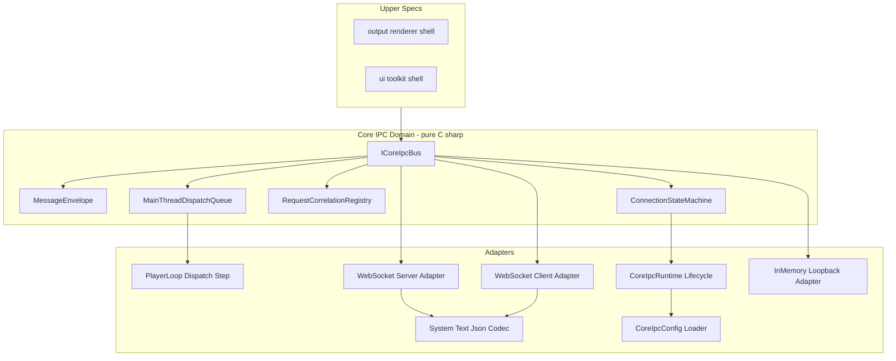
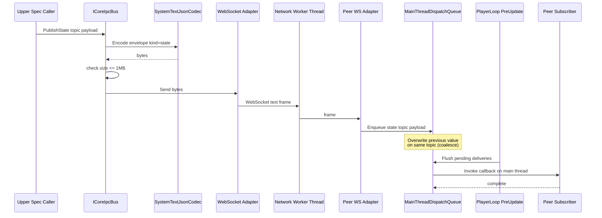
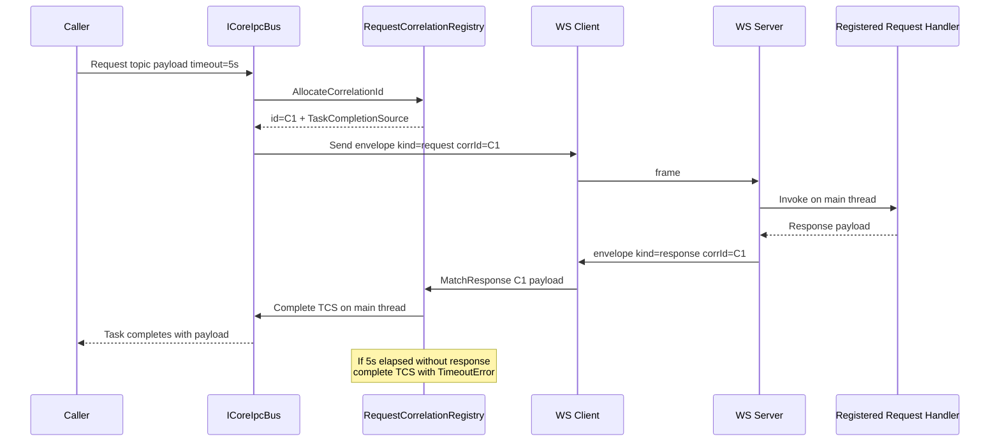
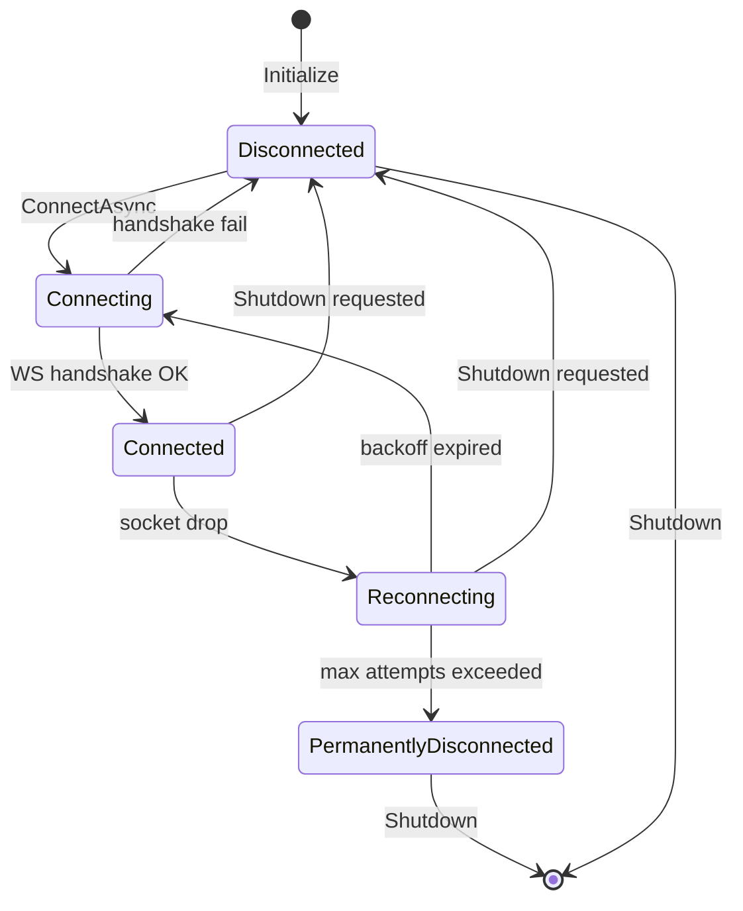
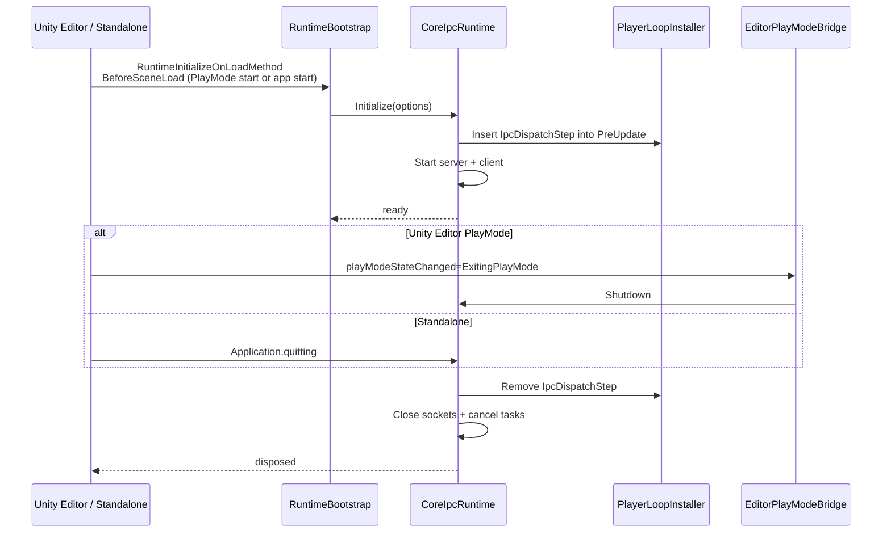

# Technical Design Document

## Overview

**Purpose**: 本 spec は、VTuberSystemBase における UI プロセス（Display 1）とメイン出力プロセス（Display 2+）を LocalHost 経由で疎通させる共通基盤「Core IPC Foundation」を提供する。Wave 1 の唯一の基盤 spec であり、他の全 spec（`output-renderer-shell`, `ui-toolkit-shell`, 各タブ spec）が本 spec の抽象インタフェースを通して通信する。

**Users**: 上位 spec の実装者は本基盤の `ICoreIpcBus` 抽象インタフェースを介して state / event / request の送受信を行う。運用者は設定ファイルで接続パラメータ（ポート・バックオフ等）を変更する。

**Impact**: 本 spec は既存システムが存在しない初期フェーズに導入される新規基盤である。コントラクトが一度凍結されれば、後続 Wave 2 / Wave 3 の spec は本基盤の API にのみ依存して実装できる。

### Goals

- LocalHost 上の WebSocket (RFC 6455) + JSON 伝送による UI ↔ メイン出力間の疎結合通信を確立する。
- `PublishState` / `PublishEvent` / `Request` の 3 系統送信 API と対称な購読 API を提供し、スレッド契約（常にメインスレッド配信）を単一点で保証する。
- Unity Editor PlayMode とスタンドアロンビルドで挙動が同一になる単一ライフサイクル（`CoreIpcRuntime`）を実装する。
- 将来の LAN / WebUI クライアントをインタフェース変更なしに受け入れる拡張点（複数クライアント・トランスポート抽象）を残す。

### Non-Goals

- 認証・認可・暗号化（TLS）は本フェーズで実装しない。インタフェース上に拡張フック点（no-op スロット）を残すのみ。
- LAN タブレット UI・ブラウザ WebUI からの実接続実装は行わない（コントラクトのみ）。
- MessagePack 等、JSON 以外のシリアライゼーション実装は提供しない（`IMessageCodec` 抽象のみ維持）。
- カメラ状態の OSC 伝送は本 spec の管轄外（`camera-switcher-tab` の CSW-1 参照）。
- メッセージの永続化・リプレイ・録画。

## Boundary Commitments

### This Spec Owns

- LocalHost 通信の **抽象インタフェース**（`ICoreIpcBus`, `IClientEndpoint`, `IServerEndpoint`, `IMessageCodec`, `ITransportAdapter` 等）の定義と安定化。
- 具体トランスポート実装 **1 本**：WebSocket (RFC 6455) / JSON / WebSocket テキストフレーム（D-2, D-5 の確定）。
- **メッセージエンベロープ**（`protocolVersion`, `kind`, `topic`, `correlationId`, `timestamp`, `payload`）のスキーマとシリアライゼーション。
- **接続マネージャ** `CoreIpcRuntime`：PlayMode 開始〜停止区間のみのライフサイクル管理（D-9）、サーバ／クライアントの同時起動、ソケット・スレッド・キューのリソース管理。
- **メインスレッド配信キュー**：I/O はワーカースレッド、コールバックは `PlayerLoop.PreUpdate` 経由でメインスレッドに集約（D-3）。
- **配信セマンティクス**：`state` の topic 単位 coalesce、`event` の FIFO 保持、`request/response` の相関 ID マッチング（D-7, D-10）。
- **接続断・再接続ハンドリング**：指数バックオフ・状態通知・恒常的切断判定。
- **観測性**：接続状態・再接続試行回数・配信キュー滞留数などの診断 API。
- **自己ループ検証機構**：同一プロセス内でサーバ／クライアント双方向送受信を検証する `InMemoryLoopbackTransport`。
- **メッセージサイズ上限**（1 MB、Req 3.9–3.10）の送受信時検査。

### Out of Boundary

- メイン出力シーンの描画・ディスパッチャ（`output-renderer-shell` の責務）。
- UI Toolkit シェル・Command 送信 API の実装（`ui-toolkit-shell` の責務）。
- 各タブの機能ロジック（`character-selection-tab` / `stage-lighting-volume-tab` / `camera-switcher-tab` の責務）。
- カメラ状態の OSC 伝送（`camera-switcher-tab` が別チャネルで所有）。
- 認証・暗号化・LAN/WebUI からの実接続実装。
- アプリケーション全体の起動制御（`RuntimeInitializeOnLoadMethod` での起動タイミングは本 spec 内部実装、Unity 標準仕様に従う）。

### Allowed Dependencies

- **Unity 6.3 ランタイム**：`UnityEngine.PlayerLoop`, `UnityEngine.LowLevel.PlayerLoopSystem`, `UnityEngine.Application.quitting`, `UnityEditor.EditorApplication.playModeStateChanged`（Editor 専用）。
- **.NET Standard 2.1 / System.Net**：`System.Net.Sockets.TcpListener`, `System.Net.Sockets.TcpClient`, `System.Net.WebSockets.ClientWebSocket`, `System.Threading`, `System.Threading.Channels`。
- **System.Text.Json**（.NET Standard 2.1 内蔵）：JSON シリアライゼーションの一次実装。
- **RFC 6455**：WebSocket プロトコルの規範。サーバ側は本 spec が自前で実装する最小サブセット。

**Dependency Constraint**: 本 spec は UI Toolkit・URP・Addressables・RAC / UCAPI / SceneViewStyleCameraController 等への依存を持たない。純 C# ライブラリ相当の独立性を維持する。

### Revalidation Triggers

- **Contract shape changes**: `ICoreIpcBus` / `IMessageCodec` / `MessageEnvelope` の公開メンバの追加・削除・シグネチャ変更 → 全下位 spec の再確認が必要。
- **Kind semantics changes**: `state` coalesce / `event` FIFO / `request-response` 相関 ID マッチングの規律変更 → `output-renderer-shell` / `ui-toolkit-shell` の Dispatcher / Command 送信 API の再検証必要。
- **Transport adapter switch**: 既定トランスポートが WebSocket 以外に変更、または JSON 以外の codec がデフォルト化 → `output-renderer-shell` / `ui-toolkit-shell` の設定再確認必要。
- **Lifecycle prerequisite changes**: PlayMode 開始タイミング・ドメインリロード挙動・`PlayerLoop` 挿入フェーズの変更 → 下位 spec の初期化順序検証が必要。
- **Default port / endpoint changes**: デフォルト `127.0.0.1:61874` の変更 → 運用ドキュメント再配布必要。

## Architecture

### Architecture Pattern & Boundary Map

本 spec は **Hexagonal（Ports & Adapters）** パターンを採用する。中心に純 C# のドメイン（エンベロープ・配信セマンティクス・接続状態機械）を置き、外周に Unity 依存のアダプタ（`PlayerLoop` 連携、`RuntimeInitializeOnLoadMethod` 起動、Editor PlayMode hook）と I/O アダプタ（WebSocket サーバ／クライアント、JSON Codec、InMemory ループバック）を配置する。



**Architecture Integration**:
- **Selected pattern**: Hexagonal（Ports & Adapters）。ポート（`ICoreIpcBus` / `ITransportAdapter` / `IMessageCodec`）を中核ドメインに置き、アダプタ（WebSocket・JSON・PlayerLoop）を外周に置く。
- **Domain/feature boundaries**: 「送受信 API」「エンベロープ」「配信キュー」「接続状態」を中核ドメインが排他所有。Unity 依存と I/O 依存は adapter 層に隔離し、テストではモック adapter に差し替え可能。
- **Existing patterns preserved**: 既存システムは存在しないため新規確立。ただし将来の steering（`product.md` / `tech.md` / `structure.md`）が確立された場合に整合する形（`.asmdef` による明示依存、`RuntimeInitializeOnLoadMethod` 準拠の起動）を採る。
- **New components rationale**:
  - `ICoreIpcBus`：上位 spec への単一入口（Req 1.1）。
  - `CoreIpcRuntime`：ライフサイクル単一管理（Req 4.1）。
  - `MainThreadDispatchQueue`：coalesce + FIFO 併置の配信規律実装（Req 9.1–9.4）。
  - `WebSocketServerAdapter` / `WebSocketClientAdapter`：RFC 6455 実装（Req 2.1–2.8）。
  - `InMemoryLoopbackTransport`：自己ループ検証手段（Req 8.1）。
- **Steering compliance**: steering は未確立。design-principles.md §8「Dependency Direction」に従い、依存方向を `Adapters → Domain ← Upper Specs` の一方向で enforcement。

### Technology Stack

| Layer | Choice / Version | Role in Feature | Notes |
|-------|------------------|-----------------|-------|
| Runtime / Engine | Unity 6.3 URP / Windows x86 | 実行基盤。PlayerLoop 挿入と PlayMode ライフサイクル hook を利用 | Edit モードでは非起動（D-9） |
| Language / Framework | C# / .NET Standard 2.1 | 本基盤の実装言語 | `ref struct`・`Span<T>`・`System.Threading.Channels` 利用可能 |
| Transport | WebSocket RFC 6455 | LocalHost 上の双方向通信 | D-2 確定。サーバは自前 `TcpListener` + 手書きハンドシェイク、クライアントは `System.Net.WebSockets.ClientWebSocket` |
| Serialization | System.Text.Json | JSON エンコード／デコード | D-5 確定。外層は厳密型、ペイロードは `JsonElement` |
| Threading | PlayerLoopSystem + System.Threading | I/O ワーカー → メインスレッド配信 | D-3 の契約実装 |
| Configuration | JSON + ScriptableObject | ポート・バックオフ等の設定保持 | D-6 確定。`StreamingAssets/core-ipc-config.json` と `%AppData%` での per-machine 上書き対応 |

本 spec はアプリケーション層（UI / メイン出力描画）を所有しないため、Frontend / Data / Messaging 以外の行は省略。

## File Structure Plan

本 spec は純 C# ライブラリ相当の独立 asmdef 群として構成する。UPM パッケージ化前提の `Runtime/` ディレクトリ配下に、Hexagonal の内外を 2 つの asmdef に分離する（Req 1.6 の「抽象インタフェースを独立アセンブリとして提供」）。

### Directory Structure

```
Packages/com.vtuber-system-base.core-ipc-foundation/
├── package.json
├── Runtime/
│   ├── Abstractions/                        # 公開インタフェース層（1 つ目の asmdef）
│   │   ├── VTuberSystemBase.CoreIpc.Abstractions.asmdef
│   │   ├── ICoreIpcBus.cs                   # 上位 spec への単一入口（PublishState / PublishEvent / Request / Subscribe 等）
│   │   ├── ICoreIpcRuntime.cs               # ライフサイクル制御（Initialize / Shutdown / 状態問合せ）
│   │   ├── IClientEndpoint.cs               # クライアントロール抽象
│   │   ├── IServerEndpoint.cs               # サーバロール抽象
│   │   ├── ITransportAdapter.cs             # トランスポート差し替え用ポート（Req 6.2）
│   │   ├── IMessageCodec.cs                 # シリアライザ差し替え用ポート
│   │   ├── IConnectionDiagnostics.cs        # 観測性 API（Req 7）
│   │   ├── MessageEnvelope.cs               # エンベロープ struct（protocolVersion, kind, topic, correlationId, timestamp, payload）
│   │   ├── MessageKind.cs                   # enum: State | Event | Request | Response
│   │   ├── ConnectionState.cs               # enum: Disconnected | Connecting | Connected | Reconnecting | PermanentlyDisconnected
│   │   ├── CoreIpcOptions.cs                # 設定値（host/port, backoff, limits）
│   │   ├── CoreIpcError.cs                  # エラー型（discriminated union）
│   │   ├── IAuthenticationHandler.cs        # 将来拡張用フック（no-op スロット、Req 6.6）
│   │   └── Results/
│   │       ├── IpcResult.cs                 # Result 型（成功・失敗・タイムアウト）
│   │       └── RequestOptions.cs            # Request 単位タイムアウト等（D-8）
│   ├── Core/                                # 中核ドメイン実装（2 つ目の asmdef）
│   │   ├── VTuberSystemBase.CoreIpc.Core.asmdef
│   │   ├── CoreIpcBus.cs                    # ICoreIpcBus 実装
│   │   ├── CoreIpcRuntime.cs                # ICoreIpcRuntime 実装 + Singleton 入口
│   │   ├── Dispatch/
│   │   │   ├── MainThreadDispatchQueue.cs   # state coalesce + event FIFO 併置キュー
│   │   │   ├── IpcDispatchStep.cs           # PlayerLoop 挿入ステップ
│   │   │   └── PlayerLoopInstaller.cs       # 挿入/削除の対称管理
│   │   ├── Correlation/
│   │   │   └── RequestCorrelationRegistry.cs # Request ID 発行 + Response マッチング + タイムアウト
│   │   ├── Connection/
│   │   │   ├── ConnectionStateMachine.cs    # 状態遷移
│   │   │   ├── ReconnectBackoff.cs          # 指数バックオフ
│   │   │   └── ClientSessionManager.cs      # クライアント側セッション（接続・再接続）
│   │   ├── Subscription/
│   │   │   ├── TopicSubscriptionRegistry.cs # トピック別ハンドラ登録
│   │   │   └── SubscriptionToken.cs         # 購読解除トークン
│   │   └── Lifecycle/
│   │       ├── RuntimeBootstrap.cs          # RuntimeInitializeOnLoadMethod での起動
│   │       └── EditorPlayModeBridge.cs      # Editor 専用：PlayMode 終了 hook（#if UNITY_EDITOR）
│   ├── Transport/                           # トランスポートアダプタ（Core asmdef に同梱）
│   │   ├── WebSocket/
│   │   │   ├── WebSocketTransportAdapter.cs # ITransportAdapter 実装（server + client ファクトリ）
│   │   │   ├── WebSocketServer.cs           # TcpListener + RFC 6455 手書き実装
│   │   │   ├── WebSocketClient.cs           # ClientWebSocket ラッパ
│   │   │   ├── WebSocketFrameReader.cs      # RFC 6455 フレーム解析
│   │   │   ├── WebSocketFrameWriter.cs      # RFC 6455 フレーム送信
│   │   │   └── HandshakeProcessor.cs        # Sec-WebSocket-Accept 計算
│   │   └── Loopback/
│   │       └── InMemoryLoopbackTransport.cs # 自己ループ検証用（Req 8.1）
│   ├── Codec/
│   │   └── SystemTextJsonCodec.cs           # IMessageCodec 実装（System.Text.Json）
│   ├── Configuration/
│   │   ├── CoreIpcConfigLoader.cs           # 設定ファイル読込（ScriptableObject → StreamingAssets → %AppData%）
│   │   └── CoreIpcConfigAsset.cs            # ScriptableObject（既定値）
│   └── Diagnostics/
│       ├── CoreIpcLogger.cs                 # ログ出力（UnityEngine.Debug ラッパ）
│       └── CoreIpcDiagnostics.cs            # 統計・状態スナップショット
├── Editor/
│   ├── VTuberSystemBase.CoreIpc.Editor.asmdef
│   └── CoreIpcConfigAssetInspector.cs       # 設定アセットの Inspector（任意）
└── Tests/
    ├── Runtime/
    │   ├── VTuberSystemBase.CoreIpc.Tests.Runtime.asmdef
    │   ├── LoopbackRoundTripTests.cs        # state / event / request-response の自己ループ
    │   ├── CoalesceSemanticsTests.cs        # state coalesce
    │   ├── FifoOrderingTests.cs             # event FIFO
    │   ├── RequestTimeoutTests.cs           # Request タイムアウト（デフォルト 5s / 上書き）
    │   ├── ReconnectBackoffTests.cs         # 再接続試行挙動
    │   ├── MessageSizeLimitTests.cs         # 1 MB 上限検査
    │   ├── SchemaEvolutionTests.cs          # 未知フィールド無視
    │   └── PlayModeLifecycleTests.cs        # PlayMode 繰り返しテスト（PlayMode Test）
    └── Editor/
        ├── VTuberSystemBase.CoreIpc.Tests.Editor.asmdef
        └── WebSocketFrameCodecTests.cs       # フレーム解析・生成の単体テスト
```

### Modified Files

なし（新規 spec）。`Packages/` 配下の新規 UPM パッケージ追加となる。

**Dependency direction**:
- `Abstractions` asmdef は何にも依存しない純インタフェース + DTO 層。
- `Core` asmdef は `Abstractions` のみに依存。トランスポート・Codec・Configuration・Diagnostics・Lifecycle を内包するが、外向きに公開するのは `CoreIpcRuntime.Current`（`ICoreIpcRuntime`）と `CoreIpcRuntime.OverrideForTesting(...)` のみ。
- 上位 spec（`output-renderer-shell`, `ui-toolkit-shell`）は **`Abstractions` asmdef のみを参照**し、`Core` asmdef の具体型には依存しない（Req 1.2, 1.6）。
- `Editor` asmdef は `Abstractions` + `Core` を参照（`#if UNITY_EDITOR` 内）。
- `Tests.Runtime` / `Tests.Editor` asmdef は `Abstractions` + `Core`、加えて Unity Test Framework を参照。

## System Flows

### Flow 1: PublishState → メインスレッド配信（coalesce）



**Key decisions**:
- 送信時にサイズ検査を行い、1 MB 超過なら即時エラー（Req 3.9）。
- I/O はワーカースレッドで発火、配信コールバックのみ `PlayerLoop.PreUpdate` 経由でメインスレッド（D-3）。
- 同一 topic の state は `PeerQueue.Enqueue` 内で辞書スロットに上書き（Req 9.1）。

### Flow 2: Request / Response の相関マッチング



**Key decisions**:
- `RequestCorrelationRegistry` は `ConcurrentDictionary<Guid, PendingRequest>` を内部に持ち、タイムアウトは `System.Threading.Timer` で管理。完了通知はメインスレッドキュー経由。
- Request 単位でタイムアウトを上書き可能（D-8）。未指定時は `CoreIpcOptions.DefaultRequestTimeout = 5s`。

### Flow 3: クライアント接続ライフサイクルと再接続



**Key decisions**:
- `Reconnecting` は指数バックオフ（初期 250 ms、倍率 2.0、上限 5 秒、最大 20 回）で `Connecting` に戻る。
- `Shutdown` 経由の `Disconnected` 遷移（PlayMode 停止・アプリ終了）では再接続を試行しない（Req 5.8）。
- 状態は `IConnectionDiagnostics.CurrentState` で公開し、各遷移で `ConnectionStateChanged` イベントを発火（Req 5.1, 5.3, 5.6）。

### Flow 4: PlayMode ライフサイクルと PlayerLoop 管理



**Key decisions**:
- `RuntimeInitializeOnLoadMethod(RuntimeInitializeLoadType.BeforeSceneLoad)` で起動することにより、最初のシーンロード前に準備完了（Req 4.2, 4.3）。
- `EditorPlayModeBridge` は `#if UNITY_EDITOR` で条件コンパイル。`EditorApplication.playModeStateChanged` で `ExitingPlayMode` を捕捉し、`Application.quitting` より早く `Shutdown` を走らせる。これにより PlayMode 停止時にポート占有が残らない（Req 4.4, 4.6）。

## Requirements Traceability

| Requirement | Summary | Components | Interfaces | Flows |
|-------------|---------|------------|------------|-------|
| 1.1 | state/event/subscribe/request/response 抽象 | CoreIpcBus | `ICoreIpcBus.PublishState/Event/Subscribe*/Request` | Flow 1, 2 |
| 1.2 | 上位から具体トランスポートへの型依存排除 | Abstractions asmdef | `ITransportAdapter` | - |
| 1.3 | 送信 API がトランスポート種別を隠蔽 | CoreIpcBus | `ICoreIpcBus.Publish*` | Flow 1 |
| 1.4 | 購読コールバックはメインスレッド配信 | MainThreadDispatchQueue + IpcDispatchStep | `ISubscriptionToken` | Flow 1 |
| 1.5 | Request の相関マッチングとタイムアウト | RequestCorrelationRegistry | `ICoreIpcBus.Request` | Flow 2 |
| 1.6 | 抽象を独立 asmdef で提供 | Abstractions asmdef | （File Structure 参照） | - |
| 1.7 | I/O ワーカー → メインスレッドディスパッチ | MainThreadDispatchQueue + PlayerLoopInstaller | `IpcDispatchStep` | Flow 1, 2 |
| 2.1 | WebSocket (RFC 6455) 具体実装 | WebSocketTransportAdapter | `ITransportAdapter` | - |
| 2.2 | 具体実装はインタフェース経由のみ利用可能 | WebSocketTransportAdapter (internal) | `ITransportAdapter` | - |
| 2.3 | サーバ起動時に待受開始 | WebSocketServer | `IServerEndpoint` | Flow 4 |
| 2.4 | クライアント起動時に接続要求 | WebSocketClient + ClientSessionManager | `IClientEndpoint` | Flow 3, 4 |
| 2.5 | 双方向メッセージ送受信 | WebSocketServer + WebSocketClient | `ITransportAdapter` | Flow 1, 2 |
| 2.6 | ポート占有時の明示エラー | WebSocketServer + CoreIpcRuntime | `CoreIpcError.PortInUse` | Flow 4 |
| 2.7 | 設定ファイルから接続先を読込 | CoreIpcConfigLoader | `CoreIpcOptions` | Flow 4 |
| 2.8 | 複数クライアント同時接続可能 | WebSocketServer | `IServerEndpoint.AcceptedClients` | - |
| 3.1 | エンベロープ共通包装 | MessageEnvelope | `MessageEnvelope` struct | - |
| 3.2 | JSON / WebSocket テキストフレーム伝送 | SystemTextJsonCodec + WebSocketFrameWriter | `IMessageCodec` | Flow 1 |
| 3.3 | 送信時 JSON シリアライズ + テキストフレーム送信 | SystemTextJsonCodec + WebSocketFrameWriter | `IMessageCodec.Encode` | Flow 1 |
| 3.4 | 受信時 JSON デシリアライズ + 購読配信 | SystemTextJsonCodec + MainThreadDispatchQueue | `IMessageCodec.Decode` | Flow 1 |
| 3.5 | 不正 JSON/スキーマ不一致は破棄 + ログ | SystemTextJsonCodec + CoreIpcLogger | `IMessageCodec.Decode` | - |
| 3.6 | 相関 ID をエンベロープに含める | MessageEnvelope.correlationId | `MessageEnvelope` | Flow 2 |
| 3.7 | 未知フィールド無視で前方互換 | SystemTextJsonCodec | `IMessageCodec.Decode` | - |
| 3.8 | `kind` フィールドで coalesce 判定 | MessageEnvelope.kind + MainThreadDispatchQueue | `MessageKind` enum | Flow 1 |
| 3.9 | 送信 1MB 超過は拒否 | CoreIpcBus.sendPrecheck | `IpcResult.SizeLimitExceeded` | Flow 1 |
| 3.10 | 受信 1MB 超過は破棄 + ログ | WebSocketFrameReader + CoreIpcLogger | - | - |
| 4.1 | 接続マネージャで一元管理 | CoreIpcRuntime | `ICoreIpcRuntime` | Flow 4 |
| 4.2 | スタンドアロン起動時に自動初期化 | RuntimeBootstrap | - | Flow 4 |
| 4.3 | Editor PlayMode 開始時に自動初期化 | RuntimeBootstrap | - | Flow 4 |
| 4.4 | PlayMode 終了時に完全シャットダウン | EditorPlayModeBridge + CoreIpcRuntime.Dispose | - | Flow 4 |
| 4.5 | 終了要求時の安全シャットダウン | CoreIpcRuntime.Dispose | - | Flow 4 |
| 4.6 | PlayMode 繰返しでリソースリーク無し | PlayerLoopInstaller（対称 install/uninstall） | - | Flow 4 |
| 4.7 | 両モード間で API 挙動同一 | CoreIpcRuntime | `ICoreIpcRuntime` | - |
| 4.8 | Edit モードでは起動しない | RuntimeBootstrap（PlayMode 限定 hook） | - | Flow 4 |
| 4.9 | ドメインリロード跨ぎ状態維持しない | CoreIpcRuntime（再起動時新規インスタンス） | - | Flow 4 |
| 5.1 | 接続断イベント通知 | ConnectionStateMachine | `IConnectionDiagnostics.ConnectionStateChanged` | Flow 3 |
| 5.2 | クライアント再接続試行（バックオフ） | ReconnectBackoff + ClientSessionManager | - | Flow 3 |
| 5.3 | 再接続成功イベント通知 | ConnectionStateMachine | `IConnectionDiagnostics.ConnectionStateChanged` | Flow 3 |
| 5.4 | 接続断中の API 呼び出し契約 | CoreIpcBus + ConnectionStateMachine | `IpcResult.NotConnected` | - |
| 5.5 | 再接続上限超過で恒常的切断通知 | ConnectionStateMachine | `ConnectionState.PermanentlyDisconnected` | Flow 3 |
| 5.6 | 接続状態公開 | IConnectionDiagnostics | `IConnectionDiagnostics.CurrentState` | Flow 3 |
| 5.7 | サーバ側：接続断で描画停止しない | WebSocketServer（例外非伝搬） | - | - |
| 5.8 | Shutdown 起因の切断は再接続しない | ConnectionStateMachine | - | Flow 3 |
| 6.1 | 非 LocalHost ホスト設定を受入可能 | CoreIpcOptions.Host | `CoreIpcOptions` | - |
| 6.2 | 複数トランスポート同居可能な構造 | ITransportAdapter 抽象 | `ITransportAdapter` | - |
| 6.3 | WebSocket WebUI 追加時に上位無改修 | Hexagonal 分離 | `ITransportAdapter` | - |
| 6.4 | 外部クライアント追加時に envelope 再利用 | MessageEnvelope（version フィールド） | `MessageEnvelope` | - |
| 6.5 | 本フェーズで外部クライアント実装しない | - | - | - |
| 6.6 | 認証・暗号化拡張余地 | IAuthenticationHandler（no-op スロット） | `IAuthenticationHandler` | - |
| 7.1 | 接続イベントログ | CoreIpcLogger + ConnectionStateMachine | - | - |
| 7.2 | 送受信エラーの診断ログ | CoreIpcLogger | - | - |
| 7.3 | メイン出力に描画しない | CoreIpcLogger（UnityEngine.Debug のみ） | - | - |
| 7.4 | ログレベル外部切替 | CoreIpcOptions.LogLevel | `CoreIpcOptions` | - |
| 7.5 | 診断統計公開 | CoreIpcDiagnostics | `IConnectionDiagnostics` | - |
| 8.1 | 自己ループ検証手段 | InMemoryLoopbackTransport | `ITransportAdapter` | - |
| 8.2 | 機能別テストケース | Tests/Runtime/* | - | - |
| 8.3 | PlayMode 手動検証手順 | サンプルシーン + README | - | - |
| 8.4 | 他 spec 不在で単独起動可能 | CoreIpcRuntime（自己完結） | - | Flow 4 |
| 9.1 | state 同一 topic 上書き | MainThreadDispatchQueue（state slot dict） | - | Flow 1 |
| 9.2 | event は FIFO で必ず配信 | MainThreadDispatchQueue（event queue） | - | - |
| 9.3 | request/response は相関 ID でマッチ | RequestCorrelationRegistry | - | Flow 2 |
| 9.4 | state coalesce で無制限メモリ消費なし | MainThreadDispatchQueue | - | - |
| 9.5 | event 滞留上限超過で警告ログ | MainThreadDispatchQueue + CoreIpcLogger | - | - |
| 9.6 | PublishState / PublishEvent の API 分離 | ICoreIpcBus | `ICoreIpcBus.PublishState/PublishEvent` | - |

## Components and Interfaces

**Summary Table**:

| Component | Domain/Layer | Intent | Req Coverage | Key Dependencies (P0/P1) | Contracts |
|-----------|--------------|--------|--------------|--------------------------|-----------|
| CoreIpcBus | Core Domain | 上位 spec への単一送受信 API 入口 | 1.1, 1.3, 3.9, 5.4, 9.6 | TransportAdapter (P0), MessageCodec (P0), DispatchQueue (P0), CorrelationRegistry (P0) | Service |
| CoreIpcRuntime | Core Lifecycle | ライフサイクル単一管理とサーバ／クライアント起動 | 4.1, 4.2, 4.3, 4.4, 4.5, 4.7, 4.8, 4.9 | ServerEndpoint (P0), ClientSessionManager (P0), PlayerLoopInstaller (P0) | Service, State |
| MainThreadDispatchQueue | Core Dispatch | メインスレッド配信キュー（state coalesce + event FIFO） | 1.4, 1.7, 9.1, 9.2, 9.4, 9.5 | PlayerLoopInstaller (P0), CoreIpcLogger (P1) | State |
| PlayerLoopInstaller | Core Lifecycle | PlayerLoop への IpcDispatchStep 挿入/削除 | 1.7, 4.6 | UnityEngine.LowLevel (P0) | Service |
| RequestCorrelationRegistry | Core Correlation | Request/Response 相関 ID と TCS 管理 | 1.5, 3.6, 9.3 | DispatchQueue (P0) | State |
| ConnectionStateMachine | Core Connection | 接続状態遷移とイベント発火 | 5.1, 5.3, 5.5, 5.6, 5.8 | ConnectionDiagnostics (P1) | State, Event |
| ClientSessionManager | Core Connection | クライアント接続・再接続管理 | 2.4, 5.2, 5.4 | ReconnectBackoff (P0), TransportAdapter (P0) | Service |
| WebSocketServer | Transport Adapter | RFC 6455 サーバ実装（自前） | 2.1, 2.3, 2.5, 2.6, 2.8, 5.7 | TcpListener (P0), MessageCodec (P0) | Service |
| WebSocketClient | Transport Adapter | ClientWebSocket ラッパ | 2.1, 2.4, 2.5 | ClientWebSocket (P0), MessageCodec (P0) | Service |
| WebSocketTransportAdapter | Transport Facade | server/client を統合するアダプタ | 2.1, 2.2 | WebSocketServer (P0), WebSocketClient (P0) | Service |
| SystemTextJsonCodec | Codec Adapter | JSON エンコード/デコード | 3.2, 3.3, 3.4, 3.5, 3.7, 3.10 | System.Text.Json (P0) | Service |
| InMemoryLoopbackTransport | Transport Adapter (Test) | 自己ループ検証用 | 8.1 | - | Service |
| CoreIpcConfigLoader | Configuration | 設定ファイル読込 | 2.7, 6.1, 7.4 | CoreIpcConfigAsset (P1), System.IO (P0) | Service |
| CoreIpcLogger | Diagnostics | 診断ログ出力 | 7.1, 7.2, 7.3, 7.4 | UnityEngine.Debug (P0), CoreIpcOptions (P1) | Service |
| CoreIpcDiagnostics | Diagnostics | 統計・状態スナップショット | 7.5, 5.6 | ConnectionStateMachine (P1), DispatchQueue (P1) | Service |
| TopicSubscriptionRegistry | Core Subscription | トピック別ハンドラ登録管理 | 1.1, 1.4 | DispatchQueue (P0) | State |

### Core Domain

#### CoreIpcBus

| Field | Detail |
|-------|--------|
| Intent | 上位 spec への単一送受信 API 入口。state/event/request の送信とトピック購読を仲介する。 |
| Requirements | 1.1, 1.3, 3.9, 5.4, 9.6 |

**Responsibilities & Constraints**
- 送信時にサイズ検査（1 MB）とエンベロープ生成を行う。
- 接続未確立時は `IpcResult.NotConnected` を返し、クラッシュを発生させない（Req 5.4）。
- 購読登録は `TopicSubscriptionRegistry` へ委譲。実配信は `MainThreadDispatchQueue` 経由。
- このクラスは純 C# コアに属し、Unity API を直接呼ばない（テスト可能性確保）。

**Dependencies**
- Outbound: `ITransportAdapter` — 送受信（P0, External=false）
- Outbound: `IMessageCodec` — エンコード/デコード（P0）
- Outbound: `MainThreadDispatchQueue` — 配信キュー（P0）
- Outbound: `RequestCorrelationRegistry` — Request/Response 相関（P0）
- Outbound: `TopicSubscriptionRegistry` — 購読登録（P0）

**Contracts**: Service [x]

##### Service Interface

```csharp
namespace VTuberSystemBase.CoreIpc.Abstractions;

public interface ICoreIpcBus
{
    // State: 同一 topic で coalesce 対象
    IpcResult PublishState<TPayload>(string topic, TPayload payload);

    // Event: FIFO 必須
    IpcResult PublishEvent<TPayload>(string topic, TPayload payload);

    // Request/Response: 相関 ID + タイムアウト
    Task<IpcResult<TResponse>> RequestAsync<TRequest, TResponse>(
        string topic,
        TRequest payload,
        RequestOptions? options = null,
        CancellationToken cancellationToken = default);

    // 購読登録（戻り値トークンを Dispose すると解除）
    ISubscriptionToken SubscribeState<TPayload>(
        string topic,
        Action<TPayload> handler);

    ISubscriptionToken SubscribeEvent<TPayload>(
        string topic,
        Action<TPayload> handler);

    // Request ハンドラ登録（サーバ／クライアント双方で可能）
    ISubscriptionToken RegisterRequestHandler<TRequest, TResponse>(
        string topic,
        Func<TRequest, CancellationToken, Task<TResponse>> handler);

    // 接続診断
    IConnectionDiagnostics Diagnostics { get; }
}

public readonly record struct RequestOptions(TimeSpan Timeout);
// デフォルト Timeout = CoreIpcOptions.DefaultRequestTimeout (= 5s, D-8)

public interface ISubscriptionToken : IDisposable { }
```

- **Preconditions**: `CoreIpcRuntime` が `Initialize` 済みであること。未初期化時は `InvalidOperationException`。
- **Postconditions**: `PublishState` / `PublishEvent` は同期的にエンベロープを生成しトランスポートキューへ投入、成功/失敗を `IpcResult` で返却。`RequestAsync` の `Task` はメインスレッド上で完了（D-3）。
- **Invariants**: メッセージサイズ 1 MB 超過は送信拒否。`topic` が空文字/null は `IpcResult.InvalidTopic`。

**Implementation Notes**
- Integration: `CoreIpcRuntime.Current.Bus` で取得。DI は使用しない（Singleton 入口）が、テストでは `CoreIpcRuntime.OverrideForTesting(bus)` で差し替え可能。
- Validation: トピック命名規則の検証は本 spec では行わず、上位 spec（CS-7, SL-6 等）が規約を持ち込む。本 spec は「空でない文字列」のみ強制。
- Risks: ハンドラ実装内で例外が出ると次のハンドラが呼ばれない可能性 → `MainThreadDispatchQueue` で try/catch + ログ出力、配信ループは継続。

#### CoreIpcRuntime

| Field | Detail |
|-------|--------|
| Intent | ライフサイクル単一管理（起動・停止・状態）とサーバ／クライアントの同時起動。 |
| Requirements | 4.1, 4.2, 4.3, 4.4, 4.5, 4.7, 4.8, 4.9 |

**Responsibilities & Constraints**
- `Initialize(options)` でサーバ（メイン出力ロール）とクライアント（UI ロール）を同時起動する。単一 Unity プロセス内で両ロールを同居させる（D-1）。
- `PlayerLoopInstaller` で `IpcDispatchStep` を挿入。
- `Dispose` でソケット閉鎖、スレッドキャンセル、キューフラッシュ、`PlayerLoop` 削除をすべて実行。
- `CoreIpcRuntime.Current` は `ICoreIpcRuntime` を返す Singleton。`OverrideForTesting(runtime)` で差し替え可能（Req 8.6 相当）。
- Edit モードでは起動しない（`RuntimeInitializeOnLoadMethod` が PlayMode 開始時のみ実行される Unity 仕様を活用、Req 4.8）。

**Dependencies**
- Outbound: `IServerEndpoint` — サーバ起動（P0）
- Outbound: `IClientEndpoint` + `ClientSessionManager` — クライアント起動（P0）
- Outbound: `PlayerLoopInstaller` — PlayerLoop 挿入（P0）
- Outbound: `CoreIpcConfigLoader` — 設定読込（P0）
- External: `UnityEngine.Application.quitting`, `UnityEditor.EditorApplication.playModeStateChanged` (#if UNITY_EDITOR) — PlayMode 連動（P0）

**Contracts**: Service [x], State [x]

##### Service Interface

```csharp
namespace VTuberSystemBase.CoreIpc.Abstractions;

public interface ICoreIpcRuntime : IDisposable
{
    RuntimeState State { get; }
    ICoreIpcBus Bus { get; }
    CoreIpcOptions Options { get; }

    // 通常は RuntimeInitializeOnLoadMethod 経由で自動初期化される。
    // テスト用途で明示初期化を許可する。
    Task InitializeAsync(CoreIpcOptions options, CancellationToken ct = default);
}

public enum RuntimeState
{
    NotInitialized,
    Initializing,
    Running,
    ShuttingDown,
    Disposed
}

public static class CoreIpcRuntime
{
    public static ICoreIpcRuntime Current { get; }
    public static void OverrideForTesting(ICoreIpcRuntime runtime);
    public static void ResetForTesting();
}
```

##### State Management
- State 遷移: `NotInitialized → Initializing → Running → ShuttingDown → Disposed`。
- `Dispose` は冪等で、既に `Disposed` の場合は no-op。
- **Persistence & consistency**: 状態は PlayMode 開始ごとにリセット（D-9）。
- **Concurrency**: `State` への書き込みは単一スレッドで逐次化（起動/終了は `RuntimeBootstrap` スレッドで決定論的）。

**Implementation Notes**
- Integration: `RuntimeBootstrap` が `RuntimeInitializeOnLoadMethod(BeforeSceneLoad)` で `InitializeAsync` を呼ぶ。スタンドアロン・Editor PlayMode いずれも同じ経路（Req 4.7）。
- Validation: 二重初期化防止（`State != NotInitialized` なら `InvalidOperationException`）。
- Risks: PlayMode 停止と `Application.quitting` の両方が発火するケースでの `Dispose` 二重呼び出し → 冪等化で対応。

#### MainThreadDispatchQueue

| Field | Detail |
|-------|--------|
| Intent | メインスレッド配信キュー。state は topic 単位 coalesce、event は FIFO、request/response は即時転送。 |
| Requirements | 1.4, 1.7, 9.1, 9.2, 9.4, 9.5 |

**Responsibilities & Constraints**
- ワーカースレッドから `Enqueue(envelope)` を受け取る。state は `ConcurrentDictionary<string, MessageEnvelope>`（topic 単位スロット）で上書き保存、event は `Channel<MessageEnvelope>` で FIFO 保持。
- `Flush()` は `IpcDispatchStep` から `PlayerLoop.PreUpdate` 毎フレーム呼ばれ、state スナップショットと event キューをドレイン、購読ハンドラへ配信。
- event キューが topic あたり 1000 件超過で警告ログ（Req 9.5）。破棄はしない（10000 件合計超過で追加警告、将来の hard-drop 拡張点）。

**Dependencies**
- Inbound: `WebSocketClient` / `WebSocketServer` / `InMemoryLoopbackTransport`（Enqueue 呼び出し）
- Outbound: `IpcDispatchStep` / `PlayerLoopInstaller` — Flush トリガ（P0）
- Outbound: `CoreIpcLogger` — 警告・例外ログ（P1）

**Contracts**: State [x]

##### State Management
- 内部状態: `ConcurrentDictionary<string, MessageEnvelope> _stateSlots`, `Channel<MessageEnvelope> _eventQueue`, `Channel<PendingRequest> _pendingRequests`.
- **Consistency**: state の上書きはトピック単位原子操作（`ConcurrentDictionary.AddOrUpdate`）。event は SPSC 保証不要（複数ワーカーから enqueue されるため MPSC）。
- **Concurrency**: Flush はメインスレッド単一アクセス、Enqueue は複数ワーカーから。`Channel<T>` の既定ロック無し MPSC/MPMC モードを使用。

**Implementation Notes**
- Integration: `CoreIpcBus` の購読登録が `TopicSubscriptionRegistry` を通して `MainThreadDispatchQueue` のハンドラテーブルに反映される。
- Validation: `Enqueue` で `envelope.kind` が enum 範囲外の場合は破棄 + ログ。
- Risks: Flush で例外が出るとフレームドロップの懸念 → try/catch で個別ハンドラごとに隔離、ループは継続。

#### RequestCorrelationRegistry

| Field | Detail |
|-------|--------|
| Intent | Request/Response の相関 ID 採番・TCS 管理・タイムアウト処理。 |
| Requirements | 1.5, 3.6, 9.3 |

**Responsibilities & Constraints**
- `AllocateCorrelationId()` で GUID を採番し、`TaskCompletionSource<JsonElement>` を辞書に登録。
- `MatchResponse(correlationId, payload)` で対応する TCS を完了させ、`MainThreadDispatchQueue` 経由でメインスレッドで解決。
- タイムアウト（デフォルト 5 秒、D-8）は `System.Threading.Timer` で管理、経過時に TCS を `TimeoutError` で完了。

**Contracts**: State [x]

```csharp
internal sealed class RequestCorrelationRegistry
{
    public string AllocateCorrelationId();
    public Task<IpcResult<JsonElement>> RegisterPending(
        string correlationId,
        TimeSpan timeout,
        CancellationToken ct);
    public void MatchResponse(string correlationId, JsonElement payload);
    public void FailPending(string correlationId, CoreIpcError error);
}
```

**Implementation Notes**
- Risks: TCS メモリリーク — `CancellationToken` と `Timer` の両方で確実に登録解除。Shutdown 時に全 pending を `NotConnected` で完了。

### Transport Adapter Layer

#### WebSocketTransportAdapter

| Field | Detail |
|-------|--------|
| Intent | WebSocket RFC 6455 サーバ／クライアントの統合 adapter。`ITransportAdapter` 実装。 |
| Requirements | 2.1, 2.2 |

**Responsibilities & Constraints**
- 内部で `WebSocketServer`（自前 TcpListener + RFC 6455 ハンドシェイク）と `WebSocketClient`（`ClientWebSocket` ラッパ）を同時保持。
- サーバは `127.0.0.1:{port}` で待受、クライアントは `ws://127.0.0.1:{port}` へ接続。
- **重要な制約**: Unity の `HttpListener` は WebSocket 拡張未対応のため、サーバは `System.Net.Sockets.TcpListener` から始めて自前でアップグレードハンドシェイクを処理する（research.md Topic 1 参照）。

**Dependencies**
- External: `System.Net.Sockets.TcpListener` — サーバ受信（P0）
- External: `System.Net.WebSockets.ClientWebSocket` — クライアント接続（P0）
- Outbound: `IMessageCodec` — ペイロードエンコード/デコード（P0）

**Contracts**: Service [x]

```csharp
namespace VTuberSystemBase.CoreIpc.Abstractions;

public interface ITransportAdapter : IAsyncDisposable
{
    Task StartServerAsync(ServerBindOptions options, CancellationToken ct);
    Task<IClientConnection> ConnectClientAsync(ClientBindOptions options, CancellationToken ct);
    event Action<IClientConnection> ClientConnected;
    event Action<IClientConnection> ClientDisconnected;
}

public interface IClientConnection : IAsyncDisposable
{
    string RemoteEndpoint { get; }
    ValueTask SendAsync(ReadOnlyMemory<byte> textFramePayload, CancellationToken ct);
    IAsyncEnumerable<ReadOnlyMemory<byte>> ReceiveAsync(CancellationToken ct);
}

public readonly record struct ServerBindOptions(string Host, int Port);
public readonly record struct ClientBindOptions(string Host, int Port, TimeSpan ConnectTimeout);
```

**Implementation Notes**
- Integration: `CoreIpcRuntime.InitializeAsync` 内で `new WebSocketTransportAdapter(options, codec)` → `StartServerAsync` + `ConnectClientAsync` を並行実行。
- Validation: サーバ起動時にポート占有を検出（`SocketException` → `CoreIpcError.PortInUse` に変換、Req 2.6）。
- Risks: TCP 再利用/TIME_WAIT — `SocketOptionName.ReuseAddress` を設定し、PlayMode 再起動でのバインド失敗を抑止。

#### WebSocketServer（自前 RFC 6455 実装）

| Field | Detail |
|-------|--------|
| Intent | Unity ランタイム上で `TcpListener` ベースに WebSocket サーバを実装。 |
| Requirements | 2.1, 2.3, 2.5, 2.6, 2.8, 5.7 |

**Responsibilities & Constraints**
- HTTP `GET / HTTP/1.1` + `Upgrade: websocket` ヘッダを検出 → `Sec-WebSocket-Accept` 計算（`Sec-WebSocket-Key` + GUID `258EAFA5-E914-47DA-95CA-C5AB0DC85B11` を SHA-1 → Base64）→ 101 Switching Protocols を返送。
- 確立後、`WebSocketFrameReader` / `WebSocketFrameWriter` で RFC 6455 フレーム送受信。
- 同一サーバに複数クライアント同時接続可能（Req 2.8）。各接続は独立 `Task`。
- 接続断は `ClientDisconnected` イベントで通知。**メイン出力の描画ループに例外を伝搬させない**（Req 5.7）：全例外は try/catch + ログで隔離。

**実装仕様（最小サブセット）**:
- サポートするオペコード: Text (0x1), Close (0x8), Ping (0x9), Pong (0xA), Continuation (0x0)
- 非サポート: Binary (0x2, 本フェーズは JSON テキストのみ), permessage-deflate, サブプロトコル, 認証
- フラグメンテーション: 対応（最大 1 MB の累積フレームサイズを超えた時点で接続を close code 1009 で切断）
- Ping/Pong: 30 秒アイドルで ping 送信、60 秒 pong 無応答でタイムアウト切断
- Close ハンドシェイク: 5 秒タイムアウト、経過で強制ソケット close
- Masking: クライアント → サーバ方向は必須検証、サーバ → クライアント方向は非マスク

**Implementation Notes**
- Integration: `WebSocketTransportAdapter` 内部で利用。外部には `ITransportAdapter` 経由でのみ公開。
- Validation: UTF-8 妥当性検証（テキストフレーム）、ペイロード長上限（1 MB）、接続時 `Origin` ヘッダ確認（本フェーズは任意、将来の認証拡張で使用）。
- Risks: 自前実装のセキュリティ/互換性 — Autobahn TestSuite 互換性テスト（受信側必須セクション）を CI に組み込む（R-1 mitigation）。

#### WebSocketClient

| Field | Detail |
|-------|--------|
| Intent | `System.Net.WebSockets.ClientWebSocket` のラッパ。`ITransportAdapter` クライアント機能を実装。 |
| Requirements | 2.1, 2.4, 2.5 |

**Responsibilities & Constraints**
- `ClientWebSocket.ConnectAsync(new Uri("ws://host:port"), ct)` で接続。
- 受信は `ReceiveAsync` ループ（ワーカー `Task`）。テキストフレームのみ許容、その他は破棄 + ログ。
- 接続断検知は `ClientWebSocketException` / `WebSocketException` を捕捉し `ConnectionStateMachine` に通知。
- `ClientSessionManager` が指数バックオフに従い再接続を制御（本クラス自体は 1 回接続のみ、再試行は外部）。

**Implementation Notes**
- Integration: `WebSocketTransportAdapter.ConnectClientAsync` で `ClientSessionManager` に委譲。
- Risks: `ClientWebSocket` の Dispose 後再利用不可 — 再接続時は毎回新規インスタンス化。

#### InMemoryLoopbackTransport

| Field | Detail |
|-------|--------|
| Intent | 同一プロセス内でサーバ・クライアント双方向送受信を検証するためのテスト用 adapter。 |
| Requirements | 8.1 |

**Responsibilities & Constraints**
- `ITransportAdapter` 実装。サーバ/クライアントのメッセージを `Channel<byte[]>` 2 本で交換。
- 実 WebSocket フレーミングは使用しない（エンベロープ byte 列を直接交換）。
- テスト・自己ループ検証でのみ使用。プロダクション runtime では使用しない。

**Contracts**: Service [x]

### Codec Layer

#### SystemTextJsonCodec

| Field | Detail |
|-------|--------|
| Intent | JSON エンコード/デコード。外層エンベロープは厳密型、ペイロードは `JsonElement`。 |
| Requirements | 3.2, 3.3, 3.4, 3.5, 3.7, 3.10 |

**Responsibilities & Constraints**
- `Encode(MessageEnvelope) -> ReadOnlyMemory<byte>`：`JsonSerializer.SerializeToUtf8Bytes` を使用。
- `Decode(ReadOnlyMemory<byte>) -> Result<MessageEnvelope, CoreIpcError>`：失敗時は `InvalidEnvelope` エラー（Req 3.5）。
- 未知フィールド: `JsonSerializerOptions.UnknownTypeHandling` デフォルト（フィールド単位の読み飛ばし）で Req 3.7 を満たす。
- 受信バイト長が 1 MB 超過なら即座に破棄（Req 3.10）。

```csharp
namespace VTuberSystemBase.CoreIpc.Abstractions;

public interface IMessageCodec
{
    IpcResult<ReadOnlyMemory<byte>> Encode(in MessageEnvelope envelope);
    IpcResult<MessageEnvelope> Decode(ReadOnlyMemory<byte> bytes);
}

public readonly record struct MessageEnvelope(
    string ProtocolVersion,   // "1.0"
    MessageKind Kind,         // state | event | request | response
    string Topic,
    string? CorrelationId,    // Request/Response のみ必須、state/event は null
    long TimestampUnixMs,
    JsonElement Payload);

public enum MessageKind { State, Event, Request, Response }
```

**Implementation Notes**
- Integration: `CoreIpcBus` が `Encode`、トランスポート受信側が `Decode`。
- Validation: メジャー版互換性チェック（`ProtocolVersion` が `"1.x"` 系以外は破棄 + ログ、research Topic 8 参照）。
- Risks: `System.Text.Json` の Unity 互換性 — R-3 mitigation として `IMessageCodec` 抽象を維持し、必要なら `NewtonsoftJsonCodec` を代替実装として追加可能。

### Connection Management Layer

#### ConnectionStateMachine

| Field | Detail |
|-------|--------|
| Intent | 接続状態の単一遷移機械。Disconnected / Connecting / Connected / Reconnecting / PermanentlyDisconnected の 5 状態。 |
| Requirements | 5.1, 5.3, 5.5, 5.6, 5.8 |

**Contracts**: State [x], Event [x]

##### Event Contract
- Published events: `ConnectionStateChanged(ConnectionState previous, ConnectionState current)`
- Subscribed events: （内部のみ、TransportAdapter からの接続断通知）
- Ordering / delivery guarantees: メインスレッド上で順序保証、1 状態変更 = 1 イベント。

#### ClientSessionManager

| Field | Detail |
|-------|--------|
| Intent | クライアント側のセッション管理。接続・切断検知・再接続バックオフを担当。 |
| Requirements | 2.4, 5.2, 5.4 |

**Responsibilities & Constraints**
- `WebSocketClient` のライフサイクルを管理。接続成功で `ConnectionStateMachine` を `Connected` へ遷移。
- 切断検知で `Reconnecting` へ遷移し、`ReconnectBackoff` に従い再試行。
- 上限超過で `PermanentlyDisconnected` へ遷移し、以後の自動再試行を停止（Req 5.5）。
- Shutdown 要求時は再試行せず `Disconnected`（Req 5.8）。

#### ReconnectBackoff

| Field | Detail |
|-------|--------|
| Intent | 指数バックオフ計算。デフォルト 250ms → 500ms → 1s → 2s → 4s → 5s (cap) → ... × 20 回。 |
| Requirements | 5.2, 5.5 |

```csharp
internal sealed class ReconnectBackoff
{
    public ReconnectBackoff(TimeSpan initialDelay, double multiplier, TimeSpan maxDelay, int maxAttempts);
    public TimeSpan NextDelay();        // 次の待機時間（cap 適用後）
    public bool ExceededMaxAttempts { get; }
    public void Reset();                // 接続成功時に呼ぶ
}
```

### Lifecycle Layer

#### RuntimeBootstrap

| Field | Detail |
|-------|--------|
| Intent | Unity 起動時に `CoreIpcRuntime.InitializeAsync` を呼ぶブートストラップ。 |
| Requirements | 4.2, 4.3, 4.8 |

**Responsibilities & Constraints**
- `[RuntimeInitializeOnLoadMethod(RuntimeInitializeLoadType.BeforeSceneLoad)]` で起動。Unity 仕様により Edit モードでは呼ばれない（Req 4.8 を構造的に保証）。
- `CoreIpcConfigLoader.Load()` で設定を取得し、`CoreIpcRuntime.InitializeAsync(options)` を起動。
- `Application.quitting` を購読し、`CoreIpcRuntime.Current.Dispose()` を呼ぶ。

#### EditorPlayModeBridge

| Field | Detail |
|-------|--------|
| Intent | Editor PlayMode 終了時に PlayMode 停止より早く `CoreIpcRuntime.Dispose` を呼ぶ。 |
| Requirements | 4.4, 4.6, 4.9 |

**Responsibilities & Constraints**
- `#if UNITY_EDITOR` で条件コンパイル。`[InitializeOnLoad]` で自身を登録、`EditorApplication.playModeStateChanged += OnStateChange`。
- `PlayModeStateChange.ExitingPlayMode` で `CoreIpcRuntime.Current?.Dispose()`。
- PlayMode 繰り返しによるソケット/スレッドリーク対策として、`PlayerLoopInstaller.Uninstall()` を確実に呼ぶ（Req 4.6）。

#### PlayerLoopInstaller

| Field | Detail |
|-------|--------|
| Intent | `PlayerLoop` の `PreUpdate` フェーズに `IpcDispatchStep` を挿入/削除する対称管理。 |
| Requirements | 1.7, 4.6 |

**Responsibilities & Constraints**
- `Install(Action flushAction)`：現在の PlayerLoopSystem を取得 → `PreUpdate` 配下に `IpcDispatchStep` 型の subSystem を追加 → `PlayerLoop.SetPlayerLoop(modified)`。
- `Uninstall()`：挿入したステップを PlayerLoopSystem から除去。
- 重複挿入ガード：既に挿入済みなら no-op。

```csharp
internal static class PlayerLoopInstaller
{
    public static void Install(Action flushAction);
    public static void Uninstall();
    public static bool IsInstalled { get; }
}
```

**Implementation Notes**
- Risks: `PlayerLoop` 挿入の対称性破綻（R-2）— 挿入時に stack trace 記録し、二重挿入検出時は警告ログ + 既存のものを置換。

### Configuration & Diagnostics Layer

#### CoreIpcConfigLoader

| Field | Detail |
|-------|--------|
| Intent | 設定ファイルの 3 階層フォールバック読込（ScriptableObject → StreamingAssets → %AppData%）。 |
| Requirements | 2.7, 6.1, 7.4 |

**Responsibilities & Constraints**
- 優先順位（後勝ち）:
  1. `Resources.Load<CoreIpcConfigAsset>("CoreIpcConfig")` — UPM パッケージ同梱既定値
  2. `StreamingAssets/core-ipc-config.json` — プロジェクト単位上書き
  3. `%AppData%/VTuberSystemBase/core-ipc-config.json`（Windows）— マシン単位運用上書き
- 各層の未指定フィールドは次層で補完（部分上書き可能）。

```csharp
public sealed record CoreIpcOptions(
    string Host = "127.0.0.1",
    int Port = 61874,                              // research Topic 4
    TimeSpan DefaultRequestTimeout = default,      // = 5s
    TimeSpan ReconnectInitialDelay = default,      // = 250ms
    double ReconnectMultiplier = 2.0,
    TimeSpan ReconnectMaxDelay = default,          // = 5s
    int ReconnectMaxAttempts = 20,
    long MaxMessageSizeBytes = 1_048_576,          // 1 MB
    int EventQueueWarningThresholdPerTopic = 1000,
    LogLevel LogLevel = LogLevel.Info);

public enum LogLevel { Trace, Debug, Info, Warning, Error }
```

#### CoreIpcLogger

| Field | Detail |
|-------|--------|
| Intent | `UnityEngine.Debug.Log/LogWarning/LogError` のラッパ。ログレベルフィルタと一貫したフォーマットを提供。 |
| Requirements | 7.1, 7.2, 7.3, 7.4 |

**Responsibilities & Constraints**
- すべての出力は `UnityEngine.Debug` 経由 → Unity コンソールへ流れる。
- **メイン出力サーフェスへは描画しない**（Req 7.3）：本 spec は GUI を持たないため、構造的に保証される。
- ログレベルは `CoreIpcOptions.LogLevel` で制御、実行時変更可能。

#### CoreIpcDiagnostics

| Field | Detail |
|-------|--------|
| Intent | 診断 API。接続状態・再接続試行回数・キュー滞留数等を外部公開。 |
| Requirements | 7.5, 5.6 |

```csharp
namespace VTuberSystemBase.CoreIpc.Abstractions;

public interface IConnectionDiagnostics
{
    ConnectionState CurrentState { get; }
    int ReconnectAttemptCount { get; }
    int PendingRequestCount { get; }
    int StateSlotCount { get; }
    int EventQueueCount { get; }
    int ConnectedClientCount { get; }
    event Action<ConnectionState, ConnectionState> ConnectionStateChanged;
    DiagnosticsSnapshot TakeSnapshot();
}

public readonly record struct DiagnosticsSnapshot(
    DateTimeOffset TakenAt,
    ConnectionState ClientState,
    int ServerConnectedCount,
    int ReconnectAttemptCount,
    int PendingRequestCount,
    int StateSlotCount,
    int EventQueueCount);
```

## Data Models

### Domain Model

本 spec は永続化データを持たず、すべて in-memory の瞬間状態のみ管理する。

主な in-memory エンティティ：
- `MessageEnvelope`（値オブジェクト、Immutable record struct）
- `SubscriptionRegistration`（`topic`, `kind`, `handler delegate`, `payloadType`）
- `PendingRequest`（`correlationId`, `TaskCompletionSource`, `timeoutTimer`）
- `ClientSession`（`remoteEndpoint`, `ClientWebSocket`, `ConnectionState`）

### Data Contracts & Integration

**API Data Transfer — Message Envelope Schema (JSON)**

送受信されるすべてのメッセージは以下の JSON 形状に従う。

```json
{
  "protocolVersion": "1.0",
  "kind": "state",
  "topic": "slot/1/assignment",
  "correlationId": null,
  "timestampUnixMs": 1745539200000,
  "payload": { /* 上位 spec 定義の任意 JSON */ }
}
```

| Field | Type | Required | Notes |
|-------|------|----------|-------|
| `protocolVersion` | string | yes | SemVer 形式。現バージョン `"1.0"`。メジャー不一致は破棄。 |
| `kind` | string enum | yes | `"state"` / `"event"` / `"request"` / `"response"` |
| `topic` | string | yes | 非空。命名規約は上位 spec 側（CS-7 / SL-6 等）。 |
| `correlationId` | string (nullable) | 条件付き | `kind=request` / `kind=response` では必須、それ以外は null。 |
| `timestampUnixMs` | int64 | yes | 送信時のサーバ時刻。診断・整合性確認用。 |
| `payload` | JSON value | yes | 上位 spec 定義の任意構造。未知フィールドは読み飛ばし（Req 3.7）。 |

**Validation rules**:
- 全体バイト長 ≤ 1,048,576 (1 MB)。超過は送信拒否（Req 3.9）、受信破棄（Req 3.10）。
- `protocolVersion` メジャー不一致（例: `2.x`）は破棄 + 警告ログ。
- `kind=request` かつ `correlationId` 欠落は破棄。

**Serialization format**: UTF-8 JSON、WebSocket テキストフレーム（opcode 0x1）で伝送。

**Schema versioning strategy**:
- マイナー増（`1.0 → 1.1`）：フィールド追加のみ、未知フィールドは受信側で無視 → 後方互換。
- メジャー増（`1.x → 2.0`）：破壊的変更、受信側は破棄。移行時は `2.0` を扱える新バージョンを全 spec 同時配布。

**Cross-Service Data Management**:
- サーバ（メイン出力）が権威ある状態所有者（D-4）。複数クライアント間の state 競合は Last-write-wins（OR-2）。
- 本 spec は transactional 同期を提供しない。上位 spec が必要とする場合は `Request/Response` で明示的整合を取る。

## Error Handling

### Error Strategy

本 spec のエラーは `CoreIpcError` discriminated union として上位へ返す。例外伝搬は **内部 → 境界での変換 → 呼び出し側は `IpcResult` で受け取る** ルール。

```csharp
namespace VTuberSystemBase.CoreIpc.Abstractions;

public readonly record struct IpcResult(bool Success, CoreIpcError? Error)
{
    public static IpcResult Ok();
    public static IpcResult Fail(CoreIpcError error);
}

public readonly record struct IpcResult<T>(bool Success, T? Value, CoreIpcError? Error);

public abstract record CoreIpcError(string Code, string Message)
{
    public sealed record NotConnected() : CoreIpcError("NOT_CONNECTED", "...");
    public sealed record SizeLimitExceeded(long ActualBytes, long LimitBytes) : CoreIpcError("SIZE_LIMIT", "...");
    public sealed record InvalidTopic(string Topic) : CoreIpcError("INVALID_TOPIC", "...");
    public sealed record InvalidEnvelope(string Reason) : CoreIpcError("INVALID_ENVELOPE", "...");
    public sealed record RequestTimeout(TimeSpan Elapsed) : CoreIpcError("TIMEOUT", "...");
    public sealed record PortInUse(int Port) : CoreIpcError("PORT_IN_USE", "...");
    public sealed record ProtocolVersionMismatch(string Received, string Expected) : CoreIpcError("VERSION_MISMATCH", "...");
    public sealed record TransportFailure(string Details) : CoreIpcError("TRANSPORT", "...");
    public sealed record HandlerException(string Details) : CoreIpcError("HANDLER_EX", "...");
}
```

### Error Categories and Responses

**User / Caller Errors**（上位 spec の呼び出し誤り）:
- `InvalidTopic`（空 topic）→ API 呼び出し時に同期的に返却、呼び出し側修正。
- `SizeLimitExceeded` → 送信側で拒否、呼び出し側が payload 分割等で対応。
- `NotConnected` → 接続確立待ちを呼び出し側で実施。

**System Errors**:
- `PortInUse` → 起動時エラー。`CoreIpcRuntime.InitializeAsync` が例外として throw。`RuntimeBootstrap` はキャッチしてログ出力、**メイン出力描画には影響させない**（Req 2.6, 5.7）。
- `TransportFailure` → ワーカースレッドで検出、`ConnectionStateMachine` を `Reconnecting` へ遷移、バックオフ後再試行（Req 5.2）。
- `RequestTimeout` → `RequestCorrelationRegistry` が TCS を完了、呼び出し側の `await` に結果返却。

**Business Logic Errors**（本 spec 内では該当なし — 上位 spec のハンドラ例外は `HandlerException` にラップ）:
- `HandlerException` → 配信ループは継続、当該メッセージのみログ出力して次へ（Req 9.2, output-renderer Req 3.6 と整合）。

### Monitoring

- すべてのエラーは `CoreIpcLogger` 経由で Unity コンソールに出力（`kind`, `topic`, `correlationId` を含む構造化ログ、Req 7.2）。
- `CoreIpcDiagnostics.TakeSnapshot()` で現在の状態を外部取得可能（Req 7.5）。
- 診断ログはメイン出力サーフェスに描画されない（Req 7.3、構造的保証：本 spec は GUI を持たない）。

## Testing Strategy

### Unit Tests

1. **MessageEnvelope のシリアライズラウンドトリップ**：state/event/request/response 全 kind で encode → decode が完全一致、未知フィールド付きでも decode 成功（Req 3.3, 3.4, 3.7）
2. **MainThreadDispatchQueue の coalesce 挙動**：同一 topic の state 10 件 → Flush 1 回で最新 1 件のみ配信（Req 9.1, 9.4）
3. **MainThreadDispatchQueue の FIFO 挙動**：event 1000 件 enqueue → Flush で順序通り 1000 件配信（Req 9.2）
4. **RequestCorrelationRegistry のタイムアウト**：Request 発行後 5 秒応答なし → `IpcResult.Error = RequestTimeout`（Req 1.5, D-8）
5. **ReconnectBackoff の計算**：初期 250ms → 500ms → 1s → 2s → 4s → 5s(cap) → 5s × n、20 回で ExceededMaxAttempts（Req 5.2, 5.5）
6. **WebSocketFrameReader/Writer**：RFC 6455 の masking / fragmentation / ping-pong / close を個別に検証
7. **SystemTextJsonCodec のサイズ制限**：1 MB 超過入力で `Decode` が `SizeLimitExceeded`（Req 3.10）

### Integration Tests（PlayMode Test）

1. **LoopbackRoundTrip**：`InMemoryLoopbackTransport` で state/event/request-response の完全往復（Req 8.1, 1.3, 1.4, 1.5）
2. **WebSocketRoundTrip**：同一プロセス内で WebSocket サーバ + クライアント起動、1000 件連続送信で欠落無し（Req 2.3, 2.4, 2.5）
3. **PlayModeLifecycle**：PlayMode 開始 → 停止 → 再開始を 5 回繰り返し、ソケット/スレッド/メモリリーク無し（Req 4.4, 4.6）
4. **ReconnectScenario**：クライアント先行起動 → サーバ後発起動 → バックオフ経由で接続成功（Req 5.2, 5.3）
5. **PermanentlyDisconnected**：サーバ永久不在で 20 回試行後 `PermanentlyDisconnected` 遷移通知（Req 5.5）

### E2E / Manual Validation Tests

1. **最小サンプルシーン**：`Packages/.../Samples~/MinimalLoopback/` に PlayMode で開ける検証シーン（Req 8.3）
2. **Display 1 フォールバック検証**：本 spec 自体は Display を扱わないが、Unity コンソールに通信ログが出ることを確認
3. **設定ファイル上書き検証**：`%AppData%/VTuberSystemBase/core-ipc-config.json` で port 変更 → 変更値で起動（Req 2.7）

### Performance / Load Tests

1. **state 高頻度 coalesce**：1 topic に対し 100 Hz × 10 秒の state 送信 → 受信側で Flush あたり高々 1 件を確認（メモリ使用量が線形増加しない、Req 9.4）
2. **event 流量**：100 Hz × 60 秒で 6000 件の event を送受信し、全件 FIFO で到着することを確認
3. **Request 同時並行**：100 並行 Request を 5 秒タイムアウトで発行、全件がタイムアウトまたは正常応答で完了（漏れない）

## Security Considerations

本フェーズでは認証・暗号化を実装しないが、以下を決定事項として記録する（Req 6.6）:

- **バインドアドレス**: デフォルト `127.0.0.1`（ループバック限定）。外部 NIC 経由の接続は受け付けない。LAN / WebUI 拡張時に設定ファイルで `0.0.0.0` 等へ変更可能な拡張点のみ残す。
- **Origin ヘッダ検証**: 本フェーズは任意（ローカルループバックのみのため攻撃面が実質ない）。将来の WebUI 受け入れ時に必須化する拡張フックを `IAuthenticationHandler` で用意。
- **メッセージサイズ上限**: 1 MB（Req 3.9, 3.10, D-11）。DoS 対策として機能する。
- **接続上限**: サーバ側に同時接続数上限（デフォルト 16、設定で変更可）を設ける。超過時は新規接続を拒否。

## Performance & Scalability

- **想定ワークロード**: UI スライダー由来の state は 30–100 Hz 程度、event は分単位。カメラ transform のような高頻度データは OSC 別チャネル（`camera-switcher-tab` の CSW-1）。
- **配信遅延目標**: LocalHost 上で送信〜受信ハンドラ呼び出しまで **1 フレーム（約 16 ms）以内**（D-3 の許容範囲）。
- **メモリターゲット**: 通常運用時 CoreIpcRuntime 合計 10 MB 未満。state slot 辞書は topic 数に比例（典型 100 トピック以下で数 MB）。
- **スケーリング方針**: 水平スケールは対象外（LocalHost 前提）。将来の LAN / WebUI 接続数増は同時接続 16 程度を想定上限とする。

## Supporting References

- 設計上の代替案検討・バックオフパラメータ根拠・JSON ライブラリ選定比較は `research.md` を参照。
- RFC 6455 実装における Autobahn TestSuite 互換性の詳細は実装時に別途 validation report として記録する（本 spec スコープ外）。
- 将来の MessagePack 移行時の codec 抽象については `research.md` の Topic 3 にて設計の拡張点を記載。
