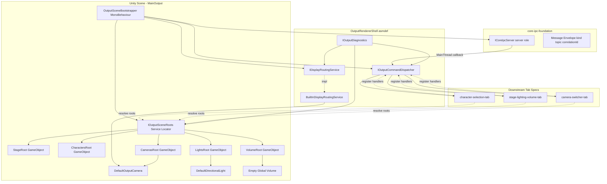
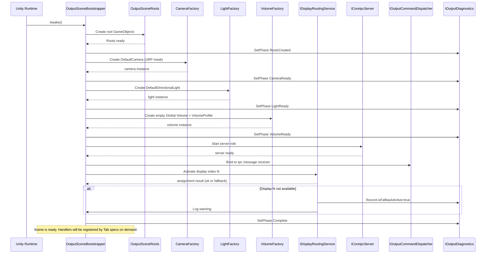
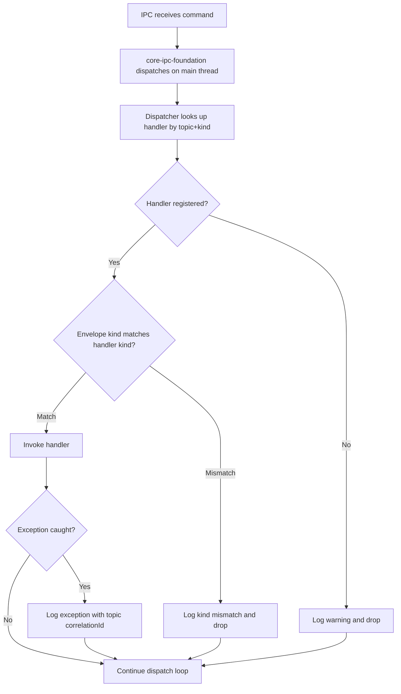
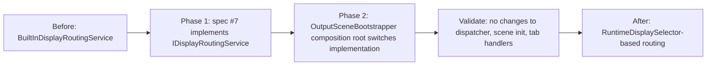

# Technical Design — output-renderer-shell

## Overview

**Purpose**: 本 spec は VTuberSystemBase のメイン出力側シェル（Output Renderer Shell）を提供し、Display 2+ に全画面表示される「配信に載る映像の器」を確立する。具体的には、(1) URP 対応の最小シーン骨格（ルート階層・デフォルトカメラ・デフォルトライト・空の Global Volume）、(2) Display 2+ への全画面表示切替（暫定実装 + 差し替え可能な抽象）、(3) IPC 受信コマンドをシーンへ反映する Command 受け口としてのディスパッチャ、を提供する。

**Users**: Wave 3 の各タブ spec（#4 character-selection-tab, #5 stage-lighting-volume-tab, #6 camera-switcher-tab）、および将来の Wave 4 以降で連携する spec #7 runtime-display-selector-integration が直接の利用者。間接的には配信運用者が「Display 2 に何も描画されていない状態でも配信事故にならない」という構造的保証を得る。

**Impact**: 本 spec は Wave 2 の基盤 spec であり、単独では配信向けの機能を生まないが、後続タブ spec が「機能ロジックに集中する」ための契約境界を確立する。`core-ipc-foundation` の WebSocket サーバロール（D-4）の受け口を具現化し、Unity メインスレッド配信（D-3）を尊重した Command ディスパッチを各タブに公開する。

### Goals

- メイン出力シーンに最小構成（ルート階層・デフォルトカメラ・デフォルトライト・URP Asset 参照・空の Global Volume）を任意のコマンド受信前に準備完了させる。
- Display 2+ への全画面表示切替を抽象インタフェース経由で提供し、Display 2 不在時は Display 1 フォールバック + 警告ログで描画継続する。
- `core-ipc-foundation` の受信側として振る舞い、topic/kind ごとにハンドラを振り分けるディスパッチャを各タブ spec に公開する。
- state コマンドは同一トピック coalesce、event コマンドは FIFO、request/response は相関 ID 対応付けという上流 D-7 / D-10 の契約を受信側で尊重する。
- メイン出力サーフェス（Display 2+）に UI・デバッグログ・エラーダイアログを一切描画しない構造を確立する。
- スタンドアロンビルドと Unity Editor PlayMode の両対応を保証し、PlayMode 停止時には完全にクリーンアップする。

### Non-Goals

- `RuntimeDisplaySelector` との実接続（spec #7）。本 spec は抽象インタフェースのみ提供。
- キャラクター／ステージ／Light／Camera／Global Volume Override の **個別機能ロジック**（spec #4〜#6）。本 spec は受け口と拡張点のみ用意。
- UI Toolkit シェル本体（spec #3）。
- IPC トランスポート／メッセージスキーマ自体（spec #1 `core-ipc-foundation` の責務）。
- カメラ状態の OSC 伝送（spec #6 の責務）。
- シーン状態の永続化・保存・復元。
- OSC 受信側実装（Wave 3 camera-switcher-tab 連携側で別途定義）。

## Boundary Commitments

### This Spec Owns

- メイン出力シーンのルート GameObject 階層（`StageRoot` / `CharactersRoot` / `LightsRoot` / `CamerasRoot` / `VolumeRoot`）の **生成と所有**。
- **デフォルトカメラ** 1 台（URP 設定済み、ステージ全景が映る初期 Transform）の配置と targetDisplay 管理。
- **デフォルトライト** 1 基（Directional Light）の配置。
- **空の Global Volume**（Priority 0、空の VolumeProfile）の配置と、後続タブ向け VolumeProfile 参照取得 API。
- `IDisplayRoutingService` 抽象インタフェースの **定義**、および暫定実装 `BuiltInDisplayRoutingService`（`Display.displays[n].Activate()` ベース）の **提供**。
- `IOutputCommandDispatcher` ディスパッチャの **定義と実装**（state / event / request/response のハンドラ登録 API、topic/kind ベースの振り分け、例外捕捉）。
- `core-ipc-foundation` のサーバロール起動（D-4）のライフサイクル管理を本 spec のブートストラッパーが集約。
- サービスロケータ `IOutputSceneRoots`（ルート GameObject 参照取得 API）の定義と実装。
- 診断 API `IOutputDiagnostics`（シーン初期化フェーズ・ディスプレイ割当状態・登録済みハンドラ数の取得）。
- メイン出力カメラの **カリングマスク契約**（UI レイヤー除外）の確立。

### Out of Boundary

- 各タブ spec が追加生成する個別 GameObject（Light / Stage Prefab / Camera 等）の **実体生成と振る舞い**（本 spec は配置先ルートのみ提供）。
- `Volume` コンポーネントへの **具体 Override 差し込み**（空の VolumeProfile を提供するのみ）。
- UI Toolkit の UIDocument、UI の描画、UI 側診断表示の具体 UX（spec #3）。
- `core-ipc-foundation` のトランスポート・シリアライゼーション・メッセージエンベロープ定義（spec #1）。
- `RuntimeDisplaySelector` の具体実装・マルチディスプレイ物理識別（spec #7）。
- OSC 受信とカメラ状態の適用（Wave 3 camera-switcher-tab 連携側、本 spec はカメラルート GameObject を提供するのみ）。
- 複数クライアント同時接続時のクライアント単位排他制御（OR-2 により YAGNI として除外）。
- Unity Crash Handler / UnityCrashHandler.exe のウィンドウ配置制御（OS 依存、制御不能）。

### Allowed Dependencies

- **上流 spec**: `core-ipc-foundation`（spec #1）の抽象インタフェース `ICoreIpcServer`、`IPublishState`、`IPublishEvent`、`IRequestResponse`、および Unity メインスレッド配信契約（D-3）。
- **Unity 標準**: `UnityEngine`（Display, Camera, Light, GameObject, MonoBehaviour, Application）、`UnityEngine.Rendering.Universal`（URP Asset、UniversalAdditionalCameraData）、`UnityEngine.Rendering`（Volume, VolumeProfile, VolumeManager）。
- **アセンブリ定義**: 本 spec は独立 asmdef `VTuberSystemBase.OutputRendererShell` を定義し、`VTuberSystemBase.CoreIpcFoundation` を参照する。具体トランスポート asmdef は参照しない（D-4 / 抽象インタフェース経由の契約）。
- **言語機能**: C# 9.0+、Unity 6.3（6000.3.x）標準ランタイム。

### Revalidation Triggers

以下の変更は spec #3 ui-toolkit-shell・spec #4〜#6 各タブ・spec #7 RDS の再検証を強制する：

- `IOutputCommandDispatcher` の登録 API シグネチャ変更（state/event/request/response の登録 API 形状）。
- `IOutputSceneRoots` のルート GameObject 命名規約・取得 API 変更。
- `IDisplayRoutingService` インタフェースのメソッドシグネチャ・Activate 契約・フォールバック判定方法の変更。
- Global Volume の VolumeProfile 提供方式（ScriptableObject 生成方式 vs Asset 参照方式）の変更。
- メイン出力カメラのカリングマスク契約（UI 専用レイヤー除外）の変更。
- ブートストラッパー起動順序（IPC サーバ起動 → シーン初期化 → ディスプレイ切替 → ディスパッチャ受付開始）の変更。
- D-3（Unity メインスレッド配信前提）を本 spec 側で二重化する設計変更。

## Architecture

### Architecture Pattern & Boundary Map

本 spec は **Service Locator + Dispatcher** パターンを採用する（research.md Architecture Pattern Evaluation 参照）。シーン初期化で各ルート GameObject を生成し、サービスロケータ経由で後続 spec に提供する。ディスパッチャはハンドラ登録テーブルとして機能する。



**Architecture Integration**:

- **Selected pattern**: Service Locator + Dispatcher。Composition Root（`OutputSceneBootstrapper`）で依存注入し、以降の各コンポーネントはインタフェース経由で利用。
- **Domain/feature boundaries**: シーン骨格（ルート GameObject 管理）／ディスプレイ振り分け／コマンドディスパッチ／診断の 4 責務を独立したインタフェース単位で分離。後続タブは `IOutputSceneRoots` と `IOutputCommandDispatcher` の 2 API のみに依存する。
- **Existing patterns preserved**: `core-ipc-foundation` の D-3（メインスレッド配信）、D-4（サーバロール）、D-7（coalesce）、D-10（state/event 分離）を受信側として尊重。
- **New components rationale**: `IDisplayRoutingService` は RDS 差し替えの唯一の接合点。`IOutputCommandDispatcher` は各タブが直接トランスポートを叩かないための緩衝層。`IOutputSceneRoots` は後続タブの GameObject 配置先を安定化する。
- **Steering compliance**: 現時点で `.kiro/steering/` が未整備のため、`docs/requirements.md` §3.1, §3.3, §6.2, §6.4（各機能モジュールは独立 asmdef に分離）を上位規約として参照。

### Dependency Direction

```
Types & Interfaces  →  Config  →  Services (IDisplayRoutingService, IOutputCommandDispatcher, IOutputSceneRoots, IOutputDiagnostics)
                                            ↓
                           Implementation (BuiltInDisplayRoutingService, OutputCommandDispatcher, OutputSceneRoots, etc.)
                                            ↓
                        Composition Root (OutputSceneBootstrapper MonoBehaviour)
                                            ↓
                         Downstream Tab Specs (spec #4/#5/#6 consumers)
```

- Types / Interfaces レイヤは `core-ipc-foundation` 抽象インタフェースと Unity 標準のみを参照。
- Implementation レイヤは Interfaces + Unity API を参照。
- Composition Root は Implementation を生成し、Service Locator に登録する。
- 下流タブ spec は Interfaces のみを参照する（実装クラスへの直接依存を禁止）。

### Technology Stack

| Layer | Choice / Version | Role in Feature | Notes |
|-------|------------------|-----------------|-------|
| Frontend / CLI | N/A | UI 描画は spec #3 の責務 | 本 spec は描画サーフェス分離の契約のみ |
| Backend / Services | Unity 6.3 (6000.3.x) C# ランタイム | メイン出力シーン、ディスパッチャ、ディスプレイ切替、サービスロケータ | IL2CPP 前提の API のみ使用 |
| Data / Storage | N/A | 永続化なし | シーン状態の保存は後続 spec の責務 |
| Messaging / Events | core-ipc-foundation 抽象インタフェース（spec #1） | WebSocket サーバロール経由の受信、JSON 形式エンベロープ | 本 spec は `ICoreIpcServer` に依存、具体 WebSocket 実装には非依存 |
| Infrastructure / Runtime | UnityEngine.Display, UnityEngine.Camera, UnityEngine.Rendering.Universal, UnityEngine.Rendering (Volume) | ディスプレイ切替・カメラ・URP 設定・Global Volume | `Display.displays[n].Activate()` は StandalonePlayer 限定（research.md 記載）|

**Assembly Layout**:

- `VTuberSystemBase.OutputRendererShell.Runtime`（ランタイム asmdef）
- `VTuberSystemBase.OutputRendererShell.Tests`（EditMode/PlayMode テスト asmdef、optional）
- 参照先: `VTuberSystemBase.CoreIpcFoundation.Abstractions`（spec #1 が公開する抽象 asmdef）、`Unity.RenderPipelines.Universal.Runtime`、`Unity.RenderPipelines.Core.Runtime`

## File Structure Plan

### Directory Structure

```
Packages/com.vtubersystembase.output-renderer-shell/Runtime/
├── Abstractions/
│   ├── IOutputSceneRoots.cs              # Service Locator 契約（ルート GameObject 参照取得）
│   ├── IOutputCommandDispatcher.cs       # ディスパッチャ契約（登録 API + 呼び出し契約）
│   ├── IDisplayRoutingService.cs         # ディスプレイ切替サービス契約（RDS 差し替え接合点）
│   ├── IOutputDiagnostics.cs             # 診断 API 契約
│   ├── OutputCommandKind.cs              # enum: State, Event, Request, Response
│   ├── DisplayAssignmentInfo.cs          # struct: 割当ディスプレイ情報・フォールバック状態
│   ├── OutputCommandHandlerRegistration.cs # ハンドラ登録解除トークン
│   └── OutputSceneInitPhase.cs           # enum: Uninitialized, RootsCreated, CameraReady, LightReady, VolumeReady, Complete
├── Scene/
│   ├── OutputSceneBootstrapper.cs        # MonoBehaviour ブートストラッパー（Composition Root）
│   ├── OutputSceneRoots.cs               # IOutputSceneRoots 実装。ルート GameObject 生成と参照提供
│   ├── DefaultCameraFactory.cs           # デフォルトカメラ生成（URP 設定 + カリングマスク契約）
│   ├── DefaultLightFactory.cs            # デフォルト Directional Light 生成
│   └── GlobalVolumeFactory.cs            # 空の Global Volume + 空 VolumeProfile の生成
├── Display/
│   ├── BuiltInDisplayRoutingService.cs   # 暫定実装 (Display.displays[n].Activate() ベース)
│   └── DisplayRoutingConfig.cs           # 設定データ型（ターゲットディスプレイインデックス等）
├── Dispatch/
│   ├── OutputCommandDispatcher.cs        # IOutputCommandDispatcher 実装
│   └── HandlerRegistry.cs                # topic × kind → Handler の内部登録テーブル
├── Diagnostics/
│   ├── OutputDiagnostics.cs              # IOutputDiagnostics 実装
│   └── OutputShellLogger.cs              # ログレベル切替対応のログ薄ラッパ
└── VTuberSystemBase.OutputRendererShell.Runtime.asmdef
```

```
Packages/com.vtubersystembase.output-renderer-shell/Tests/
├── EditMode/
│   ├── OutputCommandDispatcherTests.cs   # ハンドラ登録・振り分け・例外捕捉の単体テスト
│   ├── HandlerRegistryTests.cs           # 登録テーブルの境界テスト
│   └── VTuberSystemBase.OutputRendererShell.EditModeTests.asmdef
└── PlayMode/
    ├── OutputSceneBootstrapperTests.cs   # シーン起動〜シャットダウンの PlayMode テスト
    ├── BuiltInDisplayRoutingServiceTests.cs # ディスプレイ振り分けの PlayMode テスト（モック差し替え可）
    └── VTuberSystemBase.OutputRendererShell.PlayModeTests.asmdef
```

```
Packages/com.vtubersystembase.output-renderer-shell/Samples~/
└── MinimalMainOutputScene/
    ├── MainOutput.unity                  # Requirement 8.3 の最小サンプルシーン
    └── README.md                         # 手動検証手順
```

### Modified Files

本 spec は新規 spec のため既存ファイルの変更はない。ただし以下のディレクトリが新規作成される：

- `Packages/com.vtubersystembase.output-renderer-shell/` — 本 spec のパッケージルート（UPM パッケージ構造、`docs/requirements.md` §6.4 の独立 asmdef 規約に従う）。
- `Packages/com.vtubersystembase.core-ipc-foundation/Runtime/Abstractions/` — spec #1 側が提供する想定の抽象 asmdef を参照する前提（本 spec の作業対象ではない）。

## System Flows

### Flow 1: メイン出力シーン起動シーケンス

Requirement 1, 2, 3, 5, 6 を横断する、スタンドアロン／Editor PlayMode 双方で共通の起動フロー。



**Key flow decisions**:

- ルート生成→カメラ→ライト→Volume→IPC→ディスパッチャ→ディスプレイ切替の順序は **固定**。Requirement 1.6（任意のコマンド受信前にすべて準備完了）を構造的に担保。
- ディスプレイ切替は IPC 起動後に実施する。理由: Display.Activate 後に即座にフレーム描画が始まるため、IPC 起動完了後の方が「描画開始直後から受信可能」状態を最速で作れる。
- 任意のフェーズで例外が発生した場合、`IOutputDiagnostics` に失敗フェーズを記録し、`Application.Quit()` は呼ばない（Requirement 5.5 / 7 と整合、描画継続優先）。

### Flow 2: コマンドディスパッチと例外分離

Requirement 3.4, 3.5, 3.6, 4.1〜4.9, 9.4〜9.5 を横断する、受信コマンドの処理フロー。



**Key flow decisions**:

- Requirement 3.6 の「例外を捕捉してディスパッチャ自体を停止させない」契約は `try/catch` で invoke をラップすることで実現。
- Requirement 4.6 の「登録種別とエンベロープ kind の不整合は破棄」は登録時点で kind を検証し、受信時にも再検証する二重確認方式。
- state の coalesce（4.2）・event の FIFO（4.3）・request/response の相関（4.7）は **`core-ipc-foundation` の既存契約をそのまま引き継ぐ**。本 spec では追加の coalesce / キューイング実装は行わない（上流 D-7 が受信キューレベルで担保済み、research.md Decision 参照）。
- Requirement 4.8 の last-write-wins は「同一トピック最新値優先」と等価であり、`core-ipc-foundation` の coalesce 契約で自然に実現（research.md Decision 参照）。

## Requirements Traceability

| Requirement | Summary | Components | Interfaces | Flows |
|-------------|---------|------------|------------|-------|
| 1.1 | ルート GameObject 階層生成 | OutputSceneRoots, OutputSceneBootstrapper | IOutputSceneRoots | Flow 1 |
| 1.2 | デフォルトカメラ配置 | DefaultCameraFactory, OutputSceneBootstrapper | IOutputSceneRoots | Flow 1 |
| 1.3 | デフォルトライト配置 | DefaultLightFactory | IOutputSceneRoots | Flow 1 |
| 1.4 | URP Asset 参照 | DefaultCameraFactory | - | Flow 1 |
| 1.5 | 空の Global Volume | GlobalVolumeFactory | IOutputSceneRoots | Flow 1 |
| 1.6 | コマンド受信前に準備完了 | OutputSceneBootstrapper | IOutputDiagnostics | Flow 1 |
| 1.7 | 参照取得 API 提供 | OutputSceneRoots | IOutputSceneRoots | - |
| 1.8 | 拡張点としてルート配下配置受入 | OutputSceneRoots | IOutputSceneRoots | - |
| 2.1 | IDisplayRoutingService 抽象 + 暫定実装 | IDisplayRoutingService, BuiltInDisplayRoutingService | IDisplayRoutingService | Flow 1 |
| 2.2 | Display 2+ アクティベートとカメラ出力先割当 | BuiltInDisplayRoutingService, DefaultCameraFactory | IDisplayRoutingService | Flow 1 |
| 2.3 | 全画面表示 | BuiltInDisplayRoutingService | IDisplayRoutingService | Flow 1 |
| 2.4 | Display 1 フォールバック + 警告 | BuiltInDisplayRoutingService, OutputDiagnostics | IDisplayRoutingService, IOutputDiagnostics | Flow 1 |
| 2.4a | ディスプレイ割当状態の診断公開 | OutputDiagnostics | IOutputDiagnostics | - |
| 2.5 | 具体実装への直接依存排除 | OutputSceneBootstrapper（Composition Root） | IDisplayRoutingService | - |
| 2.6 | RDS 差し替え可能構造 | IDisplayRoutingService | IDisplayRoutingService | - |
| 2.7 | ディスプレイインデックスの外部設定 | DisplayRoutingConfig, BuiltInDisplayRoutingService | - | - |
| 2.8 | スタンドアロン / Editor 同一抽象 | BuiltInDisplayRoutingService | IDisplayRoutingService | Flow 1 |
| 3.1 | サーバロール起動 | OutputSceneBootstrapper | ICoreIpcServer (upstream) | Flow 1 |
| 3.2 | topic/kind 別振り分け | OutputCommandDispatcher, HandlerRegistry | IOutputCommandDispatcher | Flow 2 |
| 3.3 | 登録／解除 API | OutputCommandDispatcher | IOutputCommandDispatcher | - |
| 3.4 | Unity メインスレッド呼び出し | OutputCommandDispatcher（D-3 継承） | IOutputCommandDispatcher | Flow 2 |
| 3.5 | 未登録コマンド破棄 + ログ | OutputCommandDispatcher, OutputShellLogger | IOutputCommandDispatcher | Flow 2 |
| 3.6 | 例外捕捉 + 描画継続 | OutputCommandDispatcher | IOutputCommandDispatcher | Flow 2 |
| 3.7 | asmdef 隔離 | VTuberSystemBase.OutputRendererShell.Runtime.asmdef | - | - |
| 3.8 | request/response ハンドラ登録 | OutputCommandDispatcher | IOutputCommandDispatcher | - |
| 4.1 | kind フィールド参照と配信規律 | OutputCommandDispatcher, HandlerRegistry | IOutputCommandDispatcher | Flow 2 |
| 4.2 | state の coalesce 許容 | OutputCommandDispatcher（上流 D-7 継承） | - | Flow 2 |
| 4.3 | event の FIFO 配信 | OutputCommandDispatcher（上流 D-7 継承） | - | Flow 2 |
| 4.4 | state 冪等性契約ドキュメント | IOutputCommandDispatcher XMLDoc | IOutputCommandDispatcher | - |
| 4.5 | 異なる登録 API | IOutputCommandDispatcher（RegisterStateHandler / RegisterEventHandler / RegisterRequestHandler） | IOutputCommandDispatcher | - |
| 4.6 | kind 不整合破棄 | OutputCommandDispatcher | IOutputCommandDispatcher | Flow 2 |
| 4.7 | request/response 相関 | OutputCommandDispatcher（上流契約継承） | IOutputCommandDispatcher | - |
| 4.8 | Last-write-wins | OutputCommandDispatcher（上流 coalesce 継承） | - | - |
| 4.9 | 複数クライアント event FIFO | OutputCommandDispatcher（上流 FIFO 継承） | - | - |
| 5.1 | メイン出力カメラのカリングマスク | DefaultCameraFactory | - | Flow 1 |
| 5.2 | OnGUI/IMGUI 非アタッチ | OutputSceneBootstrapper（契約） | - | - |
| 5.3 | 例外/警告/診断の描画禁止 | OutputShellLogger（Unity Console / spec #3 経由のみ） | IOutputDiagnostics | - |
| 5.4 | Unity 既定ダイアログ抑止／回避 | OutputSceneBootstrapper（運用ガイダンス） | - | - |
| 5.5 | 重大エラー時の描画維持 | OutputSceneBootstrapper, OutputCommandDispatcher | IOutputDiagnostics | Flow 2 |
| 5.6 | ハンドラへの描画禁止契約ドキュメント | IOutputCommandDispatcher XMLDoc | IOutputCommandDispatcher | - |
| 5.7 | 診断表示の UI 側／コンソール限定 | OutputShellLogger | IOutputDiagnostics | - |
| 6.1 | スタンドアロン起動時自動初期化 | OutputSceneBootstrapper | - | Flow 1 |
| 6.2 | Editor PlayMode 自動初期化 | OutputSceneBootstrapper | - | Flow 1 |
| 6.3 | PlayMode 終了時完全解放 | OutputSceneBootstrapper.OnDestroy | - | - |
| 6.4 | PlayMode 反復時クリーン再初期化 | OutputSceneBootstrapper | - | - |
| 6.5 | Edit モードで起動しない | OutputSceneBootstrapper（MonoBehaviour ライフサイクル） | - | - |
| 6.6 | ドメインリロード跨ぎ状態維持しない | OutputSceneBootstrapper（D-9 継承） | - | - |
| 6.7 | スタンドアロン / Editor 挙動同一 | OutputSceneBootstrapper | - | - |
| 6.8 | Editor 固有挙動差の明文化 | BuiltInDisplayRoutingService（Application.isEditor 分岐） | - | - |
| 7.1 | UI 未接続時の初期構成完了 | OutputSceneBootstrapper | - | Flow 1 |
| 7.2 | UI 未接続中の描画継続 | OutputSceneBootstrapper | - | - |
| 7.3 | UI 後続接続時の通常受信 | ICoreIpcServer（上流契約） | - | - |
| 7.4 | 接続断時のシーン状態維持 | OutputSceneBootstrapper | - | - |
| 7.5 | 接続断イベントの診断のみ記録 | OutputShellLogger | IOutputDiagnostics | - |
| 7.6 | UI 未接続でクラッシュしない | OutputSceneBootstrapper, OutputCommandDispatcher | - | - |
| 7.7 | 外部クライアントの独立受付 | ICoreIpcServer（上流契約 D-4） | - | - |
| 8.1 | 単独での起動完遂 | OutputSceneBootstrapper, Samples~ | - | Flow 1 |
| 8.2 | 自己ループによるディスパッチャ検証 | PlayMode tests with core-ipc self-loop | IOutputCommandDispatcher | - |
| 8.3 | Editor PlayMode 手動検証シーン | Samples~/MinimalMainOutputScene | - | - |
| 8.4 | 単体テストケース提供 | EditMode + PlayMode tests | - | - |
| 8.5 | ディスプレイ切替モック差し替え | IDisplayRoutingService | IDisplayRoutingService | - |
| 9.1 | シーン初期化フェーズログ | OutputSceneBootstrapper, OutputShellLogger | IOutputDiagnostics | Flow 1 |
| 9.2 | ディスプレイ切替ログ | BuiltInDisplayRoutingService, OutputShellLogger | - | Flow 1 |
| 9.3 | ディスパッチャ登録／振り分けログ | OutputCommandDispatcher, OutputShellLogger | - | Flow 2 |
| 9.4 | 未登録コマンドの診断ログ | OutputCommandDispatcher | - | Flow 2 |
| 9.5 | ハンドラ例外の診断ログ | OutputCommandDispatcher | - | Flow 2 |
| 9.6 | メイン出力サーフェス描画禁止 | OutputShellLogger, 全コンポーネント | - | - |
| 9.7 | ログレベル外部切替 | OutputShellLogger | IOutputDiagnostics | - |
| 9.8 | 最小状態の外部取得 | OutputDiagnostics | IOutputDiagnostics | - |

## Components and Interfaces

### Summary

| Component | Domain/Layer | Intent | Req Coverage | Key Dependencies (P0/P1) | Contracts |
|-----------|--------------|--------|--------------|--------------------------|-----------|
| OutputSceneBootstrapper | Scene / Composition Root | Unity シーンに 1 つ置かれる MonoBehaviour。全サービスの生成・注入・ライフサイクル管理を担う | 1.6, 2.2, 2.5, 3.1, 5.2, 5.4, 5.5, 6.1〜6.7, 7.1, 7.2, 7.4, 7.6 | ICoreIpcServer (P0), IDisplayRoutingService (P0), IOutputCommandDispatcher (P0), IOutputSceneRoots (P0), IOutputDiagnostics (P0) | Service |
| OutputSceneRoots | Scene | ルート GameObject 階層の生成・所有・参照提供 | 1.1, 1.7, 1.8 | UnityEngine.GameObject (P0) | Service |
| DefaultCameraFactory | Scene | URP 設定済みデフォルトカメラの生成、カリングマスク契約の適用 | 1.2, 1.4, 5.1 | UniversalAdditionalCameraData (P0), IDisplayRoutingService (P1) | Service |
| DefaultLightFactory | Scene | デフォルト Directional Light の生成 | 1.3 | UnityEngine.Light (P0) | Service |
| GlobalVolumeFactory | Scene | 空の Global Volume + 空 VolumeProfile の生成 | 1.5, 1.8 | UnityEngine.Rendering.Volume (P0), VolumeProfile (P0) | Service |
| IDisplayRoutingService / BuiltInDisplayRoutingService | Display | ディスプレイ振り分けの抽象と暫定実装（RDS 差し替え接合点） | 2.1〜2.8, 6.8, 8.5 | UnityEngine.Display (P0) | Service |
| IOutputCommandDispatcher / OutputCommandDispatcher | Dispatch | IPC 受信コマンドを topic/kind 別ハンドラへ振り分ける | 3.2〜3.8, 4.1〜4.9, 5.5 | ICoreIpcServer receive callback (P0), HandlerRegistry (P0) | Service, Event |
| HandlerRegistry | Dispatch | topic × kind → Handler の内部登録テーブル | 3.2, 3.3, 4.5, 4.6 | - | State |
| IOutputSceneRoots / OutputSceneRoots (service interface) | Scene / Service Locator | ルート GameObject 参照取得 API | 1.7, 1.8 | - | Service |
| IOutputDiagnostics / OutputDiagnostics | Diagnostics | シーン初期化フェーズ・ディスプレイ割当状態・登録済みハンドラ数の公開 | 2.4a, 9.8 | - | Service, State |
| OutputShellLogger | Diagnostics | ログレベル切替対応のログ薄ラッパ。メイン出力サーフェスに描画しない契約 | 5.3, 5.7, 9.1〜9.7 | UnityEngine.Debug (P0) | Service |

### Scene / Composition Root

#### OutputSceneBootstrapper

| Field | Detail |
|-------|--------|
| Intent | Unity シーンに 1 つ置かれる MonoBehaviour。全サービスの生成・注入・ライフサイクル管理を担う Composition Root |
| Requirements | 1.6, 2.2, 2.5, 3.1, 5.2, 5.4, 5.5, 6.1〜6.7, 7.1, 7.2, 7.4, 7.6 |

**Responsibilities & Constraints**

- Unity ライフサイクル（Awake/Start/OnDestroy）を起点に、シーン初期化→IPC サーバ起動→ディスプレイ切替の順序を固定実行（Flow 1）。
- 重複配置（2 つ以上の `OutputSceneBootstrapper`）は Awake 時点で警告ログ + 2 つ目以降を自己破棄する。
- PlayMode 終了時（OnDestroy）に IPC サーバを `Shutdown`、`IDisplayRoutingService.Dispose`、`IOutputCommandDispatcher.Dispose` を逐次実行（D-9 継承）。
- **不変条件**: `Awake` 完了時点で `IOutputSceneRoots` のルート参照はすべて null でない。`Start` 完了時点で IPC サーバは受信可能状態。

**Dependencies**

- Inbound: Unity Runtime — MonoBehaviour ライフサイクル起動 (P0)
- Outbound: `IOutputSceneRoots`, `IDisplayRoutingService`, `IOutputCommandDispatcher`, `IOutputDiagnostics` — 生成と依存注入 (P0)
- External: `ICoreIpcServer`（spec #1 core-ipc-foundation） — WebSocket サーバロール起動 (P0)

**Contracts**: Service [x] / API [ ] / Event [ ] / Batch [ ] / State [ ]

##### Service Interface

```csharp
// MonoBehaviour は interface を公開しないが、サービス生成契約を XMLDoc で明示する
public sealed class OutputSceneBootstrapper : MonoBehaviour
{
    // 設定用 SerializeField（Inspector から構成）
    [SerializeField] private DisplayRoutingConfig _routingConfig;
    [SerializeField] private bool _autoStart = true;

    private void Awake()  { /* Roots, Camera, Light, Volume 生成 → Diagnostics 更新 */ }
    private void Start()  { /* IPC サーバ起動 → Dispatcher バインド → Display 切替 */ }
    private void OnDestroy() { /* 逆順で Shutdown / Dispose */ }

    /// <summary>
    /// シーン外部からの注入ポイント（テスト時にモック IDisplayRoutingService を差し込む等に使う）。
    /// Awake 前に呼び出さなければならない。
    /// </summary>
    public void OverrideServices(IDisplayRoutingService routing = null, ICoreIpcServer ipc = null);
}
```

- **Preconditions**: シーン階層に 1 つのみ配置される。`_routingConfig` が null の場合は既定値（Display 2 を target）を使用。
- **Postconditions**: Awake 完了で `IOutputSceneRoots` 参照取得可能。Start 完了で `IOutputCommandDispatcher` へのハンドラ登録受付開始。
- **Invariants**: PlayMode 開始〜停止の間のみ活動（D-9）。OnDestroy 後は IPC・ディスパッチャ・ディスプレイ割当のリソースを一切保持しない。

**Implementation Notes**

- Integration: `Awake` 前に `OverrideServices(...)` を呼ぶことで PlayMode テストからモックを注入可能。本番ビルドでは呼ばれず既定の具体実装が使われる。
- Validation: `Awake` 実行時点で Unity の `Application.isPlaying` をアサートし、Edit モードでは何もしない（D-9）。
- Risks: 重複配置の検出漏れ → `FindObjectsByType<OutputSceneBootstrapper>()` で Awake 時に明示検証。

---

#### OutputSceneRoots

| Field | Detail |
|-------|--------|
| Intent | ルート GameObject 階層を生成・所有し、後続 spec へ参照を提供する Service Locator |
| Requirements | 1.1, 1.7, 1.8 |

**Responsibilities & Constraints**

- 以下 5 つのルート GameObject を起動時に生成し、命名規約に従った Transform 階層を構築する：
  - `StageRoot`（ステージ Prefab 配置用）
  - `CharactersRoot`（アバター／Slot 配置用）
  - `LightsRoot`（Light 配置用、デフォルト Directional Light を配下に持つ）
  - `CamerasRoot`（Camera 配置用、デフォルトカメラを配下に持つ）
  - `VolumeRoot`（Global Volume を配下に持つ）
- 生成済みの GameObject 参照を `IOutputSceneRoots` インタフェース経由で取得可能にする。
- 各ルート名はハードコードされた文字列定数で公開し、後続 spec は `IOutputSceneRoots` API または GameObject 名文字列定数のいずれでも解決可能。

**Dependencies**

- Inbound: `OutputSceneBootstrapper` (P0)
- Outbound: UnityEngine.GameObject / Transform (P0)
- External: なし

**Contracts**: Service [x] / API [ ] / Event [ ] / Batch [ ] / State [ ]

##### Service Interface

```csharp
public interface IOutputSceneRoots
{
    /// <summary>ステージアセット（Prefab）配置用のルート。</summary>
    Transform Stage { get; }
    /// <summary>キャラクター（アバター）配置用のルート。</summary>
    Transform Characters { get; }
    /// <summary>Light 配置用のルート（デフォルト Directional Light を配下に含む）。</summary>
    Transform Lights { get; }
    /// <summary>Camera 配置用のルート（デフォルトカメラを配下に含む）。</summary>
    Transform Cameras { get; }
    /// <summary>Global Volume 配置用のルート（空の Global Volume を配下に含む）。</summary>
    Transform Volumes { get; }

    /// <summary>空の Global Volume が参照する VolumeProfile（後続 spec が Override を AddComponent&lt;T&gt;() で追加する先）。</summary>
    UnityEngine.Rendering.VolumeProfile GlobalVolumeProfile { get; }

    /// <summary>デフォルトカメラ。targetDisplay は IDisplayRoutingService により設定される。</summary>
    UnityEngine.Camera DefaultCamera { get; }
}

public static class OutputSceneRootNames
{
    public const string Stage = "StageRoot";
    public const string Characters = "CharactersRoot";
    public const string Lights = "LightsRoot";
    public const string Cameras = "CamerasRoot";
    public const string Volumes = "VolumeRoot";
}
```

- **Preconditions**: `OutputSceneBootstrapper.Awake` 完了済み。
- **Postconditions**: すべてのプロパティは null 以外の値を返す。
- **Invariants**: PlayMode 停止まで参照は変わらない（デフォルトカメラ・デフォルトライト・Global Volume の実体は後続 spec で変更されない、ただし後続 spec は配下に自由に GameObject を追加できる）。

**Implementation Notes**

- Integration: 後続 spec は `FindObjectOfType<OutputSceneBootstrapper>()?.GetComponent<IOutputSceneRoots>()` か、注入 API（Composition Root）経由で取得。
- Validation: ルート GameObject がシーン配置時に既に存在する場合、生成せず再利用する（Editor でプロトタイプシーンを保存する場合の冪等性確保）。
- Risks: 後続 spec が `Transform.Reset` 等でルートを破壊的に変更するリスク → XMLDoc に「ルート Transform の position/rotation/scale を変更しないこと」を明記。

---

### Display

#### IDisplayRoutingService / BuiltInDisplayRoutingService

| Field | Detail |
|-------|--------|
| Intent | ディスプレイ振り分けの抽象インタフェースと、`Display.displays[n].Activate()` ベースの暫定実装。RDS（spec #7）差し替え接合点 |
| Requirements | 2.1〜2.8, 6.8, 8.5 |

**Responsibilities & Constraints**

- `IDisplayRoutingService` は暫定実装（本 spec 提供）と RDS 実装（spec #7 提供）の 2 実装がありうる唯一のインタフェース。
- `BuiltInDisplayRoutingService` は `DisplayRoutingConfig.TargetDisplayIndex`（既定 1 = Display 2）へ `Display.displays[i].Activate()` を呼び出し、指定インデックスが `Display.displays.Length` を超える場合は Display 0 にフォールバック（OR-1）。
- Editor PlayMode では `Display.displays[i].Activate()` が無効なため、`Application.isEditor == true` 時は Game View（Display 0 相当）への描画継続を前提として警告ログを出す（Requirement 6.8）。
- Camera の `targetDisplay` は本サービスが内部で設定する（`IOutputSceneRoots.DefaultCamera.targetDisplay = effectiveDisplayIndex`）。
- Requirement 2.3 の全画面表示は `Screen.fullScreenMode = FullScreenMode.FullScreenWindow`（既定）または `ExclusiveFullScreen`（`DisplayRoutingConfig` で切替可能）を適用。

**Dependencies**

- Inbound: `OutputSceneBootstrapper` (P0)
- Outbound: UnityEngine.Display, UnityEngine.Screen, UnityEngine.Camera (P0)
- External: 将来 `RuntimeDisplaySelector` パッケージ（spec #7、本 spec では依存せず）

**Contracts**: Service [x] / API [ ] / Event [ ] / Batch [ ] / State [ ]

##### Service Interface

```csharp
public interface IDisplayRoutingService : System.IDisposable
{
    /// <summary>
    /// 指定カメラを構成に従ってアクティブ化し、targetDisplay を割り当てる。
    /// Display N が存在しない場合は Display 0 にフォールバックし、isFallbackActive=true を診断に記録する。
    /// </summary>
    DisplayAssignmentInfo Activate(Camera outputCamera, DisplayRoutingConfig config);

    /// <summary>現在の割当状態（フォールバック有無を含む）を返す。PlayMode 中に複数回取得可能。</summary>
    DisplayAssignmentInfo GetAssignment();

    /// <summary>true の場合、Display 2 不在などでフォールバックが起きている状態。</summary>
    bool IsFallbackActive { get; }
}

public readonly struct DisplayAssignmentInfo
{
    public int RequestedDisplayIndex { get; init; }
    public int EffectiveDisplayIndex { get; init; }
    public bool IsFallbackActive { get; init; }
    public bool IsEditorLimitedMode { get; init; } // Editor PlayMode 固有の制限状態
    public string DiagnosticMessage { get; init; }
}

public sealed class DisplayRoutingConfig
{
    public int TargetDisplayIndex { get; init; } = 1; // 既定 = Display 2
    public FullScreenMode FullScreenMode { get; init; } = FullScreenMode.FullScreenWindow;
    public bool SuppressEditorWarning { get; init; } = false;
}

public sealed class BuiltInDisplayRoutingService : IDisplayRoutingService
{
    public DisplayAssignmentInfo Activate(Camera outputCamera, DisplayRoutingConfig config) { /* ... */ }
    public DisplayAssignmentInfo GetAssignment() { /* ... */ }
    public bool IsFallbackActive { get; private set; }
    public void Dispose() { /* Editor では targetDisplay リセット。Standalone では Activate 済みを非アクティブ化できない旨を明記 */ }
}
```

- **Preconditions**: `Activate` 呼び出し時に `outputCamera` が null 以外、`config.TargetDisplayIndex >= 0`。
- **Postconditions**: `Activate` 後、`outputCamera.targetDisplay` は `EffectiveDisplayIndex`。`GetAssignment` は `Activate` 結果を返す。
- **Invariants**: StandalonePlayer では一度 `Activate` したディスプレイを非アクティブ化できない（Unity 仕様）。Dispose は Camera の targetDisplay リセットのみを行う。

**Implementation Notes**

- Integration: `OutputSceneBootstrapper` が `_routingConfig` を使って `Activate(DefaultCamera, config)` を呼ぶ。テスト時は `OverrideServices(routing: new MockDisplayRoutingService())` で差し替え。
- Validation: `Display.displays.Length` を起動時点で取得してログ出力。Requirement 9.2 の具体実装。
- Risks:
  - Display 2 が物理切断されていない場合でも `Display.displays.Length` が 1 を返すエッジケース（OS 側のディスプレイ設定状態依存）は、フォールバック経路で吸収。
  - Editor での挙動差は R-OR-2（research.md）として受容。

---

### Dispatch

#### IOutputCommandDispatcher / OutputCommandDispatcher

| Field | Detail |
|-------|--------|
| Intent | IPC 受信コマンドを topic × kind 別ハンドラへ振り分ける。各タブ spec のハンドラ登録受け口 |
| Requirements | 3.2〜3.8, 4.1〜4.9, 5.5 |

**Responsibilities & Constraints**

- `core-ipc-foundation` の受信コールバック（D-3 により Unity メインスレッド上で呼ばれる前提）を受け取り、`(topic, kind)` キーで登録済みハンドラをルックアップして invoke する。
- ハンドラは state / event / request それぞれ別の登録 API を持ち、登録時に kind を明示させる（Requirement 4.5）。
- 登録時点と受信時点の 2 回、`(topic, kind)` の整合性を検証する（Requirement 4.6）。
- 未登録コマンド受信時は診断ログを出して破棄（Requirement 3.5, 9.4）。
- ハンドラ実行中の例外は `try/catch` で捕捉し、診断ログに `topic / kind / correlationId / 例外内容` を記録してディスパッチャ自体は継続（Requirement 3.6, 5.5, 9.5）。
- state の coalesce / event の FIFO / request/response の相関は **`core-ipc-foundation` の上流契約（D-7 / D-10）をそのまま引き継ぐ**（research.md Decision 参照）。本コンポーネントは kind 別にハンドラを呼び分けるだけで、独自のキュー制御は実装しない。
- 各タブ spec は `Register*Handler` 呼び出しで返却されるトークン（`IDisposable`）を保持し、タブ非アクティブ化時に Dispose で解除する。

**Dependencies**

- Inbound: `core-ipc-foundation` の受信コールバック（P0、上流 D-3 契約）、各タブ spec のハンドラ登録呼び出し (P0)
- Outbound: `HandlerRegistry` (P0)、`OutputShellLogger` (P1)
- External: `ICoreIpcServer` の受信ポート（spec #1）

**Contracts**: Service [x] / API [ ] / Event [x] / Batch [ ] / State [ ]

##### Service Interface

```csharp
public interface IOutputCommandDispatcher : System.IDisposable
{
    /// <summary>
    /// state 系ハンドラを登録する。ハンドラ実装は冪等でなければならない（同一入力で同一結果）。
    /// 同一 topic の state は上流契約（D-7）により最新値のみが届く可能性がある。
    /// </summary>
    IDisposable RegisterStateHandler<TPayload>(string topic, System.Action<StateCommand<TPayload>> handler);

    /// <summary>
    /// event 系ハンドラを登録する。event は FIFO で到着順に呼び出される。
    /// ハンドラは副作用を持ち、漏らされない前提で実装する。
    /// </summary>
    IDisposable RegisterEventHandler<TPayload>(string topic, System.Action<EventCommand<TPayload>> handler);

    /// <summary>
    /// request/response 系ハンドラを登録する。Response は相関 ID で一意に対応付けられる。
    /// </summary>
    IDisposable RegisterRequestHandler<TRequest, TResponse>(string topic, System.Func<RequestCommand<TRequest>, TResponse> handler);

    /// <summary>現在登録されているハンドラ数（診断用）。</summary>
    int RegisteredHandlerCount { get; }
}

public readonly struct StateCommand<TPayload>
{
    public string Topic { get; init; }
    public TPayload Payload { get; init; }
    public long ReceivedAtTicks { get; init; }
}

public readonly struct EventCommand<TPayload>
{
    public string Topic { get; init; }
    public TPayload Payload { get; init; }
    public long ReceivedAtTicks { get; init; }
}

public readonly struct RequestCommand<TRequest>
{
    public string Topic { get; init; }
    public string CorrelationId { get; init; }
    public TRequest Payload { get; init; }
}

public sealed class OutputCommandDispatcher : IOutputCommandDispatcher
{
    public OutputCommandDispatcher(ICoreIpcServer ipcServer, OutputShellLogger logger);
    // 上記 Register* メソッド実装。
    // 内部でハンドラ取得 → kind 検証 → try/catch invoke → ログ
    public void Dispose(); // 登録ハンドラ全解除、IPC 受信購読解除
}
```

- **Preconditions**: コンストラクタ引数 `ipcServer` は起動済みの `ICoreIpcServer`。`logger` は非 null。
- **Postconditions**: 登録呼び出し後、`RegisteredHandlerCount` が増加。返却された `IDisposable` を Dispose すると減少。
- **Invariants**: 全ハンドラ呼び出しは Unity メインスレッド上（D-3 継承）。登録／解除は任意スレッドから呼べるが、内部で lock するか、登録／解除もメインスレッド限定とする（実装選択、既定はメインスレッド限定で単純化）。

##### Event Contract

- **Subscribed events**: `ICoreIpcServer` の `OnCommandReceived(MessageEnvelope)`（spec #1 が提供）。
- **Processing ordering / delivery guarantees**:
  - state コマンド: 同一 topic の最新値のみが届く（上流 coalesce 契約）、ハンドラは冪等前提。
  - event コマンド: FIFO、取りこぼしなし（上流 FIFO キュー契約）。
  - request/response: correlationId で 1:1 対応、coalesce 対象外。
  - 未登録コマンド: 破棄 + 診断ログ（本コンポーネントで処理）。
  - kind 不一致: 破棄 + 診断ログ（本コンポーネントで処理）。

**Implementation Notes**

- Integration: `OutputSceneBootstrapper.Start` 内で `ICoreIpcServer` と紐付けて生成される。タブ spec は `IOutputCommandDispatcher` のみに依存し、具体実装クラス名には依存しない。
- Validation: Register 時点で `typeof(TPayload)` と topic から期待 kind を確定させ、内部レジストリに保存。受信時に envelope.kind と照合（Requirement 4.6）。
- Risks:
  - 複数タブが同じ topic を登録した場合の扱い（R-OR-4 research.md）: 既定では **例外 + 診断ログ**（Fail-Fast）を採用。後続 spec の要件で変更が必要な場合は `RegisterStateHandler` にオーバロードを追加（allowOverride: true 等）して対応する予定。
  - ハンドラ実装が描画ループをブロックするリスク（重い処理を同期で実行）→ XMLDoc で「ハンドラはメインスレッド上で短時間で完了すること」を明記。

---

#### HandlerRegistry

| Field | Detail |
|-------|--------|
| Intent | `(topic, kind)` → ハンドラ Delegate の内部登録テーブル。Dispatcher の責務分離 |
| Requirements | 3.2, 3.3, 4.5, 4.6 |

**Responsibilities & Constraints**

- 内部状態として `Dictionary<(string topic, OutputCommandKind kind), Delegate>` を持つ。
- 登録時に `(topic, kind)` 重複を検出し、既存があれば例外 or 警告（`OutputCommandDispatcher` の規約に従う、既定 = 例外）。
- 解除は登録時に返却した `IDisposable` を Dispose する経路のみ。

**Contracts**: Service [ ] / API [ ] / Event [ ] / Batch [ ] / State [x]

##### State Management

- **State model**: `Dictionary<(string, OutputCommandKind), Delegate>`、および各エントリに紐づく登録 ID（`long`）。
- **Persistence & consistency**: PlayMode 内のみ保持。永続化しない。
- **Concurrency strategy**: 既定はメインスレッド限定。テストで多スレッド想定時のみ `lock` を使用（小規模辞書のため競合コストは無視可能）。

---

### Diagnostics

#### IOutputDiagnostics / OutputDiagnostics

| Field | Detail |
|-------|--------|
| Intent | シーン初期化フェーズ・ディスプレイ割当状態・登録済みハンドラ数を外部から取得可能な読み取り専用 API |
| Requirements | 2.4a, 9.8 |

**Responsibilities & Constraints**

- `OutputSceneBootstrapper` / `BuiltInDisplayRoutingService` / `OutputCommandDispatcher` から状態更新を受け取り、UI 側（spec #3）や運用ツールが取得可能な形で公開する。
- **読み取り専用**。書き込みは本 spec 内コンポーネントのみ実施（internal set）。
- スレッドセーフ（volatile / lock）で任意スレッドから `Get*` 呼び出し可能。

**Contracts**: Service [x] / API [ ] / Event [ ] / Batch [ ] / State [x]

##### Service Interface

```csharp
public interface IOutputDiagnostics
{
    OutputSceneInitPhase CurrentPhase { get; }
    DisplayAssignmentInfo CurrentDisplayAssignment { get; }
    int RegisteredHandlerCount { get; }
    string LastErrorMessage { get; }
    long LastErrorAtUnixMs { get; }
}

public enum OutputSceneInitPhase
{
    Uninitialized,
    RootsCreated,
    CameraReady,
    LightReady,
    VolumeReady,
    IpcServerReady,
    DispatcherReady,
    DisplayRouted,
    Complete,
    Failed
}
```

- **Preconditions**: なし（常に取得可能）。
- **Postconditions**: `Uninitialized` → `Complete` への単調遷移、ただし `Failed` への遷移はどの段階からも起こりうる。

**Implementation Notes**

- Integration: UI 側（spec #3）が接続確立直後に `IOutputDiagnostics` の状態を request/response 経由で取得する（topic 例: `diagnostics/output-shell/snapshot`、契約は spec #3 / 本 spec の境界で確定）。
- Risks: 診断 API がハンドラ呼び出しを誘発しないこと（描画継続性維持）→ 実装は単純な getter のみ。

---

#### OutputShellLogger

| Field | Detail |
|-------|--------|
| Intent | ログレベル切替対応のログ薄ラッパ。メイン出力サーフェスに描画しない契約を実装レベルで担保 |
| Requirements | 5.3, 5.7, 9.1〜9.7 |

**Responsibilities & Constraints**

- 出力先は **Unity Console （`Debug.Log*`）のみ**。`OnGUI` / `IMGUI` / UI Toolkit への出力経路を一切持たない。
- ログレベル（`Verbose` / `Info` / `Warning` / `Error`）を `DisplayRoutingConfig` または専用 `OutputShellLoggerConfig` で切替。
- 全ログ呼び出しには topic / correlationId / 関連コンポーネント名 などの構造化情報を付与。

**Contracts**: Service [x] / API [ ] / Event [ ] / Batch [ ] / State [ ]

##### Service Interface

```csharp
public sealed class OutputShellLogger
{
    public OutputShellLogger(LogLevel minLevel = LogLevel.Info);
    public void Verbose(string message, string component = null, string topic = null);
    public void Info(string message, string component = null, string topic = null);
    public void Warning(string message, string component = null, string topic = null);
    public void Error(string message, System.Exception ex = null, string component = null, string topic = null, string correlationId = null);
    public LogLevel MinLevel { get; set; }
}

public enum LogLevel { Verbose, Info, Warning, Error }
```

**Implementation Notes**

- Integration: 本 spec 内全コンポーネントがコンストラクタ経由で注入。UI 側（spec #3）の診断領域へ転送する経路は将来拡張（spec #3 Requirement 11 と整合）として `OutputShellLogger` に UI 転送コールバック登録 API を追加可能だが、本 spec では Unity Console 出力のみを必須契約とする。
- Risks: ログ出力頻度が高すぎる場合の描画影響 → Verbose レベル既定 off、Info 以上で運用。

## Data Models

本 spec はデータ永続化を行わず、ランタイム構造体のみ。データ契約は上流 `core-ipc-foundation` のメッセージエンベロープ（spec #1 Requirement 3）に従う。本 spec が定義する内部データ型は Components and Interfaces セクションで既定。

### Domain Model（最小）

- **Aggregate Root**: `OutputSceneBootstrapper`（シーン全体のライフサイクル所有者）
- **Entities**:
  - ルート GameObject 群（`StageRoot` / `CharactersRoot` / `LightsRoot` / `CamerasRoot` / `VolumeRoot`）
  - デフォルトカメラ / デフォルトライト / 空の Global Volume
- **Value Objects**:
  - `DisplayAssignmentInfo`（読み取り専用 struct）
  - `DisplayRoutingConfig`
  - `StateCommand<T>` / `EventCommand<T>` / `RequestCommand<T>`
  - `OutputSceneInitPhase`（enum）
- **Domain Events**: なし（本 spec では内部イベントを発行しない。診断状態の変化は `IOutputDiagnostics` のプロパティ更新として公開）。
- **Invariants**:
  - `OutputSceneInitPhase` は単調遷移（`Uninitialized → ... → Complete`）または `Failed` への脱出のみ。
  - `IOutputSceneRoots` のプロパティは Awake 完了後に null にならない。
  - `HandlerRegistry` は重複 `(topic, kind)` を許容しない。

### Data Contracts & Integration

本 spec が受信する IPC メッセージエンベロープは `core-ipc-foundation` spec #1 Requirement 3 が定義するものをそのまま使用する。概念的には：

```
{
  "kind": "state" | "event" | "request" | "response",
  "topic": "<string topic>",
  "correlationId": "<uuid, request/response の場合>",
  "payload": { ...任意 JSON... }
}
```

- **シリアライゼーション**: JSON / WebSocket テキストフレーム（D-5 継承）。
- **スキーマ進化**: 未知フィールドは `core-ipc-foundation` が無視（Requirement 3.7 継承）。
- **サイズ上限**: 1 MB（D-11 継承、`core-ipc-foundation` で強制）。

## Error Handling

### Error Strategy

本 spec は **描画継続を最優先** とする。いかなるエラーもメイン出力の描画ループを停止させない。具体的には：

1. **シーン初期化失敗**: 失敗フェーズを `IOutputDiagnostics.CurrentPhase = Failed` + `LastErrorMessage` に記録し、可能な限り後続フェーズを続行。完全停止はしない。
2. **ディスプレイ切替失敗**: Display 1 フォールバック（OR-1）+ 警告ログ。描画は継続。
3. **IPC サーバ起動失敗**: 診断に記録。メイン出力の描画は継続し、UI 側は接続できない状態となるが本 spec 側では何もしない（Requirement 7.6）。
4. **ハンドラ実行中の例外**: try/catch で捕捉、診断ログ、ディスパッチャ継続（Requirement 3.6, 5.5）。
5. **未登録コマンド受信**: 破棄 + 診断ログ（Requirement 3.5）。
6. **kind 不整合**: 破棄 + 診断ログ（Requirement 4.6）。

### Error Categories and Responses

- **初期化エラー**: シーン骨格生成失敗 → 可能な限り続行、`Failed` 状態を診断公開。
- **統合エラー**: IPC サーバ起動失敗 / ディスプレイ Activate 失敗 → 診断記録 + フォールバック or ログ。描画継続。
- **ランタイムエラー**: ハンドラ例外 / 不正メッセージ → 捕捉 + ログ。
- **構成エラー**: 重複 `OutputSceneBootstrapper` / 重複ハンドラ登録 → Fail-Fast（例外）。

### Monitoring

- `IOutputDiagnostics` 経由で UI 側（spec #3）が状態取得可能。
- `OutputShellLogger` で全イベントを Unity Console に出力。ログレベルは `OutputShellLoggerConfig` で実行時切替可能（Requirement 9.7）。

## Testing Strategy

### Unit Tests（EditMode）

1. `OutputCommandDispatcherTests`: ハンドラ登録 → 受信シミュレーション → invoke 確認。kind 不整合、未登録コマンド、ハンドラ例外の 3 シナリオをカバー（Requirement 3.5, 3.6, 4.5, 4.6）。
2. `HandlerRegistryTests`: 重複登録エラー、Dispose による解除、複数トピック・複数 kind の境界テスト。
3. `DisplayRoutingConfigTests`: 既定値、境界値（`TargetDisplayIndex = 0, 1, int.MaxValue`）の取扱い。
4. `OutputDiagnosticsTests`: 単調遷移（Uninitialized → Complete）、Failed 経路、並行 getter のスレッドセーフ性（小規模）。

### Integration Tests（PlayMode）

1. `OutputSceneBootstrapperTests`:
   - PlayMode 開始 → 全フェーズが `Complete` に到達することを検証（Flow 1）。
   - PlayMode 停止 → `IOutputDiagnostics.CurrentPhase = Uninitialized` に戻ることを検証（Requirement 6.3, 6.4）。
   - 反復 10 回でリソースリークがないことを検証（GC プロファイリング）。
2. `BuiltInDisplayRoutingServiceTests`:
   - Mock `Display` 経由でフォールバック経路を検証。Editor では実際の Display 2 がないためモック差し替え必須（Requirement 8.5）。
3. `SelfLoopDispatcherTests`:
   - `core-ipc-foundation` の自己ループ機構（spec #1 Requirement 8）を活用して、ダミーコマンドを自プロセス内で送受信し、ディスパッチャが正しくハンドラを呼び出すことを検証（Requirement 8.2）。
   - state / event / request/response の 3 種類すべてを検証。
4. `UiDisconnectedFailsafeTests`:
   - `ICoreIpcServer` のクライアント未接続状態で起動 → メイン出力が描画継続すること（Requirement 7.1, 7.2, 7.6）。

### E2E/UI Tests（手動）

1. `Samples~/MinimalMainOutputScene/MainOutput.unity` を開き、PlayMode で起動。
2. Console ログで全初期化フェーズの完了を確認。
3. ディスプレイ割当が想定どおりか、フォールバック警告が期待どおり出るかを確認。
4. PlayMode 停止 → 再開を 3 回繰り返し、エラーなく再初期化されることを確認（Requirement 6.4）。

### Performance（非機能）

- PlayMode 起動〜 `IOutputDiagnostics.CurrentPhase = Complete` までの所要時間を 500ms 以内（目安、`docs/requirements.md` §6.1 参照、本 spec の独自目標値ではない）。
- ハンドラ invoke のオーバーヘッドが 1 フレーム（16ms @ 60fps）を超えないこと。通常 10μs 程度を想定。
- 診断 API 呼び出しが描画ループに影響しないこと（getter のみ、ロック最小）。

## Optional Sections

### Security Considerations

- 本 spec は本フェーズで認証・暗号化を扱わない（`core-ipc-foundation` Requirement 6.6 継承）。
- ハンドラ登録は本 spec の asmdef を参照できる内部コード（= 各タブ spec）のみ可能（Requirement 3.7）。外部 WebSocket クライアントから直接ハンドラを登録することはできない。
- Unity Editor で開発者が恣意的に外部クライアントを接続した場合も、ハンドラが登録されていないトピックは破棄されるため、意図しないシーン操作は発生しない（Fail-Safe by default）。

### Performance & Scalability

- 本 spec は **低頻度メッセージ前提**（`core-ipc-foundation` D-3 記載「〜100 Hz 以下」の受信）。10K topic 以上のような大規模ディスパッチは想定外。
- ハンドラテーブルは `Dictionary` ベース（O(1) lookup）、登録数が 1000 を超える場合は別途プロファイリング。
- Global Volume の VolumeProfile 書き換えは後続 spec の責務。本 spec は初期配置のみ（ランタイム生成 ScriptableObject インスタンス、research.md 参照）。

### Migration Strategy

本 spec は新規 spec のため既存からの移行は不要。ただし spec #7 `runtime-display-selector-integration` が将来組み込まれる際の差し替え手順を明示：



**Rollback triggers**: `IDisplayRoutingService` インタフェース違反、フォールバック挙動の差異検出、PlayMode 起動失敗頻度の上昇。

**Validation checkpoints**:
1. spec #7 実装後、本 spec の既存テスト群を実行し回帰なしを確認。
2. `OutputSceneBootstrapper.OverrideServices(routing: rdsRouting)` で RDS 実装に差し替えて PlayMode 起動確認。
3. 診断 API の `DisplayAssignmentInfo` 形状に互換性があることを確認（`IsFallbackActive` 等のフィールド継承）。

## Supporting References

- 上流 spec: `.kiro/specs/core-ipc-foundation/requirements.md`（D-1〜D-11 の継承元）
- 下流 spec: `.kiro/specs/ui-toolkit-shell/requirements.md`（Requirement 9 のフェイルセーフ契約と整合）
- 下流 spec: `.kiro/specs/character-selection-tab/requirements.md`、`stage-lighting-volume-tab/requirements.md`、`camera-switcher-tab/requirements.md`（各タブがハンドラを登録する対象）
- 研究ノート: `.kiro/specs/output-renderer-shell/research.md`（Display.Activate 制約、Volume 設計、メインスレッド配信責務境界の詳細）
- プロジェクト上位要件: `docs/requirements.md` §2.3, §3.1, §3.3, §6.2, §6.4
- 計画書: `docs/spec-breakdown.md` spec #2
