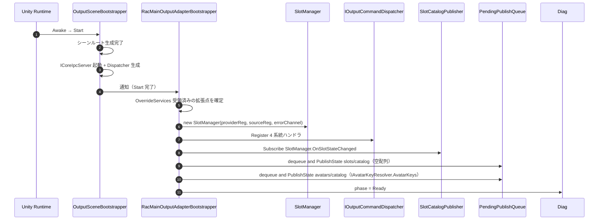
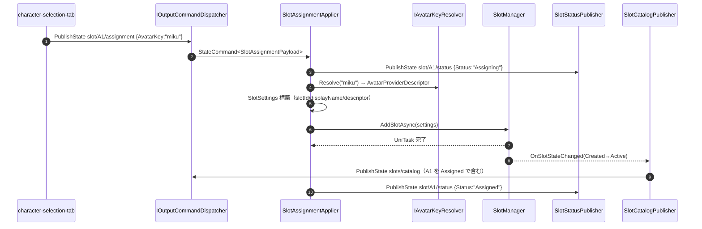
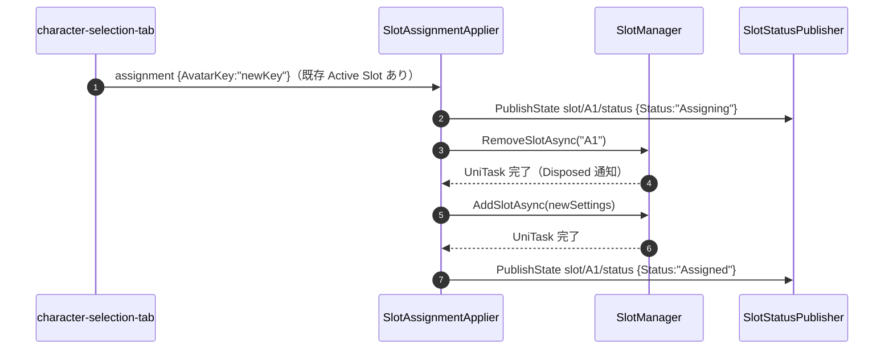
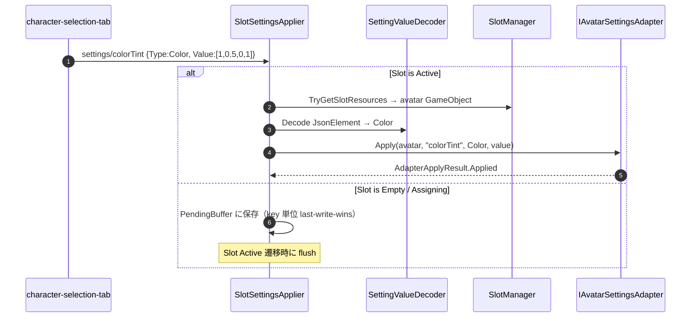
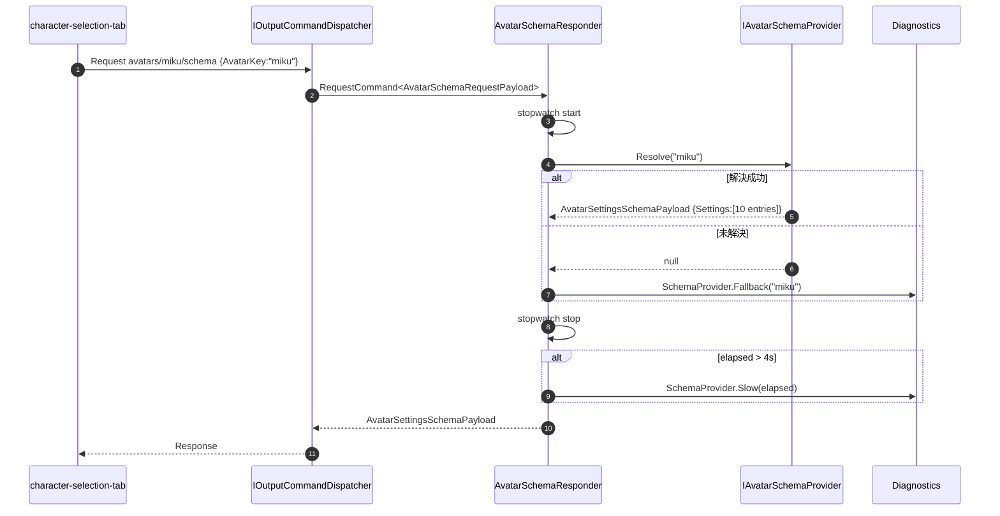
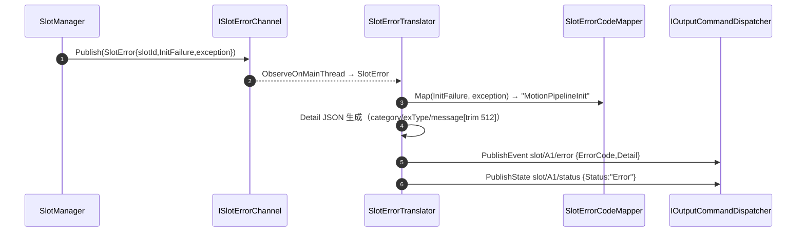
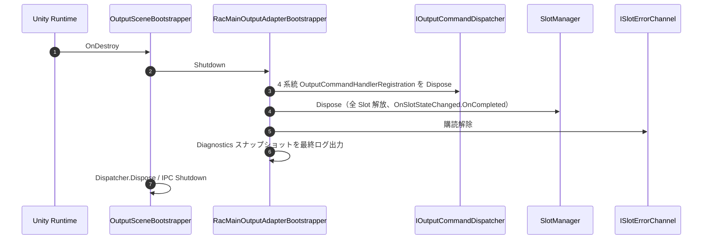

# Technical Design — rac-main-output-adapter

## Overview

**Purpose**: 本 spec は、VTuberSystemBase のメイン出力プロセス（`OutputSceneBootstrapper` を Composition Root とするシーン）に常駐し、`character-selection-tab` が UI 側で発行する IPC コマンドを `output-renderer-shell` の `IOutputCommandDispatcher` 経由で受信し、`com.hidano.realtimeavatarcontroller`（RAC）の `SlotManager` を駆動して実シーンに反映する **メイン出力側アダプタ** を提供する。

**Users**: 配信オペレーター（UI から Slot 割当を行うと Display 2 にアバターが現れることを期待する）、配信運用者（プリセット切替や `Reload` で復帰する）、利用者プロジェクト開発者（Addressables 規約・MoCap ソース・アバター設定アダプタを差し替えてアバター実装に適合する）、本 spec の保守者（RAC のバージョンアップに追従する）。

**Impact**: 本 spec は Wave 3c の 3 アダプタの 1 つ目であり、`character-selection-tab` Contracts asmdef を **共有参照** して受信ハンドラを登録するパスを最初に確立する。`output-renderer-shell` の `IOutputCommandDispatcher` 利用例として後続の `stage-lighting-volume-output-adapter` / `camera-switcher-output-adapter` のテンプレートにもなる。

### Goals

- `output-renderer-shell` の `OutputSceneBootstrapper` の起動順序に従属して常駐し、PlayMode 限定で起動・解放するライフサイクルを確立する（D-9 / RA-11）。
- `character-selection-tab` Contracts asmdef を 1 ソースとして参照購読し、`slot/{id}/assignment` / `slot/{id}/settings/{key}` / `slot/{id}/command` / `avatars/{key}/schema` の各 topic にハンドラを登録する。
- `slot/{id}/assignment` を `SlotManager.AddSlotAsync` / `RemoveSlotAsync` に翻訳し、アバター差替を `Remove → Add` 直列で行いつつ `slot/{id}/status = Assigning → Assigned` を publish する（RA-5）。
- `slot/{id}/settings/{key}` を `IAvatarSettingsAdapter.Apply` に翻訳し、未知キーは警告 + 無視のフォールバックで UI を阻害しない（RA-6）。
- `avatars/{key}/schema` request を `IAvatarSchemaProvider.Resolve` に同期翻訳し、未解決時は空スキーマで応答する（RA-7）。
- RAC `ISlotErrorChannel` を購読して `SlotError` を `slot/{id}/error` event に翻訳し、`SlotErrorCategory` → `ErrorCode` を固定マップで対応付ける（RA-8）。
- `slots/catalog` / `avatars/catalog` を `SlotManager.OnSlotStateChanged` および `IAvatarKeyResolver` の更新を契機に publish する（RA-9）。
- `IAvatarKeyResolver` / `IAvatarSchemaProvider` / `IAvatarSettingsAdapter` / `IMoCapSourceConfigFactory` を利用者プロジェクトに拡張点として開放する（RA-3 / RA-4 / RA-6 / RA-7）。
- 本 spec 単独検証として `InMemoryDispatcher` + RAC `RegistryLocator` 差替によりリアルアセット不在で全経路を再生する。

### Non-Goals

- `character-selection-tab` の UI 側実装・UXML / USS / Presenter（spec #4 の責務）。
- `output-renderer-shell` の Dispatcher 実装・シーンルート生成・ディスプレイ振り分け（spec #2 の責務、API 利用のみ）。
- `core-ipc-foundation` のトランスポート・JSON Codec・メインスレッド配信機構（spec #1 の責務）。
- RAC ランタイム本体の機能追加・改修（採用パッケージをそのまま利用）。
- VMC 受信、uOSC 経由の MoCap 取り込み（`com.hidano.realtimeavatarcontroller.mocap-vmc` の将来導入で対応）。
- アバターアセット本体（VRM Prefab / `{avatarKey}.thumbnail` / `{avatarKey}.schema` ScriptableObject）— 利用者プロジェクトの責務。
- ステージ・ライト・カメラ・OSC（他出力側アダプタ spec の責務）。
- 永続化・プリセット保存（UI 側の責務）。

## Boundary Commitments

### This Spec Owns

- 本 spec パッケージ（`jp.hidano.vtuber-system-base.rac-main-output-adapter`）の `package.json` と Runtime asmdef の構成（Engine 参照あり）。
- `RacMainOutputAdapterBootstrapper`（Composition Root）と `OutputSceneBootstrapper` の `Start` / `OnDestroy` への結線。
- `IOutputCommandDispatcher` への 4 系統ハンドラ登録（state × 2、event × 1、request × 1）。
- RAC `SlotManager` のメイン出力側ライフサイクル管理（生成・状態購読・Dispose）。
- `IAvatarKeyResolver` / `IAvatarSchemaProvider` / `IAvatarSettingsAdapter` / `IMoCapSourceConfigFactory` 抽象と既定実装。
- 受信 → RAC 翻訳ロジック（`SlotAssignmentApplier` / `SlotSettingsApplier` / `SlotCommandApplier` / `AvatarSchemaResponder`）。
- 送信 → catalog / status / error publish（`SlotCatalogPublisher` / `SlotStatusPublisher` / `SlotErrorTranslator`）。
- 拡張点未差替時のフォールバック（空スキーマ / 全キー UnknownKey / Stub MoCap Source）。
- 観測性 API（`IRacMainOutputAdapterDiagnostics`）と Unity Console 経由のログ出力。
- スタンドアロン / Editor PlayMode 両対応（D-9 継承、ドメインリロード跨ぎなし）。
- 本 spec 単独検証構造（`InMemoryDispatcher` / `InMemoryAvatarKeyResolver` / `InMemoryAvatarSchemaProvider` / `RecordingAvatarSettingsAdapter` / `StubMoCapSourceConfigFactory` / `ManualClock` 注入）。

### Out of Boundary

- UI 側のタブ実装、UXML / USS、Presenter、永続化（`character-selection-tab` の責務）。
- `IOutputCommandDispatcher` 自体の実装、HandlerRegistry、応答シンク（`output-renderer-shell` の責務、本 spec は API 利用者）。
- WebSocket / JSON Codec / メインスレッド配信キュー（`core-ipc-foundation` の責務）。
- RAC `SlotManager` 内部の Slot 状態遷移、Provider Resolve、`ApplyWithFallback` のフォールバック挙動（RAC 本体の責務）。
- アバターアセット本体（VRM、Prefab、ScriptableObject）。
- ステージ・ライト・カメラ・OSC アダプタ。

### Allowed Dependencies

- `VTuberSystemBase.CoreIpc.Abstractions`（GUID `286be82527bb75547a774598be8243ab`）— `MessageKind` / `MessageEnvelope` / `IsExternalInit`。
- `VTuberSystemBase.OutputRendererShell.Runtime`（GUID `8dd1f7ecef3d4c6cae1a52cee5304e5f`）— `IOutputCommandDispatcher` / `IOutputSceneRoots` / `IOutputDiagnostics` / `OutputCommandHandlerRegistration` / `StateCommand<T>` / `EventCommand<T>` / `RequestCommand<T>`。
- `VTuberSystemBase.CharacterSelectionTab.Contracts`（GUID `1e7b25ecbf9f4963b5275a52b2623640`）— topic 定数 `CharacterTopics` および payload DTO（`SlotAssignmentPayload` 等 9 種）。
- `RealtimeAvatarController.Core`（RAC v0.2.0）— `SlotManager` / `SlotHandle` / `SlotSettings` / `SlotState` / `SlotStateChangedEvent` / `AvatarProviderDescriptor` / `MoCapSourceDescriptor` / `IAvatarProvider` / `IMoCapSource` / `IProviderRegistry` / `IMoCapSourceRegistry` / `ISlotErrorChannel` / `SlotError` / `SlotErrorCategory` / `RegistryLocator`。
- `RealtimeAvatarController.Avatar.Builtin`（任意）— `BuiltinAvatarProviderConfig`（既定 `IAvatarKeyResolver` で使う）。
- Unity 6.3 標準：`UnityEngine.Object` / `Transform` / `GameObject` / `Application` / `Resources`。
- Unity Addressables（`com.unity.addressables` 2.x 系）— 既定 `IAvatarKeyResolver` および既定 `IAvatarSchemaProvider` で `LoadAssetAsync` を使う。
- `System.Text.Json`（.NET Standard 2.1 内蔵）— `SlotSettingValuePayload.Value` の `JsonElement` 解釈。
- UniTask（`com.cysharp.unitask`、RAC が依存）— `SlotManager.AddSlotAsync` / `RemoveSlotAsync` の戻り値型。
- UniRx（`com.neuecc.unirx`、RAC が依存）— `SlotManager.OnSlotStateChanged` / `ISlotErrorChannel.Errors` の購読に使用。

**禁止される依存**:
- `character-selection-tab` Runtime asmdef（UI 側）。
- 他タブ spec の Runtime asmdef。
- 他出力側アダプタ spec の Runtime asmdef。
- `core-ipc-foundation` 具体実装 asmdef（WebSocket / JSON Codec クラス）。
- `ui-toolkit-shell` 全般。
- `output-renderer-shell` の `Runtime/Internal/*`（実装詳細）への直接参照。

### Revalidation Triggers

- **`character-selection-tab` Contracts asmdef の topic 定数 / payload DTO 変更**：本 spec のハンドラ登録・翻訳ロジック・catalog 構築の再検証が必要。
- **`output-renderer-shell` の `IOutputCommandDispatcher` シグネチャ変更**：本 spec の登録呼出と内部 Pending キュー設計を再確認。
- **RAC v0.2.x → v0.3.x 等のメジャー API 変更**（`SlotManager` / `SlotSettings` / `IAvatarProvider` / `ISlotErrorChannel`）：本 spec の翻訳層を再実装する可能性。
- **Addressables メジャー版変更**：既定 `IAvatarKeyResolver` / `IAvatarSchemaProvider` の Sync API 互換性を再確認。
- **`SettingType` 列挙の追加**：`IAvatarSettingsAdapter.Apply` のフォールバック挙動を再検証。

## Architecture

### Architecture Pattern & Boundary Map

**選定パターン**: **Adapter + Composition Root + Domain Service**。`RacMainOutputAdapterBootstrapper` が `OutputSceneBootstrapper` の `Start`/`OnDestroy` に結線され、4 系統の Applier / Responder（受信側）と 3 系統の Publisher（送信側）をコンポジションする。RAC `SlotManager` は本 spec が所有する単一インスタンスで、`IOutputSceneRoots.Characters` 配下に Slot GameObject を配置する。

```mermaid
graph TB
    subgraph CharacterSelectionTab[character-selection-tab Contracts asmdef]
        Topics[CharacterTopics]
        AssignmentDto[SlotAssignmentPayload]
        SettingsDto[SlotSettingValuePayload]
        CommandDto[SlotCommandPayload]
        SchemaReqDto[AvatarSchemaRequestPayload]
        SchemaResDto[AvatarSettingsSchemaPayload]
        CatalogDto[SlotCatalogPayload AvatarCatalogPayload]
        StatusDto[SlotStatusPayload]
        ErrorDto[SlotErrorPayload]
    end
    subgraph OutputRendererShell[output-renderer-shell Runtime asmdef]
        Bootstrapper[OutputSceneBootstrapper]
        Dispatcher[IOutputCommandDispatcher]
        SceneRoots[IOutputSceneRoots]
    end
    subgraph RacAdapter[rac-main-output-adapter Runtime asmdef]
        AdapterBootstrap[RacMainOutputAdapterBootstrapper]
        AssignmentApplier[SlotAssignmentApplier]
        SettingsApplier[SlotSettingsApplier]
        CommandApplier[SlotCommandApplier]
        SchemaResponder[AvatarSchemaResponder]
        CatalogPublisher[SlotCatalogPublisher AvatarCatalogPublisher]
        StatusPublisher[SlotStatusPublisher]
        ErrorTranslator[SlotErrorTranslator]
        KeyResolver[IAvatarKeyResolver]
        SchemaProvider[IAvatarSchemaProvider]
        SettingsAdapter[IAvatarSettingsAdapter]
        MoCapFactory[IMoCapSourceConfigFactory]
        Diag[IRacMainOutputAdapterDiagnostics]
    end
    subgraph RAC[RealtimeAvatarController.Core asmdef]
        SlotMgr[SlotManager]
        ProviderReg[IProviderRegistry]
        SourceReg[IMoCapSourceRegistry]
        ErrorChannel[ISlotErrorChannel]
        Locator[RegistryLocator]
    end
    Bootstrapper --> AdapterBootstrap
    AdapterBootstrap --> AssignmentApplier
    AdapterBootstrap --> SettingsApplier
    AdapterBootstrap --> CommandApplier
    AdapterBootstrap --> SchemaResponder
    AdapterBootstrap --> CatalogPublisher
    AdapterBootstrap --> StatusPublisher
    AdapterBootstrap --> ErrorTranslator
    AdapterBootstrap --> SlotMgr
    AdapterBootstrap --> Dispatcher
    AdapterBootstrap --> SceneRoots
    AssignmentApplier --> Dispatcher
    AssignmentApplier --> SlotMgr
    AssignmentApplier --> KeyResolver
    AssignmentApplier --> MoCapFactory
    AssignmentApplier --> StatusPublisher
    SettingsApplier --> Dispatcher
    SettingsApplier --> SlotMgr
    SettingsApplier --> SettingsAdapter
    CommandApplier --> Dispatcher
    CommandApplier --> SlotMgr
    CommandApplier --> AssignmentApplier
    SchemaResponder --> Dispatcher
    SchemaResponder --> SchemaProvider
    CatalogPublisher --> Dispatcher
    CatalogPublisher --> SlotMgr
    CatalogPublisher --> KeyResolver
    StatusPublisher --> Dispatcher
    ErrorTranslator --> Dispatcher
    ErrorTranslator --> ErrorChannel
    SlotMgr --> ProviderReg
    SlotMgr --> SourceReg
    SlotMgr --> ErrorChannel
    Locator -.提供.- ProviderReg
    Locator -.提供.- SourceReg
    Locator -.提供.- ErrorChannel
    Dispatcher -. 受信エンベロープ .- AssignmentDto
    Dispatcher -. 受信エンベロープ .- SettingsDto
    Dispatcher -. 受信エンベロープ .- CommandDto
    Dispatcher -. 受信エンベロープ .- SchemaReqDto
    Dispatcher -. 送信ペイロード .- CatalogDto
    Dispatcher -. 送信ペイロード .- StatusDto
    Dispatcher -. 送信ペイロード .- ErrorDto
```



**Architecture Integration**:

- **Selected pattern**: Adapter + Composition Root + Domain Service。`RacMainOutputAdapterBootstrapper` が PlayMode 開始時に Applier / Responder / Publisher をすべて生成し、`Dispose` で逆順解放する。
- **Domain/feature boundaries**:
  - 受信層（4 つの Applier / Responder）= IPC 受信 → RAC 操作の翻訳。
  - 送信層（3 つの Publisher / Translator）= RAC 状態 / エラー → IPC 発行の翻訳。
  - 拡張点層（4 つの Resolver / Provider / Adapter / Factory）= 利用者プロジェクトの差替接合点。
  - RAC 管理層（`SlotManager` 所有 + `RegistryLocator` 経由のグローバル参照）= RAC ライフサイクルの集約。
- **Existing patterns preserved**:
  - `output-renderer-shell` の `IOutputCommandDispatcher` 利用契約（D-3 メインスレッド配信、Register / Dispose ペア）に従う。
  - RAC `RegistryLocator.ResetForTest()` の自動リセットに整合（PlayMode 開始ごとに新規生成）。
  - `character-selection-tab` Contracts の前方互換規約（未知列挙値スキップ + ログ）を本 spec の翻訳層も遵守。
- **New components rationale**:
  - 4 つの Applier / Responder を 1 ファイルにまとめず分離することで、ハンドラ登録・解除のスコープを明確化し、テスト時に個別に再生可能にする。
  - 3 つの Publisher を分離することで、`SlotManager.OnSlotStateChanged` の購読を 1 箇所（`SlotCatalogPublisher`）に集約し、catalog と status の発行タイミングを独立に制御する。
  - 4 つの拡張点を `interface` で公開することで、本 spec 単独検証で `IOutputCommandDispatcher` をモック化したときも RAC 実体（`SlotManager`）を組み合わせ可能にする（CS-11 の単独検証契約に対称）。
- **Steering compliance**: `.kiro/steering/` は未整備のため、CLAUDE.md の Spec-Driven Development 規律と上流 4 spec（`core-ipc-foundation` / `output-renderer-shell` / `ui-toolkit-shell` / `character-selection-tab`）の設計契約に整合させる。

### Dependency Direction

```
Abstractions (CoreIpc.Abstractions, OutputRendererShell.Abstractions, CharacterSelectionTab.Contracts, RealtimeAvatarController.Core)
    ↓
Domain (SlotState 翻訳, ErrorCode マップ, SettingValue 解釈)
    ↓
Extension Points (IAvatarKeyResolver, IAvatarSchemaProvider, IAvatarSettingsAdapter, IMoCapSourceConfigFactory)
    ↓
Services (Default 実装、SlotManager wrapping)
    ↓
Receivers (SlotAssignmentApplier, SlotSettingsApplier, SlotCommandApplier, AvatarSchemaResponder)
Senders (SlotCatalogPublisher, SlotStatusPublisher, AvatarCatalogPublisher, SlotErrorTranslator)
    ↓
Composition Root (RacMainOutputAdapterBootstrapper)
```

左から右への参照のみ許容。逆方向は禁止（コードレビューでエラー）。Receivers / Senders から Extension Points へは呼び出し可能だが、Extension Points から Receivers / Senders への参照は禁止。

### Technology Stack

| Layer | Choice / Version | Role in Feature | Notes |
|-------|------------------|-----------------|-------|
| Runtime Framework | Unity 6.3（6000.3 系） | GameObject / Transform 操作 | `noEngineReferences = false` |
| IPC Abstractions | `VTuberSystemBase.CoreIpc.Abstractions`（同梱） | `MessageKind` / `MessageEnvelope` / `IsExternalInit` polyfill |
| Dispatcher API | `VTuberSystemBase.OutputRendererShell.Runtime`（API のみ利用） | `IOutputCommandDispatcher` / `IOutputSceneRoots` / `OutputCommandHandlerRegistration` |
| Tab Contracts | `VTuberSystemBase.CharacterSelectionTab.Contracts`（GUID `1e7b25ecbf9f4963b5275a52b2623640`） | topic 定数 / 9 種 payload DTO の参照購読 |
| RAC Core | `com.hidano.realtimeavatarcontroller` v0.2.0（`RealtimeAvatarController.Core`） | `SlotManager` / `ISlotErrorChannel` / `RegistryLocator` |
| Async Model | UniTask（RAC が依存） | `AddSlotAsync` / `RemoveSlotAsync` の await |
| Reactive Stream | UniRx（RAC が依存） | `OnSlotStateChanged` / `Errors` の購読 |
| Addressables | `com.unity.addressables` 2.x（既定 Resolver / Provider が利用） | 同期 `LoadAssetAsync().WaitForCompletion()` で `{avatarKey}` / `{avatarKey}.schema` を解決 |
| Logging | Unity Console + `IDiagnosticsLogger`（任意） | 本 spec は Console 直接 + 注入された Logger 経由のハイブリッド |
| Assembly Layout | asmdef 1 個 + Tests.Runtime asmdef 1 個 | `VTuberSystemBase.RacMainOutputAdapter.Runtime` + `.Tests.Runtime` |

> 詳細な調査経緯・代替案却下理由・RAC API 棚卸しは `research.md`（次工程で生成）参照。

## File Structure Plan

### Directory Structure

```
Packages/jp.hidano.vtuber-system-base.rac-main-output-adapter/
├── package.json
├── package.json.meta
├── README.md
├── README.md.meta
├── Runtime/
│   ├── VTuberSystemBase.RacMainOutputAdapter.Runtime.asmdef
│   ├── VTuberSystemBase.RacMainOutputAdapter.Runtime.asmdef.meta
│   ├── Bootstrapper/
│   │   ├── RacMainOutputAdapterBootstrapper.cs   # Composition Root（OutputSceneBootstrapper に結線）
│   │   ├── RacMainOutputAdapterConfig.cs         # 設定値（ペンディングキュー上限、タイムアウト等）
│   │   └── PlayModeLifecycleHook.cs              # EditorApplication.playModeStateChanged フック（Editor のみ）
│   ├── Receivers/
│   │   ├── SlotAssignmentApplier.cs              # slot/{id}/assignment state ハンドラ
│   │   ├── SlotSettingsApplier.cs                # slot/{id}/settings/{key} state ハンドラ + 保留バッファ
│   │   ├── SlotCommandApplier.cs                 # slot/{id}/command event ハンドラ（Reset/Reload/PresetApply）
│   │   └── AvatarSchemaResponder.cs              # avatars/{key}/schema request ハンドラ
│   ├── Senders/
│   │   ├── SlotCatalogPublisher.cs               # slots/catalog state 発行（OnSlotStateChanged 購読）
│   │   ├── AvatarCatalogPublisher.cs             # avatars/catalog state 発行（IAvatarKeyResolver 購読）
│   │   ├── SlotStatusPublisher.cs                # slot/{id}/status 発行ヘルパ
│   │   └── SlotErrorTranslator.cs                # ISlotErrorChannel → slot/{id}/error 翻訳
│   ├── ExtensionPoints/
│   │   ├── IAvatarKeyResolver.cs                 # AvatarKey → AvatarProviderDescriptor 解決
│   │   ├── IAvatarSchemaProvider.cs              # AvatarKey → AvatarSettingsSchemaPayload 解決
│   │   ├── IAvatarSettingsAdapter.cs             # GameObject + key + value → 適用結果
│   │   ├── IMoCapSourceConfigFactory.cs          # slotId → MoCapSourceDescriptor 構築
│   │   ├── AdapterApplyResult.cs                 # Applied/UnknownKey/OutOfRange/Failed 列挙
│   │   └── PendingSettingValue.cs                # 保留バッファエントリ
│   ├── Defaults/
│   │   ├── AddressablesAvatarKeyResolver.cs      # 既定 IAvatarKeyResolver
│   │   ├── AddressablesAvatarSchemaProvider.cs   # 既定 IAvatarSchemaProvider
│   │   ├── NoOpAvatarSettingsAdapter.cs          # 既定（全キー UnknownKey）IAvatarSettingsAdapter
│   │   ├── StubMoCapSourceConfigFactory.cs       # 既定 IMoCapSourceConfigFactory
│   │   └── DefaultClock.cs                       # IClock 既定実装
│   ├── Domain/
│   │   ├── SlotStateMapper.cs                    # RAC SlotState → SlotStatusPayload.Status 翻訳
│   │   ├── SlotErrorCodeMapper.cs                # SlotErrorCategory → SlotErrorPayload.ErrorCode 翻訳
│   │   ├── SettingValueDecoder.cs                # JsonElement → 適用可能な値型へ
│   │   └── AvatarKeyValidator.cs                 # CharacterTopics.Safe 互換の文字種検証
│   ├── Diagnostics/
│   │   ├── IRacMainOutputAdapterDiagnostics.cs   # 公開診断 API
│   │   ├── RacAdapterDiagnosticsSnapshot.cs      # スナップショット DTO
│   │   ├── RacMainOutputAdapterDiagnostics.cs    # 内部実装
│   │   └── AdapterLogCategories.cs               # ログカテゴリ定数
│   └── Internal/
│       ├── RacAssetReferences.cs                 # internal シンボル（テスト用 InternalsVisibleTo）
│       └── PendingPublishQueue.cs                # IPC 受信開始前の publish を保留するキュー
├── Tests/
│   ├── Runtime/
│   │   ├── VTuberSystemBase.RacMainOutputAdapter.Tests.Runtime.asmdef
│   │   ├── Doubles/
│   │   │   ├── InMemoryDispatcher.cs                # IOutputCommandDispatcher のメモリ実装
│   │   │   ├── InMemoryAvatarKeyResolver.cs         # IAvatarKeyResolver のメモリ実装
│   │   │   ├── InMemoryAvatarSchemaProvider.cs      # IAvatarSchemaProvider のメモリ実装
│   │   │   ├── RecordingAvatarSettingsAdapter.cs    # IAvatarSettingsAdapter の記録実装
│   │   │   ├── StubAvatarProvider.cs                # IAvatarProvider の Stub
│   │   │   ├── StubMoCapSource.cs                   # IMoCapSource の Stub
│   │   │   └── ManualClock.cs                       # IClock のテスト実装
│   │   ├── Receivers/
│   │   │   ├── SlotAssignmentApplierTests.cs
│   │   │   ├── SlotSettingsApplierTests.cs
│   │   │   ├── SlotCommandApplierTests.cs
│   │   │   └── AvatarSchemaResponderTests.cs
│   │   ├── Senders/
│   │   │   ├── SlotCatalogPublisherTests.cs
│   │   │   ├── AvatarCatalogPublisherTests.cs
│   │   │   └── SlotErrorTranslatorTests.cs
│   │   ├── Defaults/
│   │   │   ├── AddressablesAvatarKeyResolverTests.cs   # Addressables モック経由
│   │   │   ├── AddressablesAvatarSchemaProviderTests.cs
│   │   │   └── NoOpAvatarSettingsAdapterTests.cs
│   │   ├── Domain/
│   │   │   ├── SlotStateMapperTests.cs
│   │   │   ├── SlotErrorCodeMapperTests.cs
│   │   │   ├── SettingValueDecoderTests.cs
│   │   │   └── AvatarKeyValidatorTests.cs
│   │   ├── Integration/
│   │   │   ├── AdapterRoundTripTests.cs              # InMemoryDispatcher → RAC SlotManager 実体
│   │   │   ├── ErrorChannelTranslationTests.cs
│   │   │   ├── AvatarSwapSerializationTests.cs        # Remove → Add 直列化
│   │   │   ├── PendingSettingsBufferTests.cs
│   │   │   └── PlayModeLifecycleTests.cs              # PlayMode 反復 5 回でリーク不在
│   │   └── Diagnostics/
│   │       └── RacMainOutputAdapterDiagnosticsTests.cs
│   └── Editor/
│       ├── VTuberSystemBase.RacMainOutputAdapter.Tests.Editor.asmdef
│       └── PackageBoundaryTests.cs                    # asmdef 参照禁止リスト検証
└── Samples~/
    └── RacAdapterPlayModeSample/
        ├── RacAdapterPlayModeSample.unity
        ├── README.md
        └── MockUiDriverScript.cs                      # InMemoryDispatcher を駆動して UI 役を演じる
```

### Allocation by Component

| Component | File Path | Owner |
|-----------|-----------|-------|
| Composition Root | `Runtime/Bootstrapper/RacMainOutputAdapterBootstrapper.cs` | 本 spec |
| Lifecycle Hook | `Runtime/Bootstrapper/PlayModeLifecycleHook.cs` | 本 spec（Editor 限定） |
| Assignment 受信 | `Runtime/Receivers/SlotAssignmentApplier.cs` | 本 spec |
| Settings 受信 | `Runtime/Receivers/SlotSettingsApplier.cs` | 本 spec |
| Command 受信 | `Runtime/Receivers/SlotCommandApplier.cs` | 本 spec |
| Schema 応答 | `Runtime/Receivers/AvatarSchemaResponder.cs` | 本 spec |
| Slots Catalog 送信 | `Runtime/Senders/SlotCatalogPublisher.cs` | 本 spec |
| Avatars Catalog 送信 | `Runtime/Senders/AvatarCatalogPublisher.cs` | 本 spec |
| Status 送信 | `Runtime/Senders/SlotStatusPublisher.cs` | 本 spec |
| Error 翻訳 | `Runtime/Senders/SlotErrorTranslator.cs` | 本 spec |
| Extension Points | `Runtime/ExtensionPoints/*.cs` | 本 spec（インタフェース） |
| 既定実装 | `Runtime/Defaults/*.cs` | 本 spec（差替前提） |
| Domain ロジック | `Runtime/Domain/*.cs` | 本 spec |
| Diagnostics | `Runtime/Diagnostics/*.cs` | 本 spec |
| Pending Queue | `Runtime/Internal/PendingPublishQueue.cs` | 本 spec（internal） |
| Test Doubles | `Tests/Runtime/Doubles/*.cs` | 本 spec |
| Tests | `Tests/Runtime/**`, `Tests/Editor/**` | 本 spec |
| Sample | `Samples~/RacAdapterPlayModeSample/**` | 本 spec |

## System Flows

### Flow 1: Bootstrap（PlayMode 開始時の起動シーケンス）



- **Trigger**: `OutputSceneBootstrapper.Start` が IPC サーバ起動と Dispatcher 生成を完了したタイミング。本 spec は `Start` 完了 hook を `OutputSceneBootstrapper` に追加せず、`Adapter` 自身が `MonoBehaviour` でない POCO として `OutputSceneBootstrapper` の SerializeField で参照される構造（後述「Implementation Notes」）。
- **Inputs**: `IOutputCommandDispatcher`、`IOutputSceneRoots`、利用者プロジェクトが差し替えた拡張点（または既定実装）。
- **Outputs**: 4 系統ハンドラの登録、`slots/catalog` / `avatars/catalog` の初回 publish。
- **Error handling**: 拡張点の解決失敗（Addressables 未登録等）はログ + 既定フォールバックで縮退、Bootstrap 自体は成功扱い。
- **State changes**: `SlotManager` を `_resources` 空状態で生成、Dispatcher の `RegisteredHandlerCount` が 4 増加。

### Flow 2: Slot 割当ラウンドトリップ



- **Trigger**: UI が `slot/{slotId}/assignment` を `PublishState` で発行。
- **Inputs**: `SlotAssignmentPayload.AvatarKey`（null = empty 化、空でない値 = 割当）。
- **Outputs**: `slot/{slotId}/status` の `Assigning` → `Assigned` 推移、`slots/catalog` の更新。
- **Error handling**: Resolver 解決失敗 → `slot/{id}/error` で `KeyNotFound`、`SlotManager.AddSlotAsync` 失敗（`InitFailure`） → `SlotErrorTranslator` 経由で `MotionPipelineInit` または `Unknown`。
- **State changes**: `SlotManager._resources` に新規 Slot エントリ、`SlotState` が `Active` に遷移。

### Flow 3: Slot アバター差替（Remove → Add 直列）



- **Trigger**: 同一 `slotId` に対して別 `AvatarKey` の assignment を受信。
- **Inputs**: 新 `AvatarKey`、既存 `SlotHandle.State == Active`。
- **Outputs**: `slot/{slotId}/status = Assigning`（差替中継続）、最終 `Assigned`。
- **Error handling**: Remove 中の例外 → `ApplyFailed` + ログ、Add 中の例外 → `MotionPipelineInit` / `KeyNotFound` で error publish。
- **Concurrency**: 同一 `slotId` への次の assignment は内部 1 件のみキューイングし、最新値で Add する（D-7 / OR-2 整合）。

### Flow 4: 設定値受信と保留バッファ



- **Trigger**: UI が `slot/{slotId}/settings/{settingKey}` を `PublishState` で発行。
- **Inputs**: `SettingType` 列挙、`JsonElement` 値。
- **Outputs**: アバター GameObject への適用または保留バッファ追加。
- **Error handling**: `Apply` 失敗（`OutOfRange` / `Failed`）→ 警告ログ + `slot/{id}/error`（`ApplyFailed`）。Unknown キー → 警告ログのみ。
- **State changes**: `_pendingSettings[(slotId, avatarKey)][settingKey] = (type, value)`。Active 遷移時に flush。

### Flow 5: スキーマ Request 応答



- **Trigger**: UI が `avatars/{avatarKey}/schema` request を発行。
- **Inputs**: `AvatarKey`。
- **Outputs**: `AvatarSettingsSchemaPayload`（解決成功時はスキーマ、未解決時は空配列）。
- **Error handling**: `IAvatarSchemaProvider.Resolve` 例外 → `try/catch` 後に空応答、`SchemaProvider.Failed` ログ。
- **Performance**: 同期実行のため 4 秒超で診断ログ、5 秒で上流タイムアウト（UI 側 retry）。

### Flow 6: RAC エラーの IPC 翻訳



- **Trigger**: RAC `SlotManager` 内部で `_errorChannel.Publish(...)` が呼ばれる（`AddSlotAsync` 失敗、`ApplyWithFallback` 失敗等）。
- **Inputs**: `SlotError { SlotId, Category, Exception, Timestamp }`。
- **Outputs**: `slot/{id}/error` event + `slot/{id}/status = Error`。
- **Error handling**: 翻訳ロジック内例外は最終 `catch` で握り潰し、Unity Console にだけ警告。
- **Concurrency**: `Subject.Synchronize()` 経由のためワーカースレッド発火を許容、UniRx の `ObserveOnMainThread()` でメインスレッドへ移譲。

### Flow 7: PlayMode 終了時の解放



- **Trigger**: PlayMode 終了 / スタンドアロン終了 / `OutputSceneBootstrapper.OnDestroy`。
- **Outputs**: 全ハンドラ解除、Slot GameObject 解放、購読解除。
- **Invariants**: 2 回目以降の Shutdown は no-op。Edit モード残留物ゼロ。

## Requirements Traceability

| Req | Acceptance Criteria | Implementing Components | Flows |
|-----|---------------------|------------------------|-------|
| 1.1 | パッケージ `package.json` 構成 | `package.json` | Flow 1 |
| 1.2 | Runtime asmdef 参照限定 | `VTuberSystemBase.RacMainOutputAdapter.Runtime.asmdef`, `PackageBoundaryTests` | - |
| 1.3 | `noEngineReferences = false` | asmdef | - |
| 1.4 | Start 完了で 4 系統登録 | `RacMainOutputAdapterBootstrapper`, `*Applier`, `AvatarSchemaResponder` | Flow 1 |
| 1.5 | PlayMode 終了で全解除 | `RacMainOutputAdapterBootstrapper.Shutdown` | Flow 7 |
| 1.6 | Edit モード非常駐 | `PlayModeLifecycleHook` | - |
| 1.7 | 重複配置警告 | `RacMainOutputAdapterBootstrapper.Awake` | - |
| 1.8 | OverrideServices テスト注入 | `RacMainOutputAdapterBootstrapper.OverrideServices` | - |
| 2.1 | `slot/+/assignment` 動的登録 | `SlotAssignmentApplier`, `SlotCatalogPublisher` | Flow 2 |
| 2.2 | null AvatarKey で Remove + Empty status | `SlotAssignmentApplier`, `SlotStatusPublisher` | Flow 2 |
| 2.3 | 値あり AvatarKey で Assigning → Add → Assigned | `SlotAssignmentApplier`, `SlotStatusPublisher`, `IAvatarKeyResolver` | Flow 2 |
| 2.4 | 別 Avatar への差替は Remove → Add 直列 | `SlotAssignmentApplier` | Flow 3 |
| 2.5 | Resolver 未解決で error publish | `SlotAssignmentApplier`, `SlotErrorTranslator` | Flow 6 |
| 2.6 | InitFailure → status Error + error event | `SlotErrorTranslator`, `SlotErrorCodeMapper` | Flow 6 |
| 2.7 | 同一 slotId への coalesce | `SlotAssignmentApplier`（last-write-wins） | Flow 3 |
| 2.8 | 例外捕捉 + 継続 | `SlotAssignmentApplier` try/catch | - |
| 2.9 | AvatarKey ASCII 検証 | `AvatarKeyValidator` | - |
| 3.1 | `slot/+/settings/+` 動的登録 | `SlotSettingsApplier`, `SlotCatalogPublisher` | Flow 4 |
| 3.2 | 受信 → Adapter.Apply | `SlotSettingsApplier`, `IAvatarSettingsAdapter` | Flow 4 |
| 3.3 | 非 Active Slot は保留バッファ | `SlotSettingsApplier`, `PendingSettingValue` | Flow 4 |
| 3.4 | UnknownKey は警告 + 無視 | `SlotSettingsApplier`, `NoOpAvatarSettingsAdapter` | - |
| 3.5 | SettingType 未知値は前方互換無視 | `SettingValueDecoder` | - |
| 3.6 | Apply 例外 → ApplyFailed | `SlotSettingsApplier` try/catch | - |
| 3.8 | Avatar 差替時の保留バッファ破棄 | `SlotSettingsApplier`（`(slotId,settingKey,avatarKey)` 三つ組） | Flow 4 |
| 3.9 | スロットリングなし | `SlotSettingsApplier` | - |
| 4.1 | `slot/+/command` 登録 | `SlotCommandApplier` | - |
| 4.2 | Reset → RemoveSlotAsync | `SlotCommandApplier` | - |
| 4.3 | Reload → Remove → Add | `SlotCommandApplier`, `SlotAssignmentApplier` | Flow 3 |
| 4.4 | PresetApply → no-op + ログ | `SlotCommandApplier` | - |
| 4.5 | 未知 Kind 警告 | `SlotCommandApplier` | - |
| 4.6 | FIFO 上流依存 | `SlotCommandApplier` | - |
| 4.7 | 例外捕捉 → error event | `SlotCommandApplier` try/catch | - |
| 5.1 | `avatars/+/schema` 動的登録 | `AvatarSchemaResponder`, `AvatarCatalogPublisher` | Flow 5 |
| 5.2 | Resolve → Response | `AvatarSchemaResponder`, `IAvatarSchemaProvider` | Flow 5 |
| 5.3 | null/未解決 → 空スキーマ | `AvatarSchemaResponder` | Flow 5 |
| 5.4 | 4 秒超で Slow ログ | `AvatarSchemaResponder` stopwatch | Flow 5 |
| 5.5 | 例外 → 空応答 + Failed ログ | `AvatarSchemaResponder` try/catch | Flow 5 |
| 5.6 | 既定 Provider = Addressables 同期 | `AddressablesAvatarSchemaProvider` | - |
| 5.7 | 解決失敗で Fallback ログ | `AddressablesAvatarSchemaProvider` | - |
| 6.1 | 起動時 slots/catalog 初回 publish | `SlotCatalogPublisher`, `PendingPublishQueue` | Flow 1 |
| 6.2 | 起動時 avatars/catalog 初回 publish | `AvatarCatalogPublisher`, `PendingPublishQueue` | Flow 1 |
| 6.3 | OnSlotStateChanged で再 publish | `SlotCatalogPublisher` | - |
| 6.4 | KeyResolver.Refresh で再 publish | `AvatarCatalogPublisher`, `IAvatarKeyResolver.OnAvatarKeysChanged` | - |
| 6.5 | OrderHint 構築 | `SlotCatalogPublisher` | - |
| 6.6 | DisplayName フォールバック | `AvatarCatalogPublisher` | - |
| 6.7 | publish 失敗時の再試行 | `SlotCatalogPublisher`, `AvatarCatalogPublisher` | - |
| 7.1 | ErrorChannel 購読 + メインスレッド移譲 | `SlotErrorTranslator` | Flow 6 |
| 7.2 | Category → ErrorCode マップ | `SlotErrorCodeMapper` | Flow 6 |
| 7.3 | Detail JSON 構築（512 文字） | `SlotErrorTranslator` | Flow 6 |
| 7.4 | Disposed Slot へのエラーは警告ログ | `SlotErrorTranslator` | - |
| 7.5 | メイン出力描画禁止 | asmdef + コードレビュー（UI Toolkit 描画 API 不使用） | - |
| 7.6 | 二次例外握り潰し | `SlotErrorTranslator` | - |
| 7.7 | error 送信時に status = Error | `SlotErrorTranslator`, `SlotStatusPublisher` | Flow 6 |
| 8.1 | IAvatarKeyResolver 公開 + 既定 | `IAvatarKeyResolver`, `AddressablesAvatarKeyResolver` | - |
| 8.2 | IAvatarSchemaProvider 公開 + 既定 | `IAvatarSchemaProvider`, `AddressablesAvatarSchemaProvider` | - |
| 8.3 | IAvatarSettingsAdapter 公開 + 既定 | `IAvatarSettingsAdapter`, `NoOpAvatarSettingsAdapter` | - |
| 8.4 | IMoCapSourceConfigFactory 公開 + 既定 | `IMoCapSourceConfigFactory`, `StubMoCapSourceConfigFactory` | - |
| 8.5 | OverrideServices 経路 | `RacMainOutputAdapterBootstrapper.OverrideServices` | - |
| 8.6 | InMemoryDispatcher 受入 | `Tests/Runtime/Doubles/InMemoryDispatcher` | - |
| 8.7 | IClock 受入 | `RacMainOutputAdapterBootstrapper`, `DefaultClock`, `ManualClock` | - |
| 8.8 | static 直接参照禁止（RegistryLocator のみ wraps） | `RacMainOutputAdapterBootstrapper` | - |
| 9.1〜9.7 | スタンドアロン / PlayMode 両対応 | `RacMainOutputAdapterBootstrapper`, `PlayModeLifecycleHook`, `PlayModeLifecycleTests` | Flow 1 / Flow 7 |
| 10.1〜10.9 | 観測性ログ + 診断 API | `RacMainOutputAdapterDiagnostics`, `AdapterLogCategories`, 各 Receivers / Senders のログ点 | - |
| 11.1〜11.7 | 単体検証構造 | `Tests/Runtime/**`, `Samples~/RacAdapterPlayModeSample` | - |

## Components and Interfaces

### Composition Root

#### RacMainOutputAdapterBootstrapper

| Field | Detail |
|-------|--------|
| Intent | 本 spec の Composition Root。`OutputSceneBootstrapper` の `Start`/`OnDestroy` に結線され、Applier / Responder / Publisher / 拡張点を一括生成・破棄する POCO（MonoBehaviour ではない） |
| Requirements | 1.4, 1.5, 1.6, 1.7, 1.8, 8.5, 8.7, 8.8 |

**Responsibilities & Constraints**

- `OutputSceneBootstrapper` の SerializeField 経由で参照される（または `MonoBehaviour` ホスト `RacMainOutputAdapterHost` を 1 つ用意してシーンに配置する選択肢を Implementation Notes で示す）。
- `Initialize(IOutputCommandDispatcher, IOutputSceneRoots, ExtensionPointBundle, IClock, IDiagnosticsLogger)` で全依存を受け取り、Applier / Responder / Publisher を一斉に生成する。
- 拡張点が未注入の場合は既定実装を採用（Addressables Resolver / Provider, NoOp Adapter, Stub Factory）。
- `Shutdown()` 時に逆順解放：購読解除 → SlotManager.Dispose → 4 系統 Registration.Dispose → Logger フラッシュ。
- 二重 Initialize は警告 + 無視（冪等性確保）。

**Dependencies**

- Inbound: `OutputSceneBootstrapper`（Awake/Start/OnDestroy フック）
- Outbound: `IOutputCommandDispatcher`, `IOutputSceneRoots`, 4 つの拡張点, `SlotManager`
- External: RAC `RegistryLocator`（既定 ProviderRegistry / MoCapSourceRegistry / ErrorChannel）

**Contracts**: Service [x] / API [ ] / Event [ ] / Batch [ ] / State [ ]

##### Service Interface

```csharp
public sealed class RacMainOutputAdapterBootstrapper : IDisposable
{
    public RacMainOutputAdapterBootstrapper(RacMainOutputAdapterConfig config = null);

    public void OverrideServices(
        IOutputCommandDispatcher dispatcher = null,
        IOutputSceneRoots sceneRoots = null,
        IAvatarKeyResolver keyResolver = null,
        IAvatarSchemaProvider schemaProvider = null,
        IAvatarSettingsAdapter settingsAdapter = null,
        IMoCapSourceConfigFactory mocapFactory = null,
        IClock clock = null,
        IDiagnosticsLogger logger = null);

    public void Initialize();   // 拡張点が出揃った後、PlayMode 開始 + IPC 受信開始の通知後に呼ぶ
    public void Shutdown();     // PlayMode 終了 / OutputSceneBootstrapper.OnDestroy
    public IRacMainOutputAdapterDiagnostics Diagnostics { get; }
    public void Dispose();
}
```

- **Preconditions**: `IOutputCommandDispatcher` と `IOutputSceneRoots` は `Initialize` 呼出時点で非 null（OverrideServices 未呼出なら `OutputSceneBootstrapper` が提供）。
- **Postconditions**: `Initialize` 完了で `Diagnostics.RegisteredHandlerCount == 4`（assignment / settings / command / schema 全 dynamic 登録分は別カウント）。
- **Invariants**: `Shutdown` 後は再利用不可（再 Initialize 不可）。

**Implementation Notes**

- Integration: `OutputSceneBootstrapper` 自体は `output-renderer-shell` の責務であり改修しない。本 spec は `MonoBehaviour` ホスト（`RacMainOutputAdapterHost`）をシーンに 1 つ追加し、その `Start` で `Bootstrapper.Initialize()` を呼ぶ実装パスを採用する。これにより `output-renderer-shell` の API を一切変更せずに済む。
- Validation: `Application.isPlaying` をアサートし、Edit モードでは何もしない（D-9）。
- Risks: `RacMainOutputAdapterHost` を `OutputSceneBootstrapper` より先に Awake させると Dispatcher が未生成。`[DefaultExecutionOrder(100)]` などで実行順序を保証する。

---

### Receivers（受信層）

#### SlotAssignmentApplier

| Field | Detail |
|-------|--------|
| Intent | `slot/{id}/assignment` state を `SlotManager.AddSlotAsync` / `RemoveSlotAsync` に翻訳し、状態遷移を `SlotStatusPublisher` 経由で発行する |
| Requirements | 2.1〜2.9, 3.8（保留バッファとの連携） |

**Responsibilities & Constraints**

- `SlotCatalogPublisher` から「Slot 一覧変化」通知を受け、追加された Slot に対して `IOutputCommandDispatcher.RegisterStateHandler<SlotAssignmentPayload>(CharacterTopics.SlotAssignment(slotId))` を行う。削除時に `Registration.Dispose`。
- 受信ごとに `AvatarKeyValidator.Validate(payload.AvatarKey)`（null は許容、空文字列は拒否）。
- `_inFlight[slotId]` で同一 Slot への並行操作を直列化（`SemaphoreSlim` 1 個）。新規受信は最新値で 1 件のみキューイング、coalesce は上流（D-7）に委譲。
- 差替時は `RemoveSlotAsync` 完了 → `AddSlotAsync` の順を厳守、`Assigning` status を保持。
- 内部で `SlotSettings` を `ScriptableObject.CreateInstance<SlotSettings>()` で動的生成し、`slotId` / `displayName` / `avatarProviderDescriptor` / `moCapSourceDescriptor` を組み立てる。

##### Service Interface

```csharp
internal sealed class SlotAssignmentApplier : IDisposable
{
    public SlotAssignmentApplier(
        IOutputCommandDispatcher dispatcher,
        SlotManager slotManager,
        IAvatarKeyResolver keyResolver,
        IMoCapSourceConfigFactory mocapFactory,
        SlotStatusPublisher statusPublisher,
        SlotErrorTranslator errorTranslator,
        IDiagnosticsLogger logger);

    public void RegisterDynamic(string slotId);     // 新規 Slot を catalog で発見した時
    public void UnregisterDynamic(string slotId);   // catalog から消えた時
    public UniTask ReloadAsync(string slotId);      // CommandApplier から呼ばれる Reload
    public void Dispose();
}
```

- **Preconditions**: `dispatcher` / `slotManager` は非 null。`keyResolver` / `mocapFactory` は OverrideServices で差替可能、未差替時は既定実装。
- **Postconditions**: `RegisterDynamic` で内部辞書に `Registration` 追加。`UnregisterDynamic` で Dispose。
- **Invariants**: 同一 slotId への登録は 1 つのみ（既存ある場合は何もしない、警告ログ）。

**Implementation Notes**

- Validation: `AvatarKeyValidator` で許容文字種を検証し、不正は `slot/{id}/error` で `KeyNotFound` 扱い。
- Risks: `SlotManager.AddSlotAsync` の例外は `ISlotErrorChannel` 経由で `SlotErrorTranslator` が拾うため、本 Applier 内では `SlotManager` の戻り値型 UniTask を `await` するときの例外伝播経路を明記（RAC は `HandleInitFailure` で UniTask を正常完了させる）。

---

#### SlotSettingsApplier

| Field | Detail |
|-------|--------|
| Intent | `slot/{id}/settings/{key}` state を `IAvatarSettingsAdapter` 経由でアバター GameObject に適用、非 Active 時は保留バッファに退避する |
| Requirements | 3.1〜3.9 |

**Responsibilities & Constraints**

- `SlotCatalogPublisher` の通知に従い slot × settingKey 単位で動的登録。`settingKey` は事前に列挙不可なので、Slot 単位で「prefix サブスクリプション」を試みるが、`IOutputCommandDispatcher` 仕様上はワイルドカード非対応なので、**`AvatarSettingsSchemaPayload` の応答が確定した時点で当該 avatarKey の settingKey 群を動的登録する** 戦略を採る（schema 受信時に Responder → Applier に通知）。
- 保留バッファ `Dictionary<(string slotId, string avatarKey), Dictionary<string settingKey, PendingSettingValue>>` を持ち、Slot Active 遷移時に flush。
- アバター差替時は旧 `(slotId, avatarKey)` のバッファを破棄、新 `(slotId, newAvatarKey)` で開始。
- `AdapterApplyResult.Failed` は `SlotErrorTranslator` 経由で `ApplyFailed` を発行。`UnknownKey` / `OutOfRange` は警告ログのみ。
- `SettingValueDecoder` で `JsonElement` を `float` / `int` / `bool` / `Color` / `Enum string` / `Vector3` に解釈。

##### Service Interface

```csharp
internal sealed class SlotSettingsApplier : IDisposable
{
    public SlotSettingsApplier(
        IOutputCommandDispatcher dispatcher,
        SlotManager slotManager,
        IAvatarSettingsAdapter settingsAdapter,
        SlotErrorTranslator errorTranslator,
        IDiagnosticsLogger logger);

    public void OnSchemaResolved(string slotId, string avatarKey, AvatarSettingsSchemaPayload schema);
    public void OnSlotStateChanged(string slotId, SlotState previous, SlotState next, string avatarKey);
    public void Dispose();
}
```

- **Postconditions**: `OnSchemaResolved` で settingKey ごとに `RegisterStateHandler` を呼び、Disposed 状態への遷移で全 Registration を破棄。
- **Invariants**: 保留バッファは PlayMode 中のみ。永続化しない。

---

#### SlotCommandApplier

| Field | Detail |
|-------|--------|
| Intent | `slot/{id}/command` event を Reset / Reload / PresetApply に分岐して処理する |
| Requirements | 4.1〜4.7 |

##### Service Interface

```csharp
internal sealed class SlotCommandApplier : IDisposable
{
    public SlotCommandApplier(
        IOutputCommandDispatcher dispatcher,
        SlotManager slotManager,
        SlotAssignmentApplier assignmentApplier,
        SlotErrorTranslator errorTranslator,
        IDiagnosticsLogger logger);

    public void RegisterDynamic(string slotId);
    public void UnregisterDynamic(string slotId);
    public void Dispose();
}
```

- **Implementation Notes**: `Reload` は `SlotAssignmentApplier.ReloadAsync(slotId)` に委譲。`PresetApply` は `logger.Info("PresetApply received but no-op", slotId, payload.Argument)` のみ。

---

#### AvatarSchemaResponder

| Field | Detail |
|-------|--------|
| Intent | `avatars/{key}/schema` request を `IAvatarSchemaProvider.Resolve` 同期実行で応答する |
| Requirements | 5.1〜5.7 |

##### Service Interface

```csharp
internal sealed class AvatarSchemaResponder : IDisposable
{
    public AvatarSchemaResponder(
        IOutputCommandDispatcher dispatcher,
        IAvatarSchemaProvider schemaProvider,
        IClock clock,
        SlotSettingsApplier settingsApplier,    // 解決後に settingKey 動的登録を伝播
        IDiagnosticsLogger logger);

    public void RegisterDynamic(string avatarKey);
    public void UnregisterDynamic(string avatarKey);
    public void Dispose();
}
```

- **Implementation Notes**: `RegisterRequestHandler<AvatarSchemaRequestPayload, AvatarSettingsSchemaPayload>` の `Func` 内部で `Stopwatch` 計測。

---

### Senders（送信層）

#### SlotCatalogPublisher

| Field | Detail |
|-------|--------|
| Intent | `slots/catalog` の発行と、Slot 増減を `SlotAssignmentApplier` / `SlotCommandApplier` / `SlotSettingsApplier` に通知する |
| Requirements | 6.1, 6.3, 6.5, 6.7 |

##### Service Interface

```csharp
internal sealed class SlotCatalogPublisher : IDisposable
{
    public event Action<string> OnSlotAdded;
    public event Action<string> OnSlotRemoved;
    public event Action<string, SlotState, SlotState, string> OnSlotStateChanged;

    public SlotCatalogPublisher(
        IOutputCommandDispatcher dispatcher,
        SlotManager slotManager,
        PendingPublishQueue pendingQueue,
        IDiagnosticsLogger logger);

    public void StartObserving();   // SlotManager.OnSlotStateChanged 購読開始
    public void Dispose();
}
```

- **Implementation Notes**: `slot/{slotId}/error` は `SlotErrorTranslator` が直接発行するため本 Publisher は関与しない。

---

#### AvatarCatalogPublisher

| Field | Detail |
|-------|--------|
| Intent | `avatars/catalog` の発行と、Avatar 増減を `AvatarSchemaResponder` に通知する |
| Requirements | 6.2, 6.4, 6.6, 6.7 |

##### Service Interface

```csharp
internal sealed class AvatarCatalogPublisher : IDisposable
{
    public event Action<string> OnAvatarAdded;
    public event Action<string> OnAvatarRemoved;

    public AvatarCatalogPublisher(
        IOutputCommandDispatcher dispatcher,
        IAvatarKeyResolver keyResolver,
        PendingPublishQueue pendingQueue,
        IDiagnosticsLogger logger);

    public void StartObserving();   // IAvatarKeyResolver.OnAvatarKeysChanged 購読開始
    public void Dispose();
}
```

---

#### SlotStatusPublisher

| Field | Detail |
|-------|--------|
| Intent | `slot/{id}/status` の publish ヘルパ。Applier / Translator から呼ばれる |
| Requirements | 2.2, 2.3, 2.6, 7.7 |

##### Service Interface

```csharp
internal sealed class SlotStatusPublisher
{
    public SlotStatusPublisher(IOutputCommandDispatcher dispatcher, IClock clock);
    public void Publish(string slotId, string status, string detail = null);
}
```

---

#### SlotErrorTranslator

| Field | Detail |
|-------|--------|
| Intent | `ISlotErrorChannel.Errors` を購読し、`slot/{id}/error` に翻訳して publish する |
| Requirements | 7.1〜7.7, 2.5, 2.6, 2.8 |

##### Service Interface

```csharp
internal sealed class SlotErrorTranslator : IDisposable
{
    public SlotErrorTranslator(
        IOutputCommandDispatcher dispatcher,
        ISlotErrorChannel errorChannel,
        SlotStatusPublisher statusPublisher,
        IDiagnosticsLogger logger);

    public void StartObserving();   // .ObserveOnMainThread() で購読
    public void PublishError(string slotId, string errorCode, string detail);   // Applier から直接発行する経路
    public void Dispose();
}
```

---

### Extension Points（拡張点）

#### IAvatarKeyResolver

```csharp
public interface IAvatarKeyResolver
{
    AvatarProviderDescriptor Resolve(string avatarKey);
    IReadOnlyList<AvatarCatalogEntry> AvatarKeys { get; }
    UniTask Refresh();
    event Action OnAvatarKeysChanged;
}
```

#### IAvatarSchemaProvider

```csharp
public interface IAvatarSchemaProvider
{
    AvatarSettingsSchemaPayload Resolve(string avatarKey);   // null 許容
}
```

#### IAvatarSettingsAdapter

```csharp
public interface IAvatarSettingsAdapter
{
    AdapterApplyResult Apply(GameObject avatar, string settingKey, SettingType type, JsonElement value);
}

public enum AdapterApplyResult
{
    Applied,
    UnknownKey,
    OutOfRange,
    Failed,
}
```

#### IMoCapSourceConfigFactory

```csharp
public interface IMoCapSourceConfigFactory
{
    MoCapSourceDescriptor Build(string slotId);
}
```

### Defaults（既定実装）

| Class | 振る舞い |
|-------|----------|
| `AddressablesAvatarKeyResolver` | `IAvatarKeyResolver` 既定実装。Addressables の `LoadResourceLocationsAsync(typeof(GameObject))` で `{avatarKey}` を列挙し、`BuiltinAvatarProviderConfig` を `ScriptableObject.CreateInstance` で動的生成して `AvatarProviderDescriptor` を返す。`Refresh()` は `AvatarKeys` キャッシュを再構築する。 |
| `AddressablesAvatarSchemaProvider` | `IAvatarSchemaProvider` 既定実装。`Addressables.LoadAssetAsync<AvatarSchemaScriptableObject>("{avatarKey}.schema").WaitForCompletion()` で取得（同期化、5 秒上限内に収まる前提）。失敗時 null。 |
| `NoOpAvatarSettingsAdapter` | `IAvatarSettingsAdapter` 既定実装。全キーを `UnknownKey` として返す。利用者プロジェクトが必ず差し替える前提。 |
| `StubMoCapSourceConfigFactory` | `IMoCapSourceConfigFactory` 既定実装。RAC 同梱の Stub MoCap Source Descriptor を返す（参照カウント前提）。 |
| `DefaultClock` | `IClock` 既定実装。`DateTimeOffset.UtcNow` を返す。 |

### Diagnostics

#### IRacMainOutputAdapterDiagnostics

```csharp
public interface IRacMainOutputAdapterDiagnostics
{
    RacAdapterDiagnosticsSnapshot Capture();
}

public readonly record struct RacAdapterDiagnosticsSnapshot(
    int RegisteredHandlerCount,
    int ActiveSlotCount,
    int ErrorSlotCount,
    long LastErrorAtUnixMs,
    string LastErrorMessage,
    int AvatarCatalogSize,
    string PhaseName);
```

## Data Models

### Domain Model（内部）

- `SlotStateMapper`: `SlotState.Created` → `"Empty"`、`Active` → `"Assigned"`（または `"Assigning"`、`AddSlotAsync` 進行中フラグで判定）、`Disposed` → `"Empty"`、`Inactive` → `"Empty"`（将来予約、現状未使用）。Error 状態は `SlotErrorTranslator` 経由でのみ生成。
- `SlotErrorCodeMapper`: 下記 RA-8 マップを実装。例外型名（`AddressableLoadException` 等）を含む文字列に対するパターンマッチで `KeyNotFound` / `MotionPipelineInit` を判定。
  - `InitFailure`（exception 型に "Addressable" / "AvatarKey" を含む）→ `KeyNotFound`
  - `InitFailure`（exception 型に "MoCap" / "Source" を含む）→ `MotionPipelineInit`
  - `InitFailure`（その他）→ `Unknown`
  - `ApplyFailure` → `ApplyFailed`
  - `RegistryConflict` → `Unknown`
  - `VmcReceive` → `Unknown`（`Detail` に `"VmcReceive"` を含める、ログのみ）
- `SettingValueDecoder.Decode(SettingType type, JsonElement value)`: 型ごとに `float` / `int` / `bool` / `UnityEngine.Color` / `string`（Enum 名）/ `UnityEngine.Vector3` を返す。型不一致は `InvalidOperationException`、呼び出し側で `OutOfRange` 扱いに翻訳。
- `AvatarKeyValidator.Validate(string avatarKey)`: `null` または空 → false。`CharacterTopics.Safe` 互換の文字種（ASCII alphanumeric + `-_.`）に限定。`true` で許容。

### Persistence

本 spec は **永続化を行わない**。プリセット / 設定値の保存は `character-selection-tab` の責務（CS-8 / CS-9 / CS-10 / CS-12）。`AddressablesAvatarKeyResolver` のキャッシュは PlayMode 中のメモリのみ、PlayMode 終了で破棄。

## Error Handling

### Categorization

| エラー区分 | 検知元 | 翻訳先 | UI 影響 |
|-----------|--------|--------|---------|
| AvatarKey 解決失敗 | `IAvatarKeyResolver` の null 返却 | `slot/{id}/error{KeyNotFound}` + `status=Error` | 該当 Slot のみ empty + 警告 |
| Slot 初期化失敗（AddSlotAsync 内） | RAC `ISlotErrorChannel(InitFailure)` | `slot/{id}/error{KeyNotFound or MotionPipelineInit}` + `status=Error` | 該当 Slot のみエラー |
| Apply 失敗 | RAC `ApplyWithFallback(ApplyFailure)` | `slot/{id}/error{ApplyFailed}` + `status=Error` | 該当 Slot のみエラー、フォールバック動作 |
| Registry 競合 | RAC `ISlotErrorChannel(RegistryConflict)` | `slot/{id}/error{Unknown}` + ログ | 通常運用ではログのみ |
| Adapter Apply 失敗 | `IAvatarSettingsAdapter.Apply == Failed` | `slot/{id}/error{ApplyFailed}` | 該当 Slot のみ |
| Adapter Apply 未知キー | `IAvatarSettingsAdapter.Apply == UnknownKey` | 警告ログのみ | UI 影響なし |
| Schema Provider 例外 | `IAvatarSchemaProvider.Resolve` 例外 | 空応答 + `SchemaProvider.Failed` ログ | UI は空スキーマ受信、設定項目ゼロ |
| Dispatcher 受信例外 | Receivers 内 `try/catch` | ログ + Dispatcher 継続 | 単発エラーはログのみ |
| 二次例外 | Translator 内 `catch` | Unity Console 警告 | なし |

### Resilience Patterns

- **Bulkhead**: 同一 `slotId` への並行操作を `SemaphoreSlim` 1 個で直列化（`SlotAssignmentApplier`）。他 Slot への影響なし。
- **Circuit Breaker**: 採用しない（短時間で復帰可能なエラーが大半）。
- **Timeout**: スキーマ Provider の同期実行 4 秒で `Slow` ログ、上流 5 秒で UI 側 retry に委譲。
- **Retry**: `slots/catalog` / `avatars/catalog` の publish 失敗は次回更新で自然リトライ（独自リトライ実装なし）。
- **Graceful Degradation**: Resolver / Schema Provider / Settings Adapter / MoCap Factory が未差替時の既定実装で「空 / フォールバック」を返し、UI は最低限動作する。

## Testing Strategy

### Layers

| 層 | 検証範囲 | テスト例 |
|----|---------|----------|
| L1: Unit | Domain ロジック・Mapper | `SlotStateMapperTests`, `SlotErrorCodeMapperTests`, `SettingValueDecoderTests`, `AvatarKeyValidatorTests` |
| L2: Component | 各 Receiver / Sender 単体 | `SlotAssignmentApplierTests`（`InMemoryDispatcher` から `Emit` して RAC `SlotManager` 実体への呼出を検証）、`SlotSettingsApplierTests`（保留バッファ flush）、他 |
| L3: Integration | Dispatcher → Applier → SlotManager → Translator → Dispatcher の往復 | `AdapterRoundTripTests`（assignment → status → catalog 全経路）、`AvatarSwapSerializationTests`（Remove → Add 直列）、`PendingSettingsBufferTests` |
| L4: PlayMode | スタンドアロン互換 + リーク検証 | `PlayModeLifecycleTests`（5 回 PlayMode 反復、Diagnostics スナップショットで購読リーク・GameObject リークの不在検証） |
| L5: Manual | サンプルシーン | `Samples~/RacAdapterPlayModeSample/RacAdapterPlayModeSample.unity` を Editor で再生し、`MockUiDriverScript` の UI ボタンから assignment / settings を発行 |

### Test Doubles

- `InMemoryDispatcher`: `IOutputCommandDispatcher` 実装、内部に `Dictionary<(topic, kind), Delegate>` を持ち、`Emit*` API でハンドラ実行可能。`PublishState` / `PublishEvent` / response sink は `_sentMessages` リストに記録。
- `InMemoryAvatarKeyResolver`: `Resolve(key)` が事前登録テーブルから `AvatarProviderDescriptor` を返す。テスト時は Stub `BuiltinAvatarProviderConfig` を Stub `IAvatarProvider` で解決させる。
- `InMemoryAvatarSchemaProvider`: 事前登録 `Dictionary<string, AvatarSettingsSchemaPayload>` を返す。
- `RecordingAvatarSettingsAdapter`: `Apply` 呼出を `_calls` リストに記録、結果は事前設定可能。
- `StubAvatarProvider` / `StubMoCapSource`: RAC `IAvatarProvider` / `IMoCapSource` の no-op 実装。`InMemoryProviderRegistry` / `InMemoryMoCapSourceRegistry` で `RegistryLocator.Override*` を介して注入。
- `ManualClock`: `IClock` テスト実装。`Advance(TimeSpan)` で時刻進行。

### Performance Tests

- `Slot 8 件 × アバター差替（Remove → Add）連続 100 回` のシナリオで、`Time.unscaledDeltaTime` が 16.67ms（60Hz 維持）を維持することを計測。
- `スキーマ Request 同期実行時間` の P95 が 100ms 以下（既定 Resolver / 軽量 ScriptableObject 想定）であることを計測。

## Security Considerations

本 spec は LocalHost 通信の受信側であり、`core-ipc-foundation` がトランスポート層の認証・サイズ上限（1MB）・プロトコルバージョン検証を担う前提（D-11 継承）。本 spec が独自に追加するセキュリティ機構は **AvatarKey の文字種検証**（`AvatarKeyValidator`）のみで、これは `CharacterTopics.Safe` の `Safe()` と対称な防御層として、不正なトピックセグメント文字列の流入を遮断する。アバターアセット本体の整合性検証は利用者プロジェクトの Addressables ビルド規約に委譲する。

## Performance & Scalability

- **メインスレッド配信**: 全ハンドラ呼出が `IOutputCommandDispatcher` 経由で `PlayerLoop.PreUpdate` 上に集約される（D-3 継承）。本 spec 自身はスレッド管理を行わない。
- **catalog publish の頻度抑制**: `SlotManager.OnSlotStateChanged` が 1 フレーム内に複数回発火しても、`SlotCatalogPublisher` は 1 フレーム 1 回の publish に間引く（次フレーム冒頭で 1 回 publish、上流 D-7 coalesce に統合）。
- **設定保留バッファのサイズ**: `Dictionary<(slotId, avatarKey), Dictionary<settingKey, value>>` は Slot 数 × Avatar 履歴数 × settingKey 数。Slot 8 × Avatar 10 × Settings 50 = 4000 エントリでもメモリ消費は 1MB 未満で問題なし。
- **スキーマ同期実行**: `Addressables.LoadAssetAsync().WaitForCompletion()` がメインスレッドをブロックする時間を 4 秒で警告ログ、5 秒で UI 側タイムアウト。利用者プロジェクトが Provider を差し替える際は事前ロード戦略を推奨（README に明記）。
- **PlayMode 反復負荷**: 5 回反復で `Diagnostics.Capture` がリーク不在を保証。

## Supporting References

- `docs/requirements.md` §3.2（UI/メイン出力分離）/ §5.1（タブ 1）/ §6.2（配信適合性）
- `docs/integration-plan.md` Wave 3c（メイン出力アダプタ実装）
- `.kiro/specs/character-selection-tab/design.md`（Out of Boundary、Contracts asmdef、IPC topic）
- `.kiro/specs/character-selection-tab/requirements.md` CS-1〜CS-13
- `.kiro/specs/output-renderer-shell/design.md`（`IOutputCommandDispatcher`、`IOutputSceneRoots`、`OutputSceneBootstrapper`）
- `.kiro/specs/core-ipc-foundation/design.md`（D-3 メインスレッド配信、D-7 coalesce、D-10 PublishState/PublishEvent）
- `VTuberSystemBase/Library/PackageCache/com.hidano.realtimeavatarcontroller@2c13b3316175/Runtime/Core/Slot/SlotManager.cs`
- `VTuberSystemBase/Library/PackageCache/com.hidano.realtimeavatarcontroller@2c13b3316175/Runtime/Core/Locator/RegistryLocator.cs`
- `VTuberSystemBase/Library/PackageCache/com.hidano.realtimeavatarcontroller@2c13b3316175/Runtime/Core/Error/ISlotErrorChannel.cs`
- `VTuberSystemBase/Packages/jp.hidano.vtuber-system-base.character-selection-tab/Runtime/Contracts/`（参照する Contracts asmdef、GUID `1e7b25ecbf9f4963b5275a52b2623640`）
