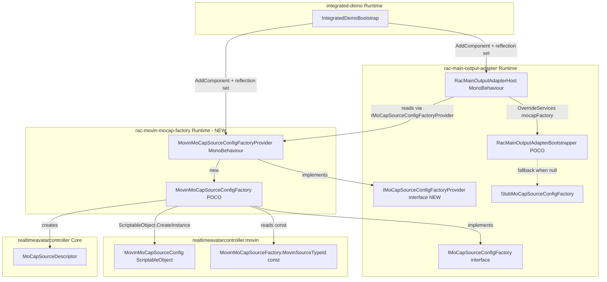
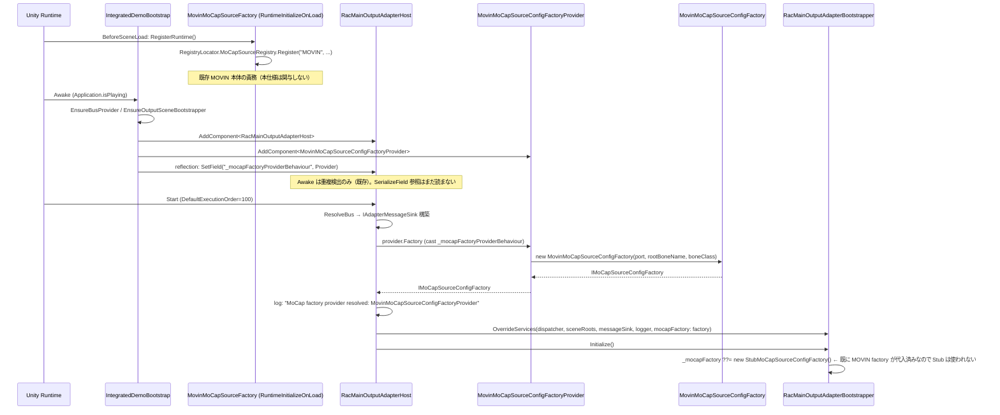

# Design Document

## Overview

本仕様は、`jp.co.unvgi.realtimeavatarcontroller.movin` の MOVIN MoCap ランタイムを、`jp.co.unvgi.vtuber-system-base.rac-main-output-adapter` の Slot ライフサイクルに接続する薄いブリッジパッケージ `com.hidano.vtuber-system-base.rac-movin-mocap-factory` を新規追加する。本パッケージは `IMoCapSourceConfigFactory` の MOVIN 実装と Inspector 編集可能な Provider MonoBehaviour を提供し、`RacMainOutputAdapterHost` 側に追加する DI seam（`IMoCapSourceConfigFactoryProvider`）を介して `bootstrapper.OverrideServices(mocapFactory: ...)` に注入される。

**Purpose**: 本機能は **MOVIN MoCap を Slot に接続するためのコード変更不要の Inspector 配線手段** を **Unity プロジェクト保守者** に提供する。
**Users**: **VTuberSystemBase Integrated Demo シーン利用者** および **MOVIN を本番出力で利用したい利用者プロジェクト** が、`MovinMoCapSourceConfigFactoryProvider` を Host と同一 GameObject に配置することで MOVIN を有効化できる。
**Impact**: 既定 `StubMoCapSourceConfigFactory` フォールバックを破壊することなく、`RacMainOutputAdapterHost` に新 SerializeField (`_mocapFactoryProviderBehaviour`) を追加する後方互換変更を行う。Provider 不在時は従来どおり Stub にフォールバックする。

### Goals
- MOVIN MoCap 用の `MoCapSourceDescriptor` を Slot 単位で生成する純粋な POCO Factory を提供する。
- Inspector 上で port / rootBoneName / boneClass を編集できる Provider MonoBehaviour を提供する。
- `RacMainOutputAdapterHost` に MoCap Factory Provider 用 DI seam を追加し、将来追加される他 MoCap ソースの差替も同 seam で行えるようにする。
- `IntegratedDemoBootstrap` から自動配線し、デモ起動だけで MOVIN を有効化する。

### Non-Goals
- MOVIN ソース自体の通信プロトコル（uOSC）変更や `MovinMoCapSource` の挙動変更。
- `MoCapSourceFactoryRegistry` への MOVIN typeId 登録手順の変更（既存 `MovinMoCapSourceFactory.RegisterRuntime` に委譲）。
- 既定 `StubMoCapSourceConfigFactory` の置換・削除。
- 複数 MOVIN ソース同時起動・ポート競合解決などの高度制御（本仕様は Provider の serialized 値をそのまま伝達するのみ）。
- Editor / Inspector の専用 GUI（カスタム Editor 拡張）の提供。

## Boundary Commitments

### This Spec Owns
- 新規パッケージ `com.hidano.vtuber-system-base.rac-movin-mocap-factory` の `package.json` / asmdef / Runtime / Tests 一式。
- `MovinMoCapSourceConfigFactory : IMoCapSourceConfigFactory`（POCO）の実装と契約。
- `MovinMoCapSourceConfigFactoryProvider : MonoBehaviour, IMoCapSourceConfigFactoryProvider` の実装と Inspector 上の serialized field（port / rootBoneName / boneClass）。
- `RacMainOutputAdapterHost` への DI seam 追加（`_mocapFactoryProviderBehaviour` SerializeField および `Start()` 内の解決ロジック）。
- 既存の `IMoCapSourceConfigFactory` 隣に配置する `IMoCapSourceConfigFactoryProvider` 契約インタフェース（汎用）。
- `IntegratedDemoBootstrap` への自動配線処理（AddComponent + reflection 注入）。
- 上記契約を検証する EditMode テスト（新規パッケージ内）。

### Out of Boundary
- `MovinMoCapSourceFactory` / `MovinMoCapSourceConfig` / `MovinMoCapSource` 等 MOVIN 本体型の改修。
- `RegistryLocator.MoCapSourceRegistry` への MOVIN typeId 登録（MOVIN 本体の `RuntimeInitializeOnLoadMethod` に委譲）。
- `RacMainOutputAdapterBootstrapper.Initialize()` の Stub フォールバック分岐の改変。
- `OutputSceneBootstrapper` / `CoreIpcBusProvider` / `IntegratedDemoConfig` の責務変更。
- PlayMode テスト（uOSC リスナーの実起動を含む統合テストは MOVIN 本体側責務）。

### Allowed Dependencies
- 新規パッケージ Runtime asmdef は次のみを参照する:
  - `VTuberSystemBase.RacMainOutputAdapter.Runtime`（`IMoCapSourceConfigFactory` / `IMoCapSourceConfigFactoryProvider` を解決）
  - `RealtimeAvatarController.Core`（`MoCapSourceDescriptor`）
  - `RealtimeAvatarController.MoCap.Movin`（`MovinMoCapSourceConfig` / `MovinMoCapSourceFactory.MovinSourceTypeId`）
  - UnityEngine 標準アセンブリ
- 新規パッケージ Tests asmdef は上記に加えて NUnit のみ参照する。
- `rac-main-output-adapter` Runtime asmdef は新規パッケージへの参照を **持たない**（依存方向は単方向: rac-movin-mocap-factory → rac-main-output-adapter）。
- `integrated-demo` パッケージは新規パッケージに依存し、reflection で Host のフィールドへ注入する（既存の `_coreIpcBusProviderBehaviour` 注入と同パターン）。

### Revalidation Triggers
以下の変更が発生した場合、依存スペックおよびコンシューマは再検証が必要である:

- `IMoCapSourceConfigFactory.Build` のシグネチャ変更（`MoCapSourceDescriptor` の構造変更を含む）。
- `IMoCapSourceConfigFactoryProvider.Factory` プロパティ契約の変更（戻り型・null 許容・初期化タイミング）。
- `MovinMoCapSourceConfig` の publicフィールド構成変更（port / rootBoneName / boneClass）。
- `MovinMoCapSourceFactory.MovinSourceTypeId` 文字列定数の値変更（"MOVIN"）。
- `RacMainOutputAdapterHost._mocapFactoryProviderBehaviour` フィールド名変更（`IntegratedDemoBootstrap` の reflection が破綻する）。
- `RacMainOutputAdapterBootstrapper.OverrideServices` の `mocapFactory` 引数の存在・順序・既定値変更。

## Architecture

### Existing Architecture Analysis

`rac-main-output-adapter` パッケージは Composition Root として `RacMainOutputAdapterBootstrapper`（POCO）を持ち、`OverrideServices(...)` で各依存（`IMoCapSourceConfigFactory` を含む）を差し替えられる構造を既に持つ。MonoBehaviour ホスト `RacMainOutputAdapterHost` は `Start()` 内で `OverrideServices(dispatcher, sceneRoots, messageSink, logger)` のみを呼び、`mocapFactory` は未指定（= Stub フォールバック）である。本仕様は `RacMainOutputAdapterHost` に Provider seam を追加し、Provider が解決可能なときのみ `OverrideServices(mocapFactory: ...)` を **追加で** 呼び出す形にする。これは既存の `_coreIpcBusProviderBehaviour` Provider パターンと完全に対称な拡張であり、新たな抽象を導入しない。

### Architecture Pattern & Boundary Map



**Architecture Integration**:
- 採用パターン: **Provider MonoBehaviour + POCO Factory + Inspector seam**。既存の `ICoreIpcBusProvider` / `_coreIpcBusProviderBehaviour` と同一パターンを踏襲する。
- ドメイン境界: 新規パッケージは **Config 生成と Inspector 露出のみ** を担当し、`MovinMoCapSource` の生成や uOSC バインドには関与しない（Slot Active 遷移時の RAC 側責務）。
- 既存パターン保持: `OverrideServices` 経由の依存差替、`Application.isPlaying` チェック、reflection による private SerializeField 注入。
- 新規コンポーネント根拠:
  - `MovinMoCapSourceConfigFactory`: MOVIN 固有の Config 生成ロジックを `Stub` と並列に実装するための分離。
  - `MovinMoCapSourceConfigFactoryProvider`: Inspector 編集可能な値を Factory に渡すための薄い MonoBehaviour ラッパ。
  - `IMoCapSourceConfigFactoryProvider`: 将来 VMC など他ソースを差し替え可能にする汎用 seam。
- Steering 準拠: 既存の Provider パターン・`Application.isPlaying` ガード・reflection 注入規約に整合。

### Technology Stack

| Layer | Choice / Version | Role in Feature | Notes |
|-------|------------------|-----------------|-------|
| Runtime | Unity 6000.3 (C# 9 with `IsExternalInit` shim) | Provider MonoBehaviour と POCO Factory のホスト | 既存パッケージと同一 Unity バージョン要件 |
| RAC Core | `jp.co.unvgi.realtimeavatarcontroller@0.2.0-fork.1` | `MoCapSourceDescriptor` / `MoCapSourceConfigBase` の型を提供 | rac-main-output-adapter 経由で間接参照（直接依存はしない） |
| MOVIN | `jp.co.unvgi.realtimeavatarcontroller.movin@0.1.7` | `MovinMoCapSourceConfig` / `MovinMoCapSourceFactory.MovinSourceTypeId` を再利用 | 直接依存（package.json + asmdef 参照） |
| RAC Adapter | `jp.co.unvgi.vtuber-system-base.rac-main-output-adapter@0.1.0` | `IMoCapSourceConfigFactory` / `IMoCapSourceConfigFactoryProvider` を提供 | 直接依存。本仕様で seam を追加 |
| Tests | NUnit (Unity Test Framework) | EditMode テスト実行 | `nunit.framework.dll` precompiledReference + `TestAssemblies` optionalUnityReference |

## File Structure Plan

### Directory Structure

```
VTuberSystemBase/Packages/
├── com.hidano.vtuber-system-base.rac-movin-mocap-factory/        # NEW package
│   ├── package.json                                               # name=jp.co.unvgi.vtuber-system-base.rac-movin-mocap-factory, deps: rac-main-output-adapter@0.1.0 + realtimeavatarcontroller.movin@0.1.7
│   ├── Runtime/
│   │   ├── jp.co.unvgi.vtuber-system-base.rac-movin-mocap-factory.asmdef  # Runtime asmdef referencing RacMainOutputAdapter.Runtime + RealtimeAvatarController.Core + RealtimeAvatarController.MoCap.Movin
│   │   ├── AssemblyInfo.cs                                        # InternalsVisibleTo (Tests.EditMode)
│   │   ├── IsExternalInit.cs                                      # C# 9 init-only shim
│   │   ├── MovinMoCapSourceConfigFactory.cs                       # POCO Factory implementing IMoCapSourceConfigFactory
│   │   └── MovinMoCapSourceConfigFactoryProvider.cs               # MonoBehaviour implementing IMoCapSourceConfigFactoryProvider
│   └── Tests/
│       └── EditMode/
│           ├── jp.co.unvgi.vtuber-system-base.rac-movin-mocap-factory.tests.asmdef  # EditMode asmdef
│           ├── MovinMoCapSourceConfigFactoryTests.cs              # POCO Factory 契約テスト
│           └── MovinMoCapSourceConfigFactoryProviderTests.cs      # Provider 経由の値伝搬テスト
│
├── com.hidano.vtuber-system-base.rac-main-output-adapter/         # MODIFIED
│   ├── package.json                                               # 変更なし
│   └── Runtime/
│       ├── ExtensionPoints/
│       │   └── IMoCapSourceConfigFactoryProvider.cs               # NEW interface（IMoCapSourceConfigFactory と同一名前空間）
│       └── Bootstrapper/
│           └── RacMainOutputAdapterHost.cs                        # MODIFIED: SerializeField + Start() 内 Provider 解決ロジック追加
│
└── com.hidano.vtuber-system-base.integrated-demo/                 # MODIFIED
    ├── package.json                                               # MODIFIED: rac-movin-mocap-factory@0.1.0 を dependencies に追加
    └── Runtime/
        └── IntegratedDemoBootstrap.cs                             # MODIFIED: EnsureMainOutputAdapters() に MOVIN Provider 配線追加
```

### Modified Files
- `VTuberSystemBase/Packages/com.hidano.vtuber-system-base.rac-main-output-adapter/Runtime/Bootstrapper/RacMainOutputAdapterHost.cs` — 新規 SerializeField `_mocapFactoryProviderBehaviour` と Start() 内の Provider 解決・OverrideServices 呼び出しを追加。既存挙動は完全に保持する。
- `VTuberSystemBase/Packages/com.hidano.vtuber-system-base.integrated-demo/Runtime/IntegratedDemoBootstrap.cs` — `EnsureMainOutputAdapters()` に `MovinMoCapSourceConfigFactoryProvider` の AddComponent + reflection 注入を追加。
- `VTuberSystemBase/Packages/com.hidano.vtuber-system-base.integrated-demo/package.json` — `dependencies` に `jp.co.unvgi.vtuber-system-base.rac-movin-mocap-factory: 0.1.0` を追加。

## System Flows

### Flow 1: PlayMode 起動から MOVIN Factory 注入まで



### Flow 2: Slot Active 遷移時の MOVIN Source 構築（既存挙動の確認）

```mermaid
sequenceDiagram
    participant Applier as SlotAssignmentApplier
    participant Factory as MovinMoCapSourceConfigFactory
    participant Slot as SlotManager
    participant Reg as MoCapSourceRegistry
    participant Source as MovinMoCapSource

    Note over Applier: 既存 rac-main-output-adapter の経路。本仕様は Factory 注入までで責務終了
    Applier->>Factory: Build(slotId)
    Factory->>Factory: ScriptableObject.CreateInstance<MovinMoCapSourceConfig>()
    Factory->>Factory: config.port = port; config.rootBoneName = ...; config.boneClass = ...
    Factory-->>Applier: MoCapSourceDescriptor { SourceTypeId="MOVIN", Config=config }
    Applier->>Slot: assign descriptor
    Slot->>Reg: Resolve("MOVIN") → MovinMoCapSourceFactory
    Slot->>Source: factory.Create(config) → MovinMoCapSource
    Slot->>Source: Initialize(config) ← uOSC bind 開始
    Note over Source: 副作用は Slot Active 遷移時のみ発生（本仕様は副作用を起こさない）
```

主要意思決定:
- **Provider 解決は `Start()` 内で 1 回のみ**: `Awake()` では参照しないため Edit モード副作用が発生しない。
- **Factory のキャッシュなし**: Provider の `Factory` getter は呼び出しごとに新インスタンスを返す（serialized 値変更を即時反映）。Slot Active のたびに Build が呼ばれるため、各 Slot は独立した `ScriptableObject` を持つ。
- **Stub フォールバックは Bootstrapper.Initialize 内に温存**: Provider が null または Factory が null のとき、Host は `OverrideServices(mocapFactory: ...)` を **呼ばない**。結果として `_mocapFactory ??= new StubMoCapSourceConfigFactory();` が作動する。

## Requirements Traceability

| Requirement | Summary | Components | Interfaces | Flows |
|-------------|---------|------------|------------|-------|
| 1.1 | パッケージ配置 | `com.hidano.vtuber-system-base.rac-movin-mocap-factory/` ディレクトリ | package.json | — |
| 1.2 | パッケージ名 | package.json | `name = "jp.co.unvgi.vtuber-system-base.rac-movin-mocap-factory"` | — |
| 1.3 | 依存宣言 | package.json | dependencies に `rac-main-output-adapter@0.1.0` + `realtimeavatarcontroller.movin@0.1.7` | — |
| 1.4 | asmdef 構成 | Runtime asmdef + Tests.EditMode asmdef | `RealtimeAvatarController.MoCap.Movin` + `VTuberSystemBase.RacMainOutputAdapter.Runtime` 参照 | — |
| 1.5 | Stub フォールバック保全 | RacMainOutputAdapterHost / Bootstrapper（既存挙動） | OverrideServices 呼出条件分岐 | Flow 1 末尾 |
| 2.1 | IMoCapSourceConfigFactory 実装 | MovinMoCapSourceConfigFactory | IMoCapSourceConfigFactory | Flow 2 |
| 2.2 | SourceTypeId="MOVIN" | MovinMoCapSourceConfigFactory | Build → Descriptor.SourceTypeId | Flow 2 |
| 2.3 | Config = ScriptableObject.CreateInstance | MovinMoCapSourceConfigFactory | Build → Descriptor.Config | Flow 2 |
| 2.4 | port 伝搬 | MovinMoCapSourceConfigFactory | Build 内 config.port 代入 | Flow 2 |
| 2.5 | rootBoneName 伝搬 | MovinMoCapSourceConfigFactory | Build 内 config.rootBoneName 代入 | Flow 2 |
| 2.6 | boneClass 伝搬 | MovinMoCapSourceConfigFactory | Build 内 config.boneClass 代入 | Flow 2 |
| 2.7 | Build ごとに独立インスタンス | MovinMoCapSourceConfigFactory | Build 呼出ごと CreateInstance | Flow 2 |
| 2.8 | name に slotId を含める | MovinMoCapSourceConfigFactory | `config.name = $"MovinMoCapSourceConfig_{slotId}"` | Flow 2 |
| 3.1 | MonoBehaviour + IMoCapSourceConfigFactoryProvider | MovinMoCapSourceConfigFactoryProvider | implements IMoCapSourceConfigFactoryProvider | Flow 1 |
| 3.2 | port serialized field（既定 11235） | MovinMoCapSourceConfigFactoryProvider | `[SerializeField, Range(1,65535)] private int port = 11235;` | — |
| 3.3 | rootBoneName serialized field | MovinMoCapSourceConfigFactoryProvider | `[SerializeField] private string rootBoneName = "";` | — |
| 3.4 | boneClass serialized field | MovinMoCapSourceConfigFactoryProvider | `[SerializeField] private string boneClass = "";` | — |
| 3.5 | Factory プロパティが現値を反映 | MovinMoCapSourceConfigFactoryProvider | `Factory => new MovinMoCapSourceConfigFactory(port, rootBoneName, boneClass)` | Flow 1 |
| 3.6 | Build 経由で値が伝搬 | MovinMoCapSourceConfigFactory + Provider | Provider.Factory.Build → Config | Flow 1 + Flow 2 |
| 3.7 | Host と同一 GameObject 共存 | MovinMoCapSourceConfigFactoryProvider | `[DisallowMultipleComponent]` | — |
| 4.1 | IMoCapSourceConfigFactoryProvider.Factory プロパティ | IMoCapSourceConfigFactoryProvider | `IMoCapSourceConfigFactory Factory { get; }` | — |
| 4.2 | クロスパッケージ参照可能位置 | IMoCapSourceConfigFactoryProvider | `rac-main-output-adapter/Runtime/ExtensionPoints/` 配置 | — |
| 4.3 | Factory が null を返してよい | IMoCapSourceConfigFactoryProvider 契約 + RacMainOutputAdapterHost | Host 側 null チェックでフォールバック | Flow 1 |
| 4.4 | MOVIN 固有 API を露出しない | IMoCapSourceConfigFactoryProvider | 戻り型は `IMoCapSourceConfigFactory` のみ | — |
| 5.1 | Host SerializeField 追加 | RacMainOutputAdapterHost | `[SerializeField] private MonoBehaviour _mocapFactoryProviderBehaviour;` | — |
| 5.2 | Provider 不在時 OverrideServices 呼ばず Stub | RacMainOutputAdapterHost | Start() 内分岐 | Flow 1 末尾 |
| 5.3 | Provider 解決時 Initialize 前に OverrideServices | RacMainOutputAdapterHost | Start() 内ロジック | Flow 1 |
| 5.4 | Factory が null の場合 警告ログ + Stub フォールバック | RacMainOutputAdapterHost | Start() 内分岐 + Debug.LogWarning | Flow 1 |
| 5.5 | 既存挙動の保持 | RacMainOutputAdapterHost | `_coreIpcBusProviderBehaviour` / `_outputSceneBootstrapper` / `OverrideMessageSink` 不変 | — |
| 5.6 | Edit モードで Provider 参照しない | RacMainOutputAdapterHost | `Application.isPlaying` ガード（既存） | — |
| 6.1 | IDB が Provider を AddComponent | IntegratedDemoBootstrap | `EnsureMainOutputAdapters()` 拡張 | Flow 1 |
| 6.2 | reflection で Host フィールドに代入 | IntegratedDemoBootstrap | `BindMocapProviderToRacHostViaReflection` | Flow 1 |
| 6.3 | Host.Start() より前に完了 | IntegratedDemoBootstrap | Awake 内で実施（DefaultExecutionOrder の差） | Flow 1 |
| 6.4 | reflection 失敗時に警告ログ + 継続 | IntegratedDemoBootstrap | try/catch + Debug.LogWarning | — |
| 6.5 | 他配線挙動は不変 | IntegratedDemoBootstrap | EnsureMainOutputAdapters 内既存処理は保持 | — |
| 7.1 | Stub フォールバックの維持 | RacMainOutputAdapterBootstrapper（不変） | `_mocapFactory ??= new StubMoCapSourceConfigFactory();` | Flow 1 末尾 |
| 7.2 | MOVIN typeId 登録は本パッケージで行わない | rac-movin-mocap-factory パッケージ | RegisterRuntime 呼出なし | — |
| 7.3 | Stub 型を変更しない | rac-movin-mocap-factory パッケージ | `StubMoCapSourceConfigFactory` / `StubMoCapSourceConfig` 不変 | — |
| 7.4 | RegistryConflictException を伝播しない | rac-movin-mocap-factory パッケージ | 登録に関与しない | — |
| 8.1 | Edit モードで Factory が副作用を起こさない | MovinMoCapSourceConfigFactoryProvider | Factory getter は POCO 構築のみ | — |
| 8.2 | Build は uOSC bind を行わない | MovinMoCapSourceConfigFactory | Build 内は CreateInstance + 値代入のみ | Flow 2 |
| 8.3 | Awake で Provider を読まない | RacMainOutputAdapterHost | Start() 内のみ参照 | Flow 1 |
| 8.4 | Slot Active 前は副作用なし | MovinMoCapSourceConfigFactory | uOSC は MOVIN 本体側で Slot Active 時に開始 | Flow 2 |
| 9.1 | EditMode テスト: SourceTypeId == "MOVIN" | MovinMoCapSourceConfigFactoryTests | — | — |
| 9.2 | EditMode テスト: Config is MovinMoCapSourceConfig | MovinMoCapSourceConfigFactoryTests | — | — |
| 9.3 | EditMode テスト: Provider serialized 値が伝搬 | MovinMoCapSourceConfigFactoryProviderTests | — | — |
| 9.4 | EditMode テスト: port 既定値 11235 | MovinMoCapSourceConfigFactoryProviderTests | — | — |
| 9.5 | EditMode テスト: Build 2 回で異なるインスタンス | MovinMoCapSourceConfigFactoryTests | — | — |
| 9.6 | optional: OverrideServices 経由の差替確認 | （optional 統合テスト） | — | — |
| 9.7 | 必須テストの全 PASS | EditMode テスト一式 | — | — |

## Components and Interfaces

| Component | Domain/Layer | Intent | Req Coverage | Key Dependencies (P0/P1) | Contracts |
|-----------|--------------|--------|--------------|--------------------------|-----------|
| IMoCapSourceConfigFactoryProvider | rac-main-output-adapter / ExtensionPoints | MoCap Factory を Inspector seam で疎結合に解決する契約 | 4.1, 4.2, 4.3, 4.4 | IMoCapSourceConfigFactory (P0) | Service |
| RacMainOutputAdapterHost (modified) | rac-main-output-adapter / Bootstrapper | Provider を解決して Bootstrapper に注入する MonoBehaviour ホスト | 5.1, 5.2, 5.3, 5.4, 5.5, 5.6, 8.3 | IMoCapSourceConfigFactoryProvider (P0), RacMainOutputAdapterBootstrapper (P0) | Service |
| MovinMoCapSourceConfigFactory | rac-movin-mocap-factory / Runtime | MOVIN 用 MoCapSourceDescriptor を Slot 単位で構築する POCO | 2.1〜2.8, 8.2, 8.4 | MovinMoCapSourceConfig (P0), MovinMoCapSourceFactory.MovinSourceTypeId (P0), MoCapSourceDescriptor (P0) | Service |
| MovinMoCapSourceConfigFactoryProvider | rac-movin-mocap-factory / Runtime | Inspector で port/rootBoneName/boneClass を編集し Factory を提供する MonoBehaviour | 3.1〜3.7, 8.1 | MovinMoCapSourceConfigFactory (P0), IMoCapSourceConfigFactoryProvider (P0) | Service |
| IntegratedDemoBootstrap (modified) | integrated-demo / Runtime | MOVIN Provider を AddComponent し reflection で Host に注入する | 6.1〜6.5 | MovinMoCapSourceConfigFactoryProvider (P0), RacMainOutputAdapterHost (P0) | Service |

### rac-main-output-adapter / ExtensionPoints

#### IMoCapSourceConfigFactoryProvider

| Field | Detail |
|-------|--------|
| Intent | MoCap Factory を Inspector ドラッグまたは reflection で疎結合に解決する契約 |
| Requirements | 4.1, 4.2, 4.3, 4.4 |

**Responsibilities & Constraints**
- 単一プロパティ `Factory` のみを公開する。
- MOVIN 固有 API を含まない（汎用 `IMoCapSourceConfigFactory` のみ露出）。
- `Factory` は未初期化時に `null` を返してよい（Host 側 null 許容契約）。
- 配置場所: `VTuberSystemBase.RacMainOutputAdapter.ExtensionPoints` 名前空間（`IMoCapSourceConfigFactory` と同居）。

**Dependencies**
- Outbound: `IMoCapSourceConfigFactory` — 戻り値型として参照 (P0)。

**Contracts**: Service [x] / API [ ] / Event [ ] / Batch [ ] / State [ ]

##### Service Interface
```csharp
namespace VTuberSystemBase.RacMainOutputAdapter.ExtensionPoints
{
    /// <summary>
    /// IMoCapSourceConfigFactory を MonoBehaviour 経由で疎結合に提供する契約。
    /// 利用者プロジェクトの Factory Provider MonoBehaviour がこれを実装し、Inspector からホストに接続する。
    /// </summary>
    public interface IMoCapSourceConfigFactoryProvider
    {
        /// <summary>
        /// 構成済みの IMoCapSourceConfigFactory。未初期化時は null 可（Host 側で null チェックしフォールバック）。
        /// </summary>
        IMoCapSourceConfigFactory Factory { get; }
    }
}
```

- Preconditions: なし（実装側は副作用ゼロのプロパティ getter として定義する）。
- Postconditions: 戻り値は呼び出しごとに同一インスタンスでも新規インスタンスでも構わない（Host 側はインスタンス同一性に依存しない）。
- Invariants: MOVIN 固有 API を露出しないこと。

**Implementation Notes**
- Integration: `ICoreIpcBusProvider` と同一 Provider パターン。Host 側 SerializeField は `MonoBehaviour` 型で受け、`is IMoCapSourceConfigFactoryProvider` でキャストする。
- Validation: 本契約はインタフェース単独で完結し、追加バリデーションは不要。
- Risks: 利用者プロジェクトが MonoBehaviour 以外（POCO）で実装した場合、SerializeField 経由では受けられない。本仕様の seam は MonoBehaviour Inspector 配線専用と明示する。

### rac-main-output-adapter / Bootstrapper

#### RacMainOutputAdapterHost (modified)

| Field | Detail |
|-------|--------|
| Intent | Provider を解決して Bootstrapper.OverrideServices に MOVIN Factory を注入する MonoBehaviour ホスト |
| Requirements | 5.1, 5.2, 5.3, 5.4, 5.5, 5.6, 8.3 |

**Responsibilities & Constraints**
- 新規 SerializeField `_mocapFactoryProviderBehaviour` を追加（型は `MonoBehaviour`、Tooltip で `IMoCapSourceConfigFactoryProvider` 実装を要求する旨を明示）。
- `Start()` 内、既存 `OverrideServices(dispatcher, sceneRoots, messageSink, logger)` 呼出の **直後 / Initialize() の直前** に MoCap Factory 解決ロジックを追加する。
- Provider 不在 / Factory==null のときは `OverrideServices(mocapFactory: ...)` を呼ばない（Stub フォールバックを温存）。
- 既存の `_coreIpcBusProviderBehaviour` / `_outputSceneBootstrapper` / `OverrideMessageSink` の挙動は完全に不変。
- `Application.isPlaying == false` の Edit モードでは Provider 参照を行わない（既存 `Awake` / `Start` の `Application.isPlaying` ガードに従う）。

**Dependencies**
- Inbound: `IntegratedDemoBootstrap` — reflection で `_mocapFactoryProviderBehaviour` をセットする (P0)。
- Outbound: `IMoCapSourceConfigFactoryProvider` — Provider 解決 (P0)。
- Outbound: `RacMainOutputAdapterBootstrapper.OverrideServices` — `mocapFactory` 引数経由で注入 (P0)。

**Contracts**: Service [x] / API [ ] / Event [ ] / Batch [ ] / State [ ]

##### Modification Detail
追加する SerializeField:
```csharp
[Header("MoCap Factory Provider (optional)")]
[Tooltip("IMoCapSourceConfigFactory を提供する MonoBehaviour（任意）。実装は IMoCapSourceConfigFactoryProvider を継承する。空のとき StubMoCapSourceConfigFactory にフォールバックする。")]
[SerializeField]
private MonoBehaviour _mocapFactoryProviderBehaviour;
```

`Start()` 内、`_bootstrapper.OverrideServices(dispatcher, sceneRoots, messageSink, logger)` の **直後**、`_bootstrapper.Initialize()` の **直前** に以下を追加する:
```csharp
// MoCap Factory Provider 解決（任意）。Provider 不在時は Stub フォールバックに任せる。
if (_mocapFactoryProviderBehaviour is IMoCapSourceConfigFactoryProvider mocapProvider)
{
    var mocapFactory = mocapProvider.Factory;
    if (mocapFactory != null)
    {
        _bootstrapper.OverrideServices(mocapFactory: mocapFactory);
        UnityEngine.Debug.Log(
            $"[RacMainOutputAdapterHost] MoCap factory provider resolved: {_mocapFactoryProviderBehaviour.GetType().Name}");
    }
    else
    {
        UnityEngine.Debug.LogWarning(
            $"[RacMainOutputAdapterHost] MoCap factory provider {_mocapFactoryProviderBehaviour.GetType().Name}.Factory returned null; falling back to StubMoCapSourceConfigFactory.");
    }
}
```

- Preconditions: `_bootstrapper` 生成済み。
- Postconditions: Provider が解決されかつ Factory が非 null のときのみ `_bootstrapper._mocapFactory` が MOVIN Factory に差し替わる。それ以外は Bootstrapper.Initialize 内の `??= new StubMoCapSourceConfigFactory()` フォールバックが作動する。
- Invariants: Provider が `IMoCapSourceConfigFactoryProvider` を実装しない MonoBehaviour であった場合、ログを出さず単に無視する（型不一致は誤配線として検出可能だが、警告ノイズを避ける既存方針）。

**Implementation Notes**
- Integration: 既存の `_coreIpcBusProviderBehaviour` パターンと完全に同形。`_coreIpcBusProviderBehaviour is ICoreIpcBusProvider provider` キャストと同手法を使う。
- Validation: PackageBoundaryTests は asmdef 構成のみを検証しているため、本変更で fail しない。EditMode テストでは Provider あり/なしの両分岐を検証する（rac-movin-mocap-factory 側 Tests で実施）。
- Risks: SerializeField 追加によりシリアライズ済みプレハブ・シーンに新フィールドが出現する。既定値は `null` であり既存挙動に影響しない。

### rac-movin-mocap-factory / Runtime

#### MovinMoCapSourceConfigFactory

| Field | Detail |
|-------|--------|
| Intent | MOVIN 用 MoCapSourceDescriptor を Slot 単位で構築する POCO |
| Requirements | 2.1, 2.2, 2.3, 2.4, 2.5, 2.6, 2.7, 2.8, 8.2, 8.4 |

**Responsibilities & Constraints**
- `IMoCapSourceConfigFactory.Build(string slotId)` を実装。
- コンストラクタで port / rootBoneName / boneClass を不変で受け取る（record 風 POCO）。
- `Build` 内で `ScriptableObject.CreateInstance<MovinMoCapSourceConfig>()` を毎回新規生成し、コンストラクタ値をフィールドに代入する。
- `null` 文字列引数は `string.Empty` に正規化する（`MovinMoCapSourceConfig` の `string` フィールドは null 想定外のため）。
- `MovinMoCapSource` の生成や uOSC bind には関与しない（Slot Active 遷移時に RAC SlotManager 経由で行われる）。

**Dependencies**
- Outbound: `MovinMoCapSourceConfig` (P0) — `ScriptableObject.CreateInstance` で生成。
- Outbound: `MovinMoCapSourceFactory.MovinSourceTypeId` 定数 (P0) — `Descriptor.SourceTypeId` に設定。
- Outbound: `MoCapSourceDescriptor` (P0) — 戻り値型。

**Contracts**: Service [x] / API [ ] / Event [ ] / Batch [ ] / State [ ]

##### Service Interface
```csharp
namespace VTuberSystemBase.RacMovinMoCapFactory
{
    using RealtimeAvatarController.Core;
    using RealtimeAvatarController.MoCap.Movin;
    using UnityEngine;
    using VTuberSystemBase.RacMainOutputAdapter.ExtensionPoints;

    /// <summary>
    /// MOVIN MoCap 用 IMoCapSourceConfigFactory 実装。
    /// Slot ごとに独立した MovinMoCapSourceConfig (ScriptableObject) を生成し、
    /// MoCapSourceDescriptor (SourceTypeId="MOVIN") として返す。
    /// </summary>
    public sealed class MovinMoCapSourceConfigFactory : IMoCapSourceConfigFactory
    {
        private readonly int _port;
        private readonly string _rootBoneName;
        private readonly string _boneClass;

        public MovinMoCapSourceConfigFactory(
            int port = 11235,
            string rootBoneName = "",
            string boneClass = "")
        {
            _port = port;
            _rootBoneName = rootBoneName ?? string.Empty;
            _boneClass = boneClass ?? string.Empty;
        }

        public int Port => _port;
        public string RootBoneName => _rootBoneName;
        public string BoneClass => _boneClass;

        /// <inheritdoc/>
        public MoCapSourceDescriptor Build(string slotId)
        {
            var config = ScriptableObject.CreateInstance<MovinMoCapSourceConfig>();
            config.name = $"MovinMoCapSourceConfig_{slotId}";
            config.port = _port;
            config.rootBoneName = _rootBoneName;
            config.boneClass = _boneClass;
            return new MoCapSourceDescriptor
            {
                SourceTypeId = MovinMoCapSourceFactory.MovinSourceTypeId,
                Config = config,
            };
        }
    }
}
```

- Preconditions: `slotId` は string（null は許容するが、`name` 文字列に直接展開されるため呼び出し側で非 null 推奨）。
- Postconditions:
  - 戻り `MoCapSourceDescriptor.SourceTypeId == "MOVIN"`。
  - 戻り `MoCapSourceDescriptor.Config` は新規 `MovinMoCapSourceConfig` インスタンス（呼び出しごとに参照非同一）。
  - `Config.port == ctor.port`、`Config.rootBoneName == ctor.rootBoneName ?? ""`、`Config.boneClass == ctor.boneClass ?? ""`。
  - `Config.name` は `slotId` を含む。
- Invariants: 副作用は `ScriptableObject.CreateInstance` のみ。uOSC リスナー起動・MovinMoCapSource インスタンス化・Registry 登録はいずれも行わない。

**Implementation Notes**
- Integration: `Stub` の `StubMoCapSourceConfigFactory.Build` と同じパターンに揃え、命名規約 `{TypeName}_{slotId}` を踏襲する。
- Validation: ctor の port 範囲チェックは行わない（範囲は `MovinMoCapSourceConfig` 側 `[Range(1,65535)]` と `MovinMoCapSource.Initialize` の例外で担保。本 Factory は値透過に徹する）。
- Risks: `MovinMoCapSourceConfig.bindAddress` は本仕様で扱わない（informational only との Tooltip があるため）。将来必要になった場合はコンストラクタ引数追加で拡張可能。

#### MovinMoCapSourceConfigFactoryProvider

| Field | Detail |
|-------|--------|
| Intent | Inspector で port/rootBoneName/boneClass を編集し IMoCapSourceConfigFactory を提供する MonoBehaviour |
| Requirements | 3.1, 3.2, 3.3, 3.4, 3.5, 3.6, 3.7, 8.1 |

**Responsibilities & Constraints**
- `MonoBehaviour` を継承し `IMoCapSourceConfigFactoryProvider` を実装する。
- `[DisallowMultipleComponent]` を付与（Host と同一 GameObject に共存する想定）。
- `Awake` / `Start` / `OnEnable` 等のライフサイクルメソッドでは MOVIN ソース実体を生成しない（Factory getter は値の窓口に徹する）。
- `Factory` getter は呼び出しごとに新 `MovinMoCapSourceConfigFactory` を返す（serialized 値変更を即座に反映するため、キャッシュなし）。

**Dependencies**
- Inbound: `RacMainOutputAdapterHost._mocapFactoryProviderBehaviour` 経由で参照される (P0)。
- Inbound: `IntegratedDemoBootstrap` から `AddComponent` される (P0)。
- Outbound: `MovinMoCapSourceConfigFactory` — `Factory` getter 内で生成 (P0)。

**Contracts**: Service [x] / API [ ] / Event [ ] / Batch [ ] / State [ ]

##### Service Interface
```csharp
namespace VTuberSystemBase.RacMovinMoCapFactory
{
    using UnityEngine;
    using VTuberSystemBase.RacMainOutputAdapter.ExtensionPoints;

    /// <summary>
    /// MOVIN MoCap Factory を Inspector で編集して提供する MonoBehaviour Provider。
    /// RacMainOutputAdapterHost._mocapFactoryProviderBehaviour に接続される。
    /// </summary>
    [DisallowMultipleComponent]
    [AddComponentMenu("VTuberSystemBase/RAC MOVIN MoCap Factory Provider")]
    public sealed class MovinMoCapSourceConfigFactoryProvider : MonoBehaviour, IMoCapSourceConfigFactoryProvider
    {
        [Header("MOVIN Source Settings")]
        [Range(1, 65535)]
        [Tooltip("MOVIN OSC リスナーポート。MovinMoCapSourceConfig.port にそのまま伝搬する。")]
        [SerializeField]
        private int port = 11235;

        [Tooltip("ルートボーン名のオーバーライド（空文字 = 自動解決）。MovinMotionApplier に渡される。")]
        [SerializeField]
        private string rootBoneName = "";

        [Tooltip("ボーンクラス指定（空文字 = 既定）。MovinMotionApplier に渡される。")]
        [SerializeField]
        private string boneClass = "";

        /// <inheritdoc/>
        public IMoCapSourceConfigFactory Factory =>
            new MovinMoCapSourceConfigFactory(port, rootBoneName, boneClass);
    }
}
```

- Preconditions: なし（Awake/Start で副作用を起こさない）。
- Postconditions: `Factory` は常に非 null の新規 `MovinMoCapSourceConfigFactory` を返す。
- Invariants: `Application.isPlaying` に関わらず Factory getter は POCO 構築のみで副作用ゼロ（Edit モード安全）。

**Implementation Notes**
- Integration: Inspector からのドラッグ＆ドロップでも、`IntegratedDemoBootstrap` の reflection でも同一フィールドに代入される。
- Validation: Range 属性で Inspector 上の port 範囲を強制。Runtime バリデーションは下流（`MovinMoCapSource.Initialize`）に委譲する。
- Risks: Factory getter が呼び出しごとに新インスタンスを返すため、参照同一性に依存するテスト・コードを書くと壊れる。本リスクは「Risks」節で明示する。

### integrated-demo / Runtime

#### IntegratedDemoBootstrap (modified)

| Field | Detail |
|-------|--------|
| Intent | MOVIN Provider を AddComponent し reflection で RacMainOutputAdapterHost に注入する |
| Requirements | 6.1, 6.2, 6.3, 6.4, 6.5 |

**Responsibilities & Constraints**
- `EnsureMainOutputAdapters()` 内、`_racHost = GetComponent<RacMainOutputAdapterHost>() ?? gameObject.AddComponent<RacMainOutputAdapterHost>();` の **直後** に MOVIN Provider 配線を追加する。
- Provider が既に存在する場合は再利用する（`GetComponent ?? AddComponent` パターン）。
- reflection で `RacMainOutputAdapterHost._mocapFactoryProviderBehaviour` に Provider を代入する（既存 `BindBusProviderToRacHostViaReflection` と同手法）。
- 例外発生時は警告ログを出し、Stub フォールバックを阻害しない。
- 既存の `_coreIpcBusProviderBehaviour` / `_outputSceneBootstrapper` 注入処理は変更しない。

**Dependencies**
- Outbound: `MovinMoCapSourceConfigFactoryProvider` — AddComponent 対象 (P0)。
- Outbound: `RacMainOutputAdapterHost._mocapFactoryProviderBehaviour` — reflection で代入 (P0)。

**Contracts**: Service [x] / API [ ] / Event [ ] / Batch [ ] / State [ ]

##### Modification Detail
`EnsureMainOutputAdapters()` 内、`BindBusProviderToRacHostViaReflection(_racHost);` の **後**、`_stageHost = ...` の **前** に以下を追加する:

```csharp
// MOVIN MoCap Factory Provider を Host と同一 GameObject に配置し、reflection で Host のフィールドへ注入する。
// Provider 不在時は RacMainOutputAdapterHost が StubMoCapSourceConfigFactory にフォールバックする（既存挙動）。
var movinProvider = GetComponent<MovinMoCapSourceConfigFactoryProvider>()
    ?? gameObject.AddComponent<MovinMoCapSourceConfigFactoryProvider>();
BindMocapProviderToRacHostViaReflection(_racHost, movinProvider);
```

新規 private method:
```csharp
private void BindMocapProviderToRacHostViaReflection(
    RacMainOutputAdapterHost host,
    MovinMoCapSourceConfigFactoryProvider provider)
{
    try
    {
        var field = typeof(RacMainOutputAdapterHost).GetField(
            "_mocapFactoryProviderBehaviour",
            System.Reflection.BindingFlags.Instance | System.Reflection.BindingFlags.NonPublic);
        if (field != null && provider != null)
        {
            field.SetValue(host, provider);
        }
        else
        {
            Debug.LogWarning(
                "[IntegratedDemoBootstrap] _mocapFactoryProviderBehaviour field not found on RacMainOutputAdapterHost; "
                + "MOVIN factory injection skipped (StubMoCapSourceConfigFactory will be used).");
        }
    }
    catch (Exception ex)
    {
        Debug.LogWarning(
            $"[IntegratedDemoBootstrap] Reflection bind of MOVIN provider to RacMainOutputAdapterHost failed: {ex.Message}");
    }
}
```

- Preconditions: `_racHost` 生成済み（直前で AddComponent 済）。
- Postconditions: `RacMainOutputAdapterHost._mocapFactoryProviderBehaviour == movinProvider`（reflection 成功時）。
- Invariants: 例外時も既存配線処理を停止させない（try/catch で吸収）。

**Implementation Notes**
- Integration: `BindBusProviderToRacHostViaReflection` と同パターン。`Awake` 内で実行されるため、`RacMainOutputAdapterHost.Start()`（DefaultExecutionOrder=100）より確実に前。
- Validation: reflection 失敗ケース（field 名変更時）は警告ログで検出可能。EditMode テストではフィールド名を NUnit から検証する案を Test Strategy 9.6 に含める。
- Risks: `package.json` への新規 dependency 追加が必要（`jp.co.unvgi.vtuber-system-base.rac-movin-mocap-factory: 0.1.0`）。実装フェーズで漏らさないこと。

## Data Models

本仕様は新規データモデル（DB スキーマ・イベント・API）を導入しない。`MovinMoCapSourceConfig` の構造は MOVIN 本体パッケージの既存型をそのまま再利用する:

| Field | Type | Default | Source |
|-------|------|---------|--------|
| port | int | 11235 | `MovinMoCapSourceConfig.port` (`[Range(1,65535)]`) |
| bindAddress | string | "" | `MovinMoCapSourceConfig.bindAddress`（informational only、本仕様では設定しない） |
| rootBoneName | string | "" | `MovinMoCapSourceConfig.rootBoneName` |
| boneClass | string | "" | `MovinMoCapSourceConfig.boneClass` |

`MoCapSourceDescriptor` の構造（既存）:

| Field | Type | Setting |
|-------|------|---------|
| SourceTypeId | string | `MovinMoCapSourceFactory.MovinSourceTypeId`（"MOVIN"） |
| Config | MoCapSourceConfigBase | `MovinMoCapSourceConfig`（ScriptableObject 派生） |

## Error Handling

### Error Strategy
本仕様は「**フォールバック許容 + 警告ログ**」戦略を採る。Provider 解決失敗・reflection 失敗・Factory==null のいずれも例外を伝播させず、Stub フォールバックに任せる。MOVIN ソース起動失敗は Slot Active 遷移時に RAC 側 `SlotErrorChannel` で扱われるため、本仕様の責務外。

### Error Categories and Responses

| Category | Trigger | Response |
|----------|---------|----------|
| 設定欠落 | `_mocapFactoryProviderBehaviour == null` または非 IMoCapSourceConfigFactoryProvider | `OverrideServices` を呼ばず Stub フォールバック（ログなし、既存挙動と同等） |
| Provider 未初期化 | `provider.Factory == null` | `Debug.LogWarning` 出力 + Stub フォールバック |
| reflection 失敗 | フィールド名変更等 | `Debug.LogWarning` 出力 + 当該 Provider 配線スキップ（他配線は継続） |
| ScriptableObject 生成失敗 | Unity 内部例外 | 例外伝播（呼び出し側 `SlotAssignmentApplier` で SlotError に変換される既存経路） |
| MOVIN typeId 二重登録 | 本仕様の責務外 | MOVIN 本体の `RegisterRuntime` が `RegistryConflictException` を `SlotErrorChannel` に publish する |

### Monitoring
- 成功時: `Debug.Log("[RacMainOutputAdapterHost] MoCap factory provider resolved: <typeName>")`
- 警告: `Debug.LogWarning(...)` を Provider 未初期化時・reflection 失敗時に出力。
- 既存 `RacMainOutputAdapterDiagnostics` には変更を加えない（Provider 解決状態は単発ログで足りる）。

## Testing Strategy

### Unit Tests (EditMode、新規パッケージ Tests/EditMode 配下)

`MovinMoCapSourceConfigFactoryTests`:
1. `Build_ReturnsDescriptorWithMovinSourceTypeId`: `new MovinMoCapSourceConfigFactory().Build("slot-A").SourceTypeId` が `"MOVIN"` (= `MovinMoCapSourceFactory.MovinSourceTypeId`) と一致することを確認 (Req 9.1)。
2. `Build_ReturnsDescriptorWithMovinConfig`: `Build("slot-A").Config is MovinMoCapSourceConfig` を確認 (Req 9.2)。
3. `Build_AppliesPortRootBoneNameBoneClass`: コンストラクタに渡した port/rootBoneName/boneClass が `Config` 上のフィールドに伝搬していることを確認 (Req 2.4-2.6)。
4. `Build_ProducesDistinctConfigInstances`: `Build("slot-A")` を 2 回呼んだ結果の `Config` 参照が同一でないことを確認 (Req 9.5)。
5. `Build_NameContainsSlotId`: `Build("slot-X").Config.name` に `"slot-X"` が含まれることを確認 (Req 2.8)。
6. `Constructor_NormalizesNullStringsToEmpty`: ctor に `null` を渡した場合 `RootBoneName` / `BoneClass` プロパティが `""` を返すことを確認。

`MovinMoCapSourceConfigFactoryProviderTests`:
1. `DefaultPortIsExpectedValue`: 新規 GameObject に `MovinMoCapSourceConfigFactoryProvider` を `AddComponent` した直後の port が 11235 であることを確認（reflection で private field を read） (Req 9.4)。
2. `Factory_PropagatesSerializedValues`: reflection で port=12345, rootBoneName="Hips", boneClass="Humanoid" をセットし、`provider.Factory.Build("slot-A").Config` 上の MovinMoCapSourceConfig がそれら値を持つことを確認 (Req 9.3)。
3. `Factory_ReturnsNonNullInstance`: `Provider.Factory != null` を確認 (Req 4.3 の null 許容契約に対する具体実装は非 null を保証する)。
4. `Factory_ImplementsIMoCapSourceConfigFactoryProvider`: `provider is IMoCapSourceConfigFactoryProvider` を確認 (Req 3.1)。

### Integration Tests (Optional, EditMode、Req 9.6)
`OptionalIntegrationTests` (UNITY_INCLUDE_TESTS guard 下):
1. `Bootstrapper_OverrideServices_AcceptsMovinFactory`: `RacMainOutputAdapterBootstrapper` を生成し `OverrideServices(mocapFactory: new MovinMoCapSourceConfigFactory(), dispatcher: stubDispatcher, messageSink: stubSink)` を呼び `Initialize()` した後、内部 `_mocapFactory` が MOVIN 実装であることを reflection で観測する（または `SlotAssignmentApplier` 経由の `Build` 結果で観測）。

注: PlayMode テストは MOVIN 本体のテスト責務（uOSC リスナー実起動）に重複するため不要。`IntegratedDemoBootstrap` の reflection 配線は手動 PlayMode 検証で確認する。

### Manual Verification (PlayMode、テストではなく手動シナリオ)
- IntegratedDemo シーン起動 → Console に `MoCap factory provider resolved: MovinMoCapSourceConfigFactoryProvider` が出力されることを確認。
- character-selection-tab で MOVIN typeId のスロットを Active に遷移 → `MovinMoCapSource.Initialize` が `port=11235` で uOSC bind することを確認。
- Provider component を削除して再起動 → Console に Provider 解決ログが出ず、Stub にフォールバックすることを確認。

## Risks

| ID | Risk | Likelihood | Impact | Mitigation |
|----|------|------------|--------|------------|
| R-1 | Provider の `Factory` getter が呼び出しごとに新インスタンスを返すため、参照同一性に依存するコードが破綻する | Low | Low | 設計意図（Inspector 値変更を Unity 再起動なしで反映）として明文化。本仕様の seam を利用するコード（`RacMainOutputAdapterHost`）はインスタンス同一性に依存しない。キャッシュ版は将来要件として保留。 |
| R-2 | `RacMainOutputAdapterHost._mocapFactoryProviderBehaviour` のフィールド名変更時に `IntegratedDemoBootstrap` の reflection が壊れる | Medium | Medium | reflection 失敗時に `Debug.LogWarning` を出す（既存 `BindBusProviderToRacHostViaReflection` と同方針）。フィールド名を Revalidation Triggers に明記し、変更時は `IntegratedDemoBootstrap` も同時更新する。 |
| R-3 | 新規 `.meta` ファイルの GUID 衝突（既存パッケージとの一致） | Low | High | `.meta` GUID はランダム 32-hex を `[guid]::NewGuid().ToString('N')` で生成（global CLAUDE.md 規定）。連続パターン・ローテーション系列禁止。実装フェーズで生成し、commit 前に grep で重複チェックする。 |
| R-4 | Headless 本番シーン（`IntegratedDemoBootstrap` 不使用）で MOVIN を有効化したい場合、Provider 配線は手動になる | Low | Low | 設計意図（自動配線は IntegratedDemoBootstrap 専用）。利用者プロジェクトは `MovinMoCapSourceConfigFactoryProvider` を Inspector で Host にドラッグ＆ドロップする。README は本仕様外（実装フェーズで package README を追加するか別仕様で扱う）。 |
| R-5 | `MovinMoCapSourceConfig.bindAddress` を本仕様で扱わないため、将来 bindAddress を有効化したくなった際にコンストラクタ拡張が必要 | Low | Low | 現時点で `bindAddress` は uOSC 1.0.0 で informational only（MovinMoCapSource 内に warning ログあり）。必要時に `MovinMoCapSourceConfigFactory` のコンストラクタを `init`-only プロパティ追加で拡張する（破壊的変更にならない）。 |
| R-6 | 既存シーン・プレハブに `RacMainOutputAdapterHost` がシリアライズされている場合、新 SerializeField (`_mocapFactoryProviderBehaviour`) は `null` で初期化される | Low | Low | 既定値 `null` は既存挙動（Stub フォールバック）と等価。マイグレーション不要。 |
| R-7 | `MovinMoCapSourceFactory.RegisterRuntime` が `BeforeSceneLoad` で例外を投げた場合、本仕様の Build 経路で `MoCapSourceRegistry.Resolve("MOVIN")` が失敗する | Low | Medium | 本仕様の責務外（MOVIN 本体）。失敗時は MOVIN 本体が `RegistryConflictException` を `SlotErrorChannel` に publish する。本仕様は登録に関与せず、責務分離を維持する。 |
| R-8 | EditMode テストで `MovinMoCapSourceConfigFactoryProvider` の private SerializeField を reflection で書き換える方式は、Unity の SerializedObject 経由が望ましい | Low | Low | EditMode テスト内では reflection で十分（Inspector 経由のシリアライゼーションは PlayMode 入退場で発生）。将来 SerializedObject ベースに移行する選択肢は残す。 |
