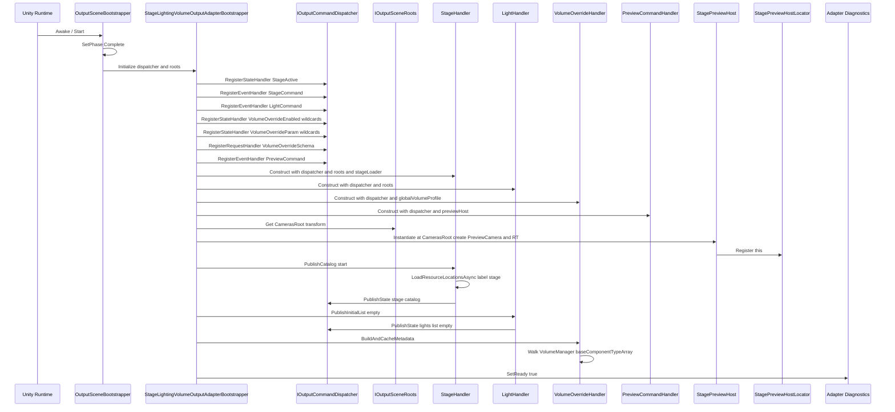
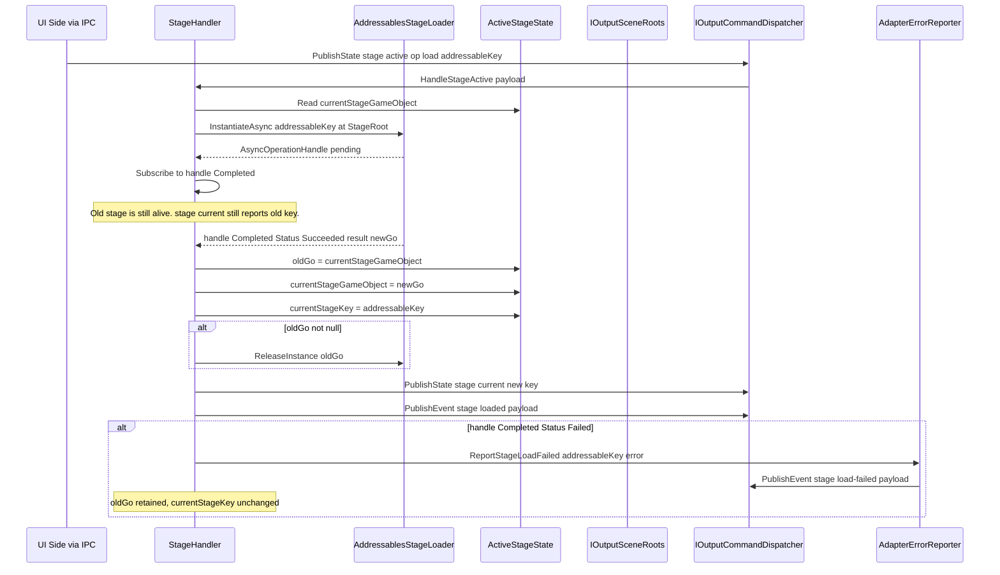
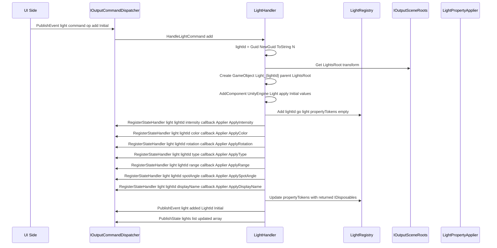
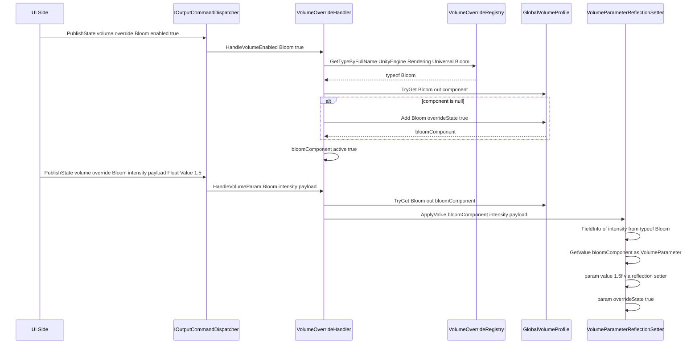
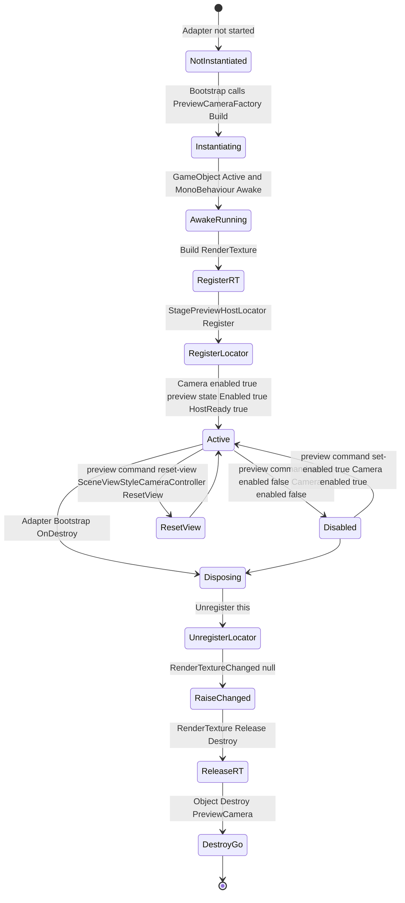

# Technical Design — stage-lighting-volume-output-adapter

## Overview

**Purpose**: 本 spec は、Display 1 上の `stage-lighting-volume-tab` UI が送信する IPC コマンドを `output-renderer-shell` の `IOutputCommandDispatcher` 経由で受信し、メイン出力シーン（Display 2+）の `StageRoot` / `LightsRoot` / `VolumeRoot` / `CamerasRoot` に対して、(1) Addressables 経由のステージ Prefab 切替、(2) Light GameObject の動的生成・編集・破棄と lightId 採番、(3) URP Global VolumeProfile への Override 動的追加・パラメータリフレクション代入、(4) `StagePreviewHost` MonoBehaviour による引きカメラ + RenderTexture 提供と `StagePreviewHostLocator` への登録、を行う **メイン出力側アダプタ** を実装する。

**Users**: 配信オペレーター（タブ UI の操作結果が Display 2+ に反映される最終受益者）、本 spec の実装者、`stage-lighting-volume-tab` の UI 側 ViewModel 実装者（Contracts asmdef 越しに本アダプタの IPC 契約に依存する）。

**Impact**: Wave 3c の中核アダプタの 1 つとして、`output-renderer-shell` の空 `LightsRoot` / `StageRoot` / `VolumeRoot` / `CamerasRoot` に「実体」を投入し、UI 側タブと結節して Display 2+ に画作りの結果を映し出すパスを完成させる。本 spec が無いと、`stage-lighting-volume-tab` を完成させても Display 2 には何も映らない（HANDOVER.md「メイン出力側アダプタ spec 不在」の解消ピース）。

### Goals

- `stage-lighting-volume-tab` の Contracts asmdef（`StageLightingTopics` / `*Dto` / `IPreviewHostService` / `StagePreviewHostLocator`）を **唯一の契約ソース** として参照し、UI 側と本アダプタの両者が同一 DTO・同一 topic 文字列を共有する（SLOA-1）。
- `IOutputCommandDispatcher.RegisterStateHandler<T>` / `RegisterEventHandler<T>` / `RegisterRequestHandler<TReq,TRes>` への登録のみを介してメイン出力シーンを制御し、`output-renderer-shell` 内部実装に直接依存しない。
- ステージ Prefab 切替で `Addressables.ReleaseInstance` を必ず呼ぶ（解放漏れ防止、SLOA-4）。新ステージのロード完了まで旧ステージを保持する lazy swap で配信中の真っ暗状態を回避（SLOA-5）。
- Light GameObject を `LightsRoot/Light_{lightId}` 命名で配置し（SLOA-6）、lightId は `Guid.NewGuid().ToString("N")` でメイン出力側採番（SL-3 継承）。
- URP Volume Override は `VolumeProfile.Add<T>(overrideState: true)` + リフレクションベースの `VolumeParameter<T>.value` 代入で動的適用（SLOA-7, SLOA-14）。
- `StagePreviewHost` を `CamerasRoot` 配下に配置し、`SceneViewStyleCameraController` を取り付け、`IPreviewHostService` 実装で `StagePreviewHostLocator.Register(this)` する（SLOA-9）。プレビュー RT は `RenderTexture.Release+Destroy` で確実に解放（SLOA-13）。
- すべてのハンドラを `try/catch` で囲み、エラー時は `light/error` / `stage/load-failed` event を publish して描画継続（SLOA-12, OR Requirement 5.5 継承）。
- PlayMode 反復 5 回でハンドラリーク・GameObject 残存・Addressables ハンドルリーク・`StagePreviewHostLocator` 残存ゼロを構造的に保証（D-9 継承）。

### Non-Goals

- UI 側 `stage-lighting-volume-tab` の UIDocument / ViewModel / View / プリセット永続化 / UI Toolkit シェル統合（同 spec の責務）。
- IPC トランスポート・シリアライゼーション・接続管理（`core-ipc-foundation` の責務）。
- メイン出力カメラ（配信に載るカメラ）の操作・切替（`camera-switcher-output-adapter` の責務）。
- キャラクター（アバター）の生成・操作・MoCap 適用（`rac-main-output-adapter` の責務）。
- `output-renderer-shell` のシーン骨格・IPC サーバ起動・ディスプレイ振り分け（本 spec はディスパッチャ登録の側）。
- `stage-lighting-volume-tab` の Contracts asmdef そのものの定義（既存）。
- 永続化ファイル I/O（UI 側 `JsonPresetStorage` の責務）。
- Addressables Group 構成・Stage Prefab そのもの・独自 VolumeComponent の追加（利用者プロジェクトの責務）。
- プログラム制御のライティングトランジション（時間変化、タイムライン、SL Requirement の非目標継承）。

## Boundary Commitments

### This Spec Owns

- **`StageLightingVolumeOutputAdapterBootstrapper`**：`OutputSceneBootstrapper` のライフサイクルに乗り、`IOutputCommandDispatcher` への全ハンドラ登録 / 解除、`stage/catalog` 起動 publish、`lights/list` 初期 publish、`StagePreviewHost` の Instantiate / Destroy（Requirement 1, 2）。
- **`StageHandler`**：`stage/active`（state）、`stage/command`（event）、`stage/catalog` publish、Addressables `InstantiateAsync` / `ReleaseInstance` / `LoadResourceLocationsAsync`、ステージ参照保持、lazy swap 順序、`stage/loaded` / `stage/load-failed` event publish、`stage/current` state publish（Requirement 3）。
- **`LightHandler`**：`light/command`（add/remove）event、lightId 採番（`Guid.NewGuid().ToString("N")`）、`Light_{lightId}` GameObject 生成・破棄、`light/added` event publish、`lights/list` state publish、`light/error` event publish、Light プロパティ動的ハンドラ登録／解除（Requirement 4）。
- **`LightPropertyApplier`**：`light/{lightId}/intensity|color|rotation|type|range|spotAngle|displayName` の各 state を該当 `Light` / `Transform` プロパティに反映（Requirement 4.3〜4.9）。
- **`VolumeOverrideHandler`**：`volume/override/{type}/enabled` / `volume/override/{type}/{param}` state、`volume/overrides/metadata` request、`VolumeProfile.Add<T>` / `TryGet<T>`、`volume/command`（reserved）受信（Requirement 5）。
- **`VolumeOverrideMetadataBuilder`**：`VolumeManager.instance.baseComponentTypeArray` 走査、各型の public `FieldInfo` 列挙、`VolumeParameter<T>` 派生型から `ParamKind` 決定、`Range` 抽出、`VolumeOverrideSchemaDto` 構築（Requirement 5.1, 5.2）。
- **`VolumeParameterReflectionSetter`**：`VolumeOverrideParamValueDto.Kind` に応じたリフレクションベースの `VolumeParameter<T>.value` 代入と `overrideState = true` 設定（Requirement 5.4, SLOA-14）。
- **`StagePreviewHost`**：MonoBehaviour、`IPreviewHostService` 実装、`PreviewCamera` GameObject + `Camera` + `UniversalAdditionalCameraData` + `SceneViewStyleCameraController` + `RenderTexture` の生成・破棄、`StagePreviewHostLocator.Register/Unregister`、`RenderTextureChanged` event 発火、`Camera.cullingMask` 同期（Requirement 6）。
- **`PreviewCommandHandler`**：`preview/command` event（set-enabled / reset-view / init / dispose）、`preview/state` state publish（Requirement 6.8〜6.12）。
- **`AdapterErrorReporter`**：エラー event の publish（`light/error`, `stage/load-failed`）、診断ログ出力、`light/error` の `LightErrorDto` 構築、`stage/load-failed` の `StageLoadFailedDto` 構築（Requirement 7）。
- **`StageLightingVolumeOutputAdapterDiagnostics`**：登録済みハンドラ数、現 Stage AddressableKey、Light 数、Volume Override 型数、`StagePreviewHost.IsReady`、最終エラー時刻の外部公開（Requirement 9.5）。
- **`AddressablesStageLoader` / `IInstantiationProvider`**：Addressables 経由のステージ Prefab Instantiate/Release のラッパ + テスト用差し替え抽象（Requirement 3, 10.3）。
- **`link.xml`**：URP `VolumeComponent` / `VolumeParameter<T>` のリフレクション参照保護（IL2CPP strip 抑止、Requirement 5.8）。

### Out of Boundary

- **UI 側 `stage-lighting-volume-tab` の実装一切**（UIDocument、ViewModel、Services、Preview Layer、永続化、Lifecycle Bootstrapper、UI Toolkit シェル統合）。
- **`output-renderer-shell` のシーン骨格構築**（`OutputSceneBootstrapper` / `OutputSceneRoots` / `IDisplayRoutingService` / `IOutputCommandDispatcher` 実装）。本 spec は **利用者** の側。
- **`core-ipc-foundation` のトランスポート・シリアライゼーション・接続管理**。
- **`camera-switcher-output-adapter`** が扱う配信用メイン出力カメラ（`CamerasRoot.DefaultCamera`）への操作。本 spec は `PreviewCamera` のみ操作。
- **`rac-main-output-adapter`** が扱うキャラクター（アバター）GameObject。本 spec の Light の照射対象にはなるが、配置・MoCap 適用には関与しない。
- **Addressables Group の構成・ステージ Prefab そのものの中身**（利用者プロジェクトの責務）。
- **独自 `VolumeComponent` の追加**（利用者プロジェクトの責務、本 spec はメタデータ列挙のみ）。
- **配信ソフト（OBS）への取り込み・Spout 出力経路**（`runtime-display-selector-integration` の Wave 3e 責務）。

### Allowed Dependencies

- **`stage-lighting-volume-tab` の `Contracts` asmdef**：`StageLightingTopics`, `*Dto`, `LightTypeDto`, `Vector3Dto`, `Vector4Dto`, `ColorDto`, `ParamKind`, `IPreviewHostService`, `StagePreviewHostLocator`, `PresetFileRoot`（参照のみ、永続化は UI 側） — **唯一の契約ソース**（SLOA-1）。
- **`output-renderer-shell.Runtime` asmdef**：`IOutputSceneRoots`, `IOutputCommandDispatcher`, `OutputSceneBootstrapper`（ライフサイクル接続）, `IOutputDiagnostics`（読取のみ）, `OutputCommandKind`, `OutputSceneInitPhase`, `DisplayAssignmentInfo`。
- **`core-ipc-foundation.Abstractions` asmdef**：`MessageEnvelope<TPayload>`, `IsExternalInit`（`init` プロパティ用 polyfill）。`ICoreIpcBus` は直接利用せず、`IOutputCommandDispatcher` 経由で利用。
- **Unity 6.3 URP**：`UnityEngine.Rendering.Universal`（`UniversalAdditionalCameraData`, `UniversalRenderPipelineAsset` 参照点）, `UnityEngine.Rendering`（`Volume`, `VolumeProfile`, `VolumeManager`, `VolumeComponent`, `VolumeParameter<T>` 派生型 30+）.
- **Unity Addressables**：`UnityEngine.AddressableAssets.Addressables`（`InstantiateAsync`, `ReleaseInstance`, `LoadResourceLocationsAsync`）, `UnityEngine.ResourceManagement.AsyncOperations.AsyncOperationHandle<T>`.
- **Unity 標準**：`UnityEngine.GameObject`, `UnityEngine.Light`, `UnityEngine.Camera`, `UnityEngine.RenderTexture`, `UnityEngine.Transform`, `UnityEngine.Color`, `UnityEngine.Quaternion`, `UnityEngine.Vector3`, `UnityEngine.MonoBehaviour`, `UnityEngine.Application`.
- **`SceneViewStyleCameraController.Runtime`**（Hidano-Dev、v1.0.1）：`StagePreviewHost` 配下のカメラに取り付ける形で利用。
- **System.Reflection**（.NET Standard 2.1 標準）：`VolumeParameter<T>.value` 代入の汎用化（SLOA-14）。
- **`System.Text.Json`**（`core-ipc-foundation` と同一参照、ただし本 spec は payload シリアライズを `core-ipc-foundation` 経由で扱うため直接は使わない）。

**禁止される依存**：

- `stage-lighting-volume-tab` の **Runtime asmdef**（UI 側 ViewModel/View/Services）への直接依存。
- `core-ipc-foundation.Core`（具体トランスポート実装 asmdef）への直接依存。
- 他タブ spec / 他アダプタ spec（`character-selection-tab`, `camera-switcher-tab`, `rac-main-output-adapter`, `camera-switcher-output-adapter`）の asmdef 参照。
- `ui-toolkit-shell.Runtime` への参照（本 spec は出力側 only）。

### Revalidation Triggers

以下の変更は本 spec の design / tasks の再検証を必須とする：

- **`stage-lighting-volume-tab` の Contracts asmdef 変更**（topic 文字列・DTO スキーマ・`IPreviewHostService` インタフェース）→ 本 spec のハンドラ実装が失効。
- **`output-renderer-shell` の `IOutputCommandDispatcher` / `IOutputSceneRoots` シグネチャ変更**（OR Revalidation Trigger）→ 本 spec の Bootstrapper / Handler 群が失効。
- **URP メジャーアップデートで `VolumeManager.baseComponentTypeArray` / `VolumeParameter<T>` の公開 API 変更** → `VolumeOverrideMetadataBuilder` / `VolumeParameterReflectionSetter` の再実装。
- **Addressables 2.x → 3.x メジャーアップデート**（`InstantiateAsync` / `ReleaseInstance` の API 変更） → `AddressablesStageLoader` の再検証。
- **`SceneViewStyleCameraController` の API 変更**（`ResetView()` 等のメソッド名・シグネチャ） → `StagePreviewHost` の再検証。
- **メイン出力カメラの culling mask 規約変更**（OR Revalidation Trigger） → `StagePreviewHost.cullingMask` 同期処理の再検証。
- **`StagePreviewHostLocator` の Register/Unregister 契約変更** → 本 spec の `StagePreviewHost` ライフサイクル処理の再検証。

## Architecture

### Architecture Pattern & Boundary Map

本 spec は **Handler-per-Topic + Composition Root** パターンを採用する。`StageLightingVolumeOutputAdapterBootstrapper` を Composition Root とし、Stage / Light / Volume / Preview の 4 ドメインそれぞれに専属の Handler クラスを配置、`IOutputCommandDispatcher` への登録は Handler 内で完結する。各 Handler は `IOutputSceneRoots` 経由でシーン参照を取得し、`output-renderer-shell` の内部実装には依存しない。

```mermaid
graph TB
    subgraph MainOutputProcess[Unity Process MainOutput Side]
        subgraph OutputAdapterPackage[stage-lighting-volume-output-adapter Runtime asmdef]
            Bootstrap[StageLightingVolumeOutputAdapterBootstrapper]
            StageH[StageHandler]
            LightH[LightHandler]
            LightPropApplier[LightPropertyApplier]
            VolumeH[VolumeOverrideHandler]
            VolumeMeta[VolumeOverrideMetadataBuilder]
            VolumeReflect[VolumeParameterReflectionSetter]
            PreviewH[PreviewCommandHandler]
            PreviewHost[StagePreviewHost MonoBehaviour]
            StageLoader[AddressablesStageLoader]
            ErrorReporter[AdapterErrorReporter]
            Diagnostics[StageLightingVolumeOutputAdapterDiagnostics]
        end
        subgraph TabContracts[stage-lighting-volume-tab Contracts asmdef]
            Topics[StageLightingTopics]
            Dtos[Light/Stage/Volume/Preview DTOs]
            PreviewLocator[StagePreviewHostLocator]
            PreviewSvcInterface[IPreviewHostService]
        end
        subgraph OutputShell[output-renderer-shell Runtime asmdef]
            Dispatcher[IOutputCommandDispatcher]
            SceneRoots[IOutputSceneRoots]
            OutputBoot[OutputSceneBootstrapper]
            OutputDiag[IOutputDiagnostics]
        end
        subgraph CoreIpcAbs[core-ipc-foundation Abstractions]
            MsgEnv[MessageEnvelope]
            IsExtInit[IsExternalInit]
        end
        subgraph UrpRuntime[Unity URP Runtime]
            VolumeMgr[VolumeManager]
            VolumeProfile[VolumeProfile]
            VolumeComp[VolumeComponent]
            VolumeParam[VolumeParameter T]
        end
        subgraph SceneViewCC[SceneViewStyleCameraController Runtime]
            ScCamCtrl[SceneViewStyleCameraController]
        end
        subgraph AddressablesPkg[Unity Addressables]
            AddrApi[Addressables API]
        end
    end

    subgraph SceneObjects[Output Scene GameObjects]
        StageRoot[StageRoot Transform]
        LightsRoot[LightsRoot Transform]
        CamerasRoot[CamerasRoot Transform]
        VolumeRoot[VolumeRoot Transform]
        DefaultCam[DefaultOutputCamera]
        GlobalProfile[GlobalVolumeProfile]
        StagePrefabInst[Stage Prefab Instance]
        LightInst[Light_lightId GameObjects]
        PreviewCam[PreviewCamera GameObject]
        PreviewRT[Preview RenderTexture]
    end

    OutputBoot --> Bootstrap
    Bootstrap --> StageH
    Bootstrap --> LightH
    Bootstrap --> VolumeH
    Bootstrap --> PreviewH
    Bootstrap --> PreviewHost
    Bootstrap --> Diagnostics
    Bootstrap --> Dispatcher
    Bootstrap --> SceneRoots
    StageH --> Dispatcher
    StageH --> StageLoader
    StageH --> ErrorReporter
    StageLoader --> AddrApi
    StageLoader --> StageRoot
    StageRoot --> StagePrefabInst
    LightH --> Dispatcher
    LightH --> LightPropApplier
    LightH --> ErrorReporter
    LightH --> LightsRoot
    LightsRoot --> LightInst
    LightPropApplier --> LightInst
    VolumeH --> Dispatcher
    VolumeH --> VolumeMeta
    VolumeH --> VolumeReflect
    VolumeH --> ErrorReporter
    VolumeMeta --> VolumeMgr
    VolumeReflect --> VolumeComp
    VolumeReflect --> VolumeParam
    VolumeH --> GlobalProfile
    PreviewH --> Dispatcher
    PreviewH --> PreviewHost
    PreviewHost --> PreviewLocator
    PreviewHost --> PreviewSvcInterface
    PreviewHost --> CamerasRoot
    PreviewHost --> ScCamCtrl
    PreviewHost --> PreviewCam
    PreviewCam --> PreviewRT
    PreviewHost --> DefaultCam
    StageH --> Topics
    StageH --> Dtos
    LightH --> Topics
    LightH --> Dtos
    VolumeH --> Topics
    VolumeH --> Dtos
    PreviewH --> Topics
    PreviewH --> Dtos
    Dispatcher --> MsgEnv
    Bootstrap --> Diagnostics
    Bootstrap --> OutputDiag
```



**Architecture Integration**:

- **Selected pattern**: Handler-per-Topic + Composition Root。Bootstrapper が DI で全ハンドラを構築し、各 Handler は登録解除トークン（`IDisposable`）を保持して破棄時に解除する。Stage / Light / Volume / Preview の 4 ドメインを独立 Handler に分けることで責務分離とテスト容易性を両立。
- **Domain/feature boundaries**:
  - **Stage ドメイン**：`StageHandler` + `AddressablesStageLoader`。Addressables 依存を `IInstantiationProvider` 抽象に閉じ込める。
  - **Light ドメイン**：`LightHandler` + `LightPropertyApplier`。lightId 採番、GameObject 生成・破棄、プロパティ動的ハンドラ登録。
  - **Volume ドメイン**：`VolumeOverrideHandler` + `VolumeOverrideMetadataBuilder` + `VolumeParameterReflectionSetter`。URP リフレクション処理を独立クラスに集約し、テスト時はモック差し替え可能。
  - **Preview ドメイン**：`StagePreviewHost`（MonoBehaviour）+ `PreviewCommandHandler`。MonoBehaviour 側に Camera/RT/SceneViewStyleCameraController の所有権、Handler 側に IPC 処理ロジック。
  - **横断**：`AdapterErrorReporter`（エラー event publish 一本化）, `StageLightingVolumeOutputAdapterDiagnostics`（診断 API）。
- **Existing patterns preserved**:
  - `output-renderer-shell` の `IOutputCommandDispatcher` 登録解除トークン方式（OR-3.3）。
  - `core-ipc-foundation` の D-3 メインスレッド配信、D-7 coalesce / FIFO 契約。
  - `stage-lighting-volume-tab` の Contracts asmdef 唯一参照ソース原則。
  - PlayMode のみ常駐 + ドメインリロード跨ぎなし（D-9 継承）。
- **New components rationale**:
  - `StageLightingVolumeOutputAdapterBootstrapper`：本 spec の Composition Root として全 Handler を生成・登録・解放する単一責務。
  - `IInstantiationProvider`：Addressables 依存を Handler から切り離し、テスト時は `FakeInstantiationProvider` で差し替えるための抽象。
  - `VolumeParameterReflectionSetter`：URP の 30+ 種の `VolumeParameter<T>` 派生型を case 文で個別対応せず、`FieldInfo.SetValue` + `param.value` 直接操作で汎用化。IL2CPP strip 対策に `link.xml` を同梱。
  - `StagePreviewHost` MonoBehaviour：`Camera.targetTexture` の所有と `IPreviewHostService` 実装、`Locator.Register/Unregister` 連動を 1 つの GameObject ライフサイクルに集約。
- **Steering compliance**: `.kiro/steering/` は未整備のため、`CLAUDE.md`（spec-driven workflow） + `docs/requirements.md`（§3.2 UI/出力分離、§5.2 Stage/Lighting/Volume、§6.1 性能、§6.2 配信適合性、§6.4 独立 asmdef） + `docs/integration-plan.md`（Wave 3c 結節点）を遵守する。

### Dependency Direction

```
output adapter Runtime (this spec)
        ↓ references
stage-lighting-volume-tab Contracts (existing, Wave 3a 完了)
        ↓ references
core-ipc-foundation Abstractions (MessageEnvelope, IsExternalInit)
        ↓ references
.NET Standard 2.1 / Unity 6.3 BCL

output adapter Runtime (this spec)
        ↓ references
output-renderer-shell Runtime (IOutputCommandDispatcher, IOutputSceneRoots)
        ↓ references
core-ipc-foundation Abstractions

output adapter Runtime (this spec)
        ↓ references
Unity URP / Addressables / SceneViewStyleCameraController

NOT ALLOWED:
output adapter Runtime ──X──> stage-lighting-volume-tab Runtime (UI side)
output adapter Runtime ──X──> ui-toolkit-shell Runtime
output adapter Runtime ──X──> core-ipc-foundation Core (concrete transport)
```

逆方向 import はレビューでエラー扱い。

### Technology Stack

| Layer | Choice / Version | Role in Feature | Notes |
|-------|------------------|-----------------|-------|
| IPC Dispatcher | `output-renderer-shell.Runtime`（`IOutputCommandDispatcher`） | state/event/request の受け口、登録解除トークン | `core-ipc-foundation.Core` への直接依存を遮断する緩衝層 |
| Scene Locator | `output-renderer-shell.Runtime`（`IOutputSceneRoots`） | `StageRoot` / `LightsRoot` / `CamerasRoot` / `VolumeRoot` / `GlobalVolumeProfile` / `DefaultCamera` 取得 | OR Requirement 1.7 |
| Contracts | `stage-lighting-volume-tab.Contracts`（既存） | topic 定数、DTO、`IPreviewHostService`、`StagePreviewHostLocator` | Wave 3a で実装完了 |
| URP Volume | `UnityEngine.Rendering`（VolumeManager, VolumeProfile, VolumeComponent, VolumeParameter）, `UnityEngine.Rendering.Universal`（参照点） | Override 動的追加、リフレクションパラメータ設定 | Unity 6.3 URP 標準 |
| Addressables | `com.unity.addressables` 2.x | ステージ Prefab Instantiate / Release / カタログ列挙 | `LoadResourceLocationsAsync(label: "stage")` で起動時カタログ構築 |
| Camera Control | `com.hidano.scene-view-style-camera-controller` 1.0.1 | プレビューカメラのマウス回転・パン・ズーム | `StagePreviewHost` 配下で利用 |
| Reflection | `System.Reflection`（.NET Standard 2.1） | `VolumeParameter<T>.value` 汎用代入 | IL2CPP strip 抑止のため `link.xml` 同梱 |
| Logging | `UnityEngine.Debug`（`output-renderer-shell` の `OutputShellLogger` 経由は任意） | 診断ログ | Unity Console 出力のみ、メイン出力サーフェス非描画 |
| Test Infrastructure | NUnit + UnityTestTools + Fake `IOutputCommandDispatcher` + Fake `IInstantiationProvider` | EditMode + PlayMode テスト | 実 URP Volume API は PlayMode 限定 |

> 詳細な研究（URP `VolumeManager.baseComponentTypeArray` 走査、`VolumeParameter<T>` 派生 30+ 種の網羅、`Addressables.InstantiateAsync` ハンドルライフサイクル、`SceneViewStyleCameraController` API）は実装フェーズの `research.md` で確定する。

## File Structure Plan

### Directory Structure

```
Packages/jp.hidano.vtuber-system-base.stage-lighting-volume-output-adapter/
├── package.json
├── README.md
├── link.xml                                       # IL2CPP strip 抑止（UnityEngine.Rendering namespace 保護）
├── Runtime/
│   ├── VTuberSystemBase.StageLightingVolumeOutputAdapter.Runtime.asmdef
│   ├── Bootstrap/
│   │   ├── StageLightingVolumeOutputAdapterBootstrapper.cs   # Composition Root, OutputSceneBootstrapper 連動
│   │   └── AdapterStartupRegistration.cs                     # OutputSceneInitPhase=Complete 後に呼ぶ起動ロジック
│   ├── Stage/
│   │   ├── StageHandler.cs                                   # stage/active, stage/command, stage/catalog publish
│   │   ├── IInstantiationProvider.cs                         # Addressables 抽象（テスト差替）
│   │   ├── AddressablesInstantiationProvider.cs              # Addressables.InstantiateAsync 実装
│   │   ├── StageCatalogBuilder.cs                            # LoadResourceLocationsAsync(label: "stage") → StageCatalogDto
│   │   └── ActiveStageState.cs                               # 現 Stage GameObject + AddressableKey 保持
│   ├── Lights/
│   │   ├── LightHandler.cs                                   # light/command (add/remove), light/added publish, lights/list publish
│   │   ├── LightPropertyApplier.cs                           # light/{lightId}/{property} 各 state ハンドラ
│   │   ├── LightRegistry.cs                                  # lightId → (GameObject, Light, IDisposable[] propertyHandlers) の辞書
│   │   └── LightTypeMapper.cs                                # LightTypeDto ↔ LightType 変換
│   ├── Volume/
│   │   ├── VolumeOverrideHandler.cs                          # volume/override/{type}/{param}, /enabled, /metadata request
│   │   ├── VolumeOverrideMetadataBuilder.cs                  # VolumeManager 走査 → VolumeOverrideSchemaDto
│   │   ├── VolumeParameterReflectionSetter.cs                # VolumeOverrideParamValueDto → VolumeParameter<T>.value 代入
│   │   ├── VolumeParameterKindResolver.cs                    # VolumeParameter<T> 派生型 → ParamKind 判定
│   │   └── VolumeOverrideRegistry.cs                         # typeFullName → Type マッピングキャッシュ
│   ├── Preview/
│   │   ├── StagePreviewHost.cs                               # MonoBehaviour, IPreviewHostService 実装
│   │   ├── PreviewCommandHandler.cs                          # preview/command event, preview/state publish
│   │   ├── PreviewCameraFactory.cs                           # PreviewCamera GameObject + Camera + UniversalAdditionalCameraData + SceneViewStyleCameraController 構築
│   │   └── PreviewRenderTextureFactory.cs                    # 1280x720 ARGB32 RT 生成
│   ├── Diagnostics/
│   │   ├── StageLightingVolumeOutputAdapterDiagnostics.cs    # 診断 API（snapshot 公開）
│   │   ├── AdapterErrorReporter.cs                           # light/error, stage/load-failed publish
│   │   └── AdapterLogger.cs                                  # ログレベル切替対応のログ薄ラッパ（Debug.Log* 経由）
│   └── Internal/
│       ├── DtoConverters.cs                                  # ColorDto↔Color, Vector3Dto↔Vector3/Quaternion 等
│       └── HandlerRegistrationToken.cs                       # 複数 IDisposable をまとめて Dispose する composite token
├── Tests/
│   ├── Editor/
│   │   ├── VTuberSystemBase.StageLightingVolumeOutputAdapter.Tests.Editor.asmdef
│   │   ├── FakeOutputCommandDispatcher.cs                    # IOutputCommandDispatcher モック（state/event/request inject 可能）
│   │   ├── FakeOutputSceneRoots.cs                           # IOutputSceneRoots モック
│   │   ├── FakeInstantiationProvider.cs                      # Addressables 抽象モック
│   │   ├── StageHandlerTests.cs                              # lazy swap 順序、エラー event、catalog publish
│   │   ├── LightHandlerTests.cs                              # lightId 採番、add/remove、エラー event
│   │   ├── LightPropertyApplierTests.cs                      # 各プロパティ反映
│   │   ├── VolumeOverrideMetadataBuilderTests.cs             # VolumeManager 走査結果（Bloom/Tonemapping/ColorAdjustments 検証）
│   │   ├── VolumeParameterReflectionSetterTests.cs           # 代表 VolumeParameter<T> 型でのラウンドトリップ
│   │   ├── VolumeOverrideHandlerTests.cs                     # Add<T>/TryGet<T>、ハンドラ登録解除
│   │   ├── PreviewCommandHandlerTests.cs                     # set-enabled, reset-view, preview/state publish
│   │   ├── AdapterErrorReporterTests.cs                      # エラー event payload 構築
│   │   └── HandlerRegistrationTokenTests.cs                  # composite Dispose 検証
│   └── PlayMode/
│       ├── VTuberSystemBase.StageLightingVolumeOutputAdapter.Tests.PlayMode.asmdef
│       ├── BootstrapPlayModeTests.cs                         # OutputSceneBootstrapper 連動 + PlayMode 反復 5 回テスト
│       ├── StageHandlerPlayModeTests.cs                      # 実 Addressables 経由のロード/アンロード（Sample Stage 使用）
│       ├── VolumeOverrideHandlerPlayModeTests.cs             # 実 URP VolumeProfile への Add<T>/TryGet<T> + パラメータ反映
│       ├── StagePreviewHostPlayModeTests.cs                  # PreviewCamera + RT + Locator Register/Unregister
│       └── StageLightingVolumeOutputAdapterPlayModeSample.unity  # 手動検証シーン（モック IPC + 全機能）
└── Samples~/
    └── IntegratedDemo/
        ├── README.md                                         # 利用者プロジェクトでのセットアップ手順
        └── SampleAddressablesGroup.md                        # 「stage」ラベル付き Addressables Group の構成例
```

### Modified Files

なし（本 spec は新規 UPM パッケージ追加）。ただし利用者プロジェクトの `manifest.json` に依存追加が必要となる旨は README に明記。

## System Flows

### Flow 1: Bootstrap 起動シーケンス

`OutputSceneBootstrapper` の Init 完了直後、本アダプタの Bootstrapper が登録を開始する。



**Key decisions**:

- 登録順序は **Dispatcher 登録 → Handler 構築 → PreviewHost Instantiate → Locator Register → publish 開始**。Locator Register が遅れると UI 側が `StagePreviewHostLocator.Current == null` を最初に観測してしまうため、PreviewHost の Awake が完了するまで `stage/catalog` の publish を待つ厳密な順序は不要だが、PreviewHost の Awake は Bootstrap が同期的に Instantiate した直後に走る前提（Unity の MonoBehaviour ライフサイクル）。
- `volume/overrides/metadata` request handler は登録だけしておき、メタデータの実構築は遅延（最初の request 受信時に lazy build）でも可だが、本 spec では起動時 1 度走査して即返却できる状態にする（SLOA-8）。利用者プロジェクトが独自 VolumeComponent を Addressables 経由で動的ロードする極端なケースは未対応。
- `PreviewHost` の Instantiate は `CamerasRoot` 配下に行う。`DefaultCamera` の隣に置かれ、culling mask を同期する（Requirement 6.4）。

### Flow 2: ステージ切替（lazy swap）



**Key decisions**:

- 旧ステージの `ReleaseInstance` は新ステージの Instantiate 成功確認後に行う（lazy swap、SLOA-5）。失敗時は旧ステージを保持し続け、UI 側は `stage/load-failed` を受けて UI 縮退。
- 同時に複数の `stage/active` 要求が積まれた場合は `core-ipc-foundation` の coalesce が効いて最後の値のみ届く（state は last-write-wins）。FIFO 直列化は本アダプタ内では追加実装しない（上流契約継承）。
- `op="unload"` 受信時は新規ロード無しで `oldGo` を即 ReleaseInstance、`currentStageKey = null` に設定、`stage/current` を `AddressableKey=null` で publish。
- AsyncOperationHandle の購読解除（`handle.Completed -= ...`）は完了後に行い、ハンドラリーク防止。

### Flow 3: Light 追加と動的プロパティハンドラ登録



**Key decisions**:

- lightId はメイン出力側で `Guid.NewGuid().ToString("N")`（32 桁 hex）で採番（SL-3 継承、SLOA-6）。
- プロパティハンドラは lightId 採番 **後** に動的登録する。`light/{lightId}/{property}` の topic 文字列は `StageLightingTopics.LightProperty(lightId, property)` で構築。
- `light/added` event を先に publish して UI 側が新 lightId を取得できるようにし、続けて `lights/list` state を publish（FIFO 順序、event 先行）。
- Remove 時は逆順：lightsList から除去 → property handler tokens 全 Dispose → GameObject Destroy → `lights/list` publish → `light/added` event は publish しない（削除確認は state で十分）。

### Flow 4: Volume Override 動的適用（Add<T> + リフレクション）



**Key decisions**:

- `VolumeProfile.Add<T>(overrideState: true)` は内部で `VolumeComponent` 派生インスタンスを `ScriptableObject.CreateInstance<T>()` で作成し、`Profile.components` に追加する。`overrideState: true` を指定すると追加直後から URP に反映される。
- リフレクションパラメータセッタ（`VolumeParameterReflectionSetter`）は以下の手順：
  1. `typeof(VolumeComponent派生型).GetField(paramName, BindingFlags.Public | BindingFlags.Instance)` でフィールド取得。
  2. `fieldInfo.GetValue(component)` で `VolumeParameter<T>` 派生インスタンス取得。
  3. `VolumeParameter<T>` の `value` プロパティ（または public field）を `payload.Kind` に応じた型変換後に代入。
  4. `param.overrideState = true` を設定（`VolumeParameter` の親クラス public フィールド）。
- 利用者プロジェクトが独自 `VolumeComponent` を追加した場合も `VolumeManager.baseComponentTypeArray` に自動登録されるため（`[VolumeComponentMenu]` 経由）、`Registry` の起動時走査で拾える（SLOA-8）。
- IL2CPP strip 対策：`link.xml` で `UnityEngine.Rendering` namespace の全型を `preserve="all"` で保護する。利用者プロジェクト独自 VolumeComponent の strip は利用者側 `link.xml` で対応するよう README に明記。

### Flow 5: プレビューカメラのライフサイクルと Locator 連動



**Key decisions**:

- `StagePreviewHost.Awake` で RT 生成 → Locator Register の順。Awake 完了時点で `IPreviewHostService.IsReady = true` となり、UI 側が Locator 経由で RT 取得可能。
- `OnDestroy` で Locator Unregister → `RenderTextureChanged(null)` 発火 → RT Release+Destroy → GameObject 破棄の順。`RenderTextureChanged(null)` を先に発火することで UI 側が破棄済み RT への参照を解放できる（SLOA-13）。
- Camera enabled 切替は `preview/command` event 経由で UI 側から制御される（タブ非アクティブ化時の GPU 負荷削減、Requirement 6.9）。`Camera.enabled = false` でも RT は保持し、再開時に即時再描画。
- `SceneViewStyleCameraController` の `ResetView()` メソッド名は実装フェーズで現物確認、適合しない場合は Transform 直接操作（記録した初期 position/rotation に戻す）にフォールバック。

## Requirements Traceability

| Requirement | Summary | Components | Interfaces / Contracts | Flows |
|-------------|---------|------------|------------------------|-------|
| 1.1 | UPM パッケージ配置 | package.json, asmdef | — | — |
| 1.2 | Runtime asmdef 参照限定 | VTuberSystemBase.StageLightingVolumeOutputAdapter.Runtime.asmdef | — | — |
| 1.3 | UI 側 Runtime 非参照 | asmdef references | — | — |
| 1.4 | Contracts 共有源 | Contracts asmdef 参照 | StageLightingTopics, *Dto | — |
| 1.5 | Unity 6.3 / 依存宣言 | package.json | — | — |
| 1.6 | .meta GUID ランダム | 各 .meta | — | — |
| 1.7 | Tests asmdef 隔離 | Tests/Editor, Tests/PlayMode | — | — |
| 2.1 | Bootstrap ライフサイクル | StageLightingVolumeOutputAdapterBootstrapper | — | Flow 1 |
| 2.2 | 全ハンドラ登録 | StageHandler, LightHandler, VolumeOverrideHandler, PreviewCommandHandler | IOutputCommandDispatcher | Flow 1 |
| 2.3 | 登録解除トークン管理 | HandlerRegistrationToken | IDisposable | Flow 1 |
| 2.4 | StagePreviewHostLocator Unregister + null 通知 | StagePreviewHost.OnDestroy | IPreviewHostService.RenderTextureChanged | Flow 5 |
| 2.5 | PlayMode 5 回反復クリーン | Bootstrap, Handlers OnDestroy | — | Flow 5 |
| 2.6 | Edit モード非常駐 | Bootstrap (Application.isPlaying ガード) | — | — |
| 2.7 | ドメインリロード跨ぎなし | Bootstrap | — | — |
| 2.8 | 解決失敗時の縮退 | Bootstrap (null チェック + 早期 return) | AdapterLogger | — |
| 2.9 | 起動時 stage/catalog publish | StageHandler.PublishCatalog | StageCatalogDto | Flow 1 |
| 3.1 | stage/catalog 構築 | StageCatalogBuilder | StageCatalogDto, Addressables.LoadResourceLocationsAsync | Flow 1 |
| 3.2 | lazy swap 順序 | StageHandler, AddressablesStageLoader, ActiveStageState | StageCommandDto, AsyncOperationHandle | Flow 2 |
| 3.3 | unload 処理 | StageHandler.HandleUnload | StageCommandDto, ReleaseInstance | Flow 2 |
| 3.4 | load 失敗時 stage/load-failed | AdapterErrorReporter | StageLoadFailedDto | Flow 2 |
| 3.5 | 同時要求の直列化 | StageHandler (上流 coalesce 継承) | — | Flow 2 |
| 3.6 | StageRoot 直下配置 | AddressablesStageLoader | InstantiateAsync parent param | Flow 2 |
| 3.7 | PlayMode 終了時 ReleaseInstance | Bootstrap.OnDestroy → StageHandler.Dispose | — | — |
| 3.8 | stage ラベル不在時の縮退 | StageCatalogBuilder (空配列 + 警告ログ) | AdapterLogger | Flow 1 |
| 3.9 | Addressables 例外捕捉 | StageHandler (try/catch) | AdapterErrorReporter | Flow 2 |
| 3.10 | stage/active と stage/command 両受け | StageHandler (両 topic 登録) | IOutputCommandDispatcher | Flow 1 |
| 4.1 | Light add 処理 | LightHandler.HandleAdd | LightCommandDto, LightAddedDto, LightInitialDto | Flow 3 |
| 4.2 | Light remove 処理 | LightHandler.HandleRemove | LightCommandDto | — |
| 4.3〜4.9 | Light プロパティ反映 | LightPropertyApplier | light/{lightId}/{property} state | — |
| 4.10 | 未知 lightId state 破棄 | LightPropertyApplier (LightRegistry 検索) | AdapterLogger | — |
| 4.11 | Light add 失敗時 light/error | AdapterErrorReporter | LightErrorDto | — |
| 4.12 | PlayMode 終了時 Light 破棄 | LightHandler.Dispose | — | — |
| 4.13 | 起動時 lights/list 空 publish | LightHandler.PublishInitialList | LightListDto | Flow 1 |
| 5.1 | volume/overrides/metadata 応答 | VolumeOverrideHandler.HandleSchemaRequest, VolumeOverrideMetadataBuilder | VolumeOverrideSchemaDto | Flow 1 |
| 5.2 | 起動時メタデータ走査 + キャッシュ | VolumeOverrideMetadataBuilder, VolumeOverrideRegistry | VolumeManager.baseComponentTypeArray | Flow 1 |
| 5.3 | enabled 反映（Add or TryGet） | VolumeOverrideHandler.HandleEnabled | VolumeProfile.Add<T>, TryGet<T> | Flow 4 |
| 5.4 | param 反映（リフレクション） | VolumeParameterReflectionSetter | VolumeOverrideParamValueDto, FieldInfo | Flow 4 |
| 5.5 | 未知 typeFullName 破棄 | VolumeOverrideHandler (Registry lookup miss) | AdapterLogger | — |
| 5.6 | 未知 paramName 破棄 | VolumeParameterReflectionSetter (FieldInfo null) | AdapterLogger | — |
| 5.7 | Kind 不整合破棄 | VolumeParameterReflectionSetter | AdapterLogger | — |
| 5.8 | link.xml 提供 | link.xml | — | — |
| 5.9 | volume 例外捕捉 | VolumeOverrideHandler (try/catch) | AdapterLogger | — |
| 5.10 | PlayMode 終了時 components クリア | VolumeOverrideHandler.Dispose | VolumeProfile.components.Clear | — |
| 6.1 | StagePreviewHost MonoBehaviour | StagePreviewHost.cs | IPreviewHostService | Flow 5 |
| 6.2 | PreviewCamera 構築 | PreviewCameraFactory | Camera, UniversalAdditionalCameraData, SceneViewStyleCameraController | Flow 5 |
| 6.3 | targetTexture 設定 | PreviewRenderTextureFactory, PreviewCameraFactory | RenderTexture | Flow 5 |
| 6.4 | cullingMask 同期 | PreviewCameraFactory | IOutputSceneRoots.DefaultCamera | Flow 5 |
| 6.5 | Locator Register/Unregister | StagePreviewHost (Awake, OnDestroy) | StagePreviewHostLocator | Flow 5 |
| 6.6 | IPreviewHostService 実装 | StagePreviewHost | IPreviewHostService | Flow 5 |
| 6.7 | RenderTextureChanged 発火条件 | StagePreviewHost.OnRtRebuilt | IPreviewHostService | Flow 5 |
| 6.8〜6.11 | preview/command 各 op 処理 | PreviewCommandHandler | PreviewCommandDto | Flow 5 |
| 6.12 | preview/state publish | PreviewCommandHandler, StagePreviewHost (RT 変化時) | PreviewStateDto | Flow 5 |
| 6.13 | Locator 重複登録警告 | StagePreviewHostLocator (既存挙動) | — | — |
| 6.14 | PlayMode 終了時 Unregister + RT 破棄 | StagePreviewHost.OnDestroy | — | Flow 5 |
| 6.15 | URP RenderType.Base | PreviewCameraFactory | UniversalAdditionalCameraData.renderType | — |
| 7.1 | 全ハンドラ try/catch | 各 Handler | AdapterLogger | — |
| 7.2 | stage/load-failed publish | AdapterErrorReporter | StageLoadFailedDto | Flow 2 |
| 7.3 | light/error (internal_error) | AdapterErrorReporter | LightErrorDto | — |
| 7.4 | light/error (not_found) | AdapterErrorReporter | LightErrorDto | — |
| 7.5 | metadata 部分失敗 | VolumeOverrideMetadataBuilder (try/catch per type) | AdapterLogger | — |
| 7.6 | RT 生成失敗時の縮退 | StagePreviewHost.Awake (try/catch) | PreviewStateDto.HostReady=false | Flow 5 |
| 7.7 | エラー event publish 経路 | AdapterErrorReporter (IOutputCommandDispatcher 経由ではなく core-ipc サーバ送信 API) | — | — |
| 7.8 | メイン出力非描画 | 全コンポーネント (Debug.Log のみ) | — | — |
| 7.9 | 構造化診断ログ | AdapterLogger | topic, lightId, typeFullName, paramName, exception | — |
| 8.1 | Standalone 自動初期化 | Bootstrap (Application.isPlaying) | — | Flow 1 |
| 8.2 | Editor PlayMode 自動初期化 | Bootstrap | — | Flow 1 |
| 8.3 | PlayMode 終了時クリーンアップ | Bootstrap.OnDestroy | — | — |
| 8.4 | 5 回反復ゼロリーク | PlayMode テスト | — | — |
| 8.5 | Edit モード非常駐 | Bootstrap (Application.isPlaying ガード) | — | — |
| 8.6 | ドメインリロード跨ぎなし | Bootstrap (静的状態保持なし) | — | — |
| 8.7 | Editor / Standalone 同一実装 | Bootstrap (条件分岐なし) | — | — |
| 9.1 | 各段階のログ | 全コンポーネント | AdapterLogger | — |
| 9.2 | 構造化コンテキスト | AdapterLogger | — | — |
| 9.3 | Unity Console 限定 | AdapterLogger (Debug.Log* のみ) | — | — |
| 9.4 | ログレベル切替 | AdapterLogger.MinLevel | AdapterLoggerConfig | — |
| 9.5 | 診断 API 公開 | StageLightingVolumeOutputAdapterDiagnostics | snapshot 構造体 | — |
| 9.6 | 独立診断 API | StageLightingVolumeOutputAdapterDiagnostics (IOutputDiagnostics 非拡張) | — | — |
| 10.1 | Fake Dispatcher 経由 EditMode | FakeOutputCommandDispatcher | — | — |
| 10.2 | URP Volume API PlayMode | VolumeOverrideHandlerPlayModeTests | — | — |
| 10.3 | IInstantiationProvider モック | FakeInstantiationProvider | — | — |
| 10.4 | Light EditMode テスト | LightHandlerTests | — | — |
| 10.5 | StagePreviewHost PlayMode テスト | StagePreviewHostPlayModeTests | — | Flow 5 |
| 10.6 | PlayMode サンプルシーン | StageLightingVolumeOutputAdapterPlayModeSample.unity | — | — |
| 10.7 | リーク検証テスト | BootstrapPlayModeTests | — | — |
| 10.8 | link.xml 検証手順 | README, Samples~/IntegratedDemo | — | — |

## Components and Interfaces

**Summary Table**:

| Component | Domain/Layer | Intent | Req Coverage | Key Dependencies (P0/P1) | Contracts |
|-----------|--------------|--------|--------------|--------------------------|-----------|
| StageLightingVolumeOutputAdapterBootstrapper | Bootstrap | Composition Root, OutputSceneBootstrapper 連動、全 Handler 構築・登録・解放 | 1.*, 2.*, 8.* | IOutputCommandDispatcher (P0), IOutputSceneRoots (P0), OutputSceneBootstrapper (P0) | Service |
| StageHandler | Stage | stage/active, stage/command, stage/catalog publish, lazy swap | 3.* | IOutputCommandDispatcher (P0), IOutputSceneRoots (P0), IInstantiationProvider (P0), AdapterErrorReporter (P0) | Service, Event |
| AddressablesInstantiationProvider | Stage | Addressables.InstantiateAsync / ReleaseInstance ラッパ | 3.2, 3.3, 3.6, 3.7 | UnityEngine.AddressableAssets.Addressables (P0) | Service |
| StageCatalogBuilder | Stage | LoadResourceLocationsAsync(label: "stage") → StageCatalogDto | 3.1, 3.8 | Addressables (P0) | Service |
| ActiveStageState | Stage | 現 Stage GameObject + AddressableKey 保持 | 3.2, 3.3 | — | State |
| LightHandler | Light | light/command (add/remove), light/added, lights/list publish, lightId 採番 | 4.1, 4.2, 4.11, 4.12, 4.13 | IOutputCommandDispatcher (P0), IOutputSceneRoots (P0), LightRegistry (P0), AdapterErrorReporter (P0) | Service, Event |
| LightPropertyApplier | Light | light/{lightId}/{property} 各 state を Light/Transform に反映 | 4.3〜4.10 | LightRegistry (P0) | Service |
| LightRegistry | Light | lightId → (GameObject, Light, IDisposable[] propertyHandlers) 辞書 | 4.1, 4.2, 4.10, 4.12 | — | State |
| LightTypeMapper | Light | LightTypeDto ↔ UnityEngine.LightType 変換 | 4.6 | — | Service |
| VolumeOverrideHandler | Volume | volume/override/{type}/enabled, /{param}, /metadata request | 5.1, 5.3〜5.7, 5.9, 5.10 | IOutputCommandDispatcher (P0), IOutputSceneRoots.GlobalVolumeProfile (P0), VolumeOverrideMetadataBuilder (P0), VolumeParameterReflectionSetter (P0), VolumeOverrideRegistry (P0), AdapterErrorReporter (P0) | Service, Event |
| VolumeOverrideMetadataBuilder | Volume | VolumeManager 走査 → VolumeOverrideSchemaDto 構築 | 5.1, 5.2 | UnityEngine.Rendering.VolumeManager (P0), System.Reflection (P0) | Service |
| VolumeParameterReflectionSetter | Volume | VolumeOverrideParamValueDto → VolumeParameter<T>.value リフレクション代入 | 5.4, 5.6, 5.7, 5.8 | System.Reflection (P0), UnityEngine.Rendering.VolumeParameter (P0) | Service |
| VolumeParameterKindResolver | Volume | VolumeParameter<T> 派生型 → ParamKind 判定 | 5.1, 5.2 | System.Reflection (P0) | Service |
| VolumeOverrideRegistry | Volume | typeFullName → Type マッピングキャッシュ | 5.2, 5.5 | — | State |
| StagePreviewHost | Preview | MonoBehaviour, IPreviewHostService 実装、Camera/RT/SceneViewStyleCameraController 所有 | 6.* | UnityEngine.Camera (P0), UnityEngine.RenderTexture (P0), SceneViewStyleCameraController (P0), StagePreviewHostLocator (P0), IOutputSceneRoots.DefaultCamera (P1) | Service, State |
| PreviewCommandHandler | Preview | preview/command event, preview/state publish | 6.8〜6.12 | IOutputCommandDispatcher (P0), StagePreviewHost (P0) | Service, Event |
| PreviewCameraFactory | Preview | PreviewCamera GameObject + Camera + UniversalAdditionalCameraData + SceneViewStyleCameraController 構築 | 6.2, 6.4, 6.15 | UniversalAdditionalCameraData (P0), SceneViewStyleCameraController (P0) | Service |
| PreviewRenderTextureFactory | Preview | 1280x720 ARGB32 RT 生成 + 解放 | 6.3 | UnityEngine.RenderTexture (P0) | Service |
| AdapterErrorReporter | Diagnostics | light/error, stage/load-failed publish 一本化 | 7.2〜7.4, 7.7 | IOutputCommandDispatcher (P0、または core-ipc 直送 API) | Service, Event |
| AdapterLogger | Diagnostics | ログレベル切替対応のログ薄ラッパ | 9.1〜9.4 | UnityEngine.Debug (P0) | Service |
| StageLightingVolumeOutputAdapterDiagnostics | Diagnostics | 診断 API 公開（snapshot） | 9.5, 9.6 | — | Service, State |
| HandlerRegistrationToken | Internal | 複数 IDisposable 合成 token | 2.3 | — | Service |
| DtoConverters | Internal | ColorDto↔Color, Vector3Dto↔Vector3/Quaternion 等 | 4.4, 4.5 | — | Service |

### Bootstrap

#### StageLightingVolumeOutputAdapterBootstrapper

| Field | Detail |
|-------|--------|
| Intent | 本 spec の Composition Root。`OutputSceneBootstrapper` の Init 完了直後に駆動され、全 Handler を構築・登録・解放する |
| Requirements | 1.*, 2.*, 8.* |

**Responsibilities & Constraints**

- `OutputSceneBootstrapper` のシーンに `MonoBehaviour` として 1 つだけ配置される（重複検出時は警告 + 自己破棄）。または `OutputSceneBootstrapper` から `RuntimeInitializeOnLoadMethod` 経由で起動される構成（実装フェーズで確定）。
- 起動順序：`Awake`（参照取得）→ `Start`（Handler 構築 → ハンドラ登録 → `StagePreviewHost` Instantiate → 起動 publish）。
- `OnDestroy` で逆順解放：起動 publish 解除（不要、状態 publish のみ）→ `StagePreviewHost.OnDestroy` を Unity に任せる → 全 Handler.Dispose（登録解除トークン Dispose 含む）。
- `Application.isPlaying == false` 時は早期 return（D-9 継承、Edit モード非常駐）。

**Dependencies**

- Inbound: `OutputSceneBootstrapper`（または同等のシーン Bootstrapper）(P0)
- Outbound: 全 Handler クラス (P0), `IOutputCommandDispatcher` (P0), `IOutputSceneRoots` (P0)
- External: なし（タブ spec の Contracts asmdef 参照は型レベルのみ、実体は IPC 経由で届く）

**Contracts**: Service [x]

```csharp
public sealed class StageLightingVolumeOutputAdapterBootstrapper : MonoBehaviour
{
    [SerializeField] private bool _autoStart = true;

    private IOutputCommandDispatcher? _dispatcher;
    private IOutputSceneRoots? _roots;
    private StageHandler? _stage;
    private LightHandler? _light;
    private VolumeOverrideHandler? _volume;
    private PreviewCommandHandler? _preview;
    private StagePreviewHost? _previewHost;
    private AdapterLogger _logger = new();
    private AdapterErrorReporter? _errorReporter;
    private StageLightingVolumeOutputAdapterDiagnostics? _diagnostics;

    private void Awake()
    {
        if (!Application.isPlaying) return;
        ResolveDependencies();
    }

    private void Start()
    {
        if (_dispatcher is null || _roots is null) return;

        _errorReporter = new AdapterErrorReporter(_dispatcher, _logger);
        _diagnostics = new StageLightingVolumeOutputAdapterDiagnostics();

        _stage = new StageHandler(_dispatcher, _roots, new AddressablesInstantiationProvider(),
                                   new StageCatalogBuilder(), _errorReporter, _logger, _diagnostics);
        _light = new LightHandler(_dispatcher, _roots, _errorReporter, _logger, _diagnostics);
        _volume = new VolumeOverrideHandler(_dispatcher, _roots, _errorReporter, _logger, _diagnostics);

        _previewHost = PreviewCameraFactory.Build(_roots);
        _preview = new PreviewCommandHandler(_dispatcher, _previewHost, _logger, _diagnostics);

        _stage.Start();   // 各 Handler 内でハンドラ登録 + 起動 publish
        _light.Start();
        _volume.Start();
        _preview.Start();

        _diagnostics.SetReady(true);
    }

    private void OnDestroy()
    {
        if (!Application.isPlaying) return;

        _preview?.Dispose();
        _previewHost?.DestroySafely();
        _volume?.Dispose();
        _light?.Dispose();
        _stage?.Dispose();
    }

    public StageLightingVolumeOutputAdapterDiagnostics? Diagnostics => _diagnostics;

    private void ResolveDependencies() { /* find IOutputSceneRoots / IOutputCommandDispatcher via OutputSceneBootstrapper.GetComponent or Service Locator */ }
}
```

**Implementation Notes**

- Integration: 利用者プロジェクトのメイン出力シーンで、`OutputSceneBootstrapper` と同じ GameObject または兄弟 GameObject に本 Bootstrapper を AddComponent する。または `OutputSceneBootstrapper.cs` 側に `RuntimeInitializeOnLoadMethod` で本 Bootstrapper を Instantiate するフックを追加（実装フェーズで設計判断、`output-renderer-shell` の責務範囲を侵さないこと）。
- Validation: `_dispatcher == null` または `_roots == null` の場合は警告ログ + 早期 return（Requirement 2.8）。
- Risks: `Awake` 順序問題（`OutputSceneBootstrapper.Awake` が本 Bootstrapper より後に走る）→ `Start` で解決を試みる、それでも null なら早期 return。

#### AdapterStartupRegistration

`OutputSceneBootstrapper` の `OutputSceneInitPhase.Complete` 通知を購読し、本 Bootstrapper を起動するための補助クラス。実装フェーズで `OutputSceneBootstrapper` 側の拡張点（イベント or コールバック）に応じて構造を確定する。

### Stage Domain

#### StageHandler

| Field | Detail |
|-------|--------|
| Intent | Stage 関連の全 IPC topic を受け、Addressables 経由でステージ Prefab を `StageRoot` 配下に lazy swap 切替 |
| Requirements | 3.* |

**Responsibilities & Constraints**

- 起動時に `IInstantiationProvider` と `StageCatalogBuilder` で `stage/catalog` を構築・publish。
- `stage/active`（state）と `stage/command`（event）の両 topic を `StageCommandDto` で受け、`Op` フィールドで分岐（Requirement 3.10）。
- `Op="load"`：lazy swap 順序（Flow 2）に従って新ステージ Instantiate → 完了確認 → 旧ステージ ReleaseInstance → state/event publish。
- `Op="unload"`：旧ステージを即 ReleaseInstance + `stage/current` publish（`AddressableKey=null`）。
- 例外時は `stage/load-failed` event publish + 旧ステージ保持で描画継続（SLOA-12）。

**Dependencies**

- Inbound: `IOutputCommandDispatcher`（P0）
- Outbound: `IInstantiationProvider`（P0）, `StageCatalogBuilder`（P0）, `ActiveStageState`（P0）, `AdapterErrorReporter`（P0）, `IOutputSceneRoots.Stage`（P0）

**Contracts**: Service [x], Event [x]

```csharp
public sealed class StageHandler : IDisposable
{
    public StageHandler(
        IOutputCommandDispatcher dispatcher,
        IOutputSceneRoots roots,
        IInstantiationProvider instantiationProvider,
        StageCatalogBuilder catalogBuilder,
        AdapterErrorReporter errorReporter,
        AdapterLogger logger,
        StageLightingVolumeOutputAdapterDiagnostics diagnostics);

    public void Start();    // ハンドラ登録 + stage/catalog publish
    public void Dispose();  // ハンドラ解除 + 現 Stage GameObject ReleaseInstance

    // internal: HandleStageActiveAsync, HandleStageCommandAsync
}

public sealed class ActiveStageState
{
    public GameObject? CurrentStage { get; private set; }
    public string? CurrentAddressableKey { get; private set; }
    public bool IsLoading { get; private set; }

    public void SetLoading(bool loading);
    public void SetActive(GameObject stage, string key);
    public void Clear();
}
```

- Preconditions: `roots.Stage` が null でないこと。
- Postconditions: `Start` 完了後、`stage/active`（state）と `stage/command`（event）の両ハンドラが登録済み、`stage/catalog` が 1 度 publish 済み。
- Invariants: `Dispose` 冪等。`CurrentStage` は `Dispose` 後 null。

**Implementation Notes**

- Integration: `Bootstrapper.Start` が呼ぶ。
- Validation: 並列 load 要求への対応は `core-ipc-foundation` の coalesce に任せ、本 Handler 内では追加の同期化を行わない。
- Risks: `AsyncOperationHandle` の Completed イベント購読解除漏れ → ハンドラ内で `handle.Completed -= callback` を必ず呼ぶ。

#### IInstantiationProvider / AddressablesInstantiationProvider

| Field | Detail |
|-------|--------|
| Intent | Addressables `InstantiateAsync` / `ReleaseInstance` のラッパ抽象。テスト時は `FakeInstantiationProvider` で差し替え |
| Requirements | 3.2, 3.3, 3.6, 3.7, 10.3 |

**Contracts**: Service [x]

```csharp
public interface IInstantiationProvider
{
    Task<InstantiationResult> InstantiateAsync(string addressableKey, Transform parent, CancellationToken ct = default);
    void ReleaseInstance(GameObject gameObject);
    Task<IReadOnlyList<string>> LoadResourceLocationsAsync(string label, CancellationToken ct = default);
}

public readonly struct InstantiationResult
{
    public bool Success { get; init; }
    public GameObject? Instance { get; init; }
    public string? ErrorCode { get; init; }   // "not_found" / "load_failed" / "instantiate_failed"
    public string? ErrorMessage { get; init; }
}

public sealed class AddressablesInstantiationProvider : IInstantiationProvider
{
    public Task<InstantiationResult> InstantiateAsync(string addressableKey, Transform parent, CancellationToken ct = default);
    public void ReleaseInstance(GameObject go);
    public Task<IReadOnlyList<string>> LoadResourceLocationsAsync(string label, CancellationToken ct = default);
}
```

**Implementation Notes**

- Integration: `StageHandler` が `InstantiateAsync` 呼出 → 完了確認後に旧ステージへ `ReleaseInstance`。
- Validation: `Addressables.InstantiateAsync` は内部で AssetBundle ロード参照カウントを増やすため、`ReleaseInstance` のみが対応する解放経路（`Object.Destroy` ではアセット参照が残る、SLOA-4）。
- Risks: `AsyncOperationHandle.Completed` 後に `handle.Status == AsyncOperationStatus.Failed` の検査漏れ → `InstantiationResult.Success` で必ず判定。

#### StageCatalogBuilder

`Addressables.LoadResourceLocationsAsync(label: "stage", typeof(GameObject))` で `IList<IResourceLocation>` を取得し、各エントリの `PrimaryKey` を `AddressableKey`、`InternalId` から `DisplayName` を抽出（実際の DisplayName 取得方法は実装フェーズで Addressables メタデータの確認、`PrimaryKey` をそのまま使ってもよい）、`{primaryKey}.thumbnail` を `ThumbnailAddressableKey` に設定して `StageCatalogEntryDto` 配列を構築する。

### Light Domain

#### LightHandler

| Field | Detail |
|-------|--------|
| Intent | `light/command`（add/remove）event を受けて Light GameObject の生成・破棄、lightId 採番、`light/added` / `lights/list` publish |
| Requirements | 4.1, 4.2, 4.11, 4.12, 4.13 |

**Responsibilities & Constraints**

- `light/command` event に対し `Op="add"` / `"remove"` で分岐。
- Add 時：lightId 採番 → GameObject 生成 → `Light` AddComponent + Initial 適用 → `LightRegistry` に登録 → プロパティ動的ハンドラ登録 → `light/added` event publish → `lights/list` state publish。
- Remove 時：プロパティハンドラ tokens Dispose → GameObject Destroy → `LightRegistry` から除去 → `lights/list` state publish。
- 起動時に `lights/list` を空配列で 1 度 publish（Requirement 4.13）。

**Dependencies**

- Inbound: `IOutputCommandDispatcher`（P0）
- Outbound: `IOutputSceneRoots.Lights`（P0）, `LightRegistry`（P0）, `LightPropertyApplier`（P0）, `AdapterErrorReporter`（P0）

**Contracts**: Service [x], Event [x]

```csharp
public sealed class LightHandler : IDisposable
{
    public LightHandler(
        IOutputCommandDispatcher dispatcher,
        IOutputSceneRoots roots,
        AdapterErrorReporter errorReporter,
        AdapterLogger logger,
        StageLightingVolumeOutputAdapterDiagnostics diagnostics);

    public void Start();    // light/command 登録 + lights/list 空 publish
    public void Dispose();  // 全 Light 破棄 + 全プロパティハンドラ Dispose

    // internal: HandleLightCommand, HandleAdd, HandleRemove, PublishList
}
```

#### LightRegistry

| Field | Detail |
|-------|--------|
| Intent | lightId をキーとする Light メタデータ辞書。`(GameObject, Light, IDisposable[] propertyHandlers, LightInitialDto cachedInitial)` を保持 |
| Requirements | 4.1, 4.2, 4.10, 4.12 |

**Contracts**: State [x]

```csharp
public sealed class LightRegistry
{
    public bool TryGet(string lightId, out LightEntry entry);
    public void Add(string lightId, LightEntry entry);
    public void Remove(string lightId);
    public IEnumerable<LightListItemDto> ToListDto();
    public IReadOnlyCollection<string> AllLightIds { get; }
    public void Clear();
}

public readonly struct LightEntry
{
    public GameObject GameObject { get; init; }
    public Light Light { get; init; }
    public IDisposable[] PropertyHandlers { get; init; }
    public string DisplayName { get; init; }
}
```

#### LightPropertyApplier

各プロパティ（intensity / color / rotation / type / range / spotAngle / displayName）への state を該当 Light/Transform に反映する純粋ロジッククラス。`LightRegistry` から Light を引き、未知 lightId は警告ログのみで破棄（Requirement 4.10）。

### Volume Domain

#### VolumeOverrideHandler

| Field | Detail |
|-------|--------|
| Intent | Volume Override の enabled/param state、metadata request を受け、`GlobalVolumeProfile` に反映 |
| Requirements | 5.1, 5.3〜5.7, 5.9, 5.10 |

**Responsibilities & Constraints**

- 起動時に `VolumeOverrideMetadataBuilder.Build(VolumeManager.instance.baseComponentTypeArray)` を呼びキャッシュ（Requirement 5.2）。
- `volume/overrides/metadata` request handler は即時キャッシュ返却。
- `volume/override/{typeFullName}/enabled` state を topic ワイルドカード or 各型の typeFullName 列挙で全件登録（実装フェーズで dispatcher のワイルドカード対応有無を確認）。
- `volume/override/{typeFullName}/{paramName}` も同様。
- 例外時は警告ログのみ + state 破棄（描画継続）。

**Dependencies**

- Inbound: `IOutputCommandDispatcher`（P0）
- Outbound: `IOutputSceneRoots.GlobalVolumeProfile`（P0）, `VolumeOverrideMetadataBuilder`（P0）, `VolumeParameterReflectionSetter`（P0）, `VolumeOverrideRegistry`（P0）

**Contracts**: Service [x], Event [x]

```csharp
public sealed class VolumeOverrideHandler : IDisposable
{
    public VolumeOverrideHandler(
        IOutputCommandDispatcher dispatcher,
        IOutputSceneRoots roots,
        AdapterErrorReporter errorReporter,
        AdapterLogger logger,
        StageLightingVolumeOutputAdapterDiagnostics diagnostics);

    public void Start();    // metadata cache build + ハンドラ登録
    public void Dispose();  // ハンドラ解除 + GlobalVolumeProfile.components から本 spec 追加分削除

    // internal: HandleEnabled, HandleParam, HandleSchemaRequest
}
```

#### VolumeOverrideMetadataBuilder

```csharp
public static class VolumeOverrideMetadataBuilder
{
    public static VolumeOverrideSchemaDto Build(IReadOnlyList<Type> volumeComponentTypes)
    {
        var types = new List<VolumeOverrideTypeDto>();
        foreach (var type in volumeComponentTypes)
        {
            try
            {
                var displayName = ResolveDisplayName(type);  // [VolumeComponentMenu] 属性 or 型短名
                var fields = type.GetFields(BindingFlags.Public | BindingFlags.Instance)
                                  .Where(f => typeof(VolumeParameter).IsAssignableFrom(f.FieldType));
                var paramDtos = new List<VolumeOverrideParamDto>();
                foreach (var field in fields)
                {
                    var kind = VolumeParameterKindResolver.Resolve(field.FieldType);
                    var defaultValue = ExtractDefaultValue(type, field);
                    var range = ExtractRange(field);  // ClampedFloatParameter etc.
                    paramDtos.Add(new VolumeOverrideParamDto(field.Name, kind, field.Name, defaultValue, range));
                }
                types.Add(new VolumeOverrideTypeDto(type.FullName!, displayName, paramDtos));
            }
            catch (Exception ex)
            {
                // Requirement 7.5: 部分失敗でも残りを返す
                _logger.Warning($"Failed to build metadata for {type.FullName}: {ex}");
            }
        }
        return new VolumeOverrideSchemaDto(SchemaVersion: 1, Types: types);
    }
}
```

#### VolumeParameterReflectionSetter

```csharp
public static class VolumeParameterReflectionSetter
{
    public static bool ApplyValue(VolumeComponent component, string paramName, VolumeOverrideParamValueDto value, AdapterLogger logger)
    {
        var field = component.GetType().GetField(paramName, BindingFlags.Public | BindingFlags.Instance);
        if (field is null)
        {
            logger.Warning($"Param not found: {component.GetType().FullName}.{paramName}");
            return false;
        }
        var param = (VolumeParameter)field.GetValue(component);
        var paramType = param.GetType();
        try
        {
            switch (value.Kind)
            {
                case ParamKind.Bool: SetParameterValue(param, paramType, value.BoolValue!.Value); break;
                case ParamKind.Int: SetParameterValue(param, paramType, value.IntValue!.Value); break;
                case ParamKind.Float:
                case ParamKind.ClampedFloat: SetParameterValue(param, paramType, value.FloatValue!.Value); break;
                case ParamKind.Color:
                {
                    var c = value.ColorValue!.Value;
                    SetParameterValue(param, paramType, new Color(c.R, c.G, c.B, c.A));
                    break;
                }
                case ParamKind.Vector2:
                {
                    var v = value.VectorValue!.Value;
                    SetParameterValue(param, paramType, new Vector2(v.X, v.Y));
                    break;
                }
                case ParamKind.Vector3:
                {
                    var v = value.VectorValue!.Value;
                    SetParameterValue(param, paramType, new Vector3(v.X, v.Y, v.Z));
                    break;
                }
                case ParamKind.Vector4:
                {
                    var v = value.VectorValue!.Value;
                    SetParameterValue(param, paramType, new Vector4(v.X, v.Y, v.Z, v.W));
                    break;
                }
                case ParamKind.Enum:
                {
                    // VolumeParameter<TEnum> の TEnum 型をリフレクションで取得して Enum.Parse
                    var enumType = paramType.BaseType?.GetGenericArguments().FirstOrDefault();
                    if (enumType is null || !enumType.IsEnum) return false;
                    SetParameterValue(param, paramType, Enum.Parse(enumType, value.EnumValue!));
                    break;
                }
                default:
                    logger.Warning($"Unknown ParamKind: {value.Kind}");
                    return false;
            }
            // overrideState を必ず立てる
            var overrideStateField = typeof(VolumeParameter).GetField("overrideState",
                                       BindingFlags.Public | BindingFlags.Instance);
            overrideStateField?.SetValue(param, true);
            return true;
        }
        catch (Exception ex)
        {
            logger.Warning($"ApplyValue failed for {component.GetType().FullName}.{paramName}: {ex}");
            return false;
        }
    }

    private static void SetParameterValue<T>(VolumeParameter param, Type paramType, T value)
    {
        // VolumeParameter<T>.value プロパティ（または public field）に代入
        var valueProp = paramType.GetProperty("value", BindingFlags.Public | BindingFlags.Instance);
        if (valueProp != null && valueProp.CanWrite) { valueProp.SetValue(param, value); return; }
        var valueField = paramType.GetField("m_Value", BindingFlags.NonPublic | BindingFlags.Instance);
        valueField?.SetValue(param, value);
    }
}
```

**Implementation Notes**

- URP の `VolumeParameter<T>` は内部に `protected internal T m_Value` を持ち、`public T value { get; set; }` でアクセサを公開している。`value` プロパティ経由で代入可能。
- IL2CPP strip 抑止：`link.xml` で `UnityEngine.Rendering` を `preserve="all"` 指定。
- Risks: URP の API 変更（`VolumeParameter` に `value` プロパティが無い時代の旧 URP）→ Unity 6.3 URP では `value` プロパティが標準（Unity 2021.2+）。

### Preview Domain

#### StagePreviewHost (MonoBehaviour)

| Field | Detail |
|-------|--------|
| Intent | プレビュー専用 Camera + RenderTexture を所有し、`IPreviewHostService` 実装で UI 側へ RT を提供 |
| Requirements | 6.* |

**Responsibilities & Constraints**

- `Awake`：RT 生成（1280×720 ARGB32） → `Camera.targetTexture = rt` → `cullingMask` を `IOutputSceneRoots.DefaultCamera.cullingMask` からコピー → `SceneViewStyleCameraController` AddComponent → `StagePreviewHostLocator.Register(this)` → `IsReady = true`。
- `OnDestroy`：`StagePreviewHostLocator.Unregister(this)` → `RenderTextureChanged?.Invoke(null)` → `RenderTexture.Release` + `Object.Destroy(rt)` → GameObject 自身は `OnDestroy` のため Unity が破棄。
- RT 再生成（解像度変更等）時のみ `RenderTextureChanged` 発火（毎フレームでは発火しない、SLOA-10）。
- `Camera.enabled` 切替は `PreviewCommandHandler` から呼ばれる。

**Contracts**: Service [x], State [x]

```csharp
public sealed class StagePreviewHost : MonoBehaviour, IPreviewHostService
{
    private RenderTexture? _rt;
    public Camera? PreviewCamera { get; private set; }
    public SceneViewStyleCameraController? CameraController { get; private set; }

    // IPreviewHostService
    public RenderTexture? CurrentRenderTexture => _rt;
    public bool IsReady { get; private set; }
    public event Action<RenderTexture?>? RenderTextureChanged;

    private void Awake() { /* RT 生成 + Camera/Controller セットアップ + Locator Register */ }
    private void OnDestroy() { /* Locator Unregister + RenderTextureChanged null + RT 解放 */ }

    public void SetEnabled(bool enabled) { if (PreviewCamera != null) PreviewCamera.enabled = enabled; }
    public void ResetView() { CameraController?.ResetView(); }
    public void SyncCullingMaskFromDefault(Camera defaultCam) { /* Awake 後の追従用 */ }
    internal void DestroySafely() { Object.Destroy(this.gameObject); }
}
```

#### PreviewCameraFactory

```csharp
public static class PreviewCameraFactory
{
    public static StagePreviewHost Build(IOutputSceneRoots roots)
    {
        var go = new GameObject("PreviewCamera");
        go.transform.SetParent(roots.Cameras, worldPositionStays: false);
        var cam = go.AddComponent<Camera>();
        cam.cullingMask = roots.DefaultCamera.cullingMask;
        cam.targetDisplay = 0; // ignored when targetTexture is set
        var urpData = go.AddComponent<UniversalAdditionalCameraData>();
        urpData.renderType = CameraRenderType.Base;
        var ctrl = go.AddComponent<SceneViewStyleCameraController>();
        var host = go.AddComponent<StagePreviewHost>();
        // host.Awake() will be called automatically by Unity, which sets up RT + Locator
        return host;
    }
}
```

#### PreviewCommandHandler

```csharp
public sealed class PreviewCommandHandler : IDisposable
{
    public PreviewCommandHandler(
        IOutputCommandDispatcher dispatcher,
        StagePreviewHost host,
        AdapterLogger logger,
        StageLightingVolumeOutputAdapterDiagnostics diagnostics);

    public void Start()
    {
        _registration = _dispatcher.RegisterEventHandler<PreviewCommandDto>(
            StageLightingTopics.PreviewCommand, OnPreviewCommand);
        // 初期 preview/state publish
        PublishPreviewState();
    }

    private void OnPreviewCommand(EventCommand<PreviewCommandDto> cmd)
    {
        switch (cmd.Payload.Op)
        {
            case "set-enabled":
                _host.SetEnabled(cmd.Payload.Enabled ?? true);
                break;
            case "reset-view":
                _host.ResetView();
                break;
            case "init":
                _host.SetEnabled(true);
                break;
            case "dispose":
                _host.SetEnabled(false);
                break;
        }
        PublishPreviewState();
    }

    private void PublishPreviewState() { /* PublishState preview/state PreviewStateDto(Enabled, HostReady) */ }
    public void Dispose() => _registration?.Dispose();
}
```

### Diagnostics Layer

#### AdapterErrorReporter

```csharp
public sealed class AdapterErrorReporter
{
    public AdapterErrorReporter(IOutputCommandDispatcher dispatcher, AdapterLogger logger);

    public void ReportLightError(string? lightId, string errorCode, string message);
    public void ReportStageLoadFailed(string addressableKey, string errorCode, string message);
}
```

publish は `IOutputCommandDispatcher` ではなく、出力側の `core-ipc-foundation` サーバ経由の event publish API を利用する。実 API は実装フェーズで `output-renderer-shell` または `core-ipc-foundation` の公開境界を確認のうえ確定（既存基盤に publish API があれば利用、無ければ `output-renderer-shell` 側に追加要請）。

#### AdapterLogger

`UnityEngine.Debug.Log/Warning/Error` の薄いラッパ。`AdapterLoggerConfig.MinLevel` でフィルタ。構造化フィールド（topic, lightId, typeFullName, paramName, exception）を `[StageLightingVolumeOutputAdapter]` プレフィクス付きで出力。

#### StageLightingVolumeOutputAdapterDiagnostics

```csharp
public sealed class StageLightingVolumeOutputAdapterDiagnostics
{
    public bool IsReady { get; internal set; }
    public int RegisteredHandlerCount { get; internal set; }
    public string? CurrentStageAddressableKey { get; internal set; }
    public int LightCount { get; internal set; }
    public int VolumeOverrideTypeCount { get; internal set; }
    public bool PreviewHostReady { get; internal set; }
    public string? LastErrorMessage { get; internal set; }
    public long LastErrorAtUnixMs { get; internal set; }

    public DiagnosticsSnapshot Capture() => new(/* 全プロパティ コピー */);
}

public readonly record struct DiagnosticsSnapshot(
    bool IsReady,
    int RegisteredHandlerCount,
    string? CurrentStageAddressableKey,
    int LightCount,
    int VolumeOverrideTypeCount,
    bool PreviewHostReady,
    string? LastErrorMessage,
    long LastErrorAtUnixMs);
```

## Data Models

本 spec は永続化データを持たない。UI 側 `JsonPresetStorage` がプリセットファイルを担当するため、本 spec はランタイム構造体のみ。

### Domain Model

- **Aggregate Root**: `StageLightingVolumeOutputAdapterBootstrapper`（PlayMode ライフサイクル全体の所有者）
- **Entities**:
  - `ActiveStageState`（現 Stage GameObject + AddressableKey）
  - `LightRegistry` 内の `LightEntry`（lightId → GameObject + Light + handler tokens）
  - `StagePreviewHost` MonoBehaviour（PreviewCamera + RenderTexture + SceneViewStyleCameraController）
  - `VolumeOverrideRegistry` 内の `(typeFullName → Type)` マッピング
- **Value Objects**:
  - `InstantiationResult`
  - `DiagnosticsSnapshot`
  - Contracts asmdef 由来の各種 DTO（`LightInitialDto`, `StageCommandDto`, `VolumeOverrideParamValueDto` 等）
- **Domain Events**: 本 spec では内部 C# event を発行しない。すべて IPC event（`light/added`, `stage/loaded`, `stage/load-failed`, `light/error`）として外部公開する。
- **Invariants**:
  - `lightId` は `Guid.NewGuid().ToString("N")` 形式の 32 桁 hex 文字列。
  - `LightRegistry` は同一 lightId の重複登録を許容しない。
  - `VolumeProfile.components` 内に同一型の `VolumeComponent` を 2 つ以上追加しない（`Add<T>` 前に `TryGet<T>` で確認）。
  - `StagePreviewHostLocator.Current` は本 spec の `StagePreviewHost` か、null のいずれか（同一プロセス前提、SLOA-17）。

### Data Contracts & Integration

本 spec が受信する IPC payload は `stage-lighting-volume-tab` の Contracts asmdef が定義するものをそのまま使用する：

| Topic | Kind | Payload Type | 方向 |
|-------|------|--------------|------|
| `stage/catalog` | state | `StageCatalogDto` | 出力→UI |
| `stage/active`, `stage/command` | state, event | `StageCommandDto` | UI→出力 |
| `stage/current` | state | `StageCurrentDto` | 出力→UI |
| `stage/loaded` | event | `StageCurrentDto` | 出力→UI |
| `stage/load-failed` | event | `StageLoadFailedDto` | 出力→UI |
| `lights/list` | state | `LightListDto` | 出力→UI |
| `light/command` | event | `LightCommandDto` | UI→出力 |
| `light/added` | event | `LightAddedDto` | 出力→UI |
| `light/error` | event | `LightErrorDto` | 出力→UI |
| `light/{lightId}/{property}` | state | プロパティ別 DTO（float / `ColorDto` / `Vector3Dto` / `LightTypeDto` / string） | UI→出力 |
| `volume/override/{type}/enabled` | state | `bool` | UI→出力 |
| `volume/override/{type}/{param}` | state | `VolumeOverrideParamValueDto` | UI→出力 |
| `volume/overrides/metadata` | request/response | request: `EmptyDto` (Contracts に追加 or 既存空 DTO 利用), response: `VolumeOverrideSchemaDto` | UI→出力 |
| `preview/command` | event | `PreviewCommandDto` | UI→出力 |
| `preview/state` | state | `PreviewStateDto` | 出力→UI |

- **シリアライゼーション**: JSON / WebSocket（D-5 継承、`core-ipc-foundation` が担当）。
- **スキーマ進化**: 未知フィールドは無視（D-7 継承）。
- **サイズ上限**: 1 MB（D-11 継承）。`VolumeOverrideSchemaDto` は型数 30+ × フィールド 5〜10 で数 KB 程度、十分余裕。

## Error Handling

### Error Strategy

本 spec は **メイン出力描画継続を最優先** とする。いかなるエラーも `IOutputCommandDispatcher` まで例外を伝播させず、Display 2+ の描画ループを停止させない。具体的には：

1. **すべてのハンドラ実装を `try/catch` で囲む**：例外捕捉 → `AdapterLogger.Error` で診断ログ → 必要に応じて `AdapterErrorReporter` で `light/error` / `stage/load-failed` event publish。
2. **状態の整合性は last-write-wins**：state の coalesce で最新値が届く前提で、中間状態の整合性を本アダプタで取らない（OR-2 継承）。
3. **部分失敗を許容**：`VolumeOverrideMetadataBuilder` で 1 つの型のメタデータ構築が失敗しても、残りの型のメタデータは返す。
4. **冪等性**：同一 state を複数回受けても同一結果（Light プロパティ反映、Volume Override `value` 代入は冪等）。
5. **メイン出力非描画**：いかなる失敗経路でも OnGUI / IMGUI / 警告ダイアログを Display 2+ に出さない（OR Requirement 5 継承）。

### Failure Modes Matrix

| 失敗ケース | 検出箇所 | UI への通知 | 描画継続性 |
|------------|----------|-------------|-----------|
| Addressables ステージ key 未解決 | `StageHandler` (`InstantiationResult.Success=false`) | `stage/load-failed` event | 旧ステージ保持で継続 |
| Addressables Group「stage」ラベル未登録 | `StageCatalogBuilder`（空 list 返却） | `stage/catalog` を空配列で publish + 警告ログ | 継続 |
| 未知 lightId への state | `LightPropertyApplier`（`LightRegistry.TryGet` miss） | （なし、state 破棄） | 継続 |
| Light add 例外 | `LightHandler.HandleAdd` (try/catch) | `light/error` event | 継続 |
| 未知 typeFullName への volume state | `VolumeOverrideHandler`（`Registry.GetTypeByFullName` miss） | （なし、state 破棄、警告ログ） | 継続 |
| 未知 paramName | `VolumeParameterReflectionSetter` (`FieldInfo` null) | （なし、state 破棄、警告ログ） | 継続 |
| `VolumeOverrideParamValueDto.Kind` と `VolumeParameter<T>` 型不整合 | `VolumeParameterReflectionSetter`（型変換例外） | （なし、state 破棄、警告ログ） | 継続 |
| Volume Override メタデータ構築の部分失敗 | `VolumeOverrideMetadataBuilder` (try/catch per type) | （部分メタデータ返却、警告ログ） | 継続 |
| `StagePreviewHost.Awake` での RT 生成失敗 | `StagePreviewHost.Awake` (try/catch) | `preview/state` で `HostReady=false` publish | 継続（プレビューのみ機能停止） |
| `StagePreviewHostLocator` 重複登録 | Locator 既存実装 | （警告ログのみ、最新採用） | 継続 |
| IPC 接続切断 | `core-ipc-foundation` 上流で検出 | （本 spec は受信側のため publish に失敗するが state は保持） | 継続（OR Requirement 7 継承） |
| `OutputSceneBootstrapper` 解決失敗 | `Bootstrapper.Awake` (null チェック) | （初期化スキップ、警告ログ） | 継続 |
| PlayMode 終了時の Cleanup 失敗 | `Bootstrapper.OnDestroy` (try/catch per Handler.Dispose) | （診断ログのみ） | PlayMode 終了処理のため継続性無関係 |

### Error Event Schemas

```csharp
// LightErrorDto は Contracts asmdef で既定義
public readonly record struct LightErrorDto(
    string? LightId,          // null if add failed before lightId assignment
    string CorrelationId,     // echoed from request if available, "" if not applicable
    string ErrorCode,         // "limit_exceeded" | "internal_error" | "not_found"
    string Message);

// StageLoadFailedDto は Contracts asmdef で既定義
public readonly record struct StageLoadFailedDto(
    string AddressableKey,
    string ErrorCode,         // "not_found" | "load_failed" | "instantiate_failed"
    string Message);
```

## Testing Strategy

### Unit / EditMode Tests

| Test Suite | 対象 | テスト戦略 |
|------------|------|-----------|
| `StageHandlerTests` | StageHandler | `FakeOutputCommandDispatcher` + `FakeInstantiationProvider` で lazy swap 順序、エラー event、`stage/catalog` publish を検証 |
| `LightHandlerTests` | LightHandler | `FakeOutputCommandDispatcher` で add/remove → lightId 採番ロジック、`light/added` publish、`lights/list` publish 検証 |
| `LightPropertyApplierTests` | LightPropertyApplier | 実 `Light` コンポーネント + 各プロパティ反映ラウンドトリップ |
| `VolumeOverrideMetadataBuilderTests` | VolumeOverrideMetadataBuilder | URP 標準型（Bloom/Tonemapping/ColorAdjustments）3 種で `VolumeOverrideSchemaDto` 構築検証 |
| `VolumeParameterReflectionSetterTests` | VolumeParameterReflectionSetter | 各 `VolumeParameter<T>` 派生型へのラウンドトリップ（Bloom.intensity, ColorAdjustments.colorFilter, Tonemapping.mode 等） |
| `VolumeOverrideHandlerTests` | VolumeOverrideHandler | `FakeOutputCommandDispatcher` + 実 VolumeProfile で enabled/param 反映、metadata request 応答 |
| `PreviewCommandHandlerTests` | PreviewCommandHandler | `FakeOutputCommandDispatcher` + Mock `StagePreviewHost` で 4 op 処理検証 |
| `AdapterErrorReporterTests` | AdapterErrorReporter | `FakeOutputCommandDispatcher` 経由の publish 内容検証 |
| `HandlerRegistrationTokenTests` | HandlerRegistrationToken | composite Dispose、二重 Dispose 冪等性検証 |
| `DtoConvertersTests` | DtoConverters | Color↔ColorDto、Vector3↔Vector3Dto、Vector3↔Quaternion 変換ラウンドトリップ |

### PlayMode Tests

| Test Suite | 対象 | テスト戦略 |
|------------|------|-----------|
| `BootstrapPlayModeTests` | Bootstrapper 全体 | `OutputSceneBootstrapper` シーン → 本 Bootstrapper Activate → 5 回 PlayMode 反復 → リーク検査（`Resources.FindObjectsOfTypeAll<Light>().Length == 0` 等） |
| `StageHandlerPlayModeTests` | StageHandler + 実 Addressables | サンプル Stage Prefab を Addressables Group に登録、実 InstantiateAsync/ReleaseInstance ラウンドトリップ |
| `VolumeOverrideHandlerPlayModeTests` | VolumeOverrideHandler + 実 URP | 実 Camera + 実 Volume + 実 GlobalVolumeProfile で Bloom 適用 → ピクセル取得で実反映確認 |
| `StagePreviewHostPlayModeTests` | StagePreviewHost | Awake → Locator Register → `IPreviewHostService.IsReady=true` → OnDestroy → Locator Unregister → `RenderTextureChanged(null)` |

### Sample Scene

`Tests/PlayMode/StageLightingVolumeOutputAdapterPlayModeSample.unity` をモック IPC 構成で作成し、Inspector から「Light を追加」「Bloom を有効化」等を発火させて全機能を手動確認できるシーンを提供（Requirement 10.6）。

### Performance / Smoke Tests

- Light を 32 個追加 → 各プロパティ高頻度更新（60Hz × 5 秒）でフレームレート維持を確認。
- Bloom + Tonemapping + ColorAdjustments の 3 Override 全 param を高頻度更新で同上。
- Stage 切替を 100 回連続で行いリーク検査（`Addressables.PrintDiagnostics` 経由）。

## Migration Strategy

本 spec は新規 spec のため移行戦略は不要。利用者プロジェクトでの導入手順は README に整備：

1. `manifest.json` に `jp.hidano.vtuber-system-base.stage-lighting-volume-output-adapter` 追加。
2. `OutputSceneBootstrapper` のシーンに `StageLightingVolumeOutputAdapterBootstrapper` を `AddComponent`。
3. Addressables Group に「stage」ラベル付きで Stage Prefab を登録。サムネイルは `{stageKey}.thumbnail` で命名。
4. 必要に応じて独自 `VolumeComponent` を `[VolumeComponentMenu]` で URP に登録。
5. （オプション）`link.xml` を利用者プロジェクトにコピーして IL2CPP strip 抑止を強化。

## Monitoring & Observability

- **構造化ログ**：`[StageLightingVolumeOutputAdapter] {component}.{event}: {context}` 形式。`event` は `Stage.SwapStarted`, `Stage.SwapCompleted`, `Stage.SwapFailed`, `Light.Added`, `Light.Removed`, `Volume.OverrideEnabled`, `Volume.ParamApplied`, `Preview.Enabled`, `Preview.Disabled`, `Preview.HostRegistered`, `Preview.HostUnregistered`, `Adapter.HandlerRegistered`, `Adapter.HandlerDisposed`, `Adapter.ErrorReported` 等。
- **診断 API**：`StageLightingVolumeOutputAdapterDiagnostics.Capture()` で `DiagnosticsSnapshot` を取得。UI 側または運用ツールが request/response 経由で取得可能（`adapter/stage-lighting-volume/diagnostics` topic 等を将来追加候補、本 spec では未実装）。
- **メトリクス候補（将来拡張）**：`stage/active` 受信から `stage/loaded` 発行までのレイテンシ、`light/{lightId}/intensity` 受信から `Light.intensity` 反映までの分布、Volume Override 適用 1 回あたりの所要時間。

## Open Questions / Implementation TODO

- `OutputSceneBootstrapper` への組み込み点：`OutputSceneBootstrapper.cs` 側に拡張点（`OnInitComplete` event 等）が無い場合は、本 spec の Bootstrapper を別 GameObject の MonoBehaviour として配置し、`OutputSceneBootstrapper` の Init 完了を `IOutputDiagnostics.CurrentPhase == Complete` ポーリングで検知する代替実装を採る。実装フェーズで OR 側の API 確認 + 必要に応じて拡張要請。
- `core-ipc-foundation` の出力側 publish API（出力→UI 方向の state/event 送信）：`output-renderer-shell.Runtime` で公開されているか、`core-ipc-foundation.Core` を直接叩く必要があるか、実装フェーズで確定。
- `SceneViewStyleCameraController.ResetView()` の実 API 名：パッケージリポジトリの v1.0.1 を確認、適合しない場合は Transform 直接操作にフォールバック。
- `volume/overrides/metadata` request の `EmptyDto`：Contracts asmdef に空 DTO（例：`public readonly record struct EmptyRequestDto;`）を追加するか、既存 `Empty` 型を流用するか実装フェーズで確定。
- `LightInitialDto` の各プロパティ単位 state（`light/{lightId}/intensity` など）の payload 型：単純な float/Color/Vector3 等の Unity 標準型ではなく、Contracts asmdef にラップ DTO（`LightIntensityDto(float Value)` 等）を追加する必要があるかを実装フェーズで確認（タブ design.md SL-6 では「プロパティ単位の state」とあるが、payload 型の最終確定はタブ spec 実装と併走）。
- `core-ipc-foundation` の topic ワイルドカード対応：`light/+/intensity` のような購読が可能か、各 lightId 毎に動的登録するしか無いか確認。本 spec のフロー 3 は後者を前提に書いている（より安全側）が、前者が可能ならハンドラ数が劇的に減らせる。
