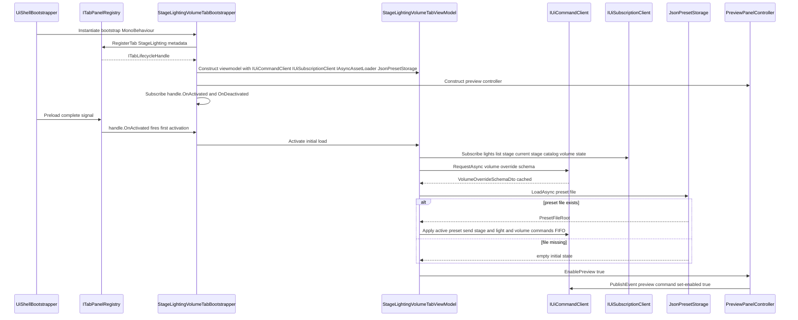
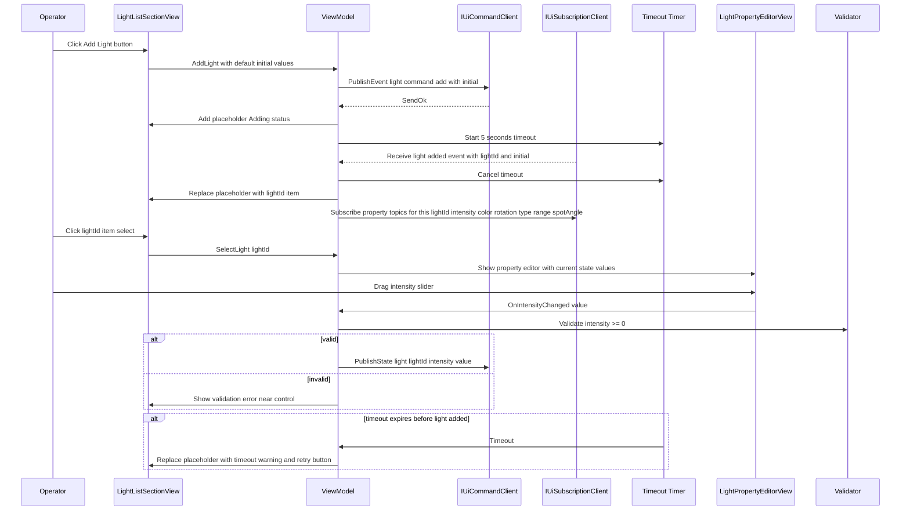
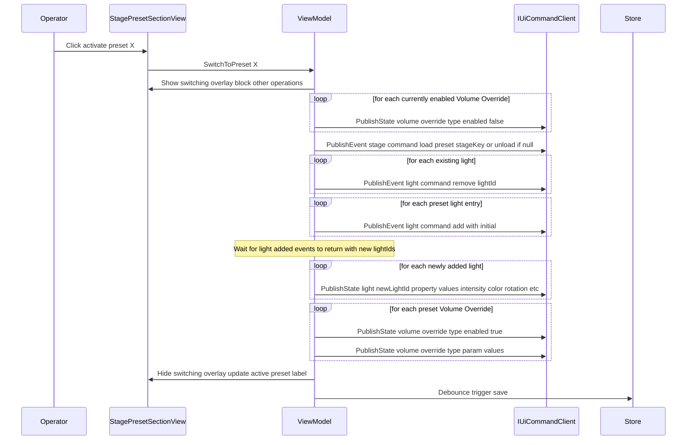
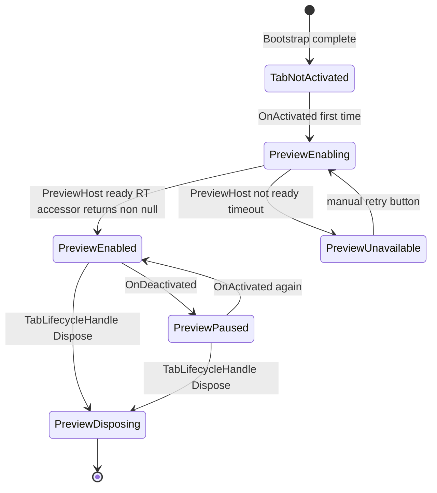
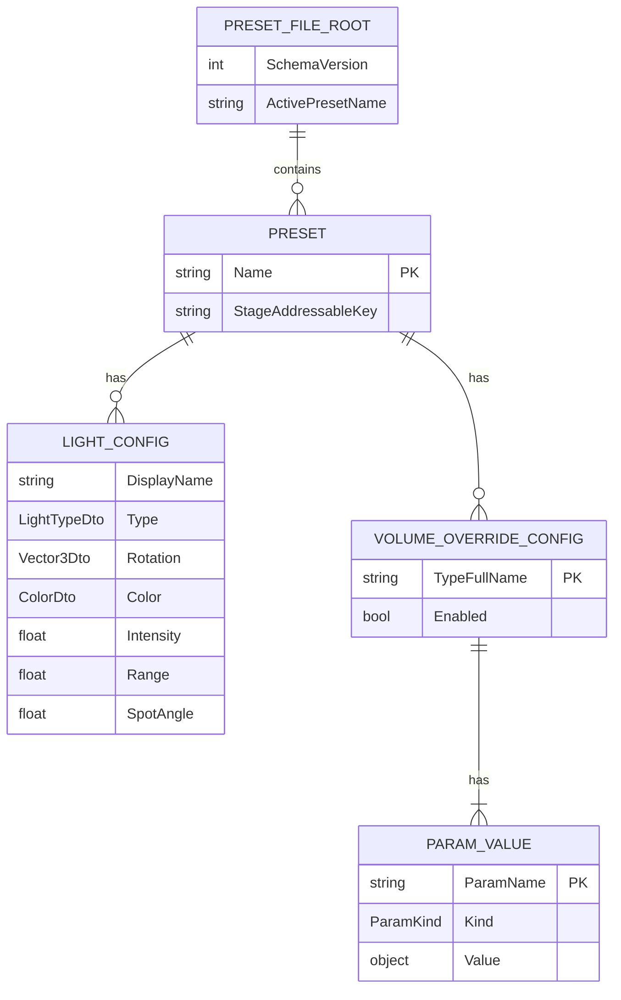

# Technical Design — stage-lighting-volume-tab

## Overview

**Purpose**: 本 spec は、Display 1 上のオペレーター UI の 3 タブのうち 1 つである **ステージ・ライティング・Volume タブ** を実装する。配信前の「画作り」フェーズで、(1) 引きカメラプレビューでシーン全体のルックを確認し、(2) ステージアセット（Addressables）を切替え、(3) 任意個数の Light を動的に追加・削除・編集し、(4) URP Global Volume の Override 群をメタデータ駆動の動的 UI で編集し、(5) これらすべてを「名前付きプリセット」として保存・復元できる UI を提供する。

**Users**: 配信オペレーター（Display 1 の本タブで画作りを実行）、本 spec の実装者（UI と IPC 契約の実装）、および本 spec の IPC 契約を受ける **メイン出力側 Stage-Lighting-Volume アダプタ**（本 spec 範囲外だが、`Contracts` asmdef を共有することで同時開発可能）。

**Impact**: Wave 2 最後のタブ spec として、`ui-toolkit-shell` の 3 タブ枠を完成させる 1 ピース。`output-renderer-shell` が提供する空の `VolumeRoot` / `LightsRoot` / `StageRoot` / `CamerasRoot` に Light GameObject・Volume Override・ステージ Prefab・プレビューカメラを差し込む IPC 契約を確立する。メイン出力側アダプタが本 spec の `Contracts` asmdef を参照することで、UI とメイン出力の両方向実装を並行開発可能にする。

### Goals

- `ui-toolkit-shell` Requirement 1〜3 に従い、本タブ UIDocument を起動時プリロード完了させ、タブ切替時の再 clone / メインスレッドブロックを発生させない。
- 引きカメラプレビューを RenderTexture 経由で UI Toolkit 内に埋め込み、Display 1 に閉じる（配信に載らない）構造を保証する（SL-1, SL-13）。
- 任意個数の Light を動的に CRUD でき、`light/{lightId}/{property}` トピック単位の `PublishState` で coalesce を効かせて高頻度編集に応答する（SL-5, SL-6）。
- URP `VolumeManager.baseComponentTypeArray` をメイン出力側でメタデータ化し、`VolumeOverrideSchema` Request/Response で UI 側に返すことで **メタデータ駆動の動的 UI 生成** を実現する（SL-7）。
- 「ステージ + Light 配列 + Volume Override 構成」を 1 単位とする名前付きプリセット CRUD、デバウンス即時保存（500 ms）、起動時の state/event 経路復元を提供する（SL-8, SL-9, CS-10, CS-12）。
- すべての失敗経路（Addressables ロード失敗、範囲外値、IPC 切断、プリセット破損）で UI クラッシュ・メイン出力描画干渉を発生させず、縮退表示のみで継続する（SL-11, SL-12, Requirement 9）。

### Non-Goals

- メイン出力側での Light GameObject 実生成・破棄・プロパティ適用（メイン出力側アダプタの責務、本 spec 範囲外。本 spec は IPC 契約のみ）。
- メイン出力側での URP `VolumeProfile` への Override `AddComponent<T>()` 実適用（同上）。
- ステージ Prefab の Addressables Instantiate / Release（同上）。
- ステージアセット・Volume Override 具体 UI デザイン（利用者プロジェクトの責務、本 spec は共通 UI コンポーネント経由）。
- メイン出力カメラ（配信に載るカメラ）の操作・切替（`camera-switcher-tab` spec の責務）。
- プログラム制御のライティングトランジション（時間変化・タイムライン制御、Requirement 非目標）。
- IPC トランスポート・エンベロープ・メインスレッド配信（`core-ipc-foundation` の責務、本 spec は抽象 API 利用者）。
- UI Toolkit シェル本体・Command 送信 API 実装（`ui-toolkit-shell` の責務、本 spec は公開 API 利用者）。

## Boundary Commitments

### This Spec Owns

- **本タブ UIDocument**（`StageLightingVolumeTab.uxml` / `.uss`）とその VisualElement 構築、`ui-toolkit-shell` の UXML/USS 配置規約（UI-3）への適合（Requirement 1）。
- **引きカメラプレビュー UI**：RenderTexture を表示する VisualElement パネル、マウス回転・パン・ズーム入力のハンドリング（`IPreviewCameraAdapter` 経由）、視点リセット UI、タブ非アクティブ化時のプレビュー一時停止コマンド送信（Requirement 2）。
- **ステージ選択 UI**：Addressables カタログ表示、切替操作、進行中表示、切替失敗表示（Requirement 3）。
- **Light 管理 UI**：Light 一覧表示、追加ボタン・削除ボタン・選択機能、「追加中」プレースホルダ、一覧順序の安定化、タイムアウト処理（Requirement 4）。
- **Light プロパティ編集 UI**：選択 Light の Type / 角度 / 色 / 強さ / Range / Spot Angle 編集パネル、Type に応じた活性/非活性、値範囲バリデーション、操作中コントロール競合抑止（Requirement 5）。
- **Volume Override 編集 UI**：メタデータ駆動の動的コントロール生成、Override リスト UI、enabled トグル、値範囲バリデーション、再試行 UI（Requirement 6）。
- **プリセット CRUD UI**：Stage + Lights + Volume を 1 単位とする名前付きプリセットの create / rename / duplicate / delete / activate、重複名バリデーション、切替セマンティクスの適用、部分失敗時の警告（Requirement 7）。
- **プリセット永続化**：JSON フォーマットへのシリアライズ、デバウンス即時保存、起動時復元、破損ファイルのフォールバック（Requirement 8）。
- **失敗ハンドリング UI**：Addressables 未解決、範囲外値、メイン出力エラー event、IPC 切断中の UI 状態切替（Requirement 9）。
- **診断ログ出力**：初期化・プリセット切替・Light 操作・Volume 操作・プレビュー操作・永続化の各段階のログ、診断 API（Requirement 10）。
- **IPC 契約（本 spec の Contracts asmdef）**：Light / Stage / Volume / Preview の topic 定数・DTO 型・payload record struct。メイン出力側アダプタと UI 側実装の両方が共有する単一のコントラクト層。

### Out of Boundary

- **メイン出力側 Stage-Lighting-Volume アダプタの実装**：本 spec の `Contracts` asmdef を参照し、`IOutputCommandDispatcher.RegisterStateHandler` / `RegisterEventHandler` / `RegisterRequestHandler` に Light / Stage / Volume / Preview のハンドラを登録、`IOutputSceneRoots` のルート配下に GameObject を配置・編集する責務は本 spec の範囲外（別 spec または同等の実装タスクで処理される）。
- **Light GameObject の Instantiate / Destroy / プロパティ適用**（メイン出力側アダプタの責務）。
- **URP `VolumeComponent` の `AddComponent<T>()` + `VolumeProfile.components` への追加・削除**（同上）。
- **ステージ Prefab の `Addressables.InstantiateAsync` / `Release`**（同上）。
- **プレビューカメラ GameObject の作成・配置・Camera.targetTexture 設定**（メイン出力側アダプタが `StagePreviewHost` MonoBehaviour として `CamerasRoot` 配下に配置）。
- **メイン出力カメラ（配信に載るカメラ）の操作**（`camera-switcher-tab` の責務）。
- **`core-ipc-foundation` のトランスポート / シリアライゼーション / 接続管理**。
- **`ui-toolkit-shell` のルート UIDocument / タブバー / プリロード基盤 / 共通 UI コンポーネント実装**（本 spec は利用者）。
- **他タブ（キャラクター選択、カメラスイッチャー）の機能**。
- **タブ共通 UI 状態の永続化**（UI-7 により永続化しない）。

### Allowed Dependencies

- **`core-ipc-foundation.Abstractions`**：`ICoreIpcBus` は直接利用せず、`ui-toolkit-shell` の `IUiCommandClient` / `IUiSubscriptionClient` 経由で利用する。ただし `MessageEnvelope<TPayload>` などの型は受信コールバックから参照される（`ui-toolkit-shell` 経由で再公開）。
- **`ui-toolkit-shell.Runtime`**：`IUiCommandClient`, `IUiSubscriptionClient`, `IConnectionStatus`, `IAsyncAssetLoader`, `ITabPanelRegistry.RegisterTab`, `ITabLifecycleHandle`, `UiToolkitShellSkinProfile` 参照点（UXML 差し替え）。
- **`ui-toolkit-shell.CommonUi`**：`VsbSlider`, `VsbColorPicker`, `VsbNumberedList`, `VsbToggleGroup`（共通 UI コンポーネント、UI-4）。
- **Unity 6.3 URP**：`UnityEngine.UIElements`（UIDocument, VisualElement, Image, StyleBackground, Background, RenderTexture）, `UnityEngine.RenderTexture`, `UnityEngine.Rendering`（共有型のみ。`Volume` / `VolumeProfile` 直接操作はメイン出力側アダプタの責務であり、本 spec は参照しない）。
- **SceneViewStyleCameraController（Hidano-Dev）**：`IPreviewCameraAdapter` 実装の 1 つとして利用。本 spec の抽象経由で利用し、直接依存は `SceneViewStyleCameraController` アダプタクラスのみに閉じ込める。
- **`StagePreviewHostLocator`**（本 spec Contracts asmdef 提供、メイン出力側アダプタが Host 実装）：同一プロセス内での RenderTexture 参照解決（D-1 単一プロセス前提）。
- **System.Text.Json**（`core-ipc-foundation` と同一）：プリセット永続化 JSON シリアライズ。

**禁止される依存**:
- `core-ipc-foundation.Core`（具体トランスポート実装 asmdef）への直接依存。
- `output-renderer-shell.Runtime` の実装 asmdef への直接依存（サーバ側は `IOutputCommandDispatcher` を使うが、UI 側は使わない）。
- 他タブ spec（`character-selection-tab`, `camera-switcher-tab`）の asmdef への参照。

### Revalidation Triggers

- **IPC 契約の変更**（`StageLightingTopics` の topic 文字列、`LightInitialDto` / `StageCatalogEntryDto` / `VolumeOverrideSchemaDto` / `VolumeOverrideParamDto` 等の DTO スキーマ）→ メイン出力側アダプタ再検証必須。
- **プリセット JSON スキーマ（`PresetFileRoot` / `PresetDto` / `LightConfigDto` / `VolumeOverrideConfigDto` 等）**の変更 → 既存利用者のプリセットファイルが失効する可能性、`schemaVersion` の増分 + migrator 要。
- **`IPreviewRenderTextureAccessor` / `StagePreviewHostLocator` の契約変更** → メイン出力側の `StagePreviewHost` 実装が失効。
- **`ITabLifecycleHandle` / `IUiCommandClient` / `IUiSubscriptionClient`（`ui-toolkit-shell` 側の API）変更** → 本 spec の ViewModel / Bootstrap 再検証。
- **URP バージョン major update で `VolumeManager.baseComponentTypeArray` / `VolumeParameter<T>` の公開 API 変更** → メイン出力側メタデータビルダーの再検証。
- **`ui-toolkit-shell` の USS セレクタ命名規約変更**（`vsb-` プレフィクス等）→ 本タブの UXML / USS の再調整。

## Architecture

### Architecture Pattern & Boundary Map

本 spec は **MVVM-Lite + Facade** を採用する。View（UIDocument + VisualElement）は `StageLightingVolumeTabPanel` にまとまり、ロジックは `StageLightingVolumeTabViewModel` が集約する。ViewModel は `ui-toolkit-shell` の Facade（`IUiCommandClient` / `IUiSubscriptionClient` / `IAsyncAssetLoader`）を通じて IPC と Addressables にアクセスし、直接 `core-ipc-foundation` や Unity Addressables API には触れない。永続化・プレビュー RT 解決・プリセットモデルは専用サービスに分離する。

```mermaid
graph TB
    subgraph Display1[Display 1 UI Side]
        subgraph StageTabRuntime[StageLightingVolumeTab Runtime asmdef]
            Bootstrap[StageLightingVolumeTabBootstrapper]
            Panel[StageLightingVolumeTabPanel View]
            ViewModel[StageLightingVolumeTabViewModel]
            PresetStore[JsonPresetStorage]
            LightListModel[LightListState]
            StageCatalogModel[StageCatalogState]
            VolumeSchemaCache[VolumeSchemaCache]
            PreviewController[PreviewPanelController]
            PreviewCameraAdapterImpl[SceneViewStylePreviewCameraAdapter]
            PreviewRtAccessor[PreviewRenderTextureAccessor]
            DebounceFlusher[DebounceFlusher]
        end
        subgraph Contracts[StageLightingVolumeTab Contracts asmdef]
            TopicConstants[StageLightingTopics]
            DtoLight[LightInitialDto LightListItemDto]
            DtoStage[StageCatalogEntryDto StageLoadFailedDto]
            DtoVolume[VolumeOverrideSchemaDto VolumeOverrideParamDto]
            DtoPreview[PreviewCommandDto]
            PresetSchema[PresetFileRoot PresetDto]
            PreviewLocator[StagePreviewHostLocator]
        end
        subgraph UiShell[ui-toolkit-shell Runtime]
            CmdClient[IUiCommandClient]
            SubClient[IUiSubscriptionClient]
            AssetLoader[IAsyncAssetLoader]
            TabRegistry[ITabPanelRegistry]
            CommonUi[VsbSlider VsbColorPicker VsbToggleGroup VsbNumberedList]
            SkinProfile[UiToolkitShellSkinProfile]
        end
        subgraph CoreIpcAbs[core-ipc-foundation Abstractions]
            MsgEnv[MessageEnvelope]
        end
    end
    subgraph MainOutputProcess[Display 2 Plus Output Side Same Unity Process]
        subgraph MainOutputAdapter[Main Output Adapter outside this spec scope]
            StageLightVolAdapter[Stage Lighting Volume Adapter]
            PreviewHost[StagePreviewHost MonoBehaviour]
            PreviewCamera[Preview Camera Render Texture]
        end
        subgraph OutputShell[output-renderer-shell]
            SceneRoots[IOutputSceneRoots]
            Dispatcher[IOutputCommandDispatcher]
        end
    end
    Bootstrap --> Panel
    Bootstrap --> ViewModel
    Bootstrap --> PreviewController
    Bootstrap --> TabRegistry
    ViewModel --> CmdClient
    ViewModel --> SubClient
    ViewModel --> AssetLoader
    ViewModel --> PresetStore
    ViewModel --> LightListModel
    ViewModel --> StageCatalogModel
    ViewModel --> VolumeSchemaCache
    ViewModel --> DebounceFlusher
    ViewModel --> TopicConstants
    ViewModel --> DtoLight
    ViewModel --> DtoStage
    ViewModel --> DtoVolume
    ViewModel --> DtoPreview
    PresetStore --> PresetSchema
    Panel --> CommonUi
    Panel --> SkinProfile
    PreviewController --> PreviewRtAccessor
    PreviewController --> PreviewCameraAdapterImpl
    PreviewController --> CmdClient
    PreviewRtAccessor --> PreviewLocator
    PreviewLocator -. same process Singleton access .- PreviewHost
    PreviewHost --> PreviewCamera
    PreviewHost --> SceneRoots
    StageLightVolAdapter --> TopicConstants
    StageLightVolAdapter --> DtoLight
    StageLightVolAdapter --> DtoStage
    StageLightVolAdapter --> DtoVolume
    StageLightVolAdapter --> DtoPreview
    StageLightVolAdapter --> Dispatcher
    StageLightVolAdapter --> SceneRoots
    CmdClient --> MsgEnv
    SubClient --> MsgEnv
```



**Architecture Integration**:

- **Selected pattern**: MVVM-Lite（View / ViewModel / Services） + Contracts Facade（2 asmdef 分離）。View はほぼ状態を持たず、ViewModel が送信・購読・モデル保持・プリセット管理を集約する。
- **Domain/feature boundaries**:
  - **Contracts asmdef**（`StageLightingVolumeTab.Contracts`）：topic 定数、DTO 型、プリセット JSON スキーマ、`StagePreviewHostLocator` 抽象。メイン出力側アダプタと UI 側 Runtime の両方から参照される単一の契約層。
  - **Runtime asmdef**（`StageLightingVolumeTab.Runtime`）：View（UXML/USS）、ViewModel、Services、Preview 関連、永続化実装。UI 側のみ。
  - **Main output adapter**（本 spec 範囲外）：Contracts asmdef + `output-renderer-shell.Runtime` + URP/Addressables を参照して実装される。
- **Existing patterns preserved**:
  - `core-ipc-foundation` の Abstractions / Core 2 分割を Contracts / Runtime で踏襲（Hexagonal）。
  - `ui-toolkit-shell` の `ITabLifecycleHandle` + Facade API（`IUiCommandClient` / `IUiSubscriptionClient` / `IAsyncAssetLoader`）を受信口として利用。
  - `output-renderer-shell` の `IOutputSceneRoots` / `IOutputCommandDispatcher` は直接叩かず、メイン出力側アダプタが仲介。
  - Topic 命名は SL-6 の決定（`light/{lightId}/{property}`, `volume/override/{typeFullName}/{paramName}` 等）を厳守。
- **New components rationale**:
  - `StageLightingVolumeTabBootstrapper`：タブ spec の初期化・`RegisterTab` 呼出・`ITabLifecycleHandle` 連動・ViewModel 構築。
  - `StageLightingVolumeTabViewModel`：UI ロジックの単一集約点、テスト時は View 不要で検証可能。
  - `JsonPresetStorage` + `PresetFileRoot`：SL-8/SL-9/Requirement 8 の永続化単独責務。
  - `StagePreviewHostLocator`（Contracts）+ `PreviewRenderTextureAccessor`（Runtime）：同一プロセス内で RenderTexture 参照を解決する薄い抽象（IPC では渡せない Native ハンドルを回避）。
  - `VolumeSchemaCache`：Requirement 6.1 の初回 Request/Response 結果保持、再試行契機検出。
- **Steering compliance**: `.kiro/steering/` は未整備のため、`CLAUDE.md` の「Spec-Driven Development」と上流 spec の決定（D-1〜D-11, OR-1, OR-2, UI-1〜UI-7）を遵守する形で整合性を取る。

### Dependency Direction

本 spec の参照方向は一方向で強制：

```
tab spec Runtime (this spec)  →  tab spec Contracts (this spec)
          ↓                              ↑
  ui-toolkit-shell Runtime / CommonUi    │
          ↓                              │
  core-ipc-foundation Abstractions       │
          ↓                              │
  Unity 6.3 URP / System.Text.Json       │
                                         │
Main output adapter (out of scope)  ──→  tab spec Contracts (this spec)
          ↓
  output-renderer-shell Runtime
```

- Contracts asmdef は何にも依存しない純 DTO + 定数層（Unity 標準型のみ使用、URP / Addressables 直接依存なし）。
- Runtime asmdef は Contracts + ui-toolkit-shell + Unity UIElements を参照。
- メイン出力側アダプタ（範囲外）は Contracts + output-renderer-shell + URP を参照。

逆方向 import はレビューでエラー扱い。

### Technology Stack

| Layer | Choice / Version | Role in Feature | Notes |
|-------|------------------|-----------------|-------|
| UI Toolkit | Unity 6.3 URP 標準 `UnityEngine.UIElements` (6000.3 系) | タブ UIDocument、VisualElement、Image / RenderTexture 背景、共通 UI コンポーネント | `ui-toolkit-shell` の PanelSettings（targetDisplay=0）を共有、本 spec は独自 PanelSettings を作成しない |
| IPC Client | `ui-toolkit-shell.Runtime`（`IUiCommandClient` / `IUiSubscriptionClient`） | Command 送受信 Facade、state/event/request の使い分け | `core-ipc-foundation.Core` には非依存 |
| Addressables | `com.unity.addressables` 2.x（`IAsyncAssetLoader` 経由） | ステージサムネイル非同期ロード | 本 spec は直接 Addressables API を叩かない（UI-6 準拠） |
| Preview Camera | SceneViewStyleCameraController（Hidano-Dev） + `IPreviewCameraAdapter` | Unity Scene ビュー相当のマウス入力処理 | `IPreviewCameraAdapter` 抽象経由で利用、モック差し替え可能 |
| Preview RT | `UnityEngine.RenderTexture` + `StyleBackground(Background.FromRenderTexture(rt))` | UI Toolkit の VisualElement 背景に RT 表示 | 既定解像度 640×360、同一プロセス内 Singleton 経由で参照取得 |
| Serialization（永続化） | `System.Text.Json`（`core-ipc-foundation` 既採用、.NET Standard 2.1 内蔵） | プリセット JSON 読み書き | `schemaVersion` フィールドでバージョン管理 |
| Persistence Path | `Application.persistentDataPath/vtuber-system-base/stage-lighting-volume-tab.json` | プリセットファイル配置 | `IPresetStorage` 抽象で差し替え可能 |
| Assembly Boundaries | asmdef 2 分割（Contracts + Runtime） | DTO/定数 ↔ UI 実装の分離 | メイン出力側アダプタは Contracts のみ参照 |

> 詳細な API 調査・代替案却下理由・性能推定は `research.md` 参照。

## File Structure Plan

### Directory Structure

```
Packages/jp.hidano.vtuber-system-base.stage-lighting-volume-tab/
├── package.json
├── Runtime/
│   ├── Contracts/                          # 1 つ目 asmdef: 純 DTO + 定数
│   │   ├── VTuberSystemBase.StageLightingVolumeTab.Contracts.asmdef
│   │   ├── Topics/
│   │   │   └── StageLightingTopics.cs      # topic 文字列定数を集約（light/stage/volume/preview 全系統）
│   │   ├── Dtos/
│   │   │   ├── LightInitialDto.cs          # Light 追加時の初期値 DTO（type/color/intensity/rotation/range/spotAngle/displayName）
│   │   │   ├── LightListItemDto.cs         # lights/list state payload 要素
│   │   │   ├── LightListDto.cs             # lights/list state payload ルート
│   │   │   ├── LightCommandDto.cs          # light/command event payload（add/remove）
│   │   │   ├── LightAddedDto.cs            # light/added event payload（lightId + initial）
│   │   │   ├── LightErrorDto.cs            # light/error event payload
│   │   │   ├── StageCatalogEntryDto.cs     # stage/catalog state 要素
│   │   │   ├── StageCatalogDto.cs          # stage/catalog state payload ルート
│   │   │   ├── StageCurrentDto.cs          # stage/current state payload
│   │   │   ├── StageCommandDto.cs          # stage/command event payload（load/unload）
│   │   │   ├── StageLoadFailedDto.cs       # stage/load-failed event payload
│   │   │   ├── VolumeOverrideSchemaDto.cs       # volume/override/schema response payload
│   │   │   ├── VolumeOverrideTypeDto.cs         # schema 内の Override 型エントリ
│   │   │   ├── VolumeOverrideParamDto.cs        # param エントリ（name/kind/range/default/displayName）
│   │   │   ├── VolumeOverrideParamValueDto.cs   # param 値の discriminated union（kind + payload）
│   │   │   ├── PreviewCommandDto.cs        # preview/command event payload（set-enabled/reset-view）
│   │   │   └── PreviewStateDto.cs          # preview/state state payload
│   │   ├── Preview/
│   │   │   └── StagePreviewHostLocator.cs  # 同一プロセス内 Singleton アクセサ（Contracts、Host 実装はメイン出力側）
│   │   └── Presets/
│   │       ├── PresetFileRoot.cs           # JSON ルート（schemaVersion / activePresetName / presets）
│   │       ├── PresetDto.cs                # 1 プリセット単位
│   │       ├── LightConfigDto.cs           # プリセット内 Light 設定
│   │       ├── VolumeOverrideConfigDto.cs  # プリセット内 Volume Override 設定
│   │       └── ParamKind.cs                # enum: Float / ClampedFloat / Int / Bool / Color / Enum / Vector2 / Vector3 / Vector4
│   └── Runtime/                            # 2 つ目 asmdef: UI 実装
│       ├── VTuberSystemBase.StageLightingVolumeTab.Runtime.asmdef
│       ├── Bootstrap/
│       │   └── StageLightingVolumeTabBootstrapper.cs  # RegisterTab 連動、ViewModel 構築、Lifecycle 駆動
│       ├── View/
│       │   ├── StageLightingVolumeTabPanel.cs         # UIDocument 参照取得、VisualElement ハンドル、binding セットアップ
│       │   ├── StagePresetSectionView.cs              # プリセット CRUD セクション
│       │   ├── StageSelectionSectionView.cs           # ステージ選択セクション
│       │   ├── LightListSectionView.cs                # Light 一覧＋追加削除セクション
│       │   ├── LightPropertyEditorView.cs             # 選択 Light のプロパティ編集パネル
│       │   ├── VolumeOverrideSectionView.cs           # Volume Override 一覧＋動的 UI ホスト
│       │   └── VolumeOverrideParamFactory.cs          # ParamKind → VisualElement 生成
│       ├── ViewModel/
│       │   └── StageLightingVolumeTabViewModel.cs     # 全 UI ロジック集約、購読/送信/モデル保持
│       ├── Services/
│       │   ├── IPresetStorage.cs                       # プリセット永続化抽象
│       │   ├── JsonPresetStorage.cs                    # System.Text.Json 実装
│       │   ├── DebounceFlusher.cs                      # 500 ms デバウンス + flush
│       │   ├── LightListState.cs                       # lights/list 購読と内部モデル
│       │   ├── StageCatalogState.cs                    # stage/catalog 購読と内部モデル
│       │   └── VolumeSchemaCache.cs                    # volume/override/schema Request 結果キャッシュ
│       ├── Preview/
│       │   ├── PreviewPanelController.cs               # RT を VisualElement に貼る、Lifecycle 連動
│       │   ├── IPreviewCameraAdapter.cs                # プレビューカメラ操作抽象
│       │   ├── SceneViewStylePreviewCameraAdapter.cs   # 本番実装（SceneViewStyleCameraController ラップ）
│       │   ├── IPreviewRenderTextureAccessor.cs        # RT 参照取得抽象
│       │   └── PreviewRenderTextureAccessor.cs         # StagePreviewHostLocator 経由実装
│       ├── Diagnostics/
│       │   └── StageTabDiagnostics.cs                  # 診断 API（現在 Light 数、エラー Light 数、プリセット名等）
│       └── Validation/
│           └── LightPropertyValidator.cs               # 値範囲バリデーション（intensity>=0, spotAngle 1-179 等）
├── Runtime.Uxml/
│   ├── StageLightingVolumeTab.uxml             # タブルート UXML
│   ├── StageLightingVolumeTab.uss              # タブ USS（vsb-slv- プレフィクス + BEM）
│   ├── LightListItem.uxml                      # Light リスト項目のテンプレート
│   └── PresetListItem.uxml                     # プリセット項目のテンプレート
├── Editor/
│   ├── VTuberSystemBase.StageLightingVolumeTab.Editor.asmdef
│   └── UxmlImportValidator.cs                   # 必須要素欠落検出
└── Tests/
    ├── Runtime/
    │   ├── VTuberSystemBase.StageLightingVolumeTab.Tests.Runtime.asmdef
    │   ├── ViewModelTests.cs                    # ViewModel 単体（FakeIpcClient, FakePresetStorage 差替）
    │   ├── JsonPresetStorageTests.cs            # 永続化 I/O（Temp dir 利用）
    │   ├── DebounceFlusherTests.cs              # 時刻抽象経由
    │   ├── VolumeSchemaCacheTests.cs            # Request 結果キャッシュ
    │   ├── LightPropertyValidatorTests.cs       # 範囲バリデーション
    │   └── PresetMigrationTests.cs              # 破損・旧 schemaVersion 扱い
    ├── PlayMode/
    │   ├── VTuberSystemBase.StageLightingVolumeTab.Tests.PlayMode.asmdef
    │   └── StageLightingVolumeTabPlayModeSample.unity   # 手動検証用最小シーン（モック Host + モック IPC）
    └── Editor/
        └── VTuberSystemBase.StageLightingVolumeTab.Tests.Editor.asmdef
```

### Modified Files

なし（本 spec は新規 UPM パッケージ追加）。

## System Flows

### Flow 1: タブ初期化（プリロード完了後 → アクティブ化まで）



**Key decisions**:
- ViewModel の初期化はタブの **初回** `OnActivated` で実行する（プリロード直後に実行すると、シェル側 IPC 接続が未確立で購読失敗する可能性があるため）。`ui-toolkit-shell` の Command 送信 API は未接続時に即時 `SendError.NotConnected` を返すので、VM 側は送信失敗をハンドリングし、接続確立（`IConnectionStatus.OnStatusChanged`）後に再試行する（Requirement 9.8, 9.9）。
- Volume Override スキーマは `RequestAsync` で 1 度だけ取得し、`VolumeSchemaCache` に保持する。失敗時はエラー UI + 再試行ボタン（Requirement 6.9）。
- プリセットの復元は通常の state/event 経路で送信し、メイン出力側の特殊ハンドラを要求しない（CS-10, SL-8）。

### Flow 2: Light 追加 → lightId 発行待ち → プロパティ編集（SL-3 具現化）



**Key decisions**:
- 追加要求送信から `light/added` 受信まで UI は「追加中」プレースホルダで置き換え、同一タイミングでの連打は View 側でボタン一時無効化（Requirement 4.6）。
- タイムアウト既定値 5 秒（`core-ipc-foundation` D-8 に合わせる、R-3 の一次決定）。タイムアウト時はエラー表示 + 再試行ボタン、UI クラッシュは発生させない（Requirement 4.7）。
- プロパティ購読は **lightId 受信後** に限定して subscribe。lights/list state 受信時に新規 lightId を検出したら追加購読、消失を検出したら解除（リーク防止）。

### Flow 3: プリセット切替（SL-8 切替セマンティクス、R-4 解消策）



**Key decisions**:
- 送信順序は「既存 Volume 無効化 → Stage 切替 → 既存 Light 削除 → 新 Light 追加 → 新 Light プロパティ → 新 Volume 有効化 + param」の固定順（R-4 の採用案）。
- event の FIFO 配信（`core-ipc-foundation` D-7）により、単一フレーム内にメイン出力側で処理される前提。配信中の切替は UI 側で抑制できないが、運用ガイドで禁止する。
- 切替中のオーバーレイは VisualElement の `.vsb-slv-overlay--switching` クラスで表示（メインスレッドで同期切替、UI 操作のみブロック）。
- 部分失敗は個別コマンドの `SendError` / メイン出力側エラー event で検出し、失敗箇所を UI 通知バーで警告表示したうえで他コマンドは継続（Requirement 7.6、本 spec は rollback しない）。

### Flow 4: プレビューパネルのライフサイクル（Requirement 2）



**Key decisions**:
- `OnActivated` / `OnDeactivated` は純粋コールバック（同期、メインスレッド）。プレビュー RT の貼り替え・`Camera.enabled` 切替は同期実行。非同期待ちは発生させない（`ui-toolkit-shell` Flow 2 の制約継承）。
- `PreviewHost` が未初期化（タブ初回アクティブ化時にメイン出力側でまだ `StagePreviewHost` の Awake が終わっていない等）の場合、`PreviewRenderTextureAccessor.TryGet` が null を返し、UI は「プレビュー準備中」プレースホルダを表示。リトライは手動ボタン + 初期化完了 event 購読で自動復帰。
- `set-enabled: false` は `PublishEvent` で送信し、メイン出力側がプレビューカメラの `enabled = false` を設定（GPU 負荷削減、Requirement 2.6）。

## Requirements Traceability

| Requirement | Summary | Components | Interfaces / Contracts | Flows |
|-------------|---------|------------|------------------------|-------|
| 1.1 | 本タブ UIDocument と UXML/USS 配置規約適合 | StageLightingVolumeTabPanel, Runtime.Uxml/*.uxml/*.uss | — | Flow 1 |
| 1.2 | USS セレクタ命名規約（vsb-slv- プレフィクス） | `StageLightingVolumeTab.uss` | — | — |
| 1.3 | プリロード時の同期アタッチ、再 clone なし | Bootstrapper (RegisterTab + preloaded UIDocument) | ITabPanelRegistry.RegisterTab | Flow 1 |
| 1.4 | アクティブ化は display/visible 切替のみ | StageLightingVolumeTabPanel（`ui-toolkit-shell` Flow 2 の制約継承） | ITabLifecycleHandle.OnActivated | Flow 1 |
| 1.5 | 非アクティブ化時のプレビュー停止と購読解除 | Bootstrapper, PreviewPanelController, ViewModel.OnDeactivated | ITabLifecycleHandle.OnDeactivated | Flow 4 |
| 1.6 | 同期 I/O・メインスレッドブロッキング禁止 | ViewModel（RequestAsync は非同期、購読はメインスレッド） | IUiCommandClient, IUiSubscriptionClient | — |
| 1.7 | 独立 asmdef で参照方向維持 | StageLightingVolumeTab.Runtime.asmdef, Contracts.asmdef | — | — |
| 1.8 | UXML 差し替え時の必須要素欠落診断 | UxmlImportValidator, StageTabDiagnostics | — | — |
| 2.1 | SceneViewStyle プレビューカメラ + RT 描画 | SceneViewStylePreviewCameraAdapter, PreviewHost（メイン出力側） | IPreviewCameraAdapter, StagePreviewHostLocator | Flow 4 |
| 2.2 | RT をプレビューパネル VisualElement に表示 | PreviewPanelController | IPreviewRenderTextureAccessor | Flow 4 |
| 2.3 | Display 1 のみ描画（Display 2+ 非描画） | PanelSettings（ui-toolkit-shell 側で targetDisplay=0 保証）、PreviewHost（配置時メイン出力シーン内、RT 経由） | — | Flow 4 |
| 2.4 | マウス操作の露出（回転/パン/ズーム） | SceneViewStylePreviewCameraAdapter（SceneViewStyleCameraController ラップ） | IPreviewCameraAdapter | — |
| 2.5 | 配信用メイン出力カメラとは別カメラ | StagePreviewHost（独立 Camera、targetDisplay 不使用、RT 専用） | — | — |
| 2.6 | 非アクティブ化時の描画一時停止 | PreviewPanelController, ViewModel | PreviewCommandDto.set-enabled | Flow 4 |
| 2.7 | 再アクティブ化時の描画再開（視点維持） | PreviewPanelController | PreviewCommandDto.set-enabled | Flow 4 |
| 2.8 | 視点リセット UI | PreviewPanelController, StageLightingVolumeTabPanel | PreviewCommandDto.reset-view | — |
| 2.9 | 視点状態を永続化しない | ViewModel（保存対象に含めない） | — | — |
| 2.10 | メイン出力描画フレーム干渉禁止 | SceneViewStylePreviewCameraAdapter（入力処理のみ、描画は Camera が担当） | — | — |
| 2.11 | プレビューとメイン出力カメラの描画競合なし配置 | StagePreviewHost 配置規約（メイン出力シーン内の別 Camera、本番カメラとカリングマスク共通） | — | — |
| 3.1 | ステージ候補一覧取得 | StageCatalogState, ViewModel | stage/catalog (state), IUiSubscriptionClient | — |
| 3.2 | ステージ選択 UI 表示 | StageSelectionSectionView | — | — |
| 3.3 | サムネイル非同期ロード | StageSelectionSectionView | IAsyncAssetLoader | — |
| 3.4 | ステージ切替 event 送信 | ViewModel | stage/command (event), StageCommandDto | Flow 3 |
| 3.5 | ステージ解除 event 送信 | ViewModel | stage/command (event, op: unload) | Flow 3 |
| 3.6 | 現在ステージ ID 可視化 | ViewModel, StageSelectionSectionView | stage/current (state) | — |
| 3.7 | 切替待機中の進行表示 + 重複抑止 | ViewModel | — | Flow 3 |
| 3.8 | ステージロード失敗時の状態維持 | ViewModel | stage/load-failed (event), StageLoadFailedDto | — |
| 3.9 | 候補取得失敗時のエラー UI + 再試行 | StageCatalogState, ViewModel | — | — |
| 3.10 | 候補 state 更新時の自動追従 | StageCatalogState | stage/catalog (state) | — |
| 3.11 | 同時アクティブステージ高々 1 | ViewModel（切替順序セマンティクス） | — | Flow 3 |
| 4.1 | Light 一覧 state 購読 | LightListState | lights/list (state), LightListDto | — |
| 4.2 | lightId / 表示名で識別 | LightListSectionView | LightListItemDto | — |
| 4.3 | Light 追加 event 送信 | ViewModel | light/command (event, op: add), LightCommandDto | Flow 2 |
| 4.4 | lightId 発行イベント受信 + UI 反映 | ViewModel, LightListState | light/added (event), LightAddedDto | Flow 2 |
| 4.5 | Light 削除 event 送信 | ViewModel | light/command (event, op: remove) | — |
| 4.6 | 追加中プレースホルダ + 連打抑止 | LightListSectionView, ViewModel | — | Flow 2 |
| 4.7 | タイムアウト処理（5 秒） | ViewModel, DebounceFlusher (Timer) | — | Flow 2 |
| 4.8 | 一覧順序の安定化 | LightListState（lightId 採番順で安定化） | — | — |
| 4.9 | Light 一覧未受信時のプレースホルダ | LightListSectionView | — | — |
| 4.10 | Light 追加失敗 event での UI 切替 | ViewModel | light/error (event), LightErrorDto | — |
| 5.1 | 選択時の編集パネル表示 + 現在値反映 | LightPropertyEditorView, ViewModel | light/{lightId}/* (state) | — |
| 5.2 | プロパティ単位 state 購読 | ViewModel | light/{lightId}/intensity/color/rotation/type/range/spotAngle | — |
| 5.3 | プロパティ変更時の PublishState | ViewModel, LightPropertyEditorView | IUiCommandClient.PublishState | — |
| 5.4 | Type 変更に応じた活性/非活性 | LightPropertyEditorView | light/{lightId}/type (state) | — |
| 5.5 | coalesce 前提で UI 流量制御最小 | ViewModel（スロットリングなし） | — | — |
| 5.6 | ドラッグ中のレスポンス維持 | LightPropertyEditorView（UI Toolkit 標準スライダー） | — | — |
| 5.7 | 値範囲バリデーション | LightPropertyValidator | — | — |
| 5.8 | 他クライアント由来の state 逆流追従 | LightPropertyEditorView（操作中コントロール競合戦略 = 操作中は逆流抑止） | — | — |
| 5.9 | Light エラー時の UI 切替（他 Light は継続） | LightListSectionView, LightPropertyEditorView | light/error (event) | — |
| 5.10 | 共通 UI コンポーネントの活用 | LightPropertyEditorView（VsbSlider, VsbColorPicker 等） | ui-toolkit-shell CommonUi | — |
| 5.11 | プロパティ単位 coalesce の前提 | ViewModel（送信 topic 粒度 = プロパティ単位） | — | — |
| 6.1 | Volume Override メタデータ Request/Response | VolumeSchemaCache, ViewModel | volume/override/schema (request), VolumeOverrideSchemaDto | Flow 1 |
| 6.2 | メタデータに基づく動的 UI 生成 | VolumeOverrideSectionView, VolumeOverrideParamFactory | ParamKind | — |
| 6.3 | Override 一覧 UI + enabled トグル | VolumeOverrideSectionView | — | — |
| 6.4 | enabled トグル変更時の PublishState | ViewModel | volume/override/{typeFullName}/enabled (state) | — |
| 6.5 | param 変更時の PublishState | ViewModel | volume/override/{typeFullName}/{paramName} (state) | — |
| 6.6 | coalesce 前提の UI 流量制御最小 | ViewModel | — | — |
| 6.7 | param 値範囲バリデーション | VolumeOverrideParamFactory, LightPropertyValidator | ParamKind range metadata | — |
| 6.8 | 逆流 state 追従 | VolumeOverrideSectionView | — | — |
| 6.9 | スキーマ取得失敗時のエラー UI + 再試行 | VolumeSchemaCache, VolumeOverrideSectionView | — | — |
| 6.10 | 未知の型・必須欠落の param スキップ | VolumeOverrideParamFactory, StageTabDiagnostics | — | — |
| 6.11 | 利用者プロジェクト独自 Override の露出 | VolumeSchemaCache（typeFullName 固定なしの動的 UI） | — | — |
| 7.1 | 名前付きプリセット複数保持 | ViewModel, PresetFileRoot | PresetDto | — |
| 7.2 | create / rename / duplicate / delete / activate UI | StagePresetSectionView, ViewModel | — | — |
| 7.3 | アクティブプリセット名表示 | StagePresetSectionView | — | — |
| 7.4 | 切替時の通常 state/event 経路送信 | ViewModel | 全トピック（stage/light/volume） | Flow 3 |
| 7.5 | 重複名の拒否 | ViewModel, PresetFileRoot.Validate | — | — |
| 7.6 | 部分失敗時の警告 + 継続 | ViewModel | SendResult.Error, light/error, stage/load-failed | — |
| 7.7 | 切替セマンティクス（一括 remove → add） | ViewModel（R-4 採用案） | — | Flow 3 |
| 7.8 | lightId 再採番前提の UI 追従 | ViewModel, LightListState | light/added (event) | — |
| 7.9 | プリセット管理は UI 側で保持 | ViewModel, PresetFileRoot（メイン出力側に送らない） | — | — |
| 8.1 | 保存対象 | JsonPresetStorage, PresetFileRoot | — | — |
| 8.2 | 保存除外対象 | JsonPresetStorage（プリセット外は保存しない） | — | — |
| 8.3 | デバウンス即時保存（500 ms） | DebounceFlusher, ViewModel | — | — |
| 8.4 | 正常終了時のフラッシュ | JsonPresetStorage, Bootstrapper.OnDisable | Application.quitting / ITabLifecycleHandle.Dispose | — |
| 8.5 | 起動時の通常経路復元 | ViewModel, JsonPresetStorage | 全トピック（stage/light/volume） | Flow 1 |
| 8.6 | 初回起動時の復元スキップ | ViewModel（ファイル不在分岐） | — | Flow 1 |
| 8.7 | パース失敗時の破損リネーム + フォールバック | JsonPresetStorage（`.corrupted-{unix-ms}`） | — | — |
| 8.8 | ステージ未解決時の未選択フォールバック | ViewModel（stage/catalog 照合） | StageCatalogDto | — |
| 8.9 | 書込失敗時のエラーログ + 次回再試行 | JsonPresetStorage, StageTabDiagnostics | — | — |
| 8.10 | ストレージ抽象で配置差し替え | IPresetStorage | IPresetStorage | — |
| 8.11 | 復元中の部分失敗時の継続 | ViewModel（Flow 3 と同じ戦略） | — | — |
| 9.1 | Addressables 未解決プリセットの未選択化 | ViewModel | — | — |
| 9.2 | ステージロード失敗時の状態維持 | ViewModel | stage/load-failed (event) | — |
| 9.3 | 範囲外値の送信抑止 + UI エラー | LightPropertyValidator, VolumeOverrideParamFactory | — | — |
| 9.4 | エラー event 受信時の UI 縮退 | ViewModel, 各 View | light/error, stage/load-failed | — |
| 9.5 | Command 送信エラーのログ + UI クラッシュ回避 | ViewModel | SendResult.Error | — |
| 9.6 | 非同期ロード失敗時の UI フォールバック | StageSelectionSectionView | IAsyncAssetLoader | — |
| 9.7 | メイン出力描画への警告/エラー UI 非表示 | 全 View（`ui-toolkit-shell` PanelSettings targetDisplay=0 制約継承） | — | — |
| 9.8 | IPC 切断中の UI 安全非活性化 | ViewModel, Bootstrapper | IConnectionStatus | — |
| 9.9 | IPC 接続回復時の再取得同期 | ViewModel | IConnectionStatus.OnStatusChanged | Flow 1 |
| 9.10 | Display 1 フォールバック中の警告表示 | ViewModel（`ui-toolkit-shell` の通知経路利用） | ui-toolkit-shell NotificationBarController | — |
| 10.1 | 各段階の開始/完了/失敗ログ | StageTabDiagnostics, ViewModel | IDiagnosticsLogger (ui-toolkit-shell) | — |
| 10.2 | state/event 送受信のログ | ViewModel | IDiagnosticsLogger | — |
| 10.3 | 受信 event の識別子ログ | ViewModel, LightListState | IDiagnosticsLogger | — |
| 10.4 | Addressables 失敗のログ | StageSelectionSectionView | IDiagnosticsLogger | — |
| 10.5 | 永続化 I/O 失敗のログ | JsonPresetStorage | IDiagnosticsLogger | — |
| 10.6 | メイン出力に描画しない | 全コンポーネント（`ui-toolkit-shell` DiagnosticsLogger 経由） | — | — |
| 10.7 | ログレベル外部切替 | StageTabDiagnostics（`ui-toolkit-shell` DiagnosticsLogger 利用） | — | — |
| 10.8 | 診断状態の外部取得 API | StageTabDiagnostics | StageTabDiagnosticsSnapshot | — |
| 11.1 | スタンドアロン起動時の自動初期化 | Bootstrapper（`ui-toolkit-shell` Lifecycle 継承） | — | Flow 1 |
| 11.2 | Editor PlayMode 自動初期化 | Bootstrapper | — | Flow 1 |
| 11.3 | PlayMode 終了時のフラッシュ + 解放 | Bootstrapper, JsonPresetStorage.Flush | ITabLifecycleHandle.Dispose | — |
| 11.4 | PlayMode 反復時のリーク回避 | Bootstrapper（購読解除と RT 参照解放） | — | — |
| 11.5 | Edit モード非常駐 | Bootstrapper（`ui-toolkit-shell` Lifecycle 継承） | — | — |
| 11.6 | ドメインリロード跨ぎなし | Bootstrapper（静的状態保持なし） | — | — |
| 11.7 | 両モード間の挙動同一 | Bootstrapper（単一実装） | — | — |
| 12.1 | モック応答でのテスト可能性 | ViewModel（DI 受入）, JsonPresetStorage (IPresetStorage) | FakeIpcClient, FakePresetStorage, FakePreviewCameraAdapter | — |
| 12.2 | 自己ループでの IPC 検証 | ViewModelTests（`core-ipc-foundation` InMemoryLoopbackTransport 利用） | — | — |
| 12.3 | ストレージ差し替え構造 | IPresetStorage（DI） | IPresetStorage | — |
| 12.4 | PlayMode 手動検証シーン | StageLightingVolumeTabPlayModeSample.unity | — | — |
| 12.5 | 単体テストケース群 | Tests/Runtime/*.cs | — | — |
| 12.6 | Addressables モック | IAsyncAssetLoader のモック（ui-toolkit-shell 側抽象利用） | — | — |
| 12.7 | プレビューカメラモック | IPreviewCameraAdapter（DI） | IPreviewCameraAdapter | — |
| 12.8 | 時刻抽象 | DebounceFlusher（IClock 受入） | — | — |

## Components and Interfaces

**Summary Table**:

| Component | Domain/Layer | Intent | Req Coverage | Key Dependencies (P0/P1) | Contracts |
|-----------|--------------|--------|--------------|--------------------------|-----------|
| StageLightingVolumeTabBootstrapper | Bootstrap | `ui-toolkit-shell` の `RegisterTab` 連動、ViewModel/View の構築、Lifecycle ハンドラ結線 | 1.3, 1.4, 1.5, 11.1〜11.7 | ITabPanelRegistry (P0), ViewModel (P0), PreviewPanelController (P0), JsonPresetStorage (P0) | Service |
| StageLightingVolumeTabViewModel | ViewModel | 全 UI ロジック集約、購読・送信・モデル保持・プリセット管理 | 1.5, 1.6, 3.*, 4.*, 5.*, 6.*, 7.*, 8.5, 8.11, 9.*, 10.1〜10.3, 12.1 | IUiCommandClient (P0), IUiSubscriptionClient (P0), IAsyncAssetLoader (P0), IPresetStorage (P0), VolumeSchemaCache (P0), LightListState (P0), StageCatalogState (P0), DebounceFlusher (P0), IPreviewRenderTextureAccessor (P1), IConnectionStatus (P0), IDiagnosticsLogger (P1) | Service, State |
| StageLightingVolumeTabPanel | View | UIDocument ルート取得、子 View 構築、VisualElement バインド | 1.1, 1.2, 1.4 | UIDocument (P0), ViewModel (P0) | — |
| StagePresetSectionView | View | プリセット CRUD UI | 7.2, 7.3 | ViewModel (P0), CommonUi (P1) | — |
| StageSelectionSectionView | View | ステージ選択 UI + サムネイルロード | 3.2, 3.3, 9.6 | ViewModel (P0), IAsyncAssetLoader (P1), CommonUi (P1) | — |
| LightListSectionView | View | Light 一覧 + 追加/削除 UI | 4.2, 4.6, 4.9 | ViewModel (P0), CommonUi (P1) | — |
| LightPropertyEditorView | View | 選択 Light のプロパティ編集 UI | 5.1, 5.4, 5.6, 5.10 | ViewModel (P0), CommonUi (P1), LightPropertyValidator (P1) | — |
| VolumeOverrideSectionView | View | Volume Override リスト + 動的 UI ホスト | 6.3, 6.9 | ViewModel (P0), VolumeOverrideParamFactory (P0), CommonUi (P1) | — |
| VolumeOverrideParamFactory | View / Logic | ParamKind → VisualElement 動的生成 | 6.2, 6.7, 6.10, 6.11 | CommonUi (P1), LightPropertyValidator (P1) | Service |
| JsonPresetStorage | Services | プリセット JSON 永続化（System.Text.Json） | 8.1, 8.3, 8.4, 8.5, 8.7, 8.9, 8.10, 10.5 | IPresetStorage (P0), System.Text.Json (P0) | Service |
| DebounceFlusher | Services | 500 ms デバウンス + タイマー抽象 | 4.7, 8.3, 12.8 | IClock (P0) | Service |
| LightListState | Services | `lights/list` 購読と内部状態（lightId → metadata） | 4.1, 4.4, 4.8, 7.8 | IUiSubscriptionClient (P0) | State |
| StageCatalogState | Services | `stage/catalog` 購読とキャッシュ | 3.1, 3.10, 8.8 | IUiSubscriptionClient (P0) | State |
| VolumeSchemaCache | Services | `volume/override/schema` Request 結果キャッシュ + 再試行 | 6.1, 6.9, 6.11 | IUiCommandClient (P0), IConnectionStatus (P1) | State |
| PreviewPanelController | Preview | RT の VisualElement バインド、Lifecycle 連動 | 2.2, 2.6, 2.7 | IPreviewRenderTextureAccessor (P0), IUiCommandClient (P0) | Service |
| SceneViewStylePreviewCameraAdapter | Preview | SceneViewStyleCameraController ラップ（マウス入力） | 2.4, 2.8, 2.10 | SceneViewStyleCameraController (P0) | Service |
| PreviewRenderTextureAccessor | Preview | `StagePreviewHostLocator` 経由で RT 参照取得 | 2.1, 2.5 | StagePreviewHostLocator (P0) | Service |
| LightPropertyValidator | Validation | Light / Volume param の範囲バリデーション | 5.7, 6.7, 9.3 | — | Service |
| StageTabDiagnostics | Diagnostics | 診断ログ + snapshot API | 10.*, 1.8, 6.10 | IDiagnosticsLogger (P0, ui-toolkit-shell) | Service, State |
| StageLightingTopics | Contracts | topic 文字列定数 | すべての topic 参照 | — | — (定数) |
| LightInitialDto / LightListItemDto / LightListDto / LightCommandDto / LightAddedDto / LightErrorDto | Contracts | Light 系 IPC DTO | 4.*, 5.*, 7.8 | — | — (DTO) |
| StageCatalogEntryDto / StageCatalogDto / StageCurrentDto / StageCommandDto / StageLoadFailedDto | Contracts | Stage 系 IPC DTO | 3.* | — | — (DTO) |
| VolumeOverrideSchemaDto / VolumeOverrideTypeDto / VolumeOverrideParamDto / VolumeOverrideParamValueDto | Contracts | Volume 系 IPC DTO | 6.* | — | — (DTO) |
| PreviewCommandDto / PreviewStateDto | Contracts | プレビュー制御 IPC DTO | 2.6, 2.7, 2.8 | — | — (DTO) |
| PresetFileRoot / PresetDto / LightConfigDto / VolumeOverrideConfigDto / ParamKind | Contracts | プリセット JSON スキーマ | 7.*, 8.* | — | — (DTO) |
| StagePreviewHostLocator | Contracts | 同一プロセス内 Singleton アクセサ抽象 | 2.1, 2.5 | — | Service |

### Contracts / IPC Layer

本 spec の Contracts asmdef は純 DTO + 定数 + 薄い Singleton アクセサのみを公開する。UI 側 Runtime とメイン出力側アダプタ（範囲外）の両方が参照する。

#### StageLightingTopics（トピック定数）

| Field | Detail |
|-------|--------|
| Intent | topic 文字列を 1 箇所に集約し、UI 側とメイン出力側アダプタの typo 防止 |
| Requirements | すべての topic 参照（3.*, 4.*, 5.*, 6.*, 7.4） |

**Contracts**: — (定数クラスのため該当なし)

```csharp
namespace VTuberSystemBase.StageLightingVolumeTab.Contracts;

public static class StageLightingTopics
{
    // Stage
    public const string StageCatalog = "stage/catalog";                // state, StageCatalogDto
    public const string StageCurrent = "stage/current";                // state, StageCurrentDto
    public const string StageCommand = "stage/command";                // event, StageCommandDto (op: load|unload)
    public const string StageLoaded = "stage/loaded";                  // event, StageCurrentDto
    public const string StageLoadFailed = "stage/load-failed";         // event, StageLoadFailedDto

    // Light
    public const string LightsList = "lights/list";                    // state, LightListDto
    public const string LightCommand = "light/command";                // event, LightCommandDto (op: add|remove)
    public const string LightAdded = "light/added";                    // event, LightAddedDto
    public const string LightError = "light/error";                    // event, LightErrorDto

    // Light property topics are dynamic: light/{lightId}/{property}
    public static string LightProperty(string lightId, string property) => $"light/{lightId}/{property}";
    public const string PropertyIntensity = "intensity";
    public const string PropertyColor = "color";
    public const string PropertyRotation = "rotation";
    public const string PropertyType = "type";
    public const string PropertyRange = "range";
    public const string PropertySpotAngle = "spotAngle";
    public const string PropertyDisplayName = "displayName";

    // Volume
    public const string VolumeOverrideSchema = "volume/override/schema"; // request/response, VolumeOverrideSchemaDto
    public static string VolumeOverrideEnabled(string typeFullName) =>
        $"volume/override/{typeFullName}/enabled";                       // state, bool
    public static string VolumeOverrideParam(string typeFullName, string paramName) =>
        $"volume/override/{typeFullName}/{paramName}";                   // state, VolumeOverrideParamValueDto
    public const string VolumeCommand = "volume/command";                // event, future use (reserved)

    // Preview
    public const string PreviewCommand = "preview/command";              // event, PreviewCommandDto
    public const string PreviewState = "preview/state";                  // state, PreviewStateDto
}
```

#### Light 系 DTO

```csharp
namespace VTuberSystemBase.StageLightingVolumeTab.Contracts;

public readonly record struct LightInitialDto(
    LightTypeDto Type,
    Vector3Dto Rotation,
    ColorDto Color,
    float Intensity,
    float Range,
    float SpotAngle,
    string DisplayName);

public enum LightTypeDto { Directional, Point, Spot, Area }

public readonly record struct Vector3Dto(float X, float Y, float Z);

public readonly record struct ColorDto(float R, float G, float B, float A);

public readonly record struct LightListItemDto(
    string LightId,
    string DisplayName,
    LightTypeDto Type);

public readonly record struct LightListDto(IReadOnlyList<LightListItemDto> Items);

public readonly record struct LightCommandDto(
    string Op,                // "add" or "remove"
    string? LightId,          // required for "remove"
    LightInitialDto? Initial);

public readonly record struct LightAddedDto(
    string LightId,
    LightInitialDto Initial);

public readonly record struct LightErrorDto(
    string? LightId,          // null if add failed before lightId assignment
    string CorrelationId,     // echoed from request if available
    string ErrorCode,         // "limit_exceeded" | "internal_error" | "not_found" | etc.
    string Message);
```

**Preconditions / Invariants**:
- `LightInitialDto.Intensity >= 0`, `Range >= 0`, `SpotAngle >= 1 && <= 179`（UI 側で検証、送信抑止、Requirement 5.7）。
- `DisplayName` は空白のみ不可（UI 側バリデーション）。
- lightId は GUID string（`Guid.NewGuid().ToString("N")`）、メイン出力側採番（SL-3）。

#### Stage 系 DTO

```csharp
public readonly record struct StageCatalogEntryDto(
    string AddressableKey,
    string DisplayName,
    string? ThumbnailAddressableKey);

public readonly record struct StageCatalogDto(IReadOnlyList<StageCatalogEntryDto> Items);

public readonly record struct StageCurrentDto(string? AddressableKey);

public readonly record struct StageCommandDto(
    string Op,                // "load" or "unload"
    string? AddressableKey);  // required for "load"

public readonly record struct StageLoadFailedDto(
    string AddressableKey,
    string ErrorCode,         // "not_found" | "load_failed" | "instantiate_failed"
    string Message);
```

#### Volume 系 DTO

```csharp
public readonly record struct VolumeOverrideSchemaDto(
    int SchemaVersion,        // 1 for initial release
    IReadOnlyList<VolumeOverrideTypeDto> Types);

public readonly record struct VolumeOverrideTypeDto(
    string TypeFullName,      // e.g., "UnityEngine.Rendering.Universal.Bloom"
    string DisplayName,
    IReadOnlyList<VolumeOverrideParamDto> Params);

public readonly record struct VolumeOverrideParamDto(
    string ParamName,
    ParamKind Kind,
    string DisplayName,
    VolumeOverrideParamValueDto DefaultValue,
    VolumeOverrideParamRangeDto? Range);   // nullable for unbounded types

public enum ParamKind
{
    Bool,
    Int,
    Float,
    ClampedFloat,
    Color,
    Vector2,
    Vector3,
    Vector4,
    Enum,                     // with EnumValues in Range
    Unknown                   // forwarded unknown type (skipped in UI, Req 6.10)
}

public readonly record struct VolumeOverrideParamValueDto(
    ParamKind Kind,
    bool? BoolValue,
    int? IntValue,
    float? FloatValue,
    ColorDto? ColorValue,
    Vector4Dto? VectorValue,  // packs Vector2/3/4
    string? EnumValue);

public readonly record struct Vector4Dto(float X, float Y, float Z, float W);

public readonly record struct VolumeOverrideParamRangeDto(
    float? FloatMin, float? FloatMax,
    int? IntMin, int? IntMax,
    IReadOnlyList<string>? EnumValues);
```

**Contract Notes**:
- **Service**: VolumeSchemaCache は `RequestAsync<Empty, VolumeOverrideSchemaDto>(StageLightingTopics.VolumeOverrideSchema, ...)` で取得。
- **Preconditions**: メイン出力側アダプタは `VolumeManager.instance.baseComponentTypeArray` を列挙し、各型の public `FieldInfo` を反射して `VolumeOverrideParamDto` を構築する。
- **Postconditions**: `Kind = Unknown` の param は UI 側でスキップ + ログ（Requirement 6.10）。
- **Invariants**: `SchemaVersion = 1` 前提。将来増える場合は後方互換維持（未知フィールド無視、`core-ipc-foundation` D-7 準拠）。

#### Preview 系 DTO

```csharp
public readonly record struct PreviewCommandDto(
    string Op,                // "set-enabled" | "reset-view" | "init" | "dispose"
    bool? Enabled);           // required for "set-enabled"

public readonly record struct PreviewStateDto(
    bool Enabled,
    bool HostReady);          // false while StagePreviewHost is still initializing
```

#### StagePreviewHostLocator（同一プロセス内 Singleton アクセサ）

| Field | Detail |
|-------|--------|
| Intent | RenderTexture のネイティブハンドルは IPC 越しに渡せないため、同一プロセス内で `IPreviewHostService` 実装を登録・解決する薄い Singleton 抽象 |
| Requirements | 2.1, 2.5 |

**Contracts**: Service [x]

```csharp
public interface IPreviewHostService
{
    RenderTexture? CurrentRenderTexture { get; }
    bool IsReady { get; }
    event Action<RenderTexture?>? RenderTextureChanged;
}

public static class StagePreviewHostLocator
{
    private static IPreviewHostService? _instance;

    public static IPreviewHostService? Current => _instance;

    public static void Register(IPreviewHostService service);
    public static void Unregister(IPreviewHostService service);
}
```

**Implementation Notes**:
- Integration: メイン出力側アダプタの `StagePreviewHost` MonoBehaviour が Awake 時に `StagePreviewHostLocator.Register(this)`、OnDestroy 時に `Unregister(this)`。
- Validation: `Register` 重複登録は警告ログ + 最新を採用。
- Risks: メイン出力側アダプタ Dispose 前にタブが参照を握り続けるとリークの可能性 → `RenderTextureChanged` イベント購読で null 検知時にタブ側で参照解放。

#### PresetFileRoot（プリセット永続化スキーマ）

```csharp
public sealed class PresetFileRoot
{
    public int SchemaVersion { get; set; } = 1;
    public string? ActivePresetName { get; set; }
    public List<PresetDto> Presets { get; set; } = new();
}

public sealed class PresetDto
{
    public string Name { get; set; } = "";
    public string? StageAddressableKey { get; set; }
    public List<LightConfigDto> Lights { get; set; } = new();
    public List<VolumeOverrideConfigDto> VolumeOverrides { get; set; } = new();
}

public sealed class LightConfigDto
{
    public string DisplayName { get; set; } = "";
    public LightTypeDto Type { get; set; } = LightTypeDto.Directional;
    public Vector3Dto Rotation { get; set; }
    public ColorDto Color { get; set; } = new(1, 1, 1, 1);
    public float Intensity { get; set; } = 1.0f;
    public float Range { get; set; } = 10.0f;
    public float SpotAngle { get; set; } = 30.0f;
    // Note: lightId is NOT persisted (SL-8/Requirement 7.8, re-issued on restore)
}

public sealed class VolumeOverrideConfigDto
{
    public string TypeFullName { get; set; } = "";
    public bool Enabled { get; set; }
    public Dictionary<string, VolumeOverrideParamValueDto> Params { get; set; } = new();
}
```

**Preconditions / Invariants**:
- `Name` はファイル内で一意（ViewModel 側バリデーション、Requirement 7.5）。
- `SchemaVersion = 1`。将来の migration は `PresetSchemaMigrator` を追加（本 spec では未実装）。

### Runtime / View Layer

#### StageLightingVolumeTabBootstrapper

| Field | Detail |
|-------|--------|
| Intent | `ui-toolkit-shell` の `RegisterTab` 連動、ViewModel/View/PreviewController の構築と依存注入、Lifecycle ハンドラ結線 |
| Requirements | 1.3, 1.4, 1.5, 11.1〜11.7 |

**Responsibilities & Constraints**
- `ui-toolkit-shell` の `UiShellBootstrapper` から呼ばれる初期化時点で `ITabPanelRegistry.RegisterTab(TabId.StageLighting, metadata)` を呼び、返却された `ITabLifecycleHandle` を保持。
- ViewModel の構築に必要な依存を DI で受ける（`IUiCommandClient`, `IUiSubscriptionClient`, `IAsyncAssetLoader`, `IConnectionStatus`, `IDiagnosticsLogger`, `IPresetStorage`, `IPreviewRenderTextureAccessor`, `IPreviewCameraAdapter`, `IClock`）。
- `ITabLifecycleHandle.OnActivated` → ViewModel.OnActivated + PreviewController.OnActivated。`OnDeactivated` → 逆順。`Dispose` → すべて Dispose + `JsonPresetStorage.FlushAsync()`（Requirement 8.4, 11.3）。
- Edit モードで起動しない（`ui-toolkit-shell` の `UiShellLifecycleDriver` 継承で保証、Requirement 11.5）。

**Dependencies**
- Inbound: `ui-toolkit-shell.Runtime` (P0) — `RegisterTab` 呼出経路
- Outbound: `StageLightingVolumeTabViewModel` (P0), `PreviewPanelController` (P0), `JsonPresetStorage` (P0), `StageTabDiagnostics` (P1)
- External: Unity UIDocument（プリロード済みタブ UIDocument への参照）(P0)

**Contracts**: Service [x]

```csharp
public sealed class StageLightingVolumeTabBootstrapper : IDisposable
{
    public StageLightingVolumeTabBootstrapper(
        ITabPanelRegistry registry,
        UIDocument tabUIDocument,
        IUiCommandClient commandClient,
        IUiSubscriptionClient subscriptionClient,
        IAsyncAssetLoader assetLoader,
        IConnectionStatus connectionStatus,
        IDiagnosticsLogger logger,
        IPresetStorage presetStorage,
        IPreviewRenderTextureAccessor previewAccessor,
        IPreviewCameraAdapter previewCameraAdapter,
        IClock clock);

    public void Initialize();    // Register tab, construct VM/View, wire lifecycle callbacks
    public void Dispose();       // Flush preset, unsubscribe, dispose VM/Preview
}
```

- Preconditions: `UiShellBootstrapper.StartShell` 完了済み（タブ UIDocument が PanelSettings にアタッチ済み）。
- Postconditions: `ITabLifecycleHandle` が発行され、OnActivated/OnDeactivated/OnDisposed がリスナー登録済み。
- Invariants: `Dispose` 冪等、二重呼出しは no-op。

**Implementation Notes**
- Integration: 利用者プロジェクトの `UiShellBootstrapper` が本 Bootstrapper を起動時に Instantiate（`ui-toolkit-shell` の `UiShellConfig` 等で拡張点を持つ想定）。本 spec 自体は起動タイミングを駆動せず、ホスト側の合成点に依存する。
- Validation: `RegisterTab` が既に登録済みタブ ID を返す場合は二重起動エラー → ログ + no-op。
- Risks: `JsonPresetStorage.FlushAsync` が Dispose 中に完了しないと保存損失 → `Dispose` は短いタイムアウト（200 ms）で同期待機、超過時は警告ログ。

---

#### StageLightingVolumeTabViewModel

| Field | Detail |
|-------|--------|
| Intent | 全 UI ロジック集約、IPC 購読・送信・モデル保持・プリセット CRUD・切替オーケストレーション |
| Requirements | 1.5, 1.6, 3.*, 4.*, 5.*, 6.*, 7.*, 8.5, 8.11, 9.*, 10.1〜10.3, 12.1 |

**Responsibilities & Constraints**
- 起動時（初回 OnActivated）に `LightListState` / `StageCatalogState` / 各 Volume Override 種別の enabled 購読を登録（Requirement 4.1, 3.1, 6.8）。
- `VolumeSchemaCache.FetchAsync` を呼び、Schema が取得できた後に Volume Override section の UI 生成指示を出す（Requirement 6.1）。
- プリセット読込 → アクティブプリセットがあれば Flow 3 の切替セマンティクスで復元送信（Requirement 8.5, 8.11）。
- 各種 UI 操作（ステージ選択、Light 追加・削除、プロパティ変更、Volume Override 編集、プリセット CRUD）を受け、バリデーション → Command 送信 → モデル更新 → View 通知。
- `IConnectionStatus.OnStatusChanged` を購読し、切断中は UI 非活性、回復時に全 state/event を再取得・再購読（Requirement 9.8, 9.9）。
- 変更発生時に `DebounceFlusher.Schedule(() => JsonPresetStorage.FlushAsync(activeSnapshot))` を呼ぶ（Requirement 8.3）。
- 操作中コントロールの逆流抑止（Requirement 5.8）: View 側から「このコントロールはドラッグ中」のフラグを受け、該当トピックの state 受信は保持しておき、ドラッグ終了後に反映。

**Dependencies**
- Inbound: View 群（Panel, Section Views）(P0)
- Outbound:
  - `IUiCommandClient` (P0): PublishState / PublishEvent / RequestAsync
  - `IUiSubscriptionClient` (P0): Subscribe
  - `IAsyncAssetLoader` (P1): サムネイル（View に直渡しでもよい）
  - `IConnectionStatus` (P0): 接続状態監視
  - `IPresetStorage` (P0): 永続化
  - `LightListState`, `StageCatalogState`, `VolumeSchemaCache` (すべて P0)
  - `DebounceFlusher` (P0)
  - `IDiagnosticsLogger` (P1)
  - `LightPropertyValidator` (P1)

**Contracts**: Service [x], State [x]

```csharp
public sealed class StageLightingVolumeTabViewModel : IDisposable
{
    // Observable state (VisualElement が購読)
    public IReadOnlyList<PresetDto> Presets { get; }
    public string? ActivePresetName { get; }
    public StageCurrentDto StageCurrent { get; }
    public IReadOnlyList<StageCatalogEntryDto> StageCatalog { get; }
    public IReadOnlyList<LightListItemDto> Lights { get; }
    public string? SelectedLightId { get; }
    public VolumeOverrideSchemaDto? VolumeSchema { get; }
    public IReadOnlyDictionary<string, bool> VolumeOverrideEnabled { get; }   // typeFullName → enabled
    public IReadOnlyDictionary<(string, string), VolumeOverrideParamValueDto> VolumeParamValues { get; }
    public bool IsConnected { get; }
    public bool IsSwitchingPreset { get; }

    // Events (View が購読)
    public event Action? OnStateChanged;
    public event Action<string>? OnValidationError;
    public event Action<string>? OnOperationWarning;

    // Lifecycle
    public void OnActivated();
    public void OnDeactivated();
    public void Dispose();

    // Commands (from View)
    public void AddLight(LightInitialDto initial);
    public void RemoveLight(string lightId);
    public void SelectLight(string? lightId);
    public void UpdateLightProperty(string lightId, string property, object value);
    public void SetLightPropertyDragging(string lightId, string property, bool isDragging);
    public void SwitchStage(string addressableKey);
    public void UnloadStage();
    public void SetVolumeOverrideEnabled(string typeFullName, bool enabled);
    public void UpdateVolumeOverrideParam(string typeFullName, string paramName, VolumeOverrideParamValueDto value);
    public PresetOpResult CreatePreset(string name);
    public PresetOpResult RenamePreset(string oldName, string newName);
    public PresetOpResult DuplicatePreset(string sourceName, string newName);
    public PresetOpResult DeletePreset(string name);
    public PresetOpResult ActivatePreset(string name);
    public void ResetPreviewView();
    public void RetryVolumeSchemaFetch();
}

public readonly struct PresetOpResult
{
    public bool Success { get; init; }
    public PresetOpError? Error { get; init; }
}

public enum PresetOpError { DuplicateName, NotFound, EmptyName, SendFailed }
```

- Preconditions: `Initialize()` 相当は `OnActivated` 初回コールで実行される。`OnActivated` は `ITabLifecycleHandle` 経由で呼ばれる。
- Postconditions: Command メソッドは同期的に返る。送信の成否は `OnOperationWarning` イベントまたは戻り値で通知。非同期要素（`RequestAsync`）は内部で `async` タスクとして処理され、完了時に `OnStateChanged` を発火。
- Invariants: すべての Observable プロパティは **メインスレッドでのみ読み取り可能**。購読コールバックは `IUiSubscriptionClient` 経由でメインスレッド配信（D-3 継承）。

**Implementation Notes**
- Integration: View 層は ViewModel を引数として受け取り、`OnStateChanged` を購読してメインスレッドで `MarkDirtyRepaint()` + 部分再描画。
- Validation: Command メソッド冒頭で `IsConnected` チェック、未接続時は `OnOperationWarning("ipc_disconnected")` を発火して早期リターン（Requirement 9.8）。
- Risks:
  - 多数 Light 時の一括購読／解除でメインスレッドに長時間滞在する可能性 → 1 フレームあたり 10 件上限で分割（Requirement 4.8 の安定順序と両立）。
  - プリセット切替中の逆流 state（自分が送った state が購読コールバックで戻る）を無視する仕組み → `IsSwitchingPreset == true` 中は受信 state を UI 反映しない（切替完了後に再同期）。

---

#### VolumeOverrideParamFactory

| Field | Detail |
|-------|--------|
| Intent | `ParamKind` に応じた VisualElement コントロールを動的生成し、共通 UI コンポーネントを割当 |
| Requirements | 6.2, 6.7, 6.10, 6.11 |

**Responsibilities & Constraints**
- `VolumeOverrideParamDto` を受け、`ParamKind` に応じて以下のマッピング:
  - `Bool` → `Toggle`
  - `Int` / `Float` / `ClampedFloat` → `VsbSlider`（min/max 設定 or 無制限数値入力）
  - `Color` → `VsbColorPicker`
  - `Vector2/3/4` → 各軸 `VsbSlider` 組み合わせ
  - `Enum` → `VsbToggleGroup` or `DropdownField`
  - `Unknown` → 非表示 + 診断ログ（Requirement 6.10）
- 値変更時のコールバックで `ViewModel.UpdateVolumeOverrideParam(typeFullName, paramName, value)` を呼ぶ。
- バリデーション（`Range` 適用）は `LightPropertyValidator` に委譲。

**Contracts**: Service [x]

```csharp
public interface IVolumeOverrideParamFactory
{
    VisualElement? CreateControl(
        VolumeOverrideParamDto param,
        VolumeOverrideParamValueDto currentValue,
        Action<VolumeOverrideParamValueDto> onChanged);
}
```

**Implementation Notes**
- Integration: `VolumeOverrideSectionView` がスキーマ受信時に foreach で呼び、戻り値の VisualElement をセクションに Add。
- Validation: `param.Kind == ParamKind.Unknown` は null を返却 + 診断ログ（後段でスキップ）。
- Risks: 将来 URP で新しい `VolumeParameter` 派生型（例: `TextureCurveParameter`）が追加されても、メイン出力側で `ParamKind.Unknown` として送信される → UI は自動的にスキップ。新 Kind 対応時は本 Factory に case 追加 + 対応 UI コンポーネント追加。

---

### Services Layer

#### JsonPresetStorage / IPresetStorage

| Field | Detail |
|-------|--------|
| Intent | プリセット JSON ファイルの永続化（保存・読込・破損フォールバック） |
| Requirements | 8.1, 8.3, 8.4, 8.5, 8.7, 8.9, 8.10, 10.5 |

**Responsibilities & Constraints**
- デフォルト保存先: `Application.persistentDataPath/vtuber-system-base/stage-lighting-volume-tab.json`。
- `SaveAsync(root)` は現ファイルへ atomic write（temp ファイル → rename）で書き込み、失敗時は `SaveResult.IOError`。
- `LoadAsync()` は存在時のみ JSON デシリアライズ。破損時は `.corrupted-{unixMs}` にリネーム + 初回起動扱い（空 `PresetFileRoot` を返却）。
- `FlushAsync()` は `DebounceFlusher` 経由で呼ばれる。同時進行の `SaveAsync` が完了していれば即 return、未完了なら待機して直後に再書込を 1 回実行。

**Contracts**: Service [x]

```csharp
public interface IPresetStorage
{
    Task<PresetLoadResult> LoadAsync(CancellationToken ct = default);
    Task<SaveResult> SaveAsync(PresetFileRoot root, CancellationToken ct = default);
    Task<SaveResult> FlushAsync(CancellationToken ct = default);
}

public readonly struct PresetLoadResult
{
    public bool Success { get; init; }
    public PresetFileRoot? Data { get; init; }         // null if file missing (first-run)
    public PresetLoadError? Error { get; init; }
    public string? CorruptedBackupPath { get; init; }  // set when corrupted file was renamed
}

public enum PresetLoadError { IOError, ParseError }

public readonly struct SaveResult
{
    public bool Success { get; init; }
    public PresetSaveError? Error { get; init; }
}

public enum PresetSaveError { IOError, DiskFull, PermissionDenied }

public sealed class JsonPresetStorage : IPresetStorage
{
    public JsonPresetStorage(string filePath, IDiagnosticsLogger logger);
    public Task<PresetLoadResult> LoadAsync(CancellationToken ct = default);
    public Task<SaveResult> SaveAsync(PresetFileRoot root, CancellationToken ct = default);
    public Task<SaveResult> FlushAsync(CancellationToken ct = default);
}
```

- Preconditions: `filePath` の親ディレクトリは存在しなくてもよい（初回 `SaveAsync` 時に作成）。
- Postconditions: 成功時、ファイルは UTF-8 BOM なしで JSON 書込済み。
- Invariants: Write は atomic（`tmp + rename`）で、途中クラッシュでもファイル破損しない。

**Implementation Notes**
- Integration: `StageLightingVolumeTabBootstrapper` が DI で注入。テスト時は `FakePresetStorage` 差替。
- Validation: `Application.persistentDataPath` が空文字の場合（iOS/Android 等の特殊環境）は想定外だが、Windows スタンドアロン前提のため問題なし。
- Risks: 並列書込による競合 → `FlushAsync` 内で `SemaphoreSlim(1, 1)` を保持し直列化。

---

#### DebounceFlusher / IClock

| Field | Detail |
|-------|--------|
| Intent | 変更通知を 500 ms デバウンスし、最終変更から 500 ms 経過で flush コールバック発火 |
| Requirements | 4.7, 8.3, 12.8 |

**Contracts**: Service [x]

```csharp
public interface IClock
{
    DateTimeOffset UtcNow { get; }
    Task Delay(TimeSpan duration, CancellationToken ct);
}

public sealed class DebounceFlusher : IDisposable
{
    public DebounceFlusher(TimeSpan interval, IClock clock);
    public void Schedule(Func<Task> flushAction);     // restarts the debounce timer
    public Task FlushImmediateAsync();                // called on shutdown
    public void Dispose();
}
```

- Preconditions: `interval > TimeSpan.Zero`。
- Postconditions: 最後に `Schedule` された `flushAction` のみが `interval` 経過後に呼ばれる（coalesce）。
- Invariants: `FlushImmediateAsync` は保留中のアクションがあれば即実行、なければ no-op。

**Implementation Notes**
- Integration: ViewModel が変更発生（プリセット CRUD、Light 操作、Volume 編集等）時に `Schedule(() => JsonPresetStorage.FlushAsync(...))` を呼ぶ。
- Validation: タイマーは `IClock.Delay` 経由で制御（テスト時は `FakeClock` で時刻を進めて検証可能、Requirement 12.8）。
- Risks: 大量の連続 `Schedule` 呼出しで `CancellationTokenSource` が積み上がる → 実装内部で最新の `cts` のみ保持し、古いものは破棄。

---

#### LightListState / StageCatalogState / VolumeSchemaCache

3 つとも purpose は類似（特定 topic を購読してメモリ上モデルを保持、ViewModel に変更通知）なので一括説明。詳細ブロックは `LightListState` のみ記載、他 2 つは同パターン。

| Field | Detail |
|-------|--------|
| Intent | `lights/list` state 購読 + 内部モデル保持 + 変更通知 |
| Requirements | 4.1, 4.4, 4.8, 7.8 |

**Contracts**: State [x]

```csharp
public sealed class LightListState : IDisposable
{
    public LightListState(IUiSubscriptionClient subscriptionClient, IDiagnosticsLogger logger);

    public IReadOnlyList<LightListItemDto> CurrentList { get; }
    public event Action<LightListChangeEvent>? Changed;

    public void StartSubscribing();
    public void StopSubscribing();
    public void Dispose();
}

public readonly struct LightListChangeEvent
{
    public IReadOnlyList<LightListItemDto> Added { get; init; }
    public IReadOnlyList<string> Removed { get; init; }    // lightIds
}
```

**Implementation Notes**
- Integration: `ViewModel.OnActivated` で `StartSubscribing()`、`OnDeactivated` で `StopSubscribing()`。
- Validation: 受信 DTO の `LightId` が重複する場合はログ + 先着採用。
- Risks: ViewModel が高速に Add/Remove を繰り返す場合に Changed イベント洪水 → 受信側で coalesce されるので実害なし。

`StageCatalogState` は `stage/catalog` を同パターンで購読、`VolumeSchemaCache` は `RequestAsync` で 1 回取得 → キャッシュ保持、再試行 API を提供。

---

### Preview Layer

#### PreviewPanelController

| Field | Detail |
|-------|--------|
| Intent | RenderTexture を VisualElement 背景に貼り、タブアクティブ化時の enable/pause を管理 |
| Requirements | 2.2, 2.6, 2.7 |

**Responsibilities & Constraints**
- `IPreviewRenderTextureAccessor.RenderTextureChanged` を購読し、RT が変わるたびに VisualElement の `style.backgroundImage` を更新。
- `OnActivated` で `PublishEvent(preview/command, { op: "set-enabled", value: true })` を送信、`OnDeactivated` で `value: false` 送信（Requirement 2.6, 2.7）。
- `ResetView()` で `PublishEvent(preview/command, { op: "reset-view" })` 送信（Requirement 2.8）。
- SceneViewStyleCameraController は **メイン出力側** に存在するため、UI 側はマウスイベントを購読してカメラ操作コマンドを送る経路は取らず、`StagePreviewHost` 配下のカメラに直接取り付けた SceneViewStyleCameraController が Unity の `Input` / `UnityEngine.InputSystem` からマウス入力を拾う前提とする（= メイン出力シーンがフォアグラウンドか否かはマルチディスプレイ単一プロセスでは問題なし、Unity 単一 Input システムで両方拾える）。

**Contracts**: Service [x]

```csharp
public sealed class PreviewPanelController : IDisposable
{
    public PreviewPanelController(
        VisualElement previewPanel,
        IPreviewRenderTextureAccessor accessor,
        IUiCommandClient commandClient,
        IDiagnosticsLogger logger);

    public void OnActivated();
    public void OnDeactivated();
    public void ResetView();
    public void Dispose();
}
```

**Implementation Notes**
- Integration: `StageLightingVolumeTabBootstrapper` が View 側で `previewPanel = tabRoot.Q<VisualElement>("preview-panel")` を取得して DI。
- Validation: `accessor.TryGet()` が null の場合は VisualElement にプレースホルダ（「プレビュー準備中」）を表示し、`RenderTextureChanged` 発火で差し替え。
- Risks: RenderTexture の Width/Height が VisualElement サイズと異なる場合は UI Toolkit の `scale-mode` で拡縮（`style.unityBackgroundScaleMode = ScaleMode.ScaleToFit`）。

---

#### IPreviewCameraAdapter / SceneViewStylePreviewCameraAdapter

| Field | Detail |
|-------|--------|
| Intent | プレビューカメラ（メイン出力側所有）への操作指示の抽象。実装はメイン出力側の SceneViewStyleCameraController と直接紐付く |
| Requirements | 2.4, 2.8, 2.10 |

**Contracts**: Service [x]

```csharp
public interface IPreviewCameraAdapter
{
    // Most operations are driven by SceneViewStyleCameraController directly from Unity Input.
    // UI-facing adapter only provides explicit commands.
    void ResetToDefaultView();
    bool IsAvailable { get; }
    event Action? OnAvailabilityChanged;
}

public sealed class SceneViewStylePreviewCameraAdapter : IPreviewCameraAdapter
{
    // Resolves SceneViewStyleCameraController via StagePreviewHostLocator
    // and invokes its public API (e.g., controller.ResetView()).
}
```

**Implementation Notes**
- Integration: `PreviewPanelController.ResetView()` が本 Adapter を呼ぶ。
- Validation: `StagePreviewHostLocator.Current` が null の場合は `IsAvailable = false`。
- Risks: SceneViewStyleCameraController の public API 未確定（`ResetView()` メソッド名が実際と異なる可能性）→ 実装フェーズで直接リポジトリを確認、適合しない場合は別の抽象化（Transform 直接操作）にフォールバック。

---

### Validation Layer

#### LightPropertyValidator

| Field | Detail |
|-------|--------|
| Intent | Light プロパティと Volume Override param の値範囲バリデーションを 1 箇所に集約 |
| Requirements | 5.7, 6.7, 9.3 |

**Contracts**: Service [x]

```csharp
public static class LightPropertyValidator
{
    public static ValidationResult ValidateIntensity(float value);     // >= 0
    public static ValidationResult ValidateRange(float value);         // >= 0
    public static ValidationResult ValidateSpotAngle(float value);     // 1 <= value <= 179
    public static ValidationResult ValidateColor(ColorDto color);      // 0..1 per channel
    public static ValidationResult ValidateVolumeParam(
        VolumeOverrideParamDto schema,
        VolumeOverrideParamValueDto value);
}

public readonly struct ValidationResult
{
    public bool IsValid { get; init; }
    public string? ErrorCode { get; init; }   // e.g., "out_of_range_min"
    public string? Detail { get; init; }
}
```

**Implementation Notes**
- Integration: View 層（編集コントロールの `changed` イベントハンドラ）と Factory（動的コントロール生成時の初期値検証）から呼ばれる。
- Validation: `ValidateVolumeParam` は schema の `Range` を参照し、各 ParamKind に応じた範囲チェック。
- Risks: 将来 URP で新しいパラメータ範囲 Attribute が増えた場合の追従漏れ → メイン出力側メタデータビルダーが `Range` を適切に埋めれば本 Validator は自動追従。

---

### Diagnostics Layer

#### StageTabDiagnostics

| Field | Detail |
|-------|--------|
| Intent | 診断ログの集約と snapshot API |
| Requirements | 10.1〜10.8, 1.8, 6.10 |

**Contracts**: Service [x], State [x]

```csharp
public sealed class StageTabDiagnostics
{
    public StageTabDiagnostics(IDiagnosticsLogger logger);   // ui-toolkit-shell の logger 再利用

    public StageTabDiagnosticsSnapshot GetSnapshot();

    public void LogInitializationPhase(string phase, bool success, string? error = null);
    public void LogCommandSent(string topic, string kind);
    public void LogEventReceived(string topic, string? correlationId);
    public void LogAssetLoadFailure(string addressableKey, string reason);
    public void LogPersistenceFailure(string operation, string reason);
}

public readonly struct StageTabDiagnosticsSnapshot
{
    public string? ActivePresetName { get; init; }
    public string? CurrentStageKey { get; init; }
    public int LightCount { get; init; }
    public int LightsInErrorState { get; init; }
    public int VolumeOverridesEnabled { get; init; }
    public int PendingAsyncLoads { get; init; }
    public DateTimeOffset? LastPersistenceSaveAt { get; init; }
    public bool IpcConnected { get; init; }
}
```

**Implementation Notes**
- Integration: ViewModel / Services 各層から差し込み。`IDiagnosticsLogger` は `ui-toolkit-shell` 提供のログ経路（Unity Console + UI 側診断領域）を利用。
- Validation: メイン出力（Display 2+）への描画は `ui-toolkit-shell` DiagnosticsLogger の制約で構造的に禁止（Requirement 10.6）。
- Risks: 高頻度ログでコンソール flooding → ログレベル切替で抑制（Requirement 10.7、`ui-toolkit-shell` の LogLevel 設定）。

## Data Models

### Domain Model

本 spec は UI 状態モデルとプリセット永続化モデルを所有する。ドメイン集約は次の 2 つ：

1. **PresetAggregate**（プリセット集約）
   - **Root**: `PresetFileRoot`
   - **Entities**: `PresetDto`（name が自然キー）、`LightConfigDto`（配列順が意味を持つ）、`VolumeOverrideConfigDto`（typeFullName が自然キー）
   - **Invariants**: Preset 名は一意（ファイル内）、SchemaVersion = 1 固定（本 spec 範囲）
   - **Events**: 変更発生で DebounceFlusher に通知 → 500 ms 後に JSON flush

2. **LiveSessionState**（実行時 UI 状態、非永続化）
   - **Root**: `StageLightingVolumeTabViewModel`
   - **Entities**: `LightListItemDto`（lightId が自然キー、メイン出力側発行）、`StageCurrentDto`、`VolumeOverrideEnabled` Map、`VolumeParamValues` Map
   - **Invariants**: lightId は state 受信ごとに正規化（list state は authoritative）、Active preset の「dirty flag」は DebounceFlusher 未 flush 状態と等価



### Logical Data Model

**プリセットファイル**:
- 1 プロセス 1 ファイル（`stage-lighting-volume-tab.json`）。
- マルチプロセス同時書込は想定しない（D-1 単一プロセス）。
- 書込 atomicity: `tmp.json` に書込 → `File.Move(tmp.json, final.json, overwrite: true)`（Windows では `MoveFileEx` が atomic）。
- 破損検出: JSON パースエラー時に `.corrupted-{unixMs}` にリネームして保管（手動復旧用）。

**実行時 UI 状態**:
- ViewModel のメモリ上 Map。PlayMode 停止でクリア（D-9）。
- 購読状態は `ITabLifecycleHandle.Dispose` 時に解除。

### Data Contracts & Integration

**IPC Payload**:
- すべて JSON（`core-ipc-foundation` D-5 継承）、System.Text.Json でシリアライズ可能な record struct / 配列 / primitive のみ使用。
- Union 型（`VolumeOverrideParamValueDto`）は `ParamKind` タグ + nullable の各 payload フィールドで実現（`JsonConverter` の polymorphism に依存しない）。
- `IReadOnlyList<T>` は JSON 配列。`Dictionary<string, T>` は JSON object。

**Preset Schema Evolution**:
- `PresetFileRoot.SchemaVersion` で明示。未知 version はログ + 初回起動扱いフォールバック。
- フィールド追加は `schemaVersion` 維持 + 未知フィールド無視で後方互換。
- フィールド削除・型変更は `schemaVersion` 増分 + `PresetSchemaMigrator` 実装（本 spec 範囲外、将来対応）。

## Error Handling

### Error Strategy

- **IPC 送信エラー**（`SendResult.Error`）：ログに記録し、UI 通知バーに一時警告表示。送信自体は再試行しない（オペレーターが再操作する想定、Requirement 9.5）。
- **IPC 接続断**：`IConnectionStatus.OnStatusChanged` 購読で検知、UI 全体を「IPC 切断中」非活性状態に切替。復旧時は再購読 + 再取得（Requirement 9.8, 9.9）。
- **Request タイムアウト**（`RequestErrorCode.Timeout`）：Volume Schema 取得失敗時はエラー UI + 手動再試行ボタン（Requirement 6.9）。
- **バリデーションエラー**：UI コントロール近傍にインラインエラー表示（Requirement 5.7, 6.7, 9.3）。送信は行わない。
- **永続化 I/O 失敗**：診断ログ + UI 通知バーに「保存失敗」一時表示 + 次回変更時に自動再試行（Requirement 8.9）。
- **プリセットファイル破損**：`.corrupted-{unixMs}` リネーム + 初回起動扱い、UI 通知バーで警告（Requirement 8.7）。
- **ステージ未解決**：プリセット読込時に保存 `stageKey` が `stage/catalog` に存在しない場合、該当プリセットのステージを未選択化 + 警告バッジ（Requirement 8.8, 9.1）。
- **Light 追加タイムアウト**：5 秒で `light/added` 未受信 → プレースホルダをエラー + 再試行ボタン（Requirement 4.7）。
- **メイン出力エラー event**：該当 UI 要素のみエラー状態、他は継続（Requirement 9.4）。

### Error Categories and Responses

- **User Errors**: 重複プリセット名 → インラインエラー / 範囲外値 → インラインエラー + 送信抑止 / 不正入力 → UI 側でフィルタ
- **System Errors**: IPC タイムアウト → 再試行 UI / I/O 失敗 → 診断ログ + 通知バー / 接続断 → 非活性化 + 自動回復
- **Business Logic Errors**: ステージ解決不能 → 未選択化 + 警告 / Light 追加失敗 event → プレースホルダ → エラー表示 / メイン出力側拒否 → 該当要素のみ縮退

### Monitoring

- `StageTabDiagnostics.GetSnapshot()` で運用監視ポイントを外部取得（Requirement 10.8）。
- `ui-toolkit-shell` の `DiagnosticsLogger` チャネルに全ログを流し、メイン出力描画から構造的に分離（Requirement 10.6）。
- ログレベルは `ui-toolkit-shell` 経由で外部切替可能（Requirement 10.7）。

## Testing Strategy

### Unit Tests

1. **ViewModelTests**: `FakeIpcClient` + `FakePresetStorage` + `FakeClock` で ViewModel の Command メソッド群（Light CRUD、Stage 切替、Volume 編集、Preset CRUD）が期待通り Command を送信することを検証。
2. **JsonPresetStorageTests**: Temp ディレクトリで保存 → 読込往復、破損ファイル検出、atomic write（書込中プロセスキル相当のシミュレーション）。
3. **DebounceFlusherTests**: `FakeClock` で 500 ms 経過後のみ flush 発火、連続 Schedule で最新のみ flush、`FlushImmediateAsync` の即時実行。
4. **VolumeSchemaCacheTests**: Request 成功時のキャッシュ、失敗時の再試行、キャッシュ無効化（手動）。
5. **LightPropertyValidatorTests**: intensity, range, spotAngle, color の境界値、`VolumeOverrideParamDto.Range` 適用。
6. **PresetMigrationTests**: 破損ファイル、未知 schemaVersion、空ファイル、存在しないファイル。

### Integration Tests

1. **SelfLoopIpcTest**（PlayMode）: `core-ipc-foundation` の `InMemoryLoopbackTransport` を使い、ViewModel の Command 送信 → 仮想メイン出力ハンドラ → state event 応答 → ViewModel 反映の往復を検証。
2. **PresetApplyIntegrationTest**: プリセット切替セマンティクス（Flow 3）のフル実行、送信順序検証、部分失敗継続。
3. **ReconnectIntegrationTest**: IPC 切断 → UI 非活性化 → 接続復帰 → 再取得（Requirement 9.8, 9.9）。

### E2E / PlayMode Tests

1. **StageLightingVolumeTabPlayModeSample.unity**: モック `StagePreviewHost` + モック IPC サーバ + モック Stage Catalog でタブの全表示・全操作を手動検証可能なシーン（Requirement 12.4）。
2. **TabSwitchLifecycleTest**: プリロード → 初回アクティブ化 → 非アクティブ化 → 再アクティブ化 → Dispose のサイクルで購読リーク・RT 参照リークなし。
3. **CompleteWorkflowTest**: プリセット作成 → Light 追加 → Volume 編集 → プリセット保存 → アプリ再起動相当 → 復元の完全サイクル。

### Performance / Load Tests

1. **LightCountScalabilityTest**: Light 50 / 100 個での UI レスポンス、購読登録の分割フレーム処理。
2. **VolumeParamDragResponsivenessTest**: スライダー連続ドラッグ（60 Hz）での coalesce 動作、UI フレームドロップなし。
3. **PresetSwitchLatencyTest**: 切替セマンティクス実行の所要時間（中間フレームが「真っ暗」にならないことの確認）。

## Security Considerations

本 spec 固有のセキュリティ事項は最小（LocalHost 内通信、認証なしの上流決定 D-1 を継承）。ただし：

- **プリセットファイルの改竄**：利用者のローカルファイルシステム配下のため、外部からの改竄は OS 権限に委ねる。スキーマ不正は破損扱いでフォールバックするため、改竄による UI クラッシュは発生しない。
- **URP パラメータの悪意ある値**：Addressables で読み込まれるステージ内に悪意ある Volume 設定が含まれる可能性は、本 spec のバリデーションでは捕捉しない（メイン出力側アダプタの責務）。UI は送信時にレンジチェックのみ行う。

## Performance & Scalability

- **プレビュー RT 描画負荷**（R-A 継承）：既定解像度 640×360、タブ非アクティブ時 `Camera.enabled = false`。利用者プロジェクトで調整可能な設定値として SO 経由で露出（設計フェーズでは固定既定値、`ui-toolkit-shell` Skin Profile と同様の差替規約で将来拡張）。
- **Light 大量配置時**（SL-14 無上限方針継承）：診断 API で現在 Light 数を露出、運用側の fps 監視に委ねる。
- **Volume Override メタデータ取得**（R-C 継承）：初回 1 回のみ Request、以降キャッシュ。実行時 Reflection 不使用。
- **プリセット切替中の視覚影響**（R-D 継承）：FIFO event の単一フレーム処理 + UI オーバーレイで吸収。
- **永続化 I/O**（R-G 継承）：500 ms デバウンスで頻度抑制、非同期 `async` 書込でメインスレッド非ブロッキング。

## Supporting References

- `research.md` — 発見フェーズの詳細、設計判断の代替案と採用理由、リスク評価詳細。
- `.kiro/specs/core-ipc-foundation/design.md` — `ICoreIpcBus`, `MessageEnvelope`, 配信セマンティクス、接続状態、自己ループ検証の上流契約。
- `.kiro/specs/ui-toolkit-shell/design.md` — `IUiCommandClient`, `IUiSubscriptionClient`, `ITabLifecycleHandle`, `IAsyncAssetLoader`, `UiToolkitShellSkinProfile`, 共通 UI コンポーネント（VsbSlider 等）の上流契約。
- `.kiro/specs/output-renderer-shell/design.md` — `IOutputSceneRoots`, `IOutputCommandDispatcher`（メイン出力側アダプタが本 spec の Contracts に対応するハンドラを登録する先）。
- `.kiro/specs/stage-lighting-volume-tab/requirements.md` — 本設計が実現する要件（Requirement 1〜12、SL-1〜SL-14）。
