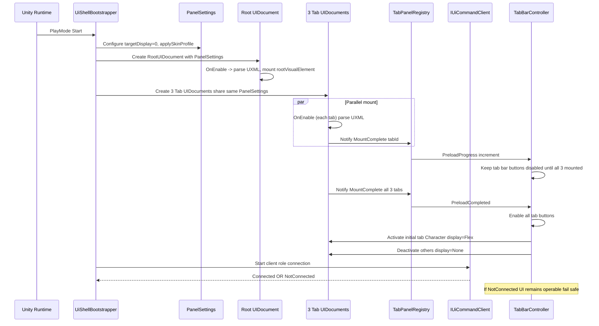
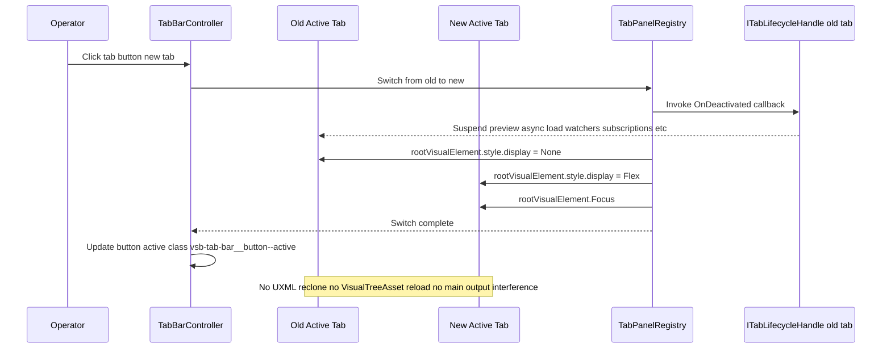
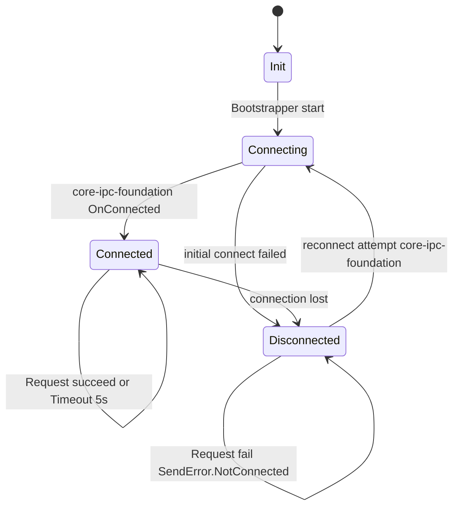
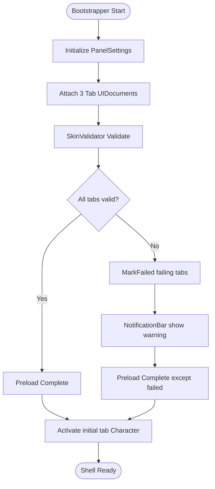

# Technical Design — ui-toolkit-shell

## Overview

**Purpose**: 本 spec は、Display 1 上に表示されるオペレーター向け UI の土台として **UI Toolkit シェル** を提供し、3 タブの器（Character Selection / Stage-Lighting / Camera-Switcher）・起動時一括プリロード基盤・非同期アセットロード基盤・IPC クライアントロール・共通 UI コンポーネントライブラリ・スキン差し替え拡張点を一体として確立する。

**Users**: 配信オペレーター（Display 1 上の UI を操作）、タブ spec 実装者（#4〜#6、本シェルの公開 API を利用してタブ機能を構築）、利用者プロジェクト（USS / UXML / ScriptableObject の差し替えでスキンをカスタマイズ）。

**Impact**: 現在の VTuberSystemBase にはメイン出力側のシェル（spec #2 `output-renderer-shell`）と IPC 基盤（spec #1 `core-ipc-foundation`）はあるが UI 側シェルが未定義。本 spec が UI 側の器を確立することで、Wave 3 タブ spec（#4〜#6）が「機能ロジックだけ」に集中できる契約境界を生み出す。タブ切替・非同期ロード・IPC 呼び分け・スキン規約の重複実装を構造的に回避する。

### Goals

- UI Toolkit ルート UIDocument（Display 1 限定、targetDisplay=0）を 1 つ所有し、タブバー + 3 タブ UIDocument の並置構成で起動する。
- 3 タブ分 UIDocument を起動時に一括プリロードし、以降のタブ切替を `style.display` の表示/非表示切替のみで完遂する（VisualTreeAsset の再 clone・再パースを発生させない）。
- メイン出力（Display 2+）の描画フレームを 1 フレームもフリーズさせない（同期 I/O・メインスレッドブロッキングをシェル層で禁止する）。
- Addressables ベースの非同期アセットロード基盤を提供し、Completion を Unity メインスレッドで配信する。
- `core-ipc-foundation` のクライアントロール（D-4）として `PublishState` / `PublishEvent` / `Request` を呼び分ける Command 送信 API と、メインスレッド配信の受信購読 API を公開する。
- USS セレクタ規約（`vsb-` プレフィクス + BEM 風）と ScriptableObject ベースの UXML 差し替え拡張点でスキンカスタマイズを可能にする。
- 共通 UI コンポーネント（Slider, ColorPicker, NumberedList, ToggleGroup）を独立 asmdef のライブラリとして提供する。
- メイン出力未接続時も UI 起動・タブ切替・タブ内操作が継続できるフェイルセーフを実装する。
- 後続 spec 実装が不在でも単独で「ルート UIDocument 生成 → 3 タブ空枠プリロード → タブ切替 → IPC クライアント接続試行」を完遂できる構造で、本 spec 単体のテスト可能性を確保する。

### Non-Goals

- 各タブの機能ロジック（spec #4〜#6 の責務）。本 spec は器と共通部品のみ。
- UI スキン（色・フォント・背景等）の具体デザイン資産（利用者プロジェクト側の責務）。
- メイン出力側のシーン骨格・ディスパッチャ・ディスプレイ切替（spec #2 の責務）。
- `core-ipc-foundation` のトランスポート・シリアライゼーション・接続管理（spec #1 の責務）。
- カメラ状態の OSC 伝送（spec #6 の責務）。
- タブ共通 UI 状態の永続化（UI-7 により永続化しない）。
- `runtime-display-selector-integration`（spec #7）との実接続（抽象点のみ提供）。

## Boundary Commitments

### This Spec Owns

- **ルート UIDocument + タブバー + 3 タブ UIDocument** の構築・アクティベート・解放（Requirement 1, 2）。
- **PanelSettings（targetDisplay=0）** 1 本を全 UIDocument で共有する設定と、Display 1 限定描画の構造的保証（Requirement 1.2, 1.7）。
- **3 タブ UIDocument の起動時一括プリロード**（VisualTreeAsset + StyleSheet のアタッチ完了）と、以降のタブ切替を `style.display` 切替のみで行う契約（Requirement 2, 3）。
- **Addressables Facade（`IAsyncAssetLoader`）** を介した非同期ロード基盤と、Completion の Unity メインスレッド配信（Requirement 4）。
- **Command 送信 API（`IUiCommandClient`）** と **受信購読 API（`IUiSubscriptionClient`）**：`core-ipc-foundation` の抽象を利用したクライアントロール、`PublishState` / `PublishEvent` / `Request` の呼び分け、受信のメインスレッド配信（Requirement 5）。
- **USS セレクタ命名規約（`vsb-` プレフィクス + BEM 風）** と **スキン差し替え拡張点（`UiToolkitShellSkinProfile` ScriptableObject）**（Requirement 6）。
- **共通 UI コンポーネントライブラリ**：Slider、ColorPicker、NumberedList、ToggleGroup（Requirement 7）。
- **スタンドアロン / Editor PlayMode 両対応**：Edit モードでの非常駐、ドメインリロード跨ぎなし（Requirement 8）。
- **メイン出力未接続時のフェイルセーフ**：UI 起動継続、タブ切替・共通コンポーネント動作、接続状態の可視化（Requirement 9）。
- **単独検証可能性**：後続タブ spec 不在での起動完遂、モック化対応（Requirement 10）。
- **観測性 / 診断可能性**：プリロード進捗、タブ切替所要時間、非同期ロード状況、IPC 送受信ログ、接続状態（Requirement 11）。
- **タブ ライフサイクル拡張点（`ITabLifecycleHandle`）**：タブ spec が非アクティブ化・再アクティブ化・解放タイミングに購読登録／解除を挿入できる拡張点（Requirement 2.8）。

### Out of Boundary

- タブコンテンツ UXML / USS の**実体**（タブ spec #4〜#6 が提供）。本 spec は配置規約・必須要素の検証規約・差し替え拡張点のみ所有。
- IPC トランスポート実装・接続マネージャ（`core-ipc-foundation` spec #1）。本 spec は抽象インタフェースの利用者。
- メイン出力シーンのコマンド受信側実装（`output-renderer-shell` spec #2）。本 spec はクライアントとしてコマンドを送るのみ。
- `RuntimeDisplaySelector` 実装（spec #7）。本 spec は差し替え可能な抽象点を残すのみ。
- UI スキンの色・フォント・背景等の**具体意匠**（利用者プロジェクト）。
- タブ spec が使う機能別アセット（アバター Prefab、ステージ Prefab 等）。本 spec は `IAsyncAssetLoader` 経由のロードを提供するのみ、アセット本体は管理しない。
- カメラ状態の OSC 伝送（spec #6 の責務、本 spec の Command 送信 API では扱わない）。

### Allowed Dependencies

- `core-ipc-foundation`（spec #1）の抽象インタフェース asmdef（トランスポート実装への依存はしない）。
- Unity 6.3 URP の UI Toolkit（`UnityEngine.UIElements`）。
- Unity Addressables パッケージ（`com.unity.addressables` 2.x 系）。
- Unity 標準ライブラリ（`System`, `System.Collections.Generic`, `UnityEngine` 等）。
- 本 spec 内の共通 UI コンポーネントライブラリ asmdef（内部参照）。

**禁止される依存**:
- `output-renderer-shell`（spec #2）の実装 asmdef。
- 特定タブ spec（#4〜#6）の実装 asmdef（参照方向は逆）。
- `core-ipc-foundation` の具体実装 asmdef（抽象のみを使う）。

### Revalidation Triggers

- **Command 送信 API の契約変更**（`IUiCommandClient` のメソッド追加・削除・シグネチャ変更）：タブ spec #4〜#6 の送信コード要再確認。
- **受信購読 API の契約変更**（`IUiSubscriptionClient` のコールバック型変更）：タブ spec #4〜#6 の受信コード要再確認。
- **タブ ライフサイクル拡張点の契約変更**（`ITabLifecycleHandle`）：タブ spec #4〜#6 の非アクティブ処理要再確認。
- **USS セレクタ命名規約の変更**：既存の利用者プロジェクトのスキン差し替え USS が無効化される可能性あり。SemVer major 相当として扱う。
- **`UiToolkitShellSkinProfile` のフィールド構成変更**：利用者プロジェクトの ScriptableObject アセット要再作成。
- **非同期ロード API の契約変更**（`IAsyncAssetLoader` の戻り値型変更）：タブ spec #4〜#6 のロード呼び出し要再確認。
- **PanelSettings 共有前提の変更**（独立 PanelSettings に変わる等）：メイン出力側の描画境界契約に影響、再レビュー要。
- **タブ ID / 初期アクティブタブ列挙の変更**（タブ数増減、識別子変更）：タブ spec と ShellBootstrapper の連動要再確認。

## Architecture

### Architecture Pattern & Boundary Map

**選定パターン**: **シェル（Facade + Composition Root）パターン** — `UiShellBootstrapper` がコンポジションルートとしてルート UIDocument・タブ UIDocument 群・PanelSettings・IPC クライアント・Asset Loader・Skin Profile を組み立てる。外部（タブ spec）に公開するのは最小限の Facade インタフェース（`IUiCommandClient`、`IUiSubscriptionClient`、`IAsyncAssetLoader`、`ITabLifecycleHandle`）のみ。

```mermaid
graph TB
    subgraph Display1[Display 1 UI Side]
        Bootstrapper[UiShellBootstrapper]
        Panel[PanelSettings targetDisplay 0]
        RootDoc[Root UIDocument tab bar]
        TabDocChar[Tab UIDocument Character]
        TabDocStage[Tab UIDocument Stage]
        TabDocCam[Tab UIDocument Camera]
        TabRegistry[TabPanelRegistry]
        SkinProfile[UiToolkitShellSkinProfile SO]
        CommonLib[Common UI Components Library]
        CommandClient[IUiCommandClient]
        SubClient[IUiSubscriptionClient]
        AssetLoader[IAsyncAssetLoader]
        ConnStatus[IConnectionStatus]
        DiagLog[DiagnosticsLogger]
    end
    subgraph CoreIPC[core-ipc-foundation asmdef abstract]
        IPCAbstract[IIpcClient abstract]
    end
    subgraph TabSpecs[Tab Specs 4 to 6 separate asmdef]
        TabChar[Character Selection Tab]
        TabStage[Stage Lighting Volume Tab]
        TabCam[Camera Switcher Tab]
    end
    subgraph OutputSide[Display 2 Plus Output Side]
        Dispatcher[Output Dispatcher server role]
    end
    Bootstrapper --> Panel
    Bootstrapper --> RootDoc
    Bootstrapper --> TabDocChar
    Bootstrapper --> TabDocStage
    Bootstrapper --> TabDocCam
    Bootstrapper --> TabRegistry
    Bootstrapper --> SkinProfile
    Bootstrapper --> CommandClient
    Bootstrapper --> SubClient
    Bootstrapper --> AssetLoader
    Bootstrapper --> ConnStatus
    RootDoc -. same PanelSettings .- Panel
    TabDocChar -. same PanelSettings .- Panel
    TabDocStage -. same PanelSettings .- Panel
    TabDocCam -. same PanelSettings .- Panel
    RootDoc --> CommonLib
    TabDocChar --> CommonLib
    TabDocStage --> CommonLib
    TabDocCam --> CommonLib
    CommandClient --> IPCAbstract
    SubClient --> IPCAbstract
    ConnStatus --> IPCAbstract
    IPCAbstract -. WebSocket JSON .- Dispatcher
    TabChar --> CommandClient
    TabChar --> SubClient
    TabChar --> AssetLoader
    TabChar --> TabRegistry
    TabStage --> CommandClient
    TabStage --> SubClient
    TabStage --> AssetLoader
    TabStage --> TabRegistry
    TabCam --> CommandClient
    TabCam --> SubClient
    TabCam --> AssetLoader
    TabCam --> TabRegistry
    AssetLoader --> DiagLog
    CommandClient --> DiagLog
    SubClient --> DiagLog
```



**Architecture Integration**:

- **Selected pattern**: Facade + Composition Root。`UiShellBootstrapper` がランタイム初期化と構成を一元管理し、タブ spec には最小 Facade のみ公開する。
- **Domain/feature boundaries**:
  - シェル層（本 spec）= UI の器、IPC クライアントロール、非同期ロード基盤、共通部品。
  - タブ層（spec #4〜#6）= タブ UXML/USS の実体、機能ロジック、Command 送受信の利用者。
  - メイン出力層（spec #2）= サーバロール、シーン反映。
- **Existing patterns preserved**:
  - `core-ipc-foundation` の「抽象 asmdef / 具体 asmdef 分離」を本 spec でも踏襲（抽象のみ依存）。
  - `output-renderer-shell` の「ディスパッチャ + Command 受け口」と対称な構造で「Command 送信 API + 受信購読 API」を提供。
  - D-3（受信は Unity メインスレッド配信）を踏襲。本 spec は `core-ipc-foundation` の保証をそのまま上位に伝える。
- **New components rationale**:
  - `UiShellBootstrapper`: 初期化順序・ライフサイクルを一元管理（Editor PlayMode 対応含む）。
  - `TabPanelRegistry`: 3 タブ UIDocument の OnEnable 完了追跡とタブ切替イベント発火。
  - `IAsyncAssetLoader` Facade: Addressables API を抽象化し Completion の型安全配信。
  - `UiToolkitShellSkinProfile` SO: UXML / USS 差し替えの Editor 直感 UX。
- **Steering compliance**: `.kiro/steering/` は未整備のため、`CLAUDE.md` の「Spec-Driven Development」と `docs/requirements.md` §3.1, §4, §6.1 の性能契約に整合。

### Technology Stack

| Layer | Choice / Version | Role in Feature | Notes |
|-------|------------------|-----------------|-------|
| UI Toolkit | Unity 6.3 URP 標準 (`UnityEngine.UIElements`, 6000.3 系) | ルート UIDocument、タブ UIDocument、PanelSettings、VisualTreeAsset、StyleSheet、VisualElement | `targetDisplay = 0` で Display 1 限定、同一 PanelSettings を 4 枚の UIDocument で共有 |
| Async Asset Loading | Unity Addressables `com.unity.addressables` 2.x | 非同期ロード基盤の下回り | `LoadAssetAsync<T>` / `Release` / `AsyncOperationHandle<T>.Completed` を利用、`WaitForCompletion` 禁止 |
| IPC Client | `core-ipc-foundation` 抽象 asmdef（spec #1） | クライアントロール、Command 送信、受信購読 | 具体実装（WebSocket / JSON）には依存しない |
| Config / Skin Profile | Unity ScriptableObject | UXML / USS 差し替え拡張点、既定スキン参照 | Editor の Inspector で差し替え |
| Assembly Boundaries | asmdef 分割 | シェル本体 / 共通 UI コンポーネントライブラリを別 asmdef、抽象 asmdef のみ公開依存 | 参照方向: タブ spec → 共通 UI → シェル本体 → core-ipc-foundation 抽象 |
| Logging | `UnityEngine.Debug`（既定）+ `IDiagnosticsLogger` 抽象 | 診断ログ | ログレベル切替、UI 側診断領域への出力経路、メイン出力（Display 2+）には描画しない |

> 詳細な API 調査・代替案却下理由・性能推定は `research.md` 参照。

## File Structure Plan

### Directory Structure

```
Packages/com.hidano.vtuber-system-base.ui-toolkit-shell/
├── Runtime/
│   ├── Bootstrap/
│   │   ├── UiShellBootstrapper.cs         # 初期化ランタイムエントリポイント、PlayMode ライフサイクル
│   │   ├── UiShellLifecycleDriver.cs      # Edit モード非常駐、ドメインリロード跨ぎなし
│   │   └── UiShellConfig.cs               # 設定読込 (初期アクティブタブ等)
│   ├── Panels/
│   │   ├── TabPanelRegistry.cs            # 3 タブ UIDocument の追跡、プリロード完了判定
│   │   ├── TabBarController.cs            # タブバーのイベントハンドリング、表示切替駆動
│   │   ├── RootUiDocumentBuilder.cs       # ルート UIDocument の生成、PanelSettings 設定
│   │   └── ITabLifecycleHandle.cs         # タブ spec 向け公開インタフェース (IDisposable)
│   ├── Commands/
│   │   ├── IUiCommandClient.cs            # 公開: PublishState / PublishEvent / Request
│   │   ├── UiCommandClient.cs             # core-ipc-foundation 抽象への Facade
│   │   ├── IUiSubscriptionClient.cs       # 公開: Subscribe / Unsubscribe
│   │   ├── UiSubscriptionClient.cs        # 受信購読 Facade、メインスレッドディスパッチ
│   │   ├── SendResult.cs                  # Result 型 (SendOk / SendError discriminated union)
│   │   └── IConnectionStatus.cs           # 接続状態 (IsConnected / event OnStatusChanged)
│   ├── AssetLoading/
│   │   ├── IAsyncAssetLoader.cs           # 公開: LoadAsync / Release / ReleaseAll
│   │   ├── AddressablesAssetLoader.cs     # 本番実装 (Addressables)
│   │   ├── AssetLoadHandle.cs             # ハンドル型 (scopeId, key, state)
│   │   └── AssetLoadResult.cs             # Result 型 (LoadOk<T> / LoadError)
│   ├── Skin/
│   │   ├── UiToolkitShellSkinProfile.cs   # ScriptableObject: UXML + USS 差し替え
│   │   └── SkinValidator.cs               # 必須クラス名走査検証
│   ├── Diagnostics/
│   │   ├── IDiagnosticsLogger.cs          # 公開: Log (Level, Category, Message, Context)
│   │   ├── DiagnosticsLogger.cs           # Unity Debug + UI 診断領域への多重出力
│   │   ├── ShellDiagnosticsSnapshot.cs    # プリロード進捗 / ロード中件数 / IPC 状態の読取
│   │   └── NotificationBarController.cs   # UI 通知バーへの描画駆動
│   ├── FailsafeAndConnection/
│   │   └── MainOutputStatusWatcher.cs     # Display 1 フォールバック検出と通知バー連動
│   └── UiToolkitShell.Runtime.asmdef      # シェル本体 asmdef (抽象 IPC と Addressables に依存)
├── Runtime.UxmlUss/
│   ├── TabBar.uxml / TabBar.uss           # ルート UIDocument 既定 UXML/USS
│   ├── NotificationBar.uxml / .uss        # 通知バー既定
│   ├── EmptyTabShell.uxml                 # タブ空枠 (Requirement 10.2)
│   └── DefaultSkinProfile.asset           # 既定スキン SO (Runtime 同梱)
├── Runtime.CommonUi/
│   ├── Controls/
│   │   ├── VsbSlider.cs / .uxml / .uss         # 数値スライダー (UXML カスタムコントロール)
│   │   ├── VsbColorPicker.cs / .uxml / .uss    # RGB/HSV 色選択
│   │   ├── VsbNumberedList.cs / .uxml / .uss   # 可変長整列リスト
│   │   └── VsbToggleGroup.cs / .uxml / .uss    # 排他選択
│   ├── CommonUiRegistration.cs                  # UxmlFactory 登録、USS 登録
│   └── UiToolkitShell.CommonUi.asmdef           # 共通 UI ライブラリ asmdef
├── Editor/
│   ├── SkinProfileEditor.cs                # Inspector カスタム (利用者向け UX)
│   └── UiToolkitShell.Editor.asmdef
└── Tests/
    ├── Runtime/
    │   ├── TabPanelRegistryTests.cs       # プリロード完了判定
    │   ├── TabSwitchTests.cs              # display 切替のみ・再 clone なし
    │   ├── AsyncAssetLoaderTests.cs       # Fake 実装での Completion メインスレッド配信
    │   ├── UiCommandClientTests.cs        # PublishState / PublishEvent / Request 呼び分け
    │   ├── FailsafeTests.cs               # 未接続時の起動継続・送信エラー返却
    │   └── SkinValidatorTests.cs          # 必須クラス欠落検出
    ├── PlayMode/
    │   └── UiShellPlayModeSample.unity    # 手動検証用最小シーン
    └── UiToolkitShell.Tests.asmdef
```

### Modified Files

- なし（本 spec は新規パッケージとして追加される）。

**参照方向**（Dependency Direction の強制）:
```
tab spec asmdef  →  UiToolkitShell.CommonUi  →  UiToolkitShell.Runtime  →  core-ipc-foundation abstract asmdef
                                                        ↓
                                                  com.unity.addressables
```
上記矢印の逆方向への import は禁止。レビューで違反検出した場合はエラー扱い。

## System Flows

### Flow 1: 起動 → プリロード → 初期タブ表示



**Key decisions**:
- タブボタンはプリロード完了まで非活性（Requirement 2.7, 3.2）。
- 初期タブ（Character）の表示化は全タブ Mount 完了後のみ。
- IPC 接続は UI 描画ループと独立して試行（未接続でも UI 起動継続、Requirement 9.1）。

### Flow 2: タブ切替（表示/非表示のみ、再 clone なし）



**Key decisions**:
- `ITabLifecycleHandle.OnDeactivated` / `OnActivated` は純粋コールバックとして発火。I/O 待ちは禁止（非同期処理はタブ側で起動のみ → 再アクティブ化時に結果参照）。
- `Focus()` 呼出しは R-9（入力フォーカス競合）の対策。
- タブ切替所要時間は診断ログに記録（Requirement 11.2）。

### Flow 3: Command 送信（接続状態による分岐）



**Key decisions**:
- 接続未確立時 `IUiCommandClient.Publish*` は即時 `SendError.NotConnected` を返す（即時エラー返却方式、R-5）。
- `IConnectionStatus` の状態変化は `PublishState` で通知バーに反映（誤配信警告と連動、OR-1）。

## Requirements Traceability

| Requirement | Summary | Components | Interfaces | Flows |
|-------------|---------|------------|------------|-------|
| 1.1 | ルート UIDocument 提供・起動時生成 | UiShellBootstrapper, RootUiDocumentBuilder | — | Flow 1 |
| 1.2 | Display 1 (targetDisplay=0) 割当 | UiShellBootstrapper, PanelSettings | — | Flow 1 |
| 1.3 | タブバー領域 + タブコンテンツ領域の階層 | RootUiDocumentBuilder, TabPanelRegistry | — | Flow 1 |
| 1.4 | 任意のタブ操作可能化前に構築完了 | UiShellBootstrapper, TabPanelRegistry | — | Flow 1 |
| 1.5 | asmdef 内で生成・管理、公開 API のみ外部アクセス | UiToolkitShell.Runtime.asmdef | IUiCommandClient, IUiSubscriptionClient, IAsyncAssetLoader, ITabLifecycleHandle | — |
| 1.6 | RDS 差し替え可能な抽象点（Display 1 割当） | UiShellBootstrapper.DisplayAssignmentHook | IDisplayAssignmentStrategy (future) | — |
| 1.7 | Display 2+ に一切描画しない | PanelSettings (targetDisplay=0) | — | Flow 1 |
| 2.1 | 3 タブ論理枠 | TabPanelRegistry, TabBarController | ITabLifecycleHandle | Flow 2 |
| 2.2 | 切替操作 UI + アクティブ視覚識別 | TabBarController (TabBar.uxml/.uss) | — | Flow 2 |
| 2.3 | タブ切替で display 切替 | TabPanelRegistry | — | Flow 2 |
| 2.4 | UIDocument 再インスタンス化禁止 | TabPanelRegistry | — | Flow 2 |
| 2.5 | タブ切替はメインスレッド完結 | TabPanelRegistry | — | Flow 2 |
| 2.6 | 任意タイミングでの切替受付 | TabBarController | — | Flow 2 |
| 2.7 | プリロード未完了時は非活性 | TabBarController, TabPanelRegistry | — | Flow 1 |
| 2.8 | 切替イベントをタブ spec が購読可能 | TabPanelRegistry | ITabLifecycleHandle | Flow 2 |
| 2.9 | メイン出力描画フレーム干渉禁止 | TabPanelRegistry, TabBarController | — | Flow 2 |
| 3.1 | 3 タブ UIDocument プリロード | UiShellBootstrapper, TabPanelRegistry | — | Flow 1 |
| 3.2 | 非活性表示保持 | TabBarController | — | Flow 1 |
| 3.3 | 完了時の活性化と初期タブ表示 | UiShellBootstrapper, TabBarController | — | Flow 1 |
| 3.4 | VisualTreeAsset / StyleSheet / 共通 UI 限定 | UiShellBootstrapper, TabPanelRegistry | — | — |
| 3.5 | 失敗時ログ記録・該当タブのみ非活性 | TabPanelRegistry, DiagnosticsLogger, NotificationBarController | — | — |
| 3.6 | 再 clone なし | TabPanelRegistry | — | Flow 2 |
| 3.7 | プリロード進捗診断 API | ShellDiagnosticsSnapshot | IDiagnosticsLogger | — |
| 4.1 | Addressables 一次実装、AssetBundle API 非公開 | AddressablesAssetLoader | IAsyncAssetLoader | — |
| 4.2 | ワーカースレッドで I/O | AddressablesAssetLoader | IAsyncAssetLoader | — |
| 4.3 | Completion をメインスレッド配信 | AddressablesAssetLoader | IAsyncAssetLoader | — |
| 4.4 | 失敗事由を Completion に付与 | AddressablesAssetLoader, AssetLoadResult | IAsyncAssetLoader | — |
| 4.5 | ロード中 UI 操作可能保持 | TabBarController, common Controls | — | — |
| 4.6 | メイン出力描画フレーム干渉禁止 | AddressablesAssetLoader | — | — |
| 4.7 | 重複ロード抑止 / 複数 Completion 配信 | AddressablesAssetLoader (handle cache) | IAsyncAssetLoader | — |
| 4.8 | アンロード API | AddressablesAssetLoader | IAsyncAssetLoader (Release, ReleaseAll) | — |
| 4.9 | 非同期ロード状況診断 API | ShellDiagnosticsSnapshot | — | — |
| 5.1 | クライアントロール起動 | UiCommandClient, UiShellBootstrapper | IUiCommandClient | — |
| 5.2 | Command 送信 API 3 系統 | UiCommandClient | IUiCommandClient | Flow 3 |
| 5.3 | state コマンドを PublishState へ | UiCommandClient | — | Flow 3 |
| 5.4 | event コマンドを PublishEvent へ | UiCommandClient | — | Flow 3 |
| 5.5 | Request の Response をメインスレッド返却 | UiCommandClient | — | Flow 3 |
| 5.6 | 受信購読 API、メインスレッド配信 | UiSubscriptionClient | IUiSubscriptionClient | — |
| 5.7 | 購読登録・解除の公開 API | UiSubscriptionClient, TabPanelRegistry | IUiSubscriptionClient, ITabLifecycleHandle | Flow 2 |
| 5.8 | asmdef 隔離 | UiToolkitShell.Runtime.asmdef | — | — |
| 5.9 | 送信エラーの呼出元伝搬、UI クラッシュなし | UiCommandClient, SendResult | IUiCommandClient | Flow 3 |
| 5.10 | 直接トランスポート呼出禁止 | UiToolkitShell.Runtime.asmdef (dependency isolation) | — | — |
| 6.1 | UXML/USS 配置規約 | SkinValidator, UiToolkitShellSkinProfile | — | — |
| 6.2 | USS セレクタ命名規約 (vsb- BEM) | SkinValidator | — | — |
| 6.3 | 追加 USS の上書き適用 | UiShellBootstrapper (applySkinProfile) | UiToolkitShellSkinProfile | — |
| 6.4 | UXML 差し替え拡張点 | UiShellBootstrapper, UiToolkitShellSkinProfile | — | — |
| 6.5 | 規約違反の起動時検出 | SkinValidator | IDiagnosticsLogger | — |
| 6.6 | UXML 差し替え不足時の該当タブ非活性 | SkinValidator, TabPanelRegistry, NotificationBarController | — | — |
| 6.7 | パッケージフォーク不要 | UiToolkitShellSkinProfile (SO 差し替え) | — | — |
| 6.8 | 既定スキンでの起動継続 | DefaultSkinProfile.asset, UiShellBootstrapper | — | — |
| 7.1 | 共通 UI コンポーネント 4 種 | VsbSlider, VsbColorPicker, VsbNumberedList, VsbToggleGroup | — | — |
| 7.2 | UXML カスタムコントロール + USS + C# | CommonUiRegistration | — | — |
| 7.3 | USS セレクタ命名規約適用 | Common Controls USS | — | — |
| 7.4 | 値変更等のイベント公開 | Common Controls C# | — | — |
| 7.5 | 独立 asmdef | UiToolkitShell.CommonUi.asmdef | — | — |
| 7.6 | 独自パーツ実装妨げない | — (参照方向のみ制約) | — | — |
| 7.7 | メインスレッドブロッキング禁止 | Common Controls C# | — | — |
| 8.1 | スタンドアロン自動起動 | UiShellLifecycleDriver, UiShellBootstrapper | — | Flow 1 |
| 8.2 | PlayMode 自動起動 | UiShellLifecycleDriver | — | Flow 1 |
| 8.3 | PlayMode 停止時の完全解放 | UiShellLifecycleDriver, UiShellBootstrapper | — | — |
| 8.4 | PlayMode 反復時のリーク回避 | UiShellLifecycleDriver | — | — |
| 8.5 | Edit モード非常駐 | UiShellLifecycleDriver | — | — |
| 8.6 | ドメインリロード跨ぎなし | UiShellLifecycleDriver | — | — |
| 8.7 | スタンドアロン / PlayMode で API 同一 | UiShellBootstrapper (shared implementation) | — | — |
| 9.1 | メイン出力未接続時も起動継続 | UiShellBootstrapper (connection independent startup) | — | Flow 1 |
| 9.2 | 未接続中も UI 描画・操作継続 | TabBarController, TabPanelRegistry | — | — |
| 9.3 | 後接続時の送信開始 | UiCommandClient, IConnectionStatus | — | Flow 3 |
| 9.4 | 未接続時の送信エラー伝搬 | UiCommandClient, SendResult | — | Flow 3 |
| 9.5 | 接続断 / 再接続の UI 表示 | IConnectionStatus, NotificationBarController | — | — |
| 9.6 | Display 1 フォールバック警告 | MainOutputStatusWatcher, NotificationBarController | — | — |
| 9.7 | 接続有無独立の機能動作 | UiShellBootstrapper (independent components) | — | — |
| 10.1 | タブ spec 不在での単独起動完遂 | EmptyTabShell.uxml, TabPanelRegistry | — | — |
| 10.2 | タブ空枠提供 | EmptyTabShell.uxml, TabPanelRegistry | — | — |
| 10.3 | 自己ループでのダミー送受信検証 | UiCommandClientTests | — | — |
| 10.4 | PlayMode 手動検証手順 | UiShellPlayModeSample.unity | — | — |
| 10.5 | シェル単体テストケース | UiToolkitShell.Tests.asmdef (multiple test files) | — | — |
| 10.6 | IPC モック受け入れ | FakeIpcClient (tests) | IUiCommandClient, IUiSubscriptionClient | — |
| 10.7 | 非同期ロード モック受け入れ | FakeAsyncAssetLoader (tests) | IAsyncAssetLoader | — |
| 11.1 | プリロードログ | UiShellBootstrapper, TabPanelRegistry, DiagnosticsLogger | — | Flow 1 |
| 11.2 | タブ切替ログ | TabBarController, DiagnosticsLogger | — | Flow 2 |
| 11.3 | 非同期ロードログ | AddressablesAssetLoader, DiagnosticsLogger | — | — |
| 11.4 | Command 送信ログ | UiCommandClient, DiagnosticsLogger | — | Flow 3 |
| 11.5 | 受信ログ | UiSubscriptionClient, DiagnosticsLogger | — | — |
| 11.6 | 接続断 / 再接続ログ | MainOutputStatusWatcher, DiagnosticsLogger | — | — |
| 11.7 | メイン出力に描画しない | DiagnosticsLogger (UI 側チャネルのみ) | — | — |
| 11.8 | ログレベル切替 | DiagnosticsLogger | — | — |
| 11.9 | 診断状態取得 API | ShellDiagnosticsSnapshot | — | — |

## Components and Interfaces

| Component | Domain/Layer | Intent | Req Coverage | Key Dependencies (P0/P1) | Contracts |
|-----------|--------------|--------|--------------|--------------------------|-----------|
| UiShellBootstrapper | Bootstrap | シェル全体のコンポジションルート、PlayMode 起動/停止駆動 | 1.1, 1.4, 3.1, 5.1, 8.1, 8.2, 9.1, 9.7 | UiShellLifecycleDriver (P0), TabPanelRegistry (P0), UiCommandClient (P0), AddressablesAssetLoader (P0), UiToolkitShellSkinProfile (P0) | Service |
| UiShellLifecycleDriver | Bootstrap | Unity ライフサイクル統合 (PlayMode/Standalone の両対応、Edit モード非常駐) | 8.1, 8.2, 8.3, 8.4, 8.5, 8.6 | UiShellBootstrapper (P0) | Service |
| TabPanelRegistry | Panels | 3 タブ UIDocument の追跡、プリロード完了判定、切替イベント駆動、ライフサイクルハンドル発行 | 1.3, 2.1, 2.3, 2.4, 2.5, 2.8, 3.1, 3.3, 3.5, 3.6, 3.7, 5.7, 10.1, 10.2 | UiShellBootstrapper (P0), TabBarController (P0), DiagnosticsLogger (P1) | Service, Event, State |
| TabBarController | Panels | タブバー UI（3 ボタン）の操作ハンドラ、アクティブ識別、プリロード完了までの非活性制御 | 1.3, 2.2, 2.6, 2.7, 3.2, 3.3, 9.2 | TabPanelRegistry (P0), DiagnosticsLogger (P1) | Event |
| RootUiDocumentBuilder | Panels | ルート UIDocument 生成、PanelSettings 設定、タブバー UXML / NotificationBar UXML の載せ込み | 1.1, 1.2, 1.3, 1.7 | UiToolkitShellSkinProfile (P0) | — |
| UiCommandClient | Commands | Command 送信 Facade（PublishState / PublishEvent / Request）、SendResult 返却 | 5.1, 5.2, 5.3, 5.4, 5.5, 5.9, 5.10, 9.3, 9.4, 11.4 | core-ipc-foundation 抽象 (P0), IConnectionStatus (P0), DiagnosticsLogger (P1) | Service |
| UiSubscriptionClient | Commands | 受信購読 Facade、メインスレッド配信、購読登録/解除 | 5.6, 5.7, 5.8, 11.5 | core-ipc-foundation 抽象 (P0), DiagnosticsLogger (P1) | Service, Event |
| IConnectionStatus | Commands | 接続状態の公開（IsConnected + 状態変化イベント） | 5.9, 9.3, 9.5, 11.6 | core-ipc-foundation 抽象 (P0) | State, Event |
| AddressablesAssetLoader | AssetLoading | Addressables の Facade、ハンドルキャッシュ、scope 管理、Release 一括 | 4.1, 4.2, 4.3, 4.4, 4.6, 4.7, 4.8, 4.9, 11.3 | Unity Addressables (P0), DiagnosticsLogger (P1) | Service |
| UiToolkitShellSkinProfile | Skin | ScriptableObject による UXML / USS 差し替え参照 | 6.3, 6.4, 6.7, 6.8 | RootUiDocumentBuilder (P0), TabPanelRegistry (P0) | State |
| SkinValidator | Skin | USS セレクタ命名規約の必須クラス走査検証 | 6.1, 6.2, 6.5, 6.6 | TabPanelRegistry (P0), DiagnosticsLogger (P1) | Service |
| DiagnosticsLogger | Diagnostics | ログ出力の一元化 (ログレベル切替、UI 診断領域 + Unity Console、メイン出力への非描画保証) | 11.1, 11.2, 11.3, 11.4, 11.5, 11.6, 11.7, 11.8 | NotificationBarController (P1) | Service |
| NotificationBarController | Diagnostics | 通知バーへの警告・接続状態・Display フォールバック警告の描画駆動 | 6.6, 9.5, 9.6 | DiagnosticsLogger (P1) | Event |
| ShellDiagnosticsSnapshot | Diagnostics | 診断状態の読取 API（プリロード進捗 / 非同期ロード進行中件数 / IPC 状態 / 登録ハンドラ数） | 3.7, 4.9, 11.9 | 全サービス (P1, read-only) | State |
| MainOutputStatusWatcher | FailsafeAndConnection | メイン出力側 `output/display/fallback` state 購読、Display 1 フォールバック検出 | 9.6 | UiSubscriptionClient (P0), NotificationBarController (P1) | Event |
| VsbSlider / VsbColorPicker / VsbNumberedList / VsbToggleGroup | CommonUi | 共通 UI コンポーネント 4 種（UXML カスタムコントロール + USS + C#） | 7.1, 7.2, 7.3, 7.4, 7.7 | — | Event |
| CommonUiRegistration | CommonUi | UxmlFactory 登録、既定 USS 登録 | 7.2, 7.5 | — | Service |

### Bootstrap

#### UiShellBootstrapper

| Field | Detail |
|-------|--------|
| Intent | シェル全体のコンポジションルート。PlayMode 開始時に全サブシステムを構築、停止時に逆順で解放。 |
| Requirements | 1.1, 1.4, 3.1, 5.1, 8.1, 8.2, 9.1, 9.7 |

**Responsibilities & Constraints**
- 初期化順序: `PanelSettings` → `RootUiDocument` → 3 `TabUIDocument` → `TabPanelRegistry` / `TabBarController` → `SkinValidator` 実行 → `AddressablesAssetLoader` → `UiCommandClient` / `UiSubscriptionClient` → `MainOutputStatusWatcher` → `IPC 接続試行`。
- IPC 接続試行は初期化後に非同期で発火。未接続でも UI 起動は完了する（Requirement 9.1）。
- 解放は逆順。`Dispose` パターンで全ハンドル / 購読を解除。
- ドメインリロード跨ぎの静的状態を保持しない（Requirement 8.6）。

**Dependencies**
- Inbound: `UiShellLifecycleDriver` — ライフサイクル駆動 (P0)
- Outbound: `TabPanelRegistry`, `UiCommandClient`, `AddressablesAssetLoader`, `UiToolkitShellSkinProfile` — 全て P0
- External: Unity UI Toolkit（`UIDocument`, `PanelSettings`）(P0), Unity Addressables (P0), core-ipc-foundation 抽象 asmdef (P0)

**Contracts**: Service [x] / API [ ] / Event [ ] / Batch [ ] / State [ ]

##### Service Interface

```csharp
public interface IUiShellBootstrapper
{
    BootstrapResult StartShell(UiShellConfig config);
    void StopShell();
    bool IsRunning { get; }
}

public readonly struct BootstrapResult
{
    public bool Success { get; }
    public BootstrapErrorCode? Error { get; }
    public string? Detail { get; }
}

public enum BootstrapErrorCode
{
    SkinProfileMissing,
    PanelSettingsAssignFailed,
    TabUxmlAttachFailed,
    AddressablesInitFailed,
    IpcAbstractionUnavailable
}
```
- Preconditions: Unity が PlayMode または Standalone 実行中。`UiShellConfig` に有効な `SkinProfile` が設定済み。
- Postconditions: `StartShell` 成功後、ルート UIDocument と 3 タブ UIDocument が PanelSettings に紐付き、プリロードは開始済みまたは完了。IPC 接続は試行済み。
- Invariants: `StopShell` を呼ぶまで同一スレッドから再 `StartShell` を呼ばれない（呼ばれた場合は no-op）。

**Implementation Notes**
- Integration: `UiShellLifecycleDriver` が `RuntimeInitializeOnLoadMethod` / `ExecuteAlways` / PlayMode コールバック経由で駆動する。
- Validation: `UiShellConfig` 検証は `StartShell` 冒頭で実施、失敗時は `BootstrapErrorCode` を返却しランタイムは起動しない。
- Risks: 複数のシーンで誤って二重初期化されるリスク → `IsRunning` ガードで対処。

#### UiShellLifecycleDriver

| Field | Detail |
|-------|--------|
| Intent | Unity のライフサイクル（PlayMode 開始・停止、アプリ終了、ドメインリロード）を監視し、`UiShellBootstrapper` の Start/Stop を駆動する。 |
| Requirements | 8.1, 8.2, 8.3, 8.4, 8.5, 8.6 |

**Responsibilities & Constraints**
- `[RuntimeInitializeOnLoadMethod(RuntimeInitializeLoadType.BeforeSceneLoad)]` で Standalone / PlayMode 開始時に起動をフック。
- `EditorApplication.playModeStateChanged` を Editor 限定でフック（PlayMode 終了時に `StopShell` を呼ぶ）。
- Edit モードでは一切の初期化を行わない（Requirement 8.5）。
- `Application.quitting` イベントで Standalone 終了時の解放を保証。

**Dependencies**
- Outbound: `UiShellBootstrapper` (P0)
- External: Unity Editor コールバック (Editor 限定、P1), `Application` ライフサイクルイベント (P0)

**Contracts**: Service [x] / API [ ] / Event [ ] / Batch [ ] / State [ ]

##### Service Interface

```csharp
internal static class UiShellLifecycleDriver
{
    [RuntimeInitializeOnLoadMethod(RuntimeInitializeLoadType.BeforeSceneLoad)]
    public static void OnRuntimeStart();
    // Internally subscribes to Application.quitting and (Editor-only) EditorApplication.playModeStateChanged.
}
```
- Preconditions: Unity ランタイム（PlayMode または Standalone）。
- Postconditions: `UiShellBootstrapper.StartShell` が呼ばれ、停止タイミングで `StopShell` が呼ばれる。
- Invariants: Edit モード下では `StartShell` を呼ばない。

**Implementation Notes**
- Integration: Editor 限定コードは `#if UNITY_EDITOR` で囲み、Standalone ビルドに含めない。
- Risks: ドメインリロード直後の `RuntimeInitializeOnLoadMethod` 呼び出しタイミングが Unity バージョンで変わる可能性 → Unity 6.3 で動作確認済みの `BeforeSceneLoad` を採用し、問題発生時は `AfterSceneLoad` にフォールバック。

### Panels

#### TabPanelRegistry

| Field | Detail |
|-------|--------|
| Intent | 3 タブ UIDocument の OnEnable 完了追跡、プリロード完了判定、タブ切替イベント駆動、`ITabLifecycleHandle` 発行。 |
| Requirements | 1.3, 2.1, 2.3, 2.4, 2.5, 2.8, 3.1, 3.3, 3.5, 3.6, 3.7, 5.7, 10.1, 10.2 |

**Responsibilities & Constraints**
- タブ識別子 `TabId` の列挙定義とそれぞれに対応する `UIDocument` 参照を保持。
- 各タブ UIDocument の `rootVisualElement != null` を OnEnable イベント経由で検出しプリロード完了を判定。
- タブ切替 API: `SwitchTo(TabId)` は表示/非表示切替のみで完遂、VisualTreeAsset の再 clone を発生させない（Requirement 2.4, 3.6）。
- タブ spec が登録する `ITabLifecycleHandle` を内部に保持し、`OnActivated` / `OnDeactivated` / `OnDisposed` をメインスレッドから呼び分け。
- プリロード失敗（Requirement 3.5）は該当タブのみ非活性化し、他タブとシェル全体は正常継続。

**Dependencies**
- Inbound: `UiShellBootstrapper` (P0), `TabBarController` (P0)
- Outbound: `DiagnosticsLogger` (P1)
- External: UI Toolkit (`UIDocument`, `VisualElement`) (P0)

**Contracts**: Service [x] / API [ ] / Event [x] / Batch [ ] / State [x]

##### Service Interface

```csharp
public interface ITabPanelRegistry
{
    PreloadProgress GetPreloadProgress();
    bool IsPreloadComplete { get; }
    TabId ActiveTab { get; }
    SwitchResult SwitchTo(TabId target);
    ITabLifecycleHandle RegisterTab(TabId tabId, TabMetadata metadata);
    event Action<TabSwitchEvent> OnTabSwitched;
    event Action<PreloadEvent> OnPreloadChanged;
}

public enum TabId
{
    Character,
    StageLighting,
    CameraSwitcher
}

public readonly struct PreloadProgress
{
    public int LoadedCount { get; }
    public int TotalCount { get; }
    public IReadOnlyList<TabId> FailedTabs { get; }
}

public readonly struct SwitchResult
{
    public bool Success { get; }
    public SwitchErrorCode? Error { get; }
}

public enum SwitchErrorCode
{
    PreloadIncomplete,
    TabDisabled,
    AlreadyActive
}

public readonly struct TabSwitchEvent
{
    public TabId From { get; }
    public TabId To { get; }
    public TimeSpan Duration { get; }
}

public readonly struct PreloadEvent
{
    public TabId TabId { get; }
    public PreloadOutcome Outcome { get; }
}

public enum PreloadOutcome
{
    Started,
    Succeeded,
    Failed
}

public interface ITabLifecycleHandle : IDisposable
{
    TabId TabId { get; }
    event Action OnActivated;
    event Action OnDeactivated;
    // Dispose unregisters all callbacks; shell ensures no leaked subscriptions.
}
```
- Preconditions: `RegisterTab` は `UiShellBootstrapper.StartShell` 後にのみ呼ばれる。
- Postconditions: `SwitchTo` は同期的に `rootVisualElement.style.display` を設定し、`OnTabSwitched` を同一フレームで発火。
- Invariants: 同時に「表示状態」にあるタブは高々 1 つ。`IsPreloadComplete == false` のとき `SwitchTo` は `PreloadIncomplete` を返却。

##### Event Contract

- Published events:
  - `OnTabSwitched` : `TabSwitchEvent` — タブ切替完了時にメインスレッドで発火。
  - `OnPreloadChanged` : `PreloadEvent` — プリロード開始・成功・失敗の各段階で発火。
- Subscribed events: `UIDocument.OnEnable` 相当（内部でラップ）。
- Ordering / delivery guarantees: 全てメインスレッド、同期発火。同一フレーム内で複数登録ハンドラが実行される順序は登録順。

##### State Management

- State model: `TabId → TabState { IUIDocument, IsPreloaded, IsFailed, ITabLifecycleHandle? }` のマップ。
- Persistence & consistency: 永続化なし（UI-7）。PlayMode 開始のたびにゼロから構築。
- Concurrency strategy: メインスレッド専有。ワーカースレッドからのアクセスは契約違反（`throw`）。

**Implementation Notes**
- Integration: 各タブ spec は `UiShellBootstrapper` 起動後に `RegisterTab(tabId, metadata)` を呼び、返却された `ITabLifecycleHandle` を保持。タブ解放時は `Dispose` を呼ぶ（R-10 対策）。
- Validation: 登録時の UXML / USS 配置規約違反は `SkinValidator` で検証済み、失敗タブは `IsFailed = true` で登録され `SwitchTo` は `TabDisabled` を返却。
- Risks: タブ spec が `Dispose` を呼ばないと購読リーク → `IDisposable` パターンに加え、`UiShellBootstrapper.StopShell` 時に全ハンドルを強制 Dispose するバックストップを持つ。

#### TabBarController

| Field | Detail |
|-------|--------|
| Intent | タブバー UI（3 ボタン + 通知バー）のイベントハンドリング、アクティブタブ識別の視覚表現、プリロード完了までの非活性制御。 |
| Requirements | 1.3, 2.2, 2.6, 2.7, 3.2, 3.3, 9.2 |

**Responsibilities & Constraints**
- タブボタンのクリックで `TabPanelRegistry.SwitchTo` を呼ぶ。
- プリロード未完了中はボタンに `.vsb-tab-bar__button--disabled` クラスを付与（操作不可）。
- アクティブタブボタンに `.vsb-tab-bar__button--active` クラス付与。
- プリロード完了時に初期アクティブタブ（Character）へ切替。
- タブ切替所要時間をログ出力（Requirement 11.2）。

**Dependencies**
- Inbound: `UiShellBootstrapper` (P0)
- Outbound: `TabPanelRegistry` (P0), `DiagnosticsLogger` (P1)

**Contracts**: Service [ ] / API [ ] / Event [x] / Batch [ ] / State [ ]

##### Event Contract

- Subscribed events: `TabPanelRegistry.OnPreloadChanged`, `TabPanelRegistry.OnTabSwitched`。
- Ordering: メインスレッド、同期配信。

**Implementation Notes**
- Integration: ルート UIDocument（`TabBar.uxml`）内のボタンイベントを `Button.clicked += () => Registry.SwitchTo(...)` で結線。
- Risks: プリロード失敗したタブへの切替を UI が許可してしまう事故 → ボタン非活性クラスで表現、さらに `SwitchTo` 呼出しで `TabDisabled` をチェックしボタン状態を再同期。

#### RootUiDocumentBuilder

| Field | Detail |
|-------|--------|
| Intent | ルート UIDocument の生成、PanelSettings 設定、タブバー UXML / NotificationBar UXML の注入、スキンプロファイル適用。 |
| Requirements | 1.1, 1.2, 1.3, 1.7 |

**Responsibilities & Constraints**
- 1 つの PanelSettings（`targetDisplay = 0`）を生成または既定アセットから読み込む。
- ルート UIDocument に `UiToolkitShellSkinProfile.RootVisualTreeAsset` を設定。
- Display 2+ への描画を禁止する（PanelSettings の `targetDisplay = 0` で構造的保証）。

**Dependencies**
- Outbound: `UiToolkitShellSkinProfile` (P0)

**Contracts**: Service [ ] / API [ ] / Event [ ] / Batch [ ] / State [ ] （単なるファクトリ関数、Implementation Note のみ）

**Implementation Notes**
- Integration: `UiShellBootstrapper` から 1 度だけ呼ばれる。
- Validation: PanelSettings の `targetDisplay != 0` が設定ファイルから上書きされた場合は警告ログ + 0 に強制（Requirement 1.7 の構造的保証）。

### Commands

#### UiCommandClient / IUiCommandClient

| Field | Detail |
|-------|--------|
| Intent | タブ spec からの Command 送信要求を受け、`core-ipc-foundation` の `PublishState` / `PublishEvent` / `Request` へ振り分ける Facade。 |
| Requirements | 5.1, 5.2, 5.3, 5.4, 5.5, 5.9, 5.10, 9.3, 9.4, 11.4 |

**Responsibilities & Constraints**
- `PublishState` / `PublishEvent` は `Result<SendOk, SendError>` を即時返却。接続未確立時は `SendError.NotConnected`（R-5）。
- `Request` は非同期、`Task<Result<TResponse, RequestError>>` を返却。Response は Unity メインスレッドで完了。
- Payload は JSON シリアライズ可能な型のみ受け付け（core-ipc-foundation の D-5 準拠）。
- Topic 名のバリデーション: 空文字 / null を禁止。
- 直接トランスポート呼び出しを禁止する構造（`core-ipc-foundation` の具体実装 asmdef への依存を持たない）。

**Dependencies**
- Inbound: タブ spec #4〜#6 (P0)
- Outbound: core-ipc-foundation 抽象 (P0), `IConnectionStatus` (P0), `DiagnosticsLogger` (P1)

**Contracts**: Service [x] / API [ ] / Event [ ] / Batch [ ] / State [ ]

##### Service Interface

```csharp
public interface IUiCommandClient
{
    SendResult PublishState<TPayload>(string topic, TPayload payload);
    SendResult PublishEvent<TPayload>(string topic, TPayload payload);
    Task<RequestResult<TResponse>> RequestAsync<TRequest, TResponse>(
        string topic,
        TRequest payload,
        TimeSpan? timeout = null,
        CancellationToken cancellationToken = default);
}

public readonly struct SendResult
{
    public bool Success { get; }
    public SendError? Error { get; }
}

public readonly struct SendError
{
    public SendErrorCode Code { get; }
    public string? Detail { get; }
}

public enum SendErrorCode
{
    NotConnected,
    PayloadTooLarge,        // core-ipc D-11 upstream
    SerializationFailed,
    TopicInvalid,
    ShellNotRunning
}

public readonly struct RequestResult<TResponse>
{
    public bool Success { get; }
    public TResponse? Response { get; }
    public RequestError? Error { get; }
}

public readonly struct RequestError
{
    public RequestErrorCode Code { get; }
    public string? CorrelationId { get; }
    public string? Detail { get; }
}

public enum RequestErrorCode
{
    NotConnected,
    Timeout,                // core-ipc D-8 upstream
    PayloadTooLarge,
    SerializationFailed,
    TopicInvalid,
    ShellNotRunning,
    Cancelled
}
```
- Preconditions: `IUiShellBootstrapper.IsRunning == true`。`topic` が空文字/null でない。`payload` は `IsJsonSerializable` を満たす。
- Postconditions: 成功時は core-ipc-foundation に送信されトランスポート層で JSON シリアライズされる。失敗時は `SendResult.Error` を返し、例外送出しない（Requirement 5.9）。
- Invariants: タブ spec の呼出しはメインスレッドのみ（I/O は core-ipc-foundation がワーカースレッドに委譲）。

##### API Contract

本 spec は REST/HTTP API を公開しない。Command 送信は `IUiCommandClient` の C# メソッド経由のみ。トランスポートエンベロープ仕様は `core-ipc-foundation` の Requirement 3（envelope の `kind`, `topic`, `correlationId`, `payload`）に従う。

**Implementation Notes**
- Integration: `core-ipc-foundation` の `ICoreIpcClient`（抽象）を依存注入で受ける。コンストラクタで注入。
- Validation: `topic` の文字種（ASCII alphanumeric + `/` + `-` + `_`）を正規表現で検証、違反は `TopicInvalid` を即時返却。
- Risks: Unity のシリアライザと core-ipc-foundation のシリアライザの型互換性 → `IUiCommandClient` 内部で `JsonUtility` または System.Text.Json 相当（spec #1 の決定に従う）をラップ、失敗は `SerializationFailed`。

#### UiSubscriptionClient / IUiSubscriptionClient

| Field | Detail |
|-------|--------|
| Intent | メイン出力側から届く state / event / response を購読する Facade。コールバックはメインスレッドで配信。 |
| Requirements | 5.6, 5.7, 5.8, 11.5 |

**Responsibilities & Constraints**
- `Subscribe(topic, kind, callback)` は購読トークンを返却。トークンの `Dispose` で購読解除。
- core-ipc-foundation の購読コールバックはすでにメインスレッド配信（D-3）のため、本層は通過パス + 例外ハンドリング + ログのみ担当。
- タブ spec のコールバックで例外が送出された場合は捕捉しログに記録、購読自体は継続（他コールバックの呼び出しをブロックしない）。

**Dependencies**
- Inbound: タブ spec #4〜#6 (P0)
- Outbound: core-ipc-foundation 抽象 (P0), `DiagnosticsLogger` (P1)

**Contracts**: Service [x] / API [ ] / Event [x] / Batch [ ] / State [ ]

##### Service Interface

```csharp
public interface IUiSubscriptionClient
{
    ISubscriptionToken Subscribe<TPayload>(
        string topic,
        MessageKind kind,
        Action<MessageEnvelope<TPayload>> callback);
}

public enum MessageKind
{
    State,
    Event,
    Response
}

public readonly struct MessageEnvelope<TPayload>
{
    public string Topic { get; }
    public MessageKind Kind { get; }
    public string? CorrelationId { get; }
    public TPayload Payload { get; }
    public DateTimeOffset ReceivedAt { get; }
}

public interface ISubscriptionToken : IDisposable
{
    string Topic { get; }
    bool IsActive { get; }
}
```
- Preconditions: `topic` が空文字/null でない。`kind` が有効値。`callback` が null でない。
- Postconditions: 以降、該当 topic + kind のメッセージが到着するたびに `callback` がメインスレッドで呼ばれる（メッセージごとに同期呼出し）。
- Invariants: `Dispose` 後は `callback` が呼ばれない。`IsActive` は true → false に単調遷移（再活性化はしない）。

##### Event Contract

- Subscribed events: core-ipc-foundation の受信ストリーム（state / event / response）。
- Ordering / delivery guarantees: core-ipc-foundation の配信セマンティクス（state coalesce、event FIFO）をそのまま継承。本層は配信順序を変えない。

**Implementation Notes**
- Integration: `UiShellBootstrapper` が `core-ipc-foundation` の `ICoreIpcClient.Subscribe` を包む。
- Validation: `callback` 内の例外は `try-catch` で捕捉、`DiagnosticsLogger.Log(Level.Error, "Subscriber callback threw", ex)` に流し、購読維持。
- Risks: タブ spec 側で `Dispose` を呼ばないと購読リーク → `ITabLifecycleHandle.OnDisposed` 時に当該タブ由来の全購読を一括解除するバックストップを `TabPanelRegistry` と連携して提供。

#### IConnectionStatus

| Field | Detail |
|-------|--------|
| Intent | core-ipc-foundation の接続状態を UI 側で参照するための公開インタフェース。 |
| Requirements | 5.9, 9.3, 9.5, 11.6 |

**Dependencies**
- Outbound: core-ipc-foundation 抽象 (P0)

**Contracts**: Service [ ] / API [ ] / Event [x] / Batch [ ] / State [x]

##### State Management

```csharp
public interface IConnectionStatus
{
    bool IsConnected { get; }
    ConnectionStatusCode CurrentStatus { get; }
    event Action<ConnectionStatusEvent> OnStatusChanged;
}

public enum ConnectionStatusCode
{
    Initializing,
    Connecting,
    Connected,
    Disconnected,
    Reconnecting,
    FailedPermanently  // core-ipc R-3 exhausted retries
}

public readonly struct ConnectionStatusEvent
{
    public ConnectionStatusCode From { get; }
    public ConnectionStatusCode To { get; }
    public DateTimeOffset At { get; }
    public string? Detail { get; }
}
```
- State model: `ConnectionStatusCode` 列挙値の単一状態。
- Persistence & consistency: 永続化なし。PlayMode 開始のたびに `Initializing` から。
- Concurrency strategy: core-ipc-foundation のメインスレッド配信契約により、`OnStatusChanged` はメインスレッドでのみ発火。

### AssetLoading

#### AddressablesAssetLoader / IAsyncAssetLoader

| Field | Detail |
|-------|--------|
| Intent | Addressables を下回りとする非同期アセットロード Facade。Completion を Unity メインスレッドで配信し、scope 単位で解放を一括管理する。 |
| Requirements | 4.1, 4.2, 4.3, 4.4, 4.6, 4.7, 4.8, 4.9, 11.3 |

**Responsibilities & Constraints**
- `LoadAsync<T>(key, scopeId, callback)` は Addressables.LoadAssetAsync<T>(key) の AsyncOperationHandle をキャッシュ。同一 key の未完了ハンドルが存在する場合は既存ハンドルに購読追加（重複 I/O を抑制、Requirement 4.7）。
- Completion コールバックは Addressables 仕様によりメインスレッド発火（research 参照）。本層はそれをそのまま `AssetLoadResult<T>` に包んで `callback` を呼ぶ。
- scope 単位の管理: タブ spec は自身の scopeId（例: `TabId` 由来の値）を渡し、`ReleaseAll(scopeId)` で一括解放。
- `WaitForCompletion` 系の同期 API は **提供しない**（メインスレッドブロック禁止、Requirement 4.6）。
- 失敗事由は `LoadError { ErrorCode, Key, InnerException? }` として callback に伝搬（Requirement 4.4）。
- 診断 API（進行中件数・失敗件数）を `ShellDiagnosticsSnapshot` 経由で公開（Requirement 4.9）。

**Dependencies**
- Inbound: タブ spec #4〜#6 (P0)
- Outbound: Unity Addressables (`AsyncOperationHandle`, `LoadAssetAsync`, `Release`) (P0), `DiagnosticsLogger` (P1)

**Contracts**: Service [x] / API [ ] / Event [ ] / Batch [ ] / State [ ]

##### Service Interface

```csharp
public interface IAsyncAssetLoader
{
    IAssetLoadHandle LoadAsync<T>(
        string addressableKey,
        string scopeId,
        Action<AssetLoadResult<T>> onCompleted)
        where T : UnityEngine.Object;

    void Release(IAssetLoadHandle handle);
    void ReleaseAll(string scopeId);
    AssetLoaderSnapshot GetSnapshot();
}

public interface IAssetLoadHandle
{
    string AddressableKey { get; }
    string ScopeId { get; }
    AssetLoadState State { get; }
    void Cancel();  // For in-flight loads; no-op if already completed.
}

public enum AssetLoadState
{
    Pending,
    Running,
    Completed,
    Failed,
    Cancelled,
    Released
}

public readonly struct AssetLoadResult<T> where T : UnityEngine.Object
{
    public bool Success { get; }
    public T? Asset { get; }
    public LoadError? Error { get; }
}

public readonly struct LoadError
{
    public LoadErrorCode Code { get; }
    public string AddressableKey { get; }
    public string? Detail { get; }
    public Exception? InnerException { get; }
}

public enum LoadErrorCode
{
    KeyNotFound,
    AssetTypeMismatch,
    Cancelled,
    IoFailure,
    AddressablesNotInitialized,
    Unknown
}

public readonly struct AssetLoaderSnapshot
{
    public int PendingCount { get; }
    public int CompletedCount { get; }
    public int FailedCount { get; }
    public IReadOnlyDictionary<string, int> PendingByScope { get; }
}
```
- Preconditions: `addressableKey` が非空、`scopeId` が非空、`onCompleted` が null でない。Addressables が初期化済み。
- Postconditions: 成功時は `onCompleted(AssetLoadResult { Success = true, Asset = ... })` をメインスレッドで呼ぶ。失敗時は `Success = false`, `Error` に詳細。
- Invariants: 同一 handle に対して `onCompleted` は高々 1 回呼ばれる。`Cancel` 後は `onCompleted` が `LoadErrorCode.Cancelled` で呼ばれる。

**Implementation Notes**
- Integration: 初期化時に `Addressables.InitializeAsync()` を呼び、完了後にシェルを運用可能状態とする。失敗時は `BootstrapErrorCode.AddressablesInitFailed` を返す。
- Validation: `T` が Unity Object 派生以外の場合はコンパイル時に弾かれる（`where T : UnityEngine.Object`）。
- Risks: Addressables のグループ未ビルド / key 未登録 → `KeyNotFound` を返却、タブ spec 側で UI 表示を縮退。

### Skin

#### UiToolkitShellSkinProfile

| Field | Detail |
|-------|--------|
| Intent | スキン差し替え拡張点としての ScriptableObject。ルート UIDocument および 3 タブ UIDocument の VisualTreeAsset + StyleSheet 参照を Editor で差し替え可能な形で保持する。 |
| Requirements | 6.3, 6.4, 6.7, 6.8 |

**Responsibilities & Constraints**
- 既定スキンはパッケージ同梱の `DefaultSkinProfile.asset`。利用者プロジェクトは別の ScriptableObject アセットを作成し、`UiShellBootstrapper` の設定で差し替える。
- 各タブの VisualTreeAsset 参照は null 許容（タブ spec 実装者が自身のアセットをセット、spec #4〜#6 のタブ統合要件）。null の場合は空枠 UXML `EmptyTabShell.uxml` を使用（Requirement 10.2）。
- StyleSheet はリストで保持し、ルートパネルへの適用順は配列順（後ろほど優先、上書き）。
- Inspector 表示は `SkinProfileEditor` でガイド付き UX を提供。

**Dependencies**
- Inbound: `UiShellBootstrapper`, `RootUiDocumentBuilder`, `TabPanelRegistry` (全て P0)

**Contracts**: Service [ ] / API [ ] / Event [ ] / Batch [ ] / State [x]

##### State Management

```csharp
[CreateAssetMenu(menuName = "VTuberSystemBase/UI Toolkit Shell/Skin Profile")]
public sealed class UiToolkitShellSkinProfile : ScriptableObject
{
    [Header("Root (tab bar + notification bar)")]
    public VisualTreeAsset? RootVisualTreeAsset;
    public List<StyleSheet> RootStyleSheets = new();

    [Header("Tab: Character Selection")]
    public VisualTreeAsset? CharacterTabVisualTreeAsset;
    public List<StyleSheet> CharacterTabStyleSheets = new();

    [Header("Tab: Stage Lighting Volume")]
    public VisualTreeAsset? StageLightingTabVisualTreeAsset;
    public List<StyleSheet> StageLightingTabStyleSheets = new();

    [Header("Tab: Camera Switcher")]
    public VisualTreeAsset? CameraSwitcherTabVisualTreeAsset;
    public List<StyleSheet> CameraSwitcherTabStyleSheets = new();

    [Header("Common UI library (optional USS override)")]
    public List<StyleSheet> CommonUiStyleSheets = new();
}
```
- State model: Unity Asset として永続化（`.asset` ファイル）。
- Persistence & consistency: Unity の ScriptableObject シリアライゼーション。PlayMode 中の変更は揮発（Editor のみ）。
- Concurrency strategy: メインスレッド専有、PlayMode 実行中は読み取り専用として扱う。

**Implementation Notes**
- Integration: `UiShellConfig` に `SkinProfile` フィールドを持たせ、`UiShellBootstrapper` が起動時に読み取る。
- Validation: `RootVisualTreeAsset` が null の場合は `BootstrapErrorCode.SkinProfileMissing`（既定スキンへのフォールバックは可能）。
- Risks: 利用者が必須クラス名を消した UXML を差し替えた場合 → `SkinValidator` が起動時検出し該当タブのみ非活性化、他は継続。

#### SkinValidator

| Field | Detail |
|-------|--------|
| Intent | USS セレクタ命名規約（`vsb-` プレフィクス + BEM 風）と各タブの必須クラス名（`vsb-tab-root`, `vsb-tab-bar__button` 等）の存在検証を起動時に実施。 |
| Requirements | 6.1, 6.2, 6.5, 6.6 |

**Responsibilities & Constraints**
- ルート UIDocument と各タブ UIDocument の `rootVisualElement.Query<VisualElement>(className: "...")` で必須要素を探索。
- 必須クラス一覧は `SkinValidationRules` 静的クラスで管理（規約変更は SemVer major 相当、本 spec の Revalidation Trigger 参照）。
- 欠落検出時は `DiagnosticsLogger.Log(Level.Error, ...)` + `TabPanelRegistry` に該当タブの `IsFailed` マーキング指示。

**Dependencies**
- Inbound: `UiShellBootstrapper` (P0)
- Outbound: `TabPanelRegistry` (P0), `DiagnosticsLogger` (P1)

**Contracts**: Service [x] / API [ ] / Event [ ] / Batch [ ] / State [ ]

##### Service Interface

```csharp
public interface ISkinValidator
{
    SkinValidationReport Validate(
        VisualElement rootPanel,
        IReadOnlyDictionary<TabId, VisualElement> tabRoots);
}

public readonly struct SkinValidationReport
{
    public bool AllValid { get; }
    public IReadOnlyList<SkinValidationIssue> Issues { get; }
}

public readonly struct SkinValidationIssue
{
    public TabId? TabId { get; }   // null = root level issue
    public string MissingSelector { get; }
    public string Detail { get; }
}
```
- Preconditions: 全 UIDocument の OnEnable 完了後（`rootVisualElement != null`）に呼ばれる。
- Postconditions: `AllValid == false` のとき、`Issues` の `TabId` に該当するタブは `TabPanelRegistry` で失敗マークされる。
- Invariants: 検証は副作用としてログ出力のみを行い、UIDocument の状態は変更しない（マーク指示は呼出し元 Bootstrapper が適用）。

### Diagnostics

#### DiagnosticsLogger

| Field | Detail |
|-------|--------|
| Intent | シェル全体のログ出力を一元管理。Unity Console + UI 診断領域（通知バー + 診断パネル）への多重出力と、メイン出力サーフェスへの描画禁止を構造的に保証する。 |
| Requirements | 11.1, 11.2, 11.3, 11.4, 11.5, 11.6, 11.7, 11.8 |

**Responsibilities & Constraints**
- ログレベル: `Trace / Debug / Info / Warning / Error` の 5 段階、外部から切替可能（Requirement 11.8）。
- 出力先: Unity Console（`Debug.Log*`）+ UI 側診断領域（`NotificationBarController` と診断パネル）。メイン出力サーフェス（Display 2+）への出力経路は **存在しない**（構造的に不可能、Requirement 11.7）。
- カテゴリ（`LogCategory`）: `Preload`, `TabSwitch`, `AssetLoad`, `Ipc`, `Connection`, `Skin`, `Lifecycle`。タブ spec 側ではカテゴリ指定不要のログ API も提供（既定は `TabSpec`）。

**Dependencies**
- Inbound: 全シェル内部コンポーネント (P0)
- Outbound: Unity Console (P0), `NotificationBarController` (P1)

**Contracts**: Service [x] / API [ ] / Event [ ] / Batch [ ] / State [ ]

##### Service Interface

```csharp
public interface IDiagnosticsLogger
{
    void Log(LogLevel level, LogCategory category, string message, object? context = null);
    LogLevel MinimumLevel { get; set; }
}

public enum LogLevel
{
    Trace,
    Debug,
    Info,
    Warning,
    Error
}

public enum LogCategory
{
    Preload,
    TabSwitch,
    AssetLoad,
    Ipc,
    Connection,
    Skin,
    Lifecycle,
    TabSpec
}
```
- Preconditions: `message` が null でない。
- Postconditions: `level >= MinimumLevel` のログが Unity Console と UI 診断領域に流される。
- Invariants: Display 2+ へログを描画する経路が存在しない（コードレビューで担保）。

**Implementation Notes**
- Integration: `UiShellBootstrapper` で `MinimumLevel` を `UiShellConfig` から読み込み。
- Risks: タブ spec 側が Unity の `Debug.Log` を直接呼ぶと統合できない → 推奨 API として `IDiagnosticsLogger` を露出、ただし直接 `Debug.Log` を禁止する仕組みはなし（利用規約で明示）。

#### NotificationBarController

| Field | Detail |
|-------|--------|
| Intent | ルート UIDocument 直下の通知バーに、接続状態・Display 1 フォールバック警告・プリロード失敗警告を表示する駆動。 |
| Requirements | 6.6, 9.5, 9.6 |

**Responsibilities & Constraints**
- 通知バーは `NotificationBar.uxml` として定義、ルート UIDocument 内のタブバー直下に配置。
- 警告種別: `Connection`（接続断 / 再接続中 / 恒常断）, `DisplayFallback`（OR-1 相当）, `PreloadFailure`（該当タブ ID）。
- 警告をスタックして表示（複数同時警告は縦積み）、オペレーターが閉じるボタンで一時的に隠せるが、状態が継続する限り再表示。

**Contracts**: Service [ ] / API [ ] / Event [x] / Batch [ ] / State [ ]

**Implementation Notes**
- Integration: `IConnectionStatus.OnStatusChanged`, `MainOutputStatusWatcher` からのイベント, `TabPanelRegistry.OnPreloadChanged` を購読。
- Risks: 警告が多数同時発生すると UI を占有する可能性 → 縦積みは最大 3 件とし、それ以上は診断パネルへ流す。

#### ShellDiagnosticsSnapshot

| Field | Detail |
|-------|--------|
| Intent | 診断用の読み取り専用スナップショット（プリロード進捗 / 非同期ロード状況 / IPC 接続状態 / 登録ハンドラ数）を外部から取得可能にする。 |
| Requirements | 3.7, 4.9, 11.9 |

**Contracts**: Service [ ] / API [ ] / Event [ ] / Batch [ ] / State [x]

##### State Management

```csharp
public interface IShellDiagnosticsSnapshotProvider
{
    ShellDiagnosticsSnapshot Capture();
}

public readonly struct ShellDiagnosticsSnapshot
{
    public PreloadProgress Preload { get; }
    public AssetLoaderSnapshot AssetLoad { get; }
    public ConnectionStatusCode ConnectionStatus { get; }
    public int ActiveSubscriptionCount { get; }
    public TabId ActiveTab { get; }
    public DateTimeOffset CapturedAt { get; }
}
```
- State model: 集約 struct。参照時点の各サービスの状態をコピー。
- Persistence & consistency: 揮発、取得時にスナップショット生成（副作用なし）。
- Concurrency strategy: メインスレッドで読み取る前提（各サービスの状態取得自体がメインスレッド専有）。

### CommonUi

#### VsbSlider / VsbColorPicker / VsbNumberedList / VsbToggleGroup

| Field | Detail |
|-------|--------|
| Intent | タブ spec から再利用される 4 種の共通 UI コントロール。UXML カスタムコントロール + USS + C# ロジックの 3 点セット。 |
| Requirements | 7.1, 7.2, 7.3, 7.4, 7.7 |

**Responsibilities & Constraints**
- 各コントロールは `VisualElement` 派生、`UxmlFactory<T>` で UXML から直接参照可能。
- 値変更イベント (`ValueChanged`), 確定イベント (`Committed`), 選択変更イベント (`SelectionChanged`) をタブ spec が購読可能な形で公開。
- USS セレクタ命名規約（`vsb-slider`, `vsb-slider__handle`, `vsb-slider__track--disabled` 等）を適用。
- 内部でメインスレッドブロッキング処理を行わない（Requirement 7.7）。レイアウト計算は UI Toolkit 標準の範囲に収める。

**Dependencies**
- Outbound: UI Toolkit (`VisualElement`, `UxmlFactory`, `UxmlTraits`) (P0)

**Contracts**: Service [ ] / API [ ] / Event [x] / Batch [ ] / State [ ]

##### Event Contract

- VsbSlider:
  - Published: `ValueChanged(float value)`, `Committed(float finalValue)`（例: `PointerUp` 時）。
  - 値域は UxmlAttribute で指定（`min`, `max`, `step`）。
- VsbColorPicker:
  - Published: `ValueChanged(Color color)`, `Committed(Color finalColor)`。
  - RGB / HSV 切替は UxmlAttribute `mode`。
- VsbNumberedList:
  - Published: `ItemAdded(int index, VisualElement item)`, `ItemRemoved(int index)`, `ItemReordered(int fromIndex, int toIndex)`。
  - 動的生成される子要素は利用側が `AddItem(VisualElement)` で追加。
- VsbToggleGroup:
  - Published: `SelectionChanged(string selectedKey)`。
  - 排他選択。`Keys` は UxmlAttribute で指定（カンマ区切り）。

##### Shared Base Contract

共通基底 `VsbControlBase`（継承元 `VisualElement`）に以下を集約:
- `protected IDiagnosticsLogger? DiagnosticsLogger` — シェル起動時に依存注入。
- `protected void RegisterClassPrefix(string blockName)` — `vsb-` プレフィクス + BEM のブロック名を一括設定。

**Implementation Notes**
- Integration: `CommonUiRegistration.RegisterAll()` を `UiShellBootstrapper` の初期化時に 1 回呼び、`UxmlFactory` を登録。
- Validation: UxmlAttribute の値域違反（min > max など）は起動時検証で弾く。
- Risks: UI Toolkit のバージョン間差異（Unity 6000.3 → 6000.4 等）で UxmlTraits 変更のリスク → 公式 API の安定層のみ使用。

## Data Models

本 spec はドメイン固有の永続データモデルを所有しない（タブ固有設定の永続化は各タブ spec の責務、UI-7）。以下は本 spec の API 境界で流れる **ランタイム型** の定義。

### Domain Model（ランタイム型）

- **TabId** (値オブジェクト): `{ Character, StageLighting, CameraSwitcher }` 列挙。不変。
- **MessageEnvelope<TPayload>** (値オブジェクト): IPC 受信時に渡される包装型。core-ipc-foundation の envelope（topic, kind, correlationId, payload, receivedAt）を C# struct としてミラー。
- **SendResult / RequestResult<TResponse>** (Result 型): Command 送信の成否を表す discriminated union 相当の struct。Error は `SendErrorCode` / `RequestErrorCode` の列挙。
- **AssetLoadResult<T>** (Result 型): 非同期ロード結果。
- **PreloadProgress / AssetLoaderSnapshot / ShellDiagnosticsSnapshot** (値オブジェクト): 診断スナップショット。
- **ConnectionStatusCode / ConnectionStatusEvent** (値オブジェクト): 接続状態。

**ドメインイベント**:
- `TabSwitchEvent`, `PreloadEvent`, `ConnectionStatusEvent`, `SkinValidationIssue`。全てメインスレッドで発火。

### Data Contracts & Integration

**API Data Transfer**:
- Command 送信の `payload` は JSON シリアライズ可能な POCO（`[Serializable]` 属性付き）であることを要求。具体スキーマは各タブ spec が定義（本 spec はスキーマを規定しない）。
- 受信時の `payload` デシリアライゼーションは core-ipc-foundation がジェネリック型情報に基づいて行う。型不一致時は core-ipc-foundation の Requirement 3.5 に従いログ + 破棄、本 spec に到達しない。

**Event Schemas**:
- `OnTabSwitched`, `OnPreloadChanged`, `OnStatusChanged` 等の C# イベントは struct ペイロード。IPC 経由では流れない（UI 内部イベント）。

**Cross-Service Data Management**:
- core-ipc-foundation 経由で流れる `output/display/fallback` state を購読し、`NotificationBarController` に転送。トピック名は設計で固定、メイン出力側 spec #2 の発行責務。

## Error Handling

### Error Strategy

| Error Category | Pattern | Recovery |
|----------------|---------|----------|
| **UXML パースエラー** | `SkinValidator` + `TabPanelRegistry.MarkFailed` | 該当タブのみ非活性保持、通知バー警告、他タブとシェル全体は継続起動 |
| **Addressables 初期化失敗** | `BootstrapErrorCode.AddressablesInitFailed` 返却、Bootstrapper 起動中断 | PlayMode を停止/再開で再試行。起動中断時は UI 自体は表示されず Console エラーで検知 |
| **Addressables ロード失敗** | `AssetLoadResult.Error` を callback で伝搬 | タブ spec 側で UI 縮退（プレースホルダ、警告バッジ等） |
| **接続未確立時の Command 送信** | `SendError.NotConnected` を即時返却 | タブ spec は `IConnectionStatus` 参照で事前チェック推奨、失敗時はローカル UI 表現のみ |
| **Request タイムアウト** | `RequestError.Timeout`（core-ipc D-8 継承） | タブ spec 側でリトライまたは UI 表示 |
| **購読コールバック例外** | try-catch で捕捉、ログ記録、購読維持 | 他購読への影響なし、タブ spec 側のバグ要修正 |
| **PanelSettings 不整合** | `BootstrapErrorCode.PanelSettingsAssignFailed` | 既定値にフォールバック、警告ログ |
| **タブ切替時 UIDocument 不在** | `SwitchResult.Error = TabDisabled` | タブバーボタンを非活性再同期 |

### Error Categories and Responses

**User Errors**:
- 該当なし（本 spec は人間入力の直接バリデーションを行わない。タブ spec 層で扱う）。

**System Errors**:
- UI Toolkit / Addressables / core-ipc-foundation の初期化失敗 → Bootstrapper で検出、該当エラーコード返却、シェル起動中断または縮退起動。

**Business Logic Errors**:
- 該当なし。

**Process Flow Visualization** (プリロード失敗時):



### Monitoring

- **ログ項目**（全て `DiagnosticsLogger` 経由）:
  - Preload: `Started`, `TabMounted(TabId, durationMs)`, `Completed(totalDurationMs)`, `Failed(TabId, reason)`.
  - TabSwitch: `Started(from, to)`, `Completed(from, to, durationMs)`.
  - AssetLoad: `Started(key, scopeId)`, `Completed(key, scopeId, durationMs)`, `Failed(key, scopeId, errorCode)`.
  - Ipc: `SendStarted(topic, kind, correlationId?)`, `SendResult(topic, kind, success, errorCode?)`.
  - Connection: `StatusChanged(from, to, detail?)`.
  - Skin: `ValidationIssue(tabId?, missingSelector, detail)`.
  - Lifecycle: `BootstrapStart`, `BootstrapComplete`, `ShutdownStart`, `ShutdownComplete`.
- **診断 API**: `ShellDiagnosticsSnapshot` で外部（テスト・運用監視）から読み取り可能。

## Testing Strategy

### Unit Tests (代表 5 件)

1. **TabPanelRegistry のプリロード完了判定** — 3 タブ全ての Mount イベント受信後に `IsPreloadComplete == true`、失敗タブがあっても他タブは Complete 扱い。
2. **TabPanelRegistry.SwitchTo の表示切替のみ挙動** — `SwitchTo` 呼出し前後で VisualTreeAsset 参照は不変、`rootVisualElement.style.display` のみ変化。
3. **AddressablesAssetLoader の重複ロード抑止** — 同一 key への連続 `LoadAsync` 呼出しが 1 本のハンドルに集約され、両 callback が Completion で呼ばれる。
4. **UiCommandClient の接続状態別挙動** — `IConnectionStatus.IsConnected == false` のとき `PublishState` が `SendError.NotConnected` を即時返却、接続後は `Success = true`。
5. **SkinValidator の必須クラス検証** — 必須クラスが欠落した UXML を読み込ませると `SkinValidationReport.AllValid == false`、該当タブ ID が Issues に含まれる。

### Integration Tests (代表 5 件)

1. **起動 → 3 タブプリロード → 初期タブ表示のエンドツーエンド** — `UiShellBootstrapper.StartShell` 後、診断スナップショットで `Preload.LoadedCount == 3` と `ActiveTab == Character` を確認。
2. **IPC モック注入による Command 送信 ↔ 受信購読の往復** — `FakeIpcClient` を差し込み、`PublishState` 送信 → `Subscribe` コールバック受信までのパスを検証。
3. **非同期ロード Fake 実装での Completion メインスレッド配信** — `FakeAsyncAssetLoader` で意図的に遅延させた完了を `Thread.CurrentThread == main` で検証。
4. **タブ切替イベント購読とライフサイクルハンドル Dispose** — タブ spec 相当のモックが `ITabLifecycleHandle` を取得し、`OnDeactivated` を受信、Dispose 後は購読解除。
5. **メイン出力未接続での起動完遂** — `FakeIpcClient` の接続を永続失敗に設定しても `StartShell` が成功、タブ切替が操作可能、`PublishState` は `NotConnected` を返却。

### E2E / UI Tests (代表 3 件、PlayMode)

1. **最小サンプルシーン `UiShellPlayModeSample` の手動検証** — PlayMode 起動 → タブバー表示 → タブクリックで切替 → 通知バーに接続状態表示。
2. **スキン差し替え PlayMode 検証** — 別 ScriptableObject を注入した PlayMode 起動で USS が変化し UXML 差し替えが反映される。
3. **PlayMode 反復起動でのリーク確認** — PlayMode Start/Stop を 5 回繰り返し、`UIDocument` 重複生成なし・メモリリーク兆候なし。

### Performance / Load (代表 3 件)

1. **プリロード所要時間 < 1 秒** — 3 タブ Mount 完了までのログタイムスタンプで測定。
2. **タブ切替 < 16ms（1 フレーム相当）** — `TabSwitchEvent.Duration` を 100 回切替の 95 パーセンタイル値で測定。
3. **非同期ロード中のメイン出力フレーム干渉なし** — Addressables で 100MB 相当のアセットロードを並行させた状態で、メイン出力側（`output-renderer-shell` テストハーネス）の `Time.unscaledDeltaTime` が 16.67ms を維持することを確認。

## Security Considerations

本 spec は認証・暗号化を扱わない（`core-ipc-foundation` Requirement 6.6 の継承）。特筆すべきセキュリティ考慮は以下のみ:

- **Display 出力境界**: PanelSettings の `targetDisplay = 0` 固定により、UI Toolkit シェルが Display 2+（配信に載るサーフェス）に描画することを構造的に禁止する（Requirement 1.7, 11.7）。これは「診断ログ・エラー表示が誤って配信に載る事故」を防ぐセキュリティ相当の契約。
- **直接トランスポート呼び出しの禁止**: タブ spec から core-ipc-foundation の具体実装（WebSocket クライアント）への直接依存を asmdef 参照禁止で構造的に阻止（Requirement 5.10）。悪意ある拡張でも `IUiCommandClient` / `IUiSubscriptionClient` を経由せざるを得ない。

## Performance & Scalability

| Target | Value | Rationale |
|--------|-------|-----------|
| プリロード所要時間 | < 1 秒 (起動〜全タブ Mount 完了) | docs/requirements.md §4.2 「タブ切替時のメイン出力フリーズ禁止」を構造的に達成するため起動に集中させる |
| タブ切替所要時間 | < 16.67ms (60fps 1 フレーム) | UI-2 の表示切替のみ契約により達成、Requirement 2.9 の直接要求 |
| 非同期ロード中のメイン出力フレーム | 16.67ms 以下維持 | Addressables のワーカースレッド I/O + Completion のメインスレッド配信（Addressables 仕様）で構造的保証 |
| 同時購読数 | 100 件まで実用性能保証 | タブ spec 全体で 20〜50 件程度想定、マージン 2 倍以上 |
| メモリフットプリント | 3 タブ UIDocument 常駐で +50MB 以下想定 | VisualTree ノード数 × 数 KB、現代配信 PC（16GB+）では無視できる |

スケーリング方針:
- 本 spec は単一ユーザー（配信オペレーター）の単一インスタンス運用が前提。スケールアウト対応は将来 WebUI クライアント接続時に `core-ipc-foundation` 側が担う。
- タブ数増加への対応: 現状 3 タブ固定。4+ タブが必要な拡張は別 spec として切り出す（TabView 移行含む）。

## Supporting References

本 spec の調査ログ・代替案却下理由・Unity 公式ドキュメントリンクは `research.md` に集約。設計上の決定に対する詳細根拠・トレードオフは `research.md § Design Decisions` 参照。
